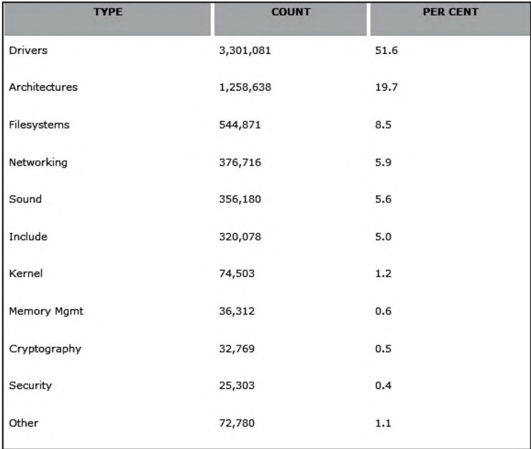

# 内核代码框架类型

以下是Linux内核各代码类型的功能和作用详解（按代码量降序排列）：

1. **Drivers（驱动程序）51.6%**
   • **核心作用**：作为硬件与操作系统之间的翻译层，支持超过3,000种硬件设备
   • **细分功能**：包含显卡驱动（DRM子系统）、存储控制器驱动、USB设备驱动等
   • **重要性**：占比过半体现Linux对硬件生态的广泛兼容性，支持从嵌入式设备到超级计算机

2. **Architectures（架构支持）19.7%**
   • **核心作用**：为不同CPU架构提供指令集适配
   • **覆盖架构**：x86_64（PC）、ARM（移动设备）、RISC-V（新兴开源架构）等30+架构
   • **关键组件**：包含架构专属的中断处理、内存页表管理、电源管理等

3. **Filesystems（文件系统）8.5%**
   • **核心功能**：实现数据存储抽象层
   • **支持格式**：ext4（默认）、Btrfs（高级特性）、FUSE（用户态文件系统）等50+文件系统
   • **特殊机制**：日志系统（保证数据一致性）、虚拟文件系统（VFS）抽象层

4. **Networking（网络）5.9%**
   • **协议栈**：完整实现TCP/IP协议族（IPv4/IPv6）
   • **高级功能**：QoS流量控制、Netfilter防火墙（iptables/nftables基础）
   • **虚拟网络**：支持容器网络（veth pair）、虚拟交换机（bridge）等

5. **Sound（音频）5.6%**
   • **核心架构**：ALSA（Advanced Linux Sound Architecture）
   • **驱动支持**：从板载声卡到专业音频接口
   • **功能扩展**：支持混音、多声道输出、低延迟处理

6. **Include（头文件）5.0%**
   • **核心作用**：定义内核API和数据结构
   • **重要内容**：系统调用接口、内核模块开发所需宏定义
   • **跨平台性**：包含架构专属头文件（如asm/目录）

7. **Kernel（核心功能）1.2%**
   • **基础模块**：
     ◦ 进程调度（CFS调度器）
     ◦ 中断处理（IRQ子系统）
     ◦ 时间管理（高精度定时器）
     ◦ 同步机制（自旋锁、信号量）
   • **设计特点**：虽然代码量少，但通过宏和架构相关代码扩展功能

8. **Memory Management（内存管理）0.6%**
   • **核心机制**：
     ◦ 虚拟内存管理（页表/MMU）
     ◦ SLAB/SLUB内存分配器
     ◦ 内存回收（kswapd守护进程）
   • **高级特性**：透明大页（THP）、内存压缩（zswap）

9. **Cryptography（加密）0.5%**
   • **算法实现**：AES、SHA系列等标准加密算法
   • **应用场景**：磁盘加密（dm-crypt）、TLS协议支持
   • **硬件加速**：集成Intel AES-NI等指令集优化

10. **Security（安全）0.4%**
    ◦ **主要模块**：
      ◦ SELinux（强制访问控制）
      ◦ AppArmor（应用沙盒）
      ◦ 能力机制（Capabilities）
    ◦ **新特性**：Landlock安全沙盒（5.13+）

11. **Other（其他）1.1%**
    ◦ **包含内容**：
      ◦ 内核文档（Documentation/）
      ◦ 调试工具（ftrace/kprobes）
      ◦ 测试框架（kselftest）
    ◦ **特殊模块**：虚拟化支持（KVM）、实时补丁（livepatch）

**架构特点**：这种分布体现了Linux的模块化设计——通过大量驱动程序保持硬件兼容性，用相对精简的核心代码（Kernel+Memory共1.8%）实现基础功能，通过架构支持层实现跨平台能力。各子系统通过清晰的接口分层协作，既保证了稳定性，又为功能扩展提供了可能。


# 当下linux学习建议
你的技术基础和学习动力都很不错！结合你的现状，我为你设计了一个进阶学习路线，并推荐适配最新内核版本的资源，分为三个阶段：

第一阶段：核心子系统深度解构（3-4个月）
1. 源码阅读方法论
• 使用Linux Cross Reference (https://elixir.bootlin.com/) 实时查看6.x内核代码

• 掌握`cscope`+`ctags`源码分析工具链

• 学习内核代码规范（Documentation/process/coding-style.rst）


2. 现代内核关键机制
• 进程调度：CFS调度器+EEVDF新算法（kernel/sched/）

• 内存管理：SLUB分配器、透明大页、memory cgroups

• 文件系统：Btrfs特性、FUSE框架、新的EROFS

• 网络栈：eBPF技术、XDP加速框架


推荐资源：
• 《Linux Kernel Development》第三版（覆盖到5.x内核）

• 官方内核文档（Documentation/）


第二阶段：代码级深度分析（4-6个月）
1. 模块化学习法
• 设备驱动：编写符合最新字符设备框架的驱动（参考drivers/char/）

• 中断处理：学习基于IRQ domains的新中断子系统

• 同步机制：RCU锁的增强实现、seqlock优化技巧


2. 内核调试黑科技
• 使用KGDB进行双机调试

• ftrace动态追踪（尤其是eBPF的整合使用）

• KASAN内存检测工具实战


推荐项目：
• 在QEMU中模拟ARM64架构启动最新内核

• 为Rust编写的内核模块开发兼容层（drivers/char/rust/）


第三阶段：参与内核开发实战（持续）
1. 社区准入训练
• 学习内核邮件列表礼仪（subsystem-maintainer关系图）

• 掌握git send-email的补丁提交方式

• 研究MAINTAINERS文件中的责任链


2. 实战切入点推荐
• drivers/staging/ 目录下的半成品驱动

• 内核测试框架（kselftest, kunit）

• 性能优化类issue（如调度延迟优化）


推荐平台：
• Linux Kernel Mentorship Program（官方导师项目）

• Outreachy开源实习计划


版本适配技巧
1. 使用`git blame`追踪代码演进历史，比如：
```bash
git log -L 100,200:kernel/sched/core.c
```
2. 关注内核峰会资料（https://lwn.net/Kernel/）
3. 订阅LWN.net的每周内核报告（尤其注意Merge Window的新特性）

推荐实验室级工具链
1. 开发环境：CLion+KGDB插件
2. 性能分析：perf + FlameGraph可视化
3. 虚拟化：QEMU的KVM加速模式（需开启Intel VT-d/AMD-Vi）

建议每周保持至少10小时的源码阅读时间，先从某个具体子系统（如进程调度）纵向突破。可以尝试给LKML发送第一个RFC补丁作为阶段目标，即使最终不被合并，这个过程也会让你获得质的提升。保持对https://github.com/torvalds/linux 的每日代码浏览习惯，关注Linus的最新commit动态。


# kernal/sched (调度器核心)

## 进程创建


# mm/ (内存管理)
# net/ (网络协议栈+eBPF)
# drivers/ (设备驱动模型)