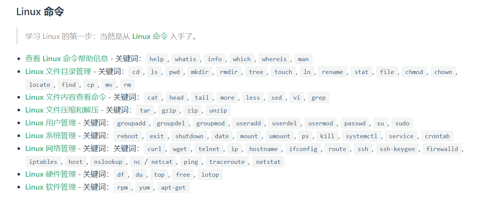
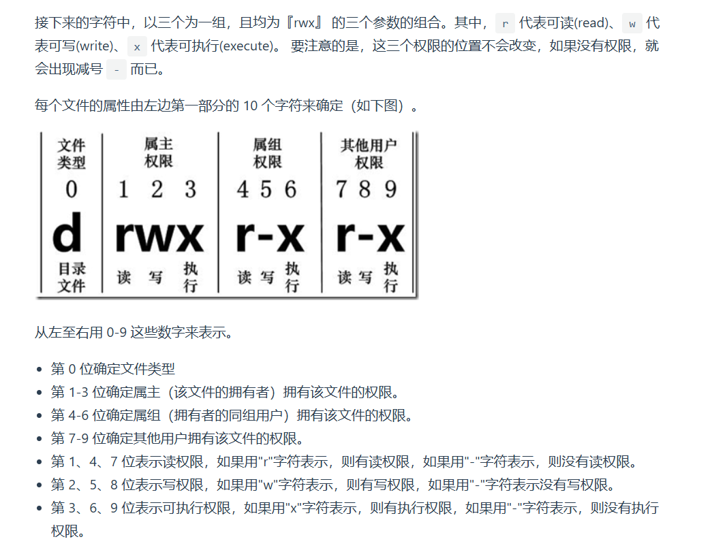

# linux命令


## 文件目录管理
### 文件权限
- r代表可读
- w代表可写
- x代表可执行
- -代表无该权限


### 目录管理类命令
#### cd
```shell
cd          # 切换到用户主目录
cd ~        # 切换到用户主目录
cd -        # 切换到上一个工作目录
cd ..       # 切换到上级目录
cd ../..    # 切换到上两级目录
```

#### ls
```shell
ls        # 列出当前目录可见文件
ls -l     # 列出当前目录可见文件详细信息
ls -la    # 列出所有文件（包括隐藏）的详细信息
ls -lh    # 列出详细信息并以可读大小显示文件大小
ls -lt    # 按时间列出文件和文件夹详细信息
ls -ltr   # 按修改时间列出文件和文件夹详细信息
ls --color=auto     # 列出文件并标记颜色分类
```

#### pwd
显示**当前目录的绝对路径**

#### mkdir & rmdir

#### tree
#### touch
#### ln
默认是硬连接


### 文件管理类命令

### 目录和文件通用命令

## 系统管理
### ps
`ps` 命令用于查看系统中运行的进程信息。它有许多参数，以下是常用参数及其作用：

---

#### **1. `ps` 命令的基本格式**
```bash
ps [选项]
```

**常用的参数可以分为以下几类：**

- **显示模式**
- **筛选进程**
- **排序方式**
- **格式化输出**

---

#### **2. `ps` 常用参数**
 **(1) 显示进程**
| 参数 | 作用 |
|------|------|
| `-a` | 显示所有终端上的进程（不包括会话组长） |
| `-e` | 显示所有进程（等价于 `ps -A`） |
| `-A` | 显示所有进程 |
| `-x` | 显示无控制终端的进程（后台进程） |
| `-u 用户名` | 显示指定用户的进程 |
| `-U 用户名` | 显示指定用户的所有进程，包括子进程 |
| `-t 终端号` | 仅显示在某个终端运行的进程 |

 **示例**
```bash
ps -e        # 查看所有进程
ps -u root   # 查看 root 用户的进程
ps -t tty1   # 查看在 tty1 终端上运行的进程
```

---

 **(2) 进程状态筛选**
| 参数 | 作用 |
|------|------|
| `-N` | 显示**除**指定进程外的所有进程 |
| `-C 进程名` | 按进程名查找进程 |
| `-p PID` | 按 PID 查找进程 |
| `--ppid 父PID` | 按父进程 ID 查找进程 |
| `--sid 进程组ID` | 按会话 ID 查找进程 |

 **示例**
```bash
ps -C nginx   # 查找 nginx 进程
ps -p 1234    # 查找 PID 为 1234 的进程
ps --ppid 5678 # 查找父进程 ID 为 5678 的进程
```

---

 **(3) 格式化输出**
| 参数 | 作用 |
|------|------|
| `-f` | 以完整格式显示进程信息（包含 PPID、UID 等） |
| `-l` | 以长格式显示进程信息 |
| `-o 字段` | 指定显示的列 |
| `-H` | 以**层级结构**（树状）显示进程 |
| `--sort 字段` | 按指定字段排序 |
 **示例**
```bash
ps -ef       # 以完整格式显示所有进程
ps -o pid,cmd,%cpu,%mem  # 仅显示指定列
ps -H        # 以层级结构显示进程
ps --sort=-%cpu  # 按 CPU 使用率降序排列
```

---

 **(4) 组合用法**
| 参数 | 作用 |
|------|------|
| `aux` | 显示所有用户的进程，包括后台进程 |
| `-ef` | 以完整格式显示所有进程 |
| `axjf` | 以**树状结构**显示所有进程 |
| `-e --format=pid,comm,%cpu,%mem,start_time` | 指定显示格式 |

 **示例**
```bash
ps aux        # 查看所有用户的进程
ps -ef        # 详细查看所有进程
ps axjf       # 以树状结构显示所有进程
ps -eo pid,cmd,%cpu,%mem --sort=-%cpu  # 按 CPU 占用率排序
```

---

#### **3. `ps` 与 `top` 的区别**
| 命令 | 作用 |
|------|------|
| `ps` | **静态** 显示进程信息（某一刻的快照） |
| `top` | **动态** 显示进程信息（实时更新） |

---

#### **4. `ps` 常见用法总结**
 **① 查看所有进程**
```bash
ps -e
ps aux
ps -ef
```

 **② 查看某个用户的进程**
```bash
ps -u root
ps -U www-data
```

 **③ 按名称查找进程**
```bash
ps -C nginx
```

 **④ 按 PID 查找进程**
```bash
ps -p 1234
```

 **⑤ 以树状结构显示进程**
```bash
ps -H
ps axjf
```

 **⑥ 只显示某些列**
```bash
ps -eo pid,cmd,%cpu,%mem --sort=-%cpu
```

---

`ps` 命令用于获取进程快照，而 `top` 适用于实时监控。你想查找哪类进程的信息？😊


## 如何看top命令
`top` 命令是 Linux 系统中用于实时显示系统运行状况的工具，它会显示系统中各个进程的资源占用情况。执行 `top` 命令后，会显示如下输出内容。接下来我将解释每个部分。

---

### **`top` 命令输出结构**

```bash
top - 15:35:34 up 5 days,  3:12,  2 users,  load average: 0.23, 0.19, 0.17
Tasks: 205 total,   1 running,  204 sleeping,   0 stopped,   0 zombie
%Cpu(s):  1.3 us,  0.5 sy,  0.0 ni, 97.3 id,  0.5 wa,  0.0 hi,  0.1 si,  0.0 st
MiB Mem :  16384.0 total,   2301.1 free,   7434.0 used,   6648.9 buff/cache
MiB Swap:   2048.0 total,   2048.0 free,      0.0 used.   8062.7 avail Mem 
```

---

### **1. 系统信息**

```
top - 15:35:34 up 5 days,  3:12,  2 users,  load average: 0.23, 0.19, 0.17
```
- **15:35:34**：系统当前时间。
- **up 5 days, 3:12**：系统已经运行了 5 天 3 小时 12 分钟。
- **2 users**：当前登录系统的用户数量。
- **load average**：过去 1 分钟、5 分钟和 15 分钟的系统负载平均值。它是 CPU 正在处理的进程数的平均值。

---

### **2. 任务信息**

```
Tasks: 205 total,   1 running,  204 sleeping,   0 stopped,   0 zombie
```
- **205 total**：系统中总共的任务（进程）数量。
- **1 running**：当前正在运行的进程数量。
- **204 sleeping**：当前处于休眠状态的进程数量。
- **0 stopped**：被停止的进程数量。
- **0 zombie**：僵尸进程的数量（已经终止，但仍占用系统资源的进程）。

---

### **3. CPU 使用情况**

```
%Cpu(s):  1.3 us,  0.5 sy,  0.0 ni, 97.3 id,  0.5 wa,  0.0 hi,  0.1 si,  0.0 st
```
- **1.3 us**：用户态（user space）进程所占 CPU 百分比。
- **0.5 sy**：内核态（kernel space）进程所占 CPU 百分比。
- **0.0 ni**：优先级改变的进程（nice值进程）所占 CPU 百分比。
- **97.3 id**：CPU 空闲的百分比。
- **0.5 wa**：等待输入/输出的进程所占 CPU 百分比。
- **0.0 hi**：硬中断（hardware interrupt）占用的 CPU 百分比。
- **0.1 si**：软中断（software interrupt）占用的 CPU 百分比。
- **0.0 st**：虚拟化系统中的 CPU 时间占用百分比（stolen time），即被虚拟机抢占的 CPU 时间。

---

### **4. 内存使用情况**

```
MiB Mem :  16384.0 total,   2301.1 free,   7434.0 used,   6648.9 buff/cache
```
- **16384.0 total**：系统总内存。
- **2301.1 free**：当前空闲内存。
- **7434.0 used**：已使用内存。
- **6648.9 buff/cache**：缓冲区和缓存占用的内存。此部分内存可以动态回收供其他进程使用。

---

### **5. 交换空间使用情况（Swap）**

```
MiB Swap:   2048.0 total,   2048.0 free,      0.0 used.   8062.7 avail Mem
```
- **2048.0 total**：系统总交换空间（swap）。
- **2048.0 free**：剩余的交换空间。
- **0.0 used**：已使用的交换空间。
- **8062.7 avail Mem**：当前可用的内存（包括空闲内存和缓冲区缓存内存）。

---

### **6. 进程列表**
接下来，`top` 命令会列出系统中的进程列表。每个进程信息包含如下内容：
```
PID  USER      PR  NI    VIRT    RES    SHR S  %CPU %MEM     TIME+ COMMAND
2273 nihao     20   0  204044  32084  23512 S   5.6  0.2   1:29.30 myprogram
```

- **PID**：进程 ID。
- **USER**：进程所属用户。
- **PR**：进程的优先级（priority）。
- **NI**：进程的“nice”值，决定了进程的优先级。
- **VIRT**：进程占用的虚拟内存大小。
- **RES**：进程占用的常驻内存（RAM）大小。
- **SHR**：进程共享的内存大小。
- **S**：进程的状态（S = sleeping，R = running，Z = zombie 等）。
- **%CPU**：进程占用的 CPU 百分比。
- **%MEM**：进程占用的物理内存百分比。
- **TIME+**：进程占用的 CPU 时间总量。
- **COMMAND**：进程的命令名称。

---

### **7. 快捷键**
在 `top` 命令运行时，你可以按下以下键进行交互式操作：
- **P**：按 CPU 使用率排序进程。
- **M**：按内存使用排序进程。
- **N**：按进程号排序。
- **T**：按时间排序。
- **k**：终止某个进程（需要输入 PID）。
- **q**：退出 `top`。

---

### **8. 总结**
- **系统信息**：显示系统负载、运行时间、用户信息等。
- **任务信息**：显示进程的数量和状态。
- **CPU 使用情况**：显示各项 CPU 占用的比例。
- **内存和交换空间**：显示内存和交换区的使用情况。
- **进程列表**：列出当前系统中的进程及其资源使用情况。

`top` 命令非常强大，可以帮助你实时监控和诊断系统性能。如果有具体的需求或者问题，随时告诉我，我可以提供更详细的帮助。


## 网络管理
### netstat 命令全用法

`netstat` 是一个用于显示网络连接、路由表、接口统计信息等的命令。

---

#### **1. 基本语法**
```bash
netstat [选项]
```

---

#### **2. 常见选项**
| 选项 | 作用 |
|------|------|
| `-a` | 显示所有连接（包括监听和非监听的） |
| `-t` | 仅显示 TCP 连接 |
| `-u` | 仅显示 UDP 连接 |
| `-n` | 以数字格式显示地址和端口 |
| `-p` | 显示进程 ID（PID）和进程名称 |
| `-l` | 仅显示监听中的端口 |
| `-r` | 显示路由表 |
| `-s` | 显示网络统计信息 |
| `-c` | 每隔一段时间刷新显示 |

---

#### **3. 常见用法**

 **(1) 显示所有网络连接**
```bash
netstat -a
```
显示所有 **TCP** 和 **UDP** 的连接状态。

---

 **(2) 仅显示 TCP 连接**
```bash
netstat -at
```
仅显示 TCP 连接。

---

 **(3) 仅显示 UDP 连接**
```bash
netstat -au
```
仅显示 UDP 连接。

---

 **(4) 以数字格式显示 IP 和端口**
```bash
netstat -an
```
防止 `netstat` 解析主机名，直接显示 IP 地址和端口号，加快执行速度。

---
 **(5) 显示监听中的端口**
```bash
netstat -ln
```
仅显示监听状态（`LISTEN`）的端口。

---

 **(6) 显示进程对应的网络连接**
```bash
netstat -tp
```
会显示连接对应的进程名和 PID（需要 `sudo` 权限）。

---

 **(7) 显示当前系统的路由表**
```bash
netstat -r
```
类似于 `route -n` 命令，查看路由信息。

---

 **(8) 显示网络统计信息**
```bash
netstat -s
```
查看 TCP、UDP、ICMP、IP 的统计数据。

---

 **(9) 持续刷新网络连接状态**
```bash
netstat -c
```
每秒刷新 `netstat` 输出，类似 `top` 命令的实时显示。

---

 **(10) 统计不同协议的数据包数量**
```bash
netstat -s | grep -i tcp
```
仅查看 TCP 统计信息。

```bash
netstat -s | grep -i udp
```
仅查看 UDP 统计信息。

---

 **(11) 统计某个端口的连接数**
```bash
netstat -an | grep :80 | wc -l
```
统计 **80 端口（HTTP）** 的连接数。

---

 **(12) 找出占用某个端口的进程**
```bash
netstat -anp | grep :9006
```
查看 **9006 端口** 被哪个进程占用（需要 `sudo` 权限）。

---

#### **4. `ss` 替代 `netstat`**
`netstat` 在部分 Linux 发行版（如 Ubuntu 18.04+）已经被 `ss` 替代，使用 `ss` 命令查看网络连接更高效：
```bash
ss -tulnp
```
相当于 `netstat -tulnp`，显示当前监听的端口及进程。

---

#### **5. 总结**
- `netstat -an` → 显示所有网络连接  
- `netstat -tulnp` → 显示监听端口和进程  
- `netstat -s` → 显示协议统计信息  
- `netstat -r` → 显示路由表  
- `netstat -tp` → 显示连接对应的进程  

如果 `netstat` 不可用，可以使用 `ss` 作为替代：
```bash
ss -tulnp
```


## 硬件管理


# 程序CPU占用率高如何排查
当程序 CPU 利用率过高时，我们可以通过以下步骤进行排查和优化：

---

## **1. 快速确认 CPU 占用高的进程**
首先，我们需要找到哪个进程在消耗 CPU 资源。

### **（1）使用 `top` 或 `htop` 命令**
```bash
top -o %CPU
```
或者使用 `htop`（如果已安装）：
```bash
htop
```
在 `top` 或 `htop` 界面：
- **按 `P` 键**：按 CPU 使用率排序。
- **按 `1` 键**：查看每个 CPU 核心的使用情况。
- **记下 PID**，以便进一步分析。

### **（2）使用 `ps` 命令**
如果想在命令行直接查找 CPU 占用最高的进程：
```bash
ps aux --sort=-%cpu | head -10
```
输出示例：
```
USER       PID  %CPU %MEM    VSZ   RSS TTY      STAT START   TIME COMMAND
root      1234  98.5  0.2  22548  1024 ?        R    08:30  20:12 ./my_program
user1     2345  45.3  2.1 123456 56789 ?        R    09:00   3:25 firefox
```
> **PID 1234** 的程序 `./my_program` 消耗了 **98.5% CPU**，说明这个进程需要重点排查。

---

## **2. 确认程序的 CPU 使用情况**
### **（1）检查线程 CPU 使用情况**
```bash
top -H -p <PID>
```
这个命令会显示某个进程下所有线程的 CPU 占用情况，可以帮助我们找出具体哪个线程在消耗 CPU。

### **（2）使用 `pidstat` 查看线程详情**
```bash
pidstat -p <PID> -t 1
```
这个命令每秒刷新一次，显示该进程的线程 CPU 负载情况。

如果 `pidstat` 没有安装，可以使用：
```bash
sudo apt install sysstat   # Ubuntu/Debian
sudo yum install sysstat   # CentOS
```

### **（3）查看 CPU 负载**
如果系统整体 CPU 负载高，查看 1、5、15 分钟的平均负载：
```bash
uptime
```
或者：
```bash
cat /proc/loadavg
```
示例输出：
```
1.20  1.15  0.98  3/128  4567
```
如果 `1.20`（最近 1 分钟）远高于 `0.98`（最近 15 分钟），说明系统可能刚刚出现了 CPU 占用异常。

---

## **3. 定位具体函数或代码**
如果程序是自己开发的，可以用 **`perf`、`strace`、`gdb` 等工具** 进一步分析。

### **（1）使用 `perf` 采样**
```bash
sudo perf top
```
可以实时查看消耗 CPU 最多的函数。

要对某个进程进行分析：
```bash
sudo perf record -F 99 -p <PID> -g -- sleep 5
sudo perf report
```
> 这会记录进程 `<PID>` 在 5 秒内的 CPU 使用情况，并用 `perf report` 分析。

### **（2）使用 `strace` 监控系统调用**
如果 CPU 占用高，可能是程序进入了 **死循环** 或频繁执行 **系统调用**。
```bash
sudo strace -p <PID>
```
或者：
```bash
sudo strace -c -p <PID>
```
如果 `read()`、`write()`、`poll()`、`futex()` 等系统调用占用过多，可能是：
- **IO 过多**（不断读写文件、数据库）。
- **线程同步问题**（如 `futex()` 过多，可能是锁竞争）。

### **（3）使用 `gdb` 查看调用栈**
如果程序卡住不动，可以用 `gdb` 查看：
```bash
gdb -p <PID>
bt   # 查看调用栈
```
> 如果 `bt` 显示的是某个死循环的函数，说明这个函数可能是 CPU 负载高的原因。

---

## **4. 可能的原因及优化方案**
| **可能原因** | **排查方法** | **优化方案** |
|-------------|------------|------------|
| **死循环** | `perf top` / `gdb` / `strace` | 检查代码逻辑，添加 `sleep()` 或 `usleep()` 降低 CPU 占用 |
| **线程过多** | `top -H` / `pidstat` | 减少线程数量，使用线程池 |
| **锁竞争** | `strace` (`futex()` 过多) | 采用 **无锁数据结构** 或 **减少临界区** |
| **IO 过多** | `strace` (`read()`/`write()` 频繁) | 批量 IO 操作，使用 **缓存**，减少磁盘访问 |
| **数据库查询慢** | `mysql-slow.log` / `pg_stat_activity` | 添加 **索引**，优化 SQL 语句 |
| **垃圾回收** | `perf top` (`gc` 相关函数占用 CPU) | 减少临时对象，优化内存分配 |
| **内核态 CPU 占用高** | `mpstat` / `perf` (`sys` 占比高) | 可能是内核 bug，或者驱动/系统调用过多 |

---

## **5. 限制高 CPU 进程（临时措施）**
如果 CPU 负载过高，影响了其他任务，可以暂时降低该进程的 CPU 占用：
### **（1）降低进程优先级**
```bash
renice 10 -p <PID>
```
**`10` 的数值越大，优先级越低**（`-20` 最高，`19` 最低）。

### **（2）使用 `cpulimit` 限制 CPU**
```bash
sudo apt install cpulimit  # 安装
sudo cpulimit -p <PID> -l 50  # 限制进程 CPU 占用不超过 50%
```

### **（3）绑定进程到指定 CPU**
如果不想让某个进程占满所有 CPU，可以让它只运行在某个 CPU 上：
```bash
taskset -c 0,1 ./my_program
```
这样程序只能使用 CPU 0 和 CPU 1。

---

## **6. 总结**
### **（1）快速排查**
```bash
top -o %CPU               # 找到高 CPU 进程
top -H -p <PID>           # 查看进程的线程 CPU 占用
ps aux --sort=-%cpu | head -10  # 列出最耗 CPU 的进程
pidstat -p <PID> -t 1     # 查看线程 CPU 占用情况
```

### **（2）深入分析**
```bash
perf top                  # 实时分析 CPU 消耗最多的函数
sudo perf record -F 99 -p <PID> -g -- sleep 5
sudo perf report          # 生成 CPU 采样报告

strace -p <PID>           # 查看系统调用
gdb -p <PID>              # 查看调用栈
```

### **（3）优化方案**
- **死循环** ➝ 添加 `sleep()` 降低 CPU 占用
- **锁竞争** ➝ 优化并发逻辑，使用无锁数据结构
- **IO 过多** ➝ 使用缓存，减少磁盘访问
- **数据库查询慢** ➝ 添加索引，优化 SQL
- **垃圾回收** ➝ 减少临时对象，优化内存管理

---

通过以上方法，你可以快速排查并优化 CPU 高占用的问题。如果你遇到了具体的问题，可以提供 `top` 或 `perf` 的输出，我可以帮你进一步分析！😃

# perf性能分析工具
## **`perf` 命令简介**
`perf`（Performance Counters for Linux）是 Linux 内核自带的性能分析工具，可以用于 **CPU 采样、热点分析、系统调用跟踪**，适用于分析高 CPU 占用、性能瓶颈、锁竞争、缓存命中率等问题。

### **`perf` 主要应用场景**
| **应用场景** | **常用命令** |
|-------------|-------------|
| **找出 CPU 占用高的函数** | `perf top` |
| **分析进程 CPU 占用** | `perf record -p <PID> -- sleep 5` + `perf report` |
| **查看系统调用频率** | `perf stat -p <PID>` |
| **分析锁竞争（futex）** | `perf lock record -p <PID>` |
| **检查 CPU 分支预测失败** | `perf record -e branch-misses -p <PID>` |
| **分析硬件缓存命中率** | `perf record -e cache-misses -p <PID>` |
| **跟踪函数调用（火焰图）** | `perf script` + `FlameGraph` |

---

## **1. `perf top`：实时查看 CPU 热点**
类似 `top`，但显示 **CPU 正在执行的函数**，用于分析哪个函数最耗 CPU。

```bash
sudo perf top
```
示例输出：
```
Overhead  Symbol
  40.12%   [kernel] 
  20.08%   my_program [my_func()]
  10.22%   libc.so.6 [memcpy()]
```
> **解释**：
> - `my_func()` 占 **20.08%** CPU，可能是性能瓶颈。
> - `memcpy()` 占 **10.22%**，可能是数据拷贝太多。

---

## **2. `perf stat`：统计进程的 CPU 指标**
用于 **监控 CPU 指令执行情况**，包括分支预测失败、L1/L2 缓存命中率等。

```bash
sudo perf stat -p <PID>
```
示例输出：
```
 Performance counter stats for process <PID>:

    500.12 msec task-clock                # 0.500 CPUs utilized
         10,202 context-switches          #  20.2 K/sec
          1,203 page-faults               #  2.4 K/sec
  1,002,345,678 cycles                    #  2.0 GHz CPU
    345,678,910 instructions              #  0.34 insns per cycle
      3,456,789 branch-misses             #  10% of all branches
```
> - **`instructions per cycle (IPC)`**：越高越好（低于 1.0 可能有瓶颈）。
> - **`branch-misses`（分支预测失败率）**：高的话，可能是代码逻辑跳转过多。
> - **`context-switches`（上下文切换）**：如果过多，可能有线程竞争。

---

## **3. `perf record` + `perf report`：进程 CPU 采样**
如果想深入分析 **某个进程的 CPU 负载**，可以使用 `perf record` 进行采样，再用 `perf report` 分析。

```bash
sudo perf record -p <PID> -- sleep 5
sudo perf report
```
示例输出：
```
Overhead  Symbol
  35.12%   my_program [my_func()]
  15.30%   [kernel] __schedule()
  10.10%   [unknown] [libc.so.6]
```
> - **35.12%** 在 `my_func()`，说明这个函数可能是性能瓶颈。
> - **15.30% 在 `__schedule()`**，可能是线程切换太频繁。

---

## **4. `perf script` + 火焰图（FlameGraph）**
如果 `perf report` 不够直观，可以生成 **火焰图** 来可视化 CPU 采样数据。

```bash
# 1. 采样
sudo perf record -F 99 -p <PID> -g -- sleep 5
# 2. 生成数据
sudo perf script > out.perf
# 3. 转换为火焰图
git clone https://github.com/brendangregg/FlameGraph.git
cd FlameGraph
./stackcollapse-perf.pl < ../out.perf | ./flamegraph.pl > flamegraph.svg
```
然后用浏览器打开 `flamegraph.svg`，直观查看哪些函数消耗最多 CPU。

---

## **5. `perf lock`：分析锁竞争**
如果程序使用了多线程，可能会遇到 **锁竞争** 问题，导致线程等待时间过长。

```bash
sudo perf lock record -p <PID> -- sleep 5
sudo perf lock report
```
示例输出：
```
       contended   total wait  max wait  avg wait  function
       200        500ms       50ms      2.5ms     pthread_mutex_lock()
```
> **如果 `pthread_mutex_lock()` 的等待时间过长**，说明线程锁争用严重，可以优化锁的使用方式。

---

## **6. `perf probe`：动态跟踪函数**
如果想监控某个函数的执行时间，可以使用 `perf probe` 添加探测点。

```bash
sudo perf probe -x ./my_program main
sudo perf record -e probe_my_program:main -p <PID>
```
> 这样可以跟踪 `main()` 的调用次数。

---

## **总结**
| **功能** | **命令** | **用途** |
|----------|----------|----------|
| **实时 CPU 热点** | `perf top` | 找出 CPU 占用最高的函数 |
| **统计 CPU 指标** | `perf stat -p <PID>` | 监控指令执行率、缓存命中率 |
| **CPU 采样分析** | `perf record -p <PID> -- sleep 5` + `perf report` | 找出 CPU 负载最高的函数 |
| **火焰图** | `perf script` + `FlameGraph` | 可视化 CPU 采样数据 |
| **锁竞争分析** | `perf lock record -p <PID>` + `perf lock report` | 检查 `pthread_mutex_lock()` 等锁的争用情况 |
| **函数跟踪** | `perf probe` | 监测特定函数的调用 |

`perf` 是一个非常强大的工具，可以用于 **程序优化、CPU 诊断、锁竞争分析**。如果你遇到具体的性能问题，可以提供 `perf` 的输出，我可以帮你进一步分析！😃


# gdb调试
## 使用方法
GDB（GNU Debugger）是 Linux 下最常用的 C/C++ 调试工具，掌握 GDB 能大大提升调试效率。

---

### **1. GDB 调试基础**
#### **(1) 编译时加 `-g` 选项**
在使用 GDB 调试前，代码需要编译时加 `-g` 选项，否则调试信息会缺失：
```bash
g++ -g -o myprogram myprogram.cpp
```
或者：
```bash
gcc -g -o myprogram myprogram.c
```
---

#### **(2) 启动 GDB**
```bash
gdb ./myprogram
```
如果想要直接附加参数：
```bash
gdb --args ./myprogram arg1 arg2
```

---

### **2. GDB 常见命令**
| **类别** | **命令** | **作用** |
|---------|---------|--------|
| **运行程序** | `run` (`r`) | 启动程序 |
| | `run arg1 arg2` | 运行并传递参数 |
| | `start` | 启动并停在 `main()` |
| **断点** | `break 行号` (`b 行号`) | 在指定行设置断点 |
| | `break 函数名` | 在函数入口设置断点 |
| | `break 文件:行号` | 在指定文件的某行设置断点 |
| | `info break` (`i b`) | 查看所有断点 |
| | `delete 断点号` | 删除指定断点 |
| **单步调试** | `next` (`n`) | 逐行执行（不进入函数） |
| | `step` (`s`) | 逐行执行（进入函数） |
| | `continue` (`c`) | 继续运行 |
| | `finish` | 运行完当前函数并返回 |
| | `until 行号` | 运行到指定行 |
| **查看变量** | `print 变量` (`p 变量`) | 打印变量值 |
| | `display 变量` | 运行时持续显示变量 |
| | `set var 变量=值` | 修改变量值 |
| | `watch 变量` | 监视变量变化 |
| | `info locals` | 显示当前作用域的变量 |
| **栈信息** | `backtrace` (`bt`) | 查看调用栈 |
| | `frame` (`f`) | 切换到指定栈帧 |
| | `info frame` | 查看当前栈帧信息 |
| **调试多线程** | `info threads` | 查看所有线程 |
| | `thread 线程号` | 切换到指定线程 |
| | `break 函数名 thread 线程号` | 在特定线程的某函数设断点 |
| **附加进程** | `gdb -p 进程ID` | 附加到进程 |
| | `detach` | 断开调试但不中止进程 |
| **退出 GDB** | `quit` (`q`) | 退出 GDB |

---

### **3. GDB 常见调试场景**
#### **(1) 调试程序崩溃**
如果程序崩溃，GDB 可以帮助找出错误位置：
```bash
gdb ./myprogram core
bt  # 查看调用栈
```

---

#### **(2) 运行时附加进程调试**
如果程序已经运行，可以用 `gdb -p` 附加：
```bash
ps aux | grep myprogram  # 找到进程 ID
gdb -p 1234  # 1234 是进程 ID
```

---

#### **(3) 设置条件断点**
```bash
break myfile.cpp:30 if x == 5  # 只有 x==5 时才触发断点
```

---

#### **(4) 查看汇编代码**
```bash
disassemble main  # 反汇编 main 函数
```
---

### **4. GDB 进阶技巧**
#### **(1) GDB 批量调试脚本**
GDB 支持 `.gdbinit` 自动加载脚本，比如：
```bash
break main
run
info locals
```
可以写入 `gdb_commands.txt`，然后执行：
```bash
gdb -x gdb_commands.txt ./myprogram
```

---

#### **(2) 使用 TUI 界面**
```bash
gdb -tui ./myprogram
```
或者在 GDB 里输入：
```bash
layout src  # 显示源码窗口
layout asm  # 显示汇编窗口
```

---

### **5. 学习建议**
1. **从简单到复杂**：先熟练 `run`、`break`、`next`、`step`、`print`，然后学习 `watch`、`attach` 等。
2. **结合 `valgrind` 查找内存错误**：
   ```bash
   valgrind --leak-check=full ./myprogram
   ```
3. **尝试调试不同的程序**：如多线程、动态库、核心转储等。

---

### **总结**
- `gdb` 适用于 **C/C++ 调试**
- `break`、`next`、`step`、`print` 是最常用的命令
- `attach` 和 `core dump` 可用于 **崩溃分析**
- `watch` 变量、`info threads` 可用于 **多线程调试**
- `layout` + `tui` 提供 **图形界面调试**

如果你有特定的调试场景，我可以给你更详细的指导！💡


## 如何使用gdb定位死锁
定位 C++ 中的死锁通常需要使用调试工具，如 **gdb**，这可以帮助你查看程序的线程状态、锁的持有情况，以及是否发生了死锁。死锁的发生通常是由于两个或更多线程相互等待对方释放资源，从而导致无限期阻塞。使用 `gdb` 可以帮助我们排查并定位死锁。

### 死锁的排查步骤

1. **启动程序并附加到进程**：
   使用 `gdb` 启动程序或附加到正在运行的进程上。

   - 启动程序：`gdb ./your_program`
   - 附加到进程：`gdb -p <pid>`

2. **查看线程信息**：
   在 `gdb` 中使用 `info threads` 命令查看程序的所有线程。每个线程都有一个唯一的线程 ID（TID）。

   ```
   (gdb) info threads
   ```

   这会列出程序中的所有线程及其状态。

3. **查看每个线程的堆栈信息**：
   查看每个线程当前的执行位置（堆栈信息），确定线程是否在等待锁。

   ```
   (gdb) thread <tid>
   (gdb) bt
   ```

   - `thread <tid>`：切换到指定的线程。
   - `bt`（backtrace）：显示当前线程的堆栈信息。

   如果一个线程正在等待某个锁，通常它会显示出调用了 `std::mutex::lock` 或类似的同步原语，并且可能在这些地方处于阻塞状态。

4. **检查线程的锁持有情况**：
   使用 `info threads` 可以确定各个线程的状态，确定它们是否被某个锁阻塞。然后可以在死锁的线程上查看它们的持有锁情况。

   - 使用 `gdb` 查看线程栈信息时，注意锁的相关调用（例如 `pthread_mutex_lock` 或 `std::mutex::lock` 等）。
   - 如果线程阻塞在锁上，那么它可能正在等待其他线程释放某个资源。

5. **查找死锁模式**：
   - 一般情况下，死锁会发生在两个或更多的线程相互持有对方所需要的锁。你需要检查哪些线程持有锁，哪些线程在等待锁。
   - 通过查看每个线程的堆栈跟踪和锁信息，找出两个线程在等待对方释放资源的情况。

6. **使用 `std::mutex` 等死锁检测工具**：
   如果使用 `std::mutex` 等 C++11 标准库的同步机制，`gdb` 本身无法直接检测死锁，但可以通过查看线程栈来推测死锁情况。你还可以通过启用 C++ 标准库的调试模式来进一步帮助检测死锁。

7. **打印线程信息和锁持有情况**：
   你也可以在程序中添加额外的日志信息，记录每个线程获取和释放锁的时机。这样在死锁发生时，你可以通过日志更快地定位问题。

8. **使用 `std::lock` 避免死锁**：
   如果你的代码使用多个锁，可以使用 `std::lock` 来确保多个锁在同一时间被正确锁定，从而避免死锁。`std::lock` 可以原子地锁定多个 `mutex`，防止死锁的发生。

### 示例：使用 `gdb` 调试死锁

假设我们有两个线程，它们在相互等待对方的锁：

```cpp
#include <iostream>
#include <mutex>
#include <thread>

std::mutex m1;
std::mutex m2;

void thread1() {
    std::lock_guard<std::mutex> lg1(m1);
    std::this_thread::sleep_for(std::chrono::seconds(1));
    std::lock_guard<std::mutex> lg2(m2);
}

void thread2() {
    std::lock_guard<std::mutex> lg2(m2);
    std::this_thread::sleep_for(std::chrono::seconds(1));
    std::lock_guard<std::mutex> lg1(m1);
}

int main() {
    std::thread t1(thread1);
    std::thread t2(thread2);

    t1.join();
    t2.join();

    return 0;
}
```

假设程序发生了死锁，`thread1` 和 `thread2` 都在等待对方释放锁。你可以使用 `gdb` 来调试这个程序。

1. 编译程序时使用调试信息：
   ```
   g++ -g -std=c++11 deadlock_example.cpp -o deadlock_example -pthread
   ```

2. 启动 `gdb`：
   ```
   gdb ./deadlock_example
   ```

3. 在 `gdb` 中运行程序：
   ```
   (gdb) run
   ```

4. 如果程序死锁，可以按 `Ctrl+C` 停止程序，并查看线程状态：
   ```
   (gdb) info threads

   ```

> (gdb) info threads
  Id   Target Id                                          Frame 
  *1    Thread 0x7ffff7a51740 (LWP 134503) "deadlock_test" __pthread_clockjoin_ex (threadid=140737348175616, thread_return=0x0, clockid=<optimized out>, 
    abstime=<optimized out>, block=<optimized out>)
    at pthread_join_common.c:145
  2    Thread 0x7ffff7a50700 (LWP 134507) "deadlock_test" __lll_lock_wait (
    futex=futex@entry=0x55555555a080 <m2>, private=0) at lowlevellock.c:52
  3    Thread 0x7ffff724f700 (LWP 134508) "deadlock_test" __lll_lock_wait (
    futex=futex@entry=0x55555555a040 <m1>, private=0) at lowlevellock.c:52


   输出可能会显示两个线程（`thread1` 和 `thread2`），它们都在等待对方的锁。

1. 切换到每个线程并查看堆栈信息：
   ```
   (gdb) thread 1
   (gdb) bt
   ```

   ```
   (gdb) thread 2
   (gdb) bt
   ```

   你会看到 `thread1` 正在等待 `m2`，而 `thread2` 正在等待 `m1`，从而形成死锁。

### 小结

- **`gdb` 调试死锁的关键**是查看每个线程的堆栈，确定线程是否在等待锁。
- 使用 `info threads` 查看线程，`bt` 查看堆栈，可以帮助你定位死锁。
- 在多线程编程中使用 `std::lock` 等技术可以避免死锁的发生。

通过这些步骤，你可以利用 `gdb` 来定位并解决 C++ 程序中的死锁问题。


# 查找程序pid的方法
你可以使用以下几种方法来查找正在运行的程序的 **PID（进程 ID）**：

---

### **方法 1：使用 `ps` 命令**
#### **按进程名查找**
```bash
ps aux | grep 进程名
```
例如，查找名为 `my_program` 的进程：
```bash
ps aux | grep my_program
```
- **第一列** 是用户名，第二列就是 **PID**。
- 末尾的 `grep` 进程也会被显示，可以用 `grep -v grep` 过滤掉：
  ```bash
  ps aux | grep my_program | grep -v grep
  ```

#### **按命令行关键字查找**
```bash
ps -ef | grep 关键字
```
例如：
```bash
ps -ef | grep python
```

---

### **方法 2：使用 `pgrep` 命令**
`pgrep` 直接返回 **PID**：
```bash
pgrep 进程名
```
例如：
```bash
pgrep my_program
```
如果进程名不唯一，可以用 `-l` 显示进程名：
```bash
pgrep -l my_program
```

---

### **方法 3：使用 `pidof` 命令**
适用于查找 **单个程序的主进程**：
```bash
pidof 进程名
```
例如：
```bash
pidof firefox
```
**缺点：** `pidof` 只能用于**二进制可执行文件**，无法查找 shell 脚本或 Python 进程。

---

### **方法 4：使用 `lsof`（查看打开的文件）**
如果你知道进程打开的文件（如端口、日志），可以用 `lsof` 查找：
```bash
lsof -i :端口号
```
例如，查找监听 **9006 端口** 的进程：
```bash
lsof -i :9006
```

---

### **方法 5：使用 `top` 或 `htop`**
```bash
top
```
- 找到你的进程，第一列是 **PID**。
- `htop`（更友好）：  
  ```bash
  htop
  ```
  （如果没有安装 `htop`，可以用 `sudo apt install htop` 安装）

---

### **方法 6：使用 `/proc` 目录**
```bash
ls /proc | grep 进程ID
```
或者：
```bash
cat /proc/进程ID/cmdline
```

---

### **总结**
| 方法 | 适用情况 | 示例命令 |
|------|----------|---------|
| `ps aux` | 适用于大多数情况 | `ps aux | grep my_program` |
| `pgrep` | 直接查找进程ID | `pgrep my_program` |
| `pidof` | 查找可执行程序 | `pidof firefox` |
| `lsof -i` | 按端口查找 | `lsof -i :9006` |
| `top/htop` | 交互式查看 | `top` 或 `htop` |

你想查找哪个进程的 PID？我可以帮你优化命令！ 😊


# strace命令
`strace` 是一个强大的调试工具，可以用来跟踪 **进程的系统调用（syscalls）** 和 **信号（signals）**，帮助分析 **程序执行流程**、**I/O 操作**、**网络请求** 以及 **性能瓶颈**。

---

## **1. 基本用法**
### **1.1 运行程序并跟踪系统调用**
```bash
strace ./my_program
```
📌 **适用于：** 直接运行并分析一个程序的系统调用。

---

### **1.2 跟踪已运行的进程**
```bash
strace -p <PID>
```
📌 **适用于：** 分析正在运行的进程，不需要重启。

---

### **1.3 只跟踪特定类型的系统调用**
#### **只跟踪文件相关系统调用**
```bash
strace -e trace=open,read,write,close -p <PID>
```
📌 **适用于：** 检查程序是否 **打开/读取/写入/关闭** 某个文件。

#### **只跟踪网络相关系统调用**
```bash
strace -e trace=network -p <PID>
```
📌 **适用于：** 查看进程是否在 **发送/接收网络数据**。

#### **只跟踪进程管理相关系统调用**
```bash
strace -e trace=process -p <PID>
```
📌 **适用于：** 检查程序是否创建了 **子进程** 或 **进程间通信（IPC）**。

---

## **2. 输出解释**
### **示例**
```bash
strace ls
```
示例输出：
```
execve("/bin/ls", ["ls"], 0x7ffd872f9f30 /* 66 vars */) = 0
brk(NULL)                               = 0x55d9c17ec000
access("/etc/ld.so.nohwcap", F_OK)      = -1 ENOENT (No such file or directory)
openat(AT_FDCWD, "/lib/x86_64-linux-gnu/libc.so.6", O_RDONLY|O_CLOEXEC) = 3
read(3, "\177ELF\002\001\001\003", 832) = 832
...
write(1, "Desktop  Documents  Downloads\n", 30) = 30
exit_group(0)                           = ?
```

📌 **关键点：**
1. **`execve()`** - 执行 `ls` 命令
2. **`openat()`** - 打开共享库
3. **`read()`** - 读取数据
4. **`write()`** - 输出到终端
5. **`exit_group()`** - 进程退出

---

## **3. `strace` 高级用法**
### **3.1 统计系统调用执行时间**
```bash
strace -c ./my_program
```
示例输出：
```
% time     seconds  usecs/call     calls    errors   syscall
------ ----------- ----------- --------- --------- ---------------
 50.00    0.500000       5000       1000        0   read
 30.00    0.300000       3000        500        0   write
 10.00    0.100000       1000        100        5   open
 10.00    0.100000       1000        100        5   close
```
📌 **作用：** 找出 **最耗时** 的系统调用，优化程序性能。

---

### **3.2 记录日志到文件**
```bash
strace -o trace.log -p <PID>
```
📌 **适用于：** 将跟踪结果保存到 `trace.log` 进行分析。

---

### **3.3 解析 `strace` 日志**
如果 `trace.log` 很大，可以用 `grep` 提取关键内容：
```bash
grep open trace.log  # 过滤文件打开操作
grep -E "open|read|write|close" trace.log  # 过滤 I/O 相关调用
```

---

## **4. `strace` 使用场景**
✅ **1. 程序卡住或崩溃**
```bash
strace -p <PID>
```
📌 **查看最后执行的系统调用**，找到卡住的地方。

✅ **2. 程序是否访问了某个文件**
```bash
strace -e trace=open,read,write ./my_program
```
📌 **分析文件读写问题**（权限问题 / 文件找不到）。

✅ **3. 程序是否进行了网络请求**
```bash
strace -e trace=network -p <PID>
```
📌 **检查进程是否在网络中卡住**（DNS 解析 / 连接超时）。

✅ **4. 性能分析**
```bash
strace -c ./my_program
```
📌 **统计每个系统调用的执行次数和耗时，找到性能瓶颈！**

---

## **总结**
| 命令 | 作用 |
|------|------|
| `strace ./my_program` | 运行程序并跟踪系统调用 |
| `strace -p <PID>` | 跟踪正在运行的进程 |
| `strace -e trace=open,read,write -p <PID>` | 只跟踪文件 I/O 调用 |
| `strace -e trace=network -p <PID>` | 只跟踪网络调用 |
| `strace -c ./my_program` | 统计各系统调用执行时间 |
| `strace -o trace.log -p <PID>` | 记录日志到 `trace.log` |

📌 **`strace` 是调试 Linux 进程的强大工具，能快速分析程序的系统调用行为！** 🚀