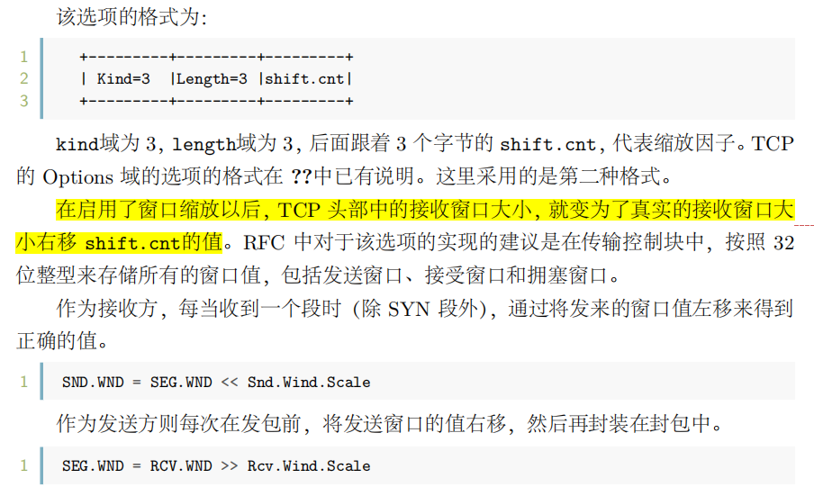
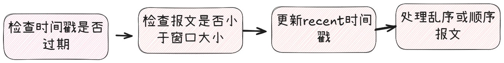
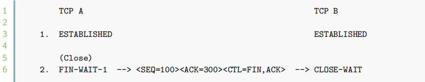
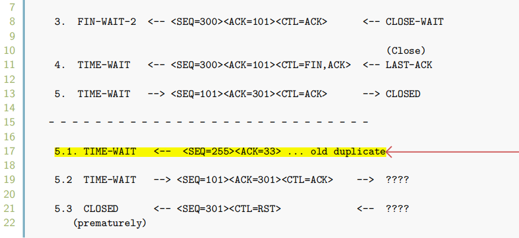

# 《linux 4.4.0内核源码分析TCP实现》--2025.5.13

# 准备部分

## 窗口缩放
在原TCP头部中只有16位（64k）表示窗口大小，为了提高性能，在选项部分进行扩展

## PAWS(Protect Against Wrapped Sequence Numbers)
使用时间戳防止序列号回绕

## TIME-WAIT Assassination(TWA) 现象
> TCP 的连接是由四元组（源 IP 地址，源端口，目的 IP 地址，目的端口）唯一决
定的。但是，存在这样一种情况，当一个 TCP 连接关闭，随后，客户端又使用相同的
IP 和端口号向服务端发起连接，即产生了和之前的连接一模一样的四元组。此时，如果
网络中还存在上一个连接遗留下来的包，就会出现各类的问题。

为了解决TWA现象，有以下几种手段：
1. 三次握手时会拒绝旧的 SYN 段，以避免重复建立连接。
2. 通过判断序列号可以有效地拒绝旧的或者重复的段被错误地接受。
3. 通过选择合适的 ISN(Initial Sequence Number)【随机ISN】 可以避免旧的连接和新的连接的段的序列号空间发生重叠。
4. TIME-WAIT 状态会等待足够长的时间，让旧的滞留在网络上的段因超过其生命周期而消失。
5. 在系统崩溃后，在系统启动时的静默时间可以使旧的段在连接开始前消失。

> 但是解决方案4可能会被意外终止
> 
> 
> ***为什么最后的<SEQ=255><ACK=33>被收到了？？***
> - NAT 环境问题​​：若客户端通过 NAT 共享 IP，且时间戳不同步，可能因 PAWS 失效导致异常报文被接收（）。
> - ​​参数调优风险​​：启用 tcp_tw_recycle 或 tcp_tw_reuse 可能绕过 TIME-WAIT 保护机制，增加旧报文干扰风险（）。
> 
> **为了解决上述问题**
> linux的处理方案是：在**TIME_WAIT**状态时忽略所有的**RST**报文

## 拥塞控制
- 主动队列管理算法（AQM）
- ECN（显式拥塞通知）机制

## TCP fast open

# 网络子系统相关核心数据结构
## sk_buff
