# 绪论


## net_device

net_device 结构体定义网络设备
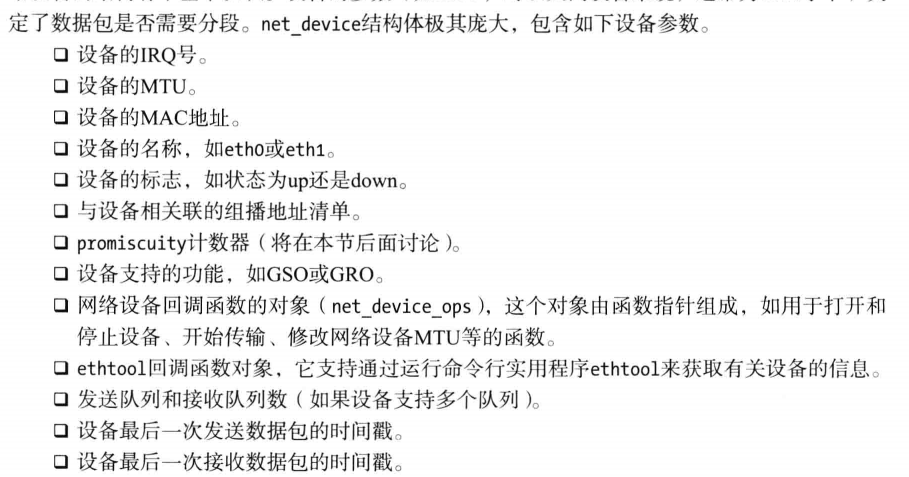
其中`int promiscuity` != 0 时，不会丢弃 dst_ip 非主机 ip 的报文，用于 tcpdump 等嗅探器，每增加一个**嗅探器**`promiscuity--`

### 网络设备中的 NAPI （new api）

### 数据包收发

对于数据包——L2->L3->L4
决定数据包在网络栈中传输的因素：

1. 路由子系统
2. netfilter hook
3. IPsec

### 套接字缓冲区 sk_buff (socket buffer)

# Netlink 套接字

net/netlink 的内核是实现：

- af_netlink.h/c
- genetlink.c
- diag.c

Netlink 可用于用户空间间进程通信，但是**不推荐**

<hr>

netlink 套接字在用户空间和内核空间创建 api
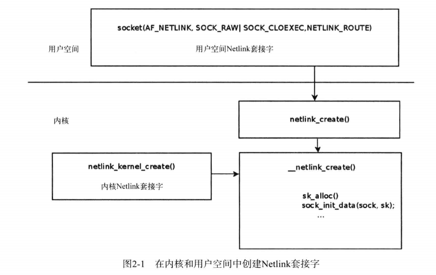

## netlink 类型

你的两个问题我来分别解答：

Netlink 不只有一种，它是一个 **多协议机制**，每种协议负责一种特定功能。协议号是 `NETLINK_*` 宏：

| 协议宏             | 协议号 | 用途描述                                    |
| ------------------ | ------ | ------------------------------------------- |
| `NETLINK_ROUTE`    | 0      | 路由表，地址，接口信息（`iproute2` 使用它） |
| `NETLINK_FIREWALL` | 3      | 被弃用，早期防火墙相关                      |
| `NETLINK_NFLOG`    | 5      | Netfilter 日志记录                          |
| `NETLINK_XFRM`     | 6      | IPsec 安全策略相关                          |
| `NETLINK_GENERIC`  | 16     | 通用扩展机制，可定义自有的 family（推荐）   |
| `NETLINK_USERSOCK` | 2      | 用户自定义通信（比较基础，早期用法）        |
| `NETLINK_MYFW`     | 31     | 你自定义的协议号，只要不冲突即可            |

> ⚠️ 协议号一般不建议乱用 0\~31，正式开发建议基于 `NETLINK_GENERIC`（编号 16）进行扩展。


# Netfilter

## 🧭 Netfilter 的五大 Hook 点（针对 IPv4）

Netfilter 允许在以下 5 个 hook 点注册钩子函数：

| Hook 点名                     | 枚举值 | 时机描述                |
| --------------------------- | --- | ------------------- |
| **NF\_INET\_PRE\_ROUTING**  | 0   | 报文刚被接收，还未进行路由判断之前   |
| **NF\_INET\_LOCAL\_IN**     | 1   | 报文被判定为目标是本机，进入内核栈前  |
| **NF\_INET\_FORWARD**       | 2   | 报文目标不是本机，需要转发       |
| **NF\_INET\_LOCAL\_OUT**    | 3   | 本机发出的报文，在出发前        |
| **NF\_INET\_POST\_ROUTING** | 4   | 所有出站报文即将发出前，最后一个钩子点 |

---

### 🛬 入站报文的路径（从外部到本机）：

```text
        网卡接收
            ↓
      NF_INET_PRE_ROUTING
            ↓
    ┌─────如果目标是本机─────┐
    ↓                        ↓
NF_INET_LOCAL_IN        NF_INET_FORWARD
    ↓                        ↓
 本机用户空间           NF_INET_POST_ROUTING（再次出发）
```

#### ✅ 入站报文经过的 Hook：

* `NF_INET_PRE_ROUTING` ✅
* `NF_INET_LOCAL_IN` ✅（**目标是本机**）
* `NF_INET_FORWARD` ✅（**目标是其他主机，需转发**）

---

### 🛫 出站报文的路径（本机发出到外部）：

```text
 本机用户空间
        ↓
 NF_INET_LOCAL_OUT
        ↓
 NF_INET_POST_ROUTING
        ↓
     网卡发送
```

#### ✅ 出站报文经过的 Hook：

* `NF_INET_LOCAL_OUT` ✅
* `NF_INET_POST_ROUTING` ✅

---

### 📦 示例对比总结表

| 报文方向  | PRE\_ROUTING | LOCAL\_IN | FORWARD | LOCAL\_OUT | POST\_ROUTING |
| ----- | ------------ | --------- | ------- | ---------- | ------------- |
| 入站到本机 | ✅            | ✅         | ❌       | ❌          | ❌             |
| 入站转发  | ✅            | ❌         | ✅       | ❌          | ✅             |
| 出站本机发 | ❌            | ❌         | ❌       | ✅          | ✅             |

---

### 📘 额外说明：

* **NAT 使用钩子点**：

  * DNAT 通常在 `PRE_ROUTING`
  * SNAT 通常在 `POST_ROUTING`
* **过滤规则常挂载在：**

  * 入站过滤：`LOCAL_IN` / `PRE_ROUTING`
  * 出站过滤：`LOCAL_OUT` / `POST_ROUTING`
  * 转发过滤：`FORWARD`

---

### ✅ 示例场景说明：

#### 📥 Ping 外部主机（出站 ICMP）：

* `LOCAL_OUT` → `POST_ROUTING` → 发出

#### 📤 外部主机 Ping 本机（入站 ICMP）：

* `PRE_ROUTING` → `LOCAL_IN` → 上交用户空间

#### 🔄 本机充当路由器时转发包：

* `PRE_ROUTING` → `FORWARD` → `POST_ROUTING`

---


# ICMP

## ICMPv4
ICMPv4初始化在inet_init()中调用icmp_init完成
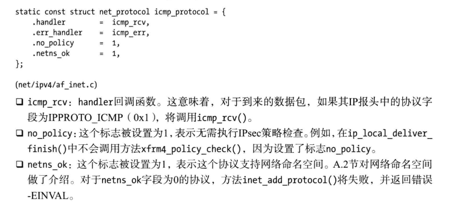

- ICMP用于发送报文的方法
  - icmp_send——主动发送特定icmp消息
  - icmp_reply——响应ICMP_ECHO | ICMP_TIMESTAMP


# IPv4
## 报头
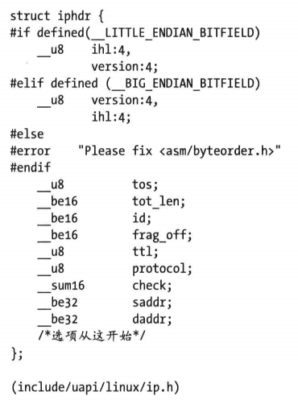
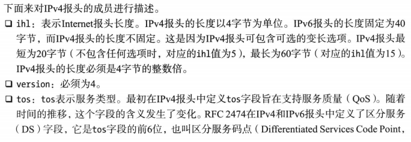
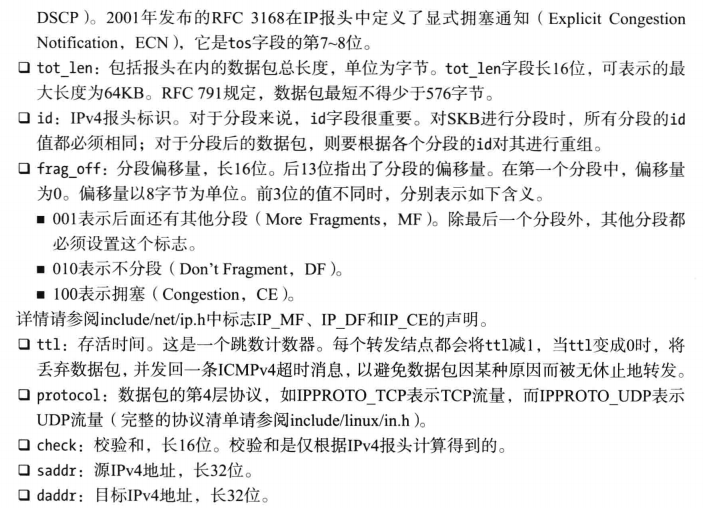

## 接收ipv4数据包
区别了目的地为当前主机和需要转发的情景，**标志了Netfilter的hook点**
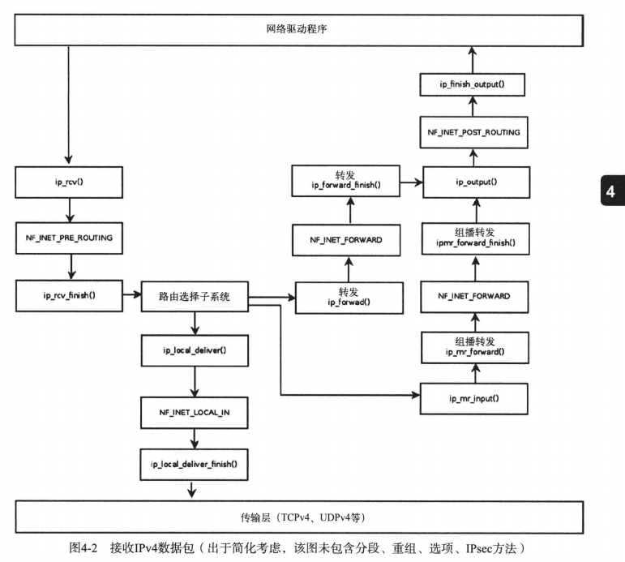


## 发送IPv4数据包
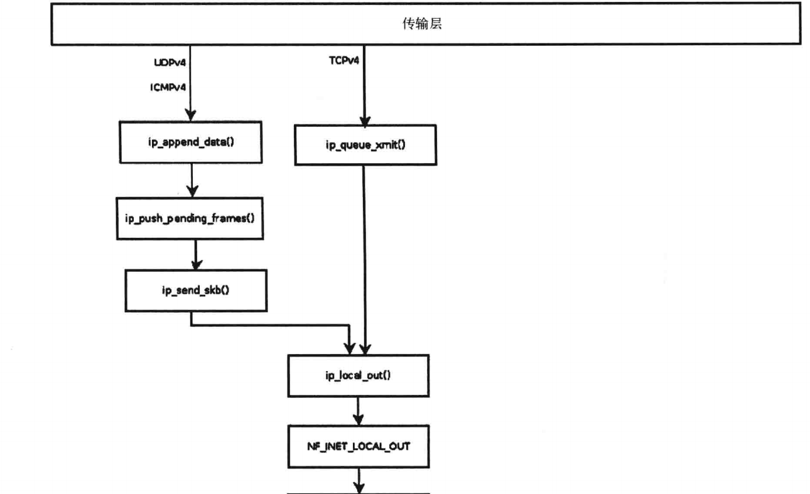
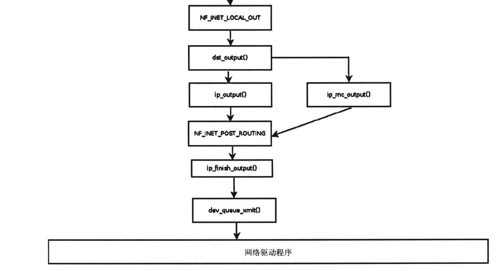

## 分段
当IP数据包长度超过MTU后需要分段
- 分段由ip_fragment()
- 组合由ip_defrag()

### 快速路径分段
### 慢速路径分段

# IPv4路由选择子系统
fib_trie、fib_info、fib_alias、rtable、ICMPv4重定向（默认关闭防止攻击）


# 高级路由选择

# 邻接子系统

# IPv6

# Netfilter

五个挂载点：


五个返回值：
- NF_ACCPET
- NF_DROP
- NF_STOLEN
- NF_QUEUE
- NF_REPEAT

## 注册钩子回调函数
1. 定义自己的`nf_hook_ops`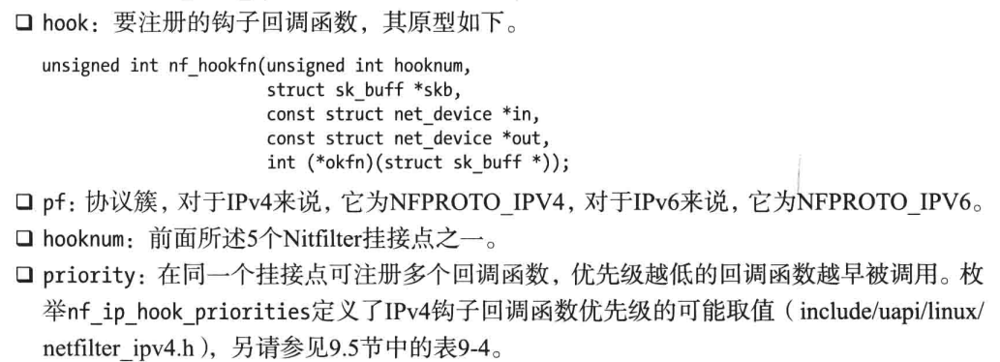
2. 使用nf_register_hook注册单个钩子或使用nf_register_hooks注册钩子组

## 连接跟踪
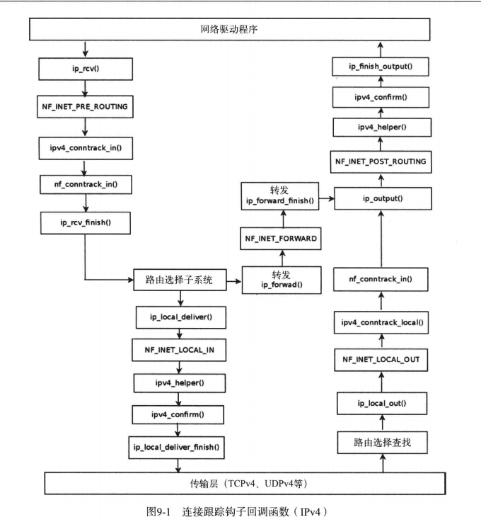

# IPsec


# TCP
很详细
https://xie.infoq.cn/article/70dfb4b6dc9a5f17d19c03597


# 四个msg结构体
让我们深入分析 `msghdr`, `user_msghdr`, `mmsghdr` 和 `cmsghdr` 这四个关键结构体，它们在 Linux 网络编程中扮演着不同但相互关联的角色。

## 1. `struct msghdr` (内核空间消息头)

```c
struct msghdr {
    void        *msg_name;        /* 套接字地址结构指针 */
    int         msg_namelen;      /* 地址结构长度 */
    struct iov_iter msg_iter;     /* 数据缓冲区迭代器 */
    
    union {
        void        *msg_control;       /* 内核空间控制信息缓冲区 */
        void __user *msg_control_user;  /* 用户空间控制信息缓冲区 */
    };
    bool        msg_control_is_user : 1; /* 控制信息来源标志 */
    __kernel_size_t msg_controllen;     /* 控制信息长度 */
    unsigned int msg_flags;        /* 消息标志 */
    struct kiocb *msg_iocb;       /* 异步IO控制块 */
};
```

**核心特点**：
1. **内核专用**：仅在内核空间使用，用户空间不可见
2. **数据迭代器**：使用 `iov_iter` 代替传统 iovec，支持：
   - 更高效的数据处理
   - 零拷贝操作支持
   - 多种数据源（用户空间、内核空间、管道等）
3. **双重控制缓冲区**：
   ```mermaid
   graph LR
       A[控制信息] -->|用户空间| B[msg_control_user]
       A -->|内核空间| C[msg_control]
       D[msg_control_is_user] --> E{判断来源}
   ```
4. **异步支持**：通过 `msg_iocb` 关联异步IO操作

**使用场景**：
- 内核网络协议栈内部实现
- 系统调用处理路径（如 sendmsg/recvmsg）
- 异步IO操作

## 2. `struct user_msghdr` (用户空间消息头)

```c
struct user_msghdr {
    void __user *msg_name;       /* 用户空间地址结构 */
    int         msg_namelen;     /* 地址长度 */
    struct iovec __user *msg_iov; /* 用户空间iovec数组 */
    __kernel_size_t msg_iovlen;   /* iovec数量 */
    void __user *msg_control;     /* 用户空间控制信息 */
    __kernel_size_t msg_controllen; /* 控制信息长度 */
    unsigned int msg_flags;       /* 消息标志 */
};
```

**核心特点**：
1. **用户空间接口**：直接暴露给应用程序使用
2. **传统iovec**：使用简单指针数组而非迭代器
3. **用户空间指针**：所有指针都标记为 `__user`
4. **无异步字段**：不包含异步IO相关字段

**内存布局**：
```c
+---------------------+
| msg_name (用户指针)   |
+---------------------+
| msg_namelen         |
+---------------------+
| msg_iov (用户指针)    |---> [iovec1]
+---------------------+      [iovec2]
| msg_iovlen          |      ...
+---------------------+
| msg_control (用户指针)|---> [cmsghdr]
+---------------------+      [cmsghdr]
| msg_controllen       |
+---------------------+
| msg_flags           |
+---------------------+
```

**使用场景**：
- sendmsg/recvmsg 系统调用参数
- 用户空间网络编程

## 3. `struct mmsghdr` (批量消息头)

```c
struct mmsghdr {
    struct user_msghdr msg_hdr;  /* 用户消息头 */
    unsigned int msg_len;        /* 实际传输字节数 */
};
```

**核心特点**：
1. **批量操作**：专为 sendmmsg/recvmmsg 设计
2. **结果字段**：`msg_len` 记录每次操作的实际传输量
3. **用户空间结构**：直接映射到用户空间

**工作流程**：
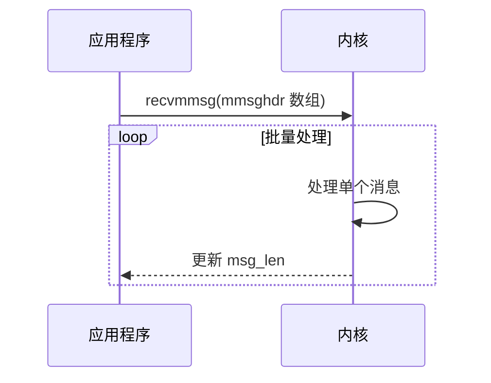

**使用场景**：
- 高性能网络应用
- 减少系统调用次数的场景
- 实时数据传输（如VoIP）

## 4. `struct cmsghdr` (控制信息头)

```c
struct cmsghdr {
    __kernel_size_t cmsg_len;   /* 数据长度（含头部） */
    int cmsg_level;             /* 协议层级 */
    int cmsg_type;              /* 协议特定类型 */
    /* 随后是实际的控制数据 */
};
```

**核心特点**：
1. **辅助数据载体**：传输协议相关的附加信息
2. **标准布局**：遵循 POSIX 1003.1g 规范
3. **链式结构**：多个 cmsghdr 可形成链表

**内存布局**：
```c
+------------------------+
| cmsghdr (16字节)        |
+------------------------+
| 实际控制数据 (变长)      |
+------------------------+
| 填充字节 (对齐用)        |
+------------------------+
| 下一个 cmsghdr (可选)    |
+------------------------+
```

**常见类型**：
```c
/* 协议层级 */
#define SOL_SOCKET      1
#define SOL_IP          0
#define SOL_IPV6        41

/* SOCKET层级类型 */
#define SCM_RIGHTS      1   /* 传递文件描述符 */
#define SCM_CREDENTIALS 2   /* 传递凭证 */

/* IP层级类型 */
#define IP_TOS          1   /* 服务类型 */
#define IP_TTL          2   /* 生存时间 */
```

## 结构体关系与协作

### 系统调用中的协作
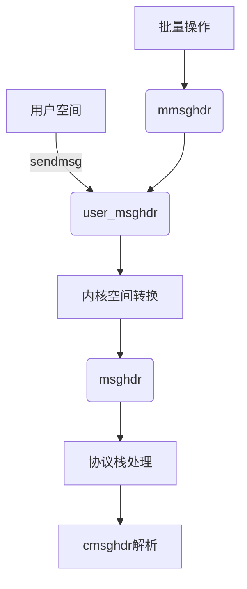

### 控制信息处理流程
```c
// 内核中访问控制信息
struct cmsghdr *cmsg = CMSG_FIRSTHDR(&msg);
while (cmsg != NULL) {
    switch (cmsg->cmsg_level) {
    case SOL_SOCKET:
        switch (cmsg->cmsg_type) {
        case SCM_RIGHTS:
            handle_fd_transfer(cmsg);
            break;
        }
        break;
    case IPPROTO_IP:
        handle_ip_options(cmsg);
        break;
    }
    cmsg = CMSG_NXTHDR(&msg, cmsg);
}
```

## 使用场景对比

| 结构体 | 空间 | 主要用途 | 关键特性 |
|--------|------|----------|----------|
| `msghdr` | 内核 | 内核协议栈处理 | iov_iter, 双重控制指针, 异步支持 |
| `user_msghdr` | 用户 | 应用层API接口 | 用户空间指针, 简单iovec |
| `mmsghdr` | 用户 | 批量消息操作 | 包含user_msghdr和结果字段 |
| `cmsghdr` | 两者 | 辅助数据传输 | 标准头部, 链式结构 |

## 实际应用示例

### 发送带控制信息的消息
```c
// 用户空间准备
struct msghdr msg = {0};
struct iovec iov = { .iov_base = data, .iov_len = len };
struct cmsghdr *cmsg;

char control[CMSG_SPACE(sizeof(int))]; // 文件描述符空间

msg.msg_control = control;
msg.msg_controllen = sizeof(control);

cmsg = CMSG_FIRSTHDR(&msg);
cmsg->cmsg_level = SOL_SOCKET;
cmsg->cmsg_type = SCM_RIGHTS;
cmsg->cmsg_len = CMSG_LEN(sizeof(int));
*(int *)CMSG_DATA(cmsg) = fd_to_send;

sendmsg(sockfd, &msg, 0);
```

### 内核处理
```c
// 在 ____sys_sendmsg 中
if (msg_sys->msg_controllen > 0) {
    if (msg_sys->msg_control_is_user) {
        // 从用户空间复制控制信息
        copy_from_user(ctl_buf, msg_sys->msg_control_user, ctl_len);
    }
    
    // 解析cmsghdr
    struct cmsghdr *cmsg;
    for (cmsg = CMSG_FIRSTHDR(msg_sys); cmsg; 
         cmsg = CMSG_NXTHDR(msg_sys, cmsg)) {
        if (cmsg->cmsg_level == SOL_SOCKET && 
            cmsg->cmsg_type == SCM_RIGHTS) {
            // 处理文件描述符传递
            receive_fds(CMSG_DATA(cmsg));
        }
    }
}
```

## 设计哲学总结

1. **空间隔离**：
   - 用户空间结构体使用 `__user` 标记指针
   - 内核空间结构体使用普通指针
   - 通过标志位区分控制信息来源

2. **性能优化**：
   - `iov_iter` 提供高效数据访问
   - 批量操作减少系统调用
   - 控制信息零拷贝优化

3. **扩展性**：
   - cmsghdr 的链式结构支持多种辅助数据
   - 异步IO支持
   - 协议无关设计

4. **兼容性**：
   - 保留BSD消息传递传统
   - POSIX标准兼容
   - 32/64位系统兼容处理

理解这些结构体的区别和联系，对于开发高性能网络应用和内核网络模块至关重要。它们在Linux网络栈中形成了完整的数据传输抽象层，平衡了灵活性、性能和安全性。

# 注册一个新协议簇的流程以及相关结构体
非常好，这个问题是 Linux 内核协议栈开发的关键，下面我将系统性梳理 **创建一个协议簇（Protocol Family）** 的全流程，并解释你列出的 5 个核心结构体之间的 **作用、职责和关系**。

---

## 🌐 一、协议簇创建的完整流程（以 PF\_MYPROTO 为例）

### 1. 定义并注册 `net_proto_family`（协议簇）

这是你自定义 socket 地址族（如 PF\_NST 或 PF\_MYPROTO）的**入口点**。

```c
static struct net_proto_family myproto_family_ops = {
    .family = PF_MYPROTO,
    .create = myproto_create,  // 调用 socket() 时的回调
    .owner = THIS_MODULE,
};
```

```c
sock_register(&myproto_family_ops);
```

⏳ **作用**：用户空间调用 `socket(PF_MYPROTO, SOCK_STREAM, 0)` 时，会调用 `.create` 创建 socket。

---

### 2. 在 `.create` 回调中创建 sock 对象（调用 sk\_alloc）

```c
static int myproto_create(struct net *net, struct socket *sock, int protocol, int kern)
{
    struct sock *sk = sk_alloc(net, PF_MYPROTO, GFP_KERNEL, &my_proto, kern);
    sock_init_data(sock, sk);  // 绑定 sk 到 socket
    sock->ops = &myproto_ops;  // 设置 socket 层操作接口
    ...
}
```

⏳ **作用**：

* 分配 `struct sock` 并与 `proto` 绑定；
* 设置 socket 操作接口 `proto_ops`；
* 完成一个自定义协议簇 socket 的创建。

---

### 3. 定义 `proto`（传输层抽象）

传入 `sk_alloc()`，定义内核协议栈层面对 `sock` 的行为。

```c
static struct proto my_proto = {
    .name = "MYPROTO",
    .owner = THIS_MODULE,
    .sendmsg = myproto_sendmsg,
    .recvmsg = myproto_recvmsg,
    .init = myproto_init,
    ...
};
```

⏳ **作用**：决定这个协议簇下的 `sock` 是怎么实际处理数据收发、内存管理的，是**传输层逻辑的核心**。

---

### 4. 定义 `proto_ops`（socket 层调用接口）

提供用户态访问时的 socket 系统调用接口。

```c
static const struct proto_ops myproto_ops = {
    .family = PF_MYPROTO,
    .owner = THIS_MODULE,
    .connect = myproto_connect,
    .sendmsg = myproto_socket_sendmsg,
    .recvmsg = myproto_socket_recvmsg,
    .release = myproto_release,
    ...
};
```

⏳ **作用**：封装 `proto` 操作给 socket 层，用户调用 `send()/recv()` 就会走这里。

---

### 5. （可选）定义 `inet_protosw`（面向 `PF_INET` 时才用）

如果你要让你的协议**跑在 AF\_INET 下**（比如像 TCP、UDP 那样），你要注册：

```c
static struct inet_protosw my_inet_protosw = {
    .type = SOCK_STREAM,
    .protocol = IPPROTO_MYPROTO,
    .prot = &my_proto,
    .ops = &myproto_ops,
    .flags = INET_PROTOSW_PERMANENT,
};
```

```c
inet_register_protosw(&my_inet_protosw);
```

⏳ **作用**：让 `socket(PF_INET, SOCK_STREAM, IPPROTO_MYPROTO)` 知道该用哪个 proto、哪个 ops。

---

### 6. （可选）注册 `net_protocol`（IP 层协议处理器）

如果你的协议是**IP 层下的新协议号**（如你用了 `IPPROTO_MYPROTO=254`），你还要注册 handler：

```c
static const struct net_protocol my_net_protocol = {
    .handler = my_rcv,
    .err_handler = my_err,
    .no_policy = 1,
    .netns_ok = 1,
};

inet_add_protocol(&my_net_protocol, IPPROTO_MYPROTO);
```

⏳ **作用**：当内核收到 IP 层协议号为 `IPPROTO_MYPROTO` 的包时，会交给你注册的 `.handler` 处理。

---

## 🧱 二、核心结构体关系图（职责与关联）

```text
┌────────────────────────────────────────────┐
│                用户空间                   │
│  socket(PF_INET, SOCK_STREAM, IPPROTO_XX)  │
└────────────────────────────────────────────┘
                     │
          (根据 PF_xxx 找)
                     ▼
        ┌────────────────────────┐
        │ struct net_proto_family│◄──── sock_register()
        │    .family = PF_INET   │
        │    .create = inet_create() ──────┐
        └────────────────────────┘         │
                                          ▼
                          ┌────────────────────────┐
                          │ struct inet_protosw    │◄──── inet_register_protosw()
                          │ .protocol = IPPROTO_XX │
                          │ .prot  = &proto        │
                          │ .ops   = &proto_ops    │
                          └────────────────────────┘
                                          │
                                 ┌────────┴────────┐
                                 ▼                 ▼
               ┌────────────────────────┐   ┌──────────────────────┐
               │   struct proto         │   │ struct proto_ops     │
               │  -> 实际协议核心逻辑    │   │  -> socket系统调用封装 │
               └────────────────────────┘   └──────────────────────┘
                                          ▲
                   ┌──────────────────────┘
                   │
        ┌────────────────────────────┐
        │ sk_alloc() 绑定 struct sock│
        └────────────────────────────┘

如果你自定义的是 IP 层协议 ▼
        ┌────────────────────────────┐
        │ struct net_protocol        │◄──── inet_add_protocol()
        │ .handler = my_rcv          │
        └────────────────────────────┘
```

---

## 🔚 总结：你要选哪种方式？

| 方式                                | PF\_xxx | 是否需要 net\_protocol | 是否注册 inet\_protosw | 示例                 |
| --------------------------------- | ------- | ------------------ | ------------------ | ------------------ |
| 自定义协议簇（如 PF\_NST）                 | ✅       | ❌                  | ❌                  | SCTP、AF\_BLUETOOTH |
| 复用 PF\_INET 创建新协议（如 IPPROTO\_NST） | ❌       | ✅                  | ✅                  | TCP、UDP            |
| TCP payload 上封装协议头                | ❌       | ❌                  | ❌                  | TLS、内核加密 tunnel    |

---

如你当前使用 TCP 封装 NST 头，则你只需要：

* hook `sendmsg`/`recvmsg` 或 Netfilter；
* 不要注册 `IPPROTO_NST`、`inet_add_protocol`。

如果你想完全新建一个协议（非 TCP 之上），那就需要全部结构。

---

是否需要我给你举一个完整示例，比如：

* 自定义 PF\_MYPROTO 协议簇 + sendmsg hook；
* 或者 AF\_INET 下注册 IPPROTO\_254 协议并收包处理？
