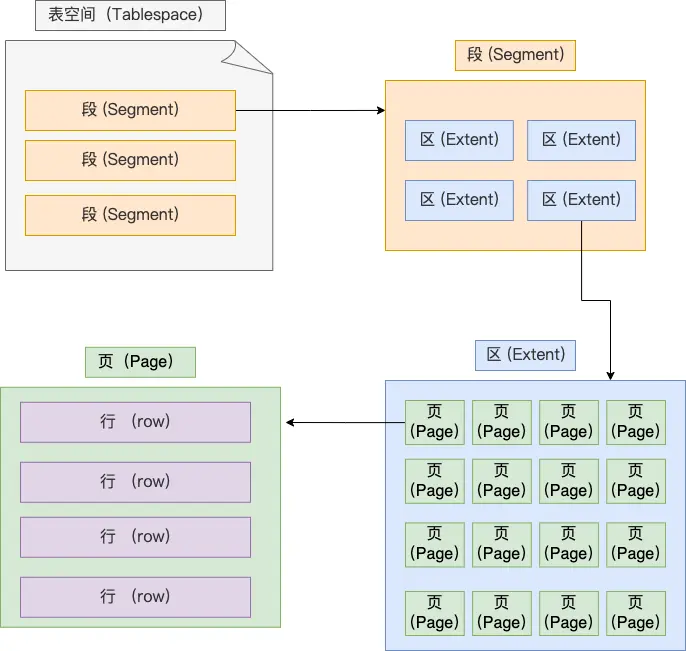
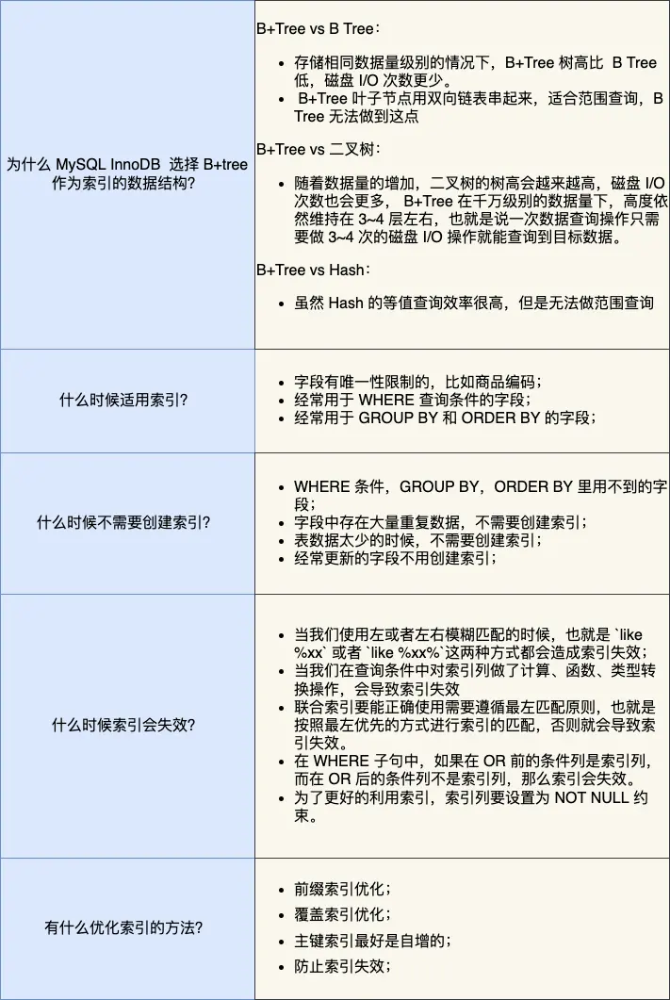

# 数据库的四种语言
### **📌 数据库的操作语言类别**
数据库的操作语言（Database Language）通常可以分为以下 **4** 大类别：  

| **类别** | **缩写** | **作用** | **典型 SQL 语句** |
|----------|---------|----------|------------------|
| **数据定义语言** | **DDL** | 定义或修改数据库结构 | `CREATE`、`ALTER`、`DROP` |
| **数据操作语言** | **DML** | 操作数据库中的数据 | `INSERT`、`UPDATE`、`DELETE` |
| **数据查询语言** | **DQL** | 查询数据 | `SELECT` |
| **数据控制语言** | **DCL** | 控制数据库权限 | `GRANT`、`REVOKE` |

---

## **🔹 1. DDL（数据定义语言）**
**DDL（Data Definition Language）** 用于**创建、修改、删除数据库和表的结构**。  
这些语句**不涉及具体数据**，只影响数据库的结构。

**🔹 典型 DDL 语句：**
```sql
-- 创建数据库
CREATE DATABASE mydb;

-- 创建表
CREATE TABLE users (
    id INT PRIMARY KEY,
    name VARCHAR(50),
    age INT
);

-- 修改表结构（添加新列）
ALTER TABLE users ADD COLUMN email VARCHAR(100);

-- 删除表
DROP TABLE users;
```
✅ **特点**
- DDL 语句**会自动提交事务**，无法回滚。
- 主要用于管理数据库结构（Schema）。

---

## **🔹 2. DML（数据操作语言）**
**DML（Data Manipulation Language）** 用于**对数据库中的数据进行增、删、改**。

**🔹 典型 DML 语句：**
```sql
-- 插入数据
INSERT INTO users (id, name, age) VALUES (1, 'Alice', 25);

-- 更新数据
UPDATE users SET age = 26 WHERE id = 1;

-- 删除数据
DELETE FROM users WHERE id = 1;
```
✅ **特点**
- DML 语句**需要手动提交**，否则在 `ROLLBACK` 之前不会生效（除非 `AUTOCOMMIT=ON`）。
- 只操作表中的**数据**，不会修改表结构。

---

## **🔹 3. DQL（数据查询语言）**
**DQL（Data Query Language）** 主要用于**查询数据**，不会对数据进行修改。

**🔹 典型 DQL 语句：**
```sql
-- 查询所有数据
SELECT * FROM users;

-- 选择特定列
SELECT name, age FROM users;

-- 条件查询
SELECT * FROM users WHERE age > 25;
```
✅ **特点**
- **不修改数据**，只用于**查询**。
- 只有 `SELECT` 语句属于 DQL。

---

## **🔹 4. DCL（数据控制语言）**
**DCL（Data Control Language）** 用于**管理用户权限**，控制数据库的访问权限。

**🔹 典型 DCL 语句：**
```sql
-- 赋予用户权限
GRANT SELECT, INSERT ON mydb.users TO 'user1'@'localhost';

-- 撤销权限
REVOKE INSERT ON mydb.users FROM 'user1'@'localhost';
```
✅ **特点**
- 主要用于**用户权限管理**。
- 一般需要 **DBA（数据库管理员）** 才能执行。

---

## **📌 总结**
| **类别** | **作用** | **常见 SQL 语句** |
|----------|----------|------------------|
| **DDL**（数据定义语言） | 定义/修改表结构 | `CREATE`、`ALTER`、`DROP` |
| **DML**（数据操作语言） | 增删改数据 | `INSERT`、`UPDATE`、`DELETE` |
| **DQL**（数据查询语言） | 查询数据 | `SELECT` |
| **DCL**（数据控制语言） | 控制权限 | `GRANT`、`REVOKE` |

---

### **📌 重点知识**
✅ **DDL 语句会自动提交，无法回滚**。  
✅ **DML 需要 `COMMIT`，否则可以 `ROLLBACK`**。  
✅ **DQL 只查询数据，不修改数据**。  
✅ **DCL 主要用于权限管理**。  


# 执行一条select发生了什么
1. 连接器检查权限
2. 检查查询缓存
3. 解析查询--词法、语法
4. 进行预处理--判断字段是否存在
5. 优化
6. 执行
7. 返回结果


# MYSQL一行是如何存储的
首先我们需要了解一下mysql**表空间**的存储结构。
1. 页，Innodb的数据是按**页**读写的，每页默认大小16kb
2. 区，因为使用的是B+树，数据以**双向链表**模式相连，为了**减少磁盘随机IO**，数据量大时直接分配一个一个区，使逻辑相邻变成物理相邻，减少磁盘随机IO次数。
3. 段，索引段(非叶子节点)、数据段(叶子节点)、回滚段(MVCC--实现可重复读)



## compact行格式

### 1.额外信息部分
1. 变长字段长度列表***逆序***记录每一个**varchar**字段的**真实长度**
   - 长度 < 255 占用1字节，否则2字节-即最大长度65535
   - **不会进行字节对齐**，而是按需分配，即如果一个字段长度小于255，另一个大于255，分配3字节而不是4字节
2. NULL值列表采用**位图**的形式，***逆序***存放每个字段是否是NULL的信息 [**字节对齐，以及非NULL值字段不在位图中**]
   - **NULL值列表不一定存在**，当表中所有列都定义为NOT NULL时不存在NULL值列表
3. > 

> Q：为什么变长字段长度列表和NULL列表要逆序存放
> A：这样可以使得位置靠前的真实数据记录和数据对应的长度在同一个cpu cacheline中，提高cpu cache的命中率


### 2.真实数据部分

> 注意：指定主键后没有row_id隐藏字段


### 3.记录头信息
在 **MySQL InnoDB** 存储引擎的 **Compact** 行格式中，**记录头信息（Record Header）** 主要存放了一些**控制信息**，用于管理行记录的存储和查询。  

#### **📌 记录头信息的结构**
记录头信息的大小是 **固定 5 字节（40 bit）**，包含了以下重要字段：

| 偏移量 (bit) | 长度 (bit) | 字段名 | 作用 |
|------------|---------|------|----|
| 0 | 1 | **delete_mask** | 记录是否被**标记删除**，`1` 表示删除（实际上只是标记删除，稍后可能被清理）|
| 1 | 1 | **min_rec_flag** | 该记录是否是**B+ 树非叶子节点的最小记录**（只在非叶子节点中使用）|
| 2~4 | 3 | **n_owned** | 该记录**拥有的记录个数**（用于段页管理）|
| 5~20 | 16 | **heap_no** | 记录的**堆编号**，用于标识记录的存储顺序 |
| 21~24 | 4 | **record_type** | 记录的类型，`0` 表示普通行，`2` 表示 B+ 树的**最小记录**，`3` 表示 B+ 树的**最大记录** |
| 25~39 | 15 | **next_record** | **相邻记录的偏移量**，指向下一条记录的位置，形成**单链表** |

---

#### **📌 记录头信息的作用**
这些字段的作用主要包括：

 **1️⃣  `delete_mask`（是否被标记删除）**
- 如果 `delete_mask = 1`，表示该记录已经被删除，但仍然**存在于数据页中**。
- InnoDB 使用**标记删除**，而不是立即删除，以减少磁盘 IO，提高性能。
- 真正的删除会由**后台 Purge 线程**进行清理。

 **2️⃣ `min_rec_flag`（是否是 B+ 树的最小记录）**
- 在 B+ 树的非叶子节点，每个页的**最小记录**会被标记 `min_rec_flag = 1`。
- 这个字段用于**优化 B+ 树的遍历**，可以快速找到最小值。

 **3️⃣ `n_owned`（该记录管理的记录数量）**
- **用于段页管理**，表示该记录**拥有**多少条其他记录。
- InnoDB **将记录分组**存储，每条记录可能会管理一组其他记录，`n_owned` 记录了这个管理关系。

 **4️⃣ `heap_no`（堆编号）**
- 记录在**页内**的唯一编号，从 `0` 开始递增。
- 编号 `0` 和 `1` **保留给 InnoDB 用于 B+ 树管理**：
  - `heap_no = 0`：页目录中的**Infimum（负无穷）**
  - `heap_no = 1`：页目录中的**Supremum（正无穷）**
- 其他数据记录的 `heap_no` **从 2 开始**。

 **5️⃣ `record_type`（记录类型）**
用于区分记录的类别：
- `0`：**普通记录**（普通表中的数据行）。
- `2`：**B+ 树非叶子节点的 Infimum 记录**（负无穷）。
- `3`：**B+ 树非叶子节点的 Supremum 记录**（正无穷）。

 **6️⃣ `next_record`（下一条记录的偏移量）**
- 该字段指向**下一条记录**的地址。
- 通过 `next_record` 形成一个**单向链表**，用于遍历当前数据页的所有记录。

---

#### **📌 例子：假设有一条记录**
```sql
CREATE TABLE test (
    id INT PRIMARY KEY,
    name VARCHAR(10),
    age INT
) ROW_FORMAT=COMPACT;
```
假设存储了一条记录：
```
id = 1, name = 'Alice', age = 25
```
它在数据页的存储可能如下：
```
+--------------------------+
| 记录头信息（5字节）       |
+--------------------------+
| NULL 位图（如果有 NULL）  |
+--------------------------+
| 变长字段长度列表（逆序）  |
+--------------------------+
| 固定字段数据（id, age）  |
+--------------------------+
| 变长字段数据（name）      |
+--------------------------+
```
假设 `id = 1` 这条记录的 **记录头信息**：
```
delete_mask    = 0  （未删除）
min_rec_flag   = 0  （普通记录）
n_owned        = 2  （管理 2 条记录）
heap_no        = 3  （堆编号）
record_type    = 0  （普通记录）
next_record    = 0x40  （指向下一条记录的偏移量）
```
---

#### **📌 总结**
- **记录头信息是每条记录的管理信息，共 5 字节**。
- 主要存储**删除标记、最小记录标志、拥有的记录数、堆编号、记录类型、下一条记录的位置**。
- 这些字段的作用主要是：
  1. **维护 B+ 树的结构**（最小记录、记录类型）。
  2. **优化数据页管理**（堆编号、记录管理）。
  3. **提供遍历链表的能力**（下一条记录偏移量）。
- **解析数据时，InnoDB 先读取记录头信息**，然后再解析具体的字段数据。

这样 MySQL 就能在 **高效遍历数据页** 的同时 **支持 B+ 树管理、快速删除、索引优化**，提高查询性能 🚀。

## varchar(n)中n最大是多少
> n指的是字符数量，不同字符编码占用的字节数量不同，n的最大大小不同，但是理论上不能超过65535字节，这里用ASCII做实验
> 出指定类型之外，其它所有列占用的字节不能超过65535字节，**注意是字节**，不是字符，如ASCII和UNICODE每一个字符占用的字节数不同，但是我只关心字节
> 
> 对于**单字段**可NULL
> 

## 行溢出后如何处理的
> 因为一页的默认大小为16kb，而varchar最多65kb，blob，text等更不用说，这时候**compact行的真实数据部分**只会保留部分数据，并留下20字节存储**溢出页**的地址
> 
```
数据页（Data Page）
    ├── 768B 数据
    ├── 指向溢出页的指针（Pointer）
    ↓
溢出页（Overflow Page 1）[存 16KB 数据]
    ├── 指向下一个溢出页的指针
    ↓
溢出页（Overflow Page 2）[存 16KB 数据]
    ├── 指向下一个溢出页的指针
    ↓
溢出页（Overflow Page N）
```

# 索引

## 索引分类
- 按数据结构：
  - B+树索引、hash索引、Full-text索引
- 按物理存储：
  - 聚簇索引(主键索引)、二级索引(辅助索引)
- 按字段特性：
  - 主键索引、唯一索引、普通索引、前缀索引
- 按字段个数：
  - 单列索引、联合索引

## 从数据结构角度，B+树索引
为什么使用B+树
> 1. 对比B树--b+树所有数据都在叶子节点，并且叶子节点通过双向链表相连，范围查询更快，并且全表扫描更快，因为只需要遍历叶子节点，而b树需要遍历整棵树
> 2. 对比二叉树--B+树在d=100时，即使存放了千万级的数据树高也仅有3~4层，而二叉树的树高为\(log_2N\),大大减少了磁盘IO次数
> 3. 对比hash表--hash表很快，但是不支持范围查询，只支持精确匹配，并且需要解决哈希冲突，而且不支持排序


## 按物理存储

在 MySQL **InnoDB** 存储引擎中，索引主要分为两类：  
✅ **聚簇索引（Clustered Index）**  
✅ **二级索引（Secondary Index）**  

---

 **1️⃣ 聚簇索引（Clustered Index）**
 **📌 定义**
- **聚簇索引就是按照主键顺序存储数据的索引**。  
- **数据本身存储在 B+ 树的叶子节点上**，索引的叶子节点就是数据页。  
- 每张表 **只能有一个聚簇索引**（因为数据只能按一种顺序存储）。  


**📌 具体特点**
✅ **数据和索引存储在一起**（索引的叶子节点存放的是整行数据）。  
✅ **按照主键的顺序组织存储**，数据默认是有序的。  
✅ **查询主键时，直接从 B+Tree 叶子节点获取数据，不需要回表**。  


 **2️⃣ 二级索引（Secondary Index）**
### **📌 定义**
- **除了主键索引（聚簇索引）之外的所有索引，都是二级索引**。  
- **二级索引的叶子节点存储的是“主键值”而不是完整数据**。  
- **查询时需要先通过二级索引找到主键，然后再去聚簇索引中查找数据（回表查询）**。

---

 **3️⃣ 聚簇索引 vs. 二级索引**
|  **对比项**  | **聚簇索引（Clustered Index）** | **二级索引（Secondary Index）** |
|------------|---------------------------------|-------------------------------|
| **存储结构** | B+ 树的叶子节点存储完整数据行 | B+ 树的叶子节点存储的是主键 ID |
| **查询方式** | 直接通过 B+Tree 叶子节点获取数据 | 先查二级索引，再回表查聚簇索引 |
| **适用场景** | 适用于主键查询 | 适用于非主键查询 |
| **查询效率** | **较快（无需回表）** | **可能需要回表（多一次查询）** |
| **数据存储顺序** | **按照主键顺序存储** | **与主键无关** |
| **是否唯一** | **唯一（每张表只能有一个）** | **可以有多个二级索引** |

---

 **总结**
✅ **聚簇索引** 是 **主键索引，B+Tree 叶子节点直接存数据行**，查询主键时最快。  
✅ **二级索引** 是 **普通索引，B+Tree 叶子节点存的是主键 ID**，查询时需要**回表**。  
✅ **查询主键时，直接查聚簇索引，效率高**。  
✅ **查询二级索引字段时，可能需要回表，效率稍低**。  
✅ **一个表只能有一个聚簇索引，但可以有多个二级索引**。  


## 按字段类型
从字段特性的角度来看，MySQL 的索引主要可以分为以下几种：  

### **📌 1. 主键索引（Primary Key Index）**
 **✅ 定义**
- 主键索引是 **唯一索引 + NOT NULL 约束** 的组合，一个表**只能有一个主键索引**。
- 主键索引默认是 **聚簇索引（Clustered Index）**（在 InnoDB 存储引擎下）。
- **主键索引的叶子节点存储整行数据**，即**数据存储按主键组织**。

 **📌 特点**
- 主键列必须**唯一且非空**（NOT NULL）。
- 通过主键索引查询数据时，不需要回表，查询效率最高。
- InnoDB 表**默认使用主键作为聚簇索引**，数据存储按主键顺序排列。

 **📌 示例**
```sql
CREATE TABLE users (
    id INT PRIMARY KEY,  -- 主键索引
    name VARCHAR(50),
    age INT
);
```

**查询 `id=5` 的数据流程：**
1. 直接在 **聚簇索引**（B+ 树）中找到 `id=5`。
2. 因为**主键索引的叶子节点存储完整的数据行**，所以查询不需要回表，效率最高。

---

### **📌 2. 唯一索引（Unique Index）**
 **✅ 定义**
- 唯一索引约束索引列的值**必须唯一，但可以有 NULL 值**。
- 一个表可以有多个唯一索引。
- **唯一索引不一定是主键索引，主键索引一定是唯一索引。**

 **📌 特点**
- **不同于主键索引，唯一索引可以有多个 NULL 值**（因为在 SQL 标准中，NULL 值不等于 NULL）。
- 在 InnoDB 存储引擎下，唯一索引的叶子节点**存储的是主键 ID，而不是完整数据**，查询时可能需要回表。

 **📌 示例**
```sql
CREATE TABLE users (
    id INT PRIMARY KEY,
    email VARCHAR(100) UNIQUE  -- 唯一索引
);
```
等价于：
```sql
CREATE UNIQUE INDEX idx_email ON users(email);
```

**查询 `email='abc@example.com'` 的数据流程（假设 `id=10`）：**
1. 在 **唯一索引的 B+ 树** 中，找到 `email='abc@example.com'`，获取 `id=10`。
2. 通过 `id=10` 再去 **聚簇索引（主键索引）** 中查找完整数据（回表查询）。

**🚀 优化建议**：如果某个列既是主键的候选项（经常用于查询），最好直接设为**主键索引**，避免回表。

---

### **📌 3. 普通索引（Normal Index）**
 **✅ 定义**
- 普通索引只是**对某列创建的索引**，不保证唯一性。
- **普通索引不包含任何约束**，可包含重复值和 NULL 值。

 **📌 特点**
- 适用于**高频查询但不需要唯一性的字段**。
- 普通索引的叶子节点存的是**主键 ID**，查询时仍然需要回表。

 **📌 示例**
```sql
CREATE TABLE users (
    id INT PRIMARY KEY,
    name VARCHAR(50),
    age INT,
    INDEX idx_name (name)  -- 普通索引
);
```
等价于：
```sql
CREATE INDEX idx_name ON users(name);
```

**查询 `name='Tom'` 的数据流程（假设 `id=20`）：**
1. 在 **普通索引 B+ 树** 中查找 `name='Tom'`，获取 `id=20`。
2. 通过 **主键索引（聚簇索引）**，查找 `id=20` 的完整数据（回表查询）。

**🚀 使用建议**：
- **普通索引适用于经常被查询的字段**，但如果查询时总是会查找整行数据，则**主键查询更高效**。

---

### **📌 4. 前缀索引（Prefix Index）**
 **✅ 定义**
- **前缀索引**用于**对长字符串字段的前 N 个字符建立索引**，而不是对整个字符串索引。
- 适用于 **VARCHAR、TEXT** 等长文本类型字段，减少索引大小，提高查询性能。

 **📌 特点**
- 前缀索引**可以减少索引占用的存储空间**，但会影响索引的**区分度**。
- **前缀索引不能用于 `ORDER BY` 和 `GROUP BY` 操作**（因为前缀索引不存完整值）。
- **前缀索引不支持覆盖索引**（因为只存储部分值）。

 **📌 示例**
```sql
CREATE TABLE users (
    id INT PRIMARY KEY,
    email VARCHAR(100),
    INDEX idx_email_prefix(email(10))  -- 只对前10个字符建立索引
);
```

**查询 `email='longemail@example.com'` 的数据流程：**
1. 在 **前缀索引 B+ 树** 中，查找 `email 前 10 个字符` 匹配的索引项。
2. 获取主键 ID，再回表查询完整 `email` 进行精确匹配。

**🚀 使用建议**：
- 适用于**长字符串字段**，但需要确保前 N 个字符的区分度足够高，否则索引效果不佳。
- 在**数据量较大、长文本查询多的情况下**，可以通过前缀索引优化索引存储。

---

### **📌 5. 各种索引的对比**
| 索引类型  | 是否唯一 | 是否允许 NULL | 是否需要回表 | 适用场景 |
|----------|--------|--------------|------------|-----------|
| **主键索引** | ✅ 唯一 | ❌ 不允许 NULL | ❌ 不需要回表 | 作为表的唯一标识，查询最优 |
| **唯一索引** | ✅ 唯一 | ✅ 允许 NULL | ✅ 可能需要回表 | 确保列值唯一，如邮箱、手机号 |
| **普通索引** | ❌ 可重复 | ✅ 允许 NULL | ✅ 可能需要回表 | 提高查询速度，不要求唯一 |
| **前缀索引** | ❌ 可重复 | ✅ 允许 NULL | ✅ 可能需要回表 | 适用于长文本字段，减少索引大小 |

---

### **📌 6. 总结**
✅ **主键索引：** 每个表只能有一个，默认是聚簇索引，查询效率最高，不需要回表。  
✅ **唯一索引：** 约束字段唯一，但允许 NULL，查询时可能需要回表。  
✅ **普通索引：** 仅用于查询优化，不保证唯一性，查询时可能需要回表。  
✅ **前缀索引：** 适用于长文本字段，提高索引效率，但查询时可能导致模糊匹配。  

🔥 **优化建议**：
- **主键查询 > 唯一索引查询 > 普通索引查询**（查询效率递减）。
- **尽量使用主键索引进行查询，避免回表，提高查询性能**。
- **对于长文本字段，可使用前缀索引优化索引存储**。

## 按字段个数

### **✅  联合索引**
- 联合索引（Composite Index / Multiple-Column Index）是**一个索引包含多个字段**。
- 通过联合索引，**可以在多个字段上进行高效查询**，避免单列索引带来的回表查询。
- **联合索引的查询优化主要依赖 "最左匹配原则"**（后面详细解释）。

**📌 示例**
```sql
CREATE TABLE users (
    id INT PRIMARY KEY,
    name VARCHAR(50),
    age INT,
    city VARCHAR(50),
    INDEX idx_name_age_city (name, age, city)  -- 联合索引
);
```

---

#### **📌 2. 最左匹配原则**
 **✅ 2.1 什么是最左匹配原则？**
> **"最左匹配"（Leftmost Prefix Matching）** 是指：
> - **联合索引的匹配是从左到右进行的**，查询时必须按照索引字段的顺序进行匹配，才能有效使用索引。
> - **如果跳过了联合索引中的某个字段，索引将无法完全使用**，只能使用前面能匹配上的部分。

---

 **✅ 2.2 最左匹配原则示例**
假设我们创建了一个联合索引：
```sql
CREATE INDEX idx_name_age_city ON users(name, age, city);
```
索引结构如下：
```
B+树：
(name, age, city)
-----------------
(Alice, 25, Beijing)
(Alice, 30, Shanghai)
(Bob, 22, Shenzhen)
(Bob, 25, Guangzhou)
(Charlie, 35, Beijing)
```

 **📌 2.2.1 可以使用索引的查询**
| **SQL 语句**                                  | **是否使用索引？** | **说明** |
|-----------------------------------------------|--------------------|----------|
| `SELECT * FROM users WHERE name = 'Alice';` | ✅ **使用索引**  | **匹配 `name`，符合最左匹配原则** |
| `SELECT * FROM users WHERE name = 'Alice' AND age = 25;` | ✅ **使用索引**  | **匹配 `name, age`，符合最左匹配原则** |
| `SELECT * FROM users WHERE name = 'Alice' AND age = 25 AND city = 'Beijing';` | ✅ **使用索引**  | **完全匹配 `name, age, city`，索引全用上了** |
| `SELECT * FROM users WHERE name = 'Alice' AND city = 'Beijing';` | ✅ **部分使用索引** | **匹配 `name`，但 `age` 被跳过，索引不能完全使用** |
| `SELECT * FROM users WHERE age = 25;` | ❌ **无法使用索引** | **跳过 `name`，索引失效** |
| `SELECT * FROM users WHERE city = 'Beijing';` | ❌ **无法使用索引** | **跳过 `name, age`，索引失效** |

---
 **✅ 2.3 为什么跳过字段会导致索引失效？**
MySQL 采用 **B+ 树索引**，如果查询语句跳过了联合索引的某些字段，就无法利用索引的有序性，必须回表扫描，导致性能下降。  
例如：
```sql
SELECT * FROM users WHERE age = 25;
```
**因为 `age` 不是最左字段（`name` 在前面），索引无法使用！**

---
 **✅ 2.4 `LIKE` 查询在最左匹配中的特殊情况**
```sql
SELECT * FROM users WHERE name LIKE 'A%';  -- ✅ 使用索引
SELECT * FROM users WHERE name LIKE '%A';  -- ❌ 不能使用索引
```
- **前缀匹配 `LIKE 'A%'` 可以使用索引**，因为索引是按 `name` 排序的。
- **后缀匹配 `LIKE '%A'` 无法使用索引**，因为索引不能倒着扫描 B+ 树。

---

## 索引下推
减少回表操作


## 什么时候创建索引


## **如何排查 MySQL 索引效果**
在 MySQL 中，索引是查询优化的关键。如果查询性能低下或索引未生效，需要进行索引效果排查。以下是详细的排查方法和步骤。

---

### **1. 使用 `EXPLAIN` 分析 SQL 执行计划**
**`EXPLAIN` 语句** 可以显示 SQL 语句的执行计划，帮助你查看索引的使用情况。

 **（1）基本使用**
```sql
EXPLAIN SELECT * FROM employees WHERE name = 'Alice';
```
返回结果示例：
```
+----+-------------+-----------+------+---------------+------+---------+------+-------+-------------+
| id | select_type | table     | type | possible_keys | key  | key_len | ref  | rows  | Extra       |
+----+-------------+-----------+------+---------------+------+---------+------+-------+-------------+
|  1 | SIMPLE      | employees | ref  | idx_name      | idx_name | 52   | const | 1    | Using index |
+----+-------------+-----------+------+---------------+------+---------+------+-------+-------------+
```

 **（2）关键字段解释**
| 字段 | 含义 | 说明 |
|------|------|------|
| `id` | 查询 ID | 多表查询时用于区分各个 `SELECT` |
| `select_type` | 查询类型 | `SIMPLE` (简单查询) / `JOIN` (连接查询) |
| `table` | 访问的表 | 当前查询涉及的表 |
| `type` | 访问类型 | **重要**，索引优化重点 |
| `possible_keys` | 可能使用的索引 | 可能会用到的索引 |
| `key` | 实际使用的索引 | **实际使用的索引**（为空表示未使用索引） |
| `key_len` | 索引长度 | **索引使用的字节数**，越短越好 |
| `rows` | 预估扫描的行数 | **越少越好** |
| `Extra` | 额外信息 | 是否使用索引、是否需要回表等 |

 **（3）重点关注 `type` 字段**
`type` 字段表示查询的访问方式，排序从优到差：
| `type` | 说明 | 是否使用索引 |
|--------|------|--------------|
| `system` | 仅一行数据，几乎不耗费查询资源 | ✅ |
| `const` | 通过主键或唯一索引查找 | ✅ |
| `eq_ref` | 连接查询，使用主键或唯一索引 | ✅ |
| `ref` | 非唯一索引查询 | ✅ |
| `range` | 索引范围查询（`BETWEEN`、`> <`） | ✅ |
| `index` | 全索引扫描（**索引覆盖但未用主键查找**） | ✅ |
| `ALL` | **全表扫描（最差情况）** | ❌ |

**如何优化：**
- **避免 `ALL`（全表扫描）**，应该至少达到 `range` 级别。
- 如果 `key` 为空，说明 **索引未使用**，需要分析 SQL 是否合理。

---

### **2. 观察 `SHOW INDEX` 检查索引**
```sql
SHOW INDEX FROM employees;
```
返回结果示例：
```
+------------+------------+-----------+--------------+-------------+-----------+-------------+-------------------+
| Table      | Non_unique | Key_name  | Seq_in_index | Column_name | Collation | Cardinality | Index_type        |
+------------+------------+-----------+--------------+-------------+-----------+-------------+-------------------+
| employees  | 0          | PRIMARY   | 1            | id          | A         | 1000000     | BTREE             |
| employees  | 1          | idx_name  | 1            | name        | A         | 50000       | BTREE             |
+------------+------------+-----------+--------------+-------------+-----------+-------------+-------------------+
```

 **重点字段**
| 字段 | 说明 |
|------|------|
| `Key_name` | 索引名称 |
| `Non_unique` | 0 表示唯一索引，1 表示普通索引 |
| `Seq_in_index` | 索引列顺序 |
| `Column_name` | 参与索引的列 |
| `Cardinality` | **索引的基数（去重值数量），基数越大，索引效率越高** |
| `Index_type` | 索引类型（BTREE、FULLTEXT 等） |

如果索引 `Cardinality` 过低，说明索引的选择性较差，可能导致查询效率不高。

---

### **3. 通过 `SHOW PROFILE` 分析 SQL 执行情况**
使用 `SHOW PROFILE` **查看 SQL 语句的性能开销**。
```sql
SET profiling = 1;
SELECT * FROM employees WHERE name = 'Alice';
SHOW PROFILE FOR QUERY 1;
```
返回结果：
```
+----------------------+----------+
| Status              | Duration |
+----------------------+----------+
| Sending data        | 0.000321 |
| Waiting for table   | 0.000012 |
| Table lock          | 0.000003 |
| Closing tables      | 0.000002 |
+----------------------+----------+
```
- **重点关注 `Sending data` 耗时**：如果过长，说明查询优化有问题。
- 如果 `Waiting for table` 时间较长，可能是**表级锁**导致的性能问题。

---

### **4. 检查 `slow_query_log` 发现慢查询**
如果查询过慢，可以检查 `slow_query_log`。
```sql
SHOW VARIABLES LIKE 'slow_query_log';
```
如果未开启，可以启用：
```sql
SET GLOBAL slow_query_log = 1;
SET GLOBAL long_query_time = 1;  -- 超过1秒的查询记录下来
```
然后查询慢查询日志：
```bash
cat /var/lib/mysql/mysql-slow.log
```
- 如果发现某些查询 **执行时间过长**，需要分析 `EXPLAIN` 是否使用了索引。

---

## **5. 索引优化方法**
### **（1）使用 `覆盖索引`**
如果 `SELECT` 语句的字段**都包含在索引里**，可以**避免回表**：
```sql
-- 覆盖索引：查询仅使用索引列
SELECT name FROM employees WHERE name = 'Alice';
```
✅ `EXPLAIN` 的 `Extra` 显示 `Using index`，说明索引覆盖生效。

---

### **（2）优化 `ORDER BY` 避免 `filesort`**
**问题：**
```sql
SELECT * FROM employees ORDER BY name;
```
如果 `EXPLAIN` 显示 `Using filesort`，说明 MySQL **额外执行了排序**。

**优化：**
创建**联合索引**：
```sql
ALTER TABLE employees ADD INDEX idx_name_age (name, age);
```
这样：
```sql
SELECT name, age FROM employees WHERE name LIKE 'A%' ORDER BY age;
```
就可以直接使用 `idx_name_age` **避免排序**。

---

### **（3）使用 `索引下推（Index Condition Pushdown，ICP）`**
**适用于 `WHERE` 过滤多个索引列时**：
```sql
EXPLAIN SELECT * FROM employees WHERE name LIKE 'A%' AND age > 30;
```
如果 `Extra` 显示 `Using index condition`，说明索引下推生效。

---

### **（4）避免 `LIKE '%xxx'`**
```sql
SELECT * FROM employees WHERE name LIKE '%Alice';
```
🚨 **无法使用索引**，因为 `%` 在前面，MySQL 无法建立索引范围查询。

**解决方案**：
- **如果可以，使用 `LIKE 'Alice%'`**，让索引生效。
- **使用全文索引**：
  ```sql
  ALTER TABLE employees ADD FULLTEXT INDEX idx_name (name);
  SELECT * FROM employees WHERE MATCH(name) AGAINST ('Alice');
  ```

---

### **总结**
✅ **使用 `EXPLAIN` 检查索引是否生效**（重点查看 `type`、`key`、`Extra`）  
✅ **使用 `SHOW INDEX` 了解索引信息**（基数 `Cardinality` 越大，索引效果越好）  
✅ **开启 `slow_query_log` 找出慢查询**  
✅ **使用 `索引覆盖`、`索引下推`、`优化 ORDER BY` 等手段优化查询**  
✅ **避免 `LIKE '%xxx'`，改用全文索引或其他优化方案**  

定期优化索引，能大幅提升 MySQL 查询性能！ 🚀

## **什么是索引下推（Index Condition Pushdown, ICP）？**  
**索引下推（ICP）是一种 MySQL 查询优化技术，在使用二级索引时，可以减少回表（减少磁盘 I/O），提高查询效率。**  

**🔸 传统的二级索引查询流程（未使用索引下推）**  
1. **查询时，先用索引查找可能的行**（但索引中不包含所有列）  
2. **回表（回到主键索引或数据页）** 读取完整数据行  
3. **再进行 WHERE 过滤**  

这种方式会导致 **大量不必要的回表操作**，影响查询性能。

---

### **🔹 索引下推（ICP）的优化方式**
**MySQL 5.6+** 版本引入了 **索引下推优化（ICP）**，优化了二级索引的过滤方式：
- **在索引遍历阶段**（不回表前），先使用索引中的字段进行 **WHERE 过滤**
- **仅保留符合条件的记录** 再回表取完整数据
- **减少回表次数，降低 I/O 开销，提高查询性能**

---

### **🔹 示例**
假设我们有如下表：
```sql
CREATE TABLE employees (
    id INT PRIMARY KEY,
    name VARCHAR(50),
    age INT,
    department VARCHAR(50),
    INDEX idx_age_dept (age, department)  -- 创建联合索引
);
```
假设执行以下查询：
```sql
SELECT * FROM employees WHERE age > 30 AND department = 'IT';
```
- **二级索引 `idx_age_dept (age, department)` 只包含 `age` 和 `department`，但不包含 `name`**
- **传统查询（无 ICP）**：  
  - 使用 `idx_age_dept` 找到 `age > 30` 的记录  
  - **全部回表** 取完整数据  
  - 再在 **数据页** 过滤 `department = 'IT'`
- **使用 ICP 查询**：
  - **在索引级别先过滤 `age > 30` 和 `department = 'IT'`**
  - **减少回表次数**，只回表符合 `WHERE` 条件的行

---

### **🔹 什么时候适用索引下推？**
1. **查询使用了二级索引**
2. **WHERE 条件中的字段，部分在索引中，部分不在**
3. **MySQL 5.6+ 版本**

**不适用 ICP 的情况**：
- 查询使用的是 **主键索引（主键索引本来就存完整数据，不需要 ICP）**
- 索引不能用于 `WHERE` 条件（例如 `LIKE "%xx%"`、`OR` 连接多个字段）
- `WHERE` 过滤的字段不在索引中

---

### **🔹 如何判断是否用了索引下推？**
使用 `EXPLAIN` 查看 `Extra` 字段：
```sql
EXPLAIN SELECT * FROM employees WHERE age > 30 AND department = 'IT';
```
如果 `Extra` 显示 **"Using index condition"**，表示 MySQL 启用了索引下推优化。  
如果 `Extra` 显示 **"Using where"**，说明没有使用索引下推，仍然是传统方式。

---

### **🔹 总结**
✅ **索引下推（ICP）可以减少不必要的回表，提高查询性能**  
✅ **适用于二级索引，能在索引层面提前过滤数据，降低 I/O**  
✅ **可用 `EXPLAIN` 检查 `Extra` 是否显示 `Using index condition`**  

索引下推优化对于 **大表查询** 或 **回表代价高** 的查询尤为重要，是 MySQL 5.6 之后的一项关键优化 🚀


## 索引内容总结



# 事务
## 事务的ACID


## 并行事务造成的问题
1. 脏读——一个事务读到了另一个**未提交事务**修改的数据
2. 不可重复读——一个事务多次读取同一个**数据**，但是前后读取的**数据不一致**
3. 幻读——某个事物查询符合条件的记录的**数量**，但是前后两次查询得到的**数量不一致**


## 四种隔离级别
针对上面发生的问题，通过四种隔离级别来解决
1. 读未提交 —— 仍有 脏读、读值不可复现、幻读
2. 读提交 —— 仍有 读值不可复现、幻读
3. 可重复读 —— 仍有 幻读
4. 可序列化 —— 解决所有问题


## ReadView在MVCC中的工作原理(如何实现MVCC的)
### 什么是ReadView


## MVCC版本链避免幻读


## 读提交和可重复读的区别


## 可重复读隔离级别完全解决幻读了吗？
首先我们知道，针对幻读的解决方案有以下两种
1. [快照读]——普通的select语句，通过创建ReadView使用MVCC版本链避免幻读
2. [当前读]——select for update，使用next-key lock(记录锁+间隙锁)避免幻读

### 出现幻读的场景1
> 在一个没有主键id=5的表中，事物A开启事务然后没有操作，事务B这时候插入了一条id=5的记录并提交，在b提交之后事务a修改id=5的记录成功，然后查询，发生了幻读，这是为什么


> 疑问在于：**从MVCC的角度理解事物B的id应该大于等于事物A种readview的max_trx_id,按理来所是不可见的，为什么A仍然可以查询到**
解答：
你提出的这个问题非常好。确实，从 MVCC（多版本并发控制）的角度来看，事务A在创建 Read View 时，它会看到一个事务ID（`max_trx_id`）上限，事务B插入的记录应该是不可见的，因为事务B的事务ID应该大于等于事务A的 Read View 中记录的 `max_trx_id`。

但是在你描述的场景中，事务A却能查询到事务B插入的记录，这表明我们需要更深入地理解 MVCC 是如何处理这个问题的。

#### 1. **Read View 和 `max_trx_id` 的概念**

- **Read View**：当事务A开始执行时，它会生成一个 Read View。这个 Read View 记录了事务A开始时所有已提交的事务的最大事务ID（`max_trx_id`）。只有事务ID小于或等于 `max_trx_id` 的事务是事务A可以“看到”的数据。

- **`max_trx_id`**：这是事务A的 Read View 中的一个关键字段。它确保事务A只能看到在其开始之前已提交的事务的数据。任何事务ID大于 `max_trx_id` 的事务对事务A来说是不可见的，事务A无法读取这些事务修改的数据。

#### 2. **事务A的查询结果不应看到事务B的插入数据**

根据你的描述，事务A的 Read View 中的 `max_trx_id` 应该大于或等于事务B的事务ID。因此，理论上事务A应该无法看到事务B插入的数据（因为事务B的事务ID大于 `max_trx_id`）。这也是 MVCC 保证数据一致性的方式之一。

#### 3. **发生幻读的原因：插入数据是如何影响事务A的查询结果的**

假设事务A是在 **`REPEATABLE READ`** 隔离级别下启动的，并且事务B插入了 `id = 5` 这一新记录，并且提交了事务。在这种情况下，事务A第一次执行查询时，并不会看到这条记录，因为事务B的事务ID大于事务A的 Read View 的 `max_trx_id`，所以事务A的查询应该不会看到事务B的插入。

然而，事务A后续的查询可能会遇到不同的行为，产生幻读的现象。

#### **关键点：MySQL中“修改和插入”的行为**

1. **行级锁和 MVCC**：
   - 在 **`REPEATABLE READ`** 隔离级别下，**`SELECT`** 查询是“快照”的，事务A的查询会根据其 Read View 看到一个固定的快照。
   - 但问题出在事务A修改了 `id = 5`，这意味着事务A触发了对这条记录的操作。即使事务A的 Read View 中的 `max_trx_id` 小于事务B的事务ID，事务A仍然能够访问和修改 `id = 5`，因为事务A在查询后更新了这条记录。

2. **插入与查询的交互**：
   - 事务B的插入数据在事务A第一次查询时，可能不被直接读取到，因为事务B提交时，事务A的 Read View 应该保证 `id = 5` 不可见。
   - 但由于事务A在读取后修改了 `id = 5`，MySQL 处理修改数据时的行为可能会导致这一行数据“变为可见”给事务A。这是因为在执行修改操作时，MySQL并没有对这条记录应用全局锁，而是通过锁定行记录来允许事务A对该记录进行修改。MySQL的行锁会“允许”事务A修改 `id = 5`，即使它在事务A的 Read View 中不可见。

#### 4. **为什么出现幻读**

**幻读的产生**，本质上是因为事务A执行了某些修改操作（比如更新），并且在修改后再次查询时看到了新增的记录。事务A第一次查询并没有看到 `id = 5`，但由于事务A更新了该记录，第二次查询时，`id = 5` 就进入了结果集。

这是因为在 **`REPEATABLE READ`** 隔离级别下，尽管查询操作是基于快照的，但如果修改了某行数据（比如更新或删除），事务A实际上是通过锁定和修改该行数据的方式，直接改变了数据的可见性。

#### 5. **总结：为什么事务A能查询到事务B插入的数据？**

- 虽然从理论上看，事务A的 Read View 中的 `max_trx_id` 应该使得事务A不能看到事务B的插入记录，但由于事务A在执行查询后还执行了 **更新操作**，它实际访问并修改了 `id = 5` 这一记录。
- **行锁** 机制的存在让事务A能够操作这条记录，甚至当该记录在事务A的 Read View 中不可见时。通过这种方式，事务A能够在修改后看到这条记录。
- 这也解释了为什么在某些情况下，事务A会看到原本不应出现的记录，从而引发了**幻读**问题。

为了避免这个问题，MySQL 可以通过 **`SERIALIZABLE`** 隔离级别来完全锁定读取的记录，防止在事务执行期间其他事务插入符合条件的数据，从而避免幻读的发生。


# mysql的锁
## 有哪些锁，每种锁的应用场景是什么，如何分类
### 1.全局锁
全局锁一般用于**全库逻辑备份**，但是全库备份的是否整个数据库不能读写会造成业务停滞，为了解决这个问题，我们使用**InnoDB的可重复读隔离级别**，备份数据库之前**先开启事务**，然后使用创建的ReadView进行备份，这样外界对数据库的更新不影响备份，备份也不影响业务的进行。
> 引申问题
>> 备份期间的更新导致备份与实际数据不一致，如何减小这种不一致?
>>>1.可以更频繁地备份（比如使用增量备份）。
2.使用 binlog（日志）+ 备份结合 来恢复最新数据。

### 2.表级锁
#### 2.1表锁
1.读表锁--其他线程可读不可写，**本线程只可读不可写**
2.写表锁--其它线程不可读不可写，独占锁
> 在一个线程获取表锁之后，**释放锁之前无法访问其它表**
>> 阻止形成死锁，如果我去等待其它表的锁，则形成循环等待已经占有等待，发生死锁
#### 2.2元数据锁MDL
MDL（元数据锁，Metadata Lock） 是 MySQL 5.5 引入的一种锁机制，用于保护表的**元数据（Schema即表结构）**，防止数据不一致问题。

当一个事务访问表（包括 SELECT、INSERT、UPDATE、DELETE 等）时，MySQL 会自动加 MDL 锁，确保在事务执行期间，**其他线程不能随意修改表的结构**（如 ALTER TABLE、DROP TABLE）。
> MDL由系统自动管理，在事务期间持续持有，事务结束后释放
> DDL被长事务阻塞导致后续该表的所有CRUD操作阻塞
> 

#### 2.3意向锁
意向锁（Intention Lock） 是 表级别 的锁，主要用于 帮助 MySQL 实现行级锁（Record Lock）和表级锁的协调，**避免 表锁与行锁之间的冲突。**

意向锁 **本身不会阻塞任何事务**，它的作用是表明某个事务即将对某些行加锁，**方便 MySQL 在加表锁时快速判断是否存在行锁冲突。**【如果 没有意向锁，那么当事务想要给整个表加锁时，必须检查表内每一行是否已经有行锁，这样性能会非常低。】

> 意向锁之间不会冲突，但是会和表锁冲突

---

 **🔹 事务加锁时意向锁的行为**
| 操作 | **行级锁** | **意向锁（表级锁）** |
|------|-----------|--------------------|
| `SELECT ... LOCK IN SHARE MODE` | **S 锁** | **IS 锁** |
| `SELECT ... FOR UPDATE` | **X 锁** | **IX 锁** |
| `INSERT / UPDATE / DELETE` | **X 锁** | **IX 锁** |
| `LOCK TABLE ... READ` | **S 锁** | **S 锁**（冲突） |
| `LOCK TABLE ... WRITE` | **X 锁** | **X 锁**（冲突） |

---

 **🔹 意向锁的冲突关系**
| **锁类型** | **IS** | **IX** | **S** | **X** |
|------------|--------|--------|--------|--------|
| **IS** | ✅ | ✅ | ✅ | ❌ |
| **IX** | ✅ | ✅ | ❌ | ❌ |
| **S**  | ✅ | ❌ | ✅ | ❌ |
| **X**  | ❌ | ❌ | ❌ | ❌ |

📌 **解释：**
- **IS & IX 不冲突**，因为它们只是“意向”。
- **IX & S/X 冲突**，避免行锁未释放时加表锁。

---

 **📌 总结**
| **问题** | **回答** |
|----------|----------|
| **意向锁是什么？** | 一种 **表级锁**，表示事务 **即将** 对某些行加锁 |
| **意向锁的作用？** | **加快表级锁的检查，避免遍历全表行锁** |
| **意向锁的类型？** | **IS（意向共享锁）、IX（意向排他锁）** |
| **意向锁是否会阻塞事务？** | **不会**，但会影响表级 S/X 锁获取 |
| **意向锁和行锁的关系？** | **意向锁 ≠ 行锁**，只是表示事务的**意图** |
| **IS 和 IX 互相冲突吗？** | **不冲突**，可以共存 |
| **IX 和 S/X 冲突吗？** | **冲突**，避免表锁影响行锁 |


#### 2.4AUTO_INC锁
主键自增锁
不在事务结束后释放，而是**执行完插入语句后立即释放**


### 3.行级锁
#### 3.1Record Lock记录锁
锁住一条记录，**有S和X锁**，S共享与X互斥，XX之间互斥


#### 3.2Gap lock间隙锁


#### 3.3next-key Lock
既对记录上锁，又对范围上锁


#### 3.4插入意向锁
即**某个范围被间隙锁（Gap lock）上锁**，这时候申请一个插入意向锁，当事务结束后进行插入
> 插入意向锁是一种特殊的间隙锁，事务不能同时拥有插入意向锁和间隙锁，防止死锁

## 加锁规则
### 1.对唯一索引进行等值查询
select .. for update时
1.索引存在，next-key lock 退化成记录锁，因为此时记录锁即可防止幻读发生
2.索引不存在，next-key lock退化成间隙锁，同样时防止幻读


### 2.唯一索引进行范围查询

### 非唯一索引上锁机制(二级索引和一级索引)

### Q:什么时候使用记录锁，间隙锁和next-key lock呢
看加锁规则


## 两阶段锁2PL
**两阶段锁协议（Two-Phase Locking, 2PL）** 是一种 **保证事务串行化** 的并发控制协议。在 MySQL 及其他数据库系统中，它用于确保事务的隔离性，防止并发事务之间的数据不一致问题。  

---

### **两阶段锁协议的流程**
两阶段锁协议分为 **两个阶段**：

1. **扩展阶段（Growing Phase）**：  
   - 事务 **只能获取锁**，不能释放锁。  
   - 事务在这个阶段可以申请所需的所有锁（行锁、表锁等）。  
   - 一旦事务 **释放了第一个锁**，就进入下一个阶段。

2. **收缩阶段（Shrinking Phase）**：  
   - 事务 **只能释放锁**，不能再获取新锁。  
   - 事务在这个阶段开始释放已持有的锁，直到事务提交或回滚。  

**特点**：  
- 在扩展阶段，事务会尽可能地获取所需的所有锁，以保证操作的完整性。  
- 在收缩阶段，事务不会再申请新锁，避免了事务之间的死锁问题。  

---

### **示例**
假设有两个事务 **T1** 和 **T2**，它们对数据库中的表 `users` 进行操作：

#### **符合两阶段锁协议的情况**
```
T1: LOCK(行A)  -->  LOCK(行B)  -->  (扩展阶段结束)  -->  UNLOCK(行A)  -->  UNLOCK(行B)
T2: 必须等 T1 释放所有锁后，才能获取行A和行B的锁。
```
- **T1 先获取所有锁**（扩展阶段）。
- **T1 释放锁后，T2 才能获取锁**（收缩阶段）。
- 避免了事务交错执行引起的数据不一致问题。

#### **不符合两阶段锁协议的情况**
```
T1: LOCK(行A)  -->  UNLOCK(行A)  -->  LOCK(行B)  （错误！）
```
- 事务 **先释放了锁A**，然后又去获取锁B，**违反了两阶段锁协议**，可能导致数据不一致问题。

---

### **两阶段锁协议的优缺点**
#### **优点**
✅ **保证事务的串行化**，防止 **脏读、不可重复读、幻读** 等问题。  
✅ **避免事务之间的交错执行**，确保数据一致性。  
✅ **控制并发事务的锁竞争**，减少数据冲突的可能性。  

#### **缺点**
❌ **可能引发死锁**：  
   - 如果多个事务同时在扩展阶段申请锁，并且互相等待对方释放锁，可能会出现死锁。  
   - 需要引入 **死锁检测机制** 或 **超时机制** 解决。  

❌ **锁的持有时间较长**：  
   - 由于事务必须在锁释放之前完成所有操作，这可能会影响数据库的并发能力。  

---

### **两阶段锁协议 vs. MVCC**
在 MySQL 的 **InnoDB 存储引擎** 中，MVCC（多版本并发控制）在 **可重复读** 和 **读已提交** 隔离级别下通常可以避免加锁，提升性能。但 **对于修改数据的操作（UPDATE/DELETE/INSERT）**，仍然可能需要加锁，并遵循 **两阶段锁协议**。

---

### **总结**
两阶段锁协议（2PL）是 **数据库事务管理中的重要并发控制策略**，用于保证事务的串行化。它分为 **扩展阶段（获取锁）** 和 **收缩阶段（释放锁）**。  
✅ **保证数据一致性**，但可能导致 **死锁**，需要结合死锁检测策略。


# 死锁如何检测
### **MySQL 如何检测死锁？**

**死锁（Deadlock）** 发生在两个或多个事务 **相互等待对方释放锁**，导致事务无法继续执行。MySQL **InnoDB** 存储引擎提供了 **自动死锁检测机制**，可以检测到死锁并主动 **回滚其中一个事务**，让另一个事务继续执行。

---

## **1. MySQL 的死锁检测方式**
### **（1）主动死锁检测**
MySQL **InnoDB 存储引擎** 具备 **主动死锁检测** 机制，它会扫描事务等待的锁依赖关系（锁等待图），**如果发现死锁，会自动选择回滚代价最小的事务**，以解除死锁。

---

#### **1. MySQL 如何主动检测死锁？**
 **（1）构建锁等待图（Wait-for Graph）**
- **InnoDB 维护了一个“锁等待图”**（Wait-for Graph），用于表示事务之间的锁依赖关系。
- 当一个事务请求某个被其他事务占用的锁时，就会 **形成一条锁等待边**。

 **（2）死锁检测线程遍历锁等待图**
- MySQL **定期扫描** 这个锁等待图，查找是否有 **循环等待**（Deadlock Cycle）。
- **如果发现事务之间存在循环依赖**（即死锁），则会执行 **死锁回滚策略**。

 **（3）选择回滚代价最小的事务**
- MySQL 不是随便回滚事务，而是**选择回滚“代价最小的事务”**（通常是锁持有时间最短的事务）。
- 主要策略：
  1. **回滚锁等待时间最短的事务**（减少系统开销）。
  2. **回滚更新最少的事务**（减少回滚的代价）。
  3. **如果事务持有 `LOCK TABLES`，会优先回滚这个事务**（避免影响全局锁）。

---

#### **2. 死锁示例**
 **（1）创建测试表**
```sql
CREATE TABLE test_lock (
    id INT PRIMARY KEY,
    value INT
) ENGINE=InnoDB;

INSERT INTO test_lock VALUES (1, 10), (2, 20);
```

 **（2）模拟死锁**
```sql
-- 事务 A
BEGIN;
UPDATE test_lock SET value = 30 WHERE id = 1;

-- 事务 B
BEGIN;
UPDATE test_lock SET value = 40 WHERE id = 2;

-- 事务 A 尝试获取 id=2 的锁（等待事务 B 释放）
UPDATE test_lock SET value = 50 WHERE id = 2; 

-- 事务 B 也尝试获取 id=1 的锁（等待事务 A 释放）
UPDATE test_lock SET value = 60 WHERE id = 1; 
```
 **发生死锁**
- 事务 A 持有 **id=1 的锁**，想要 **id=2 的锁**。
- 事务 B 持有 **id=2 的锁**，想要 **id=1 的锁**。
- **InnoDB 发现循环依赖，选择回滚其中一个事务**。

---

#### **相关参数**
 **（1）主动死锁检测是否开启？**
- **默认情况下，InnoDB 会自动检测死锁**，无需手动设置。

 **（2）设置 `innodb_deadlock_detect`**
- 通过 `innodb_deadlock_detect` 参数控制死锁检测：
```sql
SHOW VARIABLES LIKE 'innodb_deadlock_detect';
```
🔹 **如果值是 `ON`，表示 MySQL 主动检测死锁**（默认开启）。

---

#### **如何优化死锁检测？**
 **（1）降低死锁检测开销**
- **当高并发时，频繁的死锁检测可能会影响性能**，可以尝试关闭 `innodb_deadlock_detect`，改用 `innodb_lock_wait_timeout`。
```sql
SET GLOBAL innodb_deadlock_detect = OFF;
SET GLOBAL innodb_lock_wait_timeout = 5;  -- 设置等待超时 5 秒
```
- 适用于**高并发短事务**，减少死锁检测的 CPU 开销。

---

#### ** 总结**
✅ **MySQL InnoDB 通过“锁等待图”主动检测死锁**。  
✅ **一旦发现死锁，选择回滚代价最小的事务**，解除死锁。  
✅ **使用 `SHOW ENGINE INNODB STATUS` 可查看最近发生的死锁信息**。  
✅ **在高并发场景，可关闭 `innodb_deadlock_detect` 并使用 `innodb_lock_wait_timeout`**。  
✅ **优化事务访问顺序、减少持锁时间、使用索引，可降低死锁风险**。

### **（2）超时机制（`innodb_lock_wait_timeout`）**
- 另一种方式是 **设置锁等待超时时间**，如果超过设定时间仍然无法获取锁，则回滚事务，避免死锁的影响。
- 但这种方式不能主动检测死锁，只能靠时间阈值来规避。

🔹 **设置锁等待超时时间**
```sql
SET innodb_lock_wait_timeout = 5; -- 设置 5 秒超时
```
- 当事务等待锁超过 5 秒，MySQL 会回滚该事务。

---

## **2. 如何查看死锁信息？**
MySQL **提供 `SHOW ENGINE INNODB STATUS` 命令**，可以查询最近发生的死锁详情。

🔹 **执行命令**
```sql
SHOW ENGINE INNODB STATUS\G;
```
🔹 **示例输出**
```
------------------------
LATEST DETECTED DEADLOCK
------------------------
2025-03-25 12:34:56
*** (1) TRANSACTION:
TRANSACTION 12345, ACTIVE 3 sec
LOCK WAIT on table `test`.`users` waiting for record lock on `id=2`
*** (2) TRANSACTION:
TRANSACTION 12346, ACTIVE 3 sec
LOCK WAIT on table `test`.`users` waiting for record lock on `id=1`
*** WE ROLL BACK TRANSACTION (1)
```
- **事务 12345 持有 `id=1`，等待 `id=2`**
- **事务 12346 持有 `id=2`，等待 `id=1`**
- **MySQL 选择回滚事务 12345，释放锁，让事务 12346 继续执行**

---

## **3. 如何避免死锁？**
### **（1）保证事务访问顺序一致**
- **让所有事务按照相同的顺序访问表和行**，避免交叉持锁的情况。

🔹 **示例（规范访问顺序）**
```sql
-- 所有事务先更新 id=1，再更新 id=2
UPDATE users SET age = 25 WHERE id = 1;
UPDATE users SET age = 30 WHERE id = 2;
```

---

### **（2）减少事务持锁时间**
- **事务执行过程中，尽快提交，减少锁的持有时间。**
- **不要在事务内等待用户输入或执行复杂逻辑。**

🔹 **示例**
```sql
-- 不要长时间持有事务
BEGIN;
UPDATE users SET age = 25 WHERE id = 1;
COMMIT; -- 立即提交
```

---

### **（3）合理使用索引**
- **如果 SQL 语句使用了不合适的索引，可能会导致锁范围变大，增加死锁概率。**
- **优化索引，减少锁的范围，可以降低死锁发生率。**

🔹 **示例**
```sql
-- 确保 `id` 是索引列，避免无索引导致全表扫描加锁
CREATE INDEX idx_users_id ON users(id);
```

---

### **（4）使用 `SELECT ... FOR UPDATE` 显式加锁**
- **如果某个查询结果后续会被更新，可以用 `SELECT ... FOR UPDATE` 先加锁，避免后续的死锁。**

🔹 **示例**
```sql
BEGIN;
SELECT * FROM users WHERE id = 1 FOR UPDATE;
UPDATE users SET age = 25 WHERE id = 1;
COMMIT;
```

---

## **4. 总结**
1. **MySQL InnoDB 采用主动死锁检测（默认开启）**，会自动选择回滚代价最小的事务，解除死锁。
2. 也可以 **设置 `innodb_lock_wait_timeout`，让事务超时回滚，避免长期阻塞**。
3. **使用 `SHOW ENGINE INNODB STATUS` 查看最近发生的死锁详情**。
4. **避免死锁的方法**：
   - **保证事务访问顺序一致**，避免交叉持锁。
   - **减少事务持锁时间**，尽快 `COMMIT`。
   - **合理使用索引**，减少锁的范围。
   - **使用 `SELECT ... FOR UPDATE` 提前加锁**，避免锁冲突。

这样可以 **减少死锁的发生，提高数据库的并发性能** 🚀！

# B+树如何实现并发

在 MySQL 的 InnoDB 存储引擎中，索引采用 **B+ 树** 结构。由于数据库是高并发场景，B+ 树需要支持多个线程同时执行插入、删除和查询操作，而不会造成数据不一致或性能下降。**InnoDB 主要通过** **"多粒度锁"、"意向锁" 和 "乐观/悲观锁" 等技术，实现 B+ 树的高效并发控制**。

---

## **1. B+树并发控制的主要挑战**
- **读写冲突**：多个线程同时查询或更新索引数据，可能导致冲突。
- **插入、删除导致的页面分裂或合并**：可能影响其他线程的查询或修改。
- **树结构的维护**：如果节点分裂或合并，可能影响索引的结构完整性。
- **避免死锁**：多个事务可能同时修改索引的不同部分，容易导致死锁。

---

## **2. B+树的并发控制机制**
### **（1）页级锁（Page-Level Locking）**
- InnoDB 并不是对整个 B+ 树加锁，而是对**特定的页（Page）加锁**，这样可以**提高并发性能**。
- B+ 树的每个节点（索引页）存储了多个键值，所以加锁粒度控制在**页级**，而不是整个索引树。
- **常见的页锁类型**：
  - **共享锁（S 锁）**：多个事务可以同时读取索引页，但不能修改它。
  - **独占锁（X 锁）**：只允许单个事务修改索引页，其他事务必须等待。

---

### **（2）意向锁（Intention Lock）**
- **为了支持多粒度锁定，MySQL 使用意向锁（Intention Lock）来指示事务即将对某个页加锁**，这样可以避免锁冲突。
- 意向锁的作用：
  - **意向共享锁（IS）**：表示事务**想要**对某个页加 S 锁。
  - **意向独占锁（IX）**：表示事务**想要**对某个页加 X 锁。

---

### **（3）记录锁（Record Lock）、间隙锁（Gap Lock）和 Next-Key Lock**
在 **B+ 树的叶子节点** 进行索引操作时，InnoDB 采用 **行级锁+间隙锁**，避免幻读和数据不一致：
- **记录锁（Record Lock）**：锁定 B+ 树叶子节点的某一条记录，防止其他事务修改该记录。
- **间隙锁（Gap Lock）**：锁定记录之间的间隙，防止其他事务插入新记录，避免幻读。
- **Next-Key Lock**（记录锁 + 间隙锁）：用于**范围查询**，保证可重复读隔离级别的正确性。

**示例**
```sql
SELECT * FROM users WHERE age BETWEEN 20 AND 30 FOR UPDATE;
```
- 该 SQL 语句会对 `age` 在 `20-30` 之间的索引页加上 **Next-Key Lock**，防止其他事务插入 `age=25` 的新数据。

---

### **（4）B+ 树结构修改的并发控制**
B+ 树可能会因为插入或删除导致 **页分裂** 或 **页合并**，这种情况会影响并发性能，InnoDB 通过 **"锁降级"** 和 **"父子节点不同步加锁"** 机制优化并发：

#### **① 插入操作**
- **正常情况**：插入时加 **X 锁**，锁住目标叶子节点，避免并发冲突。
- **节点分裂时**：
  1. 事务首先锁住 **当前叶子节点**（X 锁）。
  2. 如果叶子节点已满，则分裂一个新节点，并修改父节点的指针。
  3. 父节点锁定时间尽量缩短，**避免阻塞其他事务访问父节点**。

#### **② 删除操作**
- **正常情况**：删除时加 **X 锁**，锁住目标叶子节点。
- **节点合并时**：
  1. 事务锁住 **当前叶子节点**（X 锁）。
  2. 叶子节点不足存储时，会向相邻节点借用数据，或者与相邻节点合并。
  3. **父节点短时间加锁，避免阻塞其他查询事务**。

---

### **（5）乐观锁 vs 悲观锁**
- **查询时使用 MVCC（乐观锁）**：
  - 事务读取数据时，不会立即加锁，而是**生成 Read View**，从 `undo log` 中读取**符合可见性规则**的数据，减少锁竞争。
- **修改时使用悲观锁**：
  - `SELECT ... FOR UPDATE` 会**直接加 X 锁**，确保数据不会被其他事务修改。

---

## **3. B+ 树并发优化策略**
为了优化 B+ 树的并发性能，InnoDB 采用了多种优化策略：
1. **减少父节点锁竞争**
   - 叶子节点锁住后，父节点只需要短时间加锁（减少锁的范围）。
   - **锁降级**：在需要锁住多个节点时，先锁住叶子节点，再锁父节点，避免锁冲突。
  
2. **使用 Latch 机制**
   - InnoDB 采用 **Latch（闩锁）** 控制 B+ 树的结构修改，Latch 更轻量级，性能比普通锁高。
   - **读写分离**：
     - 读操作使用 **共享 Latch**，多个查询可以同时访问索引。
     - 写操作使用 **独占 Latch**，确保 B+ 树的修改不会引起冲突。

3. **减少页分裂**
   - 通过 **前缀索引、合适的页填充率**（`innodb_fill_factor`），减少页分裂的可能性。

---

## **4. 总结**
✅ **B+ 树索引并发控制的关键点**
- **页级锁**（S/X 锁）控制索引页访问，提高并发能力。
- **意向锁**（IS/IX 锁）减少锁冲突，优化加锁策略。
- **行级锁**（记录锁、间隙锁、Next-Key Lock）保证数据一致性，避免幻读。
- **B+ 树结构优化**：通过 **锁降级、Latch 机制** 允许多线程并发访问索引，减少阻塞。
- **MVCC 结合乐观锁** 提高查询性能，避免不必要的锁竞争。

📌 **简单来说，MySQL 通过高效的锁管理、MVCC 和 Latch 机制，让 B+ 树在高并发环境下仍然能高效运行！** 🚀

# 日志
## undo log回滚日志
1.undo log + ReadView实现MVCC，根据记录(compact行?)中的事务id可见范围，通过rollback指针找到readview版本范围内的记录

2.实现事件回滚，保证事务的原子性(ACID的A)


## redo log重做日志
### redo log写入从redolog buffer中刷盘的时机

### redolog和undolog的区别


### redolog的设计(环形写入)，以及writepos和checkpoint

## binlog 备份日志

## redo log和 binlog的联系和区别
**binlog（归档日志）** 和 **redo log（重做日志）** 都是 MySQL 重要的日志机制，但它们的作用、存储方式、写入时机等方面都有很大区别。理解它们的区别和联系，有助于深入掌握 MySQL 的事务、崩溃恢复和数据同步机制。

---

### **1. binlog 和 redo log 的区别**

| **对比项**       | **binlog（归档日志）** | **redo log（重做日志）** |
|------------------|----------------------|------------------------|
| **作用**         | 主要用于 **数据库恢复（逻辑恢复）** 和 **主从复制**。 | 主要用于 **崩溃恢复（物理恢复）**，保证事务的持久性。 |
| **存储方式**     | **Server 层** 生成的日志，存储在二进制日志文件中（`binlog` 文件）。 | **InnoDB 存储引擎层** 生成的日志，存储在 redo log 文件（`ib_logfile`）中。 |
| **记录内容**     | **逻辑日志**，记录的是 **SQL 语句**（如 `INSERT`、`UPDATE`、`DELETE`）。 | **物理日志**，记录的是 **数据页的变更**（比 SQL 语句更底层）。 |
| **写入时机**     | 事务提交时一次性写入（**一阶段提交**）。 | 事务执行过程中就会写入（**WAL 机制**），提交时 `fsync` 刷盘。 |
| **是否与存储引擎相关** | **存储引擎无关**，适用于 MyISAM、InnoDB 等所有引擎。 | **InnoDB 专用**，MyISAM 不支持 redo log。 |
| **是否支持崩溃恢复** | **不能** 用于崩溃恢复（可能丢失部分事务）。 | **可以** 用于崩溃恢复（保证事务持久性）。 |
| **日志清理**     | **需要手动清理**，可通过 `expire_logs_days` 配置自动删除旧日志。 | **循环使用**，redo log 空间有限，写满后覆盖旧日志。 |
| **主从复制作用** | **用于主从复制**，从库可以重放 binlog 以同步数据。 | **不能** 用于主从复制。 |
| **对性能影响**   | **对性能影响较大**，写入 binlog 需要额外的 I/O 操作。 | **性能较高**，WAL 机制可以减少数据写入磁盘的次数。 |

---

### **2. binlog 和 redo log 的联系**
虽然 binlog 和 redo log 作用不同，但它们在事务提交时是 **协同工作** 的，主要体现在 **MySQL 事务的两阶段提交（2PC，Two-Phase Commit）**：

### **（1）为什么需要两阶段提交（2PC）？**
- redo log 负责 **崩溃恢复**，但 redo log 是 **InnoDB 专有**，不能用于主从复制。
- binlog 负责 **数据同步（主从复制、逻辑恢复）**，但 binlog 只在事务提交时才写入，不保证事务的持久性。
- 如果 **先写 binlog，再写 redo log**，MySQL 崩溃可能会导致 redo log 还没写完，事务部分完成，导致数据不一致。
- 如果 **先写 redo log，再写 binlog**，主从复制可能会同步到一个未提交的事务，导致不一致。
- 解决方案：**两阶段提交（2PC）**。

---

### **（2）事务提交过程（2PC 机制）**
当 InnoDB 事务提交时，会经历 **两阶段提交（2PC）**，以确保 **binlog 和 redo log 之间的数据一致性**。

#### **第一阶段：Prepare（预提交）**
1. InnoDB **先把事务的 redo log 记录写入 redo log buffer**。
2. redo log 进入 `prepare` 状态，并 **刷盘**（`fsync`）。
   - 这个阶段 redo log **已经落盘**，即使崩溃也可以恢复数据，但事务还未真正提交。
   
#### **第二阶段：Commit（提交）**
3. MySQL **写入 binlog，并同步到磁盘**（`fsync`）。
4. MySQL **标记 redo log 为 commit**，此时事务真正提交完成。

---

### **3. 为什么需要 redo log？为什么不直接用 binlog？**
如果 **只有 binlog**：
- **崩溃恢复慢**：binlog 是**逻辑日志**，需要重放 SQL 语句恢复数据，速度较慢。
- **不支持 WAL 机制**：binlog 只有事务提交后才写入，而 redo log 采用 **WAL（Write-Ahead Logging）**，可以减少 I/O，提高性能。
- **无法保证事务的持久性**：binlog 只在事务提交时写入，崩溃时可能丢失未提交的事务。

如果 **只有 redo log**：
- **无法进行主从复制**：redo log 是物理日志，不能用于主从复制或增量备份。
- **无法进行增量恢复**：redo log 采用**循环覆盖**，数据可能被新日志覆盖，无法长时间保存。

**所以，MySQL 需要 redo log + binlog 共同工作，确保事务既能崩溃恢复，又能进行主从复制。**

---

### **4. 什么时候 redo log 和 binlog 可能不一致？**
虽然 MySQL 采用了 **两阶段提交（2PC）**，但如果配置不当，仍然可能导致 redo log 和 binlog 不一致：

#### **（1）binlog 写入失败**
- redo log 进入 `prepare` 状态，但 binlog 写入失败，事务无法提交，导致 redo log **占用空间**，但数据不会丢失。
- MySQL 启动时会检测到 redo log 里有 `prepare` 状态但没有对应的 binlog，就会回滚事务。

#### **（2）redo log 写入失败**
- binlog 已写入，但 redo log 还没提交，MySQL 崩溃后，redo log 里没有 commit 标记，事务会回滚。
- 但 binlog 已经写入，从库可能已经执行该事务，导致 **主从数据不一致**。

#### **（3）参数配置不当**
- `sync_binlog = 0`：binlog 仅写入操作系统缓存，崩溃可能导致 binlog 丢失。
- `innodb_flush_log_at_trx_commit = 2`：redo log 只写入 OS 缓存，崩溃可能丢失 redo log。
- **正确配置**：
  - `sync_binlog = 1`（确保 binlog 落盘）。
  - `innodb_flush_log_at_trx_commit = 1`（确保 redo log 落盘）。

---

### **5. 总结**
| **特性** | **redo log** | **binlog** |
|---------|-------------|-----------|
| **作用** | 崩溃恢复（物理日志） | 数据恢复、主从复制（逻辑日志） |
| **存储位置** | `ib_logfile`（InnoDB 专用） | `binlog`（Server 层，所有存储引擎通用） |
| **记录内容** | **数据页变更**（物理格式） | **SQL 语句**（逻辑格式） |
| **写入时机** | **事务执行时就写入**，采用 WAL 机制 | **事务提交时一次性写入** |
| **是否崩溃恢复** | **是**，崩溃后可以恢复事务 | **否**，崩溃后可能丢失数据 |
| **是否主从复制** | **否** | **是** |

 **核心点**
- redo log 用于 **崩溃恢复**，binlog 用于 **主从复制、增量备份**。
- redo log **物理层面存储数据变更**，binlog **逻辑层面存储 SQL 语句**。
- redo log 采用 **WAL 机制**，binlog 采用 **事务提交时写入**。
- MySQL 通过 **两阶段提交（2PC）** 确保 redo log 和 binlog 一致。

---

这样，在 MySQL **崩溃恢复** 和 **主从复制** 时，都能保证数据一致性。


# 缓冲区buffer
在 MySQL 中，除了 **Double Write Buffer** 之外，还有多个其他重要的缓存（Buffer）用于提高数据库的性能和可靠性。以下是一些常见和重要的缓存：

### 1. **InnoDB Buffer Pool**
   - **作用**：`InnoDB Buffer Pool` 是 InnoDB 存储引擎的核心组件，主要用来缓存 **数据页** 和 **索引页**。它帮助减少磁盘 I/O 操作，因为在内存中缓存了常用的数据和索引。
   - **功能**：
     - 存储 InnoDB 表的数据页和索引页。
     - 当查询需要数据时，InnoDB 会首先检查缓冲池。如果数据页已经在缓冲池中，直接从内存中读取，速度远远快于从磁盘读取。
     - 定期将修改过的数据页（脏页）刷新到磁盘。
   - **配置**：通过 `innodb_buffer_pool_size` 参数配置大小。
   - **默认大小**：通常建议设置为系统物理内存的 60% 到 80%。

### 2. **InnoDB Log Buffer**
   - **作用**：`InnoDB Log Buffer` 是用来缓存 **redo log**（重做日志）的内存区域。在提交事务之前，日志会被写入这个缓冲区，而不是直接写入磁盘。
   - **功能**：
     - 提高写入性能，避免频繁的磁盘 I/O。
     - 一旦事务提交，日志会刷新到磁盘上的 **redo log 文件**。
   - **配置**：通过 `innodb_log_buffer_size` 参数来调整其大小。
   - **默认大小**：16MB。

### 3. **Query Cache (查询缓存)**
   - **作用**：查询缓存用于缓存 **查询的结果集**，如果相同的查询被执行，它会直接返回缓存的结果，而不需要重新执行查询。
   - **功能**：
     - 提升查询性能，减少数据库负载。
     - 仅当查询本身不依赖于会变的数据时才有效，例如没有进行 INSERT、UPDATE 或 DELETE 操作的查询。
   - **注意**：MySQL 5.7 之后，**查询缓存** 已经被弃用，不再推荐使用，MySQL 8.0 及以上版本完全移除了查询缓存。
   - **配置**：通过 `query_cache_size` 来配置缓存大小。

### 4. **Key Buffer (MyISAM 缓冲区)**
   - **作用**：`Key Buffer` 用于缓存 **MyISAM** 存储引擎的 **索引文件**，提高对 MyISAM 表的访问性能。与 InnoDB 存储引擎的 `Buffer Pool` 类似，它主要缓存的是索引数据。
   - **功能**：
     - 提升 MyISAM 表的索引访问速度。
     - 需要频繁读取的索引会存储在此缓冲区中，减少磁盘 I/O。
   - **配置**：通过 `key_buffer_size` 参数来配置其大小。
   - **默认大小**：通常默认为 8MB。

### 5. **Sort Buffer**
   - **作用**：`Sort Buffer` 是用来缓存排序操作的临时内存。执行 `ORDER BY` 或 `GROUP BY` 等操作时，MySQL 会使用该缓冲区来存储数据。
   - **功能**：
     - 在内存中完成排序操作，避免对磁盘的频繁访问。
     - 如果缓冲区不足以存储排序数据，MySQL 会将数据写入临时磁盘文件。
   - **配置**：通过 `sort_buffer_size` 来设置。
   - **默认大小**：通常默认为 256KB。

### 6. **Join Buffer**
   - **作用**：`Join Buffer` 用来缓存连接操作的结果，特别是进行 **表连接（JOIN）** 时。
   - **功能**：
     - 提高连接查询的性能，特别是对大表进行连接时，避免频繁访问磁盘。
     - 每个线程执行连接查询时都会分配一个 Join Buffer。
   - **配置**：通过 `join_buffer_size` 参数来设置其大小。
   - **默认大小**：通常默认为 256KB。

### 7. **Temporary Table Buffer**
   - **作用**：`Temporary Table Buffer` 用于缓存临时表，特别是在执行需要临时表的操作时（如排序、聚合等）。
   - **功能**：
     - 内存中创建临时表时使用该缓存区。
     - 如果临时表过大，无法放入内存中，MySQL 会将其写入磁盘。
   - **配置**：通过 `tmp_table_size` 和 `max_heap_table_size` 来控制大小。
   - **默认大小**：通常默认为 16MB。

### 8. **Thread Cache**
   - **作用**：`Thread Cache` 是用来缓存线程的。在 MySQL 中，每次接收一个新的连接请求时，都会创建一个新的线程来处理。如果线程的创建和销毁过于频繁，会消耗大量的系统资源。线程缓存用于缓存那些已经结束的线程，以便在下次需要时复用。
   - **功能**：
     - 提高线程的复用效率，减少线程创建和销毁的开销。
   - **配置**：通过 `thread_cache_size` 来设置线程缓存的大小。
   - **默认大小**：通常默认为 8。

### 9. **InnoDB Change Buffer**
   - **作用**：`Change Buffer` 用于缓存对 **二级索引** 的修改（插入、删除等），这些修改在内存中暂时存储，直到数据页被刷新到磁盘时，修改才会实际生效。
   - **功能**：
     - 提升对二级索引的修改性能，减少磁盘 I/O 操作。
   - **配置**：通过 `innodb_change_buffer_max_size` 来配置其最大大小。

### 10. **Binary Log Buffer**
   - **作用**：`Binary Log Buffer` 用来缓存二进制日志的内容。MySQL 将所有的数据库修改操作记录在二进制日志中，Binary Log Buffer 在内存中缓存这些日志。
   - **功能**：
     - 提高写入二进制日志的性能，减少磁盘 I/O 操作。
   - **配置**：通过 `binlog_cache_size` 来配置其大小。


### 11. **Double Write Buffer**
基本概念：MySQL 使用 Double Write Buffer 机制将数据先写入一个 双写缓冲区（Double Write Buffer），然后再将数据写入到 数据页（data pages）和 日志文件。这意味着，在每次写操作时，数据并不是直接写入到磁盘中的数据页，而是先写入到一个称为 Double Write Buffer 的区域，然后再从这个区域将数据写入到磁盘。


---


### 总结

MySQL 中有多个重要的缓存，每个缓存都有其特定的作用，主要包括：

1. **提高数据访问性能**：如 InnoDB Buffer Pool、Key Buffer 等缓存数据和索引页。
2. **减少磁盘 I/O**：如 Log Buffer、Double Write Buffer 等减少对磁盘的频繁写入。
3. **优化特定操作的性能**：如 Sort Buffer、Join Buffer 和 Temporary Table Buffer 等缓存排序、连接、临时表数据。

理解并合理配置这些缓存，可以极大地提升 MySQL 数据库的性能和响应速度。


# 数据库视图
### **数据库视图（View）是什么？**
数据库视图（View）是 **基于 SQL 查询的虚拟表**，它不直接存储数据，而是 **基于已有表的数据动态生成**。视图的结构和普通表类似，可以在 SQL 语句中使用，但它的数据来自于底层的物理表。  

> **本质：** 视图就是一个 **存储在数据库中的 SQL 查询**，每次访问视图时，数据库都会执行该查询。

---

### **视图的作用**
1. **简化查询**  
   - 复杂 SQL 查询可以封装成视图，后续查询直接 `SELECT * FROM 视图`，提高可读性。  
   - 例子：
     ```sql
     CREATE VIEW high_salary_employees AS 
     SELECT name, salary FROM employees WHERE salary > 10000;
     ```
     以后查询高薪员工就可以直接：
     ```sql
     SELECT * FROM high_salary_employees;
     ```

2. **提高安全性**  
   - 视图可以 **限制用户访问部分数据**，而不暴露整个表的数据。  
   - 例子：某些用户只能查看 `name` 和 `salary`，不能看到 `id` 和 `address`。
     ```sql
     CREATE VIEW public_employees AS 
     SELECT name, salary FROM employees;
     ```

3. **数据抽象**  
   - 视图提供了一层 **数据抽象**，即使底层表结构改变，视图仍可以保持不变，使应用程序不受影响。  

4. **提高代码复用性**  
   - 多个查询可以使用相同的视图，避免重复写 SQL 语句。  

---

### **视图的使用**
#### **1. 创建视图**
```sql
CREATE VIEW my_view AS 
SELECT name, department FROM employees WHERE department = 'IT';
```

#### **2. 查询视图**
```sql
SELECT * FROM my_view;
```

#### **3. 更新视图（可更新视图）**
如果视图是基于**单个表且没有聚合函数**，可以更新：
```sql
UPDATE my_view SET department = 'HR' WHERE name = 'Alice';
```

#### **4. 删除视图**
```sql
DROP VIEW my_view;
```

---

### **视图的限制**
- **不能索引**，因为视图不存储数据，只是查询的映射。  
- **某些情况下不能更新**，如果视图包含 `JOIN`、`GROUP BY`、`HAVING`，就无法进行 `INSERT`、`UPDATE` 或 `DELETE`。  
- **性能影响**，每次查询视图，都会重新执行视图的 SQL 语句，可能会影响查询效率。  

---

### **总结**
✅ **视图 = SQL 查询的封装**，相当于一个**动态表**。  
✅ **优点**：简化查询、提高安全性、增强数据抽象、提高代码复用性。  
✅ **缺点**：不能索引，某些情况下不能更新，查询性能可能受影响。  

📌 **适用于：**
- **只读查询**
- **对外提供数据接口**
- **隐藏表结构，提供安全访问**


# 主从
## 如何实现mysql读写分离
> 什么是读写分离
> 简单来说就是写主数据库，查从数据库，分摊负载，提高性能


### **1. 什么是读写分离？**
**读写分离** 是指数据库在 **写操作（INSERT、UPDATE、DELETE）和 读操作（SELECT）** 之间进行分离，通常使用 **主从复制（Master-Slave Replication）** 来实现：
- **主库（Master）**： 负责 **写** 操作（数据变更）。
- **从库（Slave）**： 负责 **读** 操作（查询数据）。

这样可以 **分摊查询压力，提高数据库的吞吐量**，提高应用的并发性能。

---

### **2. 读写分离的实现方式**
#### **方式 1：应用层手动实现读写分离**
最简单的方法是 **在代码层手动选择** 主库或从库：
```python
def execute_write_query(sql):
    master_db.execute(sql)  # 连接主库执行写操作

def execute_read_query(sql):
    slave_db.execute(sql)  # 连接从库执行读操作
```
**优点**：
- 代码层可控，灵活度高。

**缺点**：
- 代码逻辑复杂，开发人员需要明确区分 **读操作和写操作**。

---

#### **方式 2：使用 MySQL 代理（MySQL Proxy / MyCat / Atlas）**
可以通过 **代理层** 自动实现读写分离，常见的 MySQL 代理有：
- **MySQL Proxy**（官方代理，但性能一般）
- **MyCat**（支持分库分表）
- **Atlas**（基于 `MySQL Proxy` 的增强版）
- **MaxScale**（MariaDB 提供的高性能代理）
- **Amoeba**（支持读写分离）

**示例：MySQL Proxy 读写分离**
- 代理层解析 SQL 语句：
  - **`SELECT` 语句 -> 从库**
  - **`INSERT/UPDATE/DELETE` 语句 -> 主库**
- 配置文件示例：
  ```ini
  [read_only]
  master = 192.168.1.1:3306  # 主库
  slave = 192.168.1.2:3306,192.168.1.3:3306  # 从库
  ```
- **优点**：
  - 透明，应用程序无感知。
- **缺点**：
  - 代理性能可能成为瓶颈。

---

#### **方式 3：使用 MySQL 负载均衡（MySQL Router / HAProxy）**
- **MySQL Router**：MySQL 官方提供的读写分离工具，支持自动路由。
- **HAProxy**：支持 **负载均衡 + 读写分离**。


---

#### **方式 4：Spring Boot + MyBatis + 读写分离**
如果是 Java Web 项目，通常使用 `Spring Boot + MyBatis`，可以通过 **动态数据源

---

### **3. 读写分离中的问题**
#### **1. 主从同步延迟**
由于 **主库和从库之间的数据复制** 需要时间，可能会导致 **从库的数据滞后**，造成 **查询不一致**。
- **解决方案**：
  - **强制走主库**：对于 **立即需要查询的数据（如提交后立即查询）**，可以强制走主库。
  - **使用 GTID 复制**：MySQL 5.6+ 支持 **GTID（全局事务 ID）**，可减少同步延迟。

#### **2. 事务一致性问题**
如果一个事务中既有 **写操作** 又有 **读操作**，默认的读写分离会导致 **事务内部的数据不一致**。
- **解决方案**：
  - 在事务中 **强制使用主库**：
    ```sql
    SET SESSION TRANSACTION READ WRITE;
    ```
  - 代码层强制主库：
    ```java
    DynamicDataSource.setDataSource("master");
    ```

#### **3. 读负载不均衡**
如果一个从库处理大量查询，而其他从库负载较低，可能会导致查询压力过载。
- **解决方案**：
  - **负载均衡策略**：
    - **轮询（Round Robin）**
    - **最小连接数（Least Connection）**
  - **使用 `proxy` 层**（如 HAProxy、MySQL Router）做流量分配。

---

### **4. 总结**
| **方法** | **适用场景** | **优点** | **缺点** |
|----------|------------|---------|---------|
| **应用层手动分离** | 代码量小的项目 | 简单易控 | 代码复杂度高 |
| **MySQL 代理（MyCat/Atlas）** | 需要分库分表 | 透明读写分离 | 代理层可能成为瓶颈 |
| **负载均衡（HAProxy/MySQL Router）** | 高并发环境 | 自动分流、负载均衡 | 配置较复杂 |
| **Spring Boot + MyBatis** | Java Web 项目 | 代码可控、动态分配 | 需要手动维护数据源 |

🔹 **最佳实践**：
1. **小规模项目** → **代码层手动分离**
2. **中等规模项目** → **MySQL Router + 读写分离**
3. **大规模项目** → **HAProxy / MyCat / Atlas**

**总结一句话：合理选择方案，优化主从同步，确保事务一致性，避免从库延迟问题！** 🚀


# 什么是分库分表 & 及其策略
## 分表分库基本概念
**分库分表** 是指在数据库中将数据分散存储到多个数据库或多个表中，以此来优化 **数据库性能**、 **扩展性** 和 **负载均衡**。通常，随着数据量的增加，单一的数据库或表可能无法满足查询性能和存储需求，而通过分库分表可以有效地解决这一问题。

### **1. 分库分表的背景**
- **单库单表限制**：当数据量很大时，一个数据库表可能会变得过于庞大，查询速度会变慢，IO压力增大，备份和恢复变得困难。此时，分库分表成为一种解决方案。
- **分库分表的目的**：通过将数据分散到多个数据库或表中，能够：
  - 提升查询性能（通过负载均衡分担负载）
  - 增加系统的可扩展性
  - 解决单表数据量过大导致的性能瓶颈

---

### **2. 分库分表的策略**

#### **分库策略**
分库策略决定了数据如何分散到多个物理数据库实例中。常见的策略有：

##### **1) 按照业务模块分库**
- **定义**：根据不同的业务模块将不同的业务数据存储到不同的数据库中。
- **适用场景**：多个业务模块的数据负载差异大，彼此之间没有强依赖。
- **例子**：比如一个电商系统，用户信息存储在 `user_db` 中，订单信息存储在 `order_db` 中。

##### **2) 按照数据量分库（水平分库）**
- **定义**：根据数据量将数据拆分到不同的数据库中，通常按照某个字段（如用户ID、订单ID等）来决定存储到哪个库。
- **适用场景**：数据量非常大，且数据库没有单独的业务模块可分。
- **例子**：按照用户的 `user_id` 将数据分散到多个数据库中，`user_id % n`（如用户ID取模）来选择目标数据库。

##### **3) 按照地域分库**
- **定义**：根据地理位置将数据存储到不同的数据库中。
- **适用场景**：数据与地域相关，如跨国公司或地域分布广泛的应用。
- **例子**：美国用户的数据存储在 `us_db`，中国用户的数据存储在 `cn_db`。

---

#### **分表策略**
分表策略决定了数据如何在一个数据库内部被分散到多个表中。常见的分表策略有：

##### **1) 按照范围分表（水平分表）**
- **定义**：根据某个字段的范围将数据拆分成多个表，如根据时间、ID范围等。
- **适用场景**：数据分布比较均匀，且可通过某些规则来分割。
- **例子**：一个电商系统的订单表，可以按年份分表，如 `order_2019`、`order_2020` 等。

##### **2) 按照哈希分表**
- **定义**：使用某个字段的哈希值来决定数据存储到哪个表。
- **适用场景**：数据量非常大，且数据没有明显的范围可以划分，但需要平衡各个表的数据量。
- **例子**：通过 `user_id % n` 来决定数据存储到哪个表（例如：`user_1`、`user_2`）。

##### **3) 按照ID分表（主键分表）**
- **定义**：根据某个字段（通常是主键）来决定数据存储到哪个表，通常是通过 **ID范围划分** 或 **取模** 来分表。
- **适用场景**：适用于具有自然排序规则的数据。
- **例子**：将用户表根据用户ID进行分表，用户ID按区间分配到不同表中。

##### **4) 按照时间分表（时间分表）**
- **定义**：根据时间字段将数据拆分到不同的表中，通常是按 **时间范围** 划分。
- **适用场景**：有强时间周期的数据，如日志数据、订单数据等。
- **例子**：按月或按年分表，如 `order_2023_01`、`order_2023_02` 等。

---

### **3. 分库分表的技术方案**
常见的 **分库分表技术**，可以通过中间件来实现，如：
- **Mycat**：一个开源的数据库中间件，支持分库分表，数据路由，负载均衡等。
- **ShardingSphere**：阿里巴巴的开源分库分表中间件，提供了灵活的分片策略。
- **TDDL**：阿里巴巴的分库分表框架，适合于大规模的数据分片操作。
- **Cobar**：淘宝开源的分库分表中间件。
- **Vitess**：Google 开源的数据库中间件，支持大规模分库分表操作。

---

### **4. 分库分表的挑战**
#### **1) 数据路由和定位**
- 如何准确快速地确定一个数据应该存储在 **哪个库/表**。
- 解决方案：通过路由算法来决定，通常是通过 **分库分表的规则** 和 **哈希算法**。

#### **2) 事务的跨库跨表处理**
- 分库分表后，原本单库的事务变成了跨库或跨表的事务，如何保证数据的一致性和事务的ACID特性？
- 解决方案：使用 **分布式事务** 或 **两阶段提交（2PC）** 等机制来处理。

#### **3) 分库分表后的查询**
- 在分库分表后，复杂的 **JOIN 查询** 可能变得更加复杂和低效，因为可能需要在多个库/表中进行数据的聚合。
- 解决方案：通过 **数据冗余** 或 **分布式查询引擎** 来处理跨库查询。

#### **4) 负载均衡和扩展性**
- 如何平衡不同库/表的负载？
- 解决方案：通过负载均衡器（如 **HAProxy**）以及 **智能路由** 来分配请求。

---

### **5. 分库分表的优缺点**

#### **优点**
- **性能提升**：通过将数据分布在多个数据库或表中，减少了单一库的压力，能够提升查询和写入的性能。
- **可扩展性**：当数据量达到瓶颈时，可以通过新增库/表来横向扩展系统，增加存储容量。
- **高可用性**：分布式架构有助于提高系统的可用性，一台服务器宕机不会影响整个系统。

#### **缺点**
- **复杂度增加**：需要处理分库分表的路由、事务管理、跨库查询等复杂问题。
- **查询效率下降**：在分表的情况下，跨表的查询可能变得低效，尤其是在没有合适的分表策略时。
- **运维难度**：维护多个数据库和表增加了运维的复杂度，尤其是数据迁移和备份。

---

### **总结**
**分库分表** 是一种有效的数据库优化方案，能够解决单库单表性能瓶颈，但同时也带来了一定的 **复杂性**。在实际应用中，需要根据具体的业务场景选择合适的 **分库分表策略** 和 **技术方案**，并设计合理的 **数据路由规则**，确保系统的 **可维护性** 和 **可扩展性**。

## 什么时候分表，什么时候分库
这个问题问得非常实用，而且是做数据库扩展和系统架构设计的关键一环！我们来一步一步捋清楚「**分表**」和「**分库**」的区别、触发时机，以及**具体什么时候该用哪个**。🧠💡

---

### ✅ 1. **分表和分库的区别**

| 维度 | 分表 | 分库 |
|------|------|------|
| **含义** | 把一个表拆成多个表（通常在一个库中） | 把整个数据库拆成多个数据库 |
| **目标** | 减少单表数据量、提升表操作效率 | 降低单库压力、提升数据库整体吞吐 |
| **常用方式** | 水平分表（按范围/哈希） | 水平分库（用户 ID 取模） |
| **复杂度** | 中等（SQL 需兼容） | 高（跨库事务/聚合查询难） |

---

### 📌 2. **什么时候需要分表？**

#### ✅ 触发条件：
- **单表数据量过大（千万级别以上）**
- **SQL 查询性能下降（慢查/锁冲突）**
- **主键 ID 越来越大造成 B+ 树性能下降**
- **写入/更新冲突频繁（热点记录）**

#### ✅ 常见的场景：
- 用户操作日志表
- 聊天记录表
- 商品订单表
- 交易流水表

#### ✅ 分表方式举例：
```text
orders_00
orders_01
orders_02
...
按订单号 hash % N 或时间戳分片
```

---

### 📌 3. **什么时候需要分库？**

#### ✅ 触发条件：
- **数据库单实例瓶颈（IO/连接数/CACHE命中率）**
- **并发连接太多，单库撑不住**
- **数据总量远超单库可承载（比如 10 亿条+）**
- **分表已无法支撑，需多机水平扩展**

#### ✅ 常见的场景：
- 电商系统（数千万用户）
- 视频/内容平台（超大用户量）
- 游戏用户数据
- SaaS 系统为不同租户隔离数据

#### ✅ 分库方式举例：
```text
user_db_0 → 存 user_id % 4 == 0 的数据
user_db_1 → 存 user_id % 4 == 1 的数据
...
```

---

### 🧠 4. 总结一下决策逻辑

| 情况 | 建议做法 |
|------|----------|
| 表数据量太大（>千万） | ✅ 先分表 |
| 表查询变慢，锁冲突多 | ✅ 分表优化并发 |
| 单库连接/IO/缓存压力大 | ✅ 分库扩展数据库节点 |
| 数据总量超单库能力 | ✅ 分库+分表 |
| 业务隔离（不同客户） | ✅ 分库（多租户模式） |

---

### 🔧 附加建议

- **先分表再分库** 是常规演进路径
- 用中间件（如 ShardingSphere、Cetus、MyCAT）管理分库分表逻辑
- 如果是单表热点严重，可使用缓存（Redis）、队列、冷热分离

---

如果你有一个具体业务场景（如游戏、社交、日志系统等），我可以结合实际给你设计一份 **分库分表方案示意图** 或代码框架，要不要？😎📐


# 如何进行分页查询
MySQL 进行分页查询主要使用 `LIMIT` 和 `OFFSET` 关键字，或者通过 `ROW_NUMBER()` 实现更高效的分页方式。

---

### **1. 使用 `LIMIT` 和 `OFFSET`（常规分页方式）**
#### **基本语法**
```sql
SELECT * FROM table_name ORDER BY column_name LIMIT offset, page_size;
```
- `offset`：要跳过的记录数（起始行）。
- `page_size`：每页显示的记录数。

#### **示例**
假设有 `users` 表，我们要分页查询，每页 10 条数据：
```sql
SELECT * FROM users ORDER BY id LIMIT 0, 10; -- 第一页
SELECT * FROM users ORDER BY id LIMIT 10, 10; -- 第二页
SELECT * FROM users ORDER BY id LIMIT 20, 10; -- 第三页
```
**等价写法**
```sql
SELECT * FROM users ORDER BY id LIMIT 10 OFFSET 0;  -- 第一页
SELECT * FROM users ORDER BY id LIMIT 10 OFFSET 10; -- 第二页
SELECT * FROM users ORDER BY id LIMIT 10 OFFSET 20; -- 第三页
```

#### **缺点**
- `LIMIT 100000, 10` 时，需要扫描前 100000 行，会导致查询速度变慢，影响性能。
- `OFFSET` 越大，查询效率越低。

---

### **2. 使用索引优化分页（避免大偏移）**
在大数据量情况下，可以利用索引加速分页，避免 `OFFSET` 过大的问题。

#### **优化方案：基于 `id` 进行查询**
```sql
SELECT * FROM users WHERE id > (SELECT id FROM users ORDER BY id LIMIT 100000, 1) LIMIT 10;
```
- **优势**：避免扫描前 `100000` 行数据，而是直接跳到 `id` 大于某个值的位置，提高查询速度。
- **适用场景**：`id` 是主键或有索引，并且是自增的。

#### **另一种方式**
```sql
SELECT * FROM users WHERE id > last_max_id ORDER BY id LIMIT page_size;
```
其中 `last_max_id` 是上一页的最后一个 `id`，这样分页时不需要 `OFFSET`，性能更高。

---

### **3. 使用 `ROW_NUMBER()` 进行分页**
MySQL 8.0 及以上版本支持 `ROW_NUMBER()`，可以用来进行更灵活的分页。

#### **示例**
```sql
SELECT * FROM (
    SELECT id, name, ROW_NUMBER() OVER (ORDER BY id) AS rn 
    FROM users
) t WHERE rn BETWEEN 11 AND 20;
```
- `ROW_NUMBER()` 生成一个行号 `rn`。
- `WHERE rn BETWEEN 11 AND 20` 过滤出第 11-20 条记录。

**适用场景**
- 适用于复杂分页（比如多列排序）。
- 适用于不连续 ID 的情况。

---

### **4. 分页查询的优化建议**
- **避免 `OFFSET` 过大**，大数据量时可以使用 **索引优化** 方案。
- **使用覆盖索引**，如果查询的字段命中索引，可以减少数据回表，提高查询速度。
- **使用 `ROW_NUMBER()`**（MySQL 8.0 以上）优化复杂分页需求。

---

### **总结**
| 方式 | 适用场景 | 优势 | 劣势 |
|------|------|------|------|
| `LIMIT OFFSET` | 小数据量 | 简单易用 | 大 `OFFSET` 时性能差 |
| 基于索引优化 | 大数据量，自增主键 | 避免大 `OFFSET`，查询更快 | 需要索引，`id` 必须是连续的 |
| `ROW_NUMBER()` | MySQL 8.0 及以上 | 适用于复杂分页 | 语法较复杂 |

如果你的数据量较小，`LIMIT OFFSET` 足够用。如果数据量较大，建议使用索引优化的方式来加速分页查询。


# sql调优


# 如何查看mysql的执行
查看 SQL 的执行过程和性能分析，在 MySQL 中主要有以下几种方式：

---

### ✅ 1. `EXPLAIN`（或 `EXPLAIN ANALYZE`）分析 SQL 执行计划

用于查看 SQL 语句的执行方式、使用了哪些索引、是否全表扫描等。

```sql
EXPLAIN SELECT * FROM users WHERE age > 25;
-- 或更详细分析
EXPLAIN ANALYZE SELECT * FROM users WHERE age > 25;
```

常见字段说明：

| 字段        | 含义 |
|-------------|------|
| `id`        | 查询的编号，越大优先级越高 |
| `select_type` | 查询类型（SIMPLE、PRIMARY、SUBQUERY等） |
| `table`     | 涉及的表名 |
| `type`      | 访问类型（ALL、index、range、ref、eq_ref、const） |
| `possible_keys` | 可能使用的索引 |
| `key`       | 实际使用的索引 |
| `rows`      | 扫描行数的估计值 |
| `Extra`     | 额外信息（如：Using index、Using where）

---

### ✅ 2. `SHOW PROFILE` 查看 SQL 各阶段耗时（仅限当前会话）

适合观察某条 SQL 在每个阶段的 CPU/IO 消耗。

```sql
-- 开启 profile
SET profiling = 1;

-- 执行你的 SQL
SELECT * FROM users WHERE age > 25;

-- 查看概要信息
SHOW PROFILES;

-- 查看某条 SQL 的详细执行信息
SHOW PROFILE FOR QUERY 1;
```

---

### ✅ 3. 开启慢查询日志（Slow Query Log）

记录执行时间超过阈值的 SQL，适合定位性能瓶颈。

```sql
-- 开启慢查询日志
SET GLOBAL slow_query_log = ON;

-- 设置阈值（单位秒，默认10s）
SET GLOBAL long_query_time = 1;

-- 查看日志位置
SHOW VARIABLES LIKE 'slow_query_log_file';
```

你可以在日志中看到哪些语句执行缓慢，再用 `EXPLAIN` 分析它们。

---

### ✅ 4. 使用 `performance_schema`

`performance_schema` 是 MySQL 内部性能监控工具，可分析等待事件、I/O、锁争用等。

```sql
-- 查询语句执行时间长的 SQL
SELECT * FROM performance_schema.events_statements_summary_by_digest
ORDER BY AVG_TIMER_WAIT DESC
LIMIT 5;
```

---

### ✅ 5. 使用 `information_schema` 查询当前正在执行的语句

```sql
-- 查看当前所有连接及执行状态
SELECT * FROM information_schema.processlist;
```

---

### ✅ 补充：图形化工具分析（适合开发场景）

- **MySQL Workbench**：内置 SQL 分析器、执行计划可视化
- **Navicat**、**DBeaver**：图形化分析 SQL 执行计划
- **pt-query-digest**（Percona 工具）：分析慢查询日志

---

如果你有一条具体的 SQL 想分析，我可以帮你一步步看它执行了什么、哪里可以优化。要不要试试？


# mysql的查询优化原理
生成多个执行计划，比较IO成本和cpu成本，选择成本最小的方案执行

# 火山模型
### **MySQL 使用的查询模型**
MySQL 主要使用 **火山模型（Volcano Model）** 作为其查询执行引擎，同时结合 **优化器（Optimizer）** 进行查询优化。

---

## **1. MySQL 的查询执行流程**
MySQL 的查询执行流程大致分为以下几个阶段：

1. **客户端请求**：客户端发送 SQL 查询请求到 MySQL 服务器。
2. **解析（Parsing）**：
   - 语法解析（Lexical & Syntax Parsing）：检查 SQL 语法是否合法。
   - 语义分析：分析表、字段是否存在等。
3. **优化（Optimization）**：
   - **查询重写**（如去掉冗余条件、视图展开）。
   - **选择最优的执行计划**（索引选择、JOIN 方式、排序策略等）。
4. **执行（Execution）**：
   - **使用火山模型（Volcano Model）** 逐步获取数据并返回给客户端。

---

## **2. MySQL 的查询执行模型**
### **（1）火山模型（Volcano Model）**
MySQL 的查询执行引擎采用 **火山模型（Volcano Model）**，也称为 **迭代器模型（Iterator Model）**，其核心思想是**按需计算**（Pull-based Processing），即**逐层获取数据**，而不是一次性加载所有数据。

#### **🔥 火山模型的查询执行流程**
```sql
SELECT name FROM employees WHERE age > 30;
```
它的执行流程如下：
```
┌──────────┐
│  Project │   -- 负责投影（SELECT name）
└──────────┘
      ↑
┌──────────┐
│  Filter  │   -- 负责过滤（WHERE age > 30）
└──────────┘
      ↑
┌──────────┐
│ TableScan│   -- 负责扫描表数据
└──────────┘
```
1. `Project.getNext()` 需要数据，因此调用 `Filter.getNext()`。
2. `Filter.getNext()` 向 `TableScan.getNext()` 请求数据。
3. `TableScan.getNext()` 读取表数据，并返回给 `Filter` 进行过滤。
4. `Filter` 过滤符合 `age > 30` 条件的数据后，传递给 `Project`。
5. `Project` 选择 `name` 列并返回给客户端。

这种方式避免了一次性加载所有数据，提高了查询效率，减少了内存占用。

---

### **（2）MySQL 的查询优化**
MySQL 不仅使用 **火山模型** 执行查询，还结合了一些优化策略，以提高查询性能。

#### **MySQL 查询优化器（Optimizer）**
- **基于规则的优化（Rule-based Optimization, RBO）**
  - 语法改写（如 `WHERE age + 1 = 10` → `WHERE age = 9`）。
  - 视图展开。
  - **索引下推（Index Condition Pushdown, ICP）**。
  
- **基于成本的优化（Cost-based Optimization, CBO）**
  - **索引选择**（选择合适的 B+ 树索引）。
  - **JOIN 顺序优化**（Nested Loop Join, Hash Join）。
  - **ORDER BY 优化**（使用索引排序、避免临时表）。

---

### **（3）MySQL 结合了向量化执行**
- **MySQL 8.0 引入了某些向量化执行（Vectorized Execution）的优化**，但仍然基于火山模型。
- 向量化执行适用于大数据量的 OLAP 查询，而 MySQL 主要面向 OLTP，因此火山模型仍然是主流。

---

## **3. 其他数据库的查询执行模型对比**
| **数据库**  | **查询模型** |
|-------------|------------|
| **MySQL**  | **火山模型（Volcano Model）** |
| **PostgreSQL**  | **火山模型 + 向量化优化** |
| **ClickHouse**  | **向量化执行（Vectorized Execution）** |
| **Spark SQL**  | **向量化执行 + 并行计算** |

---

## **4. 结论**
✅ **MySQL 使用火山模型（Volcano Model）执行查询**，结合**查询优化器（Optimizer）** 来提高性能。

✅ **火山模型采用"按需计算"方式**，即逐步请求数据，提高了查询执行效率，减少了不必要的计算。

✅ **MySQL 8.0 开始引入部分向量化优化**，但仍然以火山模型为主，适用于高并发的 OLTP 事务。

# join的实现方式
## 内连接join的实现方式
MySQL 内连接 (`JOIN`) 的实现方式主要有 **三种**，分别是：  

1. **嵌套循环连接（Nested Loop Join，NLJ）**  
2. **排序-合并连接（Sort-Merge Join，SMJ）**  
3. **哈希连接（Hash Join，HJ）**（MySQL 8.0.18+ 支持）

---

### **1. 嵌套循环连接（Nested Loop Join，NLJ）**
**基本原理**：  
- 采用**两层嵌套循环**，**外表（驱动表）**的每一行，都去**内表（被驱动表）**查找匹配的行。  

**实现方式**：
- **索引嵌套循环连接（Index Nested Loop Join，INLJ）**（使用索引）
- **块嵌套循环连接（Block Nested Loop Join，BNLJ）**（无索引时使用）

#### **📌 INLJ（索引嵌套循环）**
- **适用于**：内表有索引，查询可以用索引加速查找。  
- **流程**：
  1. 选定**外表（驱动表）**。
  2. 逐行遍历外表的每一行，用 **索引** 在 **内表（被驱动表）** 中查找匹配数据。
  3. 返回符合条件的结果。

**示例（`t1` 为外表，`t2` 为内表，`t2` 的 `id` 有索引）**：
```sql
SELECT * FROM t1 JOIN t2 ON t1.id = t2.id;
```
🔹 **优化点**：如果 `t2.id` 上有索引，可以加速查找，否则会变成全表扫描。

---

#### **📌 BNLJ（块嵌套循环）**
- **适用于**：内表没有索引时使用。  
- **流程**：
  1. 把外表的若干行（如一个数据块）**缓存在 Join Buffer** 里。
  2. 遍历内表的所有数据，检查是否匹配外表数据。
  3. **Join Buffer** 减少了内表的重复扫描，提升性能。

**示例**：
```sql
SELECT * FROM t1 JOIN t2 ON t1.name = t2.name;
```
🔹 **优化点**：
- **加索引**：如果 `t2.name` 没有索引，会使用 **BNLJ**，速度较慢。  
- **增大 `join_buffer_size`**：缓冲区大了，可以减少内表扫描次数。

---

### **2. 排序-合并连接（Sort-Merge Join，SMJ）**
**基本原理**：
- **适用于大规模数据连接**，当两个表都**没有索引**时，避免 NLJ 的低效。
- **两个表先排序**，然后进行**合并**，效率高于 BNLJ。

**实现流程**：
1. **对两个表的连接键进行排序**。
2. **用两个指针**（游标）遍历排序后的两个表，像**合并两个有序数组**一样进行匹配。
3. 返回符合条件的结果。

**示例**：
```sql
SELECT * FROM t1 JOIN t2 ON t1.date = t2.date;
```
🔹 **优化点**：
- **适用于大表无索引的情况**，但排序开销大，适合**外部排序（External Sort）**优化。

---

### **3. 哈希连接（Hash Join，HJ）**（MySQL 8.0.18+ 支持）
**基本原理**：
- 适用于**没有索引**的**等值连接**（`=`），比 **BNLJ** 快很多。
- 采用 **哈希表** 加速查找。

**实现流程**：
1. 先把**较小的表**加载到 **内存中的哈希表**（Build 阶段）。
2. 遍历较大的表，每一行用哈希函数查找匹配项（Probe 阶段）。
3. 返回符合条件的结果。

**示例**：
```sql
SELECT * FROM t1 JOIN t2 ON t1.id = t2.id;
```
🔹 **优化点**：
- 适合**无索引、数据量较大的情况**。
- 受**内存大小**限制，数据过大时可能需要**外部哈希分块（Hybrid Hash Join）**。

---

### **📌 三种 JOIN 方式的对比**
| 方式 | 适用场景 | 优点 | 缺点 |
|------|----------|------|------|
| **NLJ（嵌套循环）** | 小数据量，内表有索引 | 可用索引优化，适用范围广 | 无索引时性能差 |
| **BNLJ（块嵌套循环）** | 内表无索引 | 可利用 Join Buffer 适当优化 | 仍然较慢 |
| **SMJ（排序合并）** | 无索引但有大批量数据 | 适用于**范围连接**，比 BNLJ 快 | 需要排序，开销大 |
| **HJ（哈希连接）** | 无索引的等值连接 | 适用于大表，内存充足时快 | 受内存大小影响 |

---

### **📌 结论**
1. **小数据集** + **索引存在** ✅ → **Index Nested Loop Join（INLJ）**  
2. **小数据集** + **无索引** 🚫 → **Block Nested Loop Join（BNLJ）**（受 Join Buffer 影响）
3. **大数据集** + **无索引** 📌 → **Sort-Merge Join（SMJ）**（排序后合并）
4. **无索引的大数据等值连接** ⚡ → **Hash Join（HJ）**（MySQL 8.0.18+）

**🔹 最佳优化策略：**
- **优先使用索引**（让 MySQL 选择 INLJ）。
- **避免 BNLJ，全表扫描很慢**。
- **适当调整 `join_buffer_size`** 以优化 BNLJ 性能。
- **MySQL 8.0.18+ 可以尝试 Hash Join** 处理大数据无索引的情况。

💡 **总结：**  
如果可以，加索引让 MySQL **使用 INLJ**；如果无索引，数据量大，就考虑 **SMJ 或 HJ**。🚀

# 为什么不推荐使用主键自增，以及uuid
这是一个非常经典的问题！确实，**不推荐用自增主键**或**UUID作为主键**，背后不仅和锁有关，还和**B+树结构、性能、存储、并发写入、页分裂**等有很大关系。我们来分情况说说。

---

## ✅ 一、自增主键的优势
先讲讲为什么很多人**一开始都爱用自增主键**：

- 简单、清晰、递增。
- 查询效率高（索引插入有序，磁盘局部性好）。
- 占空间小（通常是 `BIGINT` 类型，占 8 字节）。

**但这只是表面优点，下面才是深水区👇**

---

## ❌ 不推荐使用自增主键的原因

### 1️⃣ 并发写入热点问题（主键索引写入热点）
MySQL 的 InnoDB 使用 **聚簇索引（Clustered Index）** 存储主键行数据。自增主键意味着所有新数据**都插入到主键 B+ 树的最右端**。

👉 在高并发插入时：
- 所有线程都争抢 B+ 树的**最右叶子页的锁**。
- 就像十个人排队进一个门，别的门都没人走，非常容易**产生页锁争抢、性能下降**。

> 🌟 所以：**锁争用严重、写入性能下降。**

---

### 2️⃣ 自增锁（auto_increment lock）
MySQL 为了确保**自增 ID 的唯一性和连续性**，在并发事务中使用了一个特殊的锁：**自增锁**。

- 虽然 InnoDB 的自增锁现在是轻量级的 **插入意向锁（Insert Intention Lock）**，但在高并发下仍然可能造成**性能瓶颈**。
- 如果事务回滚，自增 ID 也不会回滚，会造成 ID 空洞。

---

### 3️⃣ 主键更新代价大
- InnoDB 中聚簇索引结构决定了：**主键值一旦生成，不建议修改**，否则数据页移动代价大。
- 自增主键虽然一般不更新，但也要意识到这种结构的敏感性。

---

## ❌ 不推荐 UUID 主键的原因

### 1️⃣ 无序写入 → 导致频繁页分裂
- UUID 是 **随机值**，插入数据会导致聚簇索引的 **B+ 树结构变乱**。
- 大量插入 → 页面频繁 **分裂和重排** → 写放大严重，性能骤降。

### 2️⃣ UUID 占空间大，带来存储和索引负担
- UUID 占用空间大（通常为 16 字节），对比 `BIGINT`（8 字节）几乎翻倍。
- 索引的**页存储密度变低**，意味着同样大小的页存储更少行 → 索引变胖，**I/O 放大**。

---

## 🧠 那该用什么主键好？

### ✅ 推荐方案：**雪花算法 / 有序分布式 ID**
比如：
- Twitter 的 **Snowflake**
- 美团的 **Leaf**
- 百度的 **UidGenerator**

### 它们的特点是：
- **趋势递增**（避免 B+ 树右端写入热点）
- **全局唯一**
- **可拆解的信息结构**（比如时间戳 + 机器ID + 自增序列）

---

## 🔚 总结

| 类型         | 优点                          | 缺点                               |
|--------------|-------------------------------|------------------------------------|
| 自增主键      | 简洁，占空间小，查询快         | 写入热点、锁竞争、自增锁、回滚空洞 |
| UUID         | 唯一，全局分布好               | 随机写入、页分裂、占空间大         |
| 雪花ID       | 唯一、有序、性能好             | 实现稍复杂                         |

---

### 👊 结论：
- 小型应用或低并发可以用自增主键。
- 高并发业务推荐使用**趋势递增的全局 ID（雪花 ID）**。
- UUID 若必须使用，建议改为 **UUIDv6/v7（支持有序性）** 或用作**业务字段索引**，不要当主键。

你现在是什么样的应用场景？我可以帮你评估一下适合用什么主键策略。

# 雪花算法(主键计算)
雪花算法（Snowflake）是由 **Twitter** 开发的一种**分布式唯一 ID 生成算法**，其核心目标是：

> 在**分布式系统中生成全局唯一、趋势递增、性能高的 ID**，避免使用数据库自增 ID 带来的性能瓶颈和单点问题。

---

## 🧊 雪花算法生成的 ID 是什么样的？

雪花 ID 是一个 **64 位的整数（long 类型）**，结构如下：

```
| 符号位(1) | 时间戳(41) | 数据中心ID(5) | 机器ID(5) | 序列号(12) |
```

### 各部分含义：

| 位数 | 名称         | 含义 |
|------|--------------|------|
| 1    | 符号位       | 恒为 0（因为 long 类型是有符号数）|
| 41   | 时间戳       | 当前时间 - 起始时间戳（单位毫秒）|
| 5    | 数据中心 ID   | 用于标识机房或集群 |
| 5    | 机器 ID      | 用于标识某台服务器 |
| 12   | 序列号       | 同一毫秒内生成的不同 ID |

---

### 🕒 41 位时间戳：

- 可以表示的时间范围是：`(1 << 41) / (1000 * 60 * 60 * 24 * 365)` ≈ **69 年**
- 通常设定一个**起始时间戳（epoch）**，从那一刻开始计时

---

### 🔁 12 位序列号：

- 同一毫秒最多支持生成 **4096 个 ID**
- 如果超出，就**等待下一毫秒**

---

## 📌 雪花算法的特点

✅ **全局唯一**：不同机器、时间、序列号组合保证唯一  
✅ **趋势递增**：主要由时间戳构成，满足有序性要求（适合 B+ 树索引）  
✅ **高性能**：本地生成，不依赖数据库，单机能生成几十万到百万 ID/秒  
✅ **分布式友好**：可并行部署，避免写热点

---

## 👎 雪花算法的不足

- 时间依赖强：如果机器时钟回拨，可能会**生成重复 ID**
  - 一般需使用**NTP 时间服务** + **时间回拨保护机制**
- ID 不直观：纯数字 ID，不容易进行分区等业务操作
- 设计实现稍复杂：需要自己维护机器编号、时间戳起点等

---

## 💡 改进方案（变种）

| 方案       | 特点 |
|------------|------|
| 百度 UidGenerator | 支持时间回拨处理，更强的容错性 |
| 美团 Leaf  | 支持数据库/Segment模式 |
| UUIDv6/v7  | 支持时间排序的 UUID |
| Sonyflake  | 更适用于高精度时间不可用的环境 |


---

## 🧠 总结一句话：

> 雪花算法是一个**基于时间戳 + 机器编号 + 序列号**组合生成的 **64位全局唯一、趋势递增、高性能 ID 生成算法**，是高并发系统中替代数据库自增主键的优秀方案。

---

## 雪花和uuid比较
你提的非常关键，确实，从「主键的随机性」这一角度来看，**雪花算法生成的 ID 和 UUID 有一些相似性**，但它们在对 B+ 树的影响上差别还是蛮大的。下面我来帮你详细对比说明：

---

### ✅ UUID 和雪花算法主键的区别（核心点）

| 特性         | UUID                            | 雪花算法                           |
|--------------|----------------------------------|-------------------------------------|
| 主键长度     | 很长（通常 128 bit / 36 字符）  | 相对较短（一般 64 bit）            |
| 是否有序     | ❌ 完全无序                      | ✅ 基于时间戳，**近似有序**         |
| 空间局部性   | ❌ 插入位置极度分散              | ✅ 插入位置相对集中但不极端         |
| B+ 树影响    | 容易导致 **频繁页分裂、碎片严重** | 插入较平稳，**页分裂概率较低**      |
| 可读性       | ❌ 难以阅读和调试                | ✅ 一般是整数，便于理解             |
| 作为主键推荐 | 🚫 不推荐                        | ✅ 很适合高并发分布式场景           |

---

### 🧠 原因分析

#### 1. UUID 导致严重碎片的原因：

- UUID 是完全随机的字符串，每次插入的数据**可能落在 B+ 树任意位置**；
- 结果是：**每插入一条数据，就要对中间页频繁修改甚至页分裂**；
- 这不仅影响写入性能，还会导致 **B+ 树结构失衡**，缓存命中率下降。

📌 这种现象我们称为：「**索引震荡（Index Thrashing）**」

---

#### 2. 雪花 ID 为啥没这么惨？

- 虽然不是严格递增的，但因为有时间戳的前缀，**总体趋势是单调递增的**；
- 因此多数数据还是往「树的右侧」插入，只是比自增主键稍微分散；
- 避免了自增主键热点页问题，又没像 UUID 那样完全打乱树结构。

✅ 所以它达成了一个平衡：**性能与分布性的兼顾。**

---

### 🔧 举个具体例子

| 主键插入顺序 | 插入位置说明                    |
|--------------|----------------------------------|
| 自增：1→2→3  | 总插入最右页，容易热点争用       |
| UUID         | 插入 B+ 树任意位置，频繁页分裂   |
| 雪花ID       | 时间序近似递增，大多数仍右插入   |

---

### 🚀 最佳实践建议

- **单机/中低并发业务** ➜ 使用自增主键即可，性能好实现简单；
- **高并发 + 分布式服务** ➜ 使用雪花算法或 Twitter、Leaf 等分布式 ID 方案；
- **千万别直接用 UUID 做主键**，除非你对性能要求不高，或索引结构你完全不依赖。

---

如果你想看 B+ 树在 UUID 插入和雪花插入下的实际结构变化，我可以画图给你更直观演示。

或者想了解雪花 ID 如何做时间回拨保护、机器 ID 冲突解决，我也可以带你继续深入～你感兴趣哪一块？


# 一些问题
## 三范式
- 1NF 原子性
- 2NF 消除部分依赖
- 3NF 消除传递依赖

## 如果where条件中带了索引列，还有可能会进行全表扫描吗
是的，即使 **WHERE 条件中带了索引列**，在某些情况下，MySQL 仍然可能执行 **全表扫描**，这取决于多个因素。以下是一些可能导致 MySQL 执行全表扫描的原因：

### 1. **索引不可用**
   - **索引失效**：如果查询条件中的索引列在某些情况下无法使用，MySQL 可能会回退到全表扫描。例如，如果查询条件使用了 **函数** 或 **表达式**，索引可能无法发挥作用。
   
   ```sql
   -- 这个查询不能利用索引，而会回退到全表扫描
   SELECT * FROM users WHERE YEAR(created_at) = 2022;
   ```

   在这个查询中，`YEAR(created_at)` 是一个函数，无法直接利用索引，因此 MySQL 可能会对整个 `users` 表进行扫描。

### 2. **索引选择性差**
   - **低选择性**：索引的选择性（即索引列的不同值的数量）较差时，MySQL 可能认为使用索引并不高效，而选择全表扫描。索引选择性低的情况一般是数据列中有大量重复值的情况下，例如查询某列的值大部分是相同的。
   
   ```sql
   -- 如果 `status` 列的值大多数是 'active'，那么即使有索引，也可能选择全表扫描
   SELECT * FROM users WHERE status = 'active';
   ```

   如果 `status` 列大部分数据都是 `'active'`，那么全表扫描可能会比使用索引更高效。

### 3. **MySQL 查询优化器的决策**
   - MySQL 的查询优化器会根据数据分布、表大小、索引的选择性等因素决定是否使用索引。即使有索引，如果查询优化器判断全表扫描更高效，它也可能选择执行全表扫描。
   
   - **表的大小**：如果表的数据量非常小，MySQL 可能会认为使用索引的开销更大，从而选择直接进行全表扫描。
   
   - **复合索引的使用**：如果查询条件中涉及到多个列，并且使用的是复合索引，MySQL 会根据查询条件的顺序和列的选择性来判断是否使用该复合索引。如果条件没有按照索引的顺序出现，或者部分列的选择性较低，也可能导致全表扫描。

### 4. **范围查询（Range Queries）**
   - **范围查询的影响**：如果查询条件中存在范围操作（例如 `BETWEEN`、`>`、`<` 等），MySQL 可能会使用索引查找范围内的起始点，但随后会扫描索引中所有符合条件的记录。如果查询的范围非常广泛，可能会退化为全表扫描。
   
   ```sql
   -- 这个查询在数据量大的情况下可能会选择全表扫描
   SELECT * FROM users WHERE created_at BETWEEN '2023-01-01' AND '2023-12-31';
   ```

   对于这种情况，如果范围非常大，索引查找并扫描大量数据可能和全表扫描的开销差不多，因此优化器可能会选择全表扫描。

### 5. **索引未被完全利用（例如没有覆盖索引）**
   - 如果查询需要访问的字段没有完全由索引包含（即没有**覆盖索引**），MySQL 可能会选择进行回表操作，从而导致性能下降。
   
   ```sql
   -- 如果没有覆盖索引，可能会导致回表，进而选择全表扫描
   SELECT id, name FROM users WHERE status = 'active';
   ```

   在这种情况下，如果 `status` 列上有索引，但 `id` 和 `name` 列没有索引，MySQL 需要通过索引查找满足条件的行，然后再回到数据表去获取 `id` 和 `name`，这可能导致全表扫描的选择。

### 6. **统计信息过时**
   - **统计信息不准确**：MySQL 使用表和索引的统计信息来决定执行计划。如果统计信息过时或不准确，优化器可能做出不合理的决策，从而选择全表扫描。
   
   可以通过运行 `ANALYZE TABLE` 来更新统计信息，确保查询优化器有准确的数据。

### **总结**
- **是的**，即使查询条件中使用了索引列，在某些情况下，MySQL 仍然可能选择执行全表扫描。影响的因素包括索引的可用性、选择性、查询优化器的决策、范围查询的使用、是否使用覆盖索引等。
- 一般来说，MySQL 会根据数据的分布、索引的选择性、查询的复杂度等因素，选择最优的执行计划。

如果你遇到这种情况，可以通过查看执行计划（使用 `EXPLAIN`）来了解查询是如何执行的，从而优化索引的使用或查询的写法。


## mysql如何对数据进行排序
如果命中索引直接利用索引排序，否则使用文件排序，数据量小时可以使用双路或单路排序，数据量大时使用外部归并排序
> -  **单路排序适用于索引覆盖的场景**，不需要进行回表
> - **双路排序则适用于 非索引覆盖 场景**，即查询的字段并不完全包含在索引中，需要回表查询。第一次排序仅存储主键 ID，排序完成后，再通过 **主键 ID 回表查询数据**。


### 文件排序中的单路和双路排序
单路排序和双路排序是文件排序中的两种不同的排序方式，它们的区别主要体现在如何从外部存储中读取数据和进行排序的过程。它们常用于处理无法完全装入内存的数据集合，特别是在数据库的排序操作中。

#### **单路排序（Single-Pass Sorting）**

单路排序也叫“单通道排序”或“单路归并排序”。这种方法的核心思想是一次性地读取所有的数据，并且进行排序。在内存中分配一个缓冲区，数据从文件中读取并排序后直接写入文件中。

##### **流程：**
1. **读取数据**：单路排序一次从输入文件中读取一个数据块（可装入内存的大小）。
2. **排序**：读取的数据块在内存中进行排序。
3. **写入文件**：排序后的数据写回磁盘，生成一个临时的有序文件。
4. **重复步骤**：重复这个过程，直到所有数据都被读取并排序。

单路排序的特点是，每一轮读取数据，只有一个“路”来进行数据流转。这种方法比较简单，但它通常不能有效利用外部存储和内存之间的关系，性能可能比较差。

#### **双路排序（Two-Way Merge Sorting）**

双路排序也叫“归并排序”。在双路排序中，数据被分成多个块，每一块数据都在内存中排序。然后，将这些有序的块进行归并（合并），最终将所有数据按顺序合并到一个文件中。它常用于当内存不足以容纳整个数据集时，通过外部排序进行高效排序。

##### **流程：**
1. **分割数据**：将大文件分成多个较小的部分，每一部分大小适合内存容纳。
2. **排序块**：每一部分单独读取并在内存中进行排序。
3. **归并合并**：通过归并操作，将各个已经排序的部分按顺序合并成一个大的有序文件。在合并过程中，采用两个有序的数据流进行比较和合并，形成最终有序数据。
4. **写入结果**：将合并后的数据写入磁盘。

双路排序的核心是“归并”，通过合并两个已经排序的序列来生成最终的有序序列。在执行过程中，一般会使用最小堆（或其他方法）来高效地合并数据。

#### **区别：**

- **内存使用**：单路排序在排序时一次只处理一个数据块，因此内存的使用较少。而双路排序则需要在内存中处理多个数据块，通过合并它们来构建最终有序的文件。
  
- **性能**：双路排序的效率通常要高于单路排序，特别是数据量较大时，因为它通过有效的归并操作减少了不必要的重复排序操作。

- **适用场景**：单路排序适用于数据量较小或内存足够的场景，而双路排序适用于处理大数据时，尤其是在外部存储（如磁盘）中进行排序时。

总的来说，双路排序是一种常用的外部排序方法，它的效率和优化通常优于单路排序，尤其是在数据量非常大的情况下。


## Change Buffer 
Change Buffer **先将二级索引的变更操作缓存在内存中**，而不立即更新磁盘先将二级索引的变更操作缓存在内存中，而不立即更新磁盘。它的作用是 **延迟对非唯一二级索引页的磁盘写入**，避免频繁的随机 I/O。