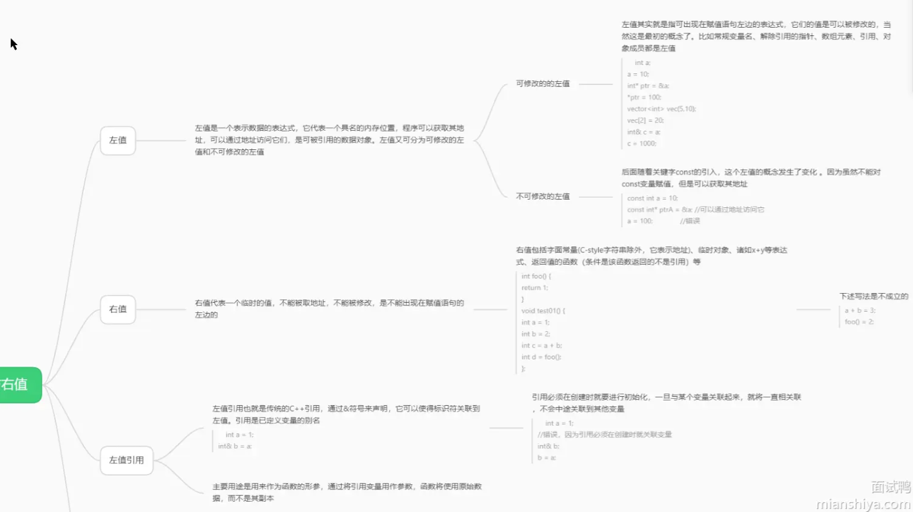
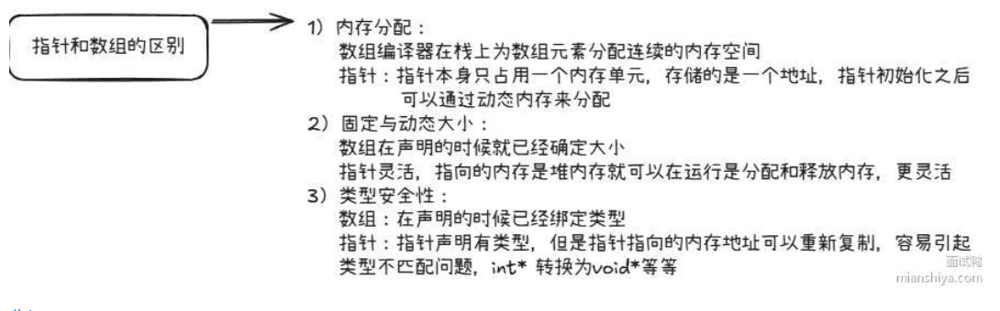

# c++编译链接流程
## 编译链接流程
### 编译命令

```bash
g++ hello.cpp -o hello
```

这一步做了很多事：

| 阶段         | 工具           | 作用                       |
|--------------|----------------|----------------------------|
| 预处理       | `cpp`          | 展开 `#include` 等宏指令   |
| 编译         | `cc1plus`      | 把 C++ 转成汇编             |
| 汇编         | `as`           | 把汇编转成目标文件 `.o`    |
| 链接         | `ld`           | 把目标文件和库链接为 `ELF` 可执行文件 |

---
C++ 的 **编译链接流程** 是将源代码变成可执行文件的全过程，通常分为四个主要阶段：

---

### 🔧 一、预处理（Preprocessing）

命令：`g++ -E main.cpp -o main.i`

#### 做了什么：
- 展开 `#include` 文件
- 替换宏定义 `#define`
- 处理条件编译 `#ifdef`、`#ifndef` 等

#### 示例：
```cpp
#include <iostream>
#define PI 3.14
```
➡️ 会变成展开后的文本（插入 `<iostream>` 的内容，宏替换为 `3.14`）

---

### 🔨 二、编译（Compilation）

命令：`g++ -S main.i -o main.s`

#### 做了什么：
- 将 **预处理后的代码** 转换为 **汇编代码**
- 语法分析 + 语义分析 + 生成中间代码 + 优化 + 汇编代码生成

#### 示例：
```cpp
int main() {
    return 0;
}
```
➡️ 编译器会生成 `.s` 汇编文件，对应 `main` 函数的汇编实现。

---

### 🧱 三、汇编（Assembling）

命令：`g++ -c main.s -o main.o`

#### 做了什么：
- 将汇编代码 `.s` 转为机器码，生成目标文件 `.o`
- 机器码还不是最终程序，里面的函数地址、变量地址还是**相对的或未解析的**

---

### 🔗 四、链接（Linking）

命令：`g++ main.o -o main`

#### 做了什么：
- 把多个 `.o` 文件、**库文件**（如 `libstdc++`）合并成一个可执行文件
- 解析函数调用、变量引用等符号
- 补全地址，生成最终可执行的 ELF 文件（Linux 下）

#### 会处理的问题：
- 多个 `.cpp` 文件中的函数调用
- 库函数的连接，如 `std::cout`、`malloc` 等
- 检查重定义、未定义引用等错误

---

### 🧠 总结一张图：

```text
main.cpp
   ↓   预处理（展开头文件）
main.i
   ↓   编译（生成汇编）
main.s
   ↓   汇编（生成目标文件）
main.o
   ↓   链接（合并符号地址）
main（可执行文件）
```

---

### 🎯 常见错误示例

| 错误 | 出现阶段 | 说明 |
|------|---------|------|
| 语法错误 | 编译阶段 | 比如漏写分号 |
| undefined reference to `foo()` | 链接阶段 | 找不到函数定义 |
| multiple definition of `var` | 链接阶段 | 多个 `.cpp` 中定义了同名全局变量 |

---

如果你想了解链接器如何处理多个 `.o` 文件或如何使用 `static`、`extern` 控制符号的链接作用域，也可以继续问我 😎

## .o文件 ELF（Executable and Linkable Format）
好问题！我们来深入聊一聊编译后的 `.o` 文件格式——**ELF（Executable and Linkable Format）**，这是 Linux 等类 Unix 系统下的标准可执行文件格式。

---

### ✅ 什么是 ELF？

**ELF（Executable and Linkable Format）** 是一种用于表示可执行文件、目标文件（`.o`）、共享库（`.so`）以及核心转储（core dump）的通用文件格式。

在 C++ 编译过程中，`.cpp` 源文件被编译为 `.o` 对象文件，格式就是 ELF。

---

### 📦 ELF 的基本结构

一个 ELF 文件（比如 `.o` 文件）结构如下图所示：

```
+------------------+
| ELF Header       |
+------------------+
| Section Headers  | <--- 描述各个段的信息
+------------------+
| .text section    | <--- 代码段（机器指令）
+------------------+
| .data section    | <--- 已初始化的全局变量
+------------------+
| .bss section     | <--- 未初始化的全局变量（不会实际占空间）
+------------------+
| .rodata section  | <--- 只读数据（常量字符串等）
+------------------+
| .symtab section  | <--- 符号表（变量、函数名等）
+------------------+
| .rel/.rela       | <--- 重定位表（链接时使用）
+------------------+
| .debug section   | <--- 调试信息（如果保留了）
+------------------+
```

---

### 🔍 常见 `.o` 中的几个重要段（Sections）

| 段名       | 作用 |
|------------|------|
| `.text`    | 存储程序的**机器代码**（函数体等） |
| `.data`    | 已初始化的全局/静态变量 |
| `.bss`     | 未初始化的全局/静态变量（运行时为其分配内存） |
| `.rodata`  | 常量数据（如字符串字面量） |
| `.symtab`  | 符号表：记录变量、函数等的符号及其位置 |
| `.rel.text` 或 `.rela.text` | 描述 `.text` 段中的**待链接符号** |
| `.debug_*` | GCC 或 clang 在开启 `-g` 选项时生成的调试信息 |

---

### 📎 ELF 文件 vs 链接器 vs 可执行文件

- `.o` 是 ELF 格式的**中间目标文件**（不是完整可执行程序）
- 多个 `.o` 文件会在链接时被 `ld` 链接为一个完整的 ELF 可执行文件或 `.so` 共享库
- 链接完成后仍然是 ELF，但结构更复杂（含段表 + 程序头表）

---

### 🛠️ 工具查看 ELF 文件

你可以用以下命令查看 `.o` 文件的 ELF 信息：

```bash
readelf -a test.o      # 查看全部信息
readelf -S test.o      # 查看 section 表
nm test.o              # 查看符号表
objdump -d test.o      # 反汇编代码段
```

---

### 💡 小结

| 项 | 内容 |
|----|------|
| `.o` 文件格式 | ELF（Executable and Linkable Format） |
| 包含内容 | 代码、数据、符号表、重定位信息、调试信息等 |
| 作用 | 提供中间代码供链接器组合为最终程序 |
| 可读工具 | `readelf`、`nm`、`objdump` 等 |

如果你想，我可以带你手动分析一个 `.o` 文件生成的 ELF 结构，来个小实战也不错 😎


# C++11新特性


# 左值 & 右值 & 引用 & 移动 & 完美转发



移动语义就是将资源的所有权进行转让，而不是对其进行拷贝，提升程序的性能

完美转发其实就是利用引用折叠，准确的传递参数的值类别(左值或右值)，避免参数传递过程中发生多余的拷贝或移动构造
```cpp
void PrintV(int &t) {
    cout << "lvalue" << endl;
}

void PrintV(int &&t) {
    cout << "rvalue" << endl;
}

template<typename T>
void Test(T &&t) {
    PrintV(t);
    PrintV(std::forward<T>(t));

    PrintV(std::move(t));
}

int main() {
    Test(1); // lvalue rvalue rvalue
    int a = 1;
    Test(a); // lvalue lvalue rvalue
    Test(std::forward<int>(a)); // lvalue rvalue rvalue
    Test(std::forward<int&>(a)); // lvalue lvalue rvalue
    Test(std::forward<int&&>(a)); // lvalue rvalue rvalue
    return 0;
}

```

# 列表初始化
- 避免类型窄化，防止因隐式转化发生的精度丢失(float->int)
- 对于容器，可以接受任意的初始化长度
- 可以直接用聚合类型如struct的初始化，

## STL列表初始化原理
### **`std::vector<int> arr = {1,2};` 列表初始化的底层过程**
在 C++11 之后，`std::vector` 可以使用 **列表初始化** 进行初始化，例如：
```cpp
std::vector<int> arr = {1, 2};
```
其底层涉及多个步骤，下面详细解析其整个过程。

---

### **1. 解析 `std::vector<int> arr = {1,2};`**
编译器看到 `{1, 2}` 时，会尝试匹配 `std::vector` 提供的 **构造函数**。
C++11 的 `std::vector` 提供了一个 **`std::initializer_list<T>` 构造函数**：
```cpp
explicit vector(std::initializer_list<T> init, 
                const Allocator& alloc = Allocator());
```
由于 `{1,2}` 是 `std::initializer_list<int>` 类型，因此 **匹配这个构造函数**，并执行：

```cpp
std::vector<int> arr(std::initializer_list<int>{1,2});
```

---

### **2. `std::initializer_list<int>` 的底层**
`std::initializer_list<T>` 是一个 **轻量级的代理对象**，它并不会存储数据，而是指向一段临时数组。其实现类似：
```cpp
template <typename T>
class initializer_list {
private:
    const T* array;  // 指向数据的指针
    size_t size;     // 数据大小
public:
    constexpr initializer_list(const T* first, size_t sz) : array(first), size(sz) {}
    
    constexpr const T* begin() const { return array; }
    constexpr const T* end() const { return array + size; }
    constexpr size_t size() const { return size; }
};

```
对于 `{1,2}`，编译器会创建一个 `std::initializer_list<int>`，并存放 `1,2` 到一个 **临时数组**（通常存放在栈或静态存储区）。

---

### **3. `std::vector` 构造过程**
 **(1) `std::vector` 解析 `std::initializer_list<T>`**
进入 `std::vector` 的构造函数：
```cpp
template <typename T, typename Allocator = std::allocator<T>>
class vector {
public:
    explicit vector(std::initializer_list<T> init, const Allocator& alloc = Allocator()) {
        size_t n = init.size();
        start = allocate(n);  // 分配 n 个元素的内存
        finish = start;
        end_of_storage = start + n;
        std::uninitialized_copy(init.begin(), init.end(), start);  // 复制数据
    }
};
```
 **(2) `allocate(n)` 分配内存**
默认 `std::allocator<T>` 负责内存分配：
```cpp
T* allocate(size_t n) {
    return static_cast<T*>(::operator new(n * sizeof(T)));
}
```
如果 `n=2`，则 `allocate(2)` 会调用 `operator new(2 * sizeof(int))`，分配 **足够存储 2 个 `int` 的堆空间**。

 **(3) `std::uninitialized_copy` 复制数据**
```cpp
T* uninitialized_copy(const T* first, const T* last, T* dest) {
    while (first != last) {
        new (dest) T(*first);  // 在目标地址上调用构造函数
        ++dest;
        ++first;
    }
    return dest;
}
```
这里的 `new (dest) T(*first);` **使用了 placement new**，它不会重新分配内存，而是在 `dest` 指向的地址上构造对象。  
执行完后，`arr` 内部的数据存储变为：
```
start ---> [1] [2] (end_of_storage)
```
表示 `std::vector<int>` 现在存储了 `{1,2}`。

---

### **4. 变量 `arr` 作用域结束，析构释放内存**
当 `arr` 作用域结束，调用 `std::vector` 的析构函数：
```cpp
~vector() {
    for (T* p = start; p != finish; ++p) {
        p->~T();  // 调用析构函数
    }
    ::operator delete(start);  // 释放堆内存
}
```
由于 `int` 没有复杂析构逻辑，因此 `p->~T();` 没有影响，但 `::operator delete(start);` 释放了堆内存。

---

### **总结**
对于 `std::vector<int> arr = {1,2};`：
1. **创建 `std::initializer_list<int>`**，指向 `{1,2}` 这个临时数组。
2. **调用 `std::vector(std::initializer_list<T>)` 构造函数**，确定存储大小。
3. **调用 `allocate(n)` 分配 `n` 个 `int` 的堆内存**。
4. **调用 `std::uninitialized_copy` 复制 `{1,2}` 到堆内存**。
5. **析构时调用 `operator delete` 释放内存**。

这个过程确保 `std::vector` **高效管理内存，并支持动态扩展**。


# 智能指针
C++11 及以后的标准库提供了三种智能指针：  

- **`std::unique_ptr`** —— 独占所有权，不能复制，支持移动语义。  
- **`std::shared_ptr`** —— 共享所有权，使用引用计数管理资源。  
- **`std::weak_ptr`** —— 弱引用，不影响 `std::shared_ptr` 的引用计数，防止循环引用。  

---

## **1. `std::unique_ptr` API**
`std::unique_ptr` 是独占所有权的智能指针，一个 `std::unique_ptr` 只能有一个实例管理对象。

### **构造 & 赋值**
```cpp
std::unique_ptr<int> p1(new int(42));    // 直接初始化
std::unique_ptr<int> p2 = std::make_unique<int>(42); // 推荐：使用 make_unique 创建
std::unique_ptr<int[]> p3 = std::make_unique<int[]>(10); // 创建动态数组

std::unique_ptr<int> p4 = std::move(p1);  // p1 转移给 p4，p1 变为空
```

### **访问资源**
```cpp
int val = *p2;  // 解引用
int* rawPtr = p2.get();  // 获取原生指针
```

### **释放资源**
```cpp
p2.reset();  // 释放对象，p2 变为空
p2.reset(new int(99));  // 释放旧资源，分配新对象
p3.release();  // 释放所有权，返回原生指针（需要手动 delete）
```

### **检查状态**
```cpp
if (p2) { std::cout << "p2 is not empty\n"; }
```

---

## **2. `std::shared_ptr` API**
`std::shared_ptr` 通过引用计数共享资源，多个 `shared_ptr` 可管理同一对象。

### **构造 & 赋值**
```cpp
std::shared_ptr<int> p1(new int(42));  // 直接创建（不推荐）
std::shared_ptr<int> p2 = std::make_shared<int>(42); // 推荐：更高效
std::shared_ptr<int> p3 = p2;  // 共享所有权，引用计数 +1
std::shared_ptr<int[]> p4 = std::make_shared<int[]>(10); // 创建动态数组
```

### **访问资源**
```cpp
int val = *p2;  // 解引用
int* rawPtr = p2.get();  // 获取原生指针
```

### **释放资源**
```cpp
p2.reset();  // 释放对象，p2 变为空，引用计数 -1
p2.reset(new int(99));  // 释放旧资源，分配新对象
```

### **获取引用计数**
```cpp
std::cout << "Use count: " << p2.use_count() << std::endl;
```

### **检查状态**
```cpp
if (p2) { std::cout << "p2 is not empty\n"; }
```

---

## **3. `std::weak_ptr` API**
`std::weak_ptr` 是 `std::shared_ptr` 的弱引用，不增加引用计数，用于防止循环引用。

### **创建 & 赋值**
```cpp
std::shared_ptr<int> sp = std::make_shared<int>(42);
std::weak_ptr<int> wp = sp;  // wp 不增加引用计数
```

### **访问资源**
```cpp
if (auto locked = wp.lock()) {  // 尝试获取 shared_ptr
    std::cout << *locked << std::endl;
}
```

### **检查状态**
```cpp
if (!wp.expired()) { std::cout << "Resource still exists\n"; }
```

### **获取引用计数**
```cpp
std::cout << "Use count: " << wp.use_count() << std::endl;
```

---
### **`std::weak_ptr::lock()` 的原理**
`std::weak_ptr::lock()` 用于尝试获取 `std::shared_ptr`，如果资源仍然有效（即 `use_count > 0`），则返回一个新的 `std::shared_ptr`，否则返回一个空的 `shared_ptr`。

---

### **底层实现**
`std::weak_ptr` 内部持有一个 **控制块（Control Block）**，该控制块包含：
- **引用计数（use_count）**: 记录当前有多少个 `shared_ptr` 共享该资源。
- **弱引用计数（weak_count）**: 记录有多少个 `weak_ptr` 持有对资源的观察。

`lock()` 的原理是：
1. 检查 `use_count` 是否大于 `0`（资源是否仍然被 `shared_ptr` 管理）。
2. 如果 `use_count > 0`，则创建一个新的 `shared_ptr`，引用计数 +1，并返回这个 `shared_ptr`。
3. 如果 `use_count == 0`，返回一个空的 `shared_ptr`，表示资源已经释放。

---

### **示例代码**
```cpp
#include <iostream>
#include <memory>

int main() {
    std::shared_ptr<int> sp = std::make_shared<int>(42);
    std::weak_ptr<int> wp = sp;  // weak_ptr 观察 sp

    std::cout << "Use count before lock: " << wp.use_count() << std::endl;

    if (auto locked = wp.lock()) {  // 获取 shared_ptr
        std::cout << "Locked value: " << *locked << std::endl;
    } else {
        std::cout << "Resource expired" << std::endl;
    }

    sp.reset();  // 释放 shared_ptr，资源被释放

    if (auto locked = wp.lock()) {  // 再次尝试 lock
        std::cout << "Locked value: " << *locked << std::endl;
    } else {
        std::cout << "Resource expired" << std::endl;
    }

    return 0;
}
```

**输出**
```
Use count before lock: 1
Locked value: 42
Resource expired
```

---

### **lock() 的底层工作流程**
1. **检查 `use_count` 是否大于 0**：
   - `std::weak_ptr` 访问控制块，检查 `use_count`。
   - 如果 `use_count == 0`，则返回一个空的 `shared_ptr`，表示资源已释放。

2. **如果 `use_count > 0`，创建新的 `shared_ptr`**：
   - `shared_ptr` 递增 `use_count`，确保资源不被释放。
   - 返回新的 `shared_ptr`，保证访问资源时不会发生未定义行为。

---

### **lock() 防止悬空指针**
如果 `std::weak_ptr` 直接使用 `get()` 获取原生指针：
```cpp
int* rawPtr = wp.get();  // 可能会访问已释放的对象
```
但 `lock()` **确保了资源仍然存在**，避免悬空指针：
```cpp
if (auto sp = wp.lock()) {
    // 安全访问资源
}
```

---

### **总结**
- `lock()` 通过 `use_count` 检查资源是否仍然有效。
- 如果 `use_count > 0`，则创建一个新的 `shared_ptr` 并返回，确保资源不会被释放。
- 如果 `use_count == 0`，返回空的 `shared_ptr`，防止访问已释放的资源。
- `lock()` 机制避免了 `get()` 可能导致的悬空指针问题。

---
✅ **建议**
- **永远使用 `lock()` 获取 `std::shared_ptr`，不要直接用 `get()`。**
- **在多线程环境下，`lock()` 也能保证 `shared_ptr` 的安全性，而 `get()` 可能导致资源访问冲突。**

## **总结**
| API | `std::unique_ptr` | `std::shared_ptr` | `std::weak_ptr` |
|------|------------------|------------------|------------------|
| `make_xxx<T>()` | ✅ 推荐 `make_unique` | ✅ 推荐 `make_shared` | ❌ 不能创建 |
| `get()` | ✅ 获取原生指针 | ✅ 获取原生指针 | ✅ 获取原生指针 |
| `reset()` | ✅ 释放资源 | ✅ 释放资源 | ❌ 无影响 |
| `release()` | ✅ 释放所有权 | ❌ 不支持 | ❌ 不支持 |
| `use_count()` | ❌ 不支持 | ✅ 获取引用计数 | ✅ 获取引用计数 |
| `lock()` | ❌ 不支持 | ❌ 不支持 | ✅ 转换为 `shared_ptr` |
| `expired()` | ❌ 不支持 | ❌ 不支持 | ✅ 检查是否为空 |
| `operator* / ->` | ✅ 访问对象 | ✅ 访问对象 | ❌ 需要 `lock()` |

✅ **建议**
- **尽量使用 `std::make_unique` 和 `std::make_shared` 创建对象**
- **避免 `std::shared_ptr` 直接管理 `new` 分配的对象，可能会导致两次 `delete`**
- **使用 `std::weak_ptr` 防止 `std::shared_ptr` 循环引用**

## share_from_this
面试官可能问你的问题可能与 **`shared_ptr` 和 `this` 指针** 相关，通常涉及 **智能指针管理对象的生命周期** 以及 **避免 `shared_ptr` 误用的问题**。以下是几个可能的问题，以及对应的解答和陷阱。

---

### **问题 1：能否在类的成员函数中使用 `shared_ptr` 指向 `this`？**
 **错误示例**
```cpp
#include <iostream>
#include <memory>

class A {
public:
    void foo() {
        std::shared_ptr<A> pThis(this);  // ❌ 直接用 this 构造 shared_ptr
    }
};

int main() {
    std::shared_ptr<A> p = std::make_shared<A>();
    p->foo();
}
```
 **为什么这样做是错误的？**
- **会导致 double delete（双重释放）**：
  - `make_shared<A>()` 会分配一块内存来存储 `A` 对象，并且 `p` 管理这块内存。
  - `foo()` 里 `std::shared_ptr<A> pThis(this);` **又创建了一个 `shared_ptr`，但它和 `p` 是独立的**，没有共享引用计数。
  - `p` 和 `pThis` **分别认为自己独占管理 `A`，当 `p` 和 `pThis` 释放时，会导致 `A` 被 `delete` 两次**，引发 **未定义行为**。

---

### **问题 2：如何在成员函数中安全获取 `shared_ptr`？**
**✅ 正确方式：使用 `std::enable_shared_from_this`**
```cpp
#include <iostream>
#include <memory>

class A : public std::enable_shared_from_this<A> {  // 继承 enable_shared_from_this
public:
    std::shared_ptr<A> getSharedPtr() {
        return shared_from_this();  // ✅ 正确方式，获取已有的 shared_ptr
    }
};

int main() {
    std::shared_ptr<A> p = std::make_shared<A>();
    std::shared_ptr<A> p2 = p->getSharedPtr();  // 共享 p 的引用计数
    std::cout << "引用计数: " << p.use_count() << std::endl;  // 输出 2
}
```
 **为什么 `enable_shared_from_this` 可以避免问题？**
- `enable_shared_from_this` 内部维护了 `shared_ptr`，**`shared_from_this()` 返回的是已有的 `shared_ptr`**，不会重复创建新的 `shared_ptr`，也就不会导致 `delete` 两次的问题。

---

### **问题 3：如果 `A` 不是 `shared_ptr` 创建的，还能 `shared_from_this()` 吗？**
```cpp
A a;
std::shared_ptr<A> p = a.getSharedPtr();  // ❌ 错误，未定义行为
```
如果 `A` 对象不是用 `std::shared_ptr` 管理的（比如 `A a;` 是栈对象），调用 `shared_from_this()` 会导致 **未定义行为**，因为 `shared_from_this()` 需要依赖 `shared_ptr` 的引用计数，而普通对象没有这个机制。

✅ **正确做法**：
```cpp
std::shared_ptr<A> p = std::make_shared<A>();
std::shared_ptr<A> p2 = p->getSharedPtr();  // 安全
```

---

### **问题 4：为什么 `enable_shared_from_this` 不能和 `std::make_shared` 以外的方法一起使用？**
假设你 **手动 new** 一个 `A`，然后用 `shared_ptr` 管理它：
```cpp
A* rawPtr = new A();  
std::shared_ptr<A> p1(rawPtr);  // ❌
std::shared_ptr<A> p2 = rawPtr->getSharedPtr();  // ❌ 未定义行为
```
- `p1` 认为自己是唯一拥有 `A` 的 `shared_ptr`。
- `rawPtr->getSharedPtr()` 试图访问 `shared_ptr` 的引用计数，但它不知道 `p1` 存在，导致 **未定义行为**。
- **解决方案：永远使用 `std::make_shared<A>()` 创建对象**。

---

### **总结**
 **❌ 错误做法**
1. **不要在类的成员函数中直接 `shared_ptr<A>(this);`**，会导致 **double delete**。
2. **不要手动 `new A` 再创建 `shared_ptr<A>`**，然后调用 `shared_from_this()`，会 **未定义行为**。

 **✅ 正确做法**
1. **如果类需要 `shared_ptr` 管理自己，继承 `std::enable_shared_from_this<T>`**。
2. **用 `shared_from_this()` 获取 `shared_ptr`**，而不是 `shared_ptr<A>(this)`。
3. **必须使用 `std::make_shared<A>()` 创建对象**，确保 `enable_shared_from_this` 内部管理的 `weak_ptr` 绑定到 `shared_ptr`。

**面试官问 `shared_ptr` 和 `this` 指针，大概率是考察 `enable_shared_from_this` 及其错误用法。希望这能帮你回忆起来！** 🚀


## 为什么share_from_this一定要搭配make_shared进行使用

---

### **🌟 `enable_shared_from_this<T>` + `make_shared<T>()` 的工作机制**
1. **`make_shared<T>()` 创建 `shared_ptr<T>`**：
   - 分配一个 **`T` 对象** 和 **控制块**（包含引用计数）。
   - 让 `shared_ptr<T>` 管理 `T` 对象，并 **初始化 `enable_shared_from_this<T>::_Wptr`** 使其指向控制块。

2. **`shared_from_this()` 获取 `shared_ptr<T>`**：
   - 直接使用 `_Wptr` 生成 `shared_ptr<T>`，**确保所有 `shared_ptr` 共享相同的控制块**。

---

#### **🚀 具体示例**
```cpp
#include <iostream>
#include <memory>

class A : public std::enable_shared_from_this<A> {
public:
    std::shared_ptr<A> getSharedPtr() {
        return shared_from_this();  // ✅ 直接从 _Wptr 获取 shared_ptr
    }

    ~A() {
        std::cout << "A::~A() called" << std::endl;
    }
};

int main() {
    // ✅ `make_shared<A>()` 让 `shared_ptr` 和 `enable_shared_from_this` 共享控制块
    std::shared_ptr<A> p1 = std::make_shared<A>();

    // ✅ 共享相同的控制块
    std::shared_ptr<A> p2 = p1->getSharedPtr();

    std::cout << "p1.use_count() = " << p1.use_count() << std::endl;  // 2
}
```
**输出**
```
p1.use_count() = 2
A::~A() called
```

---

#### **🔍 `enable_shared_from_this<T>` 关键机制**
1. `make_shared<A>()` **创建 `A` 和控制块**，并让 `p1` 管理它：
   - `p1` **记录了控制块的引用计数**。
   - `p1` **初始化 `enable_shared_from_this<A>::_Wptr`** 指向控制块。

2. `p1->getSharedPtr()` 调用 `shared_from_this()`：
   - `shared_from_this()` 通过 `_Wptr` 创建 **新的 `shared_ptr`（p2）**。
   - `p1` 和 `p2` **共享相同的控制块**，`use_count()` 增加。

3. 作用：
   - **避免 `double delete`**（多个 `shared_ptr` 指向同一对象但有不同控制块）。
   - **确保所有 `shared_ptr` 共享相同的控制块**。

---

### **🚨 如果直接 `new` 而不是 `make_shared`，会发生什么？**
错误示例：
```cpp
A* rawPtr = new A();  
std::shared_ptr<A> p1(rawPtr);  // ❌ 直接用 rawPtr 创建 shared_ptr
std::shared_ptr<A> p2 = rawPtr->getSharedPtr();  // ❌ 未定义行为（UB）
```
#### **❌ 这里的问题**
1. `p1` 没有通知 `enable_shared_from_this<A>`，所以 `_Wptr` 为空。
2. `rawPtr->getSharedPtr()` 访问未初始化的 `_Wptr`，导致 **UB（未定义行为）**。

✅ **正确做法**
```cpp
std::shared_ptr<A> p1 = std::make_shared<A>();  // ✅ 确保 `_Wptr` 被正确初始化
std::shared_ptr<A> p2 = p1->getSharedPtr();     // ✅ 安全获取 shared_ptr
```

---

### **🔔 结论**
1. **`enable_shared_from_this<T>` 依赖 `make_shared<T>()` 进行初始化**：
   - 只有 `make_shared<T>()` **能正确初始化 `_Wptr`**，使 `shared_from_this()` 可用。

2. **`shared_from_this()` 直接通过 `_Wptr` 生成 `shared_ptr<T>`**：
   - 确保 **所有 `shared_ptr` 共享同一控制块**，避免 `double delete` 和 `use-after-free`。

3. **错误：直接 `new T()` 再创建 `shared_ptr<T>`**：
   - `enable_shared_from_this<T>::_Wptr` 不会初始化，导致 `shared_from_this()` **行为未定义（UB）**。

✅ **正确做法：始终使用 `std::make_shared<T>()` 创建对象！** 🚀

## share_from_this的底层实现


## 面试题
### 智能指针有哪些，有什么区别
- **`std::unique_ptr`** —— 独占所有权，不能复制，支持移动语义。  
- **`std::shared_ptr`** —— 共享所有权，使用引用计数管理资源。  
- **`std::weak_ptr`** —— 弱引用，不影响 `std::shared_ptr` 的引用计数，防止循环引用。 
> **use_count和weak_count的区别**
>> 在共享指针中有一个**控制块**和指向资源的指针，控制块中包含use_count以及weak_count，分别指指向资源的共享指针的数量以及指向该资源的弱指针的数量，**因为弱指针需要通过use_count判断资源是否还存在**(所以对象释放后控制块不一定释放)，weak_count和use_count共同决定了控制块何时释放，use_count决定对象何时释放


### makeshare和shareptr(new)相比有什么好处
在 C++11 及之后的标准中，`std::make_shared` 和 `std::shared_ptr<T>(new T)` 都可以用于创建 `std::shared_ptr`，但 `std::make_shared` 在**性能**和**安全性**方面都有明显的优势。接下来，我会从**底层实现的角度**详细分析两者的区别，并解释为什么 `std::make_shared` 更加推荐。


---

 **1. `std::shared_ptr<T>(new T)` 的底层实现**
 **创建过程**
```cpp
std::shared_ptr<int> sp(new int(10));
```
- `new int(10)` 在**堆上**分配一块内存来存储 `int` 类型的对象 `10`。
- `std::shared_ptr` **单独**分配**控制块（control block）**，用于管理引用计数。

 **内存布局**
在 `std::shared_ptr<int>(new int(10))` 的情况下，分配了两块独立的堆内存：
1. **对象本身（int）**
2. **控制块**（包含 `use_count` 计数器等元数据）

```plaintext
堆内存分配示意：
+------------------+
|   new int(10)   |   <--- 指针管理的对象
+------------------+

+----------------------+
|  控制块 (ref count) |  <--- 共享指针的引用计数
+----------------------+
```
**问题**：
- **额外的堆内存开销**：`new int(10)` 和 `control block` 是分开分配的，导致**两次分配（malloc）**。
- **异常安全性问题**：
  - 如果 `new int(10)` 成功，但 `shared_ptr` 的构造过程中发生异常（比如 `bad_alloc`），对象不会被正确释放，导致**内存泄漏**。

---

 **2. `std::make_shared<T>` 的底层实现**
 **创建过程**
```cpp
std::shared_ptr<int> sp = std::make_shared<int>(10);
```
- `std::make_shared` **一次性分配** 一整块**连续的堆内存**，同时存放：
  - **控制块**
  - **T 类型的对象（int 10）**
- 避免了 `new T` 和 `control block` **分开分配**的情况。

 **内存布局**
在 `std::make_shared<int>(10)` 的情况下：
```plaintext
堆内存分配示意：
+----------------------+
|  控制块 (ref count)  |  <--- 共享指针的引用计数
|----------------------|
|     new int(10)     |  <--- 指针管理的对象
+----------------------+
```
**优点**：
- **减少了内存分配次数**（只进行一次 `malloc`）
- **提高了 CPU 缓存局部性**（控制块和对象在同一块内存中）
- **异常安全**（整个 `make_shared` 过程要么成功创建 `shared_ptr`，要么不会泄露内存）

---

 **3. `std::make_shared<T>` vs. `std::shared_ptr<T>(new T)` 对比**
| 对比项 | `std::shared_ptr<T>(new T)` | `std::make_shared<T>` |
|--------|------------------------------|------------------------|
| **内存分配** | 2 次 (`new T` 和 `malloc` 控制块) | 1 次（合并对象和控制块） |
| **性能** | 慢（多次分配 & 访问） | 快（减少 `malloc` & 内存局部性好） |
| **安全性** | 可能导致异常引发的内存泄漏 | **异常安全** |
| **CPU 缓存效率** | 差（对象和控制块不连续） | **好（对象和控制块连续存储）** |

---

 **4. `make_shared` 的问题**
虽然 `std::make_shared` 优势明显，但它**也有一些限制**：
1. **无法使用自定义 deleter**
   - `std::shared_ptr<T>` 允许用户传入一个自定义的删除器，例如：
     ```cpp
     std::shared_ptr<int> sp(new int(10), [](int* p) { delete p; std::cout << "Deleted\n"; });
     ```
   - 但 `std::make_shared` **不支持** 自定义 deleter，因为 `make_shared` 一次性分配的内存必须由标准的 `delete` 释放。

2. **对象生命周期受 `shared_ptr` 管理**
   - 由于 `make_shared` 将对象和控制块放在一起，**不能将对象的裸指针 `delete`**，否则会导致未定义行为：
     ```cpp
     auto sp = std::make_shared<int>(10);
     int* p = sp.get();
     delete p;  // ❌ 错误！破坏了 shared_ptr 管理的内存
     ```

3. **适用于小对象，不适合大对象**
   - 如果 `T` 是一个非常大的对象，比如 `std::vector<int>`，`std::make_shared<T>` 可能导致**大块内存分配**，不如 `shared_ptr<T>(new T)` 更灵活。

---

**5. 代码示例**
 **性能对比**
```cpp
#include <iostream>
#include <memory>
#include <chrono>

struct Big {
    int data[1000];
};

int main() {
    constexpr int ITERATIONS = 100000;

    auto start1 = std::chrono::high_resolution_clock::now();
    for (int i = 0; i < ITERATIONS; i++) {
        std::shared_ptr<Big> sp1(new Big);  // 两次 malloc
    }
    auto end1 = std::chrono::high_resolution_clock::now();
    std::cout << "shared_ptr(new T) 耗时: " 
              << std::chrono::duration_cast<std::chrono::microseconds>(end1 - start1).count()
              << " 微秒" << std::endl;

    auto start2 = std::chrono::high_resolution_clock::now();
    for (int i = 0; i < ITERATIONS; i++) {
        std::shared_ptr<Big> sp2 = std::make_shared<Big>();  // 一次 malloc
    }
    auto end2 = std::chrono::high_resolution_clock::now();
    std::cout << "make_shared 耗时: " 
              << std::chrono::duration_cast<std::chrono::microseconds>(end2 - start2).count()
              << " 微秒" << std::endl;
}
```
**预期输出（不同机器可能有所不同）：**
```plaintext
shared_ptr(new T) 耗时: 1500000 微秒
make_shared 耗时: 1000000 微秒
```
**结果：`std::make_shared` 大约快 30%-50%！**

---

**6. 结论**
 **什么时候使用 `make_shared`？**
✅ **优先使用 `make_shared`**，除非：
- **需要自定义 deleter**（只能用 `shared_ptr<T>(new T, deleter)`）
- **T 是个大对象**，希望 `T` 和 `控制块` 分开分配
- **需要更灵活的对象生命周期控制**

---

 **最佳实践**
| 推荐方式 | 使用场景 |
|----------|--------------------------|
| `std::make_shared<T>(args...)` | **默认选择，性能更好，减少 `malloc`** |
| `std::shared_ptr<T>(new T)` | 需要**自定义 deleter** 或 `T` **很大** |

**💡 结论：** `std::make_shared` 更高效、更安全，应当是**默认选择**！


### shared_ptr是线程安全的吗
引用计数的更新采用的是atomic原子操作，对于引用计数来说是线程安全的，
但是对于所管理的资源来说不是，可能会发生多个线程同时更新资源，从而产生竞争

### 使用atomic实现shared_ptr
实现思路
1. 引用计数： shared_ptr 需要一个引用计数来追踪当前有多少个 shared_ptr 指向同一个对象。这个引用计数需要在多个线程间共享，因此必须使用原子操作（例如 std::atomic）来进行递增和递减。

2. 资源管理： shared_ptr 的工作是确保它管理的对象在不再需要时被正确销毁。为此，需要跟踪对象的生命周期，通常通过析构函数来释放资源。

3. 析构和拷贝构造： 在拷贝一个 shared_ptr 时，需要递增引用计数。销毁 shared_ptr 时，需要递减引用计数，并在引用计数为零时销毁对象。

4. 原子引用计数： 使用 std::atomic 来确保引用计数的递增和递减是原子操作，避免竞态条件。
```cpp
#include <iostream>
#include <atomic>
#include <memory>

template <typename T>
class atomic_shared_ptr {
public:
    // 构造函数
    explicit atomic_shared_ptr(T* ptr = nullptr)
        : ptr_(ptr), count_(new std::atomic<int>(1)) {}

    // 拷贝构造函数
    atomic_shared_ptr(const atomic_shared_ptr& other)
        : ptr_(other.ptr_), count_(other.count_) {
        // 增加引用计数
        count_->fetch_add(1, std::memory_order_relaxed);
    }

    // 移动构造函数
    atomic_shared_ptr(atomic_shared_ptr&& other) noexcept
        : ptr_(other.ptr_), count_(other.count_) {
        other.ptr_ = nullptr;
        other.count_ = nullptr;
    }

    // 析构函数
    ~atomic_shared_ptr() {
        if (count_ && count_->fetch_sub(1, std::memory_order_acq_rel) == 1) {
            delete ptr_;
            delete count_;
        }
    }

    // 重载赋值操作符
    atomic_shared_ptr& operator=(const atomic_shared_ptr& other) {
        if (this != &other) {
            // 释放当前资源
            if (count_->fetch_sub(1, std::memory_order_acq_rel) == 1) {
                delete ptr_;
                delete count_;
            }

            // 复制数据
            ptr_ = other.ptr_;
            count_ = other.count_;
            count_->fetch_add(1, std::memory_order_relaxed);
        }
        return *this;
    }

    // 重载移动赋值操作符
    atomic_shared_ptr& operator=(atomic_shared_ptr&& other) noexcept {
        if (this != &other) {
            // 释放当前资源
            if (count_->fetch_sub(1, std::memory_order_acq_rel) == 1) {
                delete ptr_;
                delete count_;
            }

            // 移动数据
            ptr_ = other.ptr_;
            count_ = other.count_;
            other.ptr_ = nullptr;
            other.count_ = nullptr;
        }
        return *this;
    }

    // 获取底层指针
    T* get() const { return ptr_; }

    // 获取引用计数
    int use_count() const { return count_->load(std::memory_order_acquire); }

private:
    T* ptr_;  // 被管理的指针
    std::atomic<int>* count_;  // 引用计数
};

int main() {
    atomic_shared_ptr<int> sp1(new int(42));

    // 拷贝构造
    atomic_shared_ptr<int> sp2 = sp1;
    std::cout << "use_count after copy: " << sp2.use_count() << std::endl;

    // 移动构造
    atomic_shared_ptr<int> sp3 = std::move(sp1);
    std::cout << "use_count after move: " << sp3.use_count() << std::endl;

    return 0;
}

```


## 智能指针是否是线程安全的
这是一个非常关键的问题，特别是在多线程编程中使用智能指针时。

---

### ✅ 简要结论：  
**C++ 标准库的智能指针并不是完全线程安全的。**

---

### 🔍 分类型分析智能指针的线程安全性

#### 1. `std::unique_ptr`
- **不是线程安全的。**
- `unique_ptr` 不支持拷贝，仅支持移动。
- **多个线程之间不能共享一个 `unique_ptr` 实例**。
- 使用时必须**确保唯一拥有权**在一个线程中。

❗如果两个线程试图对同一个 `unique_ptr` 进行读写（比如一个线程 reset，另一个线程访问），就是**数据竞争**，结果是未定义行为。

---

#### 2. `std::shared_ptr`
- **共享所有权是线程安全的。**
- **引用计数的增加和减少操作是原子操作（线程安全）**，这是由底层用 `std::atomic` 或平台原子操作实现的。

##### ✅ 线程安全的部分：
```cpp
std::shared_ptr<T> p1 = std::make_shared<T>();
std::shared_ptr<T> p2 = p1; // 多线程中拷贝 shared_ptr 是安全的
```

##### ❌ 不安全的部分：
多个线程**同时访问或修改同一个 shared_ptr 对象本身**是不安全的：
```cpp
// 错误示例：两个线程操作同一个 shared_ptr 实例（非副本）
std::shared_ptr<T> global_ptr;

void thread1() {
    global_ptr.reset(); // 修改指针
}

void thread2() {
    global_ptr->foo(); // 使用指针
}
```

💥 这里不是线程安全的，因为多个线程访问了 **同一个 shared_ptr 对象**，而不是它的副本。要安全就应该每个线程都有一份自己的拷贝。

---

### ❓ 为什么不是完全线程安全？

#### 关键点在于：

- `shared_ptr` 的 **引用计数机制是线程安全的**
- **对 shared_ptr 本身的操作（如 reset、swap、operator->）不是线程安全的**

🔧 这是因为：
- 引用计数使用了原子操作（比如 `fetch_add`, `fetch_sub`）
- 但 shared_ptr 本身不是原子类型，不保护其成员（比如托管指针本身）

---

### ✅ 如何保证线程安全地使用 shared_ptr？

1. **每个线程持有 shared_ptr 的副本**（拷贝 shared_ptr）
2. 如果多个线程要操作同一个 shared_ptr 对象，需要外部加锁保护
3. 可以使用 `std::atomic<std::shared_ptr<T>>`（C++20 之前是平台扩展）实现线程安全的共享更新

---

### 🧠 总结

| 智能指针类型 | 拥有权线程安全 | 指针操作线程安全 | 说明 |
|--------------|----------------|------------------|------|
| `unique_ptr` | ❌ 否           | ❌ 否             | 不可共享，需单线程使用 |
| `shared_ptr` | ✅ 是（引用计数） | ❌ 否（对象操作）  | 拷贝使用安全，共享实例需加锁 |
| `weak_ptr`   | ✅ 是           | ❌ 否             | 可安全提升为 shared_ptr，但操作自身不安全 |

---

如果你有具体的多线程使用场景或想看看怎么正确使用智能指针写个线程安全的例子，我也可以帮你写一份代码！要不要？


# 引用和指针
 **📌 C++ 中引用（reference）和指针（pointer）的区别**
引用 (`&`) 和指针 (`*`) 都用于间接访问对象，但它们在语法、特性和使用场景上有很多区别。

---

## **1️⃣ 语法和定义**
| 特性  | **指针 (Pointer)** | **引用 (Reference)** |
|------|------------------|------------------|
| **定义** | `int* p = &a;` | `int& r = a;` |
| **访问** | 通过 `*p` 访问对象 | 直接使用 `r` 访问对象 |
| **初始化** | 可以初始化为空 (`nullptr`) | **必须初始化** |
| **重新绑定** | `p = &b;` (指向新的地址) | **不能重新绑定**，一直指向 `a` |
| **是否是对象本身** | 只是存储地址的变量 | 只是 `a` 的别名 |

✅ **示例**
```cpp
int a = 10;
int* p = &a;  // 指针
int& r = a;   // 引用

std::cout << *p << " " << r << std::endl;  // 输出 10 10
```

---

## **2️⃣ 是否必须初始化**
| 特性  | **指针 (Pointer)** | **引用 (Reference)** |
|------|------------------|------------------|
| **是否必须初始化** | 可以声明但不初始化 | **必须初始化** |
| **是否可以指向 `nullptr`** | 可以指向 `nullptr` | ❌ 不能为 `nullptr` |

✅ **示例**
```cpp
int* p;  // ✅ 合法，但指向未知地址，可能是野指针
int& r;  // ❌ 错误，引用必须初始化
```

---

## **3️⃣ 能否重新绑定**
| 特性  | **指针 (Pointer)** | **引用 (Reference)** |
|------|------------------|------------------|
| **是否可以更改所指对象** | ✅ 可以指向新对象 (`p = &b;`) | ❌ 不能重新绑定 (`r` 绑定后不能改) |

✅ **示例**
```cpp
int a = 10, b = 20;

int* p = &a;  // 指针指向 a
p = &b;       // ✅ 可以重新指向 b

int& r = a;   // 引用绑定 a
r = b;        // ❌ r 还是指向 a，只是修改了 a 的值
```
📌 **引用只是一个别名，不是一个独立的变量**。

---

## **4️⃣ 指向常量**
| 特性  | **指针 (Pointer)** | **引用 (Reference)** |
|------|------------------|------------------|
| `const` 修饰对象 | `const int* p;` (指向 `const` 对象) | `const int& r;` |
| `const` 修饰指针 | `int* const p;` (指针本身 `const`) | ❌ 不适用 |

✅ **示例**
```cpp
const int a = 10;
const int* p = &a;  // ✅ 指针指向常量
const int& r = a;   // ✅ 引用绑定常量

*p = 20;  // ❌ 错误，不能修改 a
r = 20;   // ❌ 错误，不能修改 a
```

---

## **5️⃣ 内存占用**
| 特性  | **指针 (Pointer)** | **引用 (Reference)** |
|------|------------------|------------------|
| **占用内存** | **指针存储地址，占用 4/8 字节** | **引用通常不占额外空间**（可能实现上与指针相同） |

✅ **示例**
```cpp
int a = 10;
int* p = &a;
int& r = a;

std::cout << sizeof(p) << std::endl;  // 8 (64 位系统)
std::cout << sizeof(r) << std::endl;  // 4 (通常和 a 一样)
```
📌 **指针有自己的存储空间，引用通常只是一个别名，不额外占内存**。

---

## **6️⃣ 适用场景**
| 场景 | **使用指针 (Pointer)** | **使用引用 (Reference)** |
|------|------------------|------------------|
| **动态内存分配** | `new`/`delete` 需要指针 | ❌ 不能使用 `new`/`delete` |
| **可变对象** | 需要动态绑定对象 | 绑定后不可变 |
| **参数传递** | 需要传 `nullptr` 或可变指向 | 传递对象的别名 |

✅ **示例**
```cpp
void modifyPointer(int* p) { *p = 20; }
void modifyReference(int& r) { r = 30; }

int main() {
    int a = 10;
    modifyPointer(&a);    // 传递地址
    modifyReference(a);   // 传递引用
}
```
📌 **函数参数传引用，避免拷贝，提高性能**。

---

## **7️⃣ 空指针 vs. 无效引用**
| 特性  | **指针 (Pointer)** | **引用 (Reference)** |
|------|------------------|------------------|
| **可以是 `nullptr` 吗？** | ✅ 可以 | ❌ 不能 |
| **可能成为悬空？** | ✅ 可能 (指向释放的内存) | ✅ 可能 (指向无效对象) |

✅ **示例**
```cpp
int* p = nullptr;  // ✅ 合法
int& r = *p;       // ❌ 未定义行为（UB）
```
📌 **引用不能是 `nullptr`，否则是未定义行为**。

---

## **🎯 总结**
| 特性  | **指针 (Pointer)** | **引用 (Reference)** |
|------|------------------|------------------|
| **必须初始化** | ❌ 不是必须的 | ✅ 必须初始化 |
| **可否重新绑定** | ✅ 可以更改指向的对象 | ❌ 不能重新绑定 |
| **是否可 `nullptr`** | ✅ 可以 | ❌ 不能 |
| **是否占内存** | ✅ 占用地址空间 | ❌ 一般不占内存 |
| **用于动态分配** | ✅ 需要 `new/delete` | ❌ 不能使用 |
| **用于传参** | ✅ 传地址 | ✅ 传引用（效率更高） |
| **是否可以指向 `const`** | ✅ 可以指向 `const` | ✅ 可以引用 `const` |

---

## **🎯 什么时候用引用 vs. 指针？**
✅ **使用引用**
- 传递函数参数时，减少拷贝，提高性能 `void func(const std::string& s);`
- 确保绑定后不会更改对象
- 适用于 `RAII`（资源管理）

✅ **使用指针**
- 需要 `nullptr` 作为无效值
- 需要动态分配对象 (`new` / `delete`)
- 需要修改指向的对象 (`p = &b;`)

---

**📌 记住：**
1. **引用更安全**，因为它不能为 `nullptr`，且绑定后不能更改。
2. **指针更灵活**，可以指向 `nullptr`，也可以重新指向新对象。
3. **性能上，引用通常比指针更快**，因为它避免了间接访问。

这样，面试时就能清晰地回答了！🎯💡


# 模板编程
C++ **模板编程**（Template Programming）是一种**编译期多态**技术，广泛用于**泛型编程（Generic Programming）**、**元编程（Template Metaprogramming, TMP）**，以及**STL（标准模板库）**等领域。  

---
## **📌 目录**
### 1️⃣ **模板基础**
   - **函数模板**
   - **类模板**
   - **模板的显式/隐式实例化**
   - **模板的默认参数**
   - **模板的特化**
   - **模板的部分特化**
   - **模板别名 (`using`)**
   - **可变参数模板 (`Variadic Templates`)**
---
### 2️⃣ **高级模板技巧**
   - **模板递归**
   - **SFINAE（Substitution Failure Is Not An Error）**
   - **类型萃取 (`Type Traits`)**
   - **完美转发 (`std::forward`)**
   - **CRTP（Curiously Recurring Template Pattern）**
   - **依赖名称 (`dependent names`)**
   - **模板偏特化 vs. 重载**
   - **模板参数推导规则**
---
### 3️⃣ **模板元编程（TMP）**
   - **编译期常量计算**
   - **编译期 `if` 语句 (`std::enable_if`)**
   - **编译期循环**
   - **递归模板**
   - **模板元编程与 `constexpr`**
   - **C++17 `if constexpr`**
---
### 4️⃣ **模板的底层实现**
   - **模板的实例化机制**
   - **模板与链接**
   - **模板的 ODR（One Definition Rule）**
   - **编译器对模板的优化**
   - **模板代码膨胀**
---

---

## **1️⃣ 模板基础**

### **✅ 函数模板**
**泛型函数**，可以支持不同类型：
```cpp
template <typename T>
T add(T a, T b) {
    return a + b;
}

int main() {
    std::cout << add(3, 5) << "\n";      // int
    std::cout << add(3.2, 5.1) << "\n";  // double
}
```
📌 **关键点**
- `T` 是**模板参数**，可用于表示任意类型。
- `add<int>(3, 5)` **显式指定类型**。
- `add(3, 5)` **自动推导类型**。

---

### **✅ 类模板**
用于定义**泛型类**：
```cpp
template <typename T>
class Box {
private:
    T value;
public:
    Box(T v) : value(v) {}
    T get() { return value; }
};

int main() {
    Box<int> intBox(10);
    std::cout << intBox.get() << std::endl; // 10

    Box<std::string> strBox("Hello");
    std::cout << strBox.get() << std::endl; // Hello
}
```
📌 **关键点**
- `Box<int>`：实例化 `T = int` 版本。
- `Box<std::string>`：实例化 `T = std::string` 版本。

---

### **✅ 模板的默认参数**
```cpp
template <typename T = int>
class DefaultBox {
public:
    T value;
    DefaultBox(T v) : value(v) {}
};

int main() {
    DefaultBox<> a(42);  // 默认为 int
    DefaultBox<double> b(3.14);
}
```

---

### **✅ 显式/隐式实例化**
```cpp
template <typename T>
T square(T x) {
    return x * x;
}

int main() {
    std::cout << square(5);       // 隐式实例化，T 推导为 int
    std::cout << square<double>(2.5);  // 显式实例化
}
```

---

### **✅ 模板特化**
#### **完全特化**
```cpp
template <typename T>
class Printer {
public:
    void print(T value) {
        std::cout << "Generic: " << value << std::endl;
    }
};

// 针对 int 进行特化
template <>
class Printer<int> {
public:
    void print(int value) {
        std::cout << "Specialized for int: " << value << std::endl;
    }
};
```

#### **部分特化**
```cpp
template <typename T1, typename T2>
class Pair {};

// 针对 `Pair<T, int>` 进行部分特化
template <typename T>
class Pair<T, int> {};
```

---

### **✅ 可变参数模板**
```cpp
template<typename... Args>
void print(Args... args) {
    (std::cout << ... << args) << std::endl;
}

int main() {
    print(1, 2, "hello", 3.14);
}
```
📌 **C++11 引入 `...`，支持任意个参数！**

---

## **2️⃣ 高级模板技巧**

### **✅ SFINAE**
```cpp
template<typename T>
auto func(T t) -> decltype(t.begin()) { // 只有 t.begin() 存在时，此函数才有效
    return t.begin();
}
```
📌 **SFINAE 允许编译器在模板匹配失败时不报错，而是尝试其他候选模板。**

---

### **✅ CRTP（Curiously Recurring Template Pattern）**
```cpp
template <typename Derived>
class Base {
public:
    void interface() {
        static_cast<Derived*>(this)->implementation();
    }
};

class Derived : public Base<Derived> {
public:
    void implementation() {
        std::cout << "Implementation in Derived\n";
    }
};

int main() {
    Derived d;
    d.interface();
}
```
📌 **CRTP 允许基类调用派生类的方法，提高编译期优化能力！**

---

### **✅ 完美转发**
```cpp
template <typename T>
void wrapper(T&& arg) {
    anotherFunction(std::forward<T>(arg));
}
```
📌 **`std::forward<T>(arg)` 使 `arg` 既能接收左值，又能接收右值（完美转发）。**

---

## **3️⃣ 模板元编程（TMP）**
```cpp
template<int N>
struct Factorial {
    static const int value = N * Factorial<N - 1>::value;
};

template<>
struct Factorial<0> {
    static const int value = 1;
};

int main() {
    std::cout << Factorial<5>::value; // 120
}
```
📌 **递归模板计算 `5!`，实现编译期计算！**

---

## **4️⃣ 模板的底层实现**

### **✅ ODR（One Definition Rule）**
模板代码在多个 `.cpp` 文件中可能会引发**链接错误**，因为它们需要**实例化**：
```cpp
// header file: foo.h
template <typename T>
void foo(T value);

// source file: foo.cpp
#include "foo.h"
template <typename T>
void foo(T value) {}

// 使用时：
// main.cpp
#include "foo.h"
foo(10);  // 可能导致链接错误
```
📌 **解决方案**
- **将模板定义放入头文件** (`.h`)
- **使用显式实例化** (`template class Foo<int>;`)

---

## **总结**
C++ **模板编程**提供了**泛型编程、模板特化、模板元编程（TMP）、完美转发等强大特性**，使得 C++ 代码更加**灵活、可复用、高效**。🚀

# 虚函数
## 虚函数的内存分布
```cpp
class A {
  public:
    virtual void v_a(){}
    virtual ~A(){}
    int64_t _m_a;
};

int main(){
    A* a = new A();
    return 0;
}
```
对于这段代码，
如以上代码所示，在C++中定义一个对象 A，那么在内存中的分布大概是如下图这个样子。

- 首先在主函数的**栈帧上有一个 A 类型的指针**指向堆里面分配好的对象 A 实例。
对象 **A 实例的头部是一个 vtable 指针**，紧接着是 A 对象按照声明顺序排列的成员变量。（当我们创建一个对象时，便可以通过实例对象的地址，得到该实例的虚函数表，从而获取其函数指针。）
- **vtable 指针指向的是代码段中的 A 类型的虚函数表中的第一个虚函数起始地址**。
虚函数表的结构其实是有一个头部的，叫做 vtable_prefix ，紧接着是按照声明顺序排列的虚函数。
- 注意到这里有**两个虚析构函数**，因为对象有两种构造方式，**栈构造和堆构造**，所以对应的，对象会有两种析构方式，其中堆上对象的析构和栈上对象的析构不同之处在于，**栈内存的析构不需要执行 delete 函数，会自动被回收**。
- typeinfo **存储着 A 的类基础信息**，**包括父类与类名称**，C++关键字 typeid 返回的就是这个对象。
- typeinfo 也是一个类，对于没有父类的 A 来说，当前 tinfo 是 class_type_info 类型的，从虚函数指针指向的vtable 起始位置可以看出。


## 虚表中的RTTI(Run-Time Type Information)是什么，什么时候用到RTTI
虚函数表首部通常包含​**​类型信息指针**​​，用于支持**运行时类型识别RTTI**和**dynamic_cast**操作：

- 该指针指向类的​​类型描述结构​​（如类型名称、继承关系等）；
- 这一设计允许在运行时动态判断对象的实际类型。

虚函数表（vtable）中除了虚函数指针外，还可能包含 **RTTI（Run-Time Type Information，运行时类型信息）**，它是用来支持 C++ **类型识别与类型安全** 的机制。

下面我来详细讲解：

---

### 🔹 什么是 RTTI？

RTTI 是 C++ 提供的一种机制，用于在程序运行时识别对象的真实类型。

它支持的功能主要有两个：

1. **`typeid` 运算符**：获取对象的实际类型。
2. **`dynamic_cast` 运算符**：用于安全地进行多态类型转换。

这些功能都依赖于 RTTI。

---

### 🔹 RTTI 在虚表中的位置

在一个启用了虚函数的类中，编译器会为每个类生成一张虚函数表（vtable），并在每个对象中添加一个指向这张表的指针（vptr）。

虚表中通常包含如下内容：

```
[0] pointer to RTTI（type_info对象指针）
[1] pointer to virtual function 1
[2] pointer to virtual function 2
...
```

> RTTI 指针（type_info 的地址）通常就存储在虚表的起始位置（或附近的位置，具体和编译器实现有关）。

当你在运行时调用 `typeid(obj)` 或 `dynamic_cast`，编译器会利用 `vptr` 查找虚表，然后访问 RTTI 信息进行类型判断或转换。

---

### 🔹 举个例子

```cpp
#include <iostream>
#include <typeinfo>

class Base {
public:
    virtual void foo() {}
};

class Derived : public Base {
public:
    void foo() override {}
};

int main() {
    Base* b = new Derived;
    std::cout << typeid(*b).name() << std::endl;  // 输出 Derived 的类型名
    delete b;
}
```

- 这里 `typeid(*b)` 会从 `b` 指向的对象中通过 `vptr` 访问其虚表；
- 虚表中含有 RTTI 信息；
- 然后用 RTTI 来判断实际类型是 `Derived`。

---

### 🔹 没有虚函数时还会有 RTTI 吗？

不会！  
只有包含虚函数的类对象才会含有 `vptr`，也才会附带 RTTI 信息。  
没有虚函数时，`typeid` 和 `dynamic_cast` 只能在编译时起作用，运行时无法分辨真实类型。

---

### 🔹 总结

| 项目            | 说明 |
|-----------------|------|
| RTTI 位置       | 在 vtable 的开头或特定位置 |
| 功能支持        | typeid 和 dynamic_cast |
| 依赖条件        | 必须有虚函数（即多态类） |
| 本质            | 一个指向 `type_info` 的指针，记录类的类型信息 |

---


## 虚函数实现原理
- 一般继承时，子类的虚函数表中先将父类虚函数放在前，再放自己的虚函数指针。
- 如果子类覆盖了父类的虚函数，将被放到了虚表中原来父类虚函数的位置。
- 在多继承的情况下，每个父类都有自己的虚表，**子类的成员函数被放到了第一个父类的表中**。也就是说当类在多重继承中时，其实例对象的内存结构并**不只记录一个虚函数表指针**。基类中有几个存在虚函数，则子类就会保存几个虚函数表指针
```cpp
class A{
private:
    uint64_t a;
public:
    virtual void A_a(){std::cout << __func__;}
};
class C{
private:
    uint64_t c;
public:
    virtual void C_a(){std::cout << __func__;}
};

class D:public A,public C{
private:
    uint64_t d;
public:
    virtual void D_a(){std::cout << __func__;}
};
```


## 虚函数应用的注意事项

### 内联函数 (inline)
虚函数用于实现运行时的多态，或者称为晚绑定或动态绑定。而内联函数用于提高效率。内联函数的原理是，在编译期间，对调用内联函数的地方的代码替换成函数代码。内联函数对于程序中需要频繁使用和调用的小函数非常有用。默认地，类中定义的所有函数，**除了虚函数之外，会隐式地或自动地当成内联函数**(注意：内联只是对于编译器的一个建议，编译器可以自己决定是否进行内联).
无论何时，**使用基类指针或引用来调用虚函数，它都不能为内联函数(因为调用发生在运行时)**。但是，无论何时，使用类的对象(不是指针或引用)来调用时，可以当做是内联，因为编译器在编译时确切知道对象是哪个类的。

### 静态成员函数 (static)
static成员不属于任何类对象或类实例，所以即使给此函数加上virutal也是没有任何意义的。此外静态与非静态成员函数之间有一个主要的区别，那就是静态成员函数没有this指针，从而导致两者调用方式不同。虚函数依靠vptr和vtable来处理。vptr是一个指针，在类的构造函数中创建生成，并且只能用this指针来访问它，因为它是类的一个成员，并且vptr指向保存虚函数地址的vtable。虚函数的调用关系：this -> vptr -> vtable ->virtual function，**对于静态成员函数，它没有this指针，所以无法访问vptr**. 这就是为何static函数不能为virtual。

### 构造函数 (constructor)
虚函数基于虚表vtable（内存空间），构造函数 (constructor) 如果是virtual的，调用时也需要根据vtable寻找，但是constructor是virtual的情况下是找不到的，因为constructor自己本身都不存在了，创建不到class的实例，没有实例class的成员（除了public static/protected static for friend class/functions，其余无论是否virtual）都不能被访问了。此外构造函数不仅不能是虚函数。而且在构造函数中调用虚函数，实际执行的是父类的对应函数，因为自己还没有构造好,多态是被disable的。

### 析构函数 (deconstructor)
对于可能作为基类的类的析构函数要求就是virtual的。**因为如果不是virtual的，派生类析构的时候调用的是基类的析构函数，而基类的析构函数只要对基类部分进行析构，从而可能导致派生类部分出现内存泄漏问题。**

### 纯虚函数
析构函数可以是纯虚的，但纯虚析构函数必须有定义体，因为析构函数的调用是在子类中隐含的。


# 类和继承
## this指针的来源
**`this` 指针的来源是编译器在调用成员函数时自动将当前对象的地址传递给函数。**
`this` 指针是 C++ 中的一个隐式指针，用于指向当前对象的地址。它由编译器在调用成员函数时自动传递给该函数，不需要程序员显式传递。`this` 指针的来源和作用可以从以下几个方面来理解：

### 1. **隐式参数传递**
`this` 指针是成员函数的隐式参数。每当我们调用一个成员函数时，编译器会自动将当前对象的地址传递给该函数，并通过 `this` 指针在函数体内使用。对于非静态成员函数来说，`this` 总是隐式传递给函数的第一个参数。

例如，考虑下面的类定义和成员函数：

```cpp
class MyClass {
public:
    int value;
    
    void setValue(int v) {
        // 使用 this 指针访问当前对象的成员
        this->value = v;
    }
};
```

在这个例子中，`this->value` 访问了当前对象的 `value` 成员变量。`this` 指针指向当前对象，因此通过 `this` 指针可以访问该对象的成员。

### 2. **`this` 指针的类型**
`this` 指针的类型是 `T*`，其中 `T` 是当前类的类型，表示指向当前对象的指针。例如，在类 `MyClass` 中，`this` 指针的类型为 `MyClass*`。

- 对于常成员函数（`const` 成员函数），`this` 指针的类型是 `const T*`，即指向常量的指针，不能修改对象的状态。
- 对于非静态成员函数，`this` 指针的类型始终指向当前对象。

### 3. **`this` 指针的来源**
当调用成员函数时，编译器会自动将当前对象的地址作为参数传递给该成员函数。这个地址就是 `this` 指针的值。**因此，`this` 指针的来源是编译器在调用成员函数时自动将当前对象的地址传递给函数。**

例如：
```cpp
MyClass obj;
obj.setValue(5);
```
在这里，`obj` 是一个 `MyClass` 类型的对象。当调用 `obj.setValue(5)` 时，编译器会自动将 `obj` 的地址作为 `this` 指针传递给 `setValue` 函数。

### 4. **`this` 指针的特点**
- **不可修改**：`this` 指针是一个常量指针，意味着你不能修改它的值。你不能让 `this` 指针指向其他对象。
- **存在于非静态成员函数中**：`this` 指针只在类的非静态成员函数中有效。对于静态成员函数，`this` 指针并不存在，因为静态成员函数不依赖于对象的实例。
- **指向当前对象**：`this` 指针总是指向调用成员函数的对象。它在每个对象的成员函数中都是唯一的。

### 5. **`this` 指针的应用**
`this` 指针的应用场景包括：
- **链式调用**：我们可以通过返回 `*this` 来实现链式调用，允许连续调用成员函数。
  
  例如：
  ```cpp
  class MyClass {
  public:
      int value;

      MyClass& setValue(int v) {
          this->value = v;
          return *this; // 返回当前对象，以便链式调用
      }
  };
  
  MyClass obj;
  obj.setValue(10).setValue(20); // 链式调用
  ```

- **与 `const` 配合使用**：在常成员函数中，`this` 是一个指向常量的指针，可以确保不修改当前对象的状态。

  例如：
  ```cpp
  class MyClass {
  public:
      int value;

      int getValue() const {
          return this->value;
      }
  };
  ```

### 6. **`this` 指针的常见误区**
- **`this` 不能用于静态成员函数**：静态成员函数属于类本身而不是任何对象，因此没有 `this` 指针。
  
  ```cpp
  class MyClass {
  public:
      static void staticFunction() {
          // 编译错误：静态成员函数没有 `this` 指针
          this->value = 10;
      }
  };
  ```

- **`this` 不能为 `nullptr`**：`this` 总是指向一个有效的对象，它不会为 `nullptr`。因为它总是指向调用成员函数的那个对象。

### 7. **总结**
- `this` 指针是一个隐式的指针，指向当前对象，通常在非静态成员函数中使用。
- 它的类型是 `T*`，其中 `T` 是当前类的类型，对于常成员函数，`this` 是 `const T*` 类型。
- `this` 指针的来源是编译器在调用成员函数时自动传递当前对象的地址。
- 通过 `this` 指针，我们可以访问当前对象的成员、实现链式调用、以及在常成员函数中保证对象的不可修改性。

希望这个解释能帮助你理解 `this` 指针的来源及其在 C++ 中的使用！


## this指针的产生机制
你的回答抓住了`this`指针的核心作用，但需要更精确地从C++语言机制而非编译器的具体实现来解释。以下是更准确的回答思路：

---

**C++中`this`指针的产生机制：**

1. **隐式参数的本质**  
   C++规定，**所有非静态成员函数（non-static member functions）**在编译时会隐式添加一个指向当前对象的指针参数，即`this`指针。这并非单纯因为转换到C代码的需求，而是C++语言本身的特性。

2. **底层实现原理**  
   当调用`obj.func(x)`时，编译器会将其转换为类似：  
   ```cpp
   ClassName::func(&obj, x); // 伪代码，传递对象地址作为第一个参数
   ```  
   成员函数内部对成员变量的访问（如`this->data`）会被转换为`this`指针解引用后的内存偏移操作。

3. **与C结构体的对比**  
   若用C模拟类的行为，需要在函数中手动传递结构体指针：  
   ```c
   struct MyClass { int data; };
   void MyClass_func(struct MyClass* this, int x) { 
       this->data = x; 
   }
   ```  
   C++的`this`机制自动化了这一过程，使成员函数能直接访问对象数据。

4. **关键特性**  
   • **隐式存在**：开发者无需显式声明`this`，但可在函数内直接使用。
   • **const正确性**：`const`成员函数中的`this`类型为`const ClassName*`，禁止修改对象状态。
   • **静态函数无this**：静态成员函数（static）不与实例绑定，故无`this`参数。

5. **应用场景**  
   • 区分局部变量与成员变量：`this->data = data;`
   • 返回对象自身引用：`return *this;`（用于链式调用）
   • 判断对象地址：`if (this == &otherObj) { ... }`

---

**为何你的回答需要修正？**  
• 早期C++编译器（如Cfront）确实通过转C实现，但现代编译器（如Clang/GCC）不再依赖此步骤，直接生成机器码。
• `this`机制是C++语言规范的一部分，无论底层是否转C均存在，重点在于理解其作为隐式参数的**语言设计意义**，而非特定编译器的实现方式。

通过强调语言设计层面和底层原理的结合，能更全面解释`this`的由来与作用。


## 成员函数中调用delete this会发生什么
在 C++ 中，在成员函数中调用 `delete this` **可能会导致未定义行为 (UB, Undefined Behavior)**，但在某些特殊情况下，它是合法的。让我们详细分析 **什么时候可以安全使用 `delete this`，以及什么时候会导致错误**。

---

### **🚨 `delete this` 的潜在风险**
1. **对象不是 `new` 创建的**
   ```cpp
   class A {
   public:
       void destroy() { delete this; } 
   };

   int main() {
       A a;
       a.destroy();  // ❌ 未定义行为，不能删除栈上对象
   }
   ```
   - `a` 是 **栈上的对象**，当 `delete this` 执行时，`this` 指向的是栈上的内存，**不能用 `delete` 释放**，会导致 **未定义行为（UB）**。

2. **对象是 `shared_ptr` 管理的**
   ```cpp
   std::shared_ptr<A> p = std::make_shared<A>();
   p->destroy();  // ❌ UB，不能手动 delete this
   ```
   - `shared_ptr` 负责管理 `A` 的生命周期，**手动 `delete this` 破坏了 `shared_ptr` 的引用计数**，可能会导致程序崩溃。

---

### **✅ `delete this` 的安全使用**
#### **1. 确保对象是 `new` 创建的**
如果对象是动态分配的 (`new` 创建的)，并且**没有其他代码管理这个对象**，那么 `delete this` 是安全的：
```cpp
class A {
public:
    void destroy() { delete this; } 
    ~A() { std::cout << "Destructor called" << std::endl; }
};

int main() {
    A* p = new A();
    p->destroy();  // ✅ 安全，p 由 new 创建
}
```
🔹 **注意：**
- `delete this` 之后，**调用它的成员函数的 `this` 指针变为悬垂指针 (dangling pointer)，不能再使用**。

---

#### **2. 确保 `delete this` 之后不会访问 `this`**
```cpp
class A {
public:
    void destroy() {
        delete this;
        // std::cout << "After delete" << std::endl; ❌ UB，this 已失效
    }
};
```
🔹 **`delete this` 之后，任何访问 `this` 的操作都是 UB！**

---

#### **3. 确保对象不被其他方式管理**
如果 `this` 是由 `unique_ptr` 或 `shared_ptr` 管理的，那 **不能使用 `delete this`**，否则会导致 double free 或程序崩溃：
```cpp
class A {
public:
    void destroy() { delete this; } 
};

int main() {
    std::unique_ptr<A> p = std::make_unique<A>();
    p->destroy();  // ❌ UB，unique_ptr 仍然会 delete 它
}
```
🔹 **正确做法是使用 `std::unique_ptr::release()`**
```cpp
class A {
public:
    void destroy() { delete this; }
};

int main() {
    std::unique_ptr<A> p = std::make_unique<A>();
    p.release()->destroy();  // ✅ 先 release，再 delete
}
```

---

### **总结**
✅ **可以使用 `delete this` 的情况**：
1. **对象是 `new` 创建的**，且 **不会被 `shared_ptr` 或 `unique_ptr` 管理**。
2. **`delete this` 之后，不能访问 `this` 指向的内存**。

❌ **不能使用 `delete this` 的情况**：
1. **对象是栈上分配的 (`A a;`)**。
2. **对象是 `shared_ptr` 或 `unique_ptr` 管理的**，需要先 `release()` 后 `delete`。
3. **`delete this` 之后，仍然访问 `this` 指针**。

**面试官问这个问题，通常是考察你对 `this` 指针生命周期的理解，别踩坑了！** 🚀


## 析构函数和构造函数能否是虚函数
### 构造函数可以是虚函数吗
所有的类对象公用一个虚函数表，而虚函数表实际上实在编译时确定的，那么在构造对象时由于还没有分配内存，也就没有虚函数指针指向虚函数表调用构造函数，所以构造函数不能是虚函数
> - 虚函数表（vtable）在编译时生成，但 vptr 在运行时初始化，构造时 vptr 可能未正确设置。
> - 构造函数不能是虚函数，因为对象在构造时 vptr 还未初始化，无法进行虚函数调用。

### **🔹 继承中父类的析构函数为什么一定是虚函数？**
**答：可以，并且在具有多态性的类中**（即有虚函数的类）**父类的析构函数必须声明为 `virtual`，否则可能会导致内存泄漏或未定义行为。**

---

#### **✅ 为什么父类的析构函数需要是 `virtual`？**
 **🌟 1. 确保正确的析构顺序**
如果父类的析构函数**不是虚函数**，当一个指向子类的基类指针被 `delete` 时，**只会调用基类的析构函数，而不会调用子类的析构函数**，导致子类的资源未释放，可能造成**内存泄漏**。

**🚨 错误示例：**
```cpp
#include <iostream>

class Base {
public:
    ~Base() { std::cout << "Base Destructor\n"; } // ❌ 非虚析构函数
};

class Derived : public Base {
public:
    ~Derived() { std::cout << "Derived Destructor\n"; }
};

int main() {
    Base* ptr = new Derived();
    delete ptr;  // 只会调用 Base 的析构函数，而不会调用 Derived 的析构函数
    return 0;
}
```
**🔻 输出：**
```
Base Destructor
```
**⚠️ 问题：**
- `Derived` 的析构函数没有被调用，导致 `Derived` 可能存在的**动态分配资源没有被释放**，造成内存泄漏。

---

 **🌟 2. 通过 `virtual` 确保完整的析构**
**🚀 解决方案：将析构函数声明为 `virtual`**
```cpp
#include <iostream>

class Base {
public:
    virtual ~Base() { std::cout << "Base Destructor\n"; } // ✅ 变成虚函数
};

class Derived : public Base {
public:
    ~Derived() { std::cout << "Derived Destructor\n"; }
};

int main() {
    Base* ptr = new Derived();
    delete ptr;  // ✅ 先调用 Derived 析构，再调用 Base 析构，避免内存泄漏
    return 0;
}
```
**🔻 输出：**
```
Derived Destructor
Base Destructor
```
**🔹 结果：**
- **子类的析构函数 `~Derived()` 先执行**
- **基类的析构函数 `~Base()` 后执行**
- **正确析构顺序，防止内存泄漏**

---

#### **✅ 什么时候不需要 `virtual` 析构函数？**
1. **当类**不用于**继承**（即不是基类）时，可以不声明 `virtual`。
2. **如果类不会通过基类指针删除对象**，可以不声明 `virtual`。
3. **如果类是 POD（Plain Old Data）类型**，无需 `virtual`，以减少虚表（vtable）开销。

**🚀 例如：**
```cpp
class SimpleClass {
public:
    ~SimpleClass() { std::cout << "Simple Destructor\n"; }
};
```
这种类不涉及继承，无需 `virtual`。

---

#### **✅ `virtual` 析构的底层原理**
**🌟 `virtual` 析构的本质是通过** **虚函数表（VTable）** **确保正确的析构顺序**。

#### **🔹 编译器如何管理 `virtual` 析构？**
- 当类中有 `virtual` 函数时，编译器会**创建虚函数表（VTable）**，用于存储指向虚函数的指针。
- `delete` 一个基类指针时，调用的实际上是**虚表中的析构函数指针**，保证**先调用子类析构，再调用父类析构**。

```cpp
Base* ptr = new Derived();
delete ptr;
```
内部执行：
```cpp
ptr->~Derived(); // 先调用子类析构函数
ptr->~Base();    // 再调用基类析构函数
```

---

#### **✅ `virtual` 析构的开销**
使用 `virtual` 析构会引入**额外的开销**：
1. **额外的 vtable 指针**（每个包含 `virtual` 函数的类实例都会有一个指向 `vtable` 的指针）。
2. **运行时多态**（每次调用虚函数，都会进行一次 vtable 查找）。

但在**有继承关系的类**中，使用 `virtual` 析构是必要的，**避免内存泄漏比微小的开销更重要！**

---

#### **✅ 结论**
| **情况** | **是否需要 `virtual` 析构** | **原因** |
|----------|----------------|-------------------------------|
| **基类用于继承，并可能通过基类指针删除对象** | ✅ 必须 | **保证正确析构，防止内存泄漏** |
| **基类不会被基类指针删除** | ❌ 可以省略 | 不需要虚表，减少开销 |
| **类不会用于继承** | ❌ 可以省略 | 不是多态类，无需虚析构 |
| **类是 POD（Plain Old Data）** | ❌ 可以省略 | 没有虚表，不用 `virtual` |

📌 **建议：**
- 如果类**可能被继承**，并且**可能通过基类指针删除**，**一定要声明 `virtual` 析构函数**！
- 如果类不会被基类指针删除，**可以不声明 `virtual` 以减少开销**。

🚀 **正确使用 `virtual` 析构，让 C++ 代码更安全、更高效！**


## 多态
### **C++ 多态的类型**
C++ 中的多态（Polymorphism）主要分为两类：
1. **编译时多态（静态多态 / 早绑定）**
2. **运行时多态（动态多态 / 晚绑定）**

| 类型 | 方式 | 特点 | 适用场景 |
|------|------|------|--------|
| **编译时多态** | 函数重载 | 编译期确定，速度快 | 相同功能但不同参数 |
| | 运算符重载 | 代码可读性高 | 自定义数据类型 |
| | 模板 | 代码复用性高 | 泛型编程 |
| **运行时多态** | 虚函数 | 运行时动态绑定 | 需要统一接口 |
| | 纯虚函数 | 强制子类实现 | 抽象类 |

---

 **何时使用哪种多态？**
✅ **使用编译时多态**：
- 需要**性能优先**，不需要运行时动态决策。
- 适用于**小型、通用**的函数（如 `add(int, int)`）。
- 适用于**运算符重载**（如 `Complex operator+`）。
- 适用于**模板编程**，减少重复代码。

✅ **使用运行时多态**：
- 需要**面向对象设计**，提供**统一接口**（如 `Animal::makeSound()`）。
- 适用于**插件系统、动态加载类**（如 GUI 框架）。
- 适用于**工厂模式、策略模式**等设计模式。

---


## **虚继承（Virtual Inheritance）**
**虚继承** 是 C++ 解决 **多重继承** 时 **“菱形继承”**（也称 **钻石继承**）问题的一种机制。

---

### **1. 为什么需要虚继承？**
假设有如下继承关系：
```cpp
class A {
public:
    int value;
};

class B : public A {};  // B 继承 A
class C : public A {};  // C 继承 A
class D : public B, public C {};  // D 同时继承 B 和 C
```
**问题**：
- 类 `D` 继承 `B` 和 `C`，但 `B` 和 `C` 各自都继承 `A`。
- **导致 `D` 拥有两个 `A` 的副本**，即 `D` 内部有两个 `value` 变量：
  - `D::B::A::value`
  - `D::C::A::value`
- 这样就会**引发二义性**：
```cpp
D obj;
obj.value = 10;  // ❌ 编译错误：无法确定访问的是哪个 `value`
```
- 访问 `value` 变量时，编译器无法确定 `obj.value` 应该指向 `B::A::value` 还是 `C::A::value`。

---

### **2. 解决方案：使用虚继承**
为了解决**菱形继承**问题，C++ 提供 **虚继承** (`virtual`) 机制，让 `B` 和 `C` **共享同一个 `A` 的实例**：
```cpp
class A {
public:
    int value;
};

class B : virtual public A {};  // B 虚继承 A
class C : virtual public A {};  // C 虚继承 A
class D : public B, public C {};  // D 同时继承 B 和 C
```
#### **虚继承的关键点**
1. `B` 和 `C` **虚继承** `A`，表示 `A` **不会被复制多份**。
2. `D` 继承 `B` 和 `C` 后，`D` 内部**只会有一个 `A` 的实例**。
3. 访问 `value` 变量时，不会再出现二义性：
```cpp
D obj;
obj.value = 10;  // ✅ 现在不会报错，因为 `D` 只有一个 `A::value`
```
4. `D` 继承 `B` 和 `C` 时，不需要再使用 `virtual` 关键字，因为 `B` 和 `C` 已经声明了虚继承。

---

### **3. 虚继承的内存布局**
在**普通多继承**中，每个基类会有自己的独立副本：
```cpp
class A { int x; };
class B : public A {};
class C : public A {};
class D : public B, public C {};
```
内存布局：
```
D
├── B
│   └── A (B::A)
└── C
    └── A (C::A)
```
- `D` 有两个 `A`，导致数据冗余和二义性问题。

---

 **虚继承的内存布局**
```cpp
class A { int x; };
class B : virtual public A {};
class C : virtual public A {};
class D : public B, public C {};
```
虚继承后：
```
D
├── B
├── C
└── A  (共享)
```
- `D` 只有 **一个** `A`，解决了二义性和内存浪费问题。
- C++ 通过 **虚基类表（vtable）** 和 **虚基类指针（vptr）** 实现共享 `A`，在运行时正确解析 `A` 的位置。

---

### **4. 虚继承的构造函数**
由于 **B 和 C 只“声明”了继承 `A`，但不真正构造 `A`**，所以：
- **B 和 C 的构造函数不会初始化 `A`**
- **最终的派生类（`D`）负责初始化 `A`**

```cpp
class A {
public:
    int value;
    A(int v) : value(v) { cout << "A constructed\n"; }
};

class B : virtual public A {
public:
    B() : A(0) { cout << "B constructed\n"; }
};

class C : virtual public A {
public:
    C() : A(0) { cout << "C constructed\n"; }
};

class D : public B, public C {
public:
    D() : A(100) { cout << "D constructed\n"; }
};

int main() {
    D obj;
    cout << obj.value << endl;  // 输出 100
}
```
**输出结果**：
```
A constructed
B constructed
C constructed
D constructed
100
```
### **构造顺序**
1. `A` 由 `D` 直接初始化（`A(100)`）。
2. `B` 和 `C` 被构造，但不会再初始化 `A`（即 `A(0)` 不会执行）。
3. `D` 继承 `B` 和 `C`，最终 `A::value` 是 `100`。

---

### **5. 什么时候使用虚继承？**
✅ **适用于**：
- 解决 **多重继承（菱形继承）** 导致的**数据冗余** 和 **二义性**。
- 避免 **重复存储基类数据**，节省内存。

❌ **不适用于**：
- **单继承** 或 **简单的多继承**，没有多重继承时不需要虚继承。
- **性能敏感** 场景：虚继承增加了一定的运行时开销，因为它依赖**虚基类表（vtable）** 和 **虚指针（vptr）** 解析基类的位置。

---

### **6. 总结**
| 关键点 | 普通继承 | 虚继承 |
|--------|--------|-------|
| **基类对象的数量** | 每条继承路径都会生成一份基类对象 | 只存在**一个**共享的基类对象 |
| **访问基类成员时** | 可能产生**二义性** | **不会** 产生二义性 |
| **内存占用** | 可能会有 **多个基类对象**，浪费内存 | **只存一份基类对象**，节省内存 |
| **访问方式** | 直接访问 | 通过 **虚基类表（vtable）** 和 **虚基类指针（vptr）** |

- **虚继承的核心目的是解决“菱形继承”问题**，避免多份基类实例，提高代码安全性和内存利用率。
- 但虚继承引入了 **虚基类指针（vptr）**，导致访问基类成员时需要**额外的指针解析**，可能影响**性能**。

---

💡 **一句话总结**：
✅ **如果你的类设计涉及** **多重继承**，并且**基类有共享数据**，建议使用 **虚继承** 来避免重复数据和访问二义性！ 🚀


## 继承下sizeof题目
虚继承情况下，包含一个指向虚父类的指针，如果父类含有成员属性，则派生类包含父类大小
```c++
第一种情况：4，8　　　　　　　　	第二种情况：4，4　　　　　　　　　　第三种情况：8，16　　　　　　　　　  第四种情况：8，8
class a　　　　　　　　　　　		class a　　　　　　　　　　　　  class a　　　　　　　　　　　　　　class a
{　　　　　　　　　　　　　 		  {　　　　　　　　　　　　　　　    {　　　　　　　　　　　　　　　　　 {
    virtual void func();　　　　　　virtual void func();　　　　　　virtual void func();　　　　  virtual void func();
};　　　　　　　　　　　　　 	  };　　　　　　　　　　　　　　　　　    char x;　　　　　　　　　　　　   char x;
class b:public virtual a　　　  class b :public a　　　　　　　 };　　　　　　　　　　　　　　　   };
{　　　　　　　　　　　　　　       {　　　　　　　　　　　　　　 　   class b:public virtual a　　　 class b:public a
    virtual void foo();　　　　　　  virtual void foo();　　　　{　　　　　　　　　　　　　　　　  {
};　　　　　　　　　　　　　        };　　　　　　　　　　　　　　　　　　virtual void foo();　　　　　　　virtual void foo();
　　　　　　　　　　　　　　　　　　　　　　　　　　　　　　　           };　　　　　　　　　　　　　　　　 };
```

## 子类如何调用父类的实现
这就是关键点 —— 即使你**重写了虚函数**，你仍然可以在 B 的方法中，**显示调用基类的实现**，**绕过虚表**：

```cpp
void B::foo() {
    std::cout << "B::foo, but also call A::foo\n";
    A::foo();  // 👈 直接调用基类实现
}
```
这个调用是静态绑定的，编译器知道你想要的是 A::foo()，它不会走虚表。

### 例题


# 内存管理
## malloc & free
`malloc` 和 `free` 本身并不直接属于系统调用，但它们确实与系统调用有关，特别是在底层内存分配和释放时。

### **malloc 和 free 与系统调用的关系**

1. **malloc**:
   - `malloc` 是一个标准库函数，负责从程序的堆内存中分配内存。其具体实现依赖于操作系统的内存管理机制。 
   - **小块内存分配**：当分配的内存较小（例如几 KB），`malloc` 通常会从预先分配的堆空间中直接分配内存，而不需要系统调用。
   - **大块内存分配**：当需要的内存较大时，`malloc` 会通过系统调用向操作系统请求更多的内存。常见的系统调用有 `sbrk()` 或 `mmap()`，具体使用哪个系统调用取决于操作系统和内存分配器的实现。

2. **free**:
   - `free` 是用来释放之前通过 `malloc` 分配的内存。它的实现也涉及到内存管理器，通常并不直接调用操作系统的系统调用来释放单个内存块，但它会对堆内存进行管理（如合并空闲内存块）。
   - 在某些情况下，如果释放的是一大块内存（例如由 `malloc` 通过 `mmap` 分配的内存），`free` 会调用系统调用 `munmap()` 来释放内存。

### **操作系统中的相关系统调用**

- **sbrk()**：`sbrk` 是较早的系统调用，用于调整程序的堆空间大小（通过改变程序的数据段的末尾）。现代操作系统中较少使用 `sbrk`，而是使用 `mmap`。
  
- **mmap()**：`mmap` 是用于映射文件或设备到内存中的系统调用，通常在申请大块内存时使用。现代的内存分配器（如 `glibc`）通常会使用 `mmap` 来处理大块内存的分配。

### **总结**

- `malloc` 和 `free` 不是直接的系统调用，而是通过底层的内存分配器实现的，内存分配器本身可能会调用操作系统提供的系统调用（如 `mmap()` 或 `sbrk()`）来请求或释放内存。
- 频繁的小块内存分配通常不涉及系统调用，但大块内存的分配和释放通常会触发系统调用。

## mmap的实现原理
`mmap`（memory map）是 **内存映射** 机制，它的核心思想是 **将文件或匿名页映射到进程的地址空间，使得应用程序可以像操作内存一样访问数据，而无需 `read`/`write` 系统调用**。  

`mmap` 主要由 **页表映射** 和 **缺页中断机制** 组成，其底层依赖 **虚拟内存管理**，允许高效的文件 I/O 以及大块内存分配。

---

### **1. `mmap` 的核心流程**
当调用 `mmap` 时，Linux 内核会执行以下步骤：

 **① 解析 `mmap` 参数**
```cpp
void* addr = mmap(NULL, 4096, PROT_READ | PROT_WRITE, MAP_PRIVATE | MAP_ANONYMOUS, -1, 0);
```
参数解析：
- `addr = NULL`：让内核选择映射地址（通常从进程地址空间的 **mmap 区域** 选择）。
- `length = 4096`：映射大小，必须是 **页大小**（通常 4KB）的整数倍。
- `PROT_READ | PROT_WRITE`：允许 **读写** 访问。
- `MAP_PRIVATE | MAP_ANONYMOUS`：
  - `MAP_PRIVATE`：写时复制，不影响其他进程。
  - `MAP_ANONYMOUS`：不映射文件，只分配内存。
- `fd = -1, offset = 0`：对于匿名映射，文件描述符无效。

---

 **② 进程地址空间建立映射**
- **文件映射**：如果 `mmap` 绑定到一个文件，内核会将该文件的**物理页框（frame）** 映射到**进程的虚拟地址空间**，但**不会立即分配物理内存**，而是**采用懒加载**（即按需加载）。
- **匿名映射**：如果 `MAP_ANONYMOUS`，则直接在 **物理内存** 或 **交换区** 分配新的 **零页（zero page）**，并映射到进程。

---

 **③ 更新进程的虚拟内存结构**
- 内核在 **进程控制块（PCB）** 的 **虚拟内存区域（VMA, Virtual Memory Area）** 记录新的映射区域。
- **VMA 结构**（`struct vm_area_struct`）描述了 `mmap` 映射的 **起始地址、大小、权限、映射文件等信息**。
- 这意味着进程的 **页表** 现在知道了该区域，但 **还没有真正分配物理页**。

---

 **④ 缺页中断（Page Fault）机制**
- 进程访问映射区域的**第一次访问**会触发 **缺页异常（Page Fault）**：
  1. **检查页表**：CPU 发现对应的虚拟地址没有映射物理页，触发异常。
  2. **处理缺页**：
     - **文件映射**：从磁盘加载相应的页到物理内存。
     - **匿名映射**：分配新的物理页，并填充 0（zero page）。
  3. **更新页表**：页表指向分配的物理页，进程恢复执行。

---

 **⑤ 进程访问映射区域**
- 现在 `mmap` 区域可以像普通内存一样访问，不需要 `read()`/`write()` 系统调用。
- **写时复制（COW, Copy-On-Write）**：
  - `MAP_PRIVATE` 方式下，多个进程共享同一物理页，只有**当某个进程写入**该区域时，才会**分配新页**。

---

 **⑥ 释放映射 (`munmap`)**
- 调用 `munmap(addr, length)` 释放映射：
  - 释放 **VMA 结构**，解除地址映射。
  - 如果 `MAP_SHARED`，会将脏页写回文件。
  - 如果 `MAP_ANONYMOUS`，则直接释放物理内存。

---

### **2. `mmap` 的优势**
 ✅ **高效的文件 I/O**
- 直接将文件映射到内存，避免 `read()`/`write()` 的 **用户态-内核态切换**，**减少系统调用**，适合**大文件读取**（如数据库、日志处理）。

 ✅ **按需加载，减少内存占用**
- `mmap` 采用 **懒加载**（Lazy Loading），只在访问时加载所需的页，而 `malloc` 会立刻分配整个块。

 ✅ **减少数据拷贝**
- 传统 `read()` 需要 **磁盘 → 内核缓冲区 → 用户缓冲区** 三步，而 `mmap` 直接在进程地址空间映射磁盘页，减少 **数据拷贝**。

 ✅ **支持进程间通信（IPC）**
- `mmap` 结合 `MAP_SHARED` 允许**多个进程共享同一块内存**，用于**高效 IPC**（如 `shm_open` 共享内存）。

---

### **3. `mmap` vs. `malloc`**
| **对比项**   | **mmap** | **malloc** |
|-------------|---------|----------|
| **内存来源** | 直接向 **内核申请** | 从 **堆分配**（`sbrk()` 或 `mmap()`） |
| **数据拷贝** | **0 拷贝**（直接映射） | `malloc → 用户空间` 拷贝 |
| **适用场景** | **大块分配**、文件映射 | **小块内存管理** |
| **性能** | 高效，但适合**长生命周期** | 适合**频繁分配和释放** |
| **碎片化** | 无**堆碎片** | 可能导致**堆碎片化** |

- `mmap` 适用于 **大块** 内存分配（>128KB），减少碎片，但 `malloc` 适合小对象分配。

---

### **4. `mmap` 的缺点**
❌ **小对象性能差**：
- 由于 `mmap` 直接向 **内核** 申请内存，管理开销大，频繁 `mmap/munmap` 会降低性能。

❌ **最小分配单位是页**：
- `mmap` 只能按页（通常 4KB）对齐，无法精确控制小块分配。

❌ **页回收不灵活**：
- `malloc` 可以合并/释放碎片，但 `mmap` 无法回收部分页（必须 `munmap` 整个区域）。

---

### **5. 总结**
✅ `mmap` **原理**：
- 通过 **页表映射** 和 **缺页中断机制** 直接将 **文件/匿名页** 映射到 **进程地址空间**，无需 `read/write`。
- **懒加载** + **写时复制** 机制优化内存管理。

✅ `mmap` **适用场景**：
- **大块内存**（>128KB）。
- **文件 I/O 加速**（如数据库、日志系统）。
- **进程间通信（IPC）**。

✅ `mmap` vs. `malloc`：
- `malloc` 适合 **小对象管理**（<128KB）。
- `mmap` 适合 **大对象、零拷贝文件访问**。

✅ **优化方案**：
- 结合 **`malloc` + `mmap`**（`glibc` 的 `malloc` 就是这样做的）。
- 使用 **jemalloc/tcmalloc** 处理碎片问题。

## malloc & mmap (申请>128kb)
当 `malloc` 申请的内存 **超过 128KB（即 128 × 1024 字节）** 时，`glibc` 的 `malloc` **会使用 `mmap`** 来分配内存，而不是从堆（heap）分配。  

---

### **1. `malloc` 内部的分配策略**
`glibc` 采用 **`ptmalloc`（基于 `dlmalloc` 改进）** 作为 `malloc` 的默认实现。  
其分配策略如下：

#### **（1）小块内存（≤ 128KB）—— 使用 `sbrk()` 从堆分配**
- 小于等于 **128KB** 的分配，会从 `heap`（进程堆区）申请，使用 `sbrk()` 增加堆空间。
- `malloc` 维护一个 **free list（空闲链表）**，从已分配的 **堆块** 复用内存，避免频繁 `sbrk()`。

#### **（2）大块内存（> 128KB）—— 使用 `mmap()`**
- 如果申请的内存**超过 128KB**，则 `malloc` **会直接调用 `mmap()`** 来分配。
- 这些大块内存不会进入 `malloc` 的 **free list**，而是**独立管理**，在 `free()` 时直接 `munmap()` 释放。

---

### **2. 为什么大块内存使用 `mmap`？**
使用 `mmap` 而不是 `sbrk()` 的原因主要有 **三点**：

#### ✅ **（1）避免堆碎片**
- **堆内存的分配是线性增长的**（`sbrk()` 只能扩展堆，不能收缩）。
- 如果 `malloc` 在堆上分配一个大块（例如 1MB），后续释放时，堆中的**碎片可能无法复用**，导致**内存浪费**。
- `mmap` **直接映射**，不影响 `heap`。

#### ✅ **（2）更快的释放**
- **`mmap` 分配的内存** 在 `free()` 时会被**直接释放给操作系统**（`munmap()`），不会留在 `malloc` 的 `free list` 里。
- **堆上的内存**（`sbrk` 方式）即使 `free()` 了，除非是**最顶端的块**，否则无法释放给 OS。

#### ✅ **（3）按需分页，减少内存占用**
- `mmap` 采用 **按需分配（lazy allocation）**，只有访问时才分配物理页（减少 RSS）。
- **大对象访问局部性差**，`malloc` 的 `free list` 复用效果不好，而 `mmap` 能直接管理大块内存。

---

### **3. `malloc` 何时调用 `mmap()`？**
- **glibc 设定的阈值是 128KB**（`glibc` 2.15+，具体值由 `MMAP_THRESHOLD` 控制）。
- `malloc` **检查申请大小**：
  - **≤ 128KB**：使用 `sbrk()` 在 `heap` 分配。
  - **> 128KB**：调用 `mmap()`。

---

### **4. 代码验证 `malloc` 是否使用 `mmap()`**
可以使用 `strace` 跟踪 `malloc` 调用：
```bash
strace ./a.out 2>&1 | grep mmap
```
或者编写测试代码：
```cpp
#include <iostream>
#include <cstdlib>
#include <sys/mman.h>
#include <unistd.h>

int main() {
    size_t small_size = 128 * 1024; // 128KB
    size_t large_size = 129 * 1024; // 129KB

    void* p1 = malloc(small_size); // 可能用 sbrk() (heap)
    void* p2 = malloc(large_size); // 可能用 mmap()

    std::cout << "Small alloc: " << p1 << std::endl;
    std::cout << "Large alloc: " << p2 << std::endl;

    free(p1);
    free(p2);

    return 0;
}
```
然后运行：
```bash
cat /proc/self/maps | grep heap  # 查看 heap 地址
```
如果 `large_size` 分配的地址 **不在 heap 里**，说明它是 `mmap` 申请的。

---

### **5. 总结**
✅ **`malloc` 在大对象（>128KB）时，内部会调用 `mmap()`**，以减少 **堆碎片、提升释放效率**。  
✅ **小对象（≤128KB）使用 `sbrk()` 从 `heap` 分配**，并维护 `free list` 来复用内存。  
✅ **`mmap` 分配的内存可以立即 `munmap()` 释放给 OS，而 `heap` 需要 `brk()` 回退**。

## sbrk & mmap
是的，你说得非常准确！下面我给你梳理一下 `malloc` 背后的两种分配机制：`sbrk` 和 `mmap`，以及它们的**释放策略差异**：

---

### 🧠 malloc 的底层实现机制（glibc 以 ptmalloc 为例）

在 glibc 的 `malloc` 实现中，**内存分配有两种主要方式**：

#### 1. 🔹 使用 `sbrk`（brk）扩展堆区（heap）
- 分配较小的内存块（一般 < 128KB），从堆区尾部获取。
- 使用 `sbrk` 将进程的数据段向上扩展，属于**进程私有堆空间**。
- 分配的空间会纳入 **malloc 的内部管理（如 free list）**，后续可以复用。

##### 📌 特点：
- **空间重用率高**：free 后不会立刻归还系统，而是放入空闲链表，供下次 malloc 使用。
- 适合频繁分配/释放的小内存块。

---

#### 2. 🔸 使用 `mmap`（匿名映射）
- 分配大块内存（glibc 默认超过 128KB 会触发 `mmap`）。
- 不再从进程 heap 中分配，而是**单独通过匿名映射映射一块内存区域**。

##### 📌 特点：
- **free 后直接调用 `munmap`**，这块内存**立刻归还操作系统**。
- 因为不进入 malloc 的管理池，所以不会被复用。
- 缺点：频繁 `mmap/munmap` 成本较高。

---

### 🧾 free 行为的差异

| 分配方式 | 使用接口 | 空间来源       | `free` 后行为              | 是否归还 OS |
|----------|-----------|----------------|-----------------------------|-------------|
| `sbrk`   | 小块 malloc | 进程 heap       | 进入空闲链表，等待复用      | ❌ 否       |
| `mmap`   | 大块 malloc | 内核匿名映射区 | 调用 `munmap`，立即释放     | ✅ 是       |

---

### ✅ 结论

> malloc 背后是否使用 sbrk 或 mmap 取决于你申请的内存大小：
- 小内存块（< 128KB）通常使用 **sbrk** + **内存池机制**；
- 大内存块则走 **mmap**，free 后也直接 `munmap` 回收。

你可以通过环境变量或者调试工具看到这个行为，比如：

```bash
MALLOC_TRACE=log.txt ./a.out
```

或者用 `strace ./a.out` 看底层是 `brk` 还是 `mmap`。

---

如果你有兴趣我可以带你实现一个简化版的 malloc 模拟这个行为，或者深入讲讲 ptmalloc 中 chunk 的组织结构和 bin 管理？


## malloc内存溢出
如果 `malloc` 发生 **内存溢出**（即无法成功分配内存），会有以下几种情况：  

---

### **1. `malloc` 失败，返回 `nullptr`**  
当系统 **内存不足** 或者 **进程受限于最大可用内存** 时，`malloc` 可能会失败，并返回 `nullptr`：
```cpp
#include <iostream>
#include <cstdlib>

int main() {
    size_t size = 1024L * 1024 * 1024 * 1024; // 1TB
    void* ptr = malloc(size);

    if (ptr == nullptr) {
        std::cerr << "Memory allocation failed!" << std::endl;
    } else {
        std::cout << "Memory allocated successfully!" << std::endl;
        free(ptr);
    }

    return 0;
}
```
#### **📌 可能的原因**
- 物理内存 + 交换空间不足
- 进程被 `ulimit` 限制：
  ```bash
  ulimit -a   # 查看最大内存限制
  ```
- 进程达到 `RLIMIT_AS` 限制（Linux 可用 `setrlimit()` 设置）

---

### **2. `malloc` 失败，但进程被 `OOM Killer` 杀死**
在 **Linux** 上，如果 `malloc` 申请了太多内存，导致**物理内存和 swap 空间耗尽**，系统的 **OOM Killer（Out Of Memory Killer）** 可能会直接杀死进程，而不是返回 `nullptr`。

**如何查看 OOM 杀死的进程？**
```bash
dmesg | grep -i "out of memory"
```

---

### **3. `malloc` 触发 `mmap()`，导致地址空间耗尽**
- **glibc 规定 128KB 以上的分配会使用 `mmap()`**
- 过多 `mmap()` 申请会导致 **地址空间不足**
- 32 位进程**最多只能使用 4GB（用户态 3GB / 2GB）**
- 64 位系统如果有 **地址空间限制（`ulimit` 或 `cgroup`）**，也可能 `mmap()` 失败

**示例**
```cpp
#include <iostream>
#include <vector>

int main() {
    std::vector<void*> ptrs;
    while (true) {
        void* p = malloc(200 * 1024 * 1024); // 200MB
        if (!p) {
            std::cerr << "malloc failed!" << std::endl;
            break;
        }
        ptrs.push_back(p);
    }
}
```
**📌 可能的错误**
- **返回 `nullptr`**
- **进程被 OOM 杀死**
- **崩溃 `Segmentation fault`**

---

### **4. 访问已分配但未初始化的内存**
`malloc` **不会初始化分配的内存**，如果访问未初始化的数据，可能会导致 **未定义行为（UB）**：
```cpp
#include <iostream>

int main() {
    int* p = (int*)malloc(10 * sizeof(int));
    std::cout << *p << std::endl; // 未定义行为！
    free(p);
}
```
**解决方案**
- **使用 `calloc()`**（会清零）
- **手动 `memset(p, 0, size)`**

---

### **5. 访问已释放的内存（Use-After-Free）**
如果 `malloc` 失败或错误释放了已分配内存，可能会导致 **段错误（Segmentation Fault）**：
```cpp
#include <iostream>
#include <cstdlib>

int main() {
    int* p = (int*)malloc(100);
    free(p);
    std::cout << *p << std::endl; // ❌ Use-After-Free
}
```
**解决方案**
- 释放后置 `p = nullptr;`
- 使用 `Valgrind` 检查：
  ```bash
  valgrind --leak-check=full ./a.out
  ```

---

### **6. 内存泄漏**
如果 `malloc` 成功但**没有 `free()` 释放**，就会**导致内存泄漏**：
```cpp
void leak_memory() {
    int* p = (int*)malloc(100); // ❌ 没有 free
}
```
**📌 影响**
- 进程长期运行会**占用越来越多内存**
- 可用工具检测：
  ```bash
  valgrind --leak-check=full ./a.out
  ```

---

### **7. 总结**
| **情况**                          | **结果** |
|-----------------------------------|---------|
| **内存不足**                      | `malloc` 返回 `nullptr` |
| **进程超出 `ulimit` 或 `RLIMIT_AS`** | `malloc` 返回 `nullptr` |
| **系统 OOM，进程被杀**              | OOM Killer 杀死进程 |
| **地址空间耗尽（mmap 失败）**        | `malloc` 返回 `nullptr` |
| **访问未初始化的 malloc 数据**       | 未定义行为 |
| **Use-After-Free**                 | 段错误（Segmentation Fault） |
| **内存泄漏**                       | 进程内存占用不断增长 |

💡 **面试回答建议**
- `malloc` **不会抛异常**，失败时返回 `nullptr`
- 可能导致 **OOM、地址空间耗尽、段错误**
- **避免 Use-After-Free、内存泄漏**
- **使用 `valgrind` 检测问题**

如果面试官继续追问，可以深入 `glibc` 的 `ptmalloc` 机制！


## glibc-free内存块回收
很好，这个问题深入到了 **glibc 的内存分配机制本质**，特别是涉及到 `free()` 的内部行为——**小块如何归还给内存池，大块如何归还给操作系统**。下面分情况给你详细剖析：

---

### 🧱 基础：glibc malloc 的分配器（ptmalloc）

glibc 的 `malloc/free` 使用的是 **ptmalloc**（pthreads malloc）机制，是基于 `dlmalloc` 的多线程优化版本。其核心内存组织方式主要涉及：

- **`arena`**（线程私有或共享）
- **`chunk`**（malloc/free 的基本单位）
- **bin 分类**（fast bin、small bin、large bin、unsorted bin）

---

### ✅ 常规内存块：如何回收？

#### 🧩 一般（非巨大）内存块：

- 分配通常来自进程堆区（通过 `sbrk` 系统调用扩展 `brk`）
- 每个块叫 **chunk**，包含前部元信息（大小、状态等）

#### 回收流程：

1. **调用 `free(ptr)`**
2. glibc 会通过 `ptr - sizeof(header)` 找到这个 chunk 的起始位置
3. 设置该块为“可用”
4. 将该块放入 **unsorted bin**
5. 后续 `malloc` 会优先从 bin 中复用这块内存
6. 若相邻空闲块可合并，glibc 会尝试合并形成更大块（防碎片）

#### 🎯 分类归入不同 bin：

| Bin 类型     | 作用                                               |
|--------------|----------------------------------------------------|
| fast bin     | 非线程安全，超快分配/回收（16~64字节左右）        |
| small bin    | 用于小内存块（通常 < 512 字节）                    |
| large bin    | 更大内存块，按大小分类                            |
| unsorted bin | 刚释放下来的 chunk 暂时在这里，后续再归入合适 bin |

---

### 🧱 超大内存块（mmap 分配）

#### ✨ 条件：

- 若一次申请的大小 **超过 mmap 阈值（默认128 KB）**，glibc 会**绕过 heap 区**，直接调用 `mmap` 分配匿名内存页。

```cpp
void* p = malloc(200 * 1024);  // mmap 触发
```

#### 🔁 释放时：

- `free()` 检测到该块是通过 `mmap` 分配的
- 直接调用 `munmap()` 将内存页归还给操作系统！

🎯 这些大块 **不会放入 bin，也不参与内存池重用**。

---

### 📂 小结对比

| 类别         | 分配方式       | 回收方式             | 是否放入 bin | 是否归还 OS |
|--------------|----------------|----------------------|---------------|--------------|
| 常规内存块   | sbrk() + arena | 标记空闲 & 放入 bin | ✅            | ❌ 除非最后一个 chunk |
| mmap 大块    | mmap()         | 直接 munmap()        | ❌            | ✅           |

---

### 🔍 示例：glibc 判断是否 mmap 块

glibc 在 `malloc_chunk` 中的 metadata 会标识一个 chunk 是否由 `mmap` 分配：

```c
#define IS_MMAPPED(m)  ((m)->size & IS_MMAPPED_BIT)
```

也就是说，glibc 可以在 `free()` 时准确判断出这个内存块的来源，从而决定是否：

- 合并进 bin
- 直接调用 `munmap`

---

### 🧠 补充：什么时候 sbrk() 分配的空间会被归还给操作系统？

只有当：

- **被释放的 chunk 是堆区的“末尾”**
- 并且没有其他块使用它后边的空间

glibc 才会通过 `brk` 把 heap 向下收缩。

但由于堆是连续线性空间，这种情况非常少见。

---

### ✅ 总结

| 场景             | 分配机制     | 回收操作            | 复用策略           |
|------------------|--------------|---------------------|--------------------|
| 小内存（fast/small bin） | sbrk()       | 加入 bin            | ✅ 后续可复用       |
| 普通大块（large bin）   | sbrk()       | 加入 large bin      | ✅                 |
| 超大块（>128KB）       | mmap()       | 直接 munmap         | ❌ 无法复用         |
| 最后一个堆块         | sbrk()       | 可能 shrink heap     | ✅（非常少见）     |

---

如果你想，我还可以用 `malloc_stats()`、`mallinfo()` 或 gdb 示例来展示这些 bin 的实际行为，也可以画个图辅助理解 🤝。要不要我继续展开？


## free释放os如何知道释放多少
你的理解**基本是对的**，不过我们来精确地解释一下这件事：

---

 ✅ 是的，`malloc` 返回的指针 **实际是指向一个“数据区”**，而这个数据区的前面确实存在一个 **“控制头”/“元数据”**，里面保存了你说的「空间大小」信息等。

不过注意几点细节：

---

### 🔧 实际的内存布局（以 glibc 为例）

当你执行：

```cpp
void* p = malloc(100);
```

内部做的事情大致如下（概念示意图）：

```
  [ chunk header | 用户数据 ]
       ↑
   p - 0x10（偏移）
       ↓
       p
```

- `chunk header`（元数据）通常是一个结构体，记录：
  - 该块的大小（比如 100 + header大小 + 对齐）
  - 该块是否已使用
  - 上一个块是否空闲（方便快速合并）
- `p` 实际返回的是 **数据区域的首地址**，也就是 **`chunk` 的起始地址 + header 大小（例如 16 字节）**
- **不是 2B**，而是一个完整的结构，通常是 16 字节或 32 字节对齐的（视系统和实现而定）

---

#### 📌 重要点总结

| 项目                | 内容 |
|---------------------|------|
| 元数据长度          | 通常是 16B 或更多（glibc 是 16B） |
| `malloc(size)` 返回 | 返回的是数据区域的地址（元数据之后） |
| `free(ptr)` 工作原理 | 会向前偏移元数据长度，从而知道 size |

---

#### 📂 源码（glibc 中 malloc_chunk）

glibc 的内部分配结构类似于：

```cpp
struct malloc_chunk {
  size_t      prev_size;  // 前一个chunk的大小（如果前一个是free的）
  size_t      size;       // 当前chunk的大小（包含头部和数据区）
  struct malloc_chunk* fd; // 指向空闲块的前向指针
  struct malloc_chunk* bk; // 指向空闲块的后向指针
};
```

这也解释了为什么实际分配的比你请求的更多。

---

#### 🎯 你说的“2B | xB”的意思可以这么理解：

- 你说的 **“2B”** 实际上对应的是一个 **完整的元数据结构**（一般不少于16字节）。
- “xB” 是你能用的内存（也就是 `malloc` 返回的指针指向这里）。
- free 的时候，系统就根据这前面元数据中的大小信息决定如何回收。

---

需要我用图形动画方式帮你可视化一下整个过程吗？比如从 `malloc` 到 `free` 的堆结构演变过程那种。

## os-malloc 对比. tcmalloc 在内存块信息和组织上的差别
这是个很棒的问题，涉及操作系统 + 分配器的实现细节。我们来详细对比一下：

---

### ✅ 总览：`malloc`（glibc） vs `tcmalloc`

| 特性 | `glibc malloc` | `tcmalloc`（Google Thread-Caching Malloc） |
|------|----------------|--------------------------------------------|
| 设计目标 | 通用性，线程安全，性能中等 | 高性能，优化多线程环境下的 malloc/free |
| 管理方式 | 多种 bin、arena 管理 | 多级缓存，线程局部缓存 Thread Cache |
| 典型用途 | 通用 Linux 应用 | 高性能服务端，如 Web 服务器、数据库等 |

---

### 🧱 一个内存块（Chunk/Span）到底包含哪些信息？

#### glibc `malloc` 的内存块结构

glibc 使用 `malloc_chunk` 管理内存块，结构大致如下（简化版）：

```cpp
struct malloc_chunk {
    size_t prev_size; // 如果前块空闲，记录前块大小
    size_t size;      // 当前块大小（含头部）
    struct malloc_chunk* fd; // 空闲块双向链表
    struct malloc_chunk* bk;
    // 数据区起点
};
```

- 一个 `chunk` 是堆中的分配单位。
- 用户拿到的是 `chunk` 的数据部分（header 后面）。
- 所有块连成空闲链表（bin）。

#### tcmalloc 的内存块结构

tcmalloc 使用 **object span + thread cache** 的模型，分两种类型管理：

##### 1. 小对象（≤32KB）：Thread Cache（每线程一份）

```cpp
struct FreeListEntry {
    FreeListEntry* next;
};

struct ThreadCache {
    FreeListEntry* list[kMaxSizeClass]; // 每个大小 class 一个链表
};
```

- 不记录 size，不需要 header！
- 每类大小直接放到一个 `freelist` 链表里，分配/释放只操作指针，非常快。

##### 2. 大对象（>32KB）：Page Heap + Span（跨页管理）

```cpp
struct Span {
    void* start;
    size_t length; // 页数
    bool in_use;
    Span* next;
};
```

- 每个 span 记录了一段连续内存页的状态。
- tcmalloc 用 `page map` 记录每一页属于哪个 span。

---

### 📦 内存块是如何被管理的？

#### glibc malloc 管理机制

1. 多个 **bin** 管理不同大小的块（fast bin、small bin、large bin）
2. 使用 `ptmalloc` 多 arena 支持并发（每个线程可能有自己的 arena）
3. chunk 回收后放入 bin 中，下次复用

#### tcmalloc 管理机制

1. **Thread Cache**：每个线程维护独立的 free list（加快分配）
2. **Central Cache**：当 Thread Cache 不够用时从中央缓存取对象
3. **Page Heap**：所有内存分配最终来自 Page Heap（系统分配的页）

---

### 📊 内存池与性能差异

| 特性 | `glibc malloc` | `tcmalloc` |
|------|----------------|------------|
| 小对象开销 | 有 header 元信息 | 无 header，几乎无开销 |
| 多线程性能 | 有锁，多 arena | 无锁，Thread Local Cache |
| 内存碎片 | 易碎片化 | class 分级 + span 合并机制好很多 |
| 重用效率 | bin 中查找合适块 | 按 class 拆分回收，极快 |

---

### ✅ 总结对比

| 内容块 | glibc malloc | tcmalloc |
|--------|--------------|----------|
| 每块是否含 metadata | ✅（chunk header） | ❌（小块无，span 管大块） |
| 管理策略 | chunk + bin | span + freelist |
| 并发分配优化 | arena + 锁 | thread cache + 中央缓存 |
| 释放逻辑 | 回收至 bin，等待合并 | 回收至本地 freelist，过量回归 central cache |

---

如果你想“**实现自己的 malloc**”，理解 tcmalloc 的思路非常有参考意义。

需要我画个内存结构的对比图吗？还是想看 glibc malloc 或 tcmalloc 的源代码片段示意？


## 访问越界是如何被发现并报错的呢
这个问题非常核心！我们来仔细分析：

---

### 🧠 你的问题本质是：
> **在使用 glibc 的 `malloc` 分配内存后，若访问了已分配范围之外但地址合法，是否会报错？如果报错，是怎么检测到的？**

举个例子：

```cpp
std::vector<int> arr(3);
arr[3] = 100;  // 明显越界
```

你想知道：为啥有时候报错，有时候不报错？glibc 的 `malloc` 是否能检测到这个错误？

---

### 🚨 **glibc 的 malloc 并不能检测逻辑越界**

#### 🧷 越界但是地址合法：

- `arr(3)` 分配了 3 个 `int`，理论上 12 字节。
- 但 `malloc` 内部为了内存对齐、管理元信息，**可能实际分配了更多空间**（比如 32 字节块）。
- 所以当你访问 `arr[3]`，也就是访问第 4 个元素，**实际地址还在这块内存里**，系统不会知道你越界了。

✅ 结论：**这种访问通常不会触发任何报错！**

---

### ⚠️ 那什么时候会报错呢？

#### 情况 1：**越界访问到了未映射页**

- 如果你越界访问到了下一个页边界之外，**操作系统发现该页未映射，就会触发 `SIGSEGV`**（段错误）

#### 情况 2：**运行库使用检测工具或带调试保护**

如：

- `glibc` 的 `malloc` 在开启 **`MALLOC_CHECK_`** 或 **`MALLOC_PERTURB_`** 环境变量时
- 使用 **`valgrind`**、**`AddressSanitizer`** 等工具
- 编译器开启了 `-D_GLIBCXX_DEBUG`（在使用 STL 时）

这些场景下，**运行库会在分配时加上 guard bytes、填充区域、释放检测等机制**，能在访问越界时检测并报错。

---

### 💡 STL 是怎么做到越界检测的？

标准 STL 容器（如 `vector`）不会默认做边界检查：

```cpp
std::vector<int> v(3);
v[3] = 42;     // ❌ 不会崩溃，只是未定义行为
v.at(3) = 42;  // ✅ 会抛 std::out_of_range 异常
```

#### `v[3]` 是纯裸访问，不检查边界。
#### `v.at(3)` 内部调用了 `if (pos >= size()) throw` 来做运行时检查。

---

### ✅ 如何检测和避免这种“潜在炸弹”？

#### 🛠 方法 1：开启 STL Debug 模式
```bash
g++ -D_GLIBCXX_DEBUG -g your_code.cpp
```
- 会在 `v[i]` 等操作中增加边界检查。
- 检测到非法访问直接崩溃并提示详细位置。

---

#### 🛠 方法 2：使用 AddressSanitizer
```bash
g++ -fsanitize=address -g your_code.cpp
./a.out
```

> 会检测堆栈越界、use-after-free、heap-buffer-overflow 等问题，精确定位错误行号。

---

#### 🛠 方法 3：使用 `valgrind`
```bash
valgrind ./your_program
```

虽然比 AddressSanitizer 慢，但依旧是很有效的堆内存检测工具。

---

### 🔍 补充：glibc malloc 内存块结构

glibc 的 `malloc` 内部会分配一个 **包含元信息的 chunk**，布局大致如下：

```
[ prev_size ][ size ][ user data ...... ]
                 ^
                返回给用户的指针
```

- 用户调用 `free()` 时，glibc 会通过指针回退找到 `size`。
- 如果你越界修改了后面数据，**glibc 是无法知道的**，除非你刚好破坏了元信息，或在 debug 检测模式下。

---

### 🧾 总结

| 场景 | 是否检测越界 | 原因 |
|------|----------------|------|
| 普通 `malloc` 分配，访问合法地址 | ❌ 不检测 | 没有越界保护机制 |
| 访问未映射地址 | ✅ 操作系统 SIGSEGV | 页表保护 |
| 使用 `vector.at()` | ✅ STL 边界检查 | 抛异常 |
| 开启 `-D_GLIBCXX_DEBUG` | ✅ STL debug 检查 | 崩溃并提示 |
| 使用 ASan/valgrind | ✅ 内存错误检测 | 精确检测 |

---

如果你想我演示一段代码，在 glibc 下访问 vector 越界的示例效果（分别有无报错），我也可以给你写一个 👇 要不要试试看？


## 内存对齐
### **1. 什么是内存对齐？**  
**内存对齐（Memory Alignment）** 是指在计算机内存中，为了提高 CPU 访问数据的效率，编译器会按照一定的规则**调整数据结构的存储方式**，使得数据存储在**特定的地址边界**上。  

#### **1.1 为什么需要内存对齐？**  
- **提高访问速度**：现代 CPU 访问内存时，通常是以 **字（word）** 或 **块（cache line）** 为单位。如果数据未对齐，可能需要 **多次访存**，影响性能。  
- **硬件限制**：某些 CPU 只能访问对齐的数据，否则会引发**总线错误（Bus Error）** 或 **性能下降**。  
- **保持兼容性**：不同架构（如 x86 和 ARM）对内存访问要求不同，良好的对齐可提高跨平台兼容性。  

---

### **2. 内存对齐规则**  
#### **2.1 基本数据类型对齐规则**  
不同的数据类型在内存中的**对齐方式**依赖于其**大小（Size）**：
| **数据类型** | **大小（Bytes）** | **对齐方式** |
|------------|----------------|------------|
| `char`     | 1              | 1          |
| `short`    | 2              | 2          |
| `int`      | 4              | 4          |
| `float`    | 4              | 4          |
| `double`   | 8              | 8          |
| `long long` | 8             | 8          |
  
🔹 **对齐原则**：  
1. **变量的地址必须是其大小的整数倍**，如 `int` (4B) 只能存放在 `0x0004, 0x0008, 0x000C...` 等地址上。  
2. **结构体中的每个成员变量的起始地址必须是其自身大小的整数倍**，可能会插入**填充字节（Padding）**。

---

#### **2.2 结构体对齐规则**  
当一个结构体中有多个成员变量时，其**对齐方式受最大成员类型影响**。  

✅ **示例**
```cpp
struct A {
    char  c;   // 1 字节
    int   i;   // 4 字节
    short s;   // 2 字节
};
```
📌 **内存布局**
```
| c(1B) | padding(3B) | i(4B) | s(2B) | padding(2B) |
```
📌 **内存占用**
- `char` (1B) **必须对齐 1B**，无填充。
- `int` (4B) **必须对齐 4B**，所以 `char` 之后填充 **3B**。
- `short` (2B) **必须对齐 2B**，但由于 `int` 结束后已经是 `4B` 对齐，所以不需要额外填充。
- 结构体的 **总大小必须是最大成员的倍数**，所以需要填充 **2B** 使其变成 `4B` 的倍数。

🔹 **最终结构体大小**：**12B**（不是 `1+4+2=7B`，因为填充）

---

### **3. 影响内存对齐的因素**
#### **3.1 编译器默认对齐**
不同编译器可能会有不同的**默认对齐方式**，通常为 **最大数据成员大小** 或 **平台默认对齐方式**（如 `x86` 默认 4B，`x64` 默认 8B）。

#### **3.2 `#pragma pack(n)` 控制对齐**
我们可以使用 **`#pragma pack(n)`** 来手动控制对齐粒度：

✅ **示例**
```cpp
#pragma pack(2) // 设置结构体按 2 字节对齐
struct B {
    char c;  // 1B
    int i;   // 4B
    short s; // 2B
};
#pragma pack() // 恢复默认对齐
```
📌 **内存布局**
```
| c(1B) | padding(1B) | i(4B) | s(2B) |
```
🔹 **结构体大小变成 `8B`（比默认的 `12B` 更紧凑）**

---

### **4. 如何优化结构体对齐？**
#### **4.1 调整变量顺序**
✅ **优化前**
```cpp
struct C {
    char  c;  // 1B
    int   i;  // 4B
    short s;  // 2B
};  // 占用 12B
```
✅ **优化后**
```cpp
struct C {
    int   i;  // 4B
    short s;  // 2B
    char  c;  // 1B
};  // 占用 8B
```
🔹 **通过调整顺序，减少填充，节省 4B 内存**。

#### **4.2 使用 `#pragma pack(n)` 控制对齐**
在某些情况下，我们可以使用 `#pragma pack(1)` 进行**紧凑存储**，但可能会降低 CPU 访问效率。

---

### **5. 总结**
1. **内存对齐可以提高 CPU 访问效率**，减少跨字节访问开销。  
2. **不同数据类型遵循对齐规则**，成员的存储地址必须是自身大小的整数倍。  
3. **结构体的对齐由最大成员大小决定**，并且编译器会插入**填充字节（Padding）** 以保证正确对齐。  
4. **可以使用 `#pragma pack(n)` 控制对齐**，但可能会影响性能。  
5. **通过调整成员顺序可以减少填充，提高空间利用率**。  

🚀 **合理利用内存对齐，既能提高访问效率，又能减少内存浪费！**


# 多态
## **C++ 多态的类型**
C++ 中的多态（Polymorphism）主要分为两类：
1. **编译时多态（静态多态 / 早绑定）**
2. **运行时多态（动态多态 / 晚绑定）**

---

## **1. 编译时多态（静态多态 / 早绑定）**
**特点：**  
- 在**编译阶段**就确定了调用哪个函数。
- 通过 **函数重载、运算符重载、模板** 实现。
- 运行时无额外开销，执行速度快。

### **（1）函数重载（Function Overloading）**
**同一个作用域**内定义多个**函数名相同但参数不同**的函数，编译器根据参数类型选择合适的函数。  
**示例：**
```cpp
#include <iostream>
using namespace std;

void print(int i) { cout << "int: " << i << endl; }
void print(double d) { cout << "double: " << d << endl; }
void print(string s) { cout << "string: " << s << endl; }

int main() {
    print(10);       // 调用 print(int)
    print(3.14);     // 调用 print(double)
    print("Hello");  // 调用 print(string)
    return 0;
}
```
✅ **优点：** 易读，适用于参数不同但逻辑相似的情况。  
❌ **缺点：** 不能用于运行时决策。

---

### **（2）运算符重载（Operator Overloading）**
对 C++ **运算符进行自定义**，使其适用于用户自定义类型。
**示例：**
```cpp
#include <iostream>
using namespace std;

class Complex {
public:
    double real, imag;
    Complex(double r, double i) : real(r), imag(i) {}
    
    // 重载 + 运算符
    Complex operator+(const Complex& c) {
        return Complex(real + c.real, imag + c.imag);
    }

    void print() { cout << real << " + " << imag << "i" << endl; }
};

int main() {
    Complex c1(2, 3), c2(1, 4);
    Complex c3 = c1 + c2;  // 使用重载的 + 号
    c3.print();
    return 0;
}
```
✅ **优点：** 使用户定义的类更直观易用。  
❌ **缺点：** 代码可读性可能降低，不适用于所有运算符。

---

### **（3）模板（Template）**
**泛型编程**的一种方式，使同一段代码适用于**多种数据类型**。
**示例：**
```cpp
#include <iostream>
using namespace std;

template <typename T>
T add(T a, T b) {
    return a + b;
}

int main() {
    cout << add(3, 5) << endl;      // int
    cout << add(3.5, 2.1) << endl;  // double
    return 0;
}
```
✅ **优点：** 代码复用，减少重复代码。  
❌ **缺点：** 编译时间较长，调试困难。

---

## **2. 运行时多态（动态多态 / 晚绑定）**
**特点：**  
- 在**运行阶段**根据对象的类型**动态绑定**调用的函数。
- 通过 **继承 + 虚函数（Virtual Function）** 实现。
- 存在**额外的运行时开销**（虚表查找）。

### **（1）虚函数（Virtual Function）**
基类提供**虚函数**，派生类**重写（override）**它，实际调用哪个函数**取决于对象的类型**（而非指针/引用的类型）。
**示例：**
```cpp
#include <iostream>
using namespace std;

class Base {
public:
    virtual void show() { cout << "Base class" << endl; }
};

class Derived : public Base {
public:
    void show() override { cout << "Derived class" << endl; }
};

int main() {
    Base* b = new Derived();  // 父类指针指向子类对象
    b->show();  // 调用 Derived::show()
    delete b;
    return 0;
}
```
**运行结果：**
```
Derived class
```
✅ **优点：** 允许在基类中定义公共接口，派生类提供具体实现。  
❌ **缺点：** 需要额外的内存存储 **虚表（vtable）**，查找虚函数时有**性能开销**。

---

### **（2）纯虚函数 & 抽象类**
如果基类的方法**无具体实现**，应使用**纯虚函数**，基类称为**抽象类**：
```cpp
class Animal {
public:
    virtual void makeSound() = 0;  // 纯虚函数
};
```
子类必须实现 `makeSound()`，否则它也是抽象类。

---

### **（3）动态多态的实现原理（虚表 VTable 机制）**
**C++ 运行时多态的实现依赖虚表（VTable）：**
- **每个有虚函数的类**有一个**虚表（Virtual Table）**，存储指向虚函数的指针。
- **每个对象**有一个**隐藏的 vptr 指针**，指向所属类的虚表。
- **调用虚函数时**，通过 `vptr` 查找 **虚表**，执行相应的函数。

**示意图：**
```
Base vtable:
[0] -> Base::show()

Derived vtable:
[0] -> Derived::show()
```

---

## **3. 总结**
| 类型 | 方式 | 特点 | 适用场景 |
|------|------|------|--------|
| **编译时多态** | 函数重载 | 编译期确定，速度快 | 相同功能但不同参数 |
| | 运算符重载 | 代码可读性高 | 自定义数据类型 |
| | 模板 | 代码复用性高 | 泛型编程 |
| **运行时多态** | 虚函数 | 运行时动态绑定 | 需要统一接口 |
| | 纯虚函数 | 强制子类实现 | 抽象类 |

---

## **4. 何时使用哪种多态？**
✅ **使用编译时多态**：
- 需要**性能优先**，不需要运行时动态决策。
- 适用于**小型、通用**的函数（如 `add(int, int)`）。
- 适用于**运算符重载**（如 `Complex operator+`）。
- 适用于**模板编程**，减少重复代码。

✅ **使用运行时多态**：
- 需要**面向对象设计**，提供**统一接口**（如 `Animal::makeSound()`）。
- 适用于**插件系统、动态加载类**（如 GUI 框架）。
- 适用于**工厂模式、策略模式**等设计模式。

---

## **5. 额外：C++20 多态的新特性**
C++20 引入了 `concepts` 和 `std::variant`，提供了一些新的多态方式：
- `concepts`：用于**限制模板参数**，在编译期提供更严格的检查。
- `std::variant`：可以作为**无继承的多态替代方案**，避免虚表开销。

**示例（`concepts` 替代多态）：**
```cpp
#include <concepts>
#include <iostream>
using namespace std;

template <typename T>
concept Drawable = requires(T t) {
    { t.draw() } -> std::same_as<void>;
};

template <Drawable T>
void render(const T& shape) {
    shape.draw();
}

class Circle {
public:
    void draw() { cout << "Drawing Circle" << endl; }
};

class Square {
public:
    void draw() { cout << "Drawing Square" << endl; }
};

int main() {
    Circle c;
    Square s;
    render(c);
    render(s);
}
```

---

### **总结**
C++ 提供了**编译时多态（静态多态）**和**运行时多态（动态多态）**，适用于不同场景。理解 **虚函数、虚表、模板** 等特性可以帮助写出高效、灵活的 C++ 代码。


# 函数签名——重载的判断条件
不可以重载。`f(const int a)` 和 `f(int a)` **不能重载**，因为它们的函数签名是一样的。

---

## 🔍 原因分析

C++ 中函数能否重载，是根据**函数签名（function signature）**来判断的。

### ✅ 函数签名包括：

- 函数名
- 参数个数
- 参数类型（**类型本身，不包括 const 修饰**）
- 参数顺序

---

### ❌ 不包括的内容有：

- 参数名
- 参数的 const 修饰（**值传递时**）
- 返回值类型

---

## 📌 举个例子

```cpp
void f(int a) { std::cout << "non-const\n"; }

void f(const int a) { std::cout << "const\n"; }  // ❌ 编译报错：函数重定义
```

### 🧠 为什么？

因为 `int` 和 `const int` 在**值传递**时没有区别，`a` 是实参的拷贝，`const` 修饰的是这个拷贝本身，不影响调用方式。

---

## ✅ 可以重载的情况：引用不同

```cpp
void f(int& a) { std::cout << "int&\n"; }
void f(const int& a) { std::cout << "const int&\n"; }
```

### ✅ 这两个函数可以重载！

因为一个是对 `int&`（左值可变引用），一个是 `const int&`（左值只读引用），调用时会根据传入实参是否是 const 来选择。

---

## 🧠 总结

| 形式              | 能否重载 | 原因                            |
|-------------------|----------|---------------------------------|
| `f(int)` vs `f(const int)` | ❌ 不可以 | 签名相同，const 修饰的是值传递的拷贝 |
| `f(int&)` vs `f(const int&)` | ✅ 可以 | 参数类型不同：可变引用 vs 只读引用     |

---

有需要我可以举一个小 demo 来演示运行结果，要不要？


# RAII锁
 **RAII 锁（Resource Acquisition Is Initialization）**
RAII（资源获取即初始化）是一种 C++ 资源管理思想，确保资源在对象生命周期内被正确管理。**RAII 锁（RAII-based locks）** 主要用于**自动管理线程同步中的锁**，避免**死锁、资源泄露**等问题。

---

## **🔹 常见 RAII 锁**
### **1️⃣ `std::lock_guard<std::mutex>`**
**🔹 作用**：
- **最简单的 RAII 锁**，用于管理 `std::mutex`。
- **作用域级别锁**，**当 `lock_guard` 对象销毁时，自动释放锁**。
- **不支持手动解锁**，一旦创建必须等作用域结束才能释放锁。

**✅ 示例**
```cpp
#include <iostream>
#include <thread>
#include <mutex>

std::mutex mtx;

void print(int id) {
    std::lock_guard<std::mutex> lock(mtx);  // RAII 方式加锁
    std::cout << "Thread " << id << " is running\n";
}  // 作用域结束，自动解锁

int main() {
    std::thread t1(print, 1);
    std::thread t2(print, 2);
    t1.join();
    t2.join();
    return 0;
}
```
**🔹 特点**
- **简单易用**，适用于短作用域锁。
- **不支持 `unlock()`**，防止手动解锁带来的错误。

---

### **2️⃣ `std::unique_lock<std::mutex>`**
**🔹 作用**：
- **比 `lock_guard` 更灵活**，支持**手动解锁**。
- **支持 `try_lock()` 和 `defer_lock` 模式**。
- **适用于需要不同加锁策略的场景**（如递归锁、多条件变量）。

**✅ 示例**
```cpp
#include <iostream>
#include <thread>
#include <mutex>

std::mutex mtx;

void print(int id) {
    std::unique_lock<std::mutex> lock(mtx);  // RAII 锁
    std::cout << "Thread " << id << " is running\n";
    lock.unlock();  // 手动释放锁，其他线程可进入
}  

int main() {
    std::thread t1(print, 1);
    std::thread t2(print, 2);
    t1.join();
    t2.join();
    return 0;
}
```
**🔹 特点**
- **支持 `lock()/unlock()`**，可以在作用域内手动解锁。
- **支持 `std::adopt_lock`，`std::try_to_lock`，`std::defer_lock` 等模式**。
- 适用于 **锁需要更复杂控制的情况**。

---

### **3️⃣ `std::scoped_lock<std::mutex>`（C++17）**
**🔹 作用**：
- **C++17 引入的新型 RAII 锁**，同时锁定**多个 `mutex`**。
- **防止死锁**，采用**统一的 `std::lock()` 方式加锁**。

**✅ 示例**
```cpp
#include <iostream>
#include <thread>
#include <mutex>

std::mutex mtx1, mtx2;

void print(int id) {
    std::scoped_lock lock(mtx1, mtx2);  // 一次性加锁多个互斥量
    std::cout << "Thread " << id << " is running\n";
}  

int main() {
    std::thread t1(print, 1);
    std::thread t2(print, 2);
    t1.join();
    t2.join();
    return 0;
}
```
**🔹 特点**
- **可以同时加锁多个 `mutex`**，**防止死锁**。
- **不支持手动解锁**，作用域结束自动释放。

---

### **4️⃣ `std::shared_lock<std::shared_mutex>`（C++17）**
**🔹 作用**：
- **适用于读多写少的场景**。
- **允许多个线程共享访问资源**（**共享锁**）。
- **写操作仍然需要独占锁**（**独占锁**）。

**✅ 示例**
```cpp
#include <iostream>
#include <thread>
#include <shared_mutex>

std::shared_mutex smtx;

void readData(int id) {
    std::shared_lock lock(smtx);  // 共享锁，多个线程可以同时持有
    std::cout << "Reader " << id << " is reading data\n";
}

void writeData(int id) {
    std::unique_lock lock(smtx);  // 独占锁，保证数据安全
    std::cout << "Writer " << id << " is writing data\n";
}

int main() {
    std::thread r1(readData, 1);
    std::thread r2(readData, 2);
    std::thread w1(writeData, 3);

    r1.join();
    r2.join();
    w1.join();
    return 0;
}
```
**🔹 特点**
- **多个线程可同时读取**（共享锁）。
- **写操作需要独占锁**，保证数据一致性。

---

### **🔹 RAII 锁选型总结**
| 锁类型 | 作用 | 特点 | 适用场景 |
|--------|------|------|----------|
| `std::lock_guard` | 作用域自动管理 `std::mutex` | **简单高效，不能 unlock()** | 短作用域加锁 |
| `std::unique_lock` | 可手动控制 `lock/unlock` | **灵活，可 `try_lock()`** | 需要解锁、移动锁的情况 |
| `std::scoped_lock` (C++17) | 一次性锁住多个 `mutex` | **防止死锁** | 需要同时加多个锁 |
| `std::shared_lock` (C++17) | 共享 `std::shared_mutex` | **多个线程共享读锁** | 读多写少的场景 |

---

### **🔹 结论**
1. **普通加锁用 `std::lock_guard`，防止忘记释放锁。**
2. **需要手动控制锁，用 `std::unique_lock`。**
3. **多个 `mutex` 避免死锁，用 `std::scoped_lock`（C++17）。**
4. **读多写少的情况，用 `std::shared_lock`（C++17）。**

RAII 锁能够**避免死锁**、**保证异常安全**，是**C++ 多线程开发的最佳实践**！🚀

## lock_guard底层实现
传入一个锁引用，在构造时获取锁，析构时释放锁
```cpp
template <class _Mutex>
class _NODISCARD lock_guard { // class with destructor that unlocks a mutex
public:
    using mutex_type = _Mutex;

    explicit lock_guard(_Mutex& _Mtx) : _MyMutex(_Mtx) { // construct and lock
        _MyMutex.lock();
    }

    lock_guard(_Mutex& _Mtx, adopt_lock_t) : _MyMutex(_Mtx) {} // construct but don't lock

    ~lock_guard() noexcept {
        _MyMutex.unlock();
    }

    lock_guard(const lock_guard&) = delete;
    lock_guard& operator=(const lock_guard&) = delete;

private:
    _Mutex& _MyMutex;
};
```

# 异常处理
## C++ 异常处理（Exception Handling）基本概念

### **1. 概述**
C++ 提供了一种**异常处理机制**，用于在**运行时**处理程序中的**错误或异常情况**。  
异常处理机制的主要目的是**提高程序的健壮性**，避免因错误导致程序崩溃。  

在 C++ 中，异常处理的核心由以下三部分组成：
1. **throw** —— 抛出异常  
2. **try** —— 可能发生异常的代码块  
3. **catch** —— 捕获异常并进行处理

---

### **2. 异常处理的基本语法**
```cpp
try {
    // 可能发生异常的代码
    throw 异常对象;
} 
catch (异常类型 变量) {
    // 异常处理代码
}
```

---

### **3. 异常处理示例**
#### **（1）基本示例**
```cpp
#include <iostream>
using namespace std;

void divide(int a, int b) {
    if (b == 0)
        throw "除数不能为0";  // 抛出异常
    cout << "结果: " << a / b << endl;
}

int main() {
    try {
        divide(10, 2);
        divide(5, 0);  // 触发异常
    } 
    catch (const char* e) {  // 捕获异常
        cout << "异常: " << e << endl;
    }

    cout << "程序继续执行..." << endl;
    return 0;
}
```
**输出：**
```
结果: 5
异常: 除数不能为0
程序继续执行...
```
✅ **优势：** 代码不会因异常而崩溃，异常被捕获后程序继续执行。

---

#### **（2）捕获不同类型的异常**
C++ 允许抛出不同类型的异常，并在 `catch` 语句中分别处理：
```cpp
#include <iostream>
using namespace std;

void test(int x) {
    if (x == 0)
        throw "错误：x 不能为 0";
    if (x < 0)
        throw x;  // 抛出整数
    if (x > 100)
        throw 3.14;  // 抛出 double 类型
}

int main() {
    try {
        test(-5);
    }
    catch (const char* e) { cout << "字符串异常: " << e << endl; }
    catch (int e) { cout << "整数异常: " << e << endl; }
    catch (double e) { cout << "浮点数异常: " << e << endl; }
    return 0;
}
```
✅ **C++ 支持抛出不同类型的异常，catch 语句可以匹配具体的异常类型进行处理。**

---

#### **（3）使用 `catch(...)` 捕获所有异常**
如果不确定异常的类型，可以使用 `catch(...)` 捕获所有异常：
```cpp
try {
    throw 42;  // 抛出整数异常
}
catch (...) {
    cout << "捕获到异常，但未知类型！" << endl;
}
```
✅ **`catch(...)` 是兜底方案，适用于无法预知异常类型的情况。**

---

### **4. C++ 标准异常（`std::exception`）**
C++ 提供了标准异常类 `std::exception`，以及多个派生类：
| 异常类 | 说明 |
|--------|------|
| `std::exception` | 所有异常的基类 |
| `std::bad_alloc` | 内存分配失败（`new` 失败） |
| `std::out_of_range` | 容器访问越界 |
| `std::runtime_error` | 运行时错误 |
| `std::logic_error` | 逻辑错误 |
| `std::invalid_argument` | 参数无效 |

#### **（1）使用 `std::exception` 处理异常**
```cpp
#include <iostream>
#include <exception>
using namespace std;

void test() {
    throw runtime_error("运行时错误");
}

int main() {
    try {
        test();
    }
    catch (const exception& e) {  // 捕获标准异常
        cout << "标准异常: " << e.what() << endl;
    }
    return 0;
}
```
✅ **`e.what()` 返回异常信息，可用于调试。**

---

### **5. 构造函数和析构函数中的异常**
#### **（1）构造函数抛出异常**
如果构造函数失败，应该**抛出异常**，以防止创建**不完整对象**：
```cpp
#include <iostream>
#include <stdexcept>
using namespace std;

class Test {
public:
    Test() {
        throw runtime_error("构造函数失败！");
    }
};

int main() {
    try {
        Test obj;
    }
    catch (const exception& e) {
        cout << "捕获异常: " << e.what() << endl;
    }
}
```

#### **（2）析构函数不能抛出异常**
析构函数如果抛出异常，会导致**程序终止**，因此建议在析构函数中**捕获所有异常**：
```cpp
class Test {
public:
    ~Test() {
        try {
            throw runtime_error("析构异常！");
        }
        catch (...) {
            cout << "析构异常被捕获！" << endl;
        }
    }
};
```

---

### **6. `noexcept` 关键字**
C++11 引入 `noexcept`，用于**声明某个函数不会抛出异常**：
```cpp
void func() noexcept {  // 确保此函数不会抛出异常
    cout << "安全函数" << endl;
}
```
✅ **`noexcept` 优化代码性能，提高编译器优化能力。**

---

### **7. 异常 vs. 错误代码**
| 方式 | 适用场景 | 优点 | 缺点 |
|------|--------|------|------|
| **异常（Exception）** | **不可预测的错误**（如内存不足、文件不存在） | 代码清晰，可自动传播 | 影响性能 |
| **错误代码（Error Code）** | **可预见的错误**（如 `open()` 失败） | 开销小，避免异常机制 | 需要手动检查 |

**示例：**
```cpp
int divide(int a, int b, int& result) {
    if (b == 0) return -1;  // 返回错误码
    result = a / b;
    return 0;
}
```
✅ **错误码适用于性能要求高的代码（如嵌入式系统）。**

---

### **8. 结论**
- **C++ 异常处理机制** 提供了 `try-catch-throw` 语法，可用于处理**运行时错误**。
- **标准异常类**（如 `std::exception`）可以用于**捕获常见异常**，提高代码健壮性。
- **析构函数** 不能抛出异常，应使用 `catch(...)` 捕获所有异常。
- **C++11 引入 `noexcept`**，提高性能，适用于**不应抛出异常的函数**。
- **异常 vs. 错误码**：异常适用于**不可预测的错误**，错误码适用于**可预见的错误**。

**👉 C++ 异常机制适用于关键代码，但在性能敏感的场景（如高频调用）应谨慎使用！**

## try catch的底层原理
C++ 的 `try-catch` 异常处理机制看起来简单，但底层实现非常复杂。下面我们从 **编译器支持**、**栈展开**、**异常表机制** 等角度，深入讲解其原理。

---

### 🔧 **1. 异常处理的基本流程**

当程序执行到 `throw` 抛出异常时，C++ 会执行以下步骤：

1. **抛出异常 (`throw`)：**
   - 构造异常对象（通常是拷贝或移动构造），并记录类型信息。
   - 查找当前调用栈上是否有匹配的 `catch` 块。
   - 如果找到了，执行“栈展开”，释放中间函数调用栈上的局部变量。

2. **栈展开（Stack Unwinding）：**
   - 编译器在函数中插入“清理代码”（destructors, `finally` 等等）以确保离开作用域时资源能正常释放。
   - 逐层调用对象析构函数。

3. **匹配处理器 (`catch`)：**
   - 动态类型检查：匹配类型（支持子类与引用的捕获）。
   - 一旦匹配，跳转到对应的 `catch` 语句块执行。

---

### 🧠 **2. 动态捕获的关键：运行时类型信息 + 异常表**

#### 🔸 a. **运行时类型信息（RTTI）**
每个异常对象在抛出时会携带类型信息，编译器使用 RTTI 来判断哪个 `catch` 能处理当前异常（包括继承体系）。

#### 🔸 b. **异常表（不是用 `goto` 实现的）**
不同于 C 语言的 `setjmp/longjmp`，C++ 使用 **异常处理表**（Exception Handling Table）：

- 编译器在每个函数中记录哪些代码块属于 `try`。
- 同时记录对应的 `catch` 处理器。
- 这些表通常在可执行文件的 `.eh_frame`、`.gcc_except_table`（GCC）或 `.pdata`（MSVC）段中。

**优点：**
- 无需每次进入函数都开销（如保存栈上下文），性能好。
- 支持复杂的控制流与构造函数析构函数的自动调用。

---

### 🏗️ **3. 栈展开是怎么做的？**

当异常抛出后，C++ 使用“栈展开器”（stack unwinder）从当前函数一层层“退栈”：

- 检查每层函数是否有对应的 `catch`。
- 如果没有就调用该层所有局部对象的析构函数。
- 直到找到匹配的 `catch`，或者到达 `main()`，异常未被处理，调用 `std::terminate()`。

> 通常依赖平台 ABI 实现，比如：
> - **Itanium ABI（GCC/Clang）**
> - **SEH（结构化异常处理，Windows）**

---

### 🔐 **4. C++ 异常处理的底层性能与影响**

- **正常路径无性能开销**：异常处理的指令不在主执行路径上，不影响性能（不像 Java 的 `try-catch` 会插入额外跳转）。
- **异常路径代价高**：栈展开 + 查找 + 构造/析构异常对象。
- **不建议在性能关键路径频繁使用异常**。

---

### 📌 **总结**

| 组成部分           | 原理                                                     |
|--------------------|----------------------------------------------------------|
| `throw`            | 构造异常对象 + 记录类型信息                              |
| 异常表             | 编译器构造的 `.eh_frame` 或 `.gcc_except_table`           |
| 栈展开             | 调用对象析构函数，按栈层层退回，直到找到 `catch`        |
| 动态匹配 `catch`   | 利用 RTTI 判断是否类型兼容                               |
| 平台支持           | Itanium ABI（Linux）、SEH（Windows）                    |

如果你想看汇编或中间代码演示底层流程，我也可以带你一步步分析 👇（比如使用 `g++ -fno-exceptions`, `gdb`, `objdump` 等）。是否继续？


## 什么是栈展开(退栈+清理)
### ✅ 什么是“栈展开（Stack Unwinding）”

**栈展开**是 C++ 异常处理机制中的核心步骤之一。简单来说：

> **当抛出异常时，程序会从当前执行点依次“退回”调用栈上的函数帧，并依次调用它们中局部对象的析构函数，直到找到一个匹配的 `catch` 块。**

---

### 🔍 栈展开为什么存在？

在 C++ 中，我们大量使用 RAII（比如 `std::lock_guard`, `std::unique_ptr` 等）。为了保证异常抛出后，**资源能够被正确释放**，就需要在异常传递过程中逐层调用析构函数。

---

### 🧱 栈展开发生时做了哪些事？

当你写下这段代码：

```cpp
void funcA() {
    std::string s = "hello";
    throw std::runtime_error("error");
}

void funcB() {
    funcA();
}

int main() {
    try {
        funcB();
    } catch (const std::exception& e) {
        std::cout << e.what() << std::endl;
    }
}
```

发生了什么：

1. `funcA` 中抛出异常；
2. 编译器会：
   - **销毁 `funcA` 中的所有局部变量（调用析构函数）**
   - 退回到 `funcB`，继续展开栈
   - 如果 `funcB` 中也有局部变量，同样析构它们
3. 最终找到了 `main` 中的 `catch`，才“停止”栈展开，进入异常处理块

---

### 🎯 小结：栈展开的作用

| 作用                            | 说明 |
|----------------------------------|------|
| 销毁局部对象                     | 保证资源释放（如 RAII） |
| 查找匹配的异常处理器（catch）    | 找到并跳转执行 |
| 清理现场                         | 确保程序行为一致性 |

---

### 📌 注意事项

- 如果在栈展开过程中再次抛出异常（比如析构函数中抛出异常），**程序会终止（`std::terminate()`）**；
- 析构函数不应抛出异常；
- 不允许栈展开穿越 `extern "C"` 函数或某些系统边界。

---

如果你感兴趣，我可以用 `g++ -S` 生成汇编或使用 `gdb` 带你观察栈展开的现场 🔧。是否继续？


# inline及其开销
## inline介绍
### **内联函数（Inline Function）与开销分析**

#### **1. 什么是内联函数？**
内联函数（`inline`）是一种特殊的函数，它的**函数调用**被**替换为函数体**，从而避免了**函数调用的额外开销**（如压栈、跳转等）。  
**定义方法**：
```cpp
inline int add(int a, int b) {
    return a + b;
}
```
在编译时，编译器会将 `add(2,3)` 替换为 `2 + 3`，避免函数调用的额外开销。

---

#### **2. 内联函数的优势**
1. **减少函数调用开销**：
   - 普通函数调用需要进行**压栈、跳转、返回**等操作，存在额外的 CPU 开销。
   - 内联函数会直接替换到调用处，避免了这些操作，提高执行效率。

2. **适用于短小的函数**：
   - 适用于那些执行代码少、频繁调用的函数，如**getter/setter、数学运算**等。

3. **提高代码可读性**：
   - 可以用函数封装逻辑，而不用担心额外的调用开销。

---

#### **3. 内联函数的开销**
虽然内联函数可以减少调用开销，但它也有**潜在的成本**：

1. **增加代码体积（代码膨胀）**：
   - **每次调用都复制一遍函数体**，导致**可执行文件体积增大**，可能影响 CPU **指令缓存（I-Cache）**的性能。
   - 特别是**函数体较大**时，内联可能导致程序膨胀，降低 CPU 指令缓存命中率，反而影响性能。

2. **增加编译时间**：
   - 由于编译器需要在调用处展开函数代码，可能会增加编译时间。

3. **不适用于递归函数**：
   - 递归函数**无法完全展开**，编译器通常不会自动将递归函数内联。

4. **可能导致优化失效**：
   - 一些优化（如函数分支预测）在非内联时可能会执行得更好，而内联后可能破坏优化策略。

---

#### **4. 何时使用内联函数？**
适用于：
✅ **短小的、执行频繁的函数**（如 `getter/setter`）。
✅ **逻辑简单的数学运算**（如 `add`, `mul` 等）。
✅ **C++ 类的成员函数（默认会内联）**。

不适用于：
❌ **复杂的大型函数**（代码膨胀）。  
❌ **递归函数**（无法完全展开）。  
❌ **虚函数（动态绑定）**（无法确定最终调用对象）。

---

#### **5. 示例：普通函数 VS 内联函数**
```cpp
#include <iostream>
#include <chrono>

using namespace std;
using namespace std::chrono;

inline int inline_add(int a, int b) { return a + b; }
int normal_add(int a, int b) { return a + b; }

int main() {
    const int N = 100000000;
    int result = 0;

    auto start1 = high_resolution_clock::now();
    for (int i = 0; i < N; ++i) result += inline_add(i, i);
    auto end1 = high_resolution_clock::now();

    auto start2 = high_resolution_clock::now();
    for (int i = 0; i < N; ++i) result += normal_add(i, i);
    auto end2 = high_resolution_clock::now();

    cout << "Inline function time: " 
         << duration_cast<milliseconds>(end1 - start1).count() << " ms" << endl;
    cout << "Normal function time: " 
         << duration_cast<milliseconds>(end2 - start2).count() << " ms" << endl;

    return 0;
}
```
**实验结果**：
通常**内联函数比普通函数快**，因为它避免了函数调用的开销。

---

### **6. 编译器如何决定是否内联？**
尽管使用了 `inline` 关键字，**编译器不一定会内联**，最终由编译器决定：
- **编译优化级别（O2/O3）**：高级优化级别更倾向于内联小型函数。
- **函数大小**：小型函数更容易被内联。
- **是否递归**：递归函数不会被内联。
- **是否虚函数**：虚函数默认不会被内联。


**强制内联**（可能失效）：  
GCC / Clang:
```cpp
__attribute__((always_inline)) inline void myfunc() { /* code */ }
```
MSVC:
```cpp
__forceinline void myfunc() { /* code */ }
```

---

### **7. 总结**
|  优点  |  缺点  |
|  ----  |  ----  |
| 减少函数调用开销 | 代码膨胀 |
| 适用于短小高频调用的函数 | 增加编译时间 |
| 提高程序性能 | 可能影响 CPU 缓存优化 |
| 避免递归函数调用的额外开销 | 不适用于递归/虚函数 |

#### **最佳实践**
- **短小、频繁调用的函数**适合 `inline`。
- **大函数、递归函数、虚函数**避免 `inline`。
- **避免滥用 `inline`**，让编译器自动优化。


## inline和宏define的区别
`inline`函数和宏（Macro）在代码替换机制上有相似之处，但二者在实现方式、安全性、适用场景等方面存在显著差异。以下是主要区别的总结：

---

### 1. **展开阶段与机制**
• **宏**：在**预处理阶段**进行简单的**文本替换**，不会进行语法检查或类型验证。例如：
  ```cpp
  #define SQUARE(x) x*x
  // 调用SQUARE(3+2)会被替换为3+2*3+2，结果为11（而非预期的25）
  ```
  由于宏是直接替换，参数可能因运算符优先级或副作用导致错误。

• **`inline`函数**：在**编译阶段**展开，编译器将函数代码**嵌入调用处**。它遵循函数语法规则，支持类型检查、参数验证等。例如：
  ```cpp
  inline int square(int x) { return x*x; }
  // 调用square(3+2)会被正确计算为25
  ```
  编译器会根据函数复杂度决定是否内联，复杂函数（如含循环）可能被忽略。

---

### 2. **类型安全与错误检查**
• **宏**：无类型检查，参数可能因类型不匹配导致不可预知行为。例如：
  ```cpp
  #define MAX(a, b) ((a) > (b) ? (a) : (b))
  // 若参数为浮点数或混合类型，可能引发错误
  ```
  此外，宏无法处理作用域或类的私有成员。

• **`inline`函数**：作为真正的函数，支持类型检查和参数验证，能直接操作类的私有成员，且可调试。

---

### 3. **代码副作用与可维护性**
• **宏**：参数若含副作用（如自增操作）会导致多次求值。例如：
  ```cpp
  #define ADD(x, y) (x + y)
  int a = 5, b = 3;
  int res = ADD(a++, b); // 展开为a++ + b，a自增两次
  ```
  结果可能不符合预期。

• **`inline`函数**：参数按正常函数规则传递，避免副作用问题：
  ```cpp
  inline int add(int x, int y) { return x + y; }
  int res = add(a++, b); // 参数先求值再传递，a仅自增一次
  ```

---

### 4. **适用场景与限制**
• **宏**：
  • 适合定义常量（如`#define PI 3.14`）或简单代码片段。
  • 可用于头文件重复包含保护（`#ifndef`）。
  • 无法递归或处理复杂逻辑。

• **`inline`函数**：
  • 适合短小、频繁调用的函数（如简单数学运算）。
  • 避免用于含循环、递归或长代码的函数（可能导致代码膨胀）。
  • 类的成员函数默认内联，类外定义需显式添加`inline`。

---

### 5. **调试与维护**
• **宏**：调试困难，预处理器替换后的代码不可见，且无法进行断点调试。
• **`inline`函数**：支持调试工具跟踪，代码可读性更高。

---

### 总结对比表
| **特性**         | **宏**                          | **`inline`函数**                     |
|------------------|---------------------------------|--------------------------------------|
| **展开阶段**      | 预处理阶段（文本替换）         | 编译阶段（代码嵌入）                 |
| **类型检查**      | 无                              | 有                                   |
| **副作用处理**    | 可能导致多次求值                | 参数按函数规则传递                   |
| **适用场景**      | 常量、简单代码片段              | 短小频繁调用的函数                   |
| **类成员访问**    | 无法访问私有成员                | 可访问类的私有成员                   |
| **调试支持**      | 不支持                          | 支持调试工具                         |
| **代码膨胀风险**  | 低（简单替换）                  | 高（复杂函数可能膨胀）               |

---

### 建议
• **优先使用`inline`函数**：在C++中，`inline`函数更安全、易维护，尤其是涉及类型或类成员时。
• **谨慎使用宏**：仅在需要预处理功能（如头文件保护）或简单文本替换时使用，避免复杂逻辑。

## inline什么时候展开
```plaintext
是否声明为inline？ → 否 → 可能被编译器自动内联（高优化级别）
                ↓是
是否体积小且无复杂控制流？ → 否 → 拒绝内联(如果递归)
                ↓是
是否高频调用？ → 否 → 可能拒绝
                ↓是
是否优化级别足够高？ → 否 → 可能拒绝
                ↓是
最终展开为内联代码
```


# volatile关键字
## **`volatile` 关键字的作用**
`volatile` 关键字用于告诉编译器 **变量的值可能会被外部因素（如硬件或多线程）改变**，因此 **禁止优化** 该变量的访问，以确保每次读取都能得到最新的值。

---

## 虚继承sizeof()问题
虚继承种虚基类被单独管理，子类会包含一个指向虚基类的指针


## **`volatile` 主要作用**
### **1. 防止编译器优化**
通常，编译器会为了优化性能，将变量的值**缓存到寄存器**或**优化掉不必要的内存访问**。但如果变量的值可能被 **外部硬件** 或 **多线程** 改变，则编译器的优化可能会导致程序行为异常。`volatile` 关键字可以阻止这种优化。

### **2. 确保变量每次读取都直接访问内存**
对于普通变量，编译器可能优化代码，使变量的值保留在 CPU **寄存器** 中，而不会每次都从内存读取。例如：
```cpp
bool stop = false;

while (!stop) {
    // Do something...
}
```
编译器可能会优化 `stop` 的访问，将它**缓存到寄存器**，如果 `stop` 变量的值是由另一个线程或外部设备改变的，当前线程可能永远无法感知到。

如果 `stop` 被声明为 `volatile`：
```cpp
volatile bool stop = false;
```
编译器就不会优化 `stop` 的访问，每次都会直接从**内存**中读取，而不是从寄存器缓存，确保获取到最新的值。

---

## **`volatile` 的适用场景**
### **1. 变量由外部硬件（如 I/O 设备）修改**
某些变量的值可能由 **外部设备**（如传感器、中断）修改：
```cpp
volatile int sensor_data;  // 传感器数据可能随时变化

void readSensor() {
    while (sensor_data != 0) {  // 确保 sensor_data 被正确读取
        // 处理数据...
    }
}
```
如果 `sensor_data` 没有 `volatile`，编译器可能会优化代码，把 `sensor_data` 的值缓存，导致代码无法检测到数据变化。

---

### **2. 变量被多线程修改**
在**多线程环境**下，一个线程可能修改某个变量，而另一个线程需要正确读取该变量：
```cpp
volatile bool stop = false;  // 由另一个线程修改

void worker() {
    while (!stop) {  // 确保 stop 的最新值被读取
        // 执行任务...
    }
}
```
这样，`stop` 变量的修改可以被及时感知。

⚠ **注意**：`volatile` **不能保证线程安全**，它只保证变量访问不被优化，而**不会保证原子性**，所以在多线程编程中，通常应该使用 `std::atomic` 代替 `volatile`。

---

### **3. 变量在 `setjmp/longjmp` 代码中使用**
在 `setjmp/longjmp` 代码块中，`volatile` 变量不会因跳转而丢失：
```cpp
#include <setjmp.h>
#include <stdio.h>

jmp_buf buf;

void second() {
    longjmp(buf, 1);  // 跳回 setjmp
}

void first() {
    second();
}

int main() {
    volatile int x = 1;
    if (setjmp(buf)) {
        printf("x = %d\n", x);  // 确保 x 的值正确
        return 0;
    }
    x = 2;
    first();
    return 0;
}
```
`volatile` 确保 `x` 的值在 `longjmp` 之后仍然有效。

---

## **`volatile` 不适用的场景**
### **1. `volatile` 不能保证原子性**
```cpp
volatile int counter = 0;

void increment() {
    counter++;  // 不是原子操作
}
```
虽然 `volatile` 让 `counter` 每次访问都从内存读取，但 `counter++` 实际上是：
```cpp
int temp = counter;  // 读取
temp = temp + 1;     // 计算
counter = temp;      // 写回
```
**在多线程情况下，可能会发生竞态条件**，导致 `counter` 的修改丢失。因此，应使用 `std::atomic<int>` 代替：
```cpp
#include <atomic>
std::atomic<int> counter = 0;

void increment() {
    counter.fetch_add(1, std::memory_order_relaxed);
}
```

---

## **总结**
| 关键点 | `volatile` |
|--------|-----------|
| **作用** | 防止编译器优化，确保变量每次都从**内存**读取 |
| **适用场景** | 硬件寄存器、多线程标志位、`setjmp/longjmp` |
| **不适用** | **不能保证线程安全**，不适用于原子操作和同步 |
| **推荐替代方案** | `std::atomic`（原子操作），`std::mutex`（互斥锁） |

✅ **推荐使用 `volatile` 的情况**：
- 变量的值由**外部设备**或**硬件中断**修改。
- 变量在 `setjmp/longjmp` 代码块中使用。
- **标志位变量**，用于线程间通知（但仍需配合 `std::atomic` 或 `mutex`）。

❌ **不推荐使用 `volatile` 的情况**：
- 多线程共享变量的同步（应使用 `std::atomic` 或 `mutex`）。
- 保护数据完整性（`volatile` 不能保证原子性）。

---

🚀 **总结一句话**：
`volatile` 主要用于 **防止编译器优化**，确保变量的**最新值**可以被正确读取，但 **不能保证线程安全**，对于多线程同步，应使用 **`std::atomic` 或 `mutex`**。

# lambda表达式
> **[capture] (parameters) {body}**
> [=]以值捕获外界所有变量
> [&]以引用捕获外界所有变量
> [var,...]
> [&var,&...]捕获特定变量


# static

## c和c++static的区别
`static` 关键字在 C 和 C++ 中既有相似之处，也存在显著差异。以下是两者的核心区别和特性总结：

---

### 一、**C 语言中的 `static`**
#### 1. **修饰变量**
• **全局变量**  
  用 `static` 修饰的全局变量（静态全局变量）**作用域仅限于当前文件**，其他文件无法通过 `extern` 声明访问。例如：  
  ```c
  static int global_var;  // 只能在当前文件内使用
  ```

• **局部变量**  
  用 `static` 修饰的局部变量（静态局部变量）**生命周期延长至程序结束**，但作用域仍限于函数内部，且仅初始化一次。例如：  
  ```c
  void func() {
      static int count = 0;  // 仅初始化一次，多次调用保留值
      count++;
  }
  ```

#### 2. **修饰函数**
• **静态函数**  
  用 `static` 修饰的函数**只能在当前文件内调用**，其他文件无法访问，避免命名冲突。例如：  
  ```c
  static void helper() { /* ... */ }  // 仅在当前文件可见
  ```

---

### 二、**C++ 中的 `static`**
#### 1. **继承 C 语言的功能**
C++ 兼容 C 语言的 `static` 用法，包括静态全局变量、静态局部变量和静态函数，规则与 C 一致。

#### 2. **类的静态成员**
这是 C++ 对 `static` 的扩展，与面向对象特性相关：
• **静态数据成员**  
  • 属于类本身，而非类的实例，所有对象共享同一份数据。  
  • **必须类内声明，类外初始化**（常量静态成员可在类内初始化）。例如：  
    ```cpp
    class MyClass {
    public:
        static int shared_value;  // 声明
    };
    int MyClass::shared_value = 0;  // 类外初始化
    ```

• **静态成员函数**  
  • 只能访问类的静态成员，不能访问非静态成员。  
  • 可通过类名直接调用，无需实例化对象。例如：  
    ```cpp
    class MyClass {
    public:
        static void print() { cout << shared_value; }
    };
    MyClass::print();  // 直接调用
    ```

---

### 三、**核心区别总结**
| **特性**               | **C 语言**                                | **C++**                                  |
|-------------------------|------------------------------------------|------------------------------------------|
| **作用域控制**          | 限制全局变量/函数到当前文件       | 兼容 C，同时支持类的静态成员作用域 |
| **变量存储位置**        | 静态全局/局部变量均存放在全局数据区   | 类静态成员变量同样存放在全局数据区 |
| **类相关功能**          | 无类的概念，不支持类成员修饰             | 静态成员变量/函数属于类本身      |
| **初始化规则**          | 静态变量可直接在声明时初始化         | 类静态成员变量需在类外初始化     |

---

### 四、**典型场景对比**
1. **跨文件访问**  
   • C 中静态全局变量对其他文件不可见，但可通过返回静态变量指针的函数间接访问（类似 C++ 的封装）。  
   • C++ 中类的静态成员可通过类名直接访问，无需依赖对象实例。

2. **数据共享**  
   • C 中静态局部变量实现函数间数据保留。  
   • C++ 中静态成员变量实现多个对象共享同一数据。

3. **内存管理**  
   • C/C++ 的静态变量均存放在全局数据区，生命周期与程序一致。

---

### 五、**注意事项**
1. **避免滥用 `static`**  
   • 过度使用静态变量可能导致代码耦合度高或内存占用过大。
2. **线程安全问题**  
   • 静态变量在多线程环境中需额外同步处理。
3. **C++ 静态成员函数限制**  
   • 不能使用 `this` 指针，也无法调用非静态成员函数。

---

### 总结
C 语言的 `static` 主要用于控制作用域和存储周期，而 C++ 在此基础上扩展了类的静态成员功能，实现了数据与行为的类级别共享。理解两者的差异有助于编写更高效、安全的跨语言代码。

## 为什么类静态成员变量需在类外初始化——防止重定义
类静态成员变量必须在类外初始化的原因可以从存储特性、语言规则和初始化逻辑三个维度深入解析：

---

### 一、存储特性与内存分配规则
1. **静态存储区归属**  
   静态成员变量存储在**全局数据区（静态存储区）**，与类的实例对象无关。这种存储特性要求其内存分配早于任何对象创建，而类内声明仅描述类型信息，并不实际分配内存。  
   **示例**：  
   ```cpp
   class MyClass {
   public:
       static int count;  // 声明（未分配内存）
   };
   int MyClass::count = 0;  // 类外定义并分配内存
   ```

2. **避免重复定义风险**  
   若在类内初始化，每个包含该头文件的源文件都会尝试定义同一静态变量，导致链接阶段的**重复定义错误**。类外初始化确保内存仅分配一次，所有对象共享同一数据副本。

---

### 二、语言规则与初始化逻辑
3. **与普通成员的本质差异**  
   • **普通成员变量**：随对象实例化在栈/堆中分配内存，通过构造函数初始化列表或默认值初始化。  
   • **静态成员变量**：独立于对象存在，无法通过构造函数初始化（构造函数仅处理对象级别的资源）。  
   **关键对比**：  
   ```cpp
   class Test {
   private:
       int a = 10;        // 普通成员可类内初始化（C++11起）
       static int b;      // 静态成员仅声明，不可类内初始化（除非const整型）
   };
   int Test::b = 20;      // 必须类外初始化
   ```

4. **C++语法限制与例外情况**  
   • **允许类内初始化的特例**：  
     `const static`修饰的整型（如`int`、`char`）或枚举类型，可在类内直接赋予常量表达式值。  
     **示例**：  
     ```cpp
     class Math {
     public:
         const static int MAX = 100;  // 合法（整型且const）
         // static float PI = 3.14;  // 非法（非整型）
     };
     ```

---

### 三、初始化时机与作用域控制
5. **生命周期与作用域管理**  
   静态成员变量的生命周期从程序启动开始，到程序结束销毁。类外初始化强制开发者显式指定其作用域（通过`类名::变量名`），避免与其他全局变量命名冲突。  
   **错误案例**：  
   ```cpp
   // 头文件MyClass.h
   class MyClass {
   public:
       static int count = 0;  // 错误！多个源文件包含此头文件时链接失败
   };
   ```

6. **编译器处理流程**  
   类定义在编译阶段仅生成符号表，而类外初始化在链接阶段完成内存分配。这种分离确保静态成员在程序加载时即被正确初始化，无需依赖对象实例化流程。

---

### 四、总结对比表
| **特性**               | **普通成员变量**               | **静态成员变量**               |
|------------------------|-------------------------------|-------------------------------|
| **存储位置**           | 对象内存（栈/堆）             | 全局数据区（静态存储区）       |
| **初始化方式**         | 构造函数/类内默认值（C++11） | 必须在类外显式初始化（除特例）|
| **生命周期**           | 与对象共存亡                  | 程序启动到结束                |
| **内存分配次数**       | 每个对象独立分配              | 仅分配一次，全体对象共享       |

---

### 五、实际应用建议
• **优先使用类外初始化**：确保代码可移植性，避免不同编译器对类内初始化的支持差异。  
• **利用特例优化代码**：对`const static`整型成员使用类内初始化简化代码（如定义枚举或常量数组大小）。  
• **线程安全注意事项**：静态成员变量在多线程环境中需通过互斥锁或原子操作保护。  

通过理解这些底层机制，开发者能更精准地控制类设计中的资源分配与初始化逻辑，避免潜在的内存错误和逻辑缺陷。


## 构造函数中能否使用static成员


# const 
- const T x; 表示x是常量
- const T* x; 表示指针x指向常量
- T* const x; 表示x是常量指针，指向固定位置不能修改
- const T* const x; 指针及其指向都是常量，不可修改

## define和const，constexpr的区别
处理阶段不同
- define是**预处理**，本质上是文本替换，不进行类型检查，不受作用域控制，并且无法调试
- const在**运行时**定义，可定义作用域，并且会进行类型检查
- constexpr在**编译时**进行，在编译时直接展开，不占用内存

---

 **对比总结**
| 关键字      | 作用范围  | 类型安全 | 计算时机 | 是否分配内存 | 主要用途 |
|------------|---------|--------|---------|------------|----------|
| `#define`  | 全局    | ❌ 否  | 预处理阶段 | ❌ 否 | 宏替换，简单文本替换 |
| `const`    | 作用域可控 | ✅ 是  | 运行时（可能优化） | ✅ 可能 | 运行时常量 |
| `constexpr` | 作用域可控 | ✅ 是  | 编译期  | ❌ 不分配 | 编译期常量，性能优化 |

# 数组和指针的区别


# 转义字符 & 及其对字符产生的影响
 **C/C++ 中的转义字符（Escape Sequences）**
转义字符是以 `\` 开头的特殊字符序列，它们在字符串或字符常量中表示特殊的含义。

---

## **1. 常见的转义字符及其作用**
| **转义字符** | **描述** | **ASCII 值（十进制）** | **字符串表现** |
|-------------|---------|-----------------|--------------|
| `\n` | 换行（Newline） | 10 | 使光标移动到下一行 |
| `\t` | 水平制表符（Tab） | 9 | 插入一个制表符（Tab） |
| `\r` | 回车（Carriage Return） | 13 | 使光标回到当前行开头 |
| `\b` | 退格（Backspace） | 8 | 删除前一个字符 |
| `\f` | 换页（Form feed） | 12 | 在打印时换页 |
| `\v` | 垂直制表符（Vertical Tab） | 11 | 插入一个垂直制表符 |
| `\\` | 反斜杠 | 92 | 在字符串中表示 `\` 本身 |
| `\'` | 单引号 | 39 | 在字符常量中表示 `'` |
| `\"` | 双引号 | 34 | 在字符串中表示 `"` |
| `\?` | 问号 | 63 | 避免三字符序列干扰（如 `??=` 被解析为 `#`） |
| `\0` | 空字符（Null Character） | 0 | 结束 C 风格字符串 |

---

## **2. 八进制和十六进制转义字符**
### **（1）八进制转义字符 `\ooo`**
- 采用 **`\`+三位八进制数（0-7 之间）** 表示 ASCII 码。
- **示例：**
  ```cpp
  char ch1 = '\101';  // A (八进制 101 = 十进制 65)
  char ch2 = '\123';  // S (八进制 123 = 十进制 83)
  ```
- **作用在字符串中的表现：**
  ```cpp
  char* str = "\123456";  
  printf("%s\n", str);  // S456
  ```
  - `\123` 解析为 `'S'`，后面的 `456` 被当作普通字符。

### **（2）十六进制转义字符 `\xhh`**
- 采用 **`\x`+十六进制数（不限制位数）** 表示 ASCII 码。
- **示例：**
  ```cpp
  char ch1 = '\x41';  // A (十六进制 41 = 十进制 65)
  char ch2 = '\xA9';  // © (十六进制 A9 = 十进制 169)
  ```
- **作用在字符串中的表现：**
  ```cpp
  char* str = "\x41BC";  
  printf("%s\n", str);  // ABC
  ```
  - `\x41` 解析为 `'A'`，后面的 `BC` 作为普通字符。

---

## **3. 转义字符在字符串中的表现**
### **（1）控制字符**
```cpp
#include <iostream>
using namespace std;
int main() {
    cout << "Hello\nWorld!" << endl;
    cout << "Hello\tWorld!" << endl;
    cout << "Hello\bWorld!" << endl;
    return 0;
}
```
**输出：**
```
Hello
World!
Hello   World!
HellWorld!
```
- `\n` 换行，`\t` 插入 Tab，`\b` 退格。

### **（2）八进制/十六进制字符**
```cpp
#include <iostream>
using namespace std;
int main() {
    cout << "\101BC" << endl;   // 输出：ABC (八进制 101)
    cout << "\x41BC" << endl;   // 输出：ABC (十六进制 41)
    return 0;
}
```

---

## **4. 注意事项**
1. **八进制和十六进制解析规则**
   - **八进制 `\ooo` 最多三位**，多余部分解析为普通字符。
   - **十六进制 `\xhh` 可无限位数**，直到遇到非十六进制字符为止。

2. **字符串终止**
   - `\0`（空字符）用于终止 C 风格字符串：
     ```cpp
     char str[] = "Hello\0World";
     printf("%s\n", str);  // 只打印 "Hello"
     ```
   - `strlen(str)` 遇到 `\0` 终止。

3. **`\r` 的特殊性**
   - `\r` 使光标回到行首，不换行：
     ```cpp
     cout << "Hello\rWorld!" << endl;
     ```
     **可能输出**（终端依赖）：
     ```
     World!
     ```

---

### **总结**
- **`\n, \t, \b, \r, \0`** 控制字符影响文本布局。
- **`\\, \', \", \?`** 处理特殊符号。
- **`\ooo, \xhh`** 用于直接表示 ASCII 码值。
- **八进制** 转义字符最多 3 位，而 **十六进制** 没有限制。


# extern

> extern "C"告诉编译器按照C语言的规则来处理，因为c不支持函数重载，而c++支持并且会加上一些额外的信息来进行修饰以区分不同函数，所以会造成调用不支持


# final
- 修饰类，类不可被继承
- 修饰虚函数，该虚函数不可被派生类重写

# using & typedef & typename
都可以用来定义类型别名，但是using可以定义模板别名而typename不可以

# memcpy & memmove
- memcpy，不处理地址重叠，从源地址复制指定直接到目标地址，如果源地址和目标地址重叠则行为是未定义的
- memmove， 处理地址重叠

# NULL & nullptr
NULL在c++中直接define为0，而nullptr是nullptr_t类型，当存在类型重载的时候如果使用NULL，重载调用传入参数NULL可能导致调用错误的重载，所以建议使用nullptr
> int print(int a)
> int print(void* ptr)
> 如果传入的是NULL调用哪一个呢

# atomic<T>
`std::atomic` 是 C++11 引入的一个模板类，用于提供对共享数据的原子操作，保证多线程程序中的数据一致性和线程安全。与传统的锁机制（如互斥锁）不同，`std::atomic` 通过原子操作直接对数据进行操作，避免了锁的开销，能够提高性能。
## 使用方式
### 原子操作的基本概念

原子操作是指操作在执行过程中不会被中断的操作。对于多线程程序来说，原子操作可以确保某个线程在执行某个操作时不会被其他线程干扰。因此，`std::atomic` 提供了一些保证原子性的基本操作。

### `std::atomic` 的使用方式

`std::atomic` 可以用来声明一个类型为原子的变量。它可以用于内置类型（如 `int`, `bool`, `float` 等），或者自定义类型（如 `std::atomic<MyType>`）。在进行原子操作时，`std::atomic` 会确保操作是原子的，不会被其他线程干扰。

### 常用的 `std::atomic` 方法

以下是 `std::atomic` 类常用的一些成员函数及其说明：

1. **构造函数**：
   - `std::atomic<T>()`：构造一个空的原子变量。
   - `std::atomic<T>(T value)`：构造一个值为 `value` 的原子变量。

2. **基本操作**：
   - `T load(std::memory_order order = std::memory_order_seq_cst)`：
     - 从原子对象中读取值。`order` 参数用于控制内存顺序，默认是 `std::memory_order_seq_cst`。
   - `void store(T value, std::memory_order order = std::memory_order_seq_cst)`：
     - 将 `value` 存储到原子对象中，`order` 控制存储的内存顺序。
   - `T exchange(T value, std::memory_order order = std::memory_order_seq_cst)`：
     - 将原子对象的值替换为 `value`，并返回原来的值。`order` 控制内存顺序。
   - `bool compare_exchange_weak(T& expected, T desired, std::memory_order success_order, std::memory_order failure_order)`：
     - 比较原子变量的值是否等于 `expected`，如果是，将其值设置为 `desired`，否则将当前值存储到 `expected` 中。`success_order` 和 `failure_order` 控制内存顺序。`compare_exchange_weak` 会失败并重试，适用于需要多次尝试的场景。

3. **算术操作**：
   - `T fetch_add(T arg, std::memory_order order = std::memory_order_seq_cst)`：
     - 将原子对象的值加上 `arg`，并返回原来的值。`order` 控制内存顺序。
   - `T fetch_sub(T arg, std::memory_order order = std::memory_order_seq_cst)`：
     - 从原子对象的值中减去 `arg`，并返回原来的值。`order` 控制内存顺序。

4. **其他常用方法**：
   - `bool is_lock_free()`：
     - 检查当前原子操作是否是锁自由的。如果硬件架构支持原子操作（例如 x86），那么这些操作就可能是锁自由的。

### 内存顺序（Memory Order）

`std::atomic` 提供了不同的内存顺序选项，控制操作的内存可见性。内存顺序决定了操作在多个线程中的执行顺序，确保了数据同步的一致性。C++ 中常用的内存顺序有：

- `std::memory_order_relaxed`：不提供任何同步保证，仅保证原子操作的原子性。
- `std::memory_order_consume`：保证依赖于此操作的其他操作按照顺序执行，但这在现代编译器中通常会被转换为 `std::memory_order_acquire`。
- `std::memory_order_acquire`：保证该操作之前的所有操作都在该操作之后执行。
- `std::memory_order_release`：保证该操作之后的所有操作都在该操作之前执行。
- `std::memory_order_acq_rel`：同时拥有 `acquire` 和 `release` 的保证。
- `std::memory_order_seq_cst`：最强的顺序保证，保证严格的顺序一致性。

### 示例代码

下面是一个简单的多线程示例，演示了如何使用 `std::atomic` 来保证线程安全。

```cpp
#include <iostream>
#include <atomic>
#include <thread>

std::atomic<int> counter(0);  // 使用 std::atomic 来保证线程安全

void increment() {
    for (int i = 0; i < 1000; ++i) {
        counter.fetch_add(1, std::memory_order_relaxed);  // 原子地递增
    }
}

int main() {
    std::thread t1(increment);  // 创建第一个线程
    std::thread t2(increment);  // 创建第二个线程

    t1.join();  // 等待线程1完成
    t2.join();  // 等待线程2完成

    std::cout << "Final counter value: " << counter.load() << std::endl;  // 输出结果

    return 0;
}
```

### 解释：

- `counter` 是一个原子整数，确保在多个线程中对其的访问是线程安全的。
- `fetch_add(1, std::memory_order_relaxed)` 是一个原子操作，用于递增 `counter`。
- `load()` 用于读取原子变量的值。
- `std::memory_order_relaxed` 表示不做同步保证，性能较好，但需小心使用，以避免竞态条件。

### 锁自由（Lock-Free）操作

`std::atomic` 还允许我们检查原子操作是否是锁自由的，这取决于底层硬件架构和操作系统。例如，`std::atomic::is_lock_free()` 可以用来检查原子操作是否无需加锁就可以保证线程安全。

### 总结

- `std::atomic` 提供了对基本数据类型的原子操作支持，确保多线程环境下数据的一致性。
- `std::atomic` 可以用于原子地进行加减、交换、比较和交换等操作，避免使用锁带来的性能开销。
- 内存顺序（`memory_order_*`）用于控制原子操作的执行顺序，确保数据同步的正确性。
- 原子操作支持的是“锁自由”的操作，能够提高并发性能。

`std::atomic` 是 C++11 中提供的强大工具，能够帮助开发者更高效地处理多线程编程中的共享数据访问问题，特别是在性能要求高的场景下。

## 底层实现
`std::atomic` 是 C++ 标准库中提供的一种原子类型，用于支持多线程编程中的原子操作，确保在多线程环境中对数据的访问不会发生竞态条件。其实现方式和原理涉及到多种硬件和操作系统的底层机制，具体如何实现 `atomic` 依赖于硬件的原子操作指令、内存模型以及编译器的支持。

### 1. **原子操作的基本概念**

原子操作指的是不可分割的操作，要么完全执行，要么完全不执行。对于多线程程序，原子操作保证了在执行过程中不会被线程调度或中断，避免了竞态条件。常见的原子操作有：读取、写入、加法、减法、交换等。

### 2. **硬件支持的原子操作**

在硬件层面，许多现代处理器架构（如 x86, ARM, PowerPC 等）提供了原子指令。这些指令允许对内存中的数据进行原子性的读写，常见的原子指令有：
- **Compare-and-Swap (CAS)** 或 **Compare-and-Set (CAS)**: 比较内存中的值与预期值是否相等，如果相等则将其更新为新值，否则不做任何操作。
- **Fetch-and-Add**: 将内存中的值增加某个量并返回旧值。
- **Load-Link/Store-Conditional (LL/SC)**: 一些架构（如 ARM 和 PowerPC）提供的机制，允许线程读取值并锁定该值，如果在后续写入时没有其他线程修改该值，则写入操作才会成功。

这些原子指令是 `std::atomic` 实现的基础，编译器和操作系统的原子操作往往是基于这些硬件指令来实现的。

### 3. **内存模型和同步**

`std::atomic` 必须遵循特定的内存模型，以确保在多线程环境中线程间的可见性和顺序性。C++11 引入了 **C++内存模型**，其核心是 **顺序一致性**（sequential consistency）和 **内存屏障**。

- **内存屏障（Memory Barriers）**：为了保证原子操作的正确顺序，`std::atomic` 操作会通过内存屏障来限制 CPU 对内存操作的重排序。不同的内存顺序（如 `std::memory_order_acquire`、`std::memory_order_release` 和 `std::memory_order_seq_cst`）会在不同的场景下插入不同类型的内存屏障。
  
- **原子操作内存顺序**：
  - `std::memory_order_relaxed`：不保证同步或顺序性，仅保证操作的原子性。
  - `std::memory_order_consume`：仅保证依赖关系。
  - `std::memory_order_acquire`：保证所有前置操作先于该操作执行。
  - `std::memory_order_release`：保证所有后续操作在该操作后执行。
  - `std::memory_order_acq_rel`：同时包含 `acquire` 和 `release` 的语义。
  - `std::memory_order_seq_cst`：保证严格的全序一致性。

### 4. **`std::atomic`的实现**

`std::atomic` 的实现通常依赖于底层的硬件原子指令。对于不同的操作系统和硬件架构，`std::atomic` 可能会有不同的实现。大多数现代编译器（如 GCC、Clang、MSVC）会通过特定的内联汇编或者内存屏障指令来实现 `std::atomic` 操作。

#### 以 `std::atomic<int>` 为例：

1. **内存操作**：`std::atomic<int>` 的内部实现通常会使用一个指针指向整数数据，并通过原子指令来保证该整数的操作是原子的。例如，可能会使用 `Compare-and-Swap (CAS)` 来实现原子读取和修改。
   
2. **同步和顺序**：原子操作的顺序控制通常会通过内存屏障或硬件支持的特性来实现。例如，使用 `std::memory_order_acquire` 时，编译器会在读取操作前插入内存屏障，确保对前面操作的修改对其他线程可见。

3. **锁的使用**：在某些平台，原子操作可能会通过某些底层的同步机制来保证一致性，尽管大多数现代平台的原子操作并不依赖传统的互斥锁。但在一些不支持硬件原子操作的平台上，`std::atomic` 可能会退化为使用互斥锁来同步。

#### 核心代码示例：

```cpp
template<typename T>
class atomic {
public:
    T load(std::memory_order order = std::memory_order_seq_cst) const {
        T expected;
        // 使用硬件支持的原子操作读取数据
        __atomic_load(&data, &expected, order);
        return expected;
    }

    void store(T value, std::memory_order order = std::memory_order_seq_cst) {
        // 使用硬件支持的原子操作存储数据
        __atomic_store(&data, &value, order);
    }

    bool compare_exchange_strong(T& expected, T desired, 
                                  std::memory_order order = std::memory_order_seq_cst) {
        // 使用CAS指令进行比较并交换
        return __atomic_compare_exchange(&data, &expected, &desired, false, order, order);
    }

private:
    T data;
};
```

在这个示例中，`load`、`store` 和 `compare_exchange_strong` 等函数都依赖于底层的原子操作（如 `__atomic_load`、`__atomic_store` 和 `__atomic_compare_exchange`）来保证数据的原子性和同步顺序。

### 5. **`std::atomic` 实现的线程安全性**

- **线程安全性**：`std::atomic` 是线程安全的，原子操作通过硬件或操作系统的支持确保不会发生数据竞争。当两个线程同时对同一 `std::atomic` 变量进行操作时，操作会在底层通过硬件原子操作或锁进行同步，确保数据的正确性。
  
- **性能考虑**：使用原子操作通常比使用互斥锁（如 `std::mutex`）效率更高，但在高并发环境下，如果频繁地修改同一个原子变量，可能会出现性能瓶颈。通常，`std::atomic` 适合用于计数器、标志位等小粒度的数据同步。

### 总结：

`std::atomic` 的实现依赖于硬件的原子指令和操作系统的支持。它通过利用底层的原子指令（如 CAS）和内存屏障来确保多线程环境下的数据一致性和同步性。`std::atomic` 提供了高效的线程安全原子操作，是实现高效并发控制的核心工具。


## atomic实现读写锁
好的，下面我来用 **C++11 的原子变量（`std::atomic`）** 实现一个简易的读写锁（**Read-Write Lock / Shared Mutex**）。  
这个版本支持：
- **多个线程并发读取**（读锁共享）；
- **写时独占**（写锁互斥）；
- 写锁需要等所有读锁释放后才能获得。

---

### ✅ 实现原理简述

我们用一个 `std::atomic<int>` 来表示锁的状态：

- `> 0`：表示有 n 个读者正在读；
- `== 0`：无人访问；
- `== -1`：当前有一个写者持有写锁，独占状态。

通过 `compare_exchange` 原子地进行加锁/解锁。

---

### 🧩 代码实现：`RWLock`

```cpp
#include <atomic>
#include <thread>
#include <iostream>

class RWLock {
private:
    std::atomic<int> count;  // >0: 读者数; ==-1: 写者独占

public:
    RWLock() : count(0) {}

    // 获取读锁
    void lock_shared() {
        while (true) {
            int expected = count.load();
            // 如果没有写者，尝试加1
            if (expected >= 0) {
                if (count.compare_exchange_weak(expected, expected + 1)) {
                    return;
                }
            }
            std::this_thread::yield(); // 放弃CPU，避免死循环
        }
    }

    // 释放读锁
    void unlock_shared() {
        count.fetch_sub(1);
    }

    // 获取写锁
    void lock() {
        while (true) {
            int expected = 0;
            // 只有在没人读没人写的情况下设置为 -1
            if (count.compare_exchange_weak(expected, -1)) {
                return;
            }
            std::this_thread::yield();
        }
    }

    // 释放写锁
    void unlock() {
        count.store(0);
    }
};
```

---

### 🚀 使用示例

```cpp
RWLock rwlock;

void reader(int id) {
    rwlock.lock_shared();
    std::cout << "Reader " << id << " reading...\n";
    std::this_thread::sleep_for(std::chrono::milliseconds(100));
    rwlock.unlock_shared();
}

void writer(int id) {
    rwlock.lock();
    std::cout << "Writer " << id << " writing...\n";
    std::this_thread::sleep_for(std::chrono::milliseconds(200));
    rwlock.unlock();
}
```

你可以创建多个 `std::thread` 分别调用 `reader()` 和 `writer()` 来测试读写互斥性。

---

### ⚠️ 注意点

- 这个读写锁是**轻量级的轮询自旋锁**，适用于锁竞争不激烈的场景；
- 生产环境建议使用系统实现的 `std::shared_mutex`（C++17）；
- 写者会 **饿死**（大量读锁时写锁难以获得），可以额外加标志或队列避免。

---

如果你希望支持 **可升级锁（升级读为写）** 或实现 **公平调度机制**，也可以继续扩展这个结构。我可以帮你实现更完整的版本 😎

需要我继续优化这个读写锁，或加上可升级锁版本吗？

## atomic实现无锁队列
以下是使用 `std::atomic` 数组实现无锁队列的核心代码与设计思路，结合了多篇技术博客和论文的实现原理：

---

### 一、数据结构设计
```cpp
#include <atomic>
#include <vector>

template <typename T, size_t Capacity = 65535>
class LockFreeArrayQueue {
private:
    std::vector<T> buffer;          // 存储元素的数组
    std::atomic<size_t> head{0};    // 出队指针（消费者视角）
    std::atomic<size_t> tail{0};    // 入队指针（生产者视角）
    std::atomic<size_t> max_read{0};// 已提交的最大可读位置

public:
    LockFreeArrayQueue() : buffer(Capacity) {}

    bool enqueue(const T& item);
    bool dequeue(T& item);
};
```

---

### 二、入队操作（Enqueue）
```cpp
bool enqueue(const T& item) {
    size_t curr_tail, curr_head;
    do {
        curr_tail = tail.load(std::memory_order_relaxed);
        curr_head = head.load(std::memory_order_acquire);
        
        // 检查队列是否已满
        if ((curr_tail + 1) % Capacity == curr_head % Capacity) 
            return false;
        
    } while (!tail.compare_exchange_weak(
        curr_tail, curr_tail + 1, 
        std::memory_order_relaxed, std::memory_order_relaxed
    ));

    // 写入数据并提交可读位置
    buffer[curr_tail % Capacity] = item;
    size_t expected_max = curr_tail;
    while (!max_read.compare_exchange_weak(
        expected_max, curr_tail + 1, 
        std::memory_order_release, std::memory_order_relaxed
    )) { expected_max = curr_tail; }

    return true;
}
```

---

### 三、出队操作（Dequeue）
```cpp
bool dequeue(T& item) {
    size_t curr_head, curr_max;
    do {
        curr_head = head.load(std::memory_order_relaxed);
        curr_max = max_read.load(std::memory_order_acquire);
        
        // 检查队列是否为空
        if (curr_head >= curr_max) 
            return false;
        
        // 读取数据并尝试移动head指针
        item = buffer[curr_head % Capacity];
    } while (!head.compare_exchange_weak(
        curr_head, curr_head + 1, 
        std::memory_order_release, std::memory_order_relaxed
    ));

    return true;
}
```

---

### 四、关键设计原理
1. **环形数组优化**  
   通过 `% Capacity` 实现环形缓冲，避免内存无限增长。索引溢出时自动回绕，保证长期运行稳定性。

2. **多生产者支持**  
   `max_read` 变量确保生产者写入完成前，消费者不会读取未提交的数据。写入完成后通过原子操作更新 `max_read`。

3. **内存顺序控制**  
   • `std::memory_order_acquire`：确保读取操作前的所有内存写入可见。
   • `std::memory_order_release`：保证写入操作后的结果对其他线程可见。

4. **ABA问题规避**  
   由于索引持续递增（非复用旧值），无需额外标签（Tag）即可避免ABA问题。

---

### 五、性能测试示例
```cpp
#include <thread>
#include <iostream>

int main() {
    LockFreeArrayQueue<int> queue;
    std::thread producer([&] {
        for (int i = 0; i < 1000; ++i) {
            while (!queue.enqueue(i)) { /* 队列满时重试 */ }
        }
    });

    std::thread consumer([&] {
        int val;
        for (int i = 0; i < 1000; ++i) {
            while (!queue.dequeue(val)) { /* 队列空时重试 */ }
            std::cout << "Dequeued: " << val << std::endl;
        }
    });

    producer.join();
    consumer.join();
    return 0;
}
```

---

### 六、优化方向
1. **缓存行对齐**  
   对 `head`、`tail`、`max_read` 进行内存填充（Padding），避免伪共享（False Sharing）：
   ```cpp
   alignas(64) std::atomic<size_t> head; // 64字节对齐
   ```

2. **批量操作**  
   支持批量入队/出队，减少CAS操作次数。

3. **动态扩容**  
   结合链表实现动态容量（需处理节点内存回收问题）。

---

### 七、适用场景
• **高频交易系统**：低延迟消息传递。
• **网络数据包处理**：如DPDK中的无锁环形缓冲（Ring Buffer）。
• **实时日志收集**：高吞吐量日志写入。

---

该实现通过原子操作和环形数组的结合，在保证线程安全的同时避免了锁的开销，适用于高并发场景。如需完整代码或进一步性能调优方法，可参考。

# 协程
## 协程的使用
### 什么是协程 (Coroutine)?

协程是一种轻量级的线程，能够在执行过程中暂停并在未来某个时刻恢复执行。它提供了一种高效的并发方式，与线程相比，它的开销更小，因为协程不需要上下文切换，它们是在单一线程中交替执行的。

协程的特点：
- **协作式调度**：与线程相比，协程不会由操作系统调度，而是由程序自己控制。程序通过显式的 `yield` 或 `suspend` 等机制让出控制权，然后可以在未来恢复执行。
- **节省资源**：协程通常比线程更加轻量，它们共享同一个线程的堆栈空间，不需要独立的内核调度，因此资源开销比线程小。
- **非阻塞**：协程常用于异步编程，可以实现非阻塞的I/O操作，使得程序不会因等待而阻塞，提供更高的并发性。

### 协程的使用场景
1. **异步编程**：协程用于处理非阻塞的 I/O 操作，如网络请求、文件读取等，可以避免使用回调地狱。
2. **并发执行**：在同一个线程内执行多个任务，避免线程切换的开销。
3. **生成器**：在C++中，协程可以用于实现生成器（通过`co_yield`），在需要时按需生成数据。

### 如何在 C++ 中使用协程

在C++20标准中，正式引入了协程的支持。C++20通过以下关键词支持协程：
- `co_await`：用于挂起当前协程并等待一个异步操作完成。
- `co_yield`：用于返回一个值并挂起协程，允许协程恢复时返回控制权。
- `co_return`：用于终止协程并返回一个值。

### 基本的协程用法示例（C++20）

假设我们需要实现一个简单的异步任务，可以使用协程来实现：

```cpp
#include <iostream>
#include <coroutine>
#include <thread>
#include <chrono>

using namespace std;

// 简单的协程任务
struct SimpleTask {
    struct promise_type;  // 声明 promise_type
    using handle_type = std::coroutine_handle<promise_type>;

    struct promise_type {
        SimpleTask get_return_object() {
            return SimpleTask{handle_type::from_promise(*this)};
        }
        std::suspend_always initial_suspend() { return {}; }
        std::suspend_always final_suspend() noexcept { return {}; }
        void unhandled_exception() { std::exit(1); }
        void return_void() {}
    };

    handle_type coro;

    SimpleTask(handle_type h) : coro(h) {}
    ~SimpleTask() { coro.destroy(); }
};

SimpleTask asyncFunction() {
    cout << "Start task" << endl;
    std::this_thread::sleep_for(std::chrono::seconds(2));  // 模拟I/O操作
    cout << "End task" << endl;
    co_return;
}

int main() {
    auto task = asyncFunction();
    cout << "Task is running asynchronously" << endl;
    this_thread::sleep_for(chrono::seconds(3));  // 等待协程结束
    return 0;
}
```

#### 解释：
- `SimpleTask`：协程任务的类型。它定义了一个 `promise_type`，它包含了协程的生命周期管理和状态。
- `asyncFunction`：这是一个协程函数，执行一些任务（如模拟I/O操作），并通过 `co_return` 完成协程。
- `std::coroutine_handle<promise_type>`：协程的控制句柄，用于恢复协程、销毁协程等。

### 关键字：
1. **`co_await`**：挂起当前协程，等待异步操作完成。
2. **`co_yield`**：返回并挂起当前协程，使得协程可以在以后恢复。
3. **`co_return`**：结束协程的执行，返回一个值（如果有）。

### 示例解释：
1. `co_return`：结束协程的执行并返回。
2. `initial_suspend` 和 `final_suspend`：定义了协程开始和结束时的行为。通常情况下，协程开始时挂起，然后在结束时清理资源。
3. `std::this_thread::sleep_for`：模拟耗时的操作，比如 I/O 等待。

### 更复杂的示例（异步 I/O 模拟）

假设你想要实现一个通过协程来模拟异步I/O操作，下面是一个更复杂的例子：

```cpp
#include <iostream>
#include <coroutine>
#include <thread>
#include <chrono>

using namespace std;

struct AsyncIO {
    struct promise_type;
    using handle_type = std::coroutine_handle<promise_type>;

    struct promise_type {
        AsyncIO get_return_object() { return AsyncIO{handle_type::from_promise(*this)}; }
        std::suspend_always initial_suspend() { return {}; }
        std::suspend_always final_suspend() noexcept { return {}; }
        void unhandled_exception() { std::exit(1); }
        void return_value(int v) { result = v; }

        int result;
    };

    handle_type coro;
    AsyncIO(handle_type h) : coro(h) {}
    ~AsyncIO() { coro.destroy(); }
    int result() { return coro.promise().result; }
};

AsyncIO asyncReadFromDisk() {
    cout << "Starting disk read..." << endl;
    std::this_thread::sleep_for(std::chrono::seconds(2));  // 模拟异步I/O操作
    cout << "Finished disk read." << endl;
    co_return 42;  // 模拟返回读取结果
}

int main() {
    auto task = asyncReadFromDisk();
    cout << "Waiting for result..." << endl;
    std::this_thread::sleep_for(std::chrono::seconds(3));
    cout << "Result: " << task.result() << endl;
    return 0;
}
```

### 总结：
1. **协程的优势**：
   - 提高了并发性，不需要创建多个线程。
   - 适用于处理异步任务，比如 I/O 操作、网络请求等。
   - 资源占用较小，通常只需一个线程就能处理多个并发任务。
  
2. **协程的实现**：
   - 协程是由程序员控制的，并非由操作系统调度。
   - 它使用了 `co_await`, `co_yield`, `co_return` 等关键字进行控制。

C++20协程提供了一个高效的方式来处理异步操作，能够避免回调地狱和复杂的异步编程模式。

## 进程 线程 协程 的区别？
### **1. 概述**  
在计算机编程中，**进程（Process）**、**线程（Thread）** 和 **协程（Coroutine）** 是三种不同的执行单元，它们的调度方式、资源管理和执行方式各不相同。  

| **对比项** | **进程（Process）** | **线程（Thread）** | **协程（Coroutine）** |
|------------|----------------|----------------|----------------|
| **定义** | 操作系统分配资源的基本单位 | 进程内的独立执行流 | 轻量级用户态线程 |
| **调度方式** | 由 **操作系统（OS）** 调度 | 由 **OS 进行线程调度** | 由 **用户代码（程序）** 调度 |
| **资源开销** | 拥有 **独立的地址空间**，创建和切换代价大 | 共享进程地址空间，创建和切换代价小 | 运行在用户态，创建和切换代价最小 |
| **切换方式** | 依赖 **OS 调度**（上下文切换消耗高） | 依赖 **OS 调度**（上下文切换较快） | **用户态切换**（无需内核态切换，最快） |
| **数据共享** | 进程间**不共享**数据，需使用 IPC 机制（管道、消息队列、共享内存等） | **共享进程的地址空间**，但访问数据需加锁（如 `mutex`） | **本质上是单线程，避免了数据竞争** |
| **并行能力** | **支持真正的并行**（多个 CPU 可同时运行多个进程） | **支持真正的并行**（多个 CPU 可同时运行多个线程） | **不支持真正的并行**（本质是一个线程内部的任务切换） |
| **适用场景** | 独立运行的应用程序（如浏览器、数据库） | 多任务并行计算（如 Web 服务器、图像处理） | 高并发、高 IO 任务（如网络请求、协程框架） |

---

### **2. 进程（Process）**
#### **2.1 定义**
- 进程是 **操作系统资源分配的基本单位**。
- 每个进程有 **独立的内存空间**，包含代码段、数据段、堆、栈等。
- 进程之间**不能直接共享内存**，必须通过 **进程间通信（IPC）**（如管道、消息队列、共享内存）。

#### **2.2 特点**
✅ **优势**
1. **进程隔离**，一个进程崩溃不会影响其他进程，安全性高。  
2. **可以利用多核 CPU 进行真正的并行计算**。  

❌ **劣势**
1. **创建和切换成本高**，因为涉及**完整的上下文切换**（CPU 需要保存/恢复寄存器、内存等）。  
2. **进程间通信复杂**（共享数据需要使用 IPC 机制）。  

#### **2.3 示例**
✅ **创建进程（C++ 使用 `fork()`）**
```cpp
#include <iostream>
#include <unistd.h>  // fork()

int main() {
    pid_t pid = fork();
    if (pid == 0) {
        std::cout << "我是子进程，PID：" << getpid() << std::endl;
    } else {
        std::cout << "我是父进程，PID：" << getpid() << std::endl;
    }
    return 0;
}
```

---

### **3. 线程（Thread）**
#### **3.1 定义**
- 线程是 **CPU 调度的基本单位**，它运行在进程内，**共享进程的内存空间**。  
- 线程之间可以**直接访问进程数据**，但需要使用**锁（mutex）**等机制来避免竞争条件（race condition）。  

#### **3.2 特点**
✅ **优势**
1. **比进程切换快**（线程共享内存，减少了上下文切换开销）。  
2. **适合多任务并行**（如 Web 服务器、计算密集型任务）。  

❌ **劣势**
1. **数据共享容易导致竞争问题**，需要同步机制（如 `mutex`、`condition_variable`）。  
2. **一个线程崩溃可能影响整个进程**（因为线程共享地址空间）。  

#### **3.3 示例**
✅ **创建线程（C++ 使用 `std::thread`）**
```cpp
#include <iostream>
#include <thread>

void task() {
    std::cout << "线程 ID: " << std::this_thread::get_id() << std::endl;
}

int main() {
    std::thread t1(task);
    t1.join();  // 等待线程执行完成
    return 0;
}
```

---

### **4. 协程（Coroutine）**
#### **4.1 定义**
- 协程是 **一种轻量级的用户态线程**，本质上是**线程内的函数调度机制**。  
- **由程序控制调度**（而不是 OS ），可以 **挂起/恢复**，适用于高并发场景（如网络请求）。  

#### **4.2 特点**
✅ **优势**
1. **切换成本最低**（不涉及 OS 内核态切换，所有操作都在用户态完成）。  
2. **不需要锁**（协程本质是单线程，不会发生数据竞争）。  
3. **适合高并发场景**（如 `async/await` 处理网络 IO）。  

❌ **劣势**
1. **无法利用多核 CPU**（协程是单线程的，不能真正并行）。  
2. **需要编程语言或框架支持**（如 C++20 `std::coroutine`、Python `asyncio`）。  

#### **4.3 示例**
✅ **C++ 协程（C++20 `std::coroutine`）**
```cpp
#include <iostream>
#include <coroutine>

struct Task {
    struct promise_type {
        Task get_return_object() { return {}; }
        std::suspend_never initial_suspend() { return {}; }
        std::suspend_never final_suspend() noexcept { return {}; }
        void return_void() {}
        void unhandled_exception() { std::terminate(); }
    };
};

Task my_coroutine() {
    std::cout << "Hello from coroutine!" << std::endl;
    co_return;
}

int main() {
    my_coroutine();
    return 0;
}
```

---

### **5. 进程 vs 线程 vs 协程**
| **特性** | **进程** | **线程** | **协程** |
|------------|----------------|----------------|----------------|
| **调度** | **OS 负责调度** | **OS 负责调度** | **程序自行调度** |
| **切换成本** | **高（涉及内核态切换）** | **中（仍涉及内核态切换）** | **低（用户态完成切换）** |
| **数据共享** | **不共享（需 IPC）** | **共享（需同步机制）** | **共享（单线程，无需同步）** |
| **并行能力** | **支持多核并行** | **支持多核并行** | **不支持多核并行（单线程内调度）** |
| **适用场景** | **独立应用（如浏览器、数据库）** | **多任务并行（如 Web 服务器）** | **高并发 IO（如异步网络请求）** |

---

### **6. 什么时候用哪种？**
✅ **选择进程**
- 需要**隔离性**，如运行不同的应用程序（浏览器、数据库）。  
- **不频繁通信**，如 `Docker` 容器管理。  

✅ **选择线程**
- **计算密集型任务**（如多线程矩阵计算、图像处理）。  
- **数据共享**，但需要同步（如 Web 服务器）。  

✅ **选择协程**
- **高并发 IO**（如 `async/await` 处理百万 TCP 连接）。  
- **事件驱动架构**（如 `Python asyncio`、`C++ boost::asio`）。  

🚀 **总结**：
- **进程适合独立任务**，安全但开销大。  
- **线程适合并行计算**，但需同步机制。  
- **协程适合高并发 IO**，但不适用于 CPU 密集任务。

## 协程的核心优势
这是一个很好的问题！**协程的高并发能力并不依赖于多线程或多核并行，而是依赖于异步非阻塞的执行模型。**  

---

### **为什么协程可以用于高并发 IO？**
**协程的核心思想**：  
- **传统线程模型**：每个 I/O 操作（如 `read()`、`recv()`）会导致线程阻塞，等待 I/O 完成。这会导致线程进入 **内核态等待**，而线程切换的代价很高。  
- **协程模型**：协程是**非阻塞的**，当遇到 I/O 操作时，协程可以**主动让出 CPU（挂起），而不是阻塞整个线程**，从而让其他协程继续执行。这大幅度提高了**单线程的吞吐量**。  

**示例对比**：
| **模型** | **执行方式** | **线程数量** | **适用于** |
|-----------|----------------|---------------|------------|
| **多线程 IO（阻塞）** | 线程阻塞等待 IO | 需要大量线程 | 并发有限，线程切换开销大 |
| **协程 IO（非阻塞）** | 线程不会被阻塞，协程切换 | **单线程** | 高并发 IO，如 Web 服务器 |

---

### **协程如何实现高并发 IO？**
在传统的**多线程 IO 模型**中，每个线程都需要独立等待 IO，导致**线程资源消耗大**，而协程通过**事件驱动（如 `epoll`、`select`）或 `async/await` 来异步等待 IO**，从而实现高并发。

#### **例子 1：传统多线程 IO（阻塞）**
```cpp
void handle_request(int socket) {
    char buffer[1024];
    recv(socket, buffer, sizeof(buffer), 0);  // 阻塞等待数据
    send(socket, "HTTP/1.1 200 OK\r\n", 17, 0);
}

void server() {
    while (true) {
        int client_socket = accept(server_socket, nullptr, nullptr);
        std::thread(handle_request, client_socket).detach();
    }
}
```
**缺点**：
- **每个请求都创建一个线程**，线程切换的代价很高。
- **IO 阻塞会浪费 CPU 资源**。

---

#### **例子 2：基于协程的异步 IO**
```cpp
#include <iostream>
#include <asio.hpp>
#include <coroutine>

asio::awaitable<void> handle_request(asio::ip::tcp::socket socket) {
    char buffer[1024];
    co_await socket.async_read_some(asio::buffer(buffer), asio::use_awaitable);  // 非阻塞 IO
    co_await asio::async_write(socket, asio::buffer("HTTP/1.1 200 OK\r\n"), asio::use_awaitable);
}

void server(asio::io_context& io_context) {
    asio::ip::tcp::acceptor acceptor(io_context, {asio::ip::tcp::v4(), 8080});
    while (true) {
        asio::ip::tcp::socket socket(io_context);
        acceptor.async_accept(socket, [](std::error_code, asio::ip::tcp::socket s) {
            asio::co_spawn(io_context, handle_request(std::move(s)), asio::detached);
        });
    }
}
```
**优势**：
- **不阻塞线程**，而是利用 `co_await` 让协程挂起，等待 IO 事件触发后再恢复执行。  
- **一个线程就能处理成千上万的并发请求**，而不需要创建大量线程。  

---

### **协程的核心优势**
✅ **避免线程阻塞**：协程不会像普通线程那样阻塞在 `recv()` 之类的 IO 调用上，而是**挂起当前执行，等待 IO 完成后恢复执行**。  
✅ **减少上下文切换**：协程切换**在用户态完成**，不需要像线程那样进入 **内核态**，所以**切换开销极低**。  
✅ **提高并发能力**：因为**协程是非阻塞的**，一个线程可以**同时管理成千上万个协程**，极大地提高了**单线程的并发能力**。  

**总结**：
- **协程的高并发能力不是来自多核并行，而是避免阻塞，提高 CPU 利用率**。  
- **适用于高 IO 并发（如 Web 服务器、数据库连接池），而非 CPU 密集型任务**。  
- **现代语言（C++20、Python、Go）都支持协程，提升 IO 密集型任务的吞吐量**。  

所以，**协程适用于高并发 IO，而不是计算密集型任务**。🚀


## 非阻塞IO vs. 协程
### **1. 非阻塞 IO 的问题**
非阻塞 IO 允许线程继续执行而不会因 IO 操作阻塞，但它通常需要 **回调函数** 或 **状态机** 来管理异步事件，这带来了一些问题。

#### **1.1 代码结构混乱**
基于回调的非阻塞 IO 会导致 **回调地狱（Callback Hell）**，使代码难以阅读和维护。

```cpp
void on_read(int fd, char* buffer) {
    printf("收到数据: %s\n", buffer);
    send(fd, "HTTP/1.1 200 OK\r\n", 17, 0);  // 继续写入
}

void start_server() {
    int server_fd = socket(...);
    int client_fd = accept(server_fd, ...);
    
    // 设置非阻塞模式
    fcntl(client_fd, F_SETFL, O_NONBLOCK);
    
    char buffer[1024];
    async_read(client_fd, buffer, sizeof(buffer), on_read);  // 注册回调
}
```

#### **1.2 状态管理复杂**
回调函数需要手动管理 **IO 状态**，代码可读性差，容易出错。

#### **1.3 异常处理困难**
传统的非阻塞 IO 依赖 **错误码** 进行异常处理，而不是使用 `try-catch`，导致错误传播复杂。

---

### **2. 协程的优势**
协程（Coroutine）基于非阻塞 IO **提供更自然、可读的代码结构**，让异步编程像同步代码一样直观。

#### **2.1 代码结构清晰**
协程通过 `co_await` 语法，使异步代码结构与同步代码类似，避免回调嵌套。

```cpp
asio::awaitable<void> handle_request(asio::ip::tcp::socket socket) {
    char buffer[1024];
    std::size_t bytes = co_await socket.async_read_some(asio::buffer(buffer), asio::use_awaitable);
    co_await asio::async_write(socket, asio::buffer("HTTP/1.1 200 OK\r\n"), asio::use_awaitable);
}
```

#### **2.2 自动状态管理**
协程的 **调度器** 负责管理 IO 操作的状态，开发者不需要手动维护 IO 事件的回调和状态。

#### **2.3 更简单的异常处理**
协程支持 `try-catch` 直接捕获异常，而不需要层层传递错误码。

```cpp
asio::awaitable<void> handle_request(asio::ip::tcp::socket socket) {
    try {
        char buffer[1024];
        std::size_t bytes = co_await socket.async_read_some(asio::buffer(buffer), asio::use_awaitable);
        co_await asio::async_write(socket, asio::buffer("HTTP/1.1 200 OK\r\n"), asio::use_awaitable);
    } catch (std::exception& e) {
        std::cerr << "错误: " << e.what() << std::endl;
    }
}
```

---

### **3. 非阻塞 IO vs. 协程：何时使用？**
#### **3.1 适用于非阻塞 IO 的场景**
✅ **底层网络库**：如 `epoll`、`select`，需要最大化性能。  
✅ **简单异步操作**：仅涉及少量 IO 事件，不会导致代码复杂化。  

#### **3.2 适用于协程的场景**
✅ **复杂业务逻辑**：如 Web 服务器、数据库连接池等，避免回调嵌套。  
✅ **需要更好的错误处理**：用 `try-catch` 代替传统的错误码处理。  
✅ **需要代码更易读、更可维护**。  

---

### **4. 总结**
- **非阻塞 IO 是一种机制，协程是基于它的高级抽象**，两者相辅相成。  
- **协程提升了异步代码的可读性、可维护性，并减少了手动状态管理的复杂性**。  
- **在高并发 IO 场景下，协程能提升开发效率，使代码更加简洁直观**。 🚀


# optional
C++17 引入了 `std::optional<T>`，用于表示 **可能为空的值**（避免 `nullptr` 或 `std::pair<bool, T>` 这类不直观的返回值）。  
用 `std::optional<T>` 可以让代码更清晰，减少 `if` 语句。

**示例：**
```cpp
#include <iostream>
#include <optional>

std::optional<int> find_even(int x) {
    if (x % 2 == 0) return x;  // 返回有效值
    return std::nullopt;       // 表示无效值
}

int main() {
    std::optional<int> result = find_even(5);
    
    if (result) {
        std::cout << "Found: " << *result << '\n';
    } else {
        std::cout << "Not found\n";
    }
}
```
**输出：**  
```
Not found
```
**作用：**
- **避免使用 `nullptr` 或 `-1` 这种错误值** 代表“无数据”。
- **比 `std::pair<bool, T>` 更直观**。

---


# RVO/NRVO机制
## **📌 RVO（返回值优化）和 NRVO（命名返回值优化）**
RVO（Return Value Optimization）和 NRVO（Named Return Value Optimization）是 C++ **编译器优化机制**，用于**避免不必要的对象拷贝**，提高性能。

---

## **1️⃣ RVO（Return Value Optimization）——匿名对象优化**
**✅ 适用于：返回临时对象的情况**

```cpp
class A {
public:
    A() { std::cout << "A 构造" << std::endl; }
    A(const A&) { std::cout << "A 拷贝构造" << std::endl; }
    A(A&&) { std::cout << "A 移动构造" << std::endl; }
    ~A() { std::cout << "A 析构" << std::endl; }
};

// 🔹RVO 示例
A createA() {
    return A();  // 返回临时对象
}

int main() {
    A a = createA();  // 这里不会调用拷贝构造或移动构造
}
```
### **🔍 解析**
- `A()` 创建一个**临时对象**。
- 由于编译器支持**RVO**，直接在 `a` 所在的内存位置**构造对象**，不会调用**拷贝/移动构造**！
- **减少一次对象拷贝/移动，提高效率**。

### **📌 预期输出**
```
A 构造
A 析构
```
- **没有**拷贝构造或移动构造发生！（编译器直接在 `a` 的位置构造 `A`）

---

## **2️⃣ NRVO（Named Return Value Optimization）——具名对象优化**
**✅ 适用于：返回具名对象的情况**

```cpp
A createNamedA() {
    A a;    // 具名对象
    return a;  // NRVO 会优化掉拷贝
}

int main() {
    A a = createNamedA();  // 这里不会调用拷贝/移动构造
}
```
### **🔍 解析**
- `A a;` 创建了一个具名对象 `a`。
- **正常情况下**，`return a;` 会调用拷贝构造或移动构造。
- 但**NRVO 会优化掉这个拷贝/移动**，直接在 `a` 的位置构造对象。

### **📌 预期输出**
```
A 构造
A 析构
```
- **没有**拷贝构造或移动构造发生！（编译器优化）

---

## **3️⃣ 何时优化会失效？**
📌 **如果 `return` 语句里返回的不是同一个变量，NRVO 可能会失效！**
```cpp
A createNamedA(bool flag) {
    A a, b;
    if (flag)
        return a;  // 可能会触发拷贝/移动
    else
        return b;  // 可能会触发拷贝/移动
}
```
### **🚨 为什么？**
- 编译器**不能确定**究竟该优化 `a` 还是 `b`，可能会触发拷贝/移动构造。
- **解决方案：使用 `std::move()`**
```cpp
return std::move(a);  // 强制使用移动构造
```

---

## **4️⃣ C++17 中 RVO 的改进**
在 **C++17** 及以后，**RVO 变成了强制优化**，只要返回的是**临时对象**，就一定会进行优化！  
即使 `A` 只有拷贝构造，而没有移动构造，RVO 仍然适用。

```cpp
A createA() {
    return A();  // C++17 强制 RVO，无需移动构造
}
```

---

## **✅ 总结**
| 机制 | 适用情况 | 优化方式 | C++17 变化 |
|------|---------|---------|------------|
| **RVO** | 返回**匿名对象** | 直接在目标位置构造，**消除拷贝/移动** | **强制优化** |
| **NRVO** | 返回**具名对象** | 可能优化掉拷贝/移动 | 依赖编译器 |

- **RVO**（返回临时对象）**几乎总是适用**，C++17 以后强制执行。
- **NRVO**（返回具名对象）**依赖编译器优化**，但如果 `return` 语句含有多个变量，优化可能会失败。

🔹 **建议：**
- **优先返回临时对象**，让 RVO 自动优化。
- 如果返回具名对象，**尽量保证单一返回路径**，让编译器优化 NRVO。
- C++14 及以前，可以手动 `std::move()` 触发移动构造。

🚀 **掌握 RVO/NRVO，优化 C++ 代码，减少不必要的拷贝，提高性能！**

## 没有RVO/NRVO之前return value会发生什么
如果 **RVO/NRVO** 没有被优化掉，代码会触发 **拷贝构造或移动构造**。下面我们分别分析 **匿名对象返回** 和 **具名对象返回** 的情况。

---

### **1️⃣ 匿名对象返回（没有 RVO）**
**代码：**
```cpp
class A {
public:
    A() { std::cout << "A 构造" << std::endl; }
    A(const A&) { std::cout << "A 拷贝构造" << std::endl; }
    A(A&&) { std::cout << "A 移动构造" << std::endl; }
    ~A() { std::cout << "A 析构" << std::endl; }
};

A createA() {
    return A();  // 返回临时对象
}

int main() {
    A a = createA();  
}
```
---
#### **🔍 执行流程（假设 RVO 没有优化掉）**
1. `A()` **构造**一个匿名对象。
2. 由于 `createA()` **返回临时对象**，如果没有 RVO，编译器需要：
   - **拷贝构造 `A`（C++98）** 或
   - **移动构造 `A`（C++11+，如果支持）**
3. `a` **析构**
4. 先前创建的匿名对象 **析构**

---
#### **📌 预期输出（假设 RVO 没有优化掉）**
如果编译器 **只支持拷贝构造（C++98）**：
```
A 构造
A 拷贝构造
A 析构
A 析构
```
如果编译器 **支持移动构造（C++11+）**：
```
A 构造
A 移动构造
A 析构
A 析构
```
---
#### **📌 说明**
- **第一行**：创建匿名对象
- **第二行**：调用 **拷贝构造或移动构造**（没有 RVO）
- **第三行**：析构 `a`
- **第四行**：析构 `createA()` 里创建的匿名对象（临时对象）

---

### **2️⃣ 具名对象返回（没有 NRVO）**
**代码：**
```cpp
A createNamedA() {
    A a;  // 具名对象
    return a;  // NRVO 优化失败，触发拷贝/移动构造
}

int main() {
    A a = createNamedA();
}
```
---
#### **🔍 执行流程（假设 NRVO 没有优化掉）**
1. `A a;` **构造** `a`。
2. `return a;` 需要：
   - **拷贝构造（C++98）** 或
   - **移动构造（C++11+）**
3. `a` **析构**
4. `createNamedA()` 里的 `a` **析构**

---
#### **📌 预期输出（假设 NRVO 没有优化掉）**
如果 **只支持拷贝构造（C++98）**：
```
A 构造
A 拷贝构造
A 析构
A 析构
```
如果 **支持移动构造（C++11+）**：
```
A 构造
A 移动构造
A 析构
A 析构
```
---
#### **📌 说明**
- **第一行**：创建 `a`
- **第二行**：`return a` **调用拷贝构造或移动构造**
- **第三行**：析构 `a`
- **第四行**：析构 `createNamedA()` 里的 `a`

---

### **3️⃣ 结论**
- **如果没有 RVO/NRVO**：
  - **会额外调用一次拷贝构造或移动构造**，影响性能。
  - C++98 只能调用 **拷贝构造**，C++11+ **优先使用移动构造**（如果 `A` 有移动构造）。
- **如果 RVO/NRVO 启用**：
  - **拷贝/移动构造不会发生**，直接在目标位置构造对象，减少开销。

---
### **4️⃣ 如何避免拷贝/移动构造？**
- **RVO** 自动优化临时对象的返回。
- **NRVO** 只适用于返回**单一具名变量**。
- **C++17** 强制执行 **RVO**，即使没有 `move` 也不会调用拷贝/移动构造！
- **手动使用 `std::move`**（如果没有 RVO）：
```cpp
return std::move(a);  // 强制使用移动构造
```

---
💡 **结论：开启 RVO/NRVO 可以避免额外的拷贝/移动，提升 C++ 代码性能！** 🚀


# 函数指针和指针函数
**函数指针（Function Pointer）** 和 **指针函数（Pointer Function）** 是 C/C++ 中容易混淆的两个概念，区别在于：  

| **概念**   | **定义** | **示例** |
|------------|----------|-----------|
| **函数指针** | 指向函数的指针 | `int (*fp)(int, int);` |
| **指针函数** | 返回指针的函数 | `int* func();` |

---

## **🔹 1. 函数指针（Function Pointer）**
**函数指针是一个指向函数的指针，可以用于调用函数。**

### **✅ 语法**
```cpp
返回类型 (*指针变量名)(参数列表);
```

### **✅ 示例**
```cpp
#include <iostream>
using namespace std;

// 一个普通的函数
int add(int a, int b) {
    return a + b;
}

int main() {
    // 定义一个函数指针，指向 `add` 函数
    int (*fp)(int, int) = add;
    
    // 通过函数指针调用 `add`
    cout << "10 + 20 = " << fp(10, 20) << endl;
    return 0;
}
```
**📌 输出：**
```
10 + 20 = 30
```
**📢 说明：**
- `int (*fp)(int, int);` 说明 `fp` 是一个 **指向返回 `int` 且带有两个 `int` 参数的函数的指针**。
- `fp = add;` 让 `fp` 指向 `add` 函数。
- `fp(10, 20);` 通过 `fp` 调用 `add`。

---

## **🔹 2. 指针函数（Pointer Function）**
**指针函数是一个返回指针的函数，** 也就是 **返回类型是指针**。

### **✅ 语法**
```cpp
返回类型 *函数名(参数列表);
```

### **✅ 示例**
```cpp
#include <iostream>
using namespace std;

// 返回指针的函数
int* getPointer() {
    static int x = 10;  // 静态变量，存储在全局数据区，函数返回后依然有效
    return &x;
}

int main() {
    int* p = getPointer(); // 接收返回的指针
    cout << "Value: " << *p << endl;
    return 0;
}
```
**📌 输出：**
```
Value: 10
```
**📢 说明：**
- `int* getPointer();` **返回 `int` 指针**。
- `return &x;` 返回静态变量的地址 **(⚠️ 不能返回局部变量的地址，否则是悬垂指针)**。

---

## **🔹 3. 结合使用**
函数指针和指针函数可以结合使用，例如：
```cpp
int* (*funcPtr)();  // `funcPtr` 是一个指向 "返回 int* 的函数" 的指针
funcPtr = getPointer;
int* p = funcPtr();  // 通过函数指针调用
```

---

## **🔹 总结**
| 概念 | 定义 | 例子 |
|------|------|------|
| **函数指针** | 指向函数的指针 | `int (*fp)(int, int);` |
| **指针函数** | 返回指针的函数 | `int* func();` |

🚀 **口诀记忆：**
- **"函数指针" 是指向函数的指针，`(*fp)()`**。
- **"指针函数" 是返回指针的函数，`int* func()`**。

💡 **建议：**
- **函数指针** 常用于 **回调函数、函数表、动态函数调用**。
- **指针函数** 用于 **返回指针，如动态分配内存、返回数组等**。

希望这个讲解对你有所帮助！😃


# 位置无关代码 PIC
好的！我们来系统讲一下 **位置无关代码（PIC, Position-Independent Code）** 的概念、动机和实现方式，适合你面试和系统底层理解使用。

---

### 🔷 一、什么是位置无关代码（PIC）？

**位置无关代码**是指：**代码在内存中加载到任何地址后都能正确执行，不依赖于被加载的绝对地址**。

它最常见于：
- **动态链接库（`.so`）**
- **共享库加载（例如 `dlopen()`）**

---

### 🔷 二、为什么要使用位置无关代码？

#### ✅ 1. 支持共享库被多个进程加载
多个进程可以加载同一个 `.so` 文件，而不需要为每个进程重新重定位代码段。

#### ✅ 2. 节省内存（页面共享）
多个进程共享 `.so` 代码段的内存页（text segment），因为代码中没有固定地址，不会触发写时复制（COW）。

#### ✅ 3. 支持地址空间布局随机化（ASLR）
操作系统可以将可执行文件或库加载到任意位置，增加安全性，防止缓冲区溢出攻击利用固定地址。

---

### 🔷 三、位置无关代码如何实现？

PIC 的关键点在于：**不能在代码中硬编码任何绝对地址**。

#### ✅ 1. 通过相对地址访问
- 使用 **基址 + 偏移量** 的方式访问变量或函数。
- 编译器通过生成 **PC-relative addressing（程序计数器相对寻址）** 实现。

```asm
mov eax, [rip + offset]   ; x86_64 中访问某变量的方式
```

其中 `rip` 是 x86_64 架构中的 **指令指针寄存器**。

#### ✅ 2. 使用 GOT（全局偏移表）
- 对于全局变量/函数，编译器不会直接访问符号地址，而是通过 GOT 表获取地址。

```c
extern int x;
printf("%d\n", x);  // 实际是从 GOT 中取出 x 的地址，再访问
```

#### ✅ 3. 使用 PLT（过程链接表）调用函数
- 当调用共享库函数时，使用 PLT 表跳转到对应函数地址，延迟绑定（lazy binding）机制也依赖这个。

---

### 🔷 四、PIC 的代价？

- 相对地址访问通常 **多一次间接跳转**；
- 性能略低于直接地址访问（尤其是在老平台上）；
- 但在现代 CPU 和优化器下，影响不大。

---

### 🔷 五、例子（GCC 下启用/禁用 PIC）

```bash
# 生成位置无关代码的动态库（默认启用）
g++ -fPIC -shared libfoo.cpp -o libfoo.so

# 生成静态库/可执行文件时默认不启用 PIC
g++ main.cpp -o main         # 默认非 PIC
```

---

### 🔷 六、小总结

| 项目            | 说明 |
|----------------|------|
| 目的            | 支持共享加载、节省内存、提高安全性（ASLR） |
| 实现方式        | 相对寻址（PC-relative），GOT、PLT 表 |
| 使用场景        | 动态库、共享库、现代系统中的所有库文件 |
| 编译开关        | `-fPIC`（编译动态库时必须） |

---

如果你需要，我可以配一张图说明 GOT / PLT 是如何参与函数调用的流程，要不要？或者你想看汇编级别示例也可以～