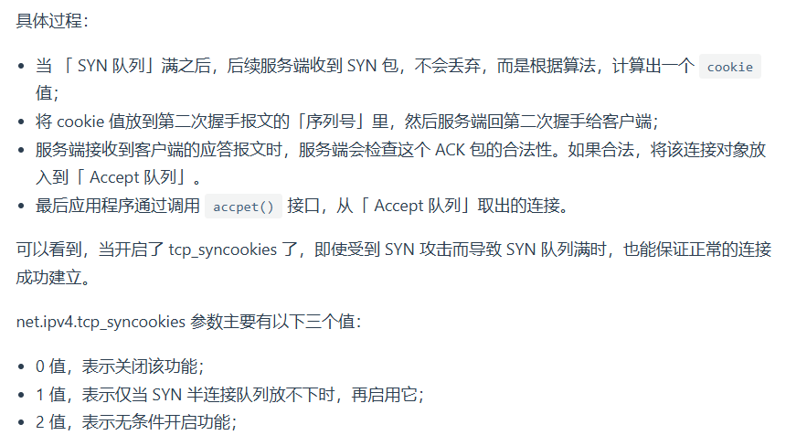

## OSI 七层模型
**OSI 七层模型**（Open Systems Interconnection Model）是一个标准的网络通信框架，旨在定义计算机网络中各个协议和服务如何互相交互。它将网络通信过程分为七个层次，每一层负责特定的网络功能和任务。下面是 **OSI 七层模型** 的详细解释：

### **1. 物理层 (Physical Layer)**
物理层负责在物理媒介上传输原始的比特流（即0和1），它定义了硬件设备（如电缆、网卡、交换机端口等）如何传输数据。物理层主要关注信号的传输，不涉及数据的意义或结构。

- 主要功能：
  - 定义传输介质（如光纤、铜线、电缆等）
  - 定义传输速率和电压
  - 确定信号的形式（模拟信号或数字信号）
  
- 设备：网卡、集线器、调制解调器等

---

### **2. 数据链路层 (Data Link Layer)**
数据链路层的作用是将数据封装成帧并在物理链路上传输，同时负责错误检测和校正。它确保数据的可靠传输，并管理数据流。

- 主要功能：
  - 帧的封装与解封装
  - 媒体访问控制（例如通过 MAC 地址）
  - 错误检测与校正（例如通过校验和）
  - 流量控制
  
- 设备：网桥、交换机、网络接口卡（NIC）

---

### **3. 网络层 (Network Layer)**
网络层的主要作用是决定数据从源主机到目的主机的路径。它负责数据包的转发、路由选择，并处理网络层地址（如 IP 地址）。

- 主要功能：
  - 路由选择：选择数据包的最佳路径
  - 分段与重组：将大的数据包分割成适合网络传输的小包，并在接收端重新组合
  - 逻辑地址分配：使用 IP 地址或其他地址方案标识主机
  
- 设备：路由器、网关

---

### **4. 传输层 (Transport Layer)**
传输层提供端到端的通信服务，它确保数据的可靠传输并管理数据流的控制。常见的协议包括 **TCP** 和 **UDP**。

- 主要功能：
  - 提供可靠的传输服务（如使用 TCP 进行数据的可靠传输）
  - 流量控制：控制发送端的数据流速
  - 错误控制：检测和修复传输中的错误
  - 端口号：为不同应用程序提供区分（如 HTTP 使用 80，HTTPS 使用 443）

- 设备：没有物理设备，通常由操作系统提供支持

---

### **5. 会话层 (Session Layer)**
会话层负责建立、管理和终止不同计算机间的会话。它确保应用程序之间的通信在会话期间得以持续。

- 主要功能：
  - 会话管理：管理不同应用之间的连接
  - 会话恢复：在会话丢失时，尝试恢复会话
  - 同步：数据传输的同步与分隔
  
- 设备：没有具体的设备支持，通常由操作系统或应用程序处理

---

### **6. 表示层 (Presentation Layer)**
表示层的任务是数据的格式化、加密和解密。它负责确保发送方和接收方能够理解彼此的数据格式，处理数据的表示、加密、解密、压缩等操作。

- 主要功能：
  - 数据格式化：转换数据的表示形式（例如，图像、音频、视频编码格式的转换）
  - 数据加密与解密
  - 数据压缩与解压缩
  
- 设备：没有物理设备，通常由操作系统或应用程序处理

---

### **7. 应用层 (Application Layer)**
应用层是最靠近用户的一层，它为用户和应用程序提供网络服务。应用层协议直接支持用户的应用，如 HTTP、FTP、SMTP、DNS 等。

- 主要功能：
  - 提供网络服务（如网页浏览、文件传输、电子邮件）
  - 提供用户接口，处理网络应用的具体实现
  
- 设备：客户端和服务器应用程序，如浏览器、邮件客户端等

---

### **总结表格**

| 层次         | 名称             | 主要功能                         | 常见协议              | 设备或实体       |
|--------------|------------------|----------------------------------|-----------------------|------------------|
| 第 1 层      | 物理层           | 原始比特流的传输                   | 无                   | 网卡、交换机、集线器 |
| 第 2 层      | 数据链路层       | 数据封装、错误检测与纠正           | Ethernet, PPP         | 网卡、交换机       |
| 第 3 层      | 网络层           | 路由选择、IP 地址管理              | IP, ICMP, ARP         | 路由器             |
| 第 4 层      | 传输层           | 端到端的可靠传输与流量控制         | TCP, UDP              | 无特定设备         |
| 第 5 层      | 会话层           | 会话建立、管理和终止               | 无                   | 无特定设备         |
| 第 6 层      | 表示层           | 数据格式化、加密解密、压缩解压      | SSL/TLS, JPEG, GIF    | 无特定设备         |
| 第 7 层      | 应用层           | 提供网络服务、用户与应用之间的接口 | HTTP, FTP, SMTP, DNS  | 浏览器、邮件客户端等 |

### **OSI 七层模型的实际应用**
- **分层模型**：通过将网络通信的不同功能分层，OSI 模型能够提供清晰的通信规则和协议，便于理解和实现网络通信。
- **调试和故障排除**：通过将不同的协议映射到各层，工程师可以根据不同的层次进行故障排查，定位问题。
- **协议互操作性**：不同厂商和技术可以依照这些标准层次开发并确保互操作性。

### **TCP/IP 模型与 OSI 模型的对比**
- **TCP/IP 模型**：这是另一个更简化的协议模型，常用的有 4 层（网络接口层、互联网层、传输层、应用层），与 OSI 七层模型相比，合并了物理层和数据链路层，统一成了网络接口层。

| TCP/IP 模型     | OSI 模型         |
|-----------------|------------------|
| 应用层           | 应用层、表示层、会话层 |
| 传输层           | 传输层           |
| 网络层           | 网络层           |
| 网络接口层       | 物理层、数据链路层   |

### **总结**
OSI 七层模型提供了一个抽象框架，使得网络通信过程中的各项任务和功能能够按照层次划分，从而更容易理解和实施。每一层都为不同的协议提供了支持，确保了网络通信的高效、可靠与标准化。

## MTU & MSS
**MTU** 和 **MSS** 都是与网络中数据传输有关的参数，它们在网络协议的不同层次上起着重要作用，且分别在不同的层面上被指定。虽然它们都与数据的分段和传输效率相关，但它们的定义和作用有所不同。

### **1. MTU（最大传输单元，Maximum Transmission Unit）**

**MTU** 是指在一个网络层（通常是数据链路层）中能够传输的最大数据包大小。它是在数据链路层中指定的，尤其是对 **以太网** 或 **无线网络** 等底层协议来说，MTU 决定了网络接口（例如网卡）可以传输的最大数据量。

- **位置**：MTU 是在 **数据链路层** 中定义的。它涉及的是网络接口的最大传输能力。
- **作用**：MTU 确定了底层链路能够处理的数据包的大小。当 IP 层将数据包传递给数据链路层时，如果数据包的大小超过了链路的 MTU，数据包将被分段，或者丢弃并发送错误。

### **2. MSS（最大报文段大小，Maximum Segment Size）**

**MSS** 是指在 **传输层（TCP）** 上，能够通过单个 TCP 段发送的最大数据大小（不包括 TCP 头部）。它通常是在 **TCP 连接建立** 的过程中通过三次握手交换来指定的。

- **位置**：MSS 是在 **传输层** 中定义的，具体来说，它是 **TCP协议** 中的一部分。
- **作用**：MSS 决定了 TCP 数据段中负载部分的最大大小。当发送方准备通过 TCP 传输数据时，TCP 会根据接收方的 MSS 值来确定自己可以发送的最大数据量。

### **为什么需要两个参数，而不是只有一个？**

1. **MTU 与 MSS 处于不同的层**：
   - **MTU** 在数据链路层定义，涉及到的是底层物理网络设备的最大传输能力，比如以太网或 Wi-Fi。
   - **MSS** 在传输层定义，涉及的是 **TCP 协议** 的数据传输，决定了单个 TCP 数据包中的有效负载大小。

2. **MSS 取决于 MTU**：
   - 虽然它们属于不同的层，**MSS** 实际上是基于 **MTU** 来计算的。具体来说，TCP 数据段的 MSS 必须考虑到数据链路层的 MTU 限制。因为 TCP 段会被放入 IP 数据包中传输，而 IP 数据包的大小不能超过 MTU，因此，TCP 的 MSS 通常是 MTU 减去 IP 头和 TCP 头的大小。例如：
     - 假设以太网的 **MTU** 为 1500 字节，IP 头为 20 字节，TCP 头为 20 字节，那么 **MSS** 通常为 1500 - 20 - 20 = **1460 字节**。
   
3. **网络层和传输层的分离**：
   - **MTU** 和 **MSS** 对应的层次不同，**MTU** 涉及的是数据链路层的物理网络，而 **MSS** 只关心应用层传输的数据量，因此，它们的功能并不完全重叠。
   - 在一个典型的网络中，不同的网络设备（如路由器、交换机）在数据包转发过程中，可能存在不同的 MTU（例如，局域网和广域网的 MTU 可能不同），因此需要为不同的网络环境和传输层协议做适当的调整。而 **MSS** 是通过 TCP 的协商来确定的，它限制了可以传输的 TCP 数据段的大小。

是的，你的理解是对的！**MSS** 的确是为了提高效率，并且**避免**由于 IP 数据包分片而导致的效率损失。通过适当设置 **MSS**，可以避免在传输过程中出现数据分片，从而减少数据包丢失和重传的风险。

让我们更详细地分析一下：

#### **为什么需要避免分片？**

当 **IP 数据包** 的大小超过 **MTU** 时，数据就会被分片。**分片** 的问题是，虽然数据被分成了更小的片段，但每个片段在网络中单独传输，如果其中一个分片丢失，整个数据包都需要重新传输。这带来以下问题：

1. **性能下降**：如果分片丢失或出现错误，必须重传整个数据包，而不是仅重传丢失的分片。
2. **更高的延迟**：分片会增加处理时间，特别是当 IP 层执行分片和重新组装时，这会增加网络延迟。
3. **更高的丢包风险**：如果网络不稳定，丢失的分片可能需要很长时间才能重新传输，影响吞吐量。

因此，为了提高网络的稳定性和传输效率，理想情况下我们希望避免分片发生。

#### **MSS的作用**

**MSS**（最大报文段大小）设置的目的是在传输层（即 TCP 层）限制每个数据段的大小，以确保 TCP 数据段的负载部分（即实际数据）不会超过 **MTU**。具体来说，MSS 通过确保每个 TCP 数据段的大小适合网络链路的 MTU，从而避免 IP 数据包在发送过程中被分片。

#### **如何通过 MSS 避免分片？**

- **传输层（TCP）和网络层（IP）之间的协作**：当 TCP 连接建立时，双方会通过三次握手交换信息并协商 **MSS**。这个值决定了每个 TCP 数据段的最大大小，确保它不会超过下层网络的 **MTU**（即避免发生分片）。
- **如何影响数据包的大小**：例如，如果一个连接的 **MTU** 是 1500 字节，IP 头部和 TCP 头部加起来通常是 40 字节，那么 TCP 的 **MSS** 会被协商为 1460 字节（1500 - 40）。这意味着每个 TCP 数据段的负载（有效数据）最大为 1460 字节，能够在不发生分片的情况下通过网络传输。

#### **通过 MSS 减少分片的风险**

当 **MSS** 设置为合适的值时，每个 TCP 数据段的大小都被限制在 **MTU** 可以承受的范围内。这样，**数据包不会被分片**，避免了分片丢失和重传带来的效率问题。

如果没有合理设置 **MSS**，TCP 数据段可能会太大，导致它们在 IP 层被分片。例如，假设你的 **MSS** 设置得过大，可能会导致一个 2000 字节的 TCP 数据段被 IP 层分片，假如其中一个分片丢失，整个数据包就需要重传，这样会导致效率下降。因此，合理设置 **MSS** 就是为了确保数据传输过程中的 **每个 TCP 数据段** 都不会超过底层网络的 **MTU**，从而避免不必要的分片。

#### **总结**

- **MSS 的主要目标** 是优化传输效率，避免 IP 分片。
- **分片的代价** 是，如果其中一个分片丢失，整个数据都需要重传。
- **通过合理设置 MSS**，可以确保每个 TCP 数据段在 IP 层不会被分片，从而提高传输效率，减少重传带来的延迟和性能损失。

因此，**MSS 设置的正确性直接影响了网络传输的性能和可靠性**，它能够减少分片和重传的发生，从而提升整体的网络效率。


### **总结**
- **MTU**：属于 **数据链路层**，定义了物理网络接口上最大可传输的数据包大小。
- **MSS**：属于 **传输层（TCP）**，定义了每个 TCP 数据段中可以传输的最大数据量（不包括协议头）。

这两个参数虽然都与数据的传输大小相关，但由于它们所在的层次不同，作用不同，因此需要分别存在。当数据从应用层经过传输层、网络层，最终到达物理层时，这两个值相互关联，但分别起着不同的作用。


## QUIC
**QUIC**（Quick UDP Internet Connections）是由 **Google** 提出的一个基于 **UDP** 的新型传输层协议，旨在提供更低的延迟和更高的传输效率。它结合了 TCP 和 TLS 等传统协议的特点，并在设计时考虑了现代网络的需求，特别是优化了移动设备和高延迟网络环境下的性能。

### **QUIC 的设计目标：**

1. **低延迟**：QUIC 旨在减少建立连接的时间，比传统的 TCP+TLS 更快。
2. **快速恢复**：能够在丢包时快速恢复，减少由于丢包引起的传输延迟。
3. **多路复用**：QUIC 支持多路复用，即通过一个连接传输多个数据流，避免了 TCP 中因单个流的阻塞而导致其他流的延迟。
4. **内建加密**：QUIC 将 **TLS** 加密协议内建在协议本身中，这样就不需要再像在 TCP 上使用 HTTP + TLS 的组合那样额外的加密过程。

### **QUIC 协议与传统协议的比较**

1. **与 TCP 的比较**：
   - **连接建立**：TCP 需要三次握手来建立连接，而 QUIC 仅需要一次握手就可以建立连接（0-RTT 或 1-RTT 握手）。这意味着 QUIC 可以在建立连接时减少大量的延迟。
   - **拥塞控制与流量控制**：QUIC 在传输控制方面与 TCP 类似，支持拥塞控制和流量控制，但由于 QUIC 运行在 UDP 上，因此能够更灵活地调整和优化这些控制算法。

2. **与 TLS 的比较**：
   - **加密**：QUIC 将 **TLS** 的功能内建在协议层面，所有的 QUIC 连接都自动加密，而不需要额外的加密步骤。它使用 **TLS 1.3** 作为加密协议，这使得 QUIC 的安全性和性能都有了显著提升。

3. **与 HTTP/2 的比较**：
   - **多路复用**：QUIC 提供与 **HTTP/2** 类似的多路复用特性，但不同的是，QUIC 是基于 UDP 的，这意味着即使一个数据流阻塞，其他数据流也可以继续传输，从而避免了 **TCP head-of-line blocking**（TCP 阻塞队头问题）。而 HTTP/2 则是基于 TCP 的，会受限于 TCP 的性能瓶颈。
   - **无头部阻塞**：QUIC 不会像 HTTP/2 或 TCP 那样在一个丢包时影响所有流。它使用基于流的独立丢包恢复机制，可以快速重传丢失的数据而不影响其他流的传输。

### **QUIC 的关键特性**

1. **0-RTT 连接建立**：
   - QUIC 支持 **0-RTT**（Zero Round-Trip Time）连接建立，这意味着客户端可以在第一次连接时就开始发送数据，而无需等待服务器的响应。对于已经与服务器建立过连接的客户端，QUIC 允许通过之前的密钥进行快速恢复，从而进一步减少连接延迟。

2. **多路复用**：
   - QUIC 通过一个连接传输多个数据流，可以避免 TCP 的头部阻塞问题。即使某个流发生了丢包，其他流依然能够正常传输，提供了更好的性能。

3. **加密**：
   - QUIC 默认使用 **TLS 1.3** 进行加密，所有传输的数据都是加密的，这使得 QUIC 从设计上就具备了强大的安全性，而不需要像传统的 HTTP/1.1 和 HTTP/2 那样额外进行加密层。

4. **丢包恢复**：
   - QUIC 对丢包的恢复非常高效，它能够通过 **UDP** 的灵活性来减少丢包对其他数据流的影响。通过独立的数据流和优化的重传机制，QUIC 能够更快地恢复丢失的包，而不会影响其他流。

5. **连接迁移**：
   - QUIC 支持 **连接迁移**，即当客户端的网络环境发生变化时（例如，客户端从 Wi-Fi 切换到移动数据），连接仍然可以保持。QUIC 使用与设备身份相关的标识符来识别连接，而不依赖于 IP 地址或端口号，因此可以在网络条件变化时保持连接。

### **QUIC 的工作原理**：

1. **客户端与服务器建立连接**：
   - 客户端和服务器通过 **握手** 交换加密密钥并确认通信参数。QUIC 允许通过 0-RTT 或 1-RTT 建立连接。
   
2. **数据传输**：
   - 一旦连接建立，数据通过多个独立的数据流（Streams）进行传输，每个流都有自己的流控制和丢包恢复机制。
   - QUIC 使用 **UDP** 作为传输协议，因此不受 TCP 的头部阻塞问题限制。

3. **加密**：
   - 所有的数据传输都通过 **TLS 1.3** 进行加密，保证数据的安全性。
   
4. **丢包处理与流控制**：
   - QUIC 能够在单个数据流出现丢包的情况下，不影响其他数据流的传输，减少了丢包对整个连接的影响。

### **QUIC 的优点**：

1. **低延迟**：QUIC 的 **0-RTT** 特性使得连接建立非常迅速，尤其在与已经建立连接的服务器交互时，几乎可以忽略延迟。
2. **更好的丢包恢复**：QUIC 支持独立的数据流，每个流的丢包不会影响到其他流的数据传输。
3. **内建加密**：所有的 QUIC 连接都是加密的，采用了 **TLS 1.3**，相比传统的 HTTP+TLS 组合更为安全和高效。
4. **更强的多路复用**：与 TCP 基础的 HTTP/2 相比，QUIC 可以有效避免 TCP 中的 **head-of-line blocking** 问题，提高数据传输效率。

### **QUIC 的缺点**：

1. **部署复杂性**：QUIC 在 UDP 基础上实现，相较于传统的 TCP+TLS 模型，需要更多的配置和支持。
2. **中间设备兼容性**：QUIC 是基于 UDP 的，某些防火墙或 NAT 设备可能不支持或限制 UDP 流量，这可能导致 QUIC 连接受限。
3. **早期阶段**：尽管 QUIC 已经得到 Google 和 IETF 等组织的支持，但它仍然在逐步推广中，还没有像 HTTP/2 或 TCP 那样普及。

### **QUIC 与 HTTP/3**

- **HTTP/3** 是基于 QUIC 协议构建的协议版本，是 HTTP/2 的继任者。
- HTTP/3 使用 QUIC 作为其底层传输协议，而不再依赖于 TCP。HTTP/3 完全继承了 QUIC 的特性，如低延迟、多路复用、无头部阻塞等。

### **总结**

- **QUIC** 是一个高效、低延迟、加密的传输协议，基于 **UDP** 设计，旨在解决传统 **TCP+TLS** 的性能瓶颈，尤其是在移动网络和高延迟网络环境下。
- 它的关键特性包括 **0-RTT 握手**、**多路复用**、**内建加密**、**更快的丢包恢复** 等。
- **HTTP/3** 是基于 QUIC 的最新 HTTP 协议版本，提供更高的性能和更好的用户体验。


## 什么是糊涂窗口综合征（40B的报头，1B的数据）
### **糊涂窗口综合症（Silly Window Syndrome, SWS）**  

糊涂窗口综合症（SWS）是 **TCP 传输控制协议** 中的一种性能问题，主要发生在发送方或接收方处理数据不合理时，导致 **小数据包频繁传输**，从而降低网络吞吐量和效率。  

#### **SWS 发生的场景**
SWS 可能出现在 **发送方** 或 **接收方**，具体表现如下：

1. **接收方引起的 SWS**：
   - 当接收方的 **接收缓冲区** 逐渐被填满，剩余的可用窗口空间（即 `rwnd`，接收窗口）变得很小时，接收方可能仍然会通知发送方可以发送少量数据（比如 1 字节或几字节）。
   - 这样会导致发送方发送 **很多小的数据包**，而不是等待缓冲区有足够空间再发送大数据块，降低了效率。

2. **发送方引起的 SWS**：
   - 当发送方的应用层（如 `write()` 调用）不断生成 **小块数据**（比如每次 1 字节），如果发送方 TCP 直接发送这些小数据而不是等待更多数据聚合后再发送，就会导致很多小数据包被发送出去，增加网络开销。

#### **SWS 的危害**
- **降低吞吐量**：频繁发送小数据包会增加 TCP 头部开销，使得有效负载数据减少，降低了整体传输效率。
- **增加网络拥塞**：过多的小数据包会导致网络中的数据包数量增多，占用带宽并影响其他连接的性能。
- **增加 CPU 处理负担**：由于需要频繁处理小数据包，服务器或客户端的 CPU 可能会因频繁的 TCP 操作而负载增加。

#### **如何避免 SWS**
为了避免 SWS，TCP 采用了一些策略进行优化：

1. **Nagle 算法（发送端优化）**：
   - 发送方不会立即发送小数据包，而是 **等待** 之前发送的数据被 **确认（ACK）** 后，或者等到一定的阈值后再发送。
   - 这样可以聚合多个小的数据块，减少小包的发送，提高吞吐量。
   - **缺点**：如果应用程序需要低延迟（如 Telnet、SSH 或者某些实时通信应用），Nagle 算法可能会导致额外的发送延迟，因此可以在应用层通过 `TCP_NODELAY` 选项来禁用。

2. **Clark 机制（接收端优化）**：
   - 接收方不会在接收缓冲区还有很少的空间时就更新窗口，而是等待足够的可用空间（比如达到一个 MSS 大小）后才通知发送方可以发送数据。
   - 这样可以减少小窗口通知，避免发送端发送过小的数据块。

3. **Delack（Delayed ACK，延迟确认）**：
   - TCP 允许接收方 **不立即回复 ACK**，而是等到 **足够的数据到达** 或 **定时器超时** 后再发送 ACK，以便减少 ACK 包的数量，间接减少小数据包的产生。

#### **总结**
糊涂窗口综合症（SWS）是由于 **发送方或接收方频繁处理小数据包**，导致 TCP 效率降低的问题。它的主要危害包括 **降低吞吐量、增加网络拥塞、提高 CPU 处理负担**。为了避免 SWS，TCP 采用了 **Nagle 算法（发送端优化）** 和 **Clark 机制（接收端优化）** 等策略，以减少小数据包的发送，提高网络传输效率。

如果面试官问你这个问题，你可以按照 **概念 -> 发生场景 -> 危害 -> 解决方案** 的思路回答，能够展现你的 **深入理解和实践经验**。

# ping
## ping的完整流程（ICMP，扩展PING不能测试端口）
### **`ping` 命令的整个流程解析**  

当你在终端输入 `ping www.example.com` 时，`ping` 通过 **ICMP（Internet Control Message Protocol，互联网控制报文协议）** 发送一个回显请求（Echo Request）到目标主机，并等待对方返回回显应答（Echo Reply），以此测试网络的连通性和响应时间。

---

## **1. `ping` 命令的具体流程**

### **（1）解析域名（DNS 解析）**
如果你输入的是一个域名（例如 `ping www.example.com`），`ping` 需要首先 **解析域名为 IP 地址**：
- `ping` 会调用 **`gethostbyname()`** 或 **`getaddrinfo()`** 进行 DNS 解析。
- 本地的 DNS 解析流程：
  1. 查询本机 `/etc/hosts` 文件（Linux/macOS）或 `C:\Windows\System32\drivers\etc\hosts`（Windows）。
  2. 查询本机 DNS 缓存。
  3. 发送 DNS 请求到配置的 DNS 服务器（`/etc/resolv.conf` 指定的服务器）。
  4. 若 DNS 服务器未缓存该域名，则递归查询根 DNS 服务器、顶级域（TLD）服务器、权威 DNS 服务器，最终解析出 IP 地址。

---

### **（2）构造 ICMP 请求报文**
- `ping` 发送的是 **ICMP 回显请求报文（Echo Request）**，封装在 **IP 数据报** 中。
- 报文格式（IPv4 ICMP 报文）：
  ```
  | Type (8) | Code (0) | Checksum | Identifier | Sequence Number | Data ... |
  ```
  - **Type** = `8`（Echo Request），返回的 Echo Reply 类型是 `0`。
  - **Identifier**：用于区分多个 `ping` 进程。
  - **Sequence Number**：用于编号多个请求，便于匹配应答报文。
  - **Data**：通常是 `ping` 发送的随机数据，默认 56 字节（加上 ICMP 头部总共 64 字节）。

---

### **（3）通过 IP 层发送 ICMP 数据报**
- `ping` 通过 `socket(AF_INET, SOCK_RAW, IPPROTO_ICMP)` 创建 **原始套接字**（Raw Socket）。
- 构造 **ICMP 报文** 后，交给 **IP 层** 处理：
  - **IP 层封装 ICMP 数据包**，添加 **IP 头部**，然后将其交给 **数据链路层** 处理。
  - **数据链路层**（例如以太网）添加 **MAC 头部**，并通过 **ARP（如果是同一网段）** 或 **路由转发** 发送到目标主机。

---

### **（4）目标主机接收并返回 ICMP 回显应答**
- 目标主机的 **内核协议栈** 收到 **ICMP Echo Request**：
  1. **IP 层** 解析 **目标 IP** 是否匹配本机。
  2. **ICMP 处理模块** 识别 Type `8`（Echo Request），构造 **ICMP Echo Reply**（Type `0`）。
  3. 目标主机通过 **相同路径** 发送 ICMP Echo Reply 给源主机。

---

### **（5）源主机接收 ICMP Echo Reply 并计算 RTT**
- 源主机收到 ICMP Echo Reply 后：
  1. `ping` 计算 **往返时间（RTT，Round Trip Time）**：
     \[
     RTT = 响应到达时间 - 发送时间
     \]
  2. 记录 **丢包率、最小/最大/平均 RTT**。

---

## **2. `ping` 命令的关键步骤总结**
1. **DNS 解析**（如果是域名）
2. **构造 ICMP Echo Request** 并 **封装到 IP 数据报**
3. **通过数据链路层发送到目标主机**
4. **目标主机处理 ICMP 请求并返回 ICMP Echo Reply**
5. **源主机接收回显应答并计算 RTT**
6. **统计数据**（RTT、丢包率等）

---

## **3. `ping` 的关键特性**
- **测试网络连通性**：如果 `ping` 不通，可能是目标主机宕机、ICMP 被防火墙拦截、网络不可达等原因。
- **测量 RTT（Round Trip Time）**：用于评估网络质量。
- **显示丢包率**：如果丢包率高，说明网络可能不稳定。
- **TTL（生存时间）**：`ping` 通过 TTL 值判断数据包经过的路由跳数。

---

## **4. `ping` 可能失败的原因**
| 失败情况 | 可能原因 |
|----------|----------|
| `Destination Host Unreachable` | 目标主机不可达（网络不通、路由问题） |
| `Request timed out` | 目标主机无响应（防火墙拦截、主机宕机） |
| `Ping: unknown host` | DNS 解析失败 |
| `TTL expired in transit` | TTL 过低，数据包在到达目标前已被丢弃 |

---

## **5. 面试回答技巧**
面试官问 **`ping` 的工作流程** 时，可以按照 **DNS 解析 -> 发送 ICMP 请求 -> 目标主机响应 -> 计算 RTT** 这个完整流程回答，展示你的 **网络协议基础知识和实践经验**。

你也可以适当拓展：
- `ping` 使用 **ICMP 协议**，ICMP 是 **无连接、无状态、无可靠性保证** 的协议。
- `ping` 不能测试 **端口**，因为它工作在 **网络层（ICMP/IP）**，而不是 **传输层（TCP/UDP）**。
- `ping` 可能受到防火墙拦截，例如 `iptables` 可以用 `DROP icmp` 阻止 `ping`。
  
这样能让你的答案更 **专业、深入**，给面试官留下 **技术扎实的印象**。


# Q

## TCP挥手优化--调整socket关闭方式(SO_LINGER)
`SO_LINGER` 选项用于控制 **`close()` 关闭 TCP 连接的行为**，影响**是否等待剩余数据发送完成、是否进入 `TIME_WAIT` 状态**。  

`SO_LINGER` 由 **`struct linger` 结构体** 控制：
```c
struct linger {
    int l_onoff;  // 是否启用 SO_LINGER（0=关闭，1=启用）
    int l_linger; // 延迟时间（秒），当启用 SO_LINGER 时生效
};
```

---

### **1️⃣ `SO_LINGER` 可能的 4 种情况**
| `l_onoff` | `l_linger` | 行为 | `close()` 结果 |
|-----------|-----------|------|--------------|
| 0         | X（无效） | **默认优雅关闭** | 进入 `TIME_WAIT`，确保数据发送完成 |
| 1         | `>0`（等待时间） | **超时等待关闭** | 等待 `l_linger` 秒，超时未发送完则 `RST` 关闭 |
| 1         | 0         | **强制立即关闭** | 直接 `RST` 关闭，不进入 `TIME_WAIT` |
| 1         | 很大值（如 3600） | **长时间等待关闭** | `close()` 阻塞，直到数据发送完成或超时 |

---

### **2️⃣ 各种 `SO_LINGER` 组合的行为**
 **🚀 (1) `l_onoff = 0`（默认行为）**
```c
struct linger opt = {0, 0};
setsockopt(fd, SOL_SOCKET, SO_LINGER, &opt, sizeof(opt));
```
- **行为：**
  - `close(fd)` 立即返回，不管发送缓冲区中是否有数据。
  - **内核继续发送未发送的数据**，然后正常进入 `TIME_WAIT` 状态，确保对方收到数据。
  - **如果有数据未发送完，内核仍然会尽量发送**，不会立刻 `RST` 连接。
- **影响：**
  - **数据安全**，适用于需要确保数据完整性的场景。
  - **可能导致 `TIME_WAIT` 过多**，消耗端口资源。
- **适用场景：**
  - **普通 HTTP 长连接**
  - **数据完整性比性能更重要的应用（如文件传输）**

---

 **⚡ (2) `l_onoff = 1`，`l_linger > 0`（超时等待关闭）**
```c
struct linger opt = {1, 2};  // 等待 2 秒
setsockopt(fd, SOL_SOCKET, SO_LINGER, &opt, sizeof(opt));
```
- **行为：**
  - `close(fd)` **阻塞**，内核尝试在 `2` 秒内发送未发送的数据。
  - **如果 2 秒内数据发送完成，正常关闭**，进入 `TIME_WAIT` 状态。
  - **如果 2 秒内数据未发送完成，丢弃数据并发送 `RST`**，立即关闭连接。
- **影响：**
  - **减少 `TIME_WAIT`**，但可能丢失未发送的数据。
  - **`close()` 可能会阻塞**，影响并发性能。
- **适用场景：**
  - **需要一定数据完整性，但不希望过多 `TIME_WAIT` 的应用**
  - **短连接的 HTTP 服务器**

---

 **🔥 (3) `l_onoff = 1`，`l_linger = 0`（强制立即关闭）**
```c
struct linger opt = {1, 0};  
setsockopt(fd, SOL_SOCKET, SO_LINGER, &opt, sizeof(opt));
```
- **行为：**
  - `close(fd)` **立即返回**，**丢弃发送缓冲区中的所有数据**，直接 `RST` 关闭。
  - **不会进入 `TIME_WAIT` 状态**，直接释放 socket 资源。
- **影响：**
  - **减少 `TIME_WAIT`**，适合高并发服务器。
  - **可能导致数据丢失**（如果有未发送数据）。
- **适用场景：**
  - **高并发服务器（如 Web 服务器、代理服务器）**
  - **不关心数据完整性的应用（如 UDP-like TCP 传输）**

---

 **⏳ (4) `l_onoff = 1`，`l_linger = 很大值`（长时间等待）**
```c
struct linger opt = {1, 3600};  // 等待 1 小时
setsockopt(fd, SOL_SOCKET, SO_LINGER, &opt, sizeof(opt));
```
- **行为：**
  - `close(fd)` **可能会阻塞很长时间（最多 `l_linger` 秒）**，直到所有数据发送完成。
  - 适用于**确保所有数据完整传输**的场景，但不适用于高并发服务器。
- **影响：**
  - **数据完整性高，但可能严重影响性能。**
  - **避免 `RST`，但可能导致 `close()` 阻塞，影响服务器吞吐量。**
- **适用场景：**
  - **必须确保数据传输完成的金融、银行系统**
  - **专门的长连接协议**

---

### **3️⃣ `SO_LINGER` 组合及适用场景总结**
| `l_onoff` | `l_linger` | 行为 | 适用场景 |
|-----------|-----------|------|----------|
| `0` | X | **默认优雅关闭**，数据完整但进入 `TIME_WAIT` | **普通 HTTP、文件传输** |
| `1` | `>0` | **超时等待**，超时后 `RST` 关闭 | **短连接 HTTP，减少 `TIME_WAIT`** |
| `1` | `0` | **立即 `RST` 关闭**，数据可能丢失 | **高并发服务器（如 Nginx）** |
| `1` | **大值** | **阻塞 `close()`，确保数据完整** | **银行、金融系统，关键数据传输** |

---

### **4️⃣ `SO_LINGER` 使用建议**
- **如果你关心数据完整性**（比如文件传输、HTTP 长连接），使用 **默认 `SO_LINGER`**（`l_onoff=0`）。
- **如果你希望减少 `TIME_WAIT`**，可以 **设置 `l_linger=1~2`**，避免过多 `TIME_WAIT`。
- **如果你希望 `close()` 立即返回**，可以 **`l_onoff=1, l_linger=0`，立刻 `RST` 关闭**，但会丢失数据。
- **如果你的程序是高并发服务器（如 Web 服务器、代理服务器）**，建议 `l_onoff=1, l_linger=0`，避免 `TIME_WAIT` 导致端口耗尽。

---

### **5️⃣ 典型应用示例**
 **1. 普通 HTTP 服务器**
```c
struct linger opt = {1, 1};  // 等待 1 秒
setsockopt(fd, SOL_SOCKET, SO_LINGER, &opt, sizeof(opt));
```
**减少 `TIME_WAIT`，但尽量不丢失数据**。

---

 **2. 高并发 Web 服务器**
```c
struct linger opt = {1, 0};  // 立即 RST 关闭
setsockopt(fd, SOL_SOCKET, SO_LINGER, &opt, sizeof(opt));
```
**适用于 Nginx、Squid 等高并发场景**，减少 `TIME_WAIT`，提高端口复用。

---

 **3. 确保数据完整的金融系统**
```c
struct linger opt = {1, 60};  // 等待 60 秒
setsockopt(fd, SOL_SOCKET, SO_LINGER, &opt, sizeof(opt));
```
**确保所有数据发送完成后才关闭，避免丢失重要信息**。

---

### **总结**
`SO_LINGER` 是影响 `close()` 行为的重要参数，选择不同配置会影响数据完整性、`TIME_WAIT` 状态和服务器性能。在实际应用中，需要根据业务场景来选择最合适的 `SO_LINGER` 方案！🚀


## *TCP有哪些优化方式(优化握手，优化挥手，优化数据传输)*
## *TCP调用close和shutdown的区别在哪(被动方close_wait时间)*
## 什么是队头阻塞(http,tcp队头阻塞)
## TCP半连接和全连接队列满了应该怎么办
## accept或listen没有调用还能建立tcp连接吗，它们的作用分别是什么

## 客户端主机宕机（重启、不重启），服务端的进程崩溃
## TCP四次挥手可以改成三次挥手吗（TCP 延迟确认机制）
## TCP三次握手三个报文丢失分别会造成什么
## 快重传串几个数据包（SACK & D-SACK）
## 如何面对syn攻击（调整max_syn_backlog & somaxconn & backlog || 打开syncookie || 减少synack重传次数）


# HTTP
## 常见状态码


## GET&POST

`GET` 和 `POST` 是 HTTP 协议中最常用的两种请求方法，它们在用途、数据传输方式、安全性等方面都有区别，但也有一定的联系。下面是详细的分析：

---

### **1. `GET` 和 `POST` 的联系**
- 都是 **HTTP 请求方法**，用于客户端与服务器通信。
- 都能 **向服务器发送数据** 并获取响应。
- 在 HTTP/1.1 中，默认都是 **保持连接（Keep-Alive）**，支持 **管道化（Pipeline）**。
- 都可以通过 **URL** 指定请求目标，并接收服务器的响应内容。

---

### **2. `GET` 和 `POST` 的区别**
| 维度 | `GET` | `POST` |
|------|------|------|
| **请求参数位置** | 放在 **URL 的查询字符串** 中 (`?key=value`) | 放在 **请求体（body）** 中 |
| **参数长度限制** | 受 URL 长度限制（通常 `2048` 字符） | 理论上无限（受服务器和浏览器限制） |
| **可缓存性** | **可以缓存**（默认缓存 `GET` 请求的响应） | **不缓存**（除非手动设置） |
| **安全性** | **不安全**，参数暴露在 URL 中 | **相对安全**，参数不会直接出现在 URL |
| **幂等性（Idempotent）** | **是**（同样的 `GET` 请求多次执行，结果相同） | **不是**（多次 `POST` 可能导致多次写入） |
| **请求类型** | 主要用于 **查询数据** | 主要用于 **提交数据** |
| **书签/分享** | 可以存入书签和分享 | 不能存入书签和分享 |
| **编码方式** | `application/x-www-form-urlencoded` | `application/x-www-form-urlencoded`，`multipart/form-data`（上传文件） |

---
---

### **3. `GET` 和 `POST` 的性能**
- **`GET` 请求更快**：
  - 由于浏览器可以 **缓存 `GET` 请求的结果**，加载速度更快。
  - `GET` 通常比 `POST` 请求 **占用更少的服务器资源**。
- **`POST` 更适合大数据提交**：
  - `GET` 受 URL 长度限制（通常 `2048` 字符）。
  - `POST` **不受 URL 限制**，适用于大数据和文件上传。

---

💡 **面试技巧**
如果面试官问：
> "GET 和 POST 的区别是什么？"
你可以回答：
1. **数据传输方式不同**：GET 在 URL 传输参数，POST 在 **请求体** 传输参数。
2. **安全性不同**：GET 参数暴露在 URL，不适合传输敏感数据，而 POST **相对安全**。
3. **缓存机制不同**：GET 可以被缓存，POST 默认不会缓存。
4. **幂等性不同**：GET **幂等**，而 POST **非幂等**，重复提交可能产生副作用（如重复支付）。
5. **数据大小限制不同**：GET 受 URL 长度限制，而 POST **没有限制**，适合传输大数据。


## post请求体的格式种类
POST 请求的消息体（body）中，可以使用不同的编码格式来传输数据。**这些编码格式**通过 `Content-Type` 头字段来指定，以下是常见的几种编码格式及其特点：

---

### 1. `application/x-www-form-urlencoded`

- **最常见的编码格式之一**，用于 HTML 表单默认的提交方式。
- **格式：**`key1=value1&key2=value2`
- 会对特殊字符进行 URL 编码（如空格变为 `+`，`&`、`=` 被转义）。

📌 **示例：**
```http
POST /login HTTP/1.1
Content-Type: application/x-www-form-urlencoded

username=alice&password=123456
```

---

### 2. `multipart/form-data`

- 用于**表单上传文件**时。
- 会将每个字段和文件内容以多段 MIME 格式封装。
- 每一段都有自己的 Content-Disposition 和边界标识。

📌 **示例：**
```http
POST /upload HTTP/1.1
Content-Type: multipart/form-data; boundary=----WebKitFormBoundaryX

------WebKitFormBoundaryX
Content-Disposition: form-data; name="username"

alice
------WebKitFormBoundaryX
Content-Disposition: form-data; name="file"; filename="test.png"
Content-Type: image/png

(binary data)
------WebKitFormBoundaryX--
```

---

### 3. `application/json`

- 用于发送 JSON 格式的数据。
- 是现代前后端交互的主流格式。

📌 **示例：**
```http
POST /api/login HTTP/1.1
Content-Type: application/json

{
  "username": "alice",
  "password": "123456"
}
```

---

### 4. `application/xml`

- 用于 XML 数据传输，较少见于现代前端开发，但在 SOAP 或某些老旧系统中仍然使用。

📌 **示例：**
```http
POST /api HTTP/1.1
Content-Type: application/xml

<user>
  <username>alice</username>
  <password>123456</password>
</user>
```

---

### 5. `text/plain`

- 用于发送纯文本。
- 不做任何格式化或结构化。
- 一般不用于表单或结构化数据传输。

📌 **示例：**
```http
POST /log HTTP/1.1
Content-Type: text/plain

This is a plain text message.
```

---

### 📌 总结表格：

| 编码类型                      | 场景                               | 特点                                      |
|-----------------------------|------------------------------------|-------------------------------------------|
| `application/x-www-form-urlencoded` | 表单默认提交方式                     | 简单、兼容性好                            |
| `multipart/form-data`       | 上传文件、多媒体                    | 支持多字段和文件                         |
| `application/json`          | 前后端交互（API）                   | 易解析、支持嵌套结构、主流              |
| `application/xml`           | 旧系统、SOAP协议                    | 类似 JSON，但格式复杂                    |
| `text/plain`                | 日志、测试或调试                    | 直接发送纯文本，最简单                   |

---

如果你是做前后端开发，**推荐使用 `application/json`**；如果你在处理文件上传，**使用 `multipart/form-data`**。

需要我展示某种编码格式的服务端解析方式或客户端构造方式吗？比如用 Python、Node.js、C++、curl 等？


## HTTP缓存技术
cache-control强制缓存，last-modified & etag属于协商缓存，**协商缓存必须结合强制缓存使用**
**etag优先于last-modified**，因为资源即使在没有被修改的情况下modified的时间也可能会改变
etag对比服务端资源标签，如果没有改变返回304无更新，浏览器从缓存中读取内容，否则请求响应


## HTTP1 & 1.1 & 2 & 3
HTTP（HyperText Transfer Protocol）是互联网通信的基础协议，经历了多个版本的演进，每个版本都针对前一版本的缺点进行了优化。下面我们对比 **HTTP/1.0、HTTP/1.1、HTTP/2、HTTP/3**，并分析其改进点和改进原因。

---

## **1. HTTP/1.0**
**发布时间**：1996 年  
**核心特点**：
- **短连接**（非持久连接）：每个请求-响应都需要建立一次 **TCP 连接**，响应后立即关闭，**开销大**。
- **无 Host 头部**：早期 HTTP/1.0 请求中没有 `Host` 头，无法在一个 IP 上托管多个域名（**虚拟主机问题**）。
- **无缓存控制**：缓存通过 `Expires` 头指定 **绝对时间**，但无法动态控制缓存策略。

### **缺点**
1. **频繁的 TCP 连接开销**：每个请求都要进行 **三次握手** 和 **四次挥手**，严重影响性能。
2. **队头阻塞（HoL Blocking）**：一个请求未完成时，后续请求必须等待，导致页面加载慢。
3. **资源浪费**：同一个页面的多个资源（HTML、CSS、JS、图片）需要多个 TCP 连接，效率低。

---

## **2. HTTP/1.1（改进 HTTP/1.0）**
**发布时间**：1997 年  
**核心改进**：
1. **长连接（Keep-Alive）**
   - **默认开启 Keep-Alive**，多个 HTTP 请求可以复用一个 **TCP 连接**，减少连接开销。
   - 连接会在 **一段时间** 内保持 **打开状态**，多个请求可共享 **同一 TCP 连接**。

2. **支持管道化（Pipeline）**
   - **多个请求可以同时发送**，不用等待前一个请求结束后再发送。
   - **解决了发送方的对头阻塞，但是服务方仍然存在队头阻塞**
   - 但由于服务器响应顺序固定，仍然有 **队头阻塞问题**。

3. **新增 Host 头**
   - 允许多个域名共享同一 IP（**虚拟主机支持**）。

4. **缓存优化**
   - 新增 `Cache-Control` 头，支持 `max-age`、`no-cache` 等 **更灵活的缓存控制**。
   - `ETag` 机制避免不必要的资源下载。

5. **分块传输编码（Chunked Transfer Encoding）**
   - 允许服务器 **分块** 发送数据，不用等到所有数据准备好后再发送，提高**大文件的传输效率**。

### **缺点**
- **仍然存在队头阻塞（HoL Blocking）问题**。
- **HTTP 头部冗余**：每个请求都需要携带大量头部信息（如 `User-Agent`、`Cookie` 等），即使是相同的内容，导致 **网络带宽浪费**。
- **多资源加载效率低**：虽然支持 Keep-Alive，但浏览器一般 **限制同一域名下并发 TCP 连接数（如 6 个）**，超过的请求仍需排队。

---

## **3. HTTP/2（改进 HTTP/1.1）**
**发布时间**：2015 年  
**核心改进**：
1. **二进制帧（Binary Framing）**
   - HTTP/1.x 是 **纯文本协议**，HTTP/2 采用 **二进制格式** 传输，解析更高效。

2. **多路复用（Multiplexing）**
   - **多个请求可以共享一个 TCP 连接，同时并行发送、接收**，解决了 **队头阻塞（HoL Blocking）** 问题。
   - >针对**不同的 HTTP 请求⽤独⼀⽆⼆的 Stream ID 来区分**，接收端可以通过 Stream ID 有序组装成 HTTP消息，**不同 Stream 的帧是可以乱序发送的**，因此可以并发不同的 Stream ，也就是 HTTP/2 可以并⾏交错地发送请求和响应。
   - > 
   - **Http2解决了应用层的队头阻塞，但是TCP仍存在队头阻塞**
   - 

3. **流优先级**
   - 客户端可以指定请求的 **优先级**，提高重要资源（如 CSS、JS）的加载速度。

4. **头部压缩（HPACK）**
   - **HTTP 头部冗余较大**，HTTP/2 采用 `HPACK` 进行 **头部压缩**，减少带宽消耗。
   - **静态表**，在 HTTP/2 的 HPACK 头部压缩 机制中，静态表（Static Table） 是一个预定义的表，**包含了一些常见的 HTTP 头字段和值**，用于减少头部大小，提高传输效率。
   - 以状态码为例1.1版本中状态码“200”需要三个字节表示，V2只需要1字节

5. **服务器推送（Server Push）**
   - 服务器可以 **主动推送资源**（如 CSS、JS）到客户端，而不必等待客户端请求。
   - 

### **缺点**
- **仍然基于 TCP**，所以：
  - **TCP 仍然受丢包影响**，一个数据包丢失，整个 HTTP/2 连接的多个流都要等待 TCP 处理完丢包（**队头阻塞未完全解决**）。
  - **长 RTT 影响性能**，尤其是在高延迟或丢包网络环境下（如移动网络）。

---

## **4. HTTP/3（改进 HTTP/2）**
HTTP架构演进

**发布时间**：2022 年（草案已被广泛采用）  
**核心改进**：
1. **基于 QUIC 代替 TCP**
   - **TCP + TLS + HTTP/2 → QUIC + HTTP/3**
   - QUIC 是 **UDP 协议**，相比 TCP：
     - **减少握手延迟**（`0-RTT` 连接恢复）。
     - **减少丢包影响**，HTTP/3 直接在 QUIC **流** 上运行，不受单个丢包影响。
     - **内置 TLS 1.3**，提供更快的加密连接。

2. **无队头阻塞（HoL Blocking）**
   - QUIC 通过 **独立流（Streams）** 传输数据，丢包不会影响其他流。

3. **更快的连接建立**
   - **TCP 需要 3 次握手 + TLS 1.3 2 次握手**，而 QUIC 只需要 1 次握手，甚至支持 `0-RTT`（前提是客户端有服务器的 Session Ticket）。

4. **移动网络优化**
   - TCP 连接与 **IP 绑定**，换 WiFi 或 4G 时需要重新连接，而 QUIC 可以 **继续使用原来的连接**，更适合 **移动网络**。

### **缺点**
- **需要 UDP 支持**，部分旧防火墙可能不兼容。
- **QUIC 还在发展**，优化与兼容性仍需完善。

### QUIC对比HTTPS
内置TLS1.3协议，建立连接时同步进行TLS握手


### 0RTT握手


### 连接迁移
在quic之前使用四元组唯一标识连接，在quic种使用连接ID和上下文信息标识，可以做到连接迁移


---

## **总结**
| 版本 | 主要优化点 | 解决的问题 |
|------|----------|----------|
| **HTTP/1.0** | 短连接，每次请求都要新建 TCP 连接 | 连接开销大，性能低 |
| **HTTP/1.1** | Keep-Alive、管道化、Host 头、缓存优化 | 减少连接开销，但仍有 **队头阻塞** 问题 |
| **HTTP/2** | **多路复用、头部压缩、二进制协议** | 解决 **HTTP 头部冗余**，但 TCP 仍导致队头阻塞 |
| **HTTP/3** | **基于 QUIC，避免 TCP 队头阻塞，0-RTT 连接恢复** | 彻底解决 **队头阻塞**，提升移动网络体验 |

---

## **结论**
- **HTTP/1.1** 解决了 **短连接问题**，但仍有 **队头阻塞**。
- **HTTP/2** 通过 **多路复用** 提升了性能，但仍然受限于 **TCP 丢包影响**。
- **HTTP/3** 彻底解决了 **队头阻塞** 和 **丢包影响**，性能最优，但 **兼容性仍需完善**。

如果你在面试中被问到：
> "为什么 HTTP/3 要用 QUIC？"
你可以回答：
> "因为 QUIC 基于 UDP，可以避免 TCP 队头阻塞，同时支持 0-RTT 连接恢复，提升移动端体验。"

这样回答既有**技术深度**，又能让面试官感受到你的**思考逻辑**！🚀

## http2.0所有情况下都比http1.1好吗
### **HTTP/2 相比 HTTP/1.1 的改进**
| **特性**          | **HTTP/1.1** | **HTTP/2** |
|-----------------|------------|-----------|
| **连接复用**      | ❌ 需要多个 TCP 连接 | ✅ 只需一个 TCP 连接，减少连接数 |
| **头部压缩**      | ❌ 纯文本，冗余大 | ✅ HPACK 压缩，减少开销 |
| **流（Stream）**  | ❌ 串行处理，队头阻塞严重 | ✅ 多个流并行处理，不影响其他请求 |
| **服务器推送**    | ❌ 只能被动接收 | ✅ 服务器可以主动推送资源 |
| **二进制格式**    | ❌ 文本格式，解析慢 | ✅ 二进制格式，解析更快 |
| **队头阻塞问题**  | ❌ 连接级队头阻塞 | ✅ 只在单个流中阻塞，不影响其他流 |

✅ **HTTP/2 主要通过连接复用、流式多路复用、头部压缩等方式来提高性能，减少 RTT 和带宽消耗**。

---

### **HTTP/2 并不总是更优**
#### **1️⃣ 队头阻塞问题仍然存在**
- **HTTP/2 解决了 HTTP/1.1 的请求级队头阻塞（HOLB），但仍然存在 TCP 层的队头阻塞**。
- **如果一个 TCP 连接丢包，整个 HTTP/2 连接的所有流都会受到影响**。
- **HTTP/3 通过 QUIC 彻底解决了这个问题**（QUIC 采用 UDP，不受 TCP 队头阻塞影响）。

✅ **解决方案：如果网络丢包率较高（如移动网络），HTTP/3 可能比 HTTP/2 更优**。

---

#### **2️⃣ HTTP/2 在部分场景下比 HTTP/1.1 更慢**
- **HTTP/2 需要 HTTPS（TLS 1.2+）**，因此**TLS 握手开销**可能让短连接请求变慢。
- **一些 HTTP/2 服务器实现不佳**，可能**导致多路复用调度不当**，反而**加重服务器负载**。
- **对于某些简单的单请求场景（如单个小文件下载）**，HTTP/1.1 **可能没有明显劣势**，甚至更快。

✅ **解决方案：对于短连接（如 REST API 单次请求），HTTP/1.1 可能不会比 HTTP/2 慢**。

---

#### **3️⃣ 服务器推送（Server Push）可能导致资源浪费**
- **HTTP/2 支持服务器推送（Server Push）**，但如果服务器推送了**客户端已经缓存的资源**，可能会浪费带宽。
- **某些浏览器（如 Chrome）甚至默认禁用了 Server Push**，因为它可能不如预加载（`<link rel="preload">`）更高效。

✅ **解决方案：谨慎使用 Server Push，避免不必要的资源推送**。

---

#### **4️⃣ 部分旧设备和代理不支持 HTTP/2**
- 一些**老旧浏览器、企业代理、CDN 可能不支持 HTTP/2**，需要回退到 HTTP/1.1。
- **某些企业防火墙会拦截 HTTP/2**，因为它的**二进制格式无法直接解析**，而 HTTP/1.1 是纯文本格式，更易审查。

✅ **解决方案：对于广泛兼容性要求的服务，仍需要支持 HTTP/1.1 作为回退方案**。

---

### **结论**
**HTTP/2 在大多数情况下比 HTTP/1.1 更快、更高效，但并不是所有情况都更优。**  
1. **如果你在一个高丢包网络（如移动网络），HTTP/3 可能比 HTTP/2 更优**。  
2. **对于简单的单次请求（如 API 调用），HTTP/1.1 可能不会比 HTTP/2 慢**。  
3. **Server Push 并不总是有利，可能导致带宽浪费**。  
4. **部分代理和老旧设备可能不支持 HTTP/2，需要回退到 HTTP/1.1**。  

🔹 **在实际应用中，HTTP/2 通常是一个更好的默认选择，但仍需要根据具体场景评估是否要切换到 HTTP/3，或者在部分情况下回退到 HTTP/1.1。**


# HTTPS
HTTPS 采⽤的是对称加密和⾮对称加密结合的「**混合加密**」⽅式：
- 在通信建⽴前采⽤⾮对称加密的⽅式交换「会话秘钥」，后续就不再使⽤⾮对称加密。
- 在通信过程中全部使⽤对称加密的「会话秘钥」的⽅式加密明⽂数据。

采⽤「混合加密」的⽅式的原因：
- 对称加密只使⽤⼀个密钥，运算速度快，密钥必须保密，⽆法做到安全的密钥交换。
- ⾮对称加密使⽤两个密钥：公钥和私钥，公钥可以任意分发⽽私钥保密，解决了密钥交换问题但速度慢。

### **HTTPS 对比 HTTP：有什么区别，为什么需要 HTTPS？**

HTTP（HyperText Transfer Protocol）和 HTTPS（HyperText Transfer Protocol Secure）都是用于网页通信的协议。**HTTPS 是 HTTP 的安全版本**，通过 **SSL/TLS 加密**来增强数据传输的安全性。

---

## **1. HTTPS vs. HTTP 的核心区别**
| **对比项**    | **HTTP**  | **HTTPS**  |
|--------------|----------|----------|
| **安全性**  | **明文传输**，容易被窃听、中间人攻击 | **加密传输**，防止窃听和篡改 |
| **端口**  | 默认 **80** 端口 | 默认 **443** 端口 |
| **数据加密** | **无加密**，攻击者可以直接读取数据 | **SSL/TLS 加密**，数据是安全的 |
| **身份验证** | **无身份验证**，可能遭受伪造网站攻击 | **服务器证书验证**，防止钓鱼网站 |
| **数据完整性** | **可能被篡改**，不保证数据一致性 | **有数据完整性校验**，防止篡改 |
| **性能** | 传输快，但不安全 | **加密导致额外计算开销**，但 HTTP/2、HTTP/3 提高了性能 |
| **SEO 影响** | **不利于搜索排名**，现代浏览器标记 HTTP 为**不安全** | **Google 搜索更优先 HTTPS 站点** |

---

## **2. 为什么要使用 HTTPS？**
### **(1) 防止流量劫持**
- **HTTP 是明文传输**，攻击者可以通过 **中间人攻击（MITM）**，在用户访问网站时**插入恶意广告、劫持数据**。
- **HTTPS 通过加密防止流量被篡改**，保证数据的完整性。

### **(2) 防止窃听，保护隐私**
- **HTTP 传输内容是明文的**，黑客、运营商、WiFi 热点可以**窃听通信内容**，甚至盗取密码、支付信息等。
- **HTTPS 加密数据**，即使被拦截，攻击者也无法解密数据。

### **(3) 确保服务器的真实性**
- **HTTP 不验证服务器身份**，容易被钓鱼网站伪造。
- **HTTPS 使用 SSL/TLS 证书**，可以确认服务器的真实性，防止用户访问假冒网站。

### **(4) SEO 排名提升**
- **Google 已明确表示，HTTPS 网站的排名更高**。
- **现代浏览器（如 Chrome、Firefox）会警告 HTTP 网站不安全**，影响用户访问。

---

## **3. HTTPS 的工作原理**
HTTPS 依赖 **SSL/TLS 协议** 来实现数据加密和身份验证，其工作流程如下：

1. **客户端（浏览器）请求 HTTPS 连接**
   - 访问 `https://example.com`。

2. **服务器返回 SSL/TLS 证书**
   - 证书包含 **服务器的公钥** 和 **颁发机构 CA 的签名**。

3. **客户端验证证书**
   - 确保证书是合法的，未被篡改，并由可信 CA 颁发。

4. **建立 TLS 安全连接**
   - 使用 **非对称加密（公钥+私钥）** 交换 **对称密钥**（会话密钥）。

5. **加密通信**
   - 之后的所有数据都使用 **对称加密（如 AES）** 进行安全传输。


---

## **4. HTTPS 的性能问题**
- **HTTPS 需要额外的加密计算**，但：
  - **TLS 1.3** 使握手更快，**减少了 RTT（往返时间）**。
  - **HTTP/2 & HTTP/3 采用多路复用，提升性能**。
  - **现代硬件对加密运算优化**，影响已经很小。

**结论**：
> **HTTPS 以前可能会影响性能，但现在已优化，几乎不会造成明显影响。**

---

## **5. HTTPS 是否完全安全？**
**虽然 HTTPS 提供了加密和身份验证，但仍需注意**：
1. **服务器证书可能被伪造**（如 CA 机构被攻破）。
2. **中间人攻击仍可能发生**（如 DNS 劫持、代理服务器）。
3. **应用层攻击无法防御**（SQL 注入、XSS、CSRF 仍然有效）。

### 如何避免中间人抓取数据
开启HTTPs双向认证
- ⼀般我们的 HTTPS 是单向认证，客户端只会验证了服务端的身份，**但是服务端并不会验证客户端的身份**。
- 如果⽤了双向认证⽅式，不仅客户端会验证服务端的身份，⽽且服务端也会验证客户端的身份。**服务端⼀旦验证到请求⾃⼰的客户端为不可信任的，服务端就拒绝继续通信**，客户端如果发现服务端为不可信任的，那么也中⽌通信。

---


## HTTPS非对称加密过程

HTTPS（HyperText Transfer Protocol Secure）基于 **SSL/TLS**，主要使用 **非对称加密** 来保证安全通信。其握手过程如下：  

---

### **1️⃣ 客户端发起 HTTPS 请求**  
- 客户端（如浏览器）向服务器发送 `ClientHello`，并携带：  
  - **支持的 TLS 版本**（如 TLS 1.2、TLS 1.3）  
  - **支持的加密算法列表**（RSA、ECDSA、AES 等）  
  - **客户端生成的随机数（Client Random）**  

---

### **2️⃣ 服务器返回证书（ServerHello）**  
- 服务器选择一个合适的 **TLS 版本** 和 **加密算法**。  
- 服务器发送 `ServerHello`，包含：  
  - **服务器生成的随机数（Server Random）**  
  - **服务器的公钥证书（包含公钥 + CA 签名）**  
  - **（可选）服务器的 Diffie-Hellman 参数（TLS 1.3）**  

---

### **3️⃣ 客户端验证证书**  
- 客户端检查 **服务器证书** 是否可信：  
  1. **检查证书是否过期**。  
  2. **验证证书是否被受信 CA（证书颁发机构）签名**。  
  3. **确认证书中的域名是否匹配当前网站**。  

✅ **如果证书无效，浏览器会提示“证书错误”，阻止访问！**  

---

### **4️⃣ 客户端生成“会话密钥”**  
- **TLS 1.2 及更早版本（基于 RSA）：**  
  1. **客户端生成“会话密钥”（Session Key，通常是对称加密密钥）。**  
  2. **用服务器的公钥加密会话密钥**，然后发送给服务器。  

- **TLS 1.3（基于 ECDHE）：**  
  - 采用 **椭圆曲线 Diffie-Hellman（ECDHE）** 生成共享密钥，避免 RSA 握手被量子计算破解。  

---

### **5️⃣ 服务器用私钥解密会话密钥**  
- **服务器使用私钥解密** 客户端发送的 **会话密钥**（仅适用于 TLS 1.2）。  
- **TLS 1.3 直接使用 Diffie-Hellman 计算共享密钥，无需解密。**  

**最终，双方获得相同的“会话密钥”**，后续数据传输使用 **对称加密（AES/GCM 等）** 进行加密。  

---

### **6️⃣ 客户端 & 服务器交换“完成消息”**  
- 客户端和服务器用 **新生成的会话密钥** 计算握手的 MAC（消息验证码）。  
- 彼此发送 **“Finished” 消息**，表示握手完成。  

🔒 **至此，HTTPS 通道已建立，所有后续通信使用对称加密**，如 AES-GCM、ChaCha20。  

---

### **7️⃣ 加密数据传输（HTTPS 通信）**  
- 服务器和客户端使用 **对称加密**（AES-GCM、ChaCha20）保护数据。  
- 所有 **HTTP 请求/响应** 都会被 **加密**，避免被中间人攻击（MITM）。  

---

### **总结**  
- **非对称加密（RSA/ECDHE）** 只用于 **握手阶段** 交换密钥。  
- **数据传输阶段** 使用 **对称加密**（AES-GCM、ChaCha20）提升性能。  
- **TLS 1.3 相比 TLS 1.2 更安全、更快（0-RTT，移除不安全的 RSA 握手）**。  

✅ **HTTPS 通过非对称加密 + 对称加密，确保数据在传输过程中安全无泄露！** 🔐


## TLS握手流程
是的，你的理解大致是对的，但 TLS 握手中的加密解密流程远比“用公钥加密、用私钥解密”要复杂和精妙得多。它不仅仅涉及非对称加密，还涉及**对称加密、哈希函数、证书校验、密钥交换协议（如ECDHE）等多个机制的协作**。下面我来详细讲讲：

---

### ### 🛡️ TLS 握手过程详解（以 TLS 1.2 为例）

---

#### 1. **客户端 Hello（ClientHello）**

客户端向服务器发送：

- 支持的 TLS 协议版本（如 TLS 1.2、TLS 1.3）
- 支持的密码套件（加密算法组合）
- 一个随机数（`Client Random`）
- 可选的扩展，如支持的密钥交换方式、SNI（服务器名称指示）

---

#### 2. **服务器 Hello（ServerHello）+ 服务器证书**

服务器回应：

- 选定的协议版本
- 选定的密码套件
- 一个随机数（`Server Random`）
- **服务器证书（包含公钥）**
- （可选）密钥交换参数，如 ECDHE 公钥

🔐 证书由权威 CA 签名，包含服务端的公钥。客户端会验证这个证书的合法性。

---

#### 3. **密钥协商 / Pre-Master Secret 生成**

有两种情况：

---

##### ✅ **常规 RSA 密钥交换方式（旧的）**：

- 客户端生成一个随机的 **Pre-Master Secret**。
- 使用服务器公钥将其加密后发送给服务器。
- 服务端用 **私钥解密**，得到 Pre-Master Secret。
- 双方根据：
  - `Pre-Master Secret`
  - `Client Random`
  - `Server Random`
  共同计算出 **Session Key（对称密钥）**。

> 这种方式的问题是，如果私钥泄露，历史会话可以被解密，不支持前向保密。

---

##### ✅ **ECDHE 密钥交换方式（现代主流）**：

- 客户端和服务器都生成自己的 Ephemeral（临时）密钥对。
- 双方交换 ECDHE 公钥。
- 使用 Diffie-Hellman 算法计算出共享的 Pre-Master Secret。
- 服务端用私钥签名 ECDHE 公钥，客户端用证书公钥验证其真实性。

> 这实现了**前向保密（PFS）**：即使私钥泄露，历史通信也无法解密。

---

#### 4. **客户端 Finished**

- 客户端使用 Session Key（对称加密）发送一条 Finished 消息。
- 内容包括整个握手消息的摘要（用 MAC + 对称加密封装）。
- 服务端使用相同的 Session Key 解密并验证消息完整性。

---

#### 5. **服务器 Finished**

- 服务端也使用 Session Key 发送一条加密的 Finished 消息，客户端验证。

---

#### ✅ 握手完成，进入对称加密通信阶段。

---

### ### 🔒 总结关键点

| 步骤 | 用途 | 加密方式 |
|------|------|-----------|
| 服务器发送证书 | 客户端校验证书合法性 | 无加密（公开） |
| 客户端生成 Pre-Master Secret（RSA） | 加密传给服务端 | 公钥加密 |
| 服务端解密 | 恢复 Pre-Master Secret | 私钥解密 |
| 双方计算 Session Key | 以后用于加密数据 | 对称加密 |
| 后续数据传输 | 高效、快速 | 对称加密 |

---

### ✅ TLS 1.3 的不同点

- 去除了 RSA 密钥交换，全部使用 ECDHE（支持前向保密）。
- 握手次数减少（支持 0-RTT 会话恢复）。
- 加密算法更强。

---

如果你想，我也可以画一张图来可视化整个 TLS 握手流程，或者以某个语言（比如 Python、Go）举例 TLS 握手数据交换过程。要看看吗？


# dns查询
现代 DNS 服务器通常 **同时** 使用 **递归查询（Recursive Query）和迭代查询（Iterative Query）**，但具体使用哪种方式取决于**DNS 服务器的角色**以及查询的发起方。  

---

## **1. 递归查询（Recursive Query）**
### **定义**：
递归查询是指 **DNS 服务器** 代表客户端（如浏览器、操作系统）**主动查询其他 DNS 服务器，直到获得最终的 IP 地址**，然后再返回给客户端。  

### **特点**：
✅ **查询过程由 DNS 服务器完成，客户端只需等待最终结果**。  
✅ **本地 DNS 服务器（ISP 运营商的 DNS）通常提供递归查询**，以减少客户端的查询负担。  
✅ **速度快**（一般会有缓存），但 **负载较高**。  

### **示例（递归查询的过程）**：
1. 用户在浏览器输入 `www.example.com`，客户端向 **本地 DNS 服务器**（递归解析器）查询。  
2. **本地 DNS 服务器** 发现缓存中没有该记录，于是**代表客户端** 继续向 **根 DNS 服务器** 查询。  
3. **根 DNS 服务器** 告诉本地 DNS 服务器："去找 `.com` 顶级域名服务器"。  
4. **本地 DNS 服务器** 继续向 `.com` 顶级域名服务器查询，它返回 `example.com` 的权威 DNS 服务器地址。  
5. **本地 DNS 服务器** 向 `example.com` 的权威 DNS 服务器查询，获得最终 IP 地址。  
6. **本地 DNS 服务器** 把 IP 地址返回给客户端，并缓存该结果以优化后续查询。  

### **适用场景**：
- **本地 DNS 服务器（ISP 运营商、Google DNS、Cloudflare DNS 等）** 提供递归解析，以减少客户端的查询负担。  
- **家庭和企业用户** 直接向 ISP 提供的 DNS 服务器发送查询，通常使用递归查询。  

---

## **2. 迭代查询（Iterative Query）**
### **定义**：
迭代查询是指 **DNS 服务器不会主动帮客户端查询，而是提供下一个 DNS 服务器的地址，客户端需要自己继续查询**，直到找到最终 IP。  

### **特点**：
✅ **DNS 服务器负担较小**，因为它不需要主动查询后续服务器，只需返回指引信息。  
✅ **查询效率稍低**，因为客户端必须自己继续查询。  

### **示例（迭代查询的过程）**：
1. 用户输入 `www.example.com`，本地 DNS 服务器向 **根 DNS 服务器** 查询。  
2. **根 DNS 服务器** 不会直接返回 IP 地址，而是告诉本地 DNS 服务器："去找 `.com` 顶级域名服务器"。  
3. **本地 DNS 服务器** 向 `.com` 顶级域名服务器查询，它返回 `example.com` 的权威 DNS 服务器地址。  
4. **本地 DNS 服务器** 继续向 `example.com` 的权威 DNS 服务器查询，获得最终 IP 地址，并返回给客户端。  

### **适用场景**：
- **根 DNS 服务器、TLD 服务器（如 `.com` 服务器）、权威 DNS 服务器** 通常只提供迭代查询，而不会进行递归查询。  
- **大型 DNS 服务器（如 Google DNS 8.8.8.8）** 可能使用迭代查询来减少负载。  

---

## **3. 现代 DNS 服务器的查询模式**
现代 DNS 服务器一般采用 **“递归查询 + 迭代查询” 的混合模式**：
- **本地 DNS 服务器（ISP 的 DNS、Google DNS）**：通常对客户端提供 **递归查询**，简化客户端的解析过程。  
- **根 DNS 服务器、TLD 服务器、权威 DNS 服务器**：只提供 **迭代查询**，不做递归解析，以减少服务器负担。  

### **查询流程（结合递归 & 迭代查询）**
1. 客户端向 **本地 DNS 服务器**（递归解析器）发送 **递归查询**。  
2. 本地 DNS 服务器如果**缓存中没有结果**，则向 **根 DNS 服务器** 发起 **迭代查询**。  
3. 根 DNS 服务器返回 **.com 顶级域名服务器的地址**，本地 DNS 服务器继续迭代查询。  
4. 本地 DNS 服务器向 **.com 顶级域名服务器** 查询，获得 `example.com` 的权威 DNS 服务器地址。  
5. 本地 DNS 服务器向 `example.com` 的权威 DNS 服务器查询，获得最终 IP 地址。  
6. 本地 DNS 服务器缓存 IP 并返回给客户端。  

---

## **4. 结论**
- **现代 DNS 服务器通常使用递归查询和迭代查询的组合**：
  - **本地 DNS 服务器（ISP、Google DNS 8.8.8.8）一般使用递归查询，为客户端提供最终 IP**。  
  - **根 DNS、TLD 服务器、权威 DNS 服务器通常使用迭代查询，以减少服务器负载**。  
- **客户端（浏览器、操作系统）通常使用递归查询，以获得最终解析结果**，减少 DNS 查询的复杂度。  
- **大多数情况下，用户不会直接与根 DNS 服务器交互，而是通过本地 DNS 服务器间接完成解析**。  

### **实际情况**
如果你使用的是 ISP 的 DNS（如中国电信、中国移动的 DNS），你的查询大概率是 **递归查询**。  
如果你是运营大型网站（如 `google.com`），你管理的权威 DNS 服务器一般只支持 **迭代查询**。


# cookie & session & token
### **Cookie 和 Session 的区别与联系**
在 Web 开发中，**Cookie** 和 **Session** 都用于存储用户状态，以便在多个请求之间保持会话信息，但它们的工作方式和适用场景有所不同。  

---

## **1. 什么是 Cookie？**
**Cookie 是存储在客户端（浏览器）的一小段数据**，由服务器发送并保存在用户的浏览器中，随后浏览器会在后续的请求中将其自动发送回服务器。  

### **工作流程**
1. 客户端第一次访问服务器时，服务器返回 HTTP 响应，并在 `Set-Cookie` 头中设置 Cookie。
2. 浏览器将 Cookie 存储下来，并在后续的请求中自动附带 `Cookie` 头发送给服务器。
3. 服务器解析 Cookie，并基于其中的信息识别用户状态。

### **示例**
```http
HTTP/1.1 200 OK
Set-Cookie: session_id=abcd1234; Path=/; HttpOnly
```
浏览器收到后存储 `session_id`，在下次请求时自动带上：
```http
GET /profile HTTP/1.1
Host: example.com
Cookie: session_id=abcd1234
```

### **特点**
✅ 存储在客户端（浏览器），可设置过期时间  
✅ 可跨请求保持用户状态  
✅ 适用于存储少量、不敏感的数据（如用户偏好、登录标识）  
⚠️ 安全性较低，容易被篡改、劫持  
⚠️ 体积有限（单个 Cookie 最多 4KB，且浏览器对数量有限制）  

---

## **2. 什么是 Session？**
**Session 是存储在服务器端的一种会话机制**，用于跟踪用户状态。通常，服务器会为每个用户分配一个 **唯一的 Session ID**，并将其存储在 Cookie 中，客户端通过 Cookie 在请求时携带 Session ID，让服务器找到对应的会话数据。  

### **工作流程**
1. 客户端第一次访问服务器时，服务器创建一个 **Session**，并生成一个 **Session ID**。
2. 服务器将 **Session ID** 发送给客户端，并通过 **Cookie** 存储：
   ```http
   Set-Cookie: JSESSIONID=xyz789; Path=/; HttpOnly
   ```
3. 之后客户端的请求都会带上 `JSESSIONID`，服务器根据这个 ID 找到存储的用户信息。
4. 如果 Session 过期或被销毁，客户端的 `JSESSIONID` 也就失效了。

### **特点**
✅ 存储在服务器端，更安全  
✅ 适用于存储敏感数据（如用户权限、登录信息）  
✅ Session 数据可以存储在 **内存、数据库、缓存（如 Redis）** 中  
⚠️ 需要服务器存储，增加了服务器开销  
⚠️ 需要通过 **Cookie 或 URL 参数** 让客户端传递 Session ID  

---

## **3. Cookie 和 Session 的主要区别**
| 对比项 | Cookie | Session |
|--------|--------|--------|
| **存储位置** | 客户端（浏览器） | 服务器端 |
| **安全性** | 易被篡改、劫持，安全性较低 | 服务器存储，较安全 |
| **存储容量** | 受浏览器限制，单个 Cookie 4KB | 服务器存储，理论上无限制 |
| **存储时间** | 取决于 `Expires` 或 `Max-Age` | 服务器端可配置，默认会话结束后销毁 |
| **适用场景** | 适用于存储简单数据（如用户偏好） | 适用于存储敏感信息（如登录状态） |
| **传输方式** | 每次请求都会携带 `Cookie`，增加带宽开销 | 只传 `Session ID`，服务器管理数据 |

---

## **4. Cookie 和 Session 之间的联系**
- **Session 依赖 Cookie**：通常，Session ID 是存储在 Cookie 中的 (`JSESSIONID` 或 `PHPSESSID`)，浏览器通过 Cookie 传输 Session ID 。
- **Cookie 可用于实现 Session**：如果 Cookie 被禁用，可以使用 **URL 重写** 或 **隐藏表单字段** 传递 Session ID，但不推荐。

---

## **5. 什么时候用 Cookie？什么时候用 Session？**
✅ **适合使用 Cookie 的情况**
- 需要在客户端存储简单数据（如主题颜色、语言偏好）。
- 适用于非敏感数据，避免给服务器带来额外存储压力。

✅ **适合使用 Session 的情况**
- 需要存储敏感数据，如用户认证信息、购物车。
- 需要服务器端控制用户状态，比如权限验证。

💡 **最佳实践**：
- **结合使用 Cookie 和 Session**，用 Cookie 存储 **Session ID**，Session 在服务器端管理敏感信息。
- 如果存储信息较多或服务器压力大，可以使用 **Redis、Memcached** 来存储 Session，提高性能。

---

## **6. Cookie & Session 安全性**
- **Cookie 防劫持**：
  - `HttpOnly`：防止 JavaScript 访问，防止 XSS 攻击。
  - `Secure`：仅在 HTTPS 下传输，防止明文泄露。
  - `SameSite`：限制跨站请求，防御 CSRF 攻击。

- **Session 防护**：
  - **Session 固定攻击（Session Fixation）**：登录时重新生成 Session ID。
  - **Session 伪造**：服务器端验证 Session ID 是否正确，并在 Session 中存储用户 IP/UA 进行额外校验。

---

## **7. 总结**
| **特点** | **Cookie** | **Session** |
|----------|-----------|------------|
| 存储位置 | 客户端 | 服务器端 |
| 是否安全 | 不安全，容易被劫持 | 相对安全，存储在服务器 |
| 适用场景 | 存储轻量数据，如用户偏好、状态标识 | 存储敏感信息，如登录状态、购物车 |
| 服务器压力 | 低，不占服务器资源 | 高，占服务器内存或数据库 |
| 依赖 | 独立存在 | 依赖 Cookie 或 URL 传递 Session ID |

Cookie 与 Session 的对比
| 对比项 |	Session	 | Cookie |
|----------|-----------|------------|
| 存储位置	| 服务器端	| 客户端
| 安全性 |	安全（不可见）|	不安全（可篡改）
|生命周期	|可控|	受浏览器控制
|适用场景|	用户登录、认证	|轻量数据存储

👉 **如果需要存储用户身份信息，推荐使用 Session；如果是简单的非敏感数据，使用 Cookie 也可以。**

## token
Token 的作用：
- **去中心化认证**：在分布式应用中，Session 不再适用，因为服务器可能会有多个实例，无法共享 Session 信息。此时，Token（如 JWT）成为一种常见的解决方案。Token 本身包含了用户的身份信息和权限数据，可以直接在每次请求时传输。

- **无状态认证**：Token 是自包含的，即 **Token 中可以存储用户身份和一些授权信息**，因此服务器不需要存储这些信息。每次请求中，客户端发送 Token，服务器解码后验证其有效性。

- 跨域支持：Token（尤其是 JWT）通常被设计为跨多个域和应用系统使用，非常适合用于现代的 微服务架构 和 单页应用（SPA），**支持用户在不同的系统间无缝访问**。

### 什么是 Token？

**Token** 是一种用来验证用户身份和进行授权的机制，通常是一个经过加密的字符串，包含了用户的信息、权限、有效期等。在现代的 Web 应用中，Token 常常用于无状态认证（stateless authentication）和跨系统认证。常见的 Token 包括 **JWT（JSON Web Token）**、**OAuth Token** 等。

### Token 与 Session、Cookie 的区别

虽然 **Token**、**Session** 和 **Cookie** 都是用来处理用户身份认证和会话管理的技术，但它们有不同的工作方式和使用场景。下面详细比较它们之间的异同：

#### 1. **Token** 的特点：
- **自包含**：Token 通常是自包含的（self-contained），它本身存储了用户的身份信息、授权信息、有效期等，无需在服务器端存储任何会话信息。
- **无状态认证**：Token 在客户端和服务器之间传输时，不需要服务器保存会话信息，每次请求只需要携带 Token，服务器通过解码 Token 来验证用户身份。
- **适用于分布式架构**：由于 Token 不依赖于服务器端的存储，可以在不同的服务器、微服务和跨域应用之间共享，适合用于分布式系统或微服务架构。
- **通常在 HTTP 请求头中传输**：Token 通常作为 HTTP 请求头的一部分（如 `Authorization: Bearer <token>`）传输。

#### 2. **Session** 的特点：
- **有状态认证**：Session 通过在服务器端存储用户的信息（如登录状态、权限等）来维持会话的状态。服务器会为每个用户分配一个唯一的 **Session ID**，并通过这个 ID 来访问服务器端存储的会话数据。
- **服务器端存储**：Session 信息保存在服务器端，而客户端只存储一个 **Session ID**，通常通过 **Cookie** 发送到服务器。
- **适用于单一服务器架构**：由于 Session 信息保存在服务器端，因此在多台服务器或分布式系统中使用时，需要额外的机制（如 **Session 共享**）来保证 Session 数据的一致性。

#### 3. **Cookie** 的特点：
- **浏览器存储**：Cookie 是一种在客户端存储小量数据的机制，浏览器会自动在每次请求时携带 Cookie（根据域名和路径进行匹配）。
- **用于 Session 管理**：Cookie 主要用于存储 **Session ID** 或其他信息，在客户端与服务器之间保持会话。
- **有过期时间**：Cookie 可以设置过期时间，过期后浏览器会自动删除。没有过期时间的 Cookie 会在浏览器关闭时被删除。
- **易受攻击**：Cookie 中存储的数据容易被窃取或篡改，尤其是通过 HTTP 协议传输时，如果没有加密，容易遭受 **XSS（跨站脚本攻击）** 和 **CSRF（跨站请求伪造）** 攻击。

### 区别总结：

| 特性           | Token                                        | Session                                   | Cookie                                  |
|----------------|----------------------------------------------|------------------------------------------|-----------------------------------------|
| **存储位置**    | 客户端（通常是浏览器存储）                   | 服务器端（Session 数据存储在服务器上）  | 客户端（存储在浏览器中）                |
| **状态**       | 无状态认证（Stateless）                     | 有状态认证（Stateful）                  | 无状态，但用于存储会话信息（如 Session ID） |
| **认证信息**    | 自包含（包含用户身份信息、权限等）           | 存储在服务器端，通过 Session ID 访问   | 存储会话信息（如 Session ID）          |
| **传输方式**    | 通常在 HTTP 请求头中传输（如 `Authorization`）| 隐式传输（通过 Cookie 发送 Session ID）  | 自动由浏览器每次请求时发送              |
| **跨域支持**    | 支持跨域使用                                  | 不支持跨域（Session 需要共享存储）      | 支持跨域使用（但受限于同源策略）        |
| **过期机制**    | 通常设置过期时间，过期后 Token 无效          | 由服务器设置超时时间，Session 过期后无效 | 可设置过期时间，浏览器会自动删除        |
| **安全性**      | 比较高（如果使用 HTTPS）                     | 取决于服务器安全性                      | 容易被篡改（需 HTTPS 和防止 XSS/CSRF）  |
| **使用场景**    | 分布式架构、微服务、跨域应用                 | 单体应用、传统 Web 应用（会话管理）      | 主要用于存储会话信息、用户偏好设置等    |

### 选择使用哪种方式？

- **Token**：适用于现代的分布式系统，微服务架构，或需要跨多个域和服务共享认证的场景。
- **Session**：适用于传统的单体应用，或者在不需要跨多个服务和系统共享认证的情况下使用。
- **Cookie**：用于在客户端和服务器之间传输少量的会话信息，尤其是与 Session ID 配合使用。

### 结论：

- **Token** 和 **Session** 是实现用户认证和会话管理的两种不同方式。**Token** 提供了无状态的认证方式，而 **Session** 需要在服务器端存储会话信息。
- **Cookie** 是用于在客户端存储会话信息的工具，常常用来存储 **Session ID** 或 **Token**。
- 根据应用的需求，可以选择不同的方案。如果应用需要跨多台服务器、微服务架构或跨域认证，通常会选择 **Token**（如 JWT）。如果是单一服务、传统 Web 应用，使用 **Session** 和 **Cookie** 会比较简单。


# TCP
## 三次握手

三次握手中任意一次握手信息丢失会发生什么
1. 第一次握手丢失——请求方没有收到**SYN-ACK**，超时重传
   - `tcp_syn_retries`控制SYN的重传次数
2. 第二次丢失——客户端重传**SYN**，服务端重传**SYN-ACK**
   - `tcp_synack_retries`控制**SYN-ACK**重传次数
   - SYN-ACK与普通ACK不同，SYN-ACK会超时重传，**普通ACK不重传**
3. 第三次丢失——服务端重传**SYN-ACK**

## SYN攻击
在接收到SYN之后，服务器会将这个未正式建立起的连接加入**半连接队列**，但是当半连接队列满了之后，服务端会将之后来的SYN报文丢弃，这时服务端无法和正常用户建立连接，便无法提供服务。
解决方法：
1. 增大半连接队列长度——somaxconn,backlog,tcp_max_syn_backlog
2. 开启tcp_syncookies——使用cookie建立连接

3. 减少SYN-ACK的重传次数


## 四次挥手

### 第一次挥手丢失（FIN_WAIT1）
触发超时重传——`tcp_orphan_retries`控制**FIN**报文的重传次数
### 第二次挥手丢失（FIN_WAIT1）
同样触发超时重传，重传FIN报文
### 收到ACK（FIN_WAIT2）
如果使用的是**close关闭连接**，FIN_WAIT2状态持续60s，如果没有收到被动关闭连接方的FIN报文则关闭连接


如果是**shutdown关闭连接，则FIN_WAIT2状态无时限**


### 第三次挥手报文丢失
被动连接方没有收到ACK，超时重传，主动关闭方处于FIN_WAIT2状态

### 第四次挥手报文丢失（TIME_WAIT）
收到被动关闭方的FIN报文之后，主动关闭方进入TIME_WAIT状态，发送ACK并等待2MSL（Maximum Segment Lifetime），当ACK丢失，被动关闭方重传FIN报文。

> 为什么等待2MSL
> - 允许被动关闭方至少超时重传一次FIN，帮助被动关闭方正确关闭连接
> - 同时，经过2MSL之后之前的所有报文都将小时，防止旧报文影响新连接

### TIME_WAIT过短的情况


## 同时挥手会发生什么
---

### **TCP同时关闭（Simultaneous Close）的底层处理机制**

#### **1. 什么是同时关闭？**
同时关闭是指通信双方**几乎同时主动发起连接关闭**（例如客户端和服务器同时调用`close()`），导致双方在未完成四次挥手的情况下交换`FIN`报文。此时，TCP连接会进入一种特殊的对称关闭流程。

---

#### **2. 同时关闭的报文交互流程**
```text
客户端                           服务器
 |-------- FIN (seq=x) -------->| (客户端进入 FIN_WAIT_1)
 |<------- FIN (seq=y) ---------| (服务器进入 FIN_WAIT_1)
 |-------- ACK (ACK=y+1) ------>| (客户端进入 CLOSING)
 |<------- ACK (ACK=x+1) -------| (服务器进入 CLOSING)
 |                              |
 (客户端进入 TIME_WAIT)            (服务器进入 TIME_WAIT)
```

##### **详细步骤：**
1. **双方发送`FIN`**  
   • 客户端和服务器几乎同时发送`FIN`报文，均进入`FIN_WAIT_1`状态。
   • `FIN`报文的序列号为各自最后发送的数据字节序号+1（如`seq=x`和`seq=y`）。

2. **双方接收对方的`FIN`**  
   • 客户端收到服务器的`FIN`后，需发送`ACK`确认（`ACK=y+1`），并进入`CLOSING`状态。
   • 服务器收到客户端的`FIN`后，同样发送`ACK`确认（`ACK=x+1`），并进入`CLOSING`状态。

3. **双方接收对方的`ACK`**  
   • 客户端收到服务器的`ACK`（确认本端`FIN`）后，进入`TIME_WAIT`状态。
   • 服务器收到客户端的`ACK`后，同样进入`TIME_WAIT`状态。

4. **最终关闭**  
   • 双方在`TIME_WAIT`状态等待2MSL（Maximum Segment Lifetime）后关闭连接。

---

#### **3. TCP状态机与关键状态**
• **`FIN_WAIT_1`**：等待对端对`FIN`的`ACK`，或对端的`FIN`（同时关闭时触发）。
• **`CLOSING`**：双方同时关闭时，等待对端对`FIN`的`ACK`。
• **`TIME_WAIT`**：确保最后一个`ACK`可靠到达，防止旧报文干扰新连接。

##### **状态转换条件：**
• 从`FIN_WAIT_1`到`CLOSING`：收到对端的`FIN`但未收到其`ACK`。
• 从`CLOSING`到`TIME_WAIT`：收到对端对`FIN`的`ACK`。

---

#### **4. 底层处理机制**
##### **(1) 报文确认与重传**
• **`FIN`重传**：若在`FIN_WAIT_1`或`CLOSING`状态未收到`ACK`，TCP会重传`FIN`（遵循指数退避超时）。
• **`ACK`可靠性**：最后一个`ACK`若丢失，对端会重传`FIN`，本端需在`TIME_WAIT`状态再次发送`ACK`。

##### **(2) 序列号与确认号验证**
• 接收方严格校验`FIN`的序列号：若`FIN`的序列号不匹配当前期望值（如乱序或重复报文），会发送`ACK`但丢弃该`FIN`。
• `ACK`必须精确确认已接收的字节范围（如`ACK=x+1`表示确认客户端`FIN`）。

##### **(3) 资源释放时序**
• **`CLOSING`状态**：双方仍占用连接资源，等待最终确认。
• **`TIME_WAIT`状态**：防止最后一个`ACK`丢失后对端重传`FIN`，确保旧连接报文在网络中消失。

---

#### **5. 同时关闭的典型场景**
1. **P2P通信**：对等节点同时终止会话。
2. **服务端主动关闭**：例如HTTP/1.1的短连接，服务器在处理完请求后立即关闭，而客户端也因超时主动关闭。
3. **网络故障**：中间设备异常导致双方误判连接状态，触发同时关闭。

---

#### **6. 与正常四次挥手的区别**
| **场景**         | **正常关闭**                     | **同时关闭**                     |
|------------------|----------------------------------|----------------------------------|
| 触发方式          | 一方主动发起FIN，另一方响应        | 双方同时主动发起FIN               |
| 状态转换路径      | `FIN_WAIT_1`→`FIN_WAIT_2`→`TIME_WAIT` | `FIN_WAIT_1`→`CLOSING`→`TIME_WAIT` |
| 报文交互          | 四次单向报文交换                  | 两次FIN交换 + 两次ACK交换         |
| 资源占用时间      | 较短（仅主动方进入`TIME_WAIT`）    | 较长（双方均进入`TIME_WAIT`）     |

---

#### **7. 关键问题与解决方案**
##### **Q1: 若最后一个`ACK`丢失，如何处理？**
• 对端在`CLOSING`状态会重传`FIN`，本端在`TIME_WAIT`状态收到后重传`ACK`，直到对端超时关闭。

##### **Q2: 如何避免`TIME_WAIT`过多占用端口？**
• 调整内核参数（如`net.ipv4.tcp_tw_reuse`），允许复用`TIME_WAIT`连接。
• 应用层设计避免频繁短连接。

---

#### **8. 总结**
同时关闭是TCP协议设计中的一种边缘场景，其核心处理逻辑仍依赖**状态机驱动**、**序列号校验**和**超时重传**机制。通过严格的报文确认和状态转换，TCP确保即使在双方同时关闭的复杂情况下，连接仍能可靠终止，避免数据错乱或资源泄漏。


## 使用shutdown关闭连接引发的FIN_WAIT2无限等待问题
是的，**主动关闭方在调用 `shutdown(fd, SHUT_WR)` 关闭写端后，可能会长时间处于 `FIN_WAIT_2` 状态**，如果被动关闭方的 **第三次挥手（FIN 报文）** 一直丢失，或者被动关闭方在 `CLOSE_WAIT` 状态停留过长时间，这可能会导致以下情况：  

---

### **1. 正常的 TCP 四次挥手流程**
```plaintext
主动关闭方                 被动关闭方
     |                            |
     | --- (1) FIN --->           |  (进入 CLOSE_WAIT)
     |                            |
     | <--- (2) ACK ---           |
     | (进入 FIN_WAIT_2)           |
     |                            |
     | <--- (3) FIN ---           |  (进入 LAST_ACK)
     |                            |
     | --- (4) ACK --->           |
     | (连接关闭)                  |  (连接关闭)
```
1. **主动关闭方** 调用 `shutdown(fd, SHUT_WR)` 关闭写端，发送 **FIN**，进入 `FIN_WAIT_1` 状态。
2. **被动关闭方** 收到 **FIN** 后，发送 **ACK**，进入 `CLOSE_WAIT`，等待应用层调用 `close()` 关闭连接。
3. **被动关闭方** 调用 `close()`，发送 **FIN**，进入 `LAST_ACK` 状态。
4. **主动关闭方** 收到 **FIN**，发送 **ACK**，进入 **TIME_WAIT**，然后等待 2MSL 后关闭。

---

### **2. `FIN_WAIT_2` 可能无限等待的情况**
如果**被动关闭方的应用层程序长时间没有调用 `close()`，或者 `close()` 发送的 FIN 丢失**，则：
- **主动关闭方会一直停留在 `FIN_WAIT_2`**，等待对方发送 FIN。
- TCP **没有超时机制**来主动关闭 `FIN_WAIT_2`，所以如果对方不发送 FIN，主动关闭方可能会**一直保持这个半关闭连接**，导致系统资源泄露。

**可能发生的情况：**
- 被动关闭方的应用层没有关闭 socket（忘记 `close()`）。
- 被动关闭方崩溃，导致 FIN 不能发送。
- 被动关闭方发送的 FIN 多次丢失，重传次数耗尽后，直接关闭连接。

#### **如果 FIN 丢失，达到重传上限后，被动关闭方会直接关闭**
- **被动关闭方进入 `LAST_ACK` 后，会尝试重传 FIN。**
- 如果主动关闭方始终未收到该 FIN 进行响应（ACK），**被动关闭方的 FIN 超时重传次数耗尽后，它会直接关闭连接**。
- **但主动关闭方依然停留在 `FIN_WAIT_2`，因为它从未收到 FIN**，它认为对方还未关闭。

---

### **3. 解决 `FIN_WAIT_2` 无限等待问题**
#### **方法 1：设置 `SO_LINGER` 立即关闭**
在主动关闭方使用 `setsockopt()` 配置 **`SO_LINGER`**，可以让 `close()` 立即丢弃数据并发送 `RST`，强制释放连接：
```cpp
struct linger so_linger;
so_linger.l_onoff = 1;  // 启用 SO_LINGER
so_linger.l_linger = 0; // 立即关闭连接
setsockopt(sockfd, SOL_SOCKET, SO_LINGER, &so_linger, sizeof(so_linger));
```
**效果**：关闭 socket 时，直接发送 `RST` 终止连接，避免 `FIN_WAIT_2` 状态。

#### **方法 2：设置 `TCP_FIN_TIMEOUT`**
Linux 提供了 `TCP_FIN_TIMEOUT` 参数，允许限制 `FIN_WAIT_2` 的持续时间：
```sh
echo 30 > /proc/sys/net/ipv4/tcp_fin_timeout
```
- 该参数表示 `FIN_WAIT_2` 状态的超时时间（秒）。
- 适用于 Linux 服务器，避免连接资源被长时间占用。

#### **方法 3：定期检测并关闭长期 `FIN_WAIT_2` 连接**
可以通过 `netstat` 监控 `FIN_WAIT_2` 连接，并手动关闭：
```sh
netstat -an | grep FIN_WAIT_2
```
或者使用 `iptables` 规则清理：
```sh
iptables -A INPUT -p tcp --tcp-flags FIN FIN -j DROP
```

---

### **4. 总结**
- `FIN_WAIT_2` **状态可能会无限持续**，如果被动关闭方不发送 `FIN` 或 FIN 丢失。
- 如果 FIN 丢失，被动关闭方 **重传 FIN 失败后会直接关闭连接**，但主动关闭方仍然停留在 `FIN_WAIT_2`。
- 解决方法：
  - **`SO_LINGER` 设置立即关闭**，避免 `FIN_WAIT_2`。
  - **`TCP_FIN_TIMEOUT` 限制 `FIN_WAIT_2` 的时间**（Linux）。
  - **定期检测 `FIN_WAIT_2` 连接并手动关闭**。

这样可以防止 `FIN_WAIT_2` 连接积累过多，导致服务器资源耗尽。

## 服务端time_wait或close_wait状态过多是什么原因
time_wait是主动关闭，**time_wait过多**有以下几种情况即解决方案
- 客户端没有开启keepalive
  - 客户端服务端同时打开keep-alive
- 客户端连接超时，服务端主动关闭
  - 可以往⽹络问题的⽅向排查，⽐如是否是因为⽹络问题，导致客户端发送的数据⼀直没有被服务端接收到，以⾄于 HTTP ⻓连接超时。
- 客户端每次连接能发送的请求数量达到上限
  - 在QPS非常高的情况下会发生，这时候应该调整每次连接请求上限

close_wait是被动关闭，close_wait过多的原因
- p290


## 数据包乱序会发生什么
当发送的TCP报文段序列号（Sequence Number）与接收端期待的序列号不匹配时，TCP协议会通过以下机制处理，确保数据传输的**可靠性和有序性**：

---

### **一、接收端处理逻辑**
#### 1. **序列号校验**
   • 接收端维护一个**期望的序列号（Next Expected Sequence Number）**，表示下一个预期接收的字节位置。
   • 每个到达的报文段会进行严格校验：
     ◦ 若报文段的序列号 **等于** 期望值 → 正常接收并处理。
     ◦ 若序列号 **不等于** 期望值 → 触发异常处理逻辑。

#### 2. **不同场景下的处理方式**
   | **报文序列号（Seq）** | **接收端动作**                                                                 |
   |------------------------|-------------------------------------------------------------------------------|
   | **Seq < 期望值**       | - **丢弃报文**：可能是重复或过期的旧数据。<br>- **发送当前确认号（ACK）**：通知发送方最新的期望值。 |
   | **Seq > 期望值**       | - **缓存报文**（如果支持乱序接收）<br>- **发送当前确认号（ACK）**：提示发送方需补发缺失数据。       |
   | **Seq = 期望值**       | - **接收数据**，更新期望值，发送新的ACK。                                                      |

#### 3. **ACK反馈机制**
   • 接收端始终通过ACK报文告知发送方**已连续接收的最大字节位置**（即确认号）。
   • **示例**：
     ◦ 接收端期望`Seq=1000`，收到`Seq=2000`的报文：
       ◦ 发送`ACK=1000`（表示仍等待`1000`开始的字节）。
       ◦ 若支持乱序缓存，可能暂时保存`2000`的数据，等待`1000-1999`的数据到达。

---

### **二、发送端处理逻辑**
#### 1. **超时重传（Retransmission Timeout, RTO）**
   • 发送方未收到ACK确认的报文会在超时后重传。
   • **触发条件**：ACK未在RTO时间内到达。

#### 2. **快速重传（Fast Retransmit）**
   • 当发送方收到**3个重复ACK**（DupACK）时，立即重传丢失的报文段，无需等待超时。
   • **示例**：
     ◦ 发送方发送`Seq=1000`，但接收端期望`Seq=1000`未收到，后续收到`Seq=2000`的报文。
     ◦ 接收端发送`ACK=1000`（重复3次） → 发送方重传`Seq=1000`的数据。

#### 3. **选择性确认（SACK, Selective Acknowledgment）**
   • 若接收端支持SACK（通过TCP选项字段），可明确告知发送方哪些数据块已接收。
   • **作用**：避免重传已成功接收的乱序数据，提升传输效率。

---

### **三、典型场景分析**
#### 1. **场景1：报文乱序到达**
   • **现象**：发送方依次发送`Seq=1000`、`Seq=2000`，但`Seq=2000`先到达接收端。
   • **处理**：
     1. 接收端缓存`Seq=2000`，发送`ACK=1000`。
     2. 发送方收到`ACK=1000`后，若未收到后续ACK，触发超时重传`Seq=1000`。
     3. 接收端收到`Seq=1000`后，合并数据并发送`ACK=3000`。

#### 2. **场景2：报文重复或过期**
   • **现象**：网络延迟导致旧报文`Seq=500`到达接收端，但接收端当前期望`Seq=1000`。
   • **处理**：
     1. 接收端丢弃`Seq=500`，发送`ACK=1000`。
     2. 发送方根据ACK继续发送新数据，无需处理旧报文。

---

### **四、底层实现关键点**
1. **接收窗口（Receive Window）**  
   • 接收端通过窗口大小控制发送方的传输速率。
   • 即使报文乱序到达，接收端窗口可能因缓冲区不足直接丢弃数据（发送`ACK`但窗口置零）。

2. **序列号回绕（Sequence Number Wrap）**  
   • TCP序列号为32位，超过最大值（4,294,967,295）后会回绕到0。
   • 协议通过**时间戳选项（TCP Timestamps）** 区分新旧序列号，防止歧义。

3. **协议健壮性**  
   • 严格校验序列号避免攻击（如伪造报文注入）。
   • 通过**PAWS（Protection Against Wrapped Sequences）** 防御序列号回绕攻击。

---

### **五、总结**
• **核心逻辑**：TCP通过**序列号严格校验**和**ACK反馈机制**，确保数据按序到达且不重复。
• **关键机制**：
  • 丢弃无效数据 + 发送当前ACK（处理旧报文）。
  • 缓存乱序数据 + 触发快速重传（处理丢包）。
• **最终目标**：在不可靠的网络上实现**可靠传输**，同时兼顾效率与安全性。


## seq序列号回绕
是的，你说的这个机制正是 **TCP 防回绕序列号算法** 的核心手段之一，使用的是 **TCP 时间戳选项（TCP Timestamp Option）**。它的主要作用就是为了**防止序列号回绕导致数据混乱**，尤其在高速网络中数据传输速率极高、序列号用得很快的情况下非常关键。

---

### ✅ 为什么需要防止序列号回绕？

TCP 的序列号是 32 位无符号整数，会随着数据的发送不断增加。理论上，当数据足够多、传输速度足够快时，**序列号可能在短时间内回绕一圈**（从最大值变为 0）。

如果回绕发生时旧的数据包还在网络中，**就可能导致新旧数据被混淆**（即使使用滑动窗口也无法完全避免）。

---

### 🧠 时间戳选项（TCP Timestamp Option）

RFC 1323 中引入了 TCP 高性能扩展（TCP Timestamps）来解决这个问题。

**结构如下：**

- **TSval（Timestamp Value）**：当前主机的时间戳（一般为毫秒或 10ms 级别）
- **TSecr（Timestamp Echo Reply）**：对方上次发送来的时间戳，原样回显

---

### 🧷 防回绕机制的工作原理：

1. **发送方** 在每个 TCP 报文中添加一个递增的时间戳 `TSval`。
2. **接收方** 在 ACK 中附带回显的时间戳 `TSecr`。
3. **接收方丢弃所有时间戳小于当前已接收最小时间戳的旧包**。
   - **这样，即使序列号发生了回绕，也能根据时间戳判断该包是否“过期”了。**

---

### 🔐 好处

- **防止回绕：** 即使序列号相同，时间戳也不同，可以判断谁是“旧的”。
- **防止旧连接数据干扰新连接**（类似 TIME_WAIT 的作用）。
- **提高 RTT 测量精度**：时间戳机制也能精确测量每个段的往返时间，优化拥塞控制。

---

### ⚠️ 注意

- 启用时间戳需要双方都支持 TCP 时间戳选项。
- 启动方式：一般通过 Linux 的 `tcp_timestamps` 系统参数控制。

```bash
# 查看是否启用 TCP 时间戳
sysctl net.ipv4.tcp_timestamps
```

---

### 🧾 总结表格

| 项目           | 描述                                                                 |
|----------------|----------------------------------------------------------------------|
| 问题           | 高速传输中 TCP 序号可能回绕，导致数据混淆                            |
| 解决方案       | 添加 TCP 时间戳选项，识别出“旧”的数据包                              |
| RFC            | RFC 1323                                                              |
| 成员字段       | TSval（当前时间戳），TSecr（回显时间戳）                             |
| 附加收益       | 精确 RTT 估算，支持高级拥塞控制算法                                  |

---

如果你感兴趣，我还可以帮你画一下数据包序列与时间戳是如何交互的 👀

## SACK && 快重传
在TCP的**快速重传（Fast Retransmit）**机制中，发送方是否重传**某个特定区间**还是**重传后续所有数据**，取决于以下两个关键因素：

---

### **1. 是否启用SACK（选择性确认）**
#### **(1) 未启用SACK时：盲目重传（Go-Back-N）**
• **触发条件**：发送方收到3个重复ACK（例如`ACK=1001`），表明接收方期望序列号`1001`的数据。
• **处理逻辑**：
  • 发送方假设从`1001`开始的所有数据均未到达（无法确认后续是否有更多丢包）。
  • **重传策略**：直接重传`1001`及之后的所有数据（即使后续数据可能已成功到达）。
  • **缺点**：可能重传已成功接收的数据，浪费带宽。

#### **(2) 启用SACK时：精准重传**
• **触发条件**：收到3个重复ACK（如`ACK=1001`），且ACK中携带SACK块（例如`SACK=[2001,3001]`）。
• **处理逻辑**：
  1. **解析SACK块**：明确接收方已收到的数据区间（如`2001-3000`）。
  2. **确定丢包区间**：若`ACK=1001`且`SACK=[2001,3001]`，则丢失区间为`1001-2000`。
  3. **重传策略**：**仅重传丢失区间（`1001-2000`）**，保留后续已确认数据（`2001-3000`）。
• **优点**：避免冗余重传，提升网络效率。

---

### **2. 具体流程示例**
#### **场景**：
• 发送方发送数据：`Seq=1001-2000`, `2001-3000`, `3001-4000`。
• 接收方收到`2001-3000`和`3001-4000`，但未收到`1001-2000`。
• 接收方连续发送3个`ACK=1001`，并携带SACK块`[2001,4001]`。

#### **发送方动作**：
1. **检测到3个重复ACK**：触发快速重传。
2. **分析SACK块**：
   • 接收方已确认`2001-4000`（`SACK=[2001,4001]`）。
   • 缺失区间为`1001-2000`。
3. **精准重传**：仅重传`1001-2000`，不重传`2001-4000`。

---

### **3. 底层实现细节**
#### **(1) 维护发送缓冲区**
• 发送方缓存所有已发送但未确认的数据。
• 通过SACK块动态标记已确认的区间，仅保留未确认部分待重传。

#### **(2) 重传队列管理**
• **传统TCP**（无SACK）：将`ACK+1`到窗口末尾的数据全部加入重传队列。
• **SACK-TCP**：根据SACK块计算空洞（holes），仅将未确认的区间加入重传队列。

#### **(3) 拥塞控制交互**
• 快速重传触发**拥塞窗口（CWND）减半**，进入快速恢复阶段。
• 精准重传减少无效重传，缓解拥塞恶化。

---

### **4. 边界情况处理**
#### **(1) 多个非连续丢包**
• **示例**：发送`1001-2000`, `2001-3000`, `3001-4000`，丢失`1001-2000`和`3001-4000`。
• **SACK反馈**：接收方发送`ACK=1001`和`SACK=[2001,3001]`。
• **发送方动作**：先重传`1001-2000`；若后续收到`ACK=2001`和`SACK=[3001,4001]`，再重传`3001-4000`。

#### **(2) SACK块覆盖不全**
• **示例**：接收方仅报告部分SACK块（如网络限制仅携带1个块）。
• **发送方动作**：保守重传未覆盖的区间，逐步填补空洞。

---

### **总结**
• **无SACK时**：发送方只能盲目重传后续所有数据（Go-Back-N模式），效率低下。
• **启用SACK时**：发送方通过SACK块精确计算丢包区间，实现**选择性重传**（仅补发缺失部分）。
• **核心价值**：SACK显著减少重传数据量，提升网络吞吐率，尤其在高丢包或大带宽延迟积（BDP）环境中效果显著。

通过SACK机制，TCP在保证可靠性的同时，最大限度避免了不必要的重传，体现了协议设计中对效率和资源利用的深度优化。


## TCP保活机制
在三次握手之后，客户端突然宕机

但是TCP保活机制时间太长，**在程序中直接使用定时器处理僵尸连接即可**

## socket编程中每一个步骤的作用即重要性
1. bind、
2. listen
3. 注册 accept 事件到 epoll
4. epoll_wait 等待连接到来
5. 连接到来时，调用 accept 接收连接
6. 注册新连接的 EPOLLIN、EPOLLERR、EPOLLHUP 等事件到 epoll
7. epoll_wait 等待事件发生

下面是对 **bind**、**listen**、**epoll 相关操作** 在底层的作用详细解析，并说明如果某个步骤缺失会导致什么问题。  

---

### **1. `bind()` 绑定地址和端口**
```cpp
bind(sockfd, (struct sockaddr *)&addr, sizeof(addr));
```
#### **作用**
- **绑定 socket 与本地 IP/端口**，使 socket 监听特定地址。
- 让内核知道该 socket 属于哪个协议栈，并准备接受连接请求。

#### **底层实现**
- `bind()` 主要在 **TCP 传输控制块（TCB）** 里填充本地地址、端口等信息。
- 操作系统会检查：
  - **端口是否被占用**
  - **是否有权限绑定该端口**（如绑定 1024 以下端口需要 root 权限）。
  - **是否可以绑定该 IP 地址**（如 `INADDR_ANY` 表示监听所有 IP）。

#### **如果缺失 `bind()`**
- 如果跳过 `bind()`：
  - **监听 socket 端口将由系统随机分配**（只有在 `listen()` 之后才会分配）。
  - **多进程服务可能会发生端口冲突**。
  - **无法绑定特定 IP**，只能监听所有可用 IP。

---

### **2. `listen()` 创建半连接（SYN 队列）和全连接（accept 队列）**
```cpp
listen(sockfd, backlog);
```
#### **作用**
- **将 socket 变为监听状态**，可以接受连接。
- **创建 TCP 半连接队列（SYN 队列）和全连接队列（accept 队列）**。

#### **底层实现**
- **TCP 进入 `LISTEN` 状态**，等待客户端 `SYN` 连接请求。
- 维护两个队列：
  1. **SYN 队列（半连接队列）**：
     - 存放 **收到 SYN 但还未完成三次握手** 的连接。
     - `tcp_max_syn_backlog` 限制其大小。
     - 如果队列满了，新 SYN 会被丢弃，导致客户端连接超时。
  2. **Accept 队列（全连接队列）**：
     - 存放 **完成三次握手但还未被 `accept()` 处理** 的连接。
     - `backlog` 参数决定队列长度，受 `net.core.somaxconn` 限制。

### **如果缺失 `listen()`**
- `accept()` **无法使用**，因为 socket 不是监听状态。
- **客户端 SYN 不会被处理**，服务器不会响应 SYN-ACK，导致客户端连接失败。
- **半连接队列和全连接队列不会创建**，TCP 无法维护等待处理的连接。

---

### **3. 注册 `accept()` 事件到 `epoll`**
```cpp
struct epoll_event ev;
ev.data.fd = sockfd;
ev.events = EPOLLIN; // 监听可读事件，表示有新的连接到来
epoll_ctl(epfd, EPOLL_CTL_ADD, sockfd, &ev);
```
#### **作用**
- 让 `epoll` **监听 socket 是否有新的连接请求**。
- **非阻塞事件驱动模式**，减少 `accept()` 的轮询消耗。

#### **底层实现**
- `epoll_ctl(EPOLL_CTL_ADD)` 让 `epoll` 关注 `sockfd` 的 **EPOLLIN 事件**（表示有新连接）。
- **当有客户端连接时，`epoll_wait()` 返回该事件，触发 `accept()` 处理**。

#### **如果缺失 `epoll_ctl()`**
- `epoll_wait()` **不会监听新连接事件**，服务器无法 `accept()` 连接。
- 只能用 **传统 `accept()` + `select()` 轮询**，CPU 开销大，效率低。

---

### **4. `epoll_wait()` 等待连接**
```cpp
int nfds = epoll_wait(epfd, events, MAX_EVENTS, -1);
```
#### **作用**
- **等待文件描述符事件**，如：
  - `sockfd` 上有新连接（EPOLLIN）。
  - 已连接 `fd` 上有数据可读（EPOLLIN）。
  - 连接断开（EPOLLHUP、EPOLLERR）。
- **避免 CPU 轮询，提高性能**。

#### **底层实现**
- `epoll` 通过 **事件通知机制**（`eventfd` + 内核回调）在 **内核态** 维护监听列表。
- 当 **监听的 socket 发生事件** 时，内核 **唤醒进程** 并返回事件列表。

#### **如果缺失 `epoll_wait()`**
- **服务器无法响应新连接或数据请求**，因为没有监听 socket 事件。
- 需要 **轮询 `accept()`，CPU 占用高，性能下降**。

---

### **5. `accept()` 接收连接**
```cpp
int connfd = accept(sockfd, (struct sockaddr*)&client_addr, &addrlen);
```
#### **作用**
- **从 Accept 队列取出已完成三次握手的连接**，生成 `connfd` 供应用层处理。

#### **底层实现**
- `accept()` **从 accept 队列取出连接**，创建 **新的 socket `connfd`** 供数据传输。
- `connfd` **继承 `sockfd` 的 socket 选项**（如 `SO_LINGER`、`TCP_NODELAY`）。
- **如果 accept 队列为空，`accept()` 阻塞或返回 `EAGAIN/EWOULDBLOCK`（非阻塞模式）**。

#### **如果缺失 `accept()`**
- Accept 队列 **很快被填满**，导致新连接无法加入。
- 客户端 **连接被服务器拒绝（`ECONNREFUSED`）**。
- **服务器可能遭受 SYN 洪水攻击**（SYN 队列满）。

---

### **6. 注册 `connfd` 的 `EPOLLIN`、`EPOLLERR`、`EPOLLHUP`**
```cpp
struct epoll_event ev;
ev.data.fd = connfd;
ev.events = EPOLLIN | EPOLLERR | EPOLLHUP;
epoll_ctl(epfd, EPOLL_CTL_ADD, connfd, &ev);
```
#### **作用**
- 监听 `connfd` **数据可读（EPOLLIN）、异常（EPOLLERR）、断开（EPOLLHUP）** 事件。
- 服务器可以 **非阻塞处理数据**。

#### **底层实现**
- `EPOLLIN`：有数据可读，触发 `epoll_wait()` 返回。
- `EPOLLERR`：连接异常，触发事件，`recv()` 读取返回错误。
- `EPOLLHUP`：连接关闭，触发事件，`recv()` 读取返回 `0`。

#### **如果缺失 `epoll_ctl(connfd)`**
- `epoll_wait()` **不会监听新连接的可读事件**，无法处理数据。
- 需要 `read()` 轮询 `connfd`，CPU 占用高，影响性能。

---

### **7. `epoll_wait()` 等待事件发生**
```cpp
nfds = epoll_wait(epfd, events, MAX_EVENTS, -1);
```
#### **作用**
- **等待连接或数据可读/断开事件**，触发回调。
- **减少 CPU 轮询，提高性能**。

#### **底层实现**
- **epoll 事件驱动**，内核通过 **回调** 监听 socket 状态变化，唤醒 `epoll_wait()` 进程。

#### **如果缺失 `epoll_wait()`**
- **服务器无法读取数据**，因为它不知道 `connfd` 何时有数据。
- 需要 `read()` 轮询，**CPU 占用高，性能低**。

---

### **总结**
| 步骤 | 作用 | 缺失后果 |
|------|------|------|
| `bind()` | 绑定端口和 IP | 端口随机分配，可能冲突 |
| `listen()` | 创建 SYN/Accept 队列 | 不能接受连接 |
| `epoll_ctl(sockfd)` | 监听新连接事件 | `epoll_wait()` 不会触发 |
| `epoll_wait()` | 等待事件 | 服务器空转或高 CPU 轮询 |
| `accept()` | 取出已连接 `fd` | Accept 队列满，新连接被拒绝 |
| `epoll_ctl(connfd)` | 监听 `connfd` 事件 | 不能检测数据或断开 |
| `epoll_wait()` | 等待 `connfd` 事件 | 需要 `read()` 轮询 |

#### **正确实现 `epoll` 服务器，可以避免高 CPU 轮询，提高性能！** 🚀

## 抓包时为什么TCP挥手是三次不是四次
## TCP延迟确认和nagle算法
当我们 TCP 报⽂的承载的数据⾮常⼩的时候，有效数据占有的⽐就会⾮常低，这就好像快递员开着⼤货⻋送⼀个⼩包裹⼀样浪费。
于是有两种策略来减少小报文的传输：
1. nagle算法——针对**发送方**小报文
2. 延迟确认——针对**接收方**确认报文

### nagle


### TCP延迟确认

> 所以造成了四次挥手变成三次挥手

### 两者混合使用
造成额外的延时，使网络有很慢的感觉
解决方案：
1. 发送方关闭nagle算法
2. 接收方关闭延迟确认


## TCP校验方式
### **TCP 的数据校验方式**  

TCP 采用 **校验和（Checksum）** 机制，确保数据在传输过程中 **没有被错误修改**。如果接收端发现校验和错误，则 **丢弃数据并请求重传**。  

---

### **1️⃣ 校验和的计算方式**  

TCP 的 **校验和（Checksum）** 位于 TCP 头部（**16 位**），用于 **验证 TCP 头部和数据部分是否被篡改**。  

#### **🔹 计算公式（采用二进制反码求和）**  
1. **将 TCP 头部 + 数据** 按 **16 位（2 字节）** 进行拆分。  
2. **如果数据总长度为奇数**，填充 0 使其成为偶数字节。  
3. **对所有 16 位数相加**（如果有进位，则加回最低位）。  
4. **取结果的反码**（按位取反），得到最终的 **校验和**。  

✅ **计算示例**（假设数据分组如下）：  

```
数据：  1100 1010 1010 0110  
       + 0011 1100 0101 1001  
       ---------------------  
         10000 0111 0000 0000   (进位1加到最低位)
校验和： 0111 1000 1111 1111   (取反码)
```

---

### **2️⃣ TCP 伪首部（Pseudo Header）**  

TCP 校验和不仅计算 TCP 头部和数据，还包括 **伪首部（Pseudo Header）**，用于确保数据包的正确性。  

#### **🔹 伪首部包含：**
- **源 IP 地址**
- **目标 IP 地址**
- **协议号（6，代表 TCP）**
- **TCP 长度（TCP 头部 + 数据部分）**

💡 **伪首部的作用**：  
- 防止 **错误的数据包被其他协议（如 UDP）错误识别**。  
- 确保 **TCP 数据正确送达目标主机**。  

---

### **3️⃣ TCP 校验和的优缺点**  

#### **✅ 优点：**  
- **简单高效**，计算速度快，适合实时数据校验。  
- **能够检测大部分错误**（位翻转、丢失等）。  

#### **❌ 缺点：**  
- **无法检测所有错误**（如 16 位的 **倍数错误**，即某些情况下多个比特错误相互抵消）。  
- **没有防篡改机制**，攻击者可以篡改 TCP 数据，同时计算新的校验和，绕过校验。  

💡 **现代协议（如 TLS、QUIC）通过 HMAC 或 CRC32 增强数据完整性保障！**  

---

### **4️⃣ TCP 校验和错误处理**  

| **情况** | **处理方式** |
|----------|------------|
| 校验和正确 | 继续处理数据 |
| 校验和错误 | 丢弃数据包，等待重传 |
| 多次校验失败 | 可能触发 **TCP 超时重传机制** |

---

### **5️⃣ 总结**  

| **特性** | **作用 & 影响** |
|-----------|-----------------|
| **16 位校验和** | 确保 TCP 数据完整性 |
| **二进制反码计算** | 增强错误检测能力 |
| **伪首部（Pseudo Header）** | 防止错误包误传，提高可靠性 |
| **不具备防篡改能力** | 现代协议（如 TLS）结合 HMAC/CRC32 |

💡 **TCP 校验和是一种基础的错误检测机制，但不适用于高安全性需求场景，因此现代网络协议往往结合更强大的校验方式（如 HMAC、TLS）！** 🚀


## TCP的可靠性单靠ACK实现吗？
### **基于 ACK 回复是否能保证传输可靠性？**

在网络通信中，**ACK（Acknowledgment）确认应答**机制是确保数据传输可靠性的关键部分。然而，单纯依靠 **ACK** 回复并不能完全保证可靠性，尤其是在不采取其他补充机制的情况下。为了更全面地理解这个问题，我们需要探讨 **ACK 的作用**，以及 **如何通过其他机制增强可靠性**。

---

### **1️⃣ ACK 的作用：**

**ACK** 是一种用于确认数据是否成功接收的机制。当发送方发送一个数据包时，接收方会在接收到数据包后返回一个 **ACK** 报文来确认数据已正确接收。

#### **ACK 的基本作用：**
- **确认数据到达**：ACK 确保了接收方成功接收到数据。如果发送方没有收到 ACK，它可以重新发送数据。
- **顺序控制**：接收方的 ACK 也可以携带下一个期望接收的字节序列号，帮助发送方维护数据的顺序。
- **流量控制**：通过对接收方缓存的控制，ACK 可帮助调整发送速率，避免接收方缓存溢出。

---

### **2️⃣ 依赖 ACK 的机制是否足够保障可靠性？**

虽然 **ACK** 确认机制有助于保证数据是否被接收，但单靠 ACK 无法应对所有网络中可能发生的情况。为了确保 **端到端的可靠数据传输**，必须结合其他补充机制：

#### **问题一：丢包情况**

- **ACK 丢失**：如果 ACK 丢失，发送方无法知道数据是否成功到达接收方。此时如果没有额外的重传机制，发送方可能会错误地认为数据已经接收到，导致数据丢失。
  - **解决方案**：例如，**TCP** 使用 **重传超时**（RTO）机制，如果发送方在超时时间内没有收到 ACK，它会重传该数据。

#### **问题二：网络拥塞**

- **ACK 仅能验证数据是否到达，而无法解决网络拥塞导致的丢包或延迟问题**。网络上的拥塞可能会导致数据包丢失、ACK 包延迟，甚至长时间无法收到 ACK。
  - **解决方案**：TCP 中的 **拥塞控制机制**（如 **慢启动** 和 **拥塞避免**）可以动态调整发送方的发送速度，避免网络拥塞。

#### **问题三：数据乱序和重复数据**

- **ACK** 仅能表明数据是否成功接收，但无法自动保证数据按顺序到达接收方。如果网络中存在乱序情况，接收方可能会收到乱序的数据包。
  - **解决方案**：TCP 利用 **序列号** 来标识每个数据包的顺序，确保接收方按顺序重组数据包。同时，接收方还会利用 **ACK 确认接收到的字节序列号**，并丢弃重复的数据包。

#### **问题四：延迟确认**

- 在某些协议中，接收方可能会延迟 ACK 回复，以等待更多的数据，从而减少 ACK 报文的数量。这可能会导致长时间的确认延迟，影响可靠性。
  - **解决方案**：TCP 中的 **延迟确认**（Delayed ACK）机制可以缓解这种问题，但必须在合理的时间内确认数据包。

---

### **3️⃣ 如何通过其他机制确保可靠性？**

单靠 ACK 回复不能完全保证可靠性，因此需要结合以下其他机制来加强数据传输的可靠性：

#### **重传机制**
- **自动重传请求（ARQ）**：在数据丢失时，通过 **超时重传** 来保证数据最终到达目的地。TCP 使用这种机制确保丢失的数据包能够重新发送。
  
#### **顺序控制**
- 使用 **序列号** 来确保数据按正确的顺序传输。接收方通过序列号判断数据的顺序和是否有丢失，确保数据按正确顺序到达。

#### **流量控制**
- **滑动窗口**：通过控制发送方的发送速度，避免接收方缓存溢出。通过 ACK 中的 **窗口大小** 参数，接收方可以控制发送方的发送速率。

#### **拥塞控制**
- **TCP 拥塞控制算法**：如慢启动、拥塞避免、快速重传和快速恢复，这些算法通过动态调整发送方的发送速率来避免网络拥塞，提高传输的可靠性。

#### **校验和**
- **数据完整性校验**：协议通过校验和来验证数据的完整性，确保数据未被篡改或丢失。TCP 和其他协议（如 IP、UDP）都会进行校验和检查。

---

### **4️⃣ 总结：**

虽然 **ACK 确认机制** 是网络协议中用于确保数据到达的一个关键步骤，但 **单纯依赖 ACK** 并不能完全保证数据传输的可靠性。为了确保更高的可靠性，还需要结合 **重传机制**、**流量控制**、**拥塞控制**、**序列号** 和 **数据校验** 等机制。

- **ACK** 确保了数据的接收确认，但如果没有其他补充机制，它并不能应对数据丢失、乱序、延迟等复杂的网络情况。
- **TCP** 协议通过这些额外的机制（如序列号、拥塞控制、重传等）来确保端到端的可靠数据传输。


## 流量控制——滑动窗口
### **TCP 滑动窗口的概念**

在 **TCP** 协议中，**滑动窗口（Sliding Window）** 是用于流量控制的一种机制，它允许发送端在确认接收端收到的数据之前，继续发送一定量的数据，从而提高网络传输效率。滑动窗口的大小（即在任何给定时刻发送端可以未确认的字节数）是动态变化的。

#### **工作原理：**
1. **发送端**：发送端将数据分成多个数据段，每次可以发送窗口大小范围内的数据，即发送窗口内的数据。
2. **接收端**：接收端通过 ACK（确认报文）返回确认信息，并告知发送端下一个期望接收的字节位置，即确认号。在每次接收到数据后，接收端会滑动窗口，更新其接收缓冲区的状态，并通过 ACK 报文告知发送端当前接收窗口的可用大小。

### **滑动窗口的组成**
- **发送窗口**：表示当前可以发送但尚未确认的数据量。它由发送端控制。
- **接收窗口**：表示接收端可以接收的数据量，它由接收端控制，并通过 ACK 报文反馈给发送端。

### **滑动窗口的大小**

滑动窗口的大小是 **动态调整** 的，依赖于以下几个因素：
1. **接收端的接收窗口大小**：接收端的缓冲区决定了接收窗口的最大大小。接收端通过 **TCP 窗口大小字段** 在 TCP 报文头中告知发送端自己当前的接收窗口大小。如果接收端的缓冲区快满了，接收窗口会变小，导致发送端的滑动窗口也会减小。
2. **拥塞控制**：发送端会根据网络的拥塞状况动态调整窗口大小。使用 **慢启动** 和 **拥塞避免** 算法时，发送端的窗口会逐步增大，直到达到网络的最大吞吐量。

### **滑动窗口的初始大小**

1. **初始窗口大小**：在 TCP 连接建立时，初始的滑动窗口大小通常取决于接收端的缓冲区大小。每一方在连接建立时会通过 **SYN** 报文的窗口大小字段通知对方自己的初始接收窗口大小。

2. **接收端的初始窗口大小**：接收端的窗口大小通常由其操作系统的 TCP 接收缓冲区大小决定。接收缓冲区大小影响了接收窗口的初始值，操作系统通过以下参数调整：
   - **/proc/sys/net/ipv4/tcp_rmem**：此参数控制接收缓冲区的最小、默认和最大值。
   - **/proc/sys/net/ipv4/tcp_wmem**：此参数控制发送缓冲区的最小、默认和最大值。

   **注意**：接收端的初始窗口大小不一定就是接收缓冲区的最大值，它还可能受限于 TCP 报文头中 16 位的窗口大小字段（最大 65535 字节）。

3. **发送端的初始窗口大小**：发送端的窗口大小通常由 **TCP拥塞窗口（cwnd）** 和 **接收端窗口大小（rwnd）** 两者的最小值决定。发送端根据网络状态和接收方反馈的可用窗口来动态调整其滑动窗口。

   - **cwnd（拥塞窗口）**：由网络状况（如丢包率、延迟等）决定。
   - **rwnd（接收窗口）**：由接收端的缓冲区大小决定。

### **滑动窗口调整的机制**
- **接收窗口的调整**：接收端会根据自己的缓冲区情况调整窗口大小。如果接收缓冲区有足够的空间，它可以通过 ACK 报文告知发送端一个较大的接收窗口，允许发送端发送更多的数据。如果缓冲区空间不足，它会通知发送端缩小接收窗口。
  
- **拥塞窗口的调整**：发送端会根据网络的拥塞情况动态调整拥塞窗口的大小。拥塞窗口会随着数据的成功传输逐步增大，直到遇到网络拥塞，之后会进入拥塞避免或慢启动阶段。

### **总结**

- **滑动窗口** 是 TCP 协议中的流量控制机制，用于控制发送端能够在没有接收到确认的情况下发送的数据量。
- **初始窗口大小** 主要通过接收端的缓冲区大小和发送端的拥塞窗口控制。
- 接收端通过 **TCP 窗口大小字段** 来告知发送端接收窗口的大小，发送端则依据接收窗口和拥塞窗口的最小值来决定实际可发送的数据量。


## TCP粘包和拆包问题
### 📦 什么是 TCP 粘包 / 拆包问题？

**TCP 是面向字节流的协议，不是消息协议**。它不会保留你发送消息时的边界，只保证字节的顺序一致、可靠送达。因此：

- **粘包（Packet Stick）**：多个应用层消息被 TCP 合并在一起发送，接收方一次 `recv()` 读到多个消息，边界混淆。
- **拆包（Packet Split）**：一个消息太大被 TCP 拆分，接收方一次 `recv()` 只能读到部分消息。

#### 📌 举个例子：

假设服务端连续发送两条消息：
```text
[Hello] + [World]
```
TCP 可能这么发：

- 粘包：一次性发 `[HelloWorld]`（两个消息合并）
- 拆包：发 `[He]` 和 `[lloWor]` 和 `[ld]`（一个消息被拆成多段）
- 混合：`[HelloWo]`、`[rld]`

> 你在 `recv()` 时无法区分消息边界。

---

### 🚧 为什么会发生？

1. TCP 有自己的 **发送缓存**，会根据策略合并多个小包（Nagle算法等）。
2. 网络层或接收端对数据处理有**缓冲机制**，会合并数据。
3. 应用层没有自定义协议格式，不知道如何按消息读取。

---

### 🛠 如何解决粘包/拆包问题？

重点是：**应用层需要自定义协议来“划分消息边界”**。常见的几种方式：

#### ✅ 1. **固定长度消息**

每个消息固定 N 字节，接收端按固定长度读取即可。

- 优点：简单易实现
- 缺点：浪费空间、不灵活

#### ✅ 2. **长度前缀（推荐）**

在消息头加一个长度字段，表示后面消息体有多长。

```text
| 4 字节长度 | N 字节消息体 |
```

接收时先读长度，再按长度读消息体。

#### ✅ 3. **特殊分隔符**

每条消息结尾添加特殊分隔符，例如 `\r\n`。

- 常见于文本协议（HTTP、SMTP）
- 缺点：消息体不能包含分隔符，需转义

#### ✅ 4. **基于协议库**

使用 protobuf、thrift、netty 等自动处理编解码、拆包粘包问题。

---

### 💡 示例：长度前缀协议（C++伪代码）

```cpp
// 发送方：
string msg = "hello world";
int32_t len = msg.size();
send(sock, &len, 4, 0);     // 发送长度
send(sock, msg.data(), len, 0); // 发送数据

// 接收方：
recv(sock, &len, 4, 0);     // 读取长度
recv(sock, buf, len, 0);    // 读取消息
```

---

### 🧠 总结

| 问题 | 原因 | 解决方法 |
|------|------|---------|
| 粘包 | 多个消息合并发 | 自定义协议格式（长度前缀等） |
| 拆包 | 单条消息被拆 | 接收端使用 buffer 缓存和拼接 |
| 关键 | TCP 是流，不是消息 | 应用层负责拆解 |

如果你是在用 `Netty`、`Boost.Asio`、或者原生 socket 开发，我可以给你具体的解决代码模板。你要哪一类？


## TCP拆包问题
没问题，我们来**重点聊一聊“拆包”问题**，一步步讲清楚。

---

### ✅ 什么是“拆包”问题？

**拆包**是指：**一次发送的消息，在接收端被拆成了多次接收才能收完**。

---

### 🧱 举个真实例子：

假如你写了个客户端代码要发送一条消息：

```cpp
send(sock, "hello world", 11, 0); // 发送11字节
```

服务端在接收时写了：

```cpp
char buf[128];
int n = recv(sock, buf, 128, 0);
```

你以为服务端会一次性收到 `"hello world"` 对吧？

但实际可能发生：

| 第一次 `recv()` 读到 | `"hell"`（4字节） |
|----------------------|------------------|
| 第二次 `recv()` 读到 | `"o wor"`（5字节） |
| 第三次 `recv()` 读到 | `"ld"`（2字节） |

也就是说，**这 11 字节的数据，被 TCP 拆成了 3 段发给你**。

---

### ❓ 为什么会发生拆包？

因为 TCP 是面向**字节流**的协议：

- 它不保证你写了多少，就对方一次就能读多少。
- **操作系统内核的 TCP 层** 会根据：
  - 网络拥塞情况
  - MTU 限制（最大传输单元）
  - 接收方的缓存窗口
  - 等等其他策略
  来**自行决定怎么拆、怎么发**。

> 所以你发了 11 字节，TCP 可能拆成 2 次或 3 次发出。

---

### 🔧 拆包的解决思路

#### 🧠 关键点：**接收端不能只读一次 `recv()` 就认为拿到了完整的一条消息。**

必须知道“这条消息应该有多长”，然后反复 `recv()`，直到收完整。

---

### ✅ 最推荐的方式：**使用“长度前缀”**

比如你设计一条协议格式：

```
| 4字节消息长度 | N字节消息内容 |
```

#### 👉 发送端

```cpp
string msg = "hello world";
int32_t len = msg.size(); // 11
send(sock, &len, 4, 0);   // 先发4字节长度
send(sock, msg.c_str(), len, 0); // 再发内容
```

#### 👉 接收端

```cpp
// 第一步：先读取4字节长度字段
int32_t len;
recv(sock, &len, 4, 0); 

// 第二步：循环读取len个字节的数据
char* buf = new char[len];
int received = 0;
while (received < len) {
    int n = recv(sock, buf + received, len - received, 0);
    if (n <= 0) break;
    received += n;
}
// 现在 buf 就是完整的一条消息了
```

---

### ⚠️ 拆包处理常见坑：

- `recv()` 返回的数据长度不等于你需要的长度，要循环读
- 如果多个消息粘在一起了，你需要 buffer 留着下一次用（配合粘包处理）
- 不同平台、网络情况都会导致数据被分段传送

---

### 🧠 总结一句话：

> **拆包是因为 TCP 是流式传输，没有消息边界，解决方法是协议上做“边界定义”，代码上做“循环接收”处理。**

---

如果你想我给你写一段通用的 C/C++ 拆包处理模板（比如封装成函数），也可以跟我说一声，我可以手把手帮你梳理代码逻辑。


# TCP内核参数优化
## tcp_tw_reuse
`tcp_tw_reuse` 允许**新的** TCP 连接**重用 `TIME_WAIT` 状态的端口**，而不是socket，因为每一个socket都是一个四元组，但并**不意味着复用旧的四元组**（即源 IP、源端口、目的 IP、目的端口）。**它只影响同一端口的新连接的创建，而不会继续使用原来的 `TIME_WAIT` 连接**。

### **具体解释**
1. **`tcp_tw_reuse` 只对** **主动连接**（`connect()` 发起）生效，**适用于客户端**。
2. **新的 SYN 可以复用 `TIME_WAIT` 状态的端口**，但新的连接**必须是不同的四元组**（比如目标地址或者目标端口不同）。
3. **不会复用旧的 `TIME_WAIT` 连接的 socket**，而是创建新的 socket，但允许它使用相同的本地端口。
4. **不会影响服务器的被动连接（`listen()` 处理的连接）**。

---

### **举例**
假设客户端 `A` 向服务器 `B` 连接：
- `A (1.1.1.1:5000) → B (2.2.2.2:80)` 建立 TCP 连接
- 连接关闭后进入 `TIME_WAIT`
- 默认情况下，`A (1.1.1.1:5000)` 需要等待 2MSL 之后才能重新使用端口 `5000` 进行新连接
- **开启 `tcp_tw_reuse=1` 后**：
  - 如果 `A` 需要**再次连接 `B` 的 `80` 端口**，可以**直接复用 `5000` 端口**，无需等待 2MSL
  - 但新的连接仍然是**一个新的 socket**，不会继续使用旧连接

---

### **不会发生的情况**
- **不会**在**旧连接未完全关闭时**（如 `FIN_WAIT` 状态）重用它。
- **不会**允许新的 SYN **继续使用旧的 `TIME_WAIT` 连接**。
- **不会**让不同的四元组**共享同一个 TCP 连接**。

---

### **重点总结**
✅ `tcp_tw_reuse` 允许新的**主动连接**在 `TIME_WAIT` 状态的端口上建立新连接。  
✅ **不会复用原来的 socket**，只是在新连接上允许复用 `TIME_WAIT` 状态的端口。  
✅ **新的连接仍然是一个全新的 TCP 连接**，与旧连接没有任何关系。  
✅ 适用于**客户端短连接高并发场景**（如 HTTP 客户端、爬虫）。  
❌ 不适用于服务器端被动连接，也不会影响 `listen()` 处理的连接。

如果你需要在服务器端优化 `TIME_WAIT`，可以考虑**端口回收策略**或者**加大可用端口范围**，而不是依赖 `tcp_tw_reuse`。


### tcp_tw_reuse为什么默认关闭
`tcp_tw_reuse` 确实可以**减少 `TIME_WAIT` 连接，优化端口复用**，但 Linux 默认**关闭**它，主要有以下几个原因：  

---

#### **1. 可能导致数据包错乱**
- `tcp_tw_reuse=1` 允许一个新连接**复用 `TIME_WAIT` 状态的端口**，但如果**旧连接的延迟数据包仍在网络中**，可能会导致数据错乱。  
- 例如：
  - 旧连接 (`A:5000 → B:80`) 关闭，但仍在 `TIME_WAIT`。
  - 复用 `A:5000 → B:80` 进行新连接。
  - **如果旧连接的延迟数据包还在网络中，新连接可能会收到错误的数据**（无法区分新旧连接的数据包）。  
  - **这种情况在 NAT 场景下尤其危险**，因为公网 IP 可能被不同设备复用。

---

#### **2. NAT 场景下可能导致连接错误**
- 在 NAT 设备（如路由器）中，多个设备共享一个公网 IP，**若 `TIME_WAIT` 端口被复用，可能导致错误的数据分配给错误的设备**。
- 例如：
  - 设备 A 通过 NAT 访问 `server:80`，`NAT:5000 → server:80`
  - 设备 B 通过 NAT 访问 `server:80`，`NAT:5000 → server:80`
  - 旧连接的 `TIME_WAIT` 端口被 B 复用后，可能导致 A 设备的数据包被错误地分配给 B。

---

#### **3. `tcp_tw_reuse` 仅对客户端有效**
- `tcp_tw_reuse` 仅适用于**客户端的短连接**，对服务器监听端口的连接无效。
- 服务器端的大量 `TIME_WAIT` 连接问题，**通常用 `tcp_tw_recycle`（但在 Linux 4.12 被移除）或更高效的方法**（如 SO_REUSEPORT、多端口监听）来优化。

---

#### **4. `tcp_tw_reuse` 依赖时间戳选项（TCP Timestamp），在某些网络环境下可能无效**
- `tcp_tw_reuse=1` **只对启用了 TCP 时间戳（`tcp_timestamps=1`）的连接生效**。
- 但如果某些设备（如防火墙、代理服务器）不支持或篡改了时间戳，可能会导致复用失败，甚至影响正常通信。

---

#### **5. 影响安全性，可能被攻击利用**
- **攻击者可能利用 `TIME_WAIT` 端口复用，伪造 TCP 数据包，造成安全隐患**。
- 在某些攻击场景下（如 `RST` 注入攻击），可以利用 `TIME_WAIT` 端口复用的特性来篡改数据。

---

#### **总结**
`tcp_tw_reuse` 的**优点**
✅ 允许快速复用 `TIME_WAIT` 端口，提高短连接效率（适用于高并发 HTTP 客户端）。  
✅ 可以减少 `TIME_WAIT` 连接占用的端口，提高资源利用率。  

`tcp_tw_reuse` 的**缺点**
❌ **可能导致数据错乱（特别是 NAT 设备下）**。  
❌ **依赖 TCP 时间戳，在某些环境下无效**。  
❌ **可能带来安全隐患，被攻击者利用**。  

所以，Linux 默认关闭 `tcp_tw_reuse`，如果要开启，需要**确保网络环境支持 TCP 时间戳，并且评估是否可能带来安全风险**。


## tcp_fast_open
### **TCP Fast Open (TFO) 的原理和流程**
**TCP Fast Open (TFO)** 是 **TCP 的一种扩展**，旨在**减少握手延迟**，通过**在 SYN 报文中携带数据**，使得客户端在连接建立时就能发送应用层数据，而不必等到三次握手完成。

---
### **🔹 TFO 的核心思路**
- 传统 **TCP 三次握手** 完成后才能传输数据，导致**至少 1 个 RTT 延迟**。
- **TFO 允许客户端在 SYN 报文中附带数据**，服务端可以在握手完成前就处理这部分数据，从而减少 RTT。
- 但**为防止伪造 SYN 造成的 DoS 攻击，TFO 需要 Cookie 机制来验证客户端的合法性**。

---
### **🔹 TCP Fast Open 的工作流程**
TFO **分为两种情况**：
1. **第一次连接（无 Cookie）**：必须进行完整的 **TCP 三次握手**，但服务器会返回一个 TFO Cookie，供下次连接使用。
2. **后续连接（有 Cookie）**：可以**在 SYN 报文中带 Cookie 和数据**，如果服务器验证 Cookie 通过，就可以立即处理数据，减少 RTT。

#### **🔹（1）第一次连接（无 TFO Cookie）**
1. **客户端** → **服务端**：发送 `SYN`，请求建立连接。
2. **服务端** → **客户端**：返回 `SYN-ACK`，并**携带一个 TFO Cookie**。
3. **客户端** → **服务端**：发送 `ACK`，完成连接。

✅ **此时连接正常建立，但客户端还不能在 SYN 中发送数据**。

---

#### **🔹（2）后续连接（使用 TFO Cookie）**
1. **客户端** → **服务端**：  
   - 发送 `SYN`，**并带上 TFO Cookie + 预发送的数据**。
2. **服务端**：
   - **如果 Cookie 验证通过**，服务器可以**直接处理数据**，然后返回 `SYN-ACK + 应答数据`，客户端可以立即开始通信。
   - **如果 Cookie 验证失败**，服务器会 **回退到正常 TCP 握手**（即不接受 SYN 中的数据）。
3. **客户端** → **服务端**：发送 `ACK`，连接正式建立。

✅ **如果 TFO Cookie 可用，数据可以在握手过程中被处理，减少 1 个 RTT**。

---

### **🔹 为什么需要 Cookie？**
- TFO 允许**SYN 报文中带数据**，但**SYN 是易被伪造的**（因为 TCP 握手之前，源地址是未验证的）。
- **攻击者** 可以伪造**大量 SYN 请求**，携带恶意数据，导致服务器资源耗尽（类似 SYN Flood）。
- **解决方案**：服务器只接受来自**已知客户端的 SYN 数据**，通过 **TFO Cookie 进行身份验证**，避免恶意 SYN 攻击。

---
### **🔹 TCP Fast Open 的优势**
1. **减少 RTT**：对于**已有 TFO Cookie**的连接，**数据可以在 SYN 阶段发送**，减少 1 个 RTT。
2. **提高响应速度**：适用于**短连接**（如 HTTP 请求、API 调用），可以更快返回数据。
3. **兼容传统 TCP**：如果 TFO 失败，协议会**回退到正常 TCP 握手**，不会影响兼容性。

---
### **🔹 适用场景**
- **Web 请求**（特别是移动端和高延迟网络）。
- **DNS 查询**（减少查询延迟）。
- **CDN 加速**（加快内容传输）。
- **物联网 (IoT)**（设备频繁连接服务器）。

---
### **🔹 TFO 的局限性**
1. **需要操作系统支持**
   - 现代 Linux、Windows、macOS、Android 均已支持 TFO，但**部分旧系统可能不支持**。
   
2. **防火墙 & 中间设备的干扰**
   - 一些中间设备（如防火墙、NAT）可能会**丢弃带数据的 SYN 报文**，导致 TFO 失效。

3. **TFO Cookie 可能被丢弃**
   - 如果服务器重启或 TFO Cookie 过期，客户端必须重新获取 Cookie，导致**第一次连接仍然需要完整握手**。

---

### **🔹 总结**
| **特点**           | **传统 TCP** | **TCP Fast Open** |
|------------------|-----------|--------------|
| **握手阶段发送数据** | ❌ 不行     | ✅ 可以    |
| **首次连接优化**   | ❌ 需要完整握手 | ❌ 仍然需要完整握手 |
| **后续连接优化**   | ❌ 仍需握手 | ✅ 可减少 1 RTT |
| **防御 SYN 攻击** | ✅ 自然防御 | ✅ 通过 TFO Cookie |
| **适用场景**     | 通用       | 短连接、HTTP、CDN |

✅ **TFO 适用于需要频繁建立短连接的场景（如 HTTP 请求），通过减少 RTT 来提高性能**。


# IP层


> 与MAC不同，MAC负责两个设备间的直接连接，而IP负责在两个没有直接连接网络进行数据传输


# 结构体在网络中传输中需要考虑的问题
## 结构体传输的问题
这是一个非常经典也非常实用的问题，**将结构体用于网络传输时必须非常小心**，因为结构体在不同平台和编译器下的内存布局可能不同，传输过程也可能遇到字节序、对齐、填充等问题。

---

### ✅ 网络传输结构体需要考虑的问题

#### 1. **字节序（Endian）问题**
- 网络协议统一采用 **大端序（network byte order）**。
- 但主机可能是小端序（如 x86）或大端序（如某些嵌入式）。
- 所以要确保**多字节字段（如 int、float）在发送前做字节序转换**，在接收端再转换回来。

```cpp
// 例子：发送一个 int
uint32_t val = htonl(my_struct.field); // host to network long
send(..., &val, sizeof(val), ...);
```

---

#### 2. **结构体的内存对齐 & 填充（Padding）**
- C/C++ 编译器为了对齐，会在结构体字段之间插入 padding 字节。
- 这些 **填充字节并不携带有效数据，却会被一起传输**，可能导致传输内容混乱。
- 解决方案：
  - 使用 `#pragma pack(1)` 或 `__attribute__((packed))` 消除填充（但可能影响性能）。
  - 或者**定义清晰的序列化逻辑（推荐）**，不要直接传结构体。

```cpp
#pragma pack(1)
struct MyStruct {
    uint32_t id;
    uint16_t type;
    char name[20];
};
#pragma pack()
```

---

#### 3. **平台兼容性（对齐规则/类型大小）**
- 不同平台、编译器对类型大小和对齐方式可能不同。
  - 比如 `long` 在 32 位和 64 位系统下可能不是一样的大小。
- 建议使用**固定大小的数据类型**（如 `uint32_t`、`int16_t` 等）。

---

#### 4. **序列化与反序列化（推荐）**
- **安全可靠的做法是手动序列化和反序列化**，不要直接用结构体二进制发包。
- 这样你可以明确控制：
  - 字段顺序
  - 字节序
  - 是否压缩 / 加密
  - 是否加上 magic、校验等元数据

```cpp
void serialize(const MyStruct& src, std::vector<uint8_t>& out) {
    uint32_t id = htonl(src.id);
    out.insert(out.end(), (uint8_t*)&id, (uint8_t*)&id + sizeof(id));

    uint16_t type = htons(src.type);
    out.insert(out.end(), (uint8_t*)&type, (uint8_t*)&type + sizeof(type));

    out.insert(out.end(), src.name, src.name + 20);
}
```

---

#### 5. **对安全性的考虑**
- 是否添加 **校验和、签名、加密** 来保证传输的安全性与可靠性。
- 防止**数据篡改、重放攻击、数据污染等问题**。

---

### 📌 小结：结构体网络传输需要关注的点

| 问题            | 说明                                   | 推荐做法                          |
|-----------------|----------------------------------------|-----------------------------------|
| 字节序问题       | 大端与小端差异                        | 使用 `htonl/htons` 等 API         |
| 对齐与填充       | 编译器插入 padding 导致多传或错位     | 用 `pack` 或手动序列化            |
| 类型大小不一致   | long 等类型大小在不同平台不同         | 使用 `<stdint.h>` 定义的类型     |
| 平台兼容性       | CPU 架构、对齐方式、字节序等不同      | 保持一致的传输格式，跨平台测试   |
| 安全性           | 网络中数据可能被篡改或重放             | 加签名、校验和、加密              |
| 可扩展性         | 后续协议是否易于扩展                  | 使用 TLV 或协议版本号等机制      |

---

需要我再给你举个完整的结构体序列化 + 反序列化的小例子吗？👀


## 序列化和反序列化方法


# 不同协议的校验和计算分类
### **协议校验头部与数据部分的情况**  

网络协议通常采用校验和（checksum）机制来确保数据传输的完整性。不同的协议在进行校验时，可能仅校验 **头部**，也可能校验 **头部和数据部分**。下面我们将讨论不同协议在校验方面的策略。

---

### **1️⃣ 只校验头部的协议**  

有些协议只对 **头部** 进行校验，而不校验 **数据部分**。这种校验方式相对较简单，主要用于确保协议本身的完整性，而不涉及传输的数据内容。  

- **IP（Internet Protocol）**：  
  - **校验对象**：只校验 IP 头部。
  - **原因**：IP 协议主要负责路由和转发，因此 IP 层的校验和只关注头部的有效性，以防头部信息错误影响路由处理。
  - **数据部分**：IP 数据部分（即传输的数据）不会进行校验。数据的完整性通常由更高层的协议负责。

- **UDP（User Datagram Protocol）**：  
  - **校验对象**：默认情况下，UDP 也校验其 **头部**。
  - **原因**：UDP 是一个无连接的协议，其主要目标是将数据从源传输到目标。它不会关心数据的可靠性，因此主要通过校验头部防止数据在传输过程中的错误。

---

### **2️⃣ 校验头部和数据部分的协议**  

许多协议除了校验头部外，还会对 **数据部分** 进行校验。这些协议通常需要确保 **数据的完整性和可靠性**，并防止在传输过程中出现的任何错误。  

- **TCP（Transmission Control Protocol）**：  
  - **校验对象**：**头部 + 数据部分**。  
  - **原因**：TCP 是一个面向连接、可靠的数据传输协议，主要确保数据完整性，并在数据丢失时实现重传。由于其可靠性要求，TCP 在计算校验和时不仅校验头部，还包括数据部分。
  - **TCP 伪首部**：TCP 校验和计算还会包括一个 **伪首部**，该伪首部包含源 IP、目标 IP 和协议类型等信息，确保数据的正确路由。

- **TLS（Transport Layer Security）**：  
  - **校验对象**：**头部 + 数据部分**。  
  - **原因**：TLS 协议用于加密层，确保传输的机密性和完整性。它不仅校验协议的头部，还对 **加密后的数据** 进行校验，以防数据在加密传输过程中被篡改。  
  - **完整性校验**：TLS 会使用 **HMAC** 或 **消息认证码（MAC）** 来确保传输数据的完整性。

- **HTTP/2**（和 **HTTP/1.1**）:  
  - **校验对象**：**头部 + 数据部分**。  
  - **原因**：虽然 HTTP 本身是一个文本协议，但 HTTP/2 使用二进制帧进行传输，并通过流控制、头部压缩和校验来确保消息的完整性。HTTP/2 会对 **头部** 和 **数据部分** 进行校验，尤其是在网络上可能会发生数据篡改的环境中。

---

### **3️⃣ 校验和的作用**  

校验和的作用是 **验证数据的完整性**，确保在传输过程中没有发生位错误、丢包或数据篡改。每个协议根据其设计目标的不同，选择对不同部分进行校验。

- **校验头部**：主要用于检查协议本身的传输有效性，确保头部数据（如源地址、目标地址、协议标识符等）没有错误，通常由网络层协议如 IP 或 UDP 使用。
- **校验头部和数据部分**：适用于需要高可靠性的协议，如 TCP 和 TLS，这些协议不仅要确保头部的完整性，还需要确保整个传输数据的正确性，尤其是关键的应用层数据。

---

### **4️⃣ 总结**  

| **协议**  | **校验范围**    | **说明** |
|-----------|-----------------|----------|
| **IP**    | 仅头部          | 用于确保 IP 数据包的路由和传输过程中的有效性。 |
| **UDP**   | 头部             | 确保数据在网络层传输过程中没有错误，但不保证可靠性。 |
| **TCP**   | 头部 + 数据部分 | 确保数据的完整性和可靠性，并实现重传等机制。 |
| **TLS**   | 头部 + 数据部分 | 提供加密和完整性保障，保护数据不被篡改。 |
| **HTTP/2**| 头部 + 数据部分 | 确保 HTTP 请求和响应中的数据传输不被损坏或篡改。 |

---

💡 **结论**：协议的校验策略通常根据其用途和可靠性要求而定，低层协议如 IP 和 UDP 只校验头部，而面向可靠传输的协议如 TCP 和 TLS 会校验头部和数据部分，确保传输过程中数据的完整性和安全性。


# 不同协议的有状态性和无状态性
## **无状态协议 vs. 有状态协议**

网络协议可以分为 **无状态（Stateless）** 和 **有状态（Stateful）** 两类。  
它们的核心区别在于：**是否在通信过程中维护连接状态**。

---

## **1️⃣ 无状态协议**

**无状态协议（Stateless Protocol）** 指的是服务器**不维护**客户端的任何会话信息，每次请求都是独立的，不依赖于之前的交互历史。

### **🔹 典型的无状态协议**
| 协议 | 作用 |
|------|------|
| **HTTP** | 超文本传输协议（默认无状态，依赖 Cookie、Session 变为有状态） |
| **UDP** | 用户数据报协议（每个数据包独立处理，不保证顺序和可靠性） |
| **IP** | 互联网协议（无连接，不维护数据包之间的关系） |
| **DNS** | 域名解析协议（每次查询独立处理，无需维护连接状态） |
| **ICMP** | 用于网络诊断（如 Ping 命令，每次请求独立） |

### **🔹 为什么要无状态？**
1. **高效性**：服务器不需要存储客户端的会话信息，可以更轻量级、快速地处理大量请求，适合高并发场景。
2. **可扩展性**：无状态服务器容易横向扩展（Scaling Out），因为每个请求都可以由不同的服务器处理，无需共享状态信息。
3. **简化服务器设计**：服务器无需管理客户端的状态，降低系统复杂性。

### **🔹 适用场景**
- **Web服务**（如 RESTful API）
- **DNS 查询**
- **CDN 资源访问**
- **视频/音频流媒体传输（基于 UDP）**

---

## **2️⃣ 有状态协议**

**有状态协议（Stateful Protocol）** 指的是服务器**维护**客户端的会话信息，每次请求都依赖于之前的交互历史，通信双方必须保持连接。

### **🔹 典型的有状态协议**
| 协议 | 作用 |
|------|------|
| **TCP** | 传输控制协议（维护连接状态，确保可靠传输） |
| **FTP** | 文件传输协议（需要用户登录，并维护传输状态） |
| **SSH** | 安全外壳协议（保持会话状态，允许远程控制） |
| **SMB** | 服务器消息块协议（用于文件共享，维护用户会话） |
| **SMTP（部分模式）** | 邮件传输协议（某些模式下需要维护状态，追踪邮件投递情况） |

### **🔹 为什么要有状态？**
1. **可靠性**：有状态协议可以保证数据的完整性、顺序和可靠传输，适用于要求严格的数据通信。
2. **长连接支持**：适用于需要长时间交互的场景，如远程登录（SSH）、文件传输（FTP）。
3. **事务管理**：在银行交易、数据库操作等场景中，有状态协议可以确保事务的一致性。

### **🔹 适用场景**
- **在线游戏**（需要持续通信，保持用户状态）
- **银行系统**（需要跟踪用户交易）
- **数据库连接（如 MySQL、PostgreSQL）**
- **视频会议**（需要保持会话状态）

---

## **3️⃣ 结论：为什么需要无状态 & 有状态？**
### **🔸 为什么需要无状态协议？**
- **适用于高并发、大规模 Web 服务**，如 HTTP、DNS、UDP，减少服务器负担，提高扩展性。

### **🔸 为什么需要有状态协议？**
- **适用于可靠性要求高的通信**，如 TCP、FTP、SSH，确保数据不丢失、顺序正确、会话可控。

不同场景下，无状态和有状态协议各有优劣，选择适合的协议才能提高系统的性能与可靠性。 🚀