# 中断
## 中断简述
在操作系统中，中断处理机制通常被划分为**上半部分**（top half）和**下半部分**（bottom half），这两个部分是用于处理不同的任务，并具有不同的执行时机和目的。它们与硬中断和软中断之间也存在紧密的联系。

### 上半部分（Top Half）

- **定义**：上半部分通常指的是直接响应硬中断的部分，它是在中断发生时立即执行的代码。上半部分的主要任务是尽快地处理中断请求，记录必要的信息，并尽可能少地做一些工作。上半部分会处理硬中断所需的紧急操作，通常会涉及到一些硬件操作，比如从外设读取数据、清除中断标志等。
  
- **特点**：
  - **快速响应**：上半部分的执行时间必须非常短，因为硬中断发生时，系统需要尽快返回以处理其他中断。
  - **高优先级**：上半部分会在内核中以最高优先级执行。
  - **不能阻塞**：为了避免影响其他硬中断的处理，上半部分不能进行长时间的操作或阻塞，必须快速完成。

- **例子**：硬件中断发生时，比如网络接口卡（NIC）接收到数据包时，网络驱动程序可能会在上半部分直接读取数据包，并可能会标记中断处理完成，或通知下半部分进行数据的进一步处理。

### 下半部分（Bottom Half）

- **定义**：下半部分是指延迟执行的部分，它用于处理上半部分处理完中断后剩余的工作。由于上半部分执行时间不能太长，因此一些不那么紧急但需要处理的任务会推迟到下半部分去执行。下半部分的处理通常是将上半部分的工作分解成较为耗时的操作，并且是异步进行的，通常是为了避免中断上下文的过度占用。

- **特点**：
  - **延迟执行**：下半部分的任务在上半部分执行完后，通常会被加入到任务队列中，等待后续执行。
  - **低优先级**：下半部分通常以较低的优先级执行，避免阻塞系统的其他重要操作。
  - **可以阻塞**：与上半部分不同，下半部分的操作可以是阻塞的，比如进行较为复杂的计算或访问磁盘等。

- **例子**：例如，在网络中断处理的场景中，上半部分快速处理硬件中断并读取数据包，而下半部分会负责进一步的处理，比如将数据包交给应用层或者进行数据包的解析等。

### 硬中断与软中断

- **硬中断（Hardware Interrupt）**：
  - 是由硬件设备触发的中断，例如按键中断、网络卡的接收中断、硬盘的完成中断等。
  - 硬中断触发后，处理器会立即中断当前正在执行的程序，转而执行相应的中断服务例程（ISR）。
  - 上半部分就是硬中断的直接响应部分，处理的是必须立即完成的任务。

- **软中断（Software Interrupt）**：
  - 软中断是由软件触发的中断，通常由操作系统或应用程序请求。例如，Linux 中的软件中断可以用于实现任务调度、内存管理等。
  - 软中断会在上半部分的硬中断处理后执行，通常用于处理一些不需要立即完成的工作。

### 上半部分和下半部分与硬中断和软中断的联系

- **上半部分**：与硬中断紧密相关，因为硬中断需要立即响应，系统的上半部分必须尽快完成必要的工作。硬中断处理中可能会使用上半部分的机制来快速处理和响应中断。

- **下半部分**：通常与软中断密切相关。在硬中断处理完后，系统会将一些较为复杂的任务推迟到下半部分进行。这些任务可以通过软中断或其他机制（如任务队列）来执行。

### 软中断和上半部分、下半部分的实现机制

- **软中断**：可以通过使用任务队列、软中断处理程序（如Linux中的 `tasklet` 和 `workqueue`）来实现。这些机制通常是在软中断上下文中执行的，且软中断的执行时间较长，可以在系统空闲时处理更多的任务。

- **tasklet** 和 **workqueue**：
  - **tasklet**：Linux 中的 `tasklet` 是一种软中断机制，允许开发者将需要延迟处理的任务安排到下半部分执行。
  - **workqueue**：更为灵活的延迟执行机制，工作队列可以在一个内核线程中执行任务，因此它们不仅支持延迟执行，还支持阻塞操作。

### 总结

- **上半部分**：硬中断的直接处理部分，要求快速、短时间内完成。
- **下半部分**：延迟执行的部分，通常用于处理不急于立即完成的工作，可能通过软中断机制（如 `tasklet` 或 `workqueue`）来实现。
- **硬中断和软中断的区别**：硬中断由硬件设备触发并立即响应，而软中断由软件触发，通常用于推迟不需要立即处理的任务。


## 硬中断和软中断
**硬中断**（Hard Interrupt）和**软中断**（Soft Interrupt）是计算机操作系统中中断的一种分类，它们有不同的触发方式、处理机制和使用场景。


### 硬中断（Hard Interrupt）
硬中断是由硬件设备触发的中断，用于通知操作系统有外部事件发生（如 I/O 设备准备好了数据、计时器到期等）。硬中断通常是由计算机硬件（如外设、定时器、网络卡等）直接触发的。

#### 主要特点：
1. **硬件触发**：硬中断是由硬件设备发出的，它是外部事件的响应。例如，当硬盘准备好数据时，硬盘控制器会触发硬中断来通知操作系统。
2. **实时性高**：硬中断的处理通常需要迅速响应，因为它通常涉及外部设备的实时操作。
3. **处理优先级高**：硬中断的优先级通常高于软件中断，因此操作系统会立刻暂停当前进程，处理中断请求。
4. **中断向量表**：硬中断的处理通常依赖于中断向量表，它为每种硬中断分配一个处理程序的地址。
5. **不允许中断嵌套**：在处理硬中断时，操作系统通常会屏蔽其他中断，防止中断嵌套，除非是高优先级的中断。

#### 处理过程：
1. **硬件触发**：硬件设备发生事件，触发中断信号。
2. **中断请求**：CPU 收到中断请求，暂停当前执行的进程。
3. **保存上下文**：操作系统保存当前进程的状态（如寄存器值）。
4. **中断处理**：CPU 跳转到中断处理程序（中断服务例程，ISR）。
5. **恢复上下文**：中断处理完成后，恢复被中断的进程状态。

### 软中断（Soft Interrupt）
软中断由操作系统或软件程序发起，通常用于处理内部事件或操作系统的某些需求。软中断是在操作系统内部触发的，用于完成任务调度、进程调度等。

#### 主要特点：
1. **软件触发**：软中断通常是操作系统内核或用户程序主动发出的，用于实现某些内部机制或控制。
2. **优先级较低**：软中断的优先级通常低于硬中断，且在系统中断控制时，可能会被延迟处理。
3. **控制能力强**：操作系统可以根据需求控制软中断的触发和处理，软中断通常用于内核的调度、定时任务等。
4. **可调度性**：软中断处理程序通常是可以调度的，它们运行在内核态并与硬件中断的处理机制相互配合。

#### 软中断的类型：
- **系统调用**：用户程序请求操作系统服务时，通常通过软中断进行系统调用。
- **内核线程调度**：操作系统内核在执行时会根据软中断进行调度，或处理延时任务等。
- **定时器中断**：在某些系统中，定时器中断由软中断来处理。

#### 处理过程：
1. **软件触发**：软中断由操作系统或内核主动触发，通常用于调度或处理内核内部的任务。
2. **中断进入**：软中断触发时，操作系统会从当前进程中断并开始处理软中断。
3. **软中断处理**：软中断处理程序会被执行，完成任务调度、资源管理或其他内部操作。
4. **恢复执行**：软中断处理完成后，操作系统会恢复之前的进程或任务。

### 硬中断与软中断的区别

| 特性              | 硬中断（Hard Interrupt）                | 软中断（Soft Interrupt）                 |
|-------------------|-----------------------------------------|------------------------------------------|
| **触发方式**      | 由硬件设备触发                        | 由操作系统或内核主动触发                |
| **优先级**        | 高，通常中断会立即响应                  | 较低，可以调度，通常不立即响应          |
| **中断处理**      | 需要快速响应，通常需要立即执行         | 通常是内核内部的控制操作，优先级低于硬中断 |
| **适用场景**      | 外设事件、计时器中断、硬件设备的响应   | 内核任务调度、软件调用、内核内部任务    |
| **能否被打断**    | 通常不能被打断，除非有更高优先级的中断 | 通常可以被打断                          |
| **延迟性**        | 必须快速处理，不允许延迟               | 处理可以延迟，通常不需要立即响应        |

### 软中断与硬中断的联系
软中断和硬中断在操作系统中通常是配合工作的：
- **硬中断** 用于响应硬件事件，并且通常在硬件设备的驱动程序中完成一些初步的工作（例如，获取设备数据）。
- **软中断** 主要用于内核内部的任务调度、进程调度等操作，通常发生在硬中断处理之后。软中断的作用是将硬中断的工作延迟处理，避免阻塞实时任务。

### 总结
- **硬中断** 是由硬件设备触发的，优先级较高，通常用于处理硬件事件。
- **软中断** 是操作系统内部触发的，优先级较低，主要用于内核任务的调度和管理。
- 在操作系统设计中，两者相互配合，以确保高效的硬件资源利用和内核任务的调度。

## 信号和中断的区别
信号和中断在操作系统中都是异步事件，它们的作用是中断当前进程的正常执行流程，处理特定的任务。然而，信号和中断在工作原理、触发方式、目的等方面有着显著的区别。

### 1. **定义**
- **信号（Signal）**：
  - 信号是操作系统提供的机制，用于通知进程某些事件发生。它是一种软件级别的通知机制，通常由操作系统或其他进程发送给目标进程。
  - 信号的目的是通知进程某个事件的发生，如`SIGTERM`（终止进程）或`SIGSEGV`（段错误）。
  - 信号的处理通常会中断当前进程的执行，并根据信号的类型决定进程如何响应（如忽略、终止或执行特定操作）。

- **中断（Interrupt）**：
  - 中断是由硬件或内核发出的事件，通常由硬件设备（如网络接口卡、磁盘驱动器等）触发，用于通知 CPU 进行特定操作（如数据传输、定时器中断等）。
  - 中断通常会导致 CPU 停止当前的进程或任务，转而执行中断处理程序（ISR），中断处理完成后再恢复原任务。

### 2. **触发源**
- **信号**：
  - 信号通常由进程或操作系统内核发出，例如进程可以向自己或其他进程发送信号，内核也会根据某些条件（如内存访问错误、定时器到期等）自动发送信号。
  - 信号是**软件层面**的机制，通常用于进程间通信。

- **中断**：
  - 中断通常由硬件设备或内核发出。例如，硬件中断由外部设备（如键盘、鼠标、磁盘、网卡等）发起，软件中断由内核调用。
  - 中断是**硬件层面**的机制，用于处理外部硬件事件。

### 3. **目的和作用**
- **信号**：
  - 主要用于进程之间的异步通信，通知进程某些事件的发生。它允许进程响应外部事件，例如用户中断（Ctrl+C），定时器超时，或者外部请求（如文件描述符变为可读）。
  - 信号处理一般由用户空间的代码控制，可以通过信号处理函数（signal handler）来定义响应行为。

- **中断**：
  - 主要用于响应硬件设备的请求，通常用于I/O操作、定时任务、设备管理等。中断能够打断当前运行的程序，直接进入内核处理硬件事件。
  - 中断处理程序（ISR）通常是内核空间的代码，不直接涉及用户空间的行为，通常是针对硬件设备或内核内部事件。

### 4. **处理方式**
- **信号**：
  - 信号通常是由操作系统或其他进程发出，进程接收到信号后，操作系统会根据信号的类型决定是否停止当前执行、忽略信号或处理信号。
  - 信号处理一般不会中断当前的内核执行流程，且有时需要在用户空间进行处理。

- **中断**：
  - 中断会导致 CPU 从当前执行的指令中断，并跳转到中断处理程序（ISR）。ISR会完成相应的中断处理后，CPU 会恢复原来正在执行的任务。
  - 中断处理过程通常在内核空间进行，且在执行中断服务例程时可能会屏蔽其他中断，避免中断服务程序的干扰。

### 5. **阻塞/挂起**
- **信号**：
  - 信号可以被进程阻塞或忽略，进程可以选择对信号不做反应，或者在特定时机处理信号。例如，进程可以选择忽略`SIGPIPE`信号，或者通过`sigaction()`自定义信号处理方式。
  
- **中断**：
  - 中断通常是不可阻塞的，硬件中断由外部设备触发，不能由进程控制。只有在中断处理完成后，CPU 才会继续执行当前任务。
  - 有些中断可以被屏蔽（例如，某些软中断可以被内核屏蔽），但硬中断通常不会被直接阻止。

### 6. **上下文切换**
- **信号**：
  - 信号的处理通常不会引发完全的上下文切换。信号处理会打断当前进程的执行，并可能切换到信号处理函数，但它依然保持在同一进程内。

- **中断**：
  - 中断会导致操作系统进行上下文切换，通常是从用户态切换到内核态。中断处理完成后，可能会返回用户进程，也可能会启动新的进程或任务。

### 7. **举例**
- **信号**：
  - `SIGINT`（Ctrl+C）是用户发出的信号，通常用于中断正在运行的程序。
  - `SIGALRM`用于通知进程一个定时事件已经发生。

- **中断**：
  - 时钟中断用于周期性地更新系统时间。
  - I/O设备的中断，例如磁盘中断、网络中断，用于通知操作系统处理设备的请求。

### 总结：
- **信号**是软件级的，进程间或内核发出的通知机制，主要用于进程间的通信和同步。
- **中断**是硬件和操作系统内核发出的通知，主要用于处理硬件事件。

它们的主要区别在于触发源、处理方式、使用目的以及上下文切换的方式，虽然它们在操作系统中都是异步事件的处理机制，但信号主要与进程相关，而中断与硬件相关。


## 可屏蔽中断和不可屏蔽中断
可屏蔽中断（**Maskable Interrupt**, 简称 **IRQ**）和不可屏蔽中断（**Non-Maskable Interrupt**, 简称 **NMI**）是硬件中断机制中两种不同的中断类型。它们的关键区别在于：**能不能被 CPU 暂时“忽略”或“屏蔽”。**

---

### ✅ 一句话区分

- **可屏蔽中断（IRQ）**：可以被程序或操作系统**暂时屏蔽**的中断。
- **不可屏蔽中断（NMI）**：**不能屏蔽**，必须立即处理，用于**紧急情况**。

---

### 🧩 可屏蔽中断（IRQ）

#### 特点：
- CPU 可以通过 `IF`（中断标志位）位来屏蔽它（在 `EFLAGS` 或 `RFLAGS` 中）。
- 一般用于 **常规外设**：如键盘、鼠标、网卡、磁盘等设备中断。
- 操作系统通过中断向量表将其分发到对应的 ISR（中断服务程序）进行处理。

#### 举个例子：
- 键盘按下触发中断 → CPU 查向量表 → 调用对应 ISR → 处理按键

---

### 🔥 不可屏蔽中断（NMI）

#### 特点：
- CPU 无法通过设置标志位来关闭它
- 一旦触发，**必须立即处理**，通常用于 **极其关键的事件**
- 一般用于：
  - 内存校验错误（ECC 检测到故障）
  - 硬件故障（电源异常）
  - 调试/性能监控（如 perf 的 NMI-based 事件）
  - Watchdog 超时

#### 举个例子：
- ECC 检测内存故障 → 发起 NMI → CPU 立即跳转处理 → 可能触发内核 panic

---

### 🔍 技术细节

| 项目 | 可屏蔽中断（IRQ） | 不可屏蔽中断（NMI） |
|------|------------------|--------------------|
| 是否可被屏蔽 | ✅ 是（通过中断标志） | ❌ 否 |
| 典型来源 | 外设（网卡、磁盘等） | ECC、硬件错误 |
| 优先级 | 较低 | 极高 |
| 应用场景 | 一般设备处理 | 紧急故障、debug |
| CPU 响应 | 可延迟 | 不可延迟，立即响应 |
| 内核处理入口 | `do_IRQ()` | `do_nmi()` |

---

### 🧠 IF 位 和中断控制

- `IF` = Interrupt Flag
- 当 `IF=0` 时，**CPU 忽略可屏蔽中断**
- 但 **NMI 完全不受 IF 控制**，强制响应

```asm
cli     ; 关闭中断（屏蔽 IRQ）
sti     ; 打开中断（允许 IRQ）
```

---

### 🧵 相关扩展：Linux 中如何处理 NMI？

在 Linux 中，NMI 会进入 `do_nmi()`，然后根据来源（如性能计数器、watchdog 等）进入不同分支：

- `/proc/interrupts` 里有专门一行 `NMI: xxx`
- 常用于性能分析、watchdog 检测系统卡死等
- 可以注册 `nmi_handler` 来响应特定的硬件 NMI

---

### ✅ 总结表

| 对比项 | 可屏蔽中断（IRQ） | 不可屏蔽中断（NMI） |
|--------|--------------------|----------------------|
| 是否可屏蔽 | ✅ 是（IF 位） | ❌ 否 |
| 用途 | 外设通知 | 紧急故障通知 |
| 优先级 | 较低 | 最高 |
| 触发频率 | 常见 | 很少，特殊场景 |
| 内核入口 | `do_IRQ` | `do_nmi` |

---

如果你想进一步了解 NMI 在线调试、perf 原理、或者 watchdog 检测死锁的机制，我也可以继续展开聊聊 😎


# linux中断
## 硬中断可嵌套可重入吗
这是一个非常经典但又容易被误解的问题。我们来详细回答：

---

### ✅ 一、硬中断可嵌套吗？

#### ✅ **可以嵌套，但需要满足条件**：

在 Linux 中，**硬中断是支持嵌套的**，但必须满足 **优先级更高的中断可以打断当前中断处理程序** 的条件。

#### 💡 机制解释：

- 每个中断控制器（如 APIC）会给不同设备分配 **不同的中断向量号**。
- 硬件会根据中断向量的优先级进行判断。
- 当一个中断正在被处理时，内核可以通过 `sti`（开中断） 允许更高优先级的中断打断当前处理中断。

#### 🧠 注意：

Linux 默认在进入中断处理函数前会关中断（防止重入）  
→ 但你可以 **手动开启中断（开中断）**，来允许嵌套。

例如：
```c
irqreturn_t my_handler(int irq, void *dev_id) {
    local_irq_enable(); // 手动打开中断
    ...
}
```

---

### 🔁 二、硬中断可重入吗？

#### ❌ **硬中断本身** 是 **不可重入的**（指的是同一个中断号的 handler 不可重入）。

#### 📌 原因：

- **每个中断向量对应一个 handler（中断服务例程）**，这个 handler 是不允许被再次执行的，直到当前这次执行完成。
- Linux 使用 `IRQF_DISABLED`、`IRQF_SHARED` 等标志避免重复调度同一中断。
- 如果发生同一个中断再次触发，通常会被 **挂起等待** 处理完当前的 ISR。

---

### ✅ 三、什么情况下中断是可嵌套的？

- CPU 支持嵌套中断。
- 中断控制器支持中断优先级和屏蔽。
- 当前正在执行的中断处理函数中**手动打开中断**（默认是关闭的）。

---

### 📊 总结表格

| 特性         | 硬中断               |
|--------------|----------------------|
| 可嵌套       | ✅ 是，但需满足条件       |
| 可重入       | ❌ 不可（同一个中断号）   |
| 默认行为     | 自动关闭中断防嵌套     |
| 如何嵌套     | 手动打开中断（`sti`） |

---

### 💡 延伸：Linux 是如何保证中断安全的？

1. 同一个中断不会被重入。
2. 处理函数一般尽快返回，复杂任务交由下半部（软中断、tasklet、工作队列）完成。
3. 使用 `spinlock_irqsave/restore()` 等保护共享资源。

---


## 软中断可嵌套可重入吗
很好，这个问题深入到了 Linux 内核中断处理机制的高级部分。我们来系统分析一下：

---

### 🔁 一、软中断（Softirq）是什么？

软中断是 Linux 内核中一种 **中断下半部机制**，它不是由硬件触发，而是由内核在合适的时机调度执行，用于完成一些耗时、但不需要实时处理的任务。

#### ✅ 特点：

- 运行在 **中断上下文**，无进程上下文。
- 通常在 **硬中断处理函数返回后**，在 `do_softirq()` 或 `ksoftirqd` 中执行。
- **不可睡眠**，执行时间应尽量短。(工作队列可睡眠阻塞)

---

### ❓软中断可嵌套吗？

#### ✅ **可以嵌套执行，但默认行为是**避免嵌套。

#### 📌 说明：

1. **同一个 CPU 上的软中断不会嵌套**：
   - Linux 使用 `__local_bh_disable()` 和 `__local_bh_enable()` 来禁止/允许软中断。
   - 如果当前 CPU 正在处理 softirq，后续 softirq 会被标记为待处理，在下一轮再执行。

2. **不同 CPU 上软中断是可以并发执行的**：
   - 多核系统下，每个 CPU 都可以并发地处理自己的软中断队列。
   - 软中断是 per-CPU 的，因此跨核之间互不干扰。

---

### 🔁 二、软中断可重入吗？

#### ❌ **软中断在同一个 CPU 上是不可重入的。**

#### 📌 原因：

- 内核使用 `softirq_vec[]` 数组，每个 softirq 类型绑定一个 handler（如网络、块设备等）。
- 执行软中断时会置位标志，标识当前正在处理，不允许重入，避免栈溢出或数据竞争。
- 比如 `net_rx_action()` 网络包接收，如果再次调度，系统不会立刻重入处理，而是等待本轮结束后再次处理。

---

### 🔄 三、总结对比（与硬中断）

| 特性           | 硬中断           | 软中断             |
|----------------|------------------|--------------------|
| 是否可嵌套     | ✅ 支持高优中断嵌套 | ✅ 多核可并发，单核不嵌套 |
| 是否可重入     | ❌ 一般不可重入     | ❌ 不可重入          |
| 调度方式       | 由硬件触发        | 由内核调度触发       |
| 是否有栈限制   | ✅ 使用内核栈       | ✅ 使用中断上下文栈   |
| 是否可睡眠     | ❌ 不可            | ❌ 不可              |

---

### 🔎 四、延伸：软中断为什么不能重入？

因为软中断并非线程化执行（不像 tasklet 或工作队列），它运行在**中断上下文中**，没有进程栈，也就没有办法保存上下文再进入。

为了防止 **递归调用、死锁、资源竞争**，Linux 内核明确设计为不允许同一 CPU 同时执行多个 softirq handler。

---

如果你还想对比 **tasklet、workqueue** 的嵌套与重入情况，也可以继续深入下去～是否要一并分析？


## 中断的重入
### 🔁 二、什么是中断的重入性（Reentrancy）？

#### 📌 定义：

**中断重入** 是指：**中断处理程序在执行时被另一个中断打断，当前 ISR 能够被再次安全调用，且不会破坏已有逻辑或数据结构。**

#### 🧠 重入函数具备以下特性：

- 不依赖静态或共享变量
- 不修改全局状态或临界资源（除非加锁）
- 使用独立的栈空间（内核栈/中断栈）

#### 🧨 示例（可重入与不可重入）：

| 函数         | 是否可重入 | 原因说明                              |
|--------------|------------|----------------------------------------|
| `printf()`   | ❌ 否       | 使用全局缓冲区，可能数据错乱          |
| `memset()`   | ✅ 是       | 操作仅限于指定内存，不依赖全局状态    |
| ISR A()      | ❌ 通常否   | 默认不可重入（会关闭中断）            |
| ISR B()      | ✅ 若开启中断 | 可被其他 ISR 打断并嵌套执行           |

---

### 🧩 三、Linux 中的中断嵌套控制

Linux 的硬中断处理流程如下：

1. **入口**：关闭本地 CPU 的中断（防止同级中断嵌套）
2. **执行 ISR**
3. **退出**：恢复中断状态

#### 如果你在 ISR 中调用 `local_irq_enable()` 就可以允许中断嵌套发生。

> ⚠️ 这样做需要小心，避免死锁、竞态、栈溢出等问题。

---

### 🧷 四、小结

| 问题                     | 回答                                                 |
|--------------------------|------------------------------------------------------|
| 硬中断能否嵌套？          | ✅ 可以，但默认不启用，需要明确开启（高优中断打断低优）|
| 中断的重入性是什么？      | 📌 指中断可以再次被中断，且 ISR 能够安全再次执行        |
| Linux 是否默认支持嵌套？ | ❌ 否，进入中断后默认关闭中断，但可手动开启嵌套         |

---


## 什么时候发生中断嵌套
是的，您的理解是正确的。在 Linux 中，中断处理机制中 **同种中断被屏蔽**，而 **其他中断（优先级更高的中断）则允许发送中断嵌套**。

### 更详细的解释：

1. **同种中断被屏蔽**：
   - 当一个中断处理程序正在处理某个特定的中断时，该类型的中断（即同种中断）会被**屏蔽**，即**不允许在当前中断处理过程中再次打断**。这是为了防止递归或重入问题，使得中断处理可以更简洁、可靠地进行。
   - 例如，如果硬件产生了一个网络中断并且该中断的处理程序正在执行，那么网络中断就会被屏蔽，直到当前的处理完成。这保证了网络中断处理程序不会在执行过程中被另一个网络中断打断。

2. **其他类型中断（优先级较高的中断）允许中断嵌套**：
   - 在大多数硬件平台上，中断有不同的优先级。**优先级较高的中断**可以**打断正在处理的低优先级中断**。
   - 比如，如果网络中断处理程序正在执行，而此时有一个计时器中断发生，**计时器中断**可能会有较高的优先级，并且可以中断网络中断处理程序的执行。网络中断被中断后，Linux 会将计时器中断的处理程序插入并执行，待计时器中断处理完成后再回到之前的网络中断处理程序。

3. **中断嵌套的具体方式**：
   - 在 Linux 中，**硬中断（Hard IRQ）**是禁止重入的，但 **软中断（Softirq）** 和 **任务（Tasklet）** 可以实现更灵活的中断处理。
   - **硬中断** 一般使用中断优先级来保证高优先级的中断优先处理，低优先级的中断可以被推迟，直到高优先级的中断完成处理。
   - **软中断和任务**允许在硬中断处理完之后，继续进行任务调度和进一步的处理。软中断和任务的执行一般会在中断返回之后进行，从而保证中断处理程序能尽快返回，不会因为长时间处理而影响其他操作。

### 总结：
- **同类型的中断在处理中时被屏蔽**，避免递归或重入的问题。
- **优先级较高的其他中断允许中断嵌套**，这能够确保关键的或紧急的中断得到及时响应。
- 通过中断优先级、软中断和任务机制，Linux 提供了一种灵活的方式来平衡中断处理的效率和复杂性。

## 中断上下文
**中断上下文** 是指在处理 **硬中断（IRQ）** 时，操作系统进入的执行环境。在这个上下文中，程序的执行流是由硬件中断触发的，而不是由程序的调用或者任务调度所控制。中断上下文与进程上下文或线程上下文是不同的，因为它不依赖于用户空间的代码和数据，而是依赖于内核处理硬件中断的环境。

### 中断上下文的特点：
1. **不可被调度器抢占**：
   - 在中断上下文中，操作系统不允许任务调度器中断当前中断处理程序的执行。由于中断处理是由硬件触发的，它通常被认为是高优先级的任务，必须尽快完成。
   - 这意味着，在中断处理程序执行期间，其他普通的进程和线程无法被调度，除非发生了另一个更高优先级的中断。

2. **没有用户态的上下文**：
   - 中断上下文不属于任何进程，因此无法执行用户态代码。也就是说，中断处理程序不能直接访问普通进程的数据空间。中断处理程序必须在内核空间中执行。
   - 在中断上下文中，**进程的地址空间**、**堆栈**等都不能使用，只有内核空间可用。

3. **不可进行睡眠操作**：
   - 在中断上下文中，由于中断的紧急性和优先级，**不能调用可能导致睡眠的函数**。睡眠操作会导致中断处理程序被挂起，影响中断响应的时效性。因为中断上下文是在中断服务程序中执行的，一旦中断服务程序开始处理，它应尽量在短时间内完成，避免占用过多时间。
   - 如果需要在处理中做较长时间的操作，通常会将工作推迟到 **软中断** 或 **任务队列** 中执行。

4. **没有进程的堆栈**：
   - 在中断上下文中，**不能使用普通进程的栈**，因为当前没有活动的进程栈。在中断服务程序中，内核会为中断处理程序使用一个专门的堆栈区域，这样可以避免与其他进程的栈混淆。

5. **可以处理中断嵌套**：
   - 在中断上下文中，中断可以嵌套执行。如果中断处理程序执行时，出现了优先级更高的中断，这个高优先级的中断会打断当前的中断处理并开始处理。完成之后，才会回到原来的中断上下文继续执行。

### 中断上下文与进程上下文的区别：
1. **进程上下文**：
   - 进程上下文是操作系统为执行一个进程提供的环境。在进程上下文中，程序可以访问自己的内存空间、堆栈等，且进程的执行会受到调度器的控制。
   - 进程上下文在用户空间和内核空间之间切换时会发生，而中断上下文完全由硬件事件触发，无法被进程或线程主动调度。

2. **中断上下文**：
   - 中断上下文由硬件触发，并且执行期间无法被调度器抢占。在中断上下文中，操作系统的任务是快速响应硬件中断，并完成相应的处理。
   - 中断上下文中不能直接进行睡眠操作，也无法访问用户空间的资源。

### 总结：
**中断上下文** 是指在操作系统中处理硬件中断时，内核所进入的特殊执行环境。它与进程上下文不同，具有紧急性和高优先级，在中断上下文中，操作系统需尽快响应硬件中断并完成相关处理，不能进行会阻塞的操作，并且不依赖于进程的上下文。

## 中断th和bh的处理
### top half——ISR（中断处理程序）
上半部（Top Half） 只能由 中断处理程序（ISR, Interrupt Service Routine） 实现，它是直接由硬件中断触发的，必须在 中断上下文（Interrupt Context） 中运行，并且受到许多限制，比如：

- 不能睡眠（因为没有进程上下文，不能调用 schedule()）

- 不能执行可能阻塞的操作（如 kmalloc(GFP_KERNEL) 可能会阻塞）

- 不能访问用户空间（只能操作内核空间数据）

- 不能调用某些内核 API（如 mutex_lock()，因为互斥锁可能会导致进程调度）

因此，在 Top Half 里，一般只做最基本的、必须立即执行的任务，然后快速返回，让 CPU 继续处理其他任务。


### bottom half——几种处理方式
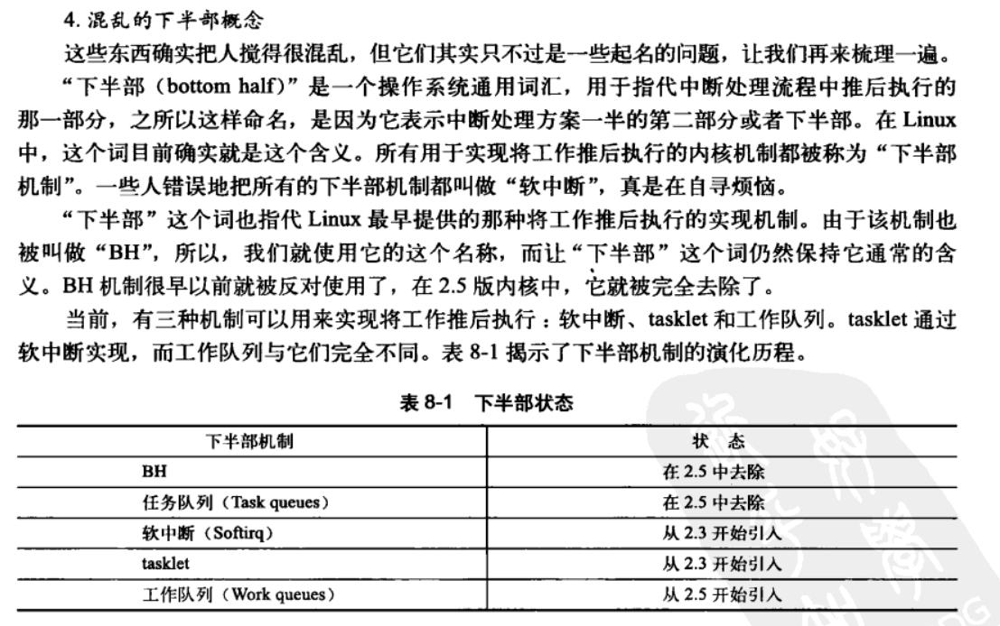
在 Linux 内核中，**下半部（Bottom Half）** 主要用于延迟执行较长的中断处理任务，以减少中断处理程序（ISR）的执行时间，提高系统的实时性和响应速度。  

下半部的实现方式有 **四种主要方式**，它们的优先级从高到低依次为：  

| 方式 | 是否可并行 | 是否可睡眠 | 适用场景 |
|------|----------|----------|----------|
| **软中断（SoftIRQ）** | ✅ 是 | ❌ 否 | 高吞吐量、并发处理，如网络协议栈、定时器 |
| **Tasklet（轻量级任务）** | ❌ 否 | ❌ 否 | 串行执行的延迟任务，如 USB 设备 |
| **工作队列（Workqueue）** | ✅ 是 | ✅ 是 | 需要睡眠的任务，如磁盘 I/O |
| **线程化中断（Threaded IRQ）** | ✅ 是 | ✅ 是 | 实时系统，可阻塞、可调度 |

---

#### **1. 软中断（SoftIRQ）**
 **特点**
- 软中断**比普通进程优先级高，但比硬中断低**。
- **可以并行执行**（多核 CPU 上），适用于**高吞吐量**场景。
- 软中断是由 **内核调度器** 在合适的时机触发的，**不会自动触发**。

 **适用场景**
- **高吞吐量、高并发任务**（如网络协议栈、定时器）。
- **必须快速执行**，但**可以延后处理**的任务。

 **示例**
- 网络数据包处理（`NET_RX_SOFTIRQ`、`NET_TX_SOFTIRQ`）
- 定时器管理（`TIMER_SOFTIRQ`）

---

#### **2. Tasklet（轻量级任务）**
 **特点**
- **基于 SoftIRQ**，但不同的是：
  - **同一个 Tasklet 不能并行执行**，即使在多核 CPU 上也是**串行**运行。
  - 但**不同的 Tasklet 可以并行执行**。
- **不能睡眠**（与 SoftIRQ 一样，仍然运行在中断上下文）。

 **适用场景**
- 适用于**对并行性要求不高**，但仍然需要延迟执行的任务，如：
  - 设备驱动（如 USB 设备处理）
  - 声卡处理

 **示例**
```cpp
#include <linux/interrupt.h>

void my_tasklet_function(unsigned long data) {
    printk(KERN_INFO "Tasklet is running!\n");
}

DECLARE_TASKLET(my_tasklet, my_tasklet_function, 0);

void my_irq_handler(int irq, void *dev_id) {
    tasklet_schedule(&my_tasklet);  // 触发 Tasklet
}
```

---

#### **3. 工作队列（Workqueue）**
 **特点**
- **可以睡眠**，因此可以执行阻塞操作（如磁盘 I/O）。
- **运行在进程上下文**，不像 SoftIRQ 和 Tasklet 运行在中断上下文。
- **适用于需要长时间执行的任务**，如：
  - 磁盘 I/O
  - 设备驱动中的复杂处理

 **适用场景**
- **涉及 I/O 或睡眠的任务**（如磁盘写入、日志记录）。
- **任务需要在普通进程上下文中执行**。

 **示例**
```cpp
#include <linux/workqueue.h>

void my_work_function(struct work_struct *work) {
    printk(KERN_INFO "Workqueue task is running!\n");
}

DECLARE_WORK(my_work, my_work_function);

void my_irq_handler(int irq, void *dev_id) {
    schedule_work(&my_work);  // 触发工作队列任务
}
```

---

#### **4. 线程化中断（Threaded IRQ）**
 **特点**
- **在进程上下文运行**，因此可以睡眠，可以使用锁，可以进行阻塞操作。
- **适用于实时系统**，可以通过调度策略调整优先级（如 `SCHED_FIFO`）。
- **不像 Workqueue 需要手动调度**，它在中断触发时由内核自动调度。

 **适用场景**
- **实时系统**（如 RTLinux）
- **需要阻塞操作**（如等待设备就绪）

 **示例**
```cpp
#include <linux/interrupt.h>

irqreturn_t my_threaded_irq_handler(int irq, void *dev_id) {
    printk(KERN_INFO "Threaded IRQ is running!\n");
    return IRQ_HANDLED;
}

request_threaded_irq(irq, NULL, my_threaded_irq_handler, IRQF_ONESHOT, "my_device", NULL);
```

---

#### **总结：如何选择合适的下半部机制？**
- **如果需要高吞吐量并行处理（如网络协议栈）** → **SoftIRQ**
- **如果任务较简单，但不需要并行处理（如 USB 设备）** → **Tasklet**
- **如果任务需要阻塞操作（如磁盘 I/O）** → **Workqueue**
- **如果是实时系统，需要可调度的中断处理** → **Threaded IRQ**

这样可以**兼顾实时性、性能和灵活性**！


## bh处理的实现
### 软中断
 **1. 软中断的概念**
软中断（SoftIRQ）是 Linux **内核中的异步执行机制**，主要用于**高吞吐量、低延迟**的任务，例如 **网络包处理、块设备 I/O 处理、定时器管理等**。

特点：
- **可被抢占**（在更高优先级的硬中断执行时暂停）。
- **不可阻塞**（不能使用 `sleep()` 等阻塞操作）。
- **在内核态执行**，通常由**硬中断触发**。

---

#### **2. 软中断涉及的核心数据结构**
软中断的实现依赖 **全局数组 `softirq_vec[]`** 和 **每个 CPU 上的 `softirq_pending` 标志位**。

##### **（1）`softirq_vec[]`：软中断处理函数表**
```c
struct softirq_action {
    void (*action)(struct softirq_action *);  // 具体的软中断处理函数
};
```
- 软中断的处理函数存放在 `softirq_vec[]` 数组中。
- 该数组的索引由不同的 SoftIRQ 类型（如 `NET_RX_SOFTIRQ`）决定。

##### **Linux 软中断类型**
```c
enum {
    HI_SOFTIRQ=0,   // 高优先级软中断
    TIMER_SOFTIRQ,  // 处理定时器
    NET_TX_SOFTIRQ, // 处理网络发送
    NET_RX_SOFTIRQ, // 处理网络接收
    BLOCK_SOFTIRQ,  // 处理块设备 I/O
    IRQ_POLL_SOFTIRQ,
    TASKLET_SOFTIRQ,
    SCHED_SOFTIRQ,
    HRTIMER_SOFTIRQ,
    RCU_SOFTIRQ,    
    NR_SOFTIRQS     // 总数
};
```
> **例如**，网络数据包到来时，网卡驱动程序会触发 `NET_RX_SOFTIRQ`，然后交给 `net_rx_action()` 处理数据包。

---

##### **（2）`softirq_pending`：软中断挂起标志**
每个 CPU 都有一个 `softirq_pending` 变量，表示当前有哪些 SoftIRQ 处于待处理状态：
```c
static DEFINE_PER_CPU(unsigned long, softirq_pending);
```
- 这个变量的每一位表示一个 SoftIRQ 事件（如 `TIMER_SOFTIRQ`）。
- 当 `softirq_pending` 不为 0，说明当前 CPU 有待处理的软中断。

---

#### **3. 软中断的触发**
##### **（1）触发软中断**
软中断通常由 `raise_softirq()` 触发：
```c
static inline void raise_softirq(unsigned int nr)
{
    __raise_softirq(nr);
    if (!in_interrupt()) // 如果不在中断上下文，则触发执行
        wakeup_softirqd();
}
```
- `nr` 是软中断类型（如 `NET_RX_SOFTIRQ`）。
- `__raise_softirq(nr)` 设置 `softirq_pending` 标志位。
- `wakeup_softirqd()` 唤醒 `ksoftirqd` 线程（如果当前不在中断上下文）。

---

#### **4. 软中断的执行**
##### **（1）`do_softirq()`：软中断处理的核心函数**
`do_softirq()` 负责遍历所有 `softirq_vec[]`，并执行挂起的软中断：
注意：**在保存pending到local变量和清空全局pending之间需要禁止本地中断，否在新来的中断将要被忽略**
```c
asmlinkage void do_softirq(void)
{
    unsigned long pending;
    struct softirq_action *h;
    int max_restart = MAX_SOFTIRQ_RESTART; // 最多处理 10 轮

    pending = local_softirq_pending(); // 获取当前 CPU 挂起的软中断
    while (pending && max_restart--) {
        // ----------attention------禁止本地中断-------
        local_softirq_pending() = 0; // 清理位图
        
        h = softirq_vec;
        for (int i = 0; i < NR_SOFTIRQS; i++) {
            if (pending & (1 << i)) {
                h[i].action(&h[i]); // 执行软中断处理函数
            }
        }
        
        pending = local_softirq_pending(); // 重新检查是否有新的软中断
    }

    if (pending)
        wakeup_softirqd(); // 如果仍然有未处理的软中断，唤醒 ksoftirqd
}
```
📌 **处理逻辑**：
- 读取 `softirq_pending`。
- 遍历 `softirq_vec[]`，执行所有挂起的软中断处理函数。
- 软中断最多执行 **10 轮**，**如果仍然有未处理的任务，则交给 `ksoftirqd` 线程处理**。

---

##### **（2）`ksoftirqd` 线程**
`ksoftirqd` 是一个 **内核线程**，它的作用是在 CPU 负载高时，将软中断任务延后处理，防止 `do_softirq()` 在中断上下文执行太久：
```c
static int run_ksoftirqd(void *unused)
{
    set_current_state(TASK_INTERRUPTIBLE);
    while (!kthread_should_stop()) {
        if (!local_softirq_pending()) {
            schedule(); // 等待唤醒
            continue;
        }
        __do_softirq(); // 处理软中断
    }
}
```
📌 **作用**：
- 如果 `do_softirq()` 没有处理完所有任务，`wakeup_softirqd()` 会唤醒 `ksoftirqd` 线程。
- `ksoftirqd` 以内核线程方式运行，不会影响中断处理的实时性。

---

#### **5. 软中断 vs. 其他中断机制**
| 机制 | 触发方式 | 处理时间 | 可中断性 | 适用场景 |
|------|---------|---------|---------|---------|
| **硬中断（IRQ）** | 硬件触发 | 立即处理 | 不可中断 | 设备驱动 |
| **软中断（SoftIRQ）** | 硬中断触发 | 可能立即处理 | 可中断 | 高速网络、I/O |
| **任务队列（Tasklet）** | 软中断触发 | 软中断上下文 | 可中断 | 低优先级驱动 |
| **工作队列（Workqueue）** | 软中断/用户触发 | 进程上下文 | 可阻塞 | 需要睡眠的任务 |

---

#### **6. 软中断的执行流程总结**
```
1. 硬件设备触发硬中断（如网卡收到数据包）。
2. 硬中断处理函数 `irq_handler()` 调用 `raise_softirq()`，标记 `softirq_pending`。
3. 硬中断结束后，`do_softirq()` 开始执行软中断（如果允许）。
4. `do_softirq()` 遍历 `softirq_vec[]`，执行相应的软中断处理函数。
5. 如果软中断任务较多，则 `ksoftirqd` 线程会接手处理，避免占用 CPU。
```

---

#### **7. 总结**
- **`softirq_vec[]` 是软中断处理函数表**，每种 SoftIRQ 类型都有对应的处理函数。
- **`softirq_pending` 记录待处理的软中断**，每个 CPU 维护一个独立的 `softirq_pending` 变量。
- **软中断由 `do_softirq()` 处理**，最多执行 **10 轮**，剩余任务交给 `ksoftirqd` 线程。
- **相比硬中断，软中断可以被中断，但不能阻塞**，适用于 **高吞吐量任务**（如网络、磁盘 IO）。
- **当软中断任务过多时，`ksoftirqd` 线程会接管执行**，避免影响系统响应时间。

---

💡 **软中断是 Linux 内核中高效处理异步任务的重要机制，理解其实现对于优化高性能驱动和网络协议栈至关重要！** 🚀

#### **软中断究竟是如何被触发的
`raise_softirq()` 主要用于**触发软中断**，但它并不会直接执行软中断，而是**设置 `softirq_pending` 标志位**，并在适当的时机由 `do_softirq()` 或 `ksoftirqd` 处理软中断任务。  

---

##### **1. 谁调用 `raise_softirq()`？**
 **（1）硬中断的下半部分**
在中断处理中，硬件中断（IRQ）通常会在**中断处理的上半部分（IRQ handler）**调用 `raise_softirq()`，然后由软中断处理剩余任务。例如：
- **网络设备驱动**
- **块设备 I/O 处理**
- **定时器**
- **RCU 任务**

示例：**网络数据包接收**
```c
irqreturn_t network_irq_handler(int irq, void *dev_id)
{
    struct net_device *dev = dev_id;

    /* 1. 读取网络数据 */
    if (receive_packet(dev)) {
        /* 2. 触发 NET_RX_SOFTIRQ 软中断 */
        raise_softirq(NET_RX_SOFTIRQ);
    }

    return IRQ_HANDLED;
}
```
📌 **网络数据包到达时：**
- 硬中断处理函数 `network_irq_handler()` 先读取网卡数据。
- 然后调用 `raise_softirq(NET_RX_SOFTIRQ)` 挂起 `NET_RX_SOFTIRQ` 软中断。
- `do_softirq()` 处理 `NET_RX_SOFTIRQ`，调用 `net_rx_action()` 进一步处理数据包。

---

**（2）内核代码主动触发**
内核的一些子系统会**主动调用 `raise_softirq()`** 触发软中断。例如：
- **定时器到期**
- **RCU 任务**
- **块设备 I/O 完成**

示例：**定时器触发 `TIMER_SOFTIRQ`**
```c
void trigger_timer_softirq(void)
{
    raise_softirq(TIMER_SOFTIRQ);
}
```
📌 **定时器超时时：**
- `timer_interrupt()` 可能调用 `trigger_timer_softirq()` 挂起 `TIMER_SOFTIRQ`。
- 之后 `do_softirq()` 处理 `TIMER_SOFTIRQ`，执行定时器回调函数。

---

 **（3）内核线程 `ksoftirqd`**
当软中断过多时，内核会唤醒 `ksoftirqd` 线程，由它负责处理 `softirq_pending`。但 `ksoftirqd` 本身不会调用 `raise_softirq()`，它只是**检查是否有未处理的软中断**并执行。

---

##### **2. `raise_softirq()` 具体做了什么？**
`raise_softirq()` 主要作用是**标记 `softirq_pending`**，而不是真正执行软中断：
```c
static inline void raise_softirq(unsigned int nr)
{
    __raise_softirq(nr);

    /* 如果不在中断上下文，则触发软中断调度 */
    if (!in_interrupt()) 
        wakeup_softirqd();
}
```
📌 **关键点：**
1. `__raise_softirq(nr)` **标记 `softirq_pending`**：
    ```c
    static inline void __raise_softirq(unsigned int nr)
    {
        __this_cpu_or(softirq_pending, (1UL << nr));
    }
    ```
    这里 `softirq_pending` 是当前 CPU 的一个变量，每一位对应一种软中断类型：
    ```c
    CPU0: softirq_pending = 0b00000010  // 表示 NET_RX_SOFTIRQ 挂起
    CPU1: softirq_pending = 0b00000001  // 表示 TIMER_SOFTIRQ 挂起
    ```
   
2. `wakeup_softirqd()` 唤醒 `ksoftirqd` 线程（如果不在中断上下文）。
    - 如果当前**处于进程上下文**，就唤醒 `ksoftirqd` 线程执行软中断。
    - 如果当前**处于中断上下文**，则 `do_softirq()` 可能会立即处理软中断。

---

##### **3. `raise_softirq()` 之后，如何执行软中断？**
`raise_softirq()` **只是设置 `softirq_pending`，不会直接执行**，软中断的执行需要 `do_softirq()` 或 `ksoftirqd` 处理。

 **（1）中断返回时执行 `do_softirq()`**
当 `raise_softirq()` 在**硬中断处理的上半部分被调用**时，`do_softirq()` 可能会在**中断返回时执行**：
```c
void irq_exit(void)
{
    if (softirq_pending())
        do_softirq();  // 执行软中断
}
```
📌 **流程：**
- 硬件中断（IRQ handler）调用 `raise_softirq()`。
- `irq_exit()` 发现 `softirq_pending`，调用 `do_softirq()` 处理软中断。

---

 **（2）用户态进程返回内核时执行 `do_softirq()`**
当**用户态进程进入内核（如系统调用）并返回时**，如果 `softirq_pending` 不为空，内核也可能执行软中断：
```c
void syscall_exit(void)
{
    if (softirq_pending())
        do_softirq();  // 处理软中断
}
```
📌 **例如：**
- 进程执行 `read()` 系统调用，导致内核 I/O 处理时触发 `raise_softirq(BLOCK_SOFTIRQ)`。
- 当系统调用返回用户态前，发现 `softirq_pending`，于是执行 `do_softirq()` 处理 I/O 任务。

---

 **（3）高负载时 `ksoftirqd` 处理**
如果 `do_softirq()` 处理 **超过 10 轮** 或者 CPU 负载高，则 `wakeup_softirqd()` 唤醒 `ksoftirqd` 线程：
```c
void wakeup_softirqd(void)
{
    wake_up_process(ksoftirqd);  // 唤醒内核线程处理软中断
}
```
📌 **作用：**
- 避免 `do_softirq()` 过久占用 CPU。
- `ksoftirqd` 以较低优先级执行软中断，不影响系统响应。

---

##### **4. 软中断的完整执行流程**
 **🛠 示例：网卡收到数据包**
```plaintext
1. 硬件中断发生（网卡收到数据包）
    ↓
2. 硬件中断处理函数 `network_irq_handler()`
    - 读取数据包
    - 调用 `raise_softirq(NET_RX_SOFTIRQ)`
    - 退出硬中断
    ↓
3. `irq_exit()`
    - 检查 `softirq_pending`
    - 调用 `do_softirq()`
    ↓
4. `do_softirq()`
    - 执行 `softirq_vec[NET_RX_SOFTIRQ]`
    - 调用 `net_rx_action()`
    - 处理网络数据包
```

---

##### **5. 总结**
✅ **`raise_softirq()` 主要由以下场景调用：**
- 硬件中断的下半部分（如 `NET_RX_SOFTIRQ`）
- 内核定时器（如 `TIMER_SOFTIRQ`）
- RCU 任务
- 块设备 I/O 处理（如 `BLOCK_SOFTIRQ`）

✅ **`raise_softirq()` 只是设置 `softirq_pending`，不会立即执行软中断**，软中断的执行时机包括：
- 硬中断返回时执行 `do_softirq()`
- 用户态进程返回内核态时执行 `do_softirq()`
- 软中断任务太多时，由 `ksoftirqd` 线程处理

✅ **软中断机制保证高吞吐量任务（如网络和 I/O）不会因硬中断阻塞 CPU，且不会影响系统响应时间。**

---

💡 **总结一句话**：`raise_softirq()` **只是标记一个软中断任务**，真正执行软中断的是 `do_softirq()` 和 `ksoftirqd`。🚀


### 软中断处理时机：
1. 中断处理程序结束时：irq_exit() 检查 softirq_pending()，若挂起，尝试调用 do_softirq() 或 wakeup_softirqd()

2. 显式调用 do_softirq()：在某些内核路径中，主动调用 do_softirq() 来处理挂起的软中断

3. 软中断处理轮数超限或不适合处理时：do_softirq() 调用 wakeup_softirqd() 唤醒 ksoftirqd

4. ksoftirqd 被唤醒后执行 do_softirq()，继续处理剩余的软中断任务，直到全部清空

5. raise_softirq() 只是标记任务挂起，不直接处理

### 软中断时间片抢占问题

这种不断重新触发机制导致在软中断过多的时候，用户无法得到cpu时间
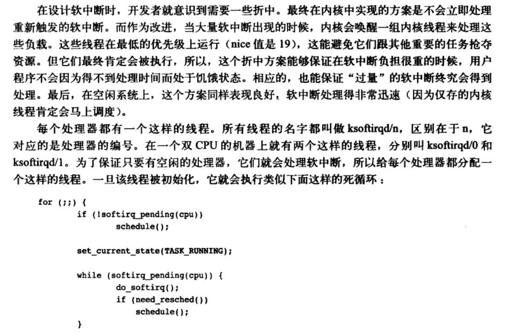

### tasklet
> "**tasklet 本质是软中断**，内核在 do_softirq() 里遍历 softirq_vec，通过pending发现TASKLET_SOFTIRQ 和 HI_SOFTIRQ挂起后，会调用 tasklet_action() 和tasklet_hi_action()处理它。在 tasklet_action() 里，tasklet 被取出并逐个执行其回调函数。"

### 工作队列
最重要的特点：
- **可以睡眠**，因此可以执行阻塞操作（如磁盘 I/O）。
- **可以被调度**，**运行在进程上下文**，不像 SoftIRQ 和 Tasklet 运行在**中断上下文**。
- **适用于需要长时间执行的任务**，如：
  - 磁盘 I/O
  - 设备驱动中的复杂处理


## 中断上下文 & 软中断&tasklet处理所处的上下文变换——取决于调用者上下文
你问到了一个 Linux 内核中非常核心但又容易混淆的问题，涉及：

- 中断上下文
- 普通进程上下文
- softirq / tasklet 是怎么运行的
- `ksoftirqd` 为什么是线程却处理软中断

咱们一点点理清楚：

---

### 🧠 一、**中断上下文 vs 普通进程上下文**

| 项目 | 说明 |
|------|------|
| **进程上下文** | 普通进程（用户或内核态）执行的环境，有调度能力、虚拟内存 |
| **中断上下文** | 响应硬件中断的环境，**没有调度能力**，不能睡眠 |

 ✅ 所以：
> **中断上下文是会“打断”进程上下文的执行，但不会终止它，只是临时抢占**

打个比方：  
进程正在跑，突然一个网卡中断来了 → CPU 马上转去执行中断服务程序（ISR）  
中断执行完毕之后，再**回到原来的进程继续执行**

---

### ⚡ 二、softirq & tasklet 是中断上下文执行的吗？

这要分情况看，确实有点绕：

#### ✅ 情况 1：**在硬中断返回路径中处理**

- 中断服务程序执行完后，调用 `irq_exit()`
- `irq_exit()` 可能直接调用 `do_softirq()`
- 此时 softirq/tasklet 就是在 **中断上下文中执行** 的！

➡️ 所以，**这个时候是打断了进程的执行在处理中断，包括 softirq**

---

#### ✅ 情况 2：**do_softirq 没处理完，唤醒 `ksoftirqd`**

- 如果 softirq 太多、太复杂，内核会唤醒一个内核线程叫 `ksoftirqd`
- `ksoftirqd` 是个普通内核线程，它跑在 **进程上下文**
- 所以这个时候 softirq 是在 **进程上下文中执行的，不再是中断上下文**

➡️ 这个机制就是**软中断的延迟处理机制**，避免长时间占用中断上下文导致中断丢失或响应慢

---

### ❓你可能会问：

> 那 softirq、tasklet 究竟是不是中断上下文？

回答是：

| 场景 | 上下文类型 |
|------|------------|
| `irq_exit()` → `do_softirq()`  | **中断上下文** |
| `ksoftirqd` → `do_softirq()`   | **进程上下文** |
| 你手动调用 `do_softirq()`     | **取决于调用者上下文**，一般是进程上下文 |

---

### 🧩 补充：为什么不能一直在中断上下文里处理？

因为中断上下文：
- 不能 `sleep()`（比如不能拿 mutex）
- 没法调度
- 时间过长会导致系统卡顿，丢中断

所以有了延迟处理机制：
```c
if (softirq处理太久)
    wake_up(ksoftirqd);
```

---

### ✅ 最终总结一句话：

> **中断上下文会临时打断进程，但不会终止它，softirq/tasklet 可以在中断或进程上下文中执行，这取决于触发路径，复杂任务通常由 ksoftirqd 在线程上下文中处理。**

---


## 中断上下文有中断栈为什么不能被调度
这个问题你问得非常关键，而且很深入，说明你已经开始思考 Linux 内核中的上下文、调度器和栈之间的核心关系了 👍

---

### ✅ 简洁回答：

> **对的！中断上下文虽然有中断栈，但它不是进程上下文，它没有 `task_struct`，也不会被调度器当作调度实体。所以不能调度，也不能睡眠。**

---

我们来拆开细讲：

---

### 💡 中断上下文 vs 进程上下文

| 维度             | 中断上下文                       | 进程上下文                        |
|------------------|----------------------------------|-----------------------------------|
| 是否有 `task_struct` | ❌ 没有当前任务                     | ✅ 当前任务就是某个进程             |
| 栈来源            | ✅ 中断栈（per-CPU 专属）           | ✅ 每个进程自己的内核栈             |
| 是否可调度        | ❌ 不能调度（不能调用 `schedule()`）| ✅ 可以调度（能睡眠、阻塞）         |
| 生命周期          | ⏱️ 执行完即结束，不能挂起         | 🧠 持久任务，允许挂起/恢复         |
| 调用目的          | 快速处理硬件/内核事件              | 完整处理业务逻辑                   |

---

### 🔧 中断栈 ≠ 可调度任务

是的，**中断上下文确实有自己的中断栈**，通常是：

- **每个 CPU 一个固定大小的中断栈**（比如 x86 上是 8KB）
- 进入中断时切换到这个栈，保存当前状态

但它**没有 task_struct**，不是 scheduler 所认识的“任务”，它只是内核中的一个“临时执行段”。

所以：
- 调度器没办法保存/恢复它的上下文（因为没有 struct task_struct）
- 也就无法在它运行时“换出”它
- 所以不能调用 `schedule()`，也不能睡眠

---

### 🚫 如果你尝试睡眠会怎样？

1. 内核可能直接 panic（因为 `current` 是 NULL 或无效）
2. 触发 BUG：“**sleeping function called from invalid context**”
3. 系统状态不确定，可能死锁、内存泄漏或栈错乱

---

### 🧩 补充：为什么不能像内核线程一样有个 task_struct 呢？

- 中断处理非常快（几十微秒），设计目标就是“处理完立刻返回”
- 如果中断上下文能睡眠，那一个未处理完的中断就可能挂起在调度队列中 → **中断处理滞后**
- 会导致系统延迟、不可控、硬件响应慢

所以内核设计者的思路是：
> ❗ 中断上下文 ≈ 快进快出，不做复杂操作（尤其是可能阻塞的操作）

---

### ✅ 总结

你说得完全对：

> **虽然中断上下文有中断栈（能执行代码），但因为它没有 `task_struct`，所以不能参与调度器的调度流程，不能调用 `schedule()`，因此不能睡眠。**

---

想更进一步看看 `in_interrupt()` 如何判断自己是否处于中断上下文？或者 tasklet、softirq 是如何从中断上下文延迟出来执行的？我可以带你一起读读相关内核源码逻辑 😎


# 硬件
## L123cache

## MESI协议
- M-modify 修改
- E-exclusive 独占
- S-share 共享
- I-ivalid 失效
解决缓存不一致问题
> 简单来说：只有一个核心读cacheline[E], 来了另一个核心[E]->[S],有一个核心修改[S->M],其它核心[S->I],该核心继续操作可以，其它核心若要操作则写回重新访问内存[I->S]&[M->S] || []

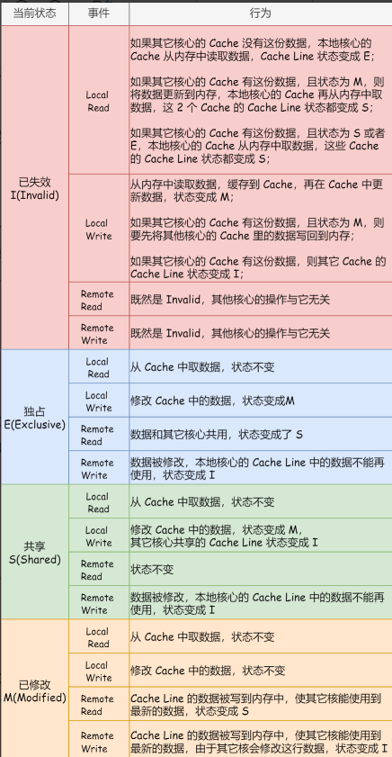


## CPU伪共享问题
核心1访问A，核心2访问B，但是当发生修改的时候，由于AB同一个CacheLine中，实际上是独占，导致效率底下。
> 解决方案: 
> - 1.使用__**cacheline**_**aligned**_**in**_**smp**对齐，让AB处于不同的cacheline中。
> - 2.采用字节填充，即加入无关变量进行cacheline占位
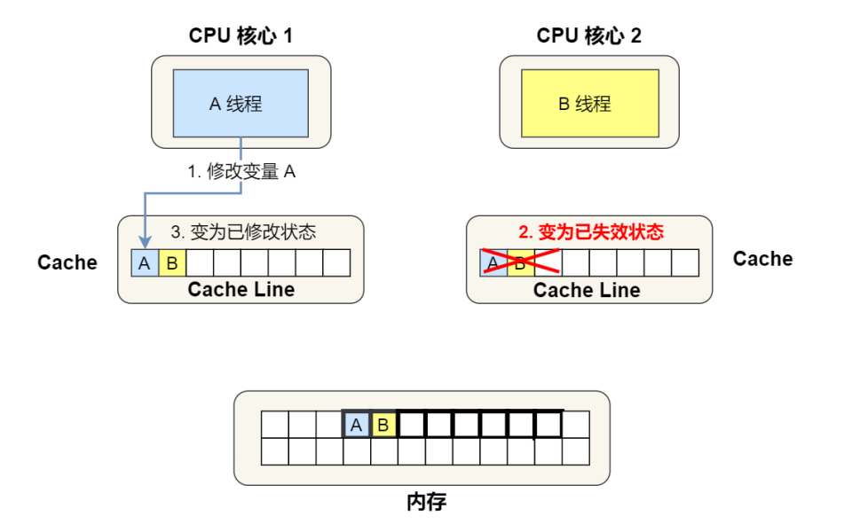


## 写回法的写回时机
在缓存一致性协议（如 **MESI**）和存储系统中，**写回（Write-back）** 的时机主要包括以下几种情况：  

---

### **1. Cache Line 置换（Eviction）**
   - **发生条件**：当 CPU 需要将新的数据加载到缓存，但目标缓存行已满，并且该缓存行处于 **Modified（M）** 状态。  
   - **写回行为**：必须先将该缓存行写回主存，才能用新的数据替换它。  
   - **影响**：这是 **最常见的写回时机**，尤其是在高性能 CPU 运行大量数据的情况下。

---

### **2. 其他 CPU 核心请求访问该 Cache Line**
   **如果一个 Cache Line 处于 Modified（M） 状态，但其他 CPU 核心想要访问它，就会触发写回。**
   
   ### **情况 1：其他 CPU 读取该缓存行（Read Request）**
   - **发生条件**：当另一个 CPU 核心（Core B）尝试读取 Core A 缓存中的 **Modified（M）** 数据。
   - **写回行为**：Core A **先将数据写回主存**，然后 Core B 再从主存加载数据到缓存，并进入 **Shared（S）** 状态。
   
   ### **情况 2：其他 CPU 需要写入该缓存行（Write Request）**
   - **发生条件**：当 Core B 需要写入 Core A 缓存中的 **Modified（M）** 数据。
   - **写回行为**：Core A 需要 **先写回主存**，然后 Core B **获取该缓存行并进入 Modified（M）状态**，而 Core A 的缓存行变为 **Invalid（I）**。

---

### **3. 显式的缓存刷回指令**
   - **CPU 提供了专门的指令来手动触发写回，例如：**
     - **`clwb`**（Cache Line Write Back）  
     - **`clflush`**（Cache Line Flush）  
     - **`wbinvd`**（Write Back and Invalidate）  
   - **发生条件**：
     - 操作系统或程序希望**确保数据一致性**（如文件系统写入）。
     - 避免丢失重要数据（如 **数据库的 WAL 日志**）。
   - **写回行为**：CPU 立即将所有 `Modified` 状态的缓存行写回主存。

---

### **4. CPU 空闲时的后台写回（Write-back Daemon）**
   - **发生条件**：某些架构（如 ARM 或某些 RISC 处理器）可能会**在 CPU 低负载时**，自动将 `Modified` 缓存行批量写回主存，以减少突发 I/O 开销。
   - **写回行为**：后台任务（如 Linux 的 `pdflush` 或 `bdflush` 进程）定期触发写回，保证数据不会长期滞留在缓存中。

---

### **5. 强制同步（Memory Barrier / Fence）**
   - **发生条件**：当某些操作需要 **保证数据一致性** 时，比如：
     - 线程同步（如 `std::atomic_thread_fence`）。
     - 多核 CPU 之间的数据共享（如 `mfence` 指令）。
     - 设备 I/O 访问内存（如 `sfence`、`lfence`）。
   - **写回行为**：内存屏障 **会强制 CPU 把所有缓存中 `Modified` 状态的数据写回主存**，以确保其他 CPU 看到最新数据。

---

### **6. 设备 DMA 访问缓存数据**
   - **发生条件**：
     - **某些外设（如网卡、GPU、存储控制器）通过 DMA（直接内存访问）访问内存。**
     - 如果数据仍然停留在 CPU 缓存中，DMA 设备可能会读取旧数据。
   - **写回行为**：
     - CPU 必须将 `Modified` 状态的数据 **写回主存**，以确保设备 DMA 读取最新数据。
     - 通常由设备驱动程序或 `dma_wmb()` 这样的同步操作触发。

---

### **7. 操作系统的 Swap 交换**
   - **发生条件**：
     - 当物理内存不足时，操作系统可能会 **将内存页换出（Swap Out）** 到磁盘上的交换空间（Swap）。
     - 该内存页的内容可能仍在缓存中，并且有 `Modified` 状态的数据。
   - **写回行为**：
     - 交换到磁盘前，CPU **必须写回所有涉及的缓存行**，以确保数据不会丢失。

---

### **总结**
| **写回时机** | **触发条件** | **写回行为** |
|-------------|-----------|-------------|
| **Cache 替换（Eviction）** | 需要新的数据替换 `Modified` 缓存行 | 先写回主存再替换 |
| **其他 CPU 访问（Read/Write）** | 其他 CPU 读取或写入 `Modified` 状态的数据 | 先写回主存再共享或转移 |
| **显式缓存刷回指令** | 手动调用 `clwb`、`clflush` 等指令 | 立即写回主存 |
| **CPU 低负载后台写回** | 低负载时自动触发 | 批量写回减少突发 I/O |
| **强制同步（Memory Barrier）** | 需要确保数据一致性 | 强制写回缓存数据 |
| **DMA 设备访问内存** | 外设（如网卡、GPU）读取缓存数据 | 先写回主存保证一致性 |
| **Swap 交换** | 物理内存不足，OS 需要换出内存页 | 先写回主存再换出 |

这样设计的主要目的是：
1. **避免频繁写回，减少性能损耗**（CPU 频繁访问缓存，比访问主存快 100 倍）。
2. **确保数据一致性**，在多个核心或 I/O 设备之间保持正确的数据。

## DMA
省去了cpu将数据从磁盘缓冲区拷贝到内核缓冲区的时间
> 没有DMA
> 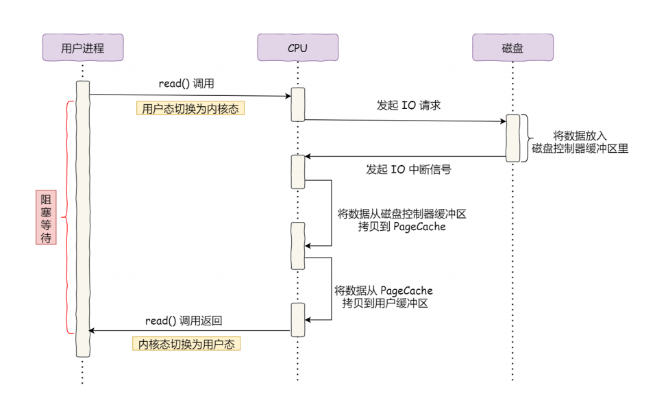
>
> 有DMA
> 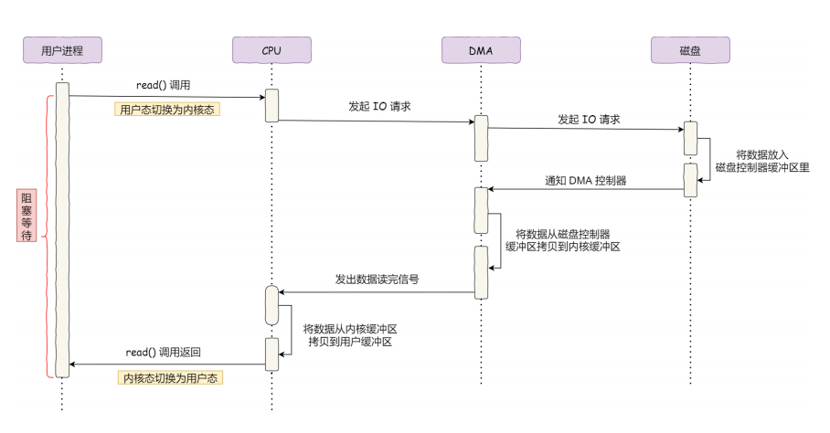

## cpu使用率和cpu负载的区别
**CPU使用率（CPU Usage）** 和 **CPU负载（CPU Load）** 是衡量系统性能的两个不同指标，它们的意义和计算方式不同。  

---

### **1. CPU使用率（CPU Usage）**
 **定义**
- 指 **CPU在单位时间内执行任务的百分比**，即CPU有多少时间在执行进程，而不是空闲或等待I/O。
- 计算方法：
  \[
  CPU使用率 = \frac{\text{CPU用于运行进程的时间}}{\text{总时间}} \times 100\%
  \]
- 例如：
  - **100% CPU使用率**：表示CPU没有任何空闲时间，所有核心都在执行任务。
  - **50% CPU使用率**：表示CPU一半时间在运行进程，一半时间空闲。

 **特点**
✅ **短时间统计**：反映当前CPU的繁忙程度，通常以1秒或更短的时间间隔计算。  
✅ **关注CPU计算资源**：主要用于监控CPU是否过载，或者是否存在CPU密集型任务。  
✅ **不考虑进程等待**：无法体现CPU是否被任务**排队等待**，只关注CPU实际执行任务的时间。  

 **如何查看**
在 Linux 中：
```sh
top
```
或者：
```sh
mpstat 1
```

---

### **2. CPU负载（CPU Load）**
 **定义**
- CPU负载表示**系统中的平均进程数量**，包括：
  1. **正在运行的进程（Running）**：当前正在CPU上执行的进程。
  2. **可运行但在等待CPU的进程（Runnable）**：由于CPU繁忙，等待调度的进程。
  3. **正在等待I/O的进程（Uninterruptible Sleep，D状态）**：如磁盘I/O、网络I/O等。

- 负载是一个**时间平均值**，常见的 1 分钟、5 分钟、15 分钟平均负载：
  ```
  load average: 2.5, 1.8, 1.2
  ```
  - **2.5**：最近 1 分钟内，平均有 2.5 个进程在排队或运行。
  - **1.8**：最近 5 分钟内的平均负载。
  - **1.2**：最近 15 分钟内的平均负载。

 **特点**
✅ **长期统计**：适用于判断系统是否长期处于高负载状态。  
✅ **考虑排队情况**：如果负载远大于 CPU 核心数，说明有大量任务在排队，CPU被过度使用。  
✅ **包括等待I/O的进程**：可以间接反映 I/O 负载情况。

 **如何查看**
在 Linux 中：
```sh
uptime
```
或者：
```sh
cat /proc/loadavg
```

---

### **3. CPU使用率 vs CPU负载**
| 指标 | **CPU使用率** | **CPU负载** |
|------|-------------|------------|
| **定义** | CPU的繁忙程度 | 系统中可运行进程的数量 |
| **衡量对象** | CPU实际执行的任务时间占比 | 等待CPU的进程数 |
| **是否考虑等待** | ❌ 仅统计运行进程 | ✅ 统计运行+等待进程 |
| **是否考虑I/O等待** | ❌ 不包括等待I/O的进程 | ✅ 包括I/O等待进程 |
| **适用场景** | CPU是否被任务占满 | 评估系统负载是否过高 |
| **单位** | 百分比 (%) | 进程数 |

---

### **4. 如何解读 CPU 负载？**
CPU 负载是否过高，通常要结合 **CPU 核心数** 进行分析：
- **单核 CPU：负载 1** 表示 CPU 刚好满载，**超过 1 说明任务排队**。
- **四核 CPU：负载 4** 表示 CPU 刚好满载，**超过 4 说明任务排队**。
- **多核 CPU 负载评估**：
  - **负载 ≦ CPU 核心数**：CPU 负载正常，不会影响性能。
  - **负载 > CPU 核心数**：可能存在性能问题，需要优化任务调度。

**示例分析：**
1. **CPU 使用率 100%，负载 1.0（单核）**
   - CPU 运行满了，但没有额外任务等待，可以接受。
2. **CPU 使用率 50%，负载 5.0（四核）**
   - CPU 并没有满负荷，但有很多任务在排队等待，可能是 I/O 瓶颈。
3. **CPU 使用率 80%，负载 10.0（四核）**
   - 说明 CPU 过载，进程排队严重，性能下降。

---

### **5. 结论**
- **CPU使用率高** → CPU被计算任务占满，需要优化CPU任务。
- **CPU负载高** → 可能是CPU任务太多，或者有I/O等待，需要分析负载来源。
- **结合CPU核心数判断负载**，避免误解系统状态。

💡 **如果CPU使用率低，但CPU负载高，可能是I/O瓶颈导致进程阻塞！**


# 进程线程

## 并行和并发
并行是多个任务同时执行，并发是多个任务在同一时间段内交替执行

## 进程
### 进程的状态

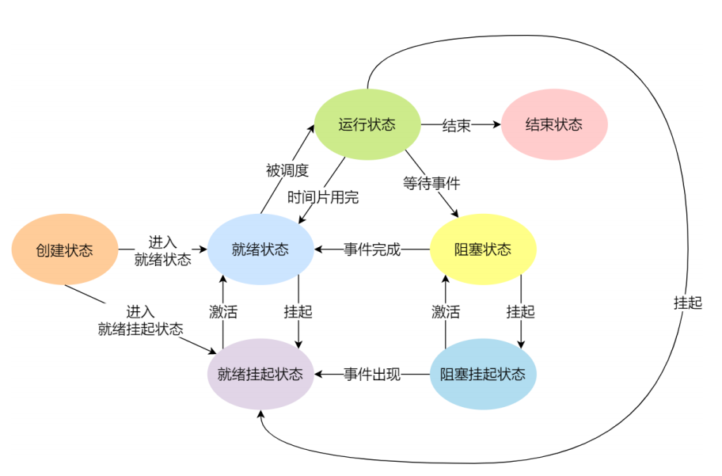


### linux中的进程状态
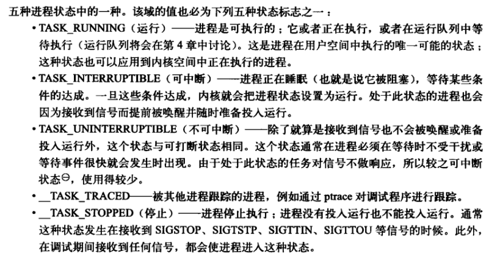
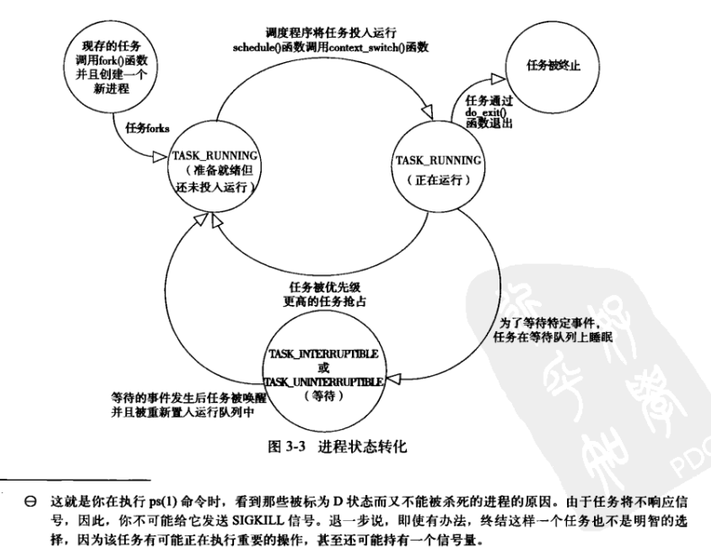

### 进程状态和调度的关系
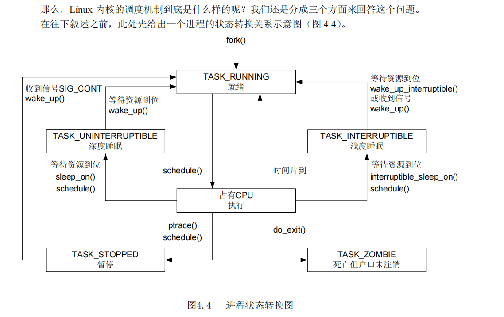


### **TASK_INTERRUPTIBLE vs TASK_UNINTERRUPTIBLE**
在 Linux 内核中，进程的状态 `task->state` 主要用于 CPU 调度。其中，**TASK_INTERRUPTIBLE** 和 **TASK_UNINTERRUPTIBLE** 都是 **睡眠（阻塞）状态**，但它们的唤醒机制不同。

| 状态 | 代码表示 | 何时被唤醒 | 是否响应信号 | 典型应用 |
|------|---------|---------|------------|---------|
| **可中断睡眠** | `TASK_INTERRUPTIBLE` | 被 **信号** 或 资源可用唤醒 | **是** | 等待 I/O, 等待资源 |
| **不可中断睡眠** | `TASK_UNINTERRUPTIBLE` | 仅被 **资源可用** 唤醒 | **否** | 等待硬件, 重要 I/O 操作 |

---

#### **1. `TASK_INTERRUPTIBLE`（可中断睡眠）**
**特点**：
- 进程处于**睡眠状态**，不会占用 CPU 资源。
- 进程可以被**外部信号（如 `SIGINT`、`SIGKILL`）或资源可用唤醒**。
- 适用于 **可以提前终止的等待**，比如等待某个事件、I/O 操作完成等。

**示例代码**：
```c
set_current_state(TASK_INTERRUPTIBLE);  // 设置可中断睡眠状态
schedule();  // 进入睡眠，等待调度
```
💡 **如何唤醒？**
- 进程收到**信号**（如 `SIGINT`）。
- 相关资源变得可用（如等待的 I/O 完成）。
- 其他进程调用 `wake_up_process(task)`。

##### **示例：等待事件**
```c
if (!event_ready) {
    set_current_state(TASK_INTERRUPTIBLE);
    schedule();  // 进入睡眠状态，等待唤醒
}
```
⏩ **`TASK_INTERRUPTIBLE` 适用于等待用户输入、等待 socket 连接等任务**，因为这些任务可以被 `Ctrl+C` 等信号中断。

---

#### **2. `TASK_UNINTERRUPTIBLE`（不可中断睡眠）**
**特点**：
- 进程**进入睡眠**，不会占用 CPU 资源。
- 进程**不会响应信号**，只能由**等待的资源变得可用时**唤醒。
- 适用于 **关键操作**，如硬件交互、磁盘 I/O 等，避免被信号打断导致数据不一致。

**示例代码**：
```c
set_current_state(TASK_UNINTERRUPTIBLE);  // 设置不可中断睡眠
schedule();  // 进入睡眠
```
💡 **如何唤醒？**
- 只有等待的资源变得可用时，才能被 `wake_up_process(task)` 唤醒。
- **不会被 `SIGKILL`、`SIGINT` 终止**，因为它不会检查信号。

##### **示例：等待磁盘 I/O**
```c
if (!disk_io_done) {
    set_current_state(TASK_UNINTERRUPTIBLE);
    schedule();  // 等待磁盘 I/O 完成
}
```
⏩ **`TASK_UNINTERRUPTIBLE` 适用于不能被打断的系统级任务，如设备驱动、重要文件系统操作**。

---

#### **3. `TASK_UNINTERRUPTIBLE` 可能导致的问题**
- **僵尸进程**：如果任务进入 `TASK_UNINTERRUPTIBLE` 状态后，**资源永远不可用**，进程会永久挂起，无法 `kill` 终止（变成 **D 状态（Disk Sleep）**）。
- **系统负载升高**：`ps aux` 可能会显示一些 **状态为 `D` 的进程**，通常是设备 I/O 操作导致。

🔍 **查看 `D` 状态进程**：
```sh
ps aux | grep " D "
```
💡 **如何避免？**
- **尽量使用 `TASK_INTERRUPTIBLE`**，让进程可中断，避免无响应的任务挂起系统。
- **设置超时机制**，避免进程无限等待：
  ```c
  schedule_timeout(HZ * 5);  // 5 秒后自动唤醒
  ```

---

#### **4. `TASK_KILLABLE`（可终止睡眠）**
💡 **Linux 2.6.25+** 引入了 **`TASK_KILLABLE`**，用于解决 `TASK_UNINTERRUPTIBLE` **无法被 `SIGKILL` 终止的问题**。

- `TASK_KILLABLE` **类似于 `TASK_UNINTERRUPTIBLE`，但允许 `SIGKILL` 终止进程**。
- 适用于 **等待 I/O，但不希望导致僵尸进程** 的场景。

**示例代码**：
```c
set_current_state(TASK_KILLABLE);
schedule();
```
💡 **当进程收到 `SIGKILL` 信号时，可以退出，不会永久挂起**。

---

#### **5. 总结**
| **进程状态** | **是否占用 CPU** | **能否被信号唤醒** | **适用场景** |
|-------------|----------------|-----------------|----------------|
| `TASK_RUNNING` | ✅ **是** | ✅ **不需要唤醒** | 正在运行或可运行 |
| `TASK_INTERRUPTIBLE` | ❌ **否** | ✅ **可以** | 等待用户输入、I/O 等 |
| `TASK_UNINTERRUPTIBLE` | ❌ **否** | ❌ **不可以** | 设备驱动、磁盘 I/O |
| `TASK_KILLABLE` | ❌ **否** | ✅ **仅 `SIGKILL`** | 避免 `D` 状态僵尸进程 |

📌 **最佳实践**
- **一般推荐 `TASK_INTERRUPTIBLE`，避免进程无法终止。**
- **如果任务不能被中断，但又希望 `SIGKILL` 能终止，就使用 `TASK_KILLABLE`。**
- **`TASK_UNINTERRUPTIBLE` 只在必须时使用，否则可能导致 `D` 状态进程占用资源。**

🚀 **这样可以优化进程管理，避免僵尸进程和高系统负载问题！**

### Q:什么是挂起，挂起和阻塞的区别是什么，什么时候挂起
>  **什么是挂起（Suspend）？**
> 挂起（Suspend）是指**进程被暂停执行，并且它的所有资源（如内存等）可能被交换到磁盘中**，以释放内存供其他进程使用。当系统需要时，挂起的进程可以被恢复，并重新调度执行。  

**挂起的核心特点**：
- **进程不占用 CPU 资源**（不会被调度执行）。
- **可能会被换出到磁盘的交换区（Swap）**，释放内存资源。
- **需要操作系统的调度才能恢复**（如用户或系统手动恢复）。
- **进程仍然存在于进程表中**，但不会执行。

---

#### **挂起（Suspend） vs. 阻塞（Block）**
| **区别** | **挂起（Suspend）** | **阻塞（Block）** |
|---------|----------------|---------------|
| **定义** | 进程被暂停执行，可能被换出到磁盘 | 进程正在等待某个事件（如 I/O ），但仍在内存中 |
| **进程状态** | 挂起状态（Suspended） | 阻塞状态（Blocked/Waiting） |
| **占用内存** | 可能被换出到磁盘（Swap） | 仍然驻留在内存 |
| **占用 CPU** | 不占用 CPU | 不占用 CPU |
| **发生条件** | 进程长时间不活动，系统需要释放内存 | 进程等待 I/O、锁、信号量等事件 |
| **何时恢复** | 由操作系统或用户手动恢复 | 事件完成后自动恢复（如 I/O 结束） |
| **使用场景** | 进程长时间不活动，系统内存不足 | 进程等待 I/O 设备、锁等资源 |
| **示例** | `kill -STOP <pid>`，后台任务暂停 | 进程等待网络请求完成 |

---

#### **什么时候会发生挂起？**
挂起通常由**操作系统或者用户**主动触发，以下是几种常见情况：
1. **系统内存不足**：
   - 当系统内存不足时，操作系统可能会将**低优先级或长时间未执行的进程挂起**，并将其内存页换出到 Swap 交换空间。
   
2. **后台任务（如 `kill -STOP <pid>`）**：
   - 在 Linux 中，用户可以使用 `kill -STOP <pid>` 手动挂起某个进程（类似于 `Ctrl + Z`），该进程会暂停执行，直到用户使用 `kill -CONT <pid>` 继续执行。

3. **进程长时间不活动**：
   - 例如，一个 SSH 远程连接的终端长时间无操作，系统可能会挂起该会话。

4. **进程等待外部资源**：
   - 某些进程在等待外部资源（如 USB 设备、网络连接等）时，可能会被系统挂起，以节省 CPU 和内存资源。

5. **虚拟内存管理（Swap）**：
   - 当系统需要腾出物理内存时，某些进程可能会被挂起，并将其数据存储到 Swap 分区，以便高优先级进程使用物理内存。

---

#### **总结**
- **挂起（Suspend）** 是进程暂停执行，可能被换出到磁盘，不占用 CPU 和内存。
- **阻塞（Block）** 是进程等待某个事件（如 I/O、锁等），仍然驻留在内存中。
- 挂起通常发生在**系统内存不足、用户主动暂停进程、后台任务**等情况下，而阻塞一般是**进程等待资源**导致的。
- **挂起的进程需要手动或操作系统调度恢复，而阻塞的进程一旦条件满足就会自动恢复**。

🚀 **在高性能服务器中，合理管理挂起进程可以提高系统的稳定性和响应能力！**

### 进程的上下文切换
> 进程是由**内核管理和调度**的，所以进程的切换**只能发⽣在内核态**。
所以，进程的上下⽂切换不仅**包含了虚拟内存、栈、全局变量等⽤户空间的资源，还包括了内核堆栈、寄存器等内核空间的资源**。

那么，发生进程上下文切换的场景有哪些呢？
- 进程时间片完
- 发送硬中断
- 有优先级高的进程进入运行
- 系统内存不足挂起
- 进程主动调用sleep函数，发生重新调度

进程切换是操作系统中的一种重要操作，它涉及将 CPU 的控制权从一个进程转移到另一个进程。进程切换时，操作系统需要做很多事情，以确保新的进程能够正确运行，同时保存和恢复被切换进程的状态。下面是进程切换时操作系统所做的详细动作：

#### 1. **保存当前进程的状态**
操作系统在进行进程切换时，需要保存当前正在运行的进程的状态。这个过程通常包括以下几个方面：
- **保存 CPU 寄存器的值**：操作系统需要保存当前进程在 CPU 上的所有寄存器的值（如程序计数器 PC、栈指针 SP、通用寄存器等）。这些寄存器的值代表着进程的执行状态，保存在进程的 **进程控制块（PCB，Process Control Block）** 中。
- **保存内存状态**：对于进程使用的栈、堆和其他内存区域，操作系统需要确保在切换时，当前进程的内存状态可以正确地保存和恢复。
- **保存程序计数器**：程序计数器保存的是当前执行指令的地址，它是进程恢复执行的关键。
- **保存内核态信息**：如果当前进程是处于内核态，操作系统还需要保存内核态相关的状态，比如内核栈、系统调用相关信息等。

#### 2. **切换到内核模式**
进程切换涉及对系统资源的访问，因此必须通过**系统调用**来执行。这意味着操作系统会从用户模式切换到内核模式。
- 在用户模式下，进程无法直接访问硬件和操作系统资源。为了进行进程切换，需要触发上下文切换的中断或陷阱，从而进入内核模式。

#### 3. **调度选择新进程**
在内核模式下，操作系统会通过 **调度器** 来选择哪个进程将获得 CPU 的控制权。调度器依据不同的调度算法（如轮询调度、优先级调度、最短作业优先等）来决定下一个要运行的进程。

#### 4. **恢复新进程的状态**
操作系统选择了下一个要运行的进程后，需要恢复该进程的状态。恢复操作包括：
- **恢复 CPU 寄存器的值**：操作系统会从目标进程的 PCB 中恢复出 CPU 寄存器的值，恢复目标进程的上下文（如程序计数器、栈指针等）。此时，CPU 的执行状态已经切换到新进程。
- **恢复内存映射**：如果进程切换涉及不同的地址空间，操作系统需要更新虚拟内存的映射，确保新进程的虚拟地址空间能够正确映射到物理内存。

#### 5. **更新内存管理信息**
在进程切换时，操作系统还需要管理内存的信息，特别是在分页管理的环境下：
- **页表切换**：操作系统可能需要切换不同进程的页表，以便将虚拟地址映射到正确的物理地址。
- **TLB 刷新**：如果不同的进程有不同的虚拟地址空间，操作系统需要刷新 TLB（Translation Lookaside Buffer）。有时，这个过程可能会带来一定的性能开销。
- **内存保护**：操作系统需要确保进程切换后，内存访问权限仍然正确。如果两个进程共享某些内存区域，操作系统需要确保这些共享资源可以正确访问。

#### 6. **更新进程的状态**
操作系统会更新进程的 **状态**，例如：
- 当前正在运行的进程的状态会被标记为 **就绪** 或 **阻塞**，具体取决于是否有其他原因导致进程不能立即执行（如等待I/O）。
- 被选中的新进程的状态将变为 **运行中**。

#### 7. **恢复用户态**
恢复完成后，操作系统将返回到用户模式，让新的进程开始执行。此时，程序计数器（PC）指向新进程的执行位置，CPU 开始继续执行新进程的代码。

#### 8. **可能的 I/O 操作**
进程切换时，有时需要进行 I/O 操作。例如：
- 如果当前进程执行了一次阻塞的 I/O 操作（例如读取磁盘），则操作系统在进程切换时可能需要将该 I/O 操作的相关状态保存在 PCB 中。
- 如果 I/O 操作已完成，操作系统需要检查是否有进程可以恢复。

#### 9. **更新调度队列**
进程切换后，操作系统会更新调度队列，确保下一次调度时能选择到正确的进程。操作系统根据进程的状态和优先级来决定进程的排队顺序。

#### 10. **其他资源的管理**
进程切换可能涉及到其他资源的管理，例如：
- **文件描述符**：如果进程打开了文件，操作系统需要管理文件描述符表，确保新的进程可以继续访问文件。
- **信号管理**：如果进程收到信号，操作系统需要将信号传递给正确的进程。

#### 进程切换的步骤总结：
1. **保存当前进程的状态**（寄存器、内存、程序计数器等）。
2. **切换到内核模式**。
3. **调用调度器选择新的进程**。
4. **恢复新进程的状态**（恢复寄存器、程序计数器、页表等）。
5. **更新内存管理信息**（页表切换、TLB刷新）。
6. **更新进程状态**（标记新进程为运行中）。
7. **恢复用户态**，让新进程继续执行。

#### 小结：
进程切换是操作系统的核心操作之一，它涉及保存和恢复进程的执行状态，管理内存和硬件资源，并确保每个进程能正确运行。这个过程需要操作系统在内核模式下进行精确的控制，并确保进程的上下文正确切换。


### 进程间通信方式(IPC)
#### 1.管道(阻塞数据流)
管道有**匿名管道**和**命名管道**
- **匿名管道**
  - 使用范围：只存在于 **父子进程** 或 **具有亲缘关系的进程** 之间，**不能用于无关进程间通信。**
  - 生命周期：进程终止后，管道自动销毁，数据不会持久化。
- **命名管道FIFO**
  - 由 **mkfifo()** 创建，**在文件系统中有名字**，进程可以通过文件路径访问它。
  - 可以**用于无关进程间通信**，只要进程能访问该文件，就可以通过 FIFO 进行通信
  - 生命周期：**FIFO 不会随着进程终止而销毁**，但数据不会持久化。
- **共同点**：写入管道的**数据都缓存于内核**中，效率较低

#### 2.消息队列(非阻塞数据块)
- 定义： 消息以**约定好的数据类型**保存在内核的消息链表中，是**固定大小的数据块**，而不是管道一样的字节流。
- 缺点：
  - 消息的数据大小有限制，**不适合大数据的传输**
  - 存在内核态到用户态的拷贝效率不高

**消息队列（Message Queue）仍然涉及从内核态到用户态的拷贝**，但它的性能通常比管道（pipe/FIFO）要好，原因在于其结构化的设计减少了某些额外的系统调用和同步开销。下面我们详细分析消息队列的数据拷贝过程，以及为什么它的效率仍然较高。  

---

 **🔹 消息队列的数据传输过程**
在 Linux 下，消息队列是**内核提供的一种 IPC（进程间通信）机制**，通过 `msgsnd()` 和 `msgrcv()` 在进程之间传递消息。

💡 **数据传输路径：**
1. **发送进程（用户态）** 调用 `msgsnd()`，将消息拷贝到**内核消息队列缓冲区**。
2. **内核存储消息**，直到有进程调用 `msgrcv()` 取出消息。
3. **接收进程（用户态）** 调用 `msgrcv()`，从**内核消息队列缓冲区**拷贝数据到**用户进程的缓冲区**。

👉 **这意味着：**
- **仍然有** **两次数据拷贝**（用户态 → 内核态，内核态 → 用户态）。
- 但它避免了管道的**额外同步和数据边界处理开销**，整体效率仍然比管道高。

---

#### 管道和消息队列比较


 **🔹 为什么消息队列比管道更高效？**
虽然**消息队列和管道都涉及用户态到内核态的拷贝**，但消息队列的设计使得它的**系统调用次数更少，吞吐量更高**。

✅ **1. 管道是字节流，消息队列是结构化数据**  
- **管道（Pipe/FIFO）**：没有边界，用户必须自行解析数据，可能会发生数据错位，需要额外的同步机制。
- **消息队列（Message Queue）**：数据是结构化的，每次 `msgrcv()` 取出一整条消息，不会发生数据错位问题，减少了额外的 CPU 计算开销。

✅ **2. 消息队列减少了系统调用次数**  
- **管道 `read()` 和 `write()`** 每次操作都是**字节级的**，可能导致**多次系统调用**。
- **消息队列 `msgrcv()` 直接获取完整消息**，减少了系统调用次数。

✅ **3. 消息队列支持非阻塞模式，管道通常是阻塞的**  
- **管道默认是阻塞的**，如果没有数据可读，`read()` 会阻塞进程，直到有数据。
- **消息队列可以使用 `IPC_NOWAIT`** 选项，避免阻塞，提高吞吐量。

✅ **4. 消息队列支持优先级，而管道是 FIFO**  
- **管道（FIFO）** 只能按照先进先出（FIFO）顺序处理数据。
- **消息队列可以设置不同的消息优先级**，高优先级消息可以被优先处理，提高系统响应速度。


 **🔹 结论**
🔹 **消息队列仍然涉及两次数据拷贝（用户态 → 内核态，内核态 → 用户态）**，但由于其**结构化设计、减少系统调用、支持非阻塞和优先级机制**，整体性能仍然比管道高。  
🔹 **想要彻底避免拷贝，可以使用** `mmap()`、共享内存或 `splice()` 等零拷贝技术。  


#### 3.共享内存
共享内存的机制，就是拿出⼀块虚拟地址空间来，**映射到相同的物理内存中**。这样这个进程写⼊的东⻄，另外⼀个进程⻢上就能看到了，都不需要拷⻉来拷⻉去，传来传去，⼤⼤提⾼了进程间通信的速度。
> 但是会造成资源的竞争，于是使用信号量保护机制
#### 4.信号量
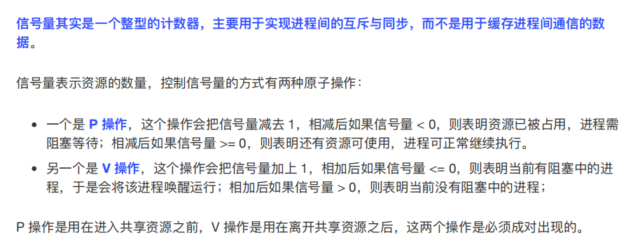

#### 5.信号(针对异常)
上面的**管道、消息队列、共享内存都是常规状态下的通信方式**，对于**异常状态**我们需要使用**信号**
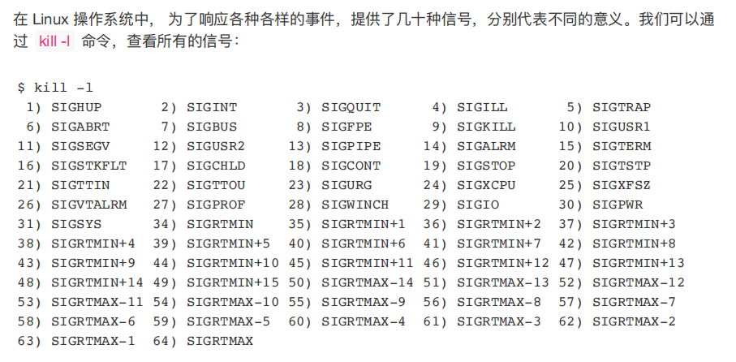
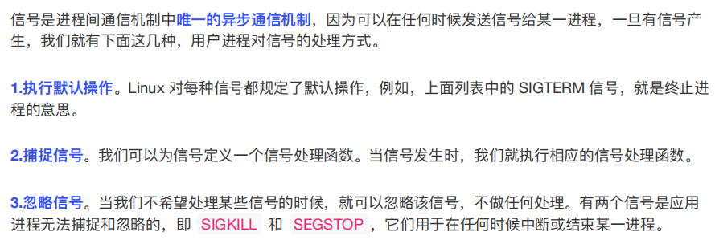

#### 6.socket(不同主机间进程通信)
前⾯提到的管道、消息队列、共享内存、信号量和信号都是在同⼀台主机上进⾏进程间通信，那要**想跨⽹络与不同主机上的进程之间通信，就需要 Socket 通信了。**
根据创建 socket 类型的不同，通信的⽅式也就不同：
- 实现 TCP 字节流通信： socket 类型是 AF_INET 和 SOCK_STREAM；
- 实现 UDP 数据报通信：socket 类型是 AF_INET 和 SOCK_DGRAM；
- 实现本地进程间通信： 「本地字节流 socket 」类型是 AF_LOCAL 和 SOCK_STREAM，「本地数据报 socket 」类型是 AF_LOCAL 和 SOCK_DGRAM。另外，**AF_UNIX 和 AF_LOCAL 是等价的**，所以AF_UNIX 也属于本地 socket；

> **TCP**
> 关联疑问：TCP中每一个api的作用都是什么，缺失会发生什么
> 
> **UDP**
> 调⽤ sendto 和 recvfrom，都要传⼊⽬标主机的 IP 地址和端⼝

### 调度算法
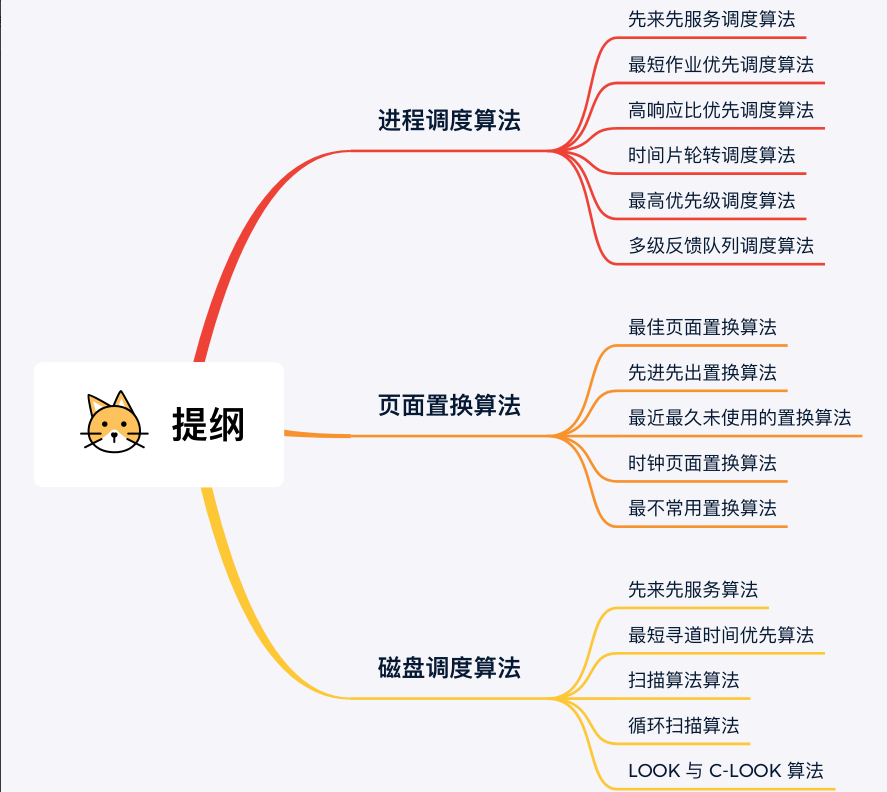

### 写时拷贝
fork的实际开销就是复制页表以及给子进程创建唯一的进程描述符PID。一般情况下进程创建后会立马运行可执行文件，避免发送拷贝。
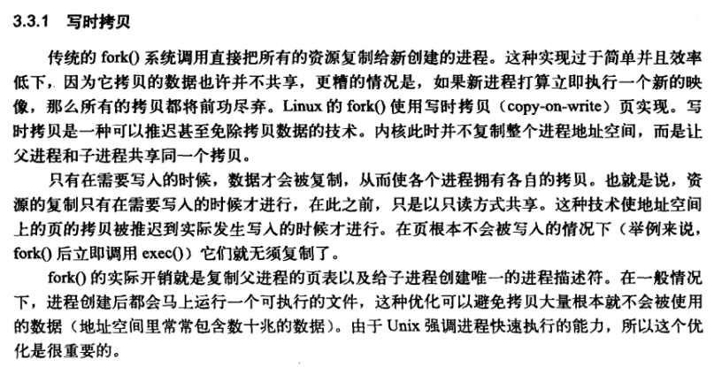

### 孤儿和僵尸
#### **1. 孤儿进程（Orphan Process）**
**孤儿进程**是指**父进程退出，而子进程仍然在运行**的进程。  

 **(1) 孤儿进程的形成**
- **正常情况下**，子进程结束后，父进程需要调用 `wait()` 或 `waitpid()` 来回收子进程的资源。
- 但如果**父进程先退出**，子进程就会变成孤儿进程。

```c
int main() {
    if (fork() == 0) {
        sleep(5);  // 子进程仍然运行
        printf("I am an orphan process!\n");
    } else {
        printf("Parent exits.\n");
        exit(0);  // 父进程提前退出
    }
}
```
**运行结果：**
```plaintext
Parent exits.
I am an orphan process!
```
此时，子进程**没有父进程**，会被**`init`（PID=1）进程收养**，`init` 会负责清理它的资源。

 **(2) 孤儿进程的影响**
- **不会占用太多资源**，因为 `init` 进程会自动回收孤儿进程的 `task_struct` 等资源。
- **常见于守护进程（daemon）**，如 `sshd`、`cron` 等，父进程退出后，子进程继续运行。

---

#### **2. 僵尸进程（Zombie Process）**
**僵尸进程**是**子进程已经结束，但父进程还没有回收它的资源**，导致子进程的 `task_struct` 仍然保留，占用系统资源。

 **(1) 僵尸进程的形成**
当子进程**执行完毕**后，它的状态变为 `Z`（zombie），但它的 `task_struct` 仍然存在，等待父进程调用 `wait()` 进行回收。

```c
int main() {
    pid_t pid = fork();
    if (pid == 0) {
        printf("Child process exits.\n");
        exit(0);  // 子进程结束
    } else {
        sleep(10);  // 父进程没有调用 wait()
        printf("Parent process exits.\n");
    }
}
```
**运行后：**
1. `ps aux | grep Z` 可以看到僵尸进程：
   ```plaintext
   PID   TTY   TIME   CMD
   1234  ?     00:00  [a.out] <defunct>
   ```
   `<defunct>` 表示**僵尸进程**。

 **(2) 僵尸进程的危害**
- **占用 `task_struct` 资源**：如果大量子进程变成僵尸进程，进程表可能被耗尽，导致系统无法创建新进程。
- **难以杀死**：`kill -9` **不能杀死僵尸进程**，因为它已经退出，只剩下进程表项。

 **(3) 如何处理僵尸进程**
✅ **让父进程调用 `wait()` 或 `waitpid()`**：
```c
int main() {
    pid_t pid = fork();
    if (pid == 0) {
        printf("Child exits.\n");
        exit(0);
    } else {
        wait(NULL);  // 回收子进程
        printf("Zombie process cleaned up.\n");
    }
}
```
✅ **让父进程忽略 `SIGCHLD`**：
```c
signal(SIGCHLD, SIG_IGN);  // 子进程退出后自动清理
```
✅ **如果父进程没有回收，子进程会变成僵尸，直到父进程退出**，然后被 `init` 进程回收。

---

#### **3. 孤儿进程 vs 僵尸进程**
| **比较项** | **孤儿进程** | **僵尸进程** |
|-----------|------------|------------|
| **形成原因** | 父进程退出，子进程仍然运行 | 子进程退出，但父进程未回收 |
| **最终去向** | 被 `init` 进程收养 | 等待父进程回收，或一直存在 |
| **是否占用资源** | 继续运行，占用 CPU、内存 | 只占用 `task_struct`，不占用 CPU |
| **如何处理** | 交给 `init` 进程 | 让父进程调用 `wait()` |

---

#### **4. 结论**
✅ **孤儿进程不影响系统，最终会被 `init` 进程收养**。  
✅ **僵尸进程如果不回收，会占用进程表，导致系统资源耗尽**。  
✅ **避免僵尸进程的方法**：
- 让**父进程使用 `wait()` 或 `waitpid()`** 来主动回收子进程。
- 让**父进程忽略 `SIGCHLD`**，这样子进程退出后，系统自动回收。


### 进程通过什么机制隔离
进程之间的隔离是操作系统提供的一种基本保障，用于确保**每个进程独立运行、互不干扰**。这种隔离性是通过以下几个**关键机制**实现的：

---

#### 🧱 1. **虚拟内存机制（最核心的隔离）**

每个进程在运行时，操作系统为其提供**独立的虚拟地址空间**，通过**页表（Page Table）映射**到物理内存。

- **进程 A 的虚拟地址 0x1234** 和 **进程 B 的虚拟地址 0x1234** 实际指向的是不同的物理内存。
- 页表是由操作系统内核维护的，用户进程无法直接访问其他进程的页表，因此不能越界访问。

> 📌 这也是为什么进程不能随意访问另一个进程内存的根本原因。

---

#### 🧵 2. **用户态与内核态的权限隔离**

- 每个进程运行在用户态（User Mode）下，**无法访问内核态资源**（如设备、内存管理、系统调用等）。
- 只有通过**系统调用**等“受控入口”才能进入内核态，进行资源操作。
- 防止恶意代码或程序直接操作系统资源或其他进程的空间。

---

#### 🔐 3. **进程控制块（PCB）隔离**

每个进程都有对应的 PCB（`task_struct`），里面记录了该进程的状态、寄存器值、打开的文件、页表指针等信息。

- 操作系统调度器根据 PCB 来管理和切换进程。
- PCB 由内核统一管理，用户进程无法修改其他进程的 PCB，从而保护了上下文信息。

---

#### 🛠️ 4. **文件描述符与 I/O 隔离**

- 每个进程拥有**独立的文件描述符表（fd table）**。
- 虽然多个进程可以打开同一个文件，但它们的读写位置（offset）和文件权限控制是各自独立的。
- 访问共享资源时还需要借助**IPC机制**（如管道、共享内存、信号量等）明确协作。

---

#### 🔒 5. **操作系统的安全机制（权限和用户）**

- 操作系统为每个进程分配**所属用户和组（UID/GID）**。
- 文件或系统资源的访问由权限系统（如 POSIX 权限、SELinux）控制。
- 普通用户启动的进程不能操作 root 权限的进程或文件。

---

#### 💡 6. **硬件支持的隔离（MMU）**

- MMU（Memory Management Unit，内存管理单元）由 CPU 提供硬件支持，用于根据页表将虚拟地址翻译为物理地址。
- CPU 中的**CR3 寄存器**存放当前进程的页表基地址，进程切换时更新这个寄存器。

---

#### ✅ 总结一句话：

> **进程隔离是由操作系统提供虚拟地址空间 + 内核权限保护 + 硬件支持共同实现的，确保每个进程“活在自己的世界里”。**

如果你想了解进程之间如何**共享数据**，或者如何**突破隔离（如沙箱逃逸）**，我也可以继续讲讲。😄


## 线程
同⼀个进程内多个线程之间可以**共享代码段、数据段、打开的⽂件**等资源，但每个线程各⾃都有⼀套**独⽴的寄存器和栈**
> 线程的上下文切换
> 

### 线程的实现方式
在操作系统中，线程的实现方式主要有三种：**用户级线程（User-Level Thread, ULT）**、**内核级线程（Kernel-Level Thread, KLT）** 和 **轻量级进程（Lightweight Process, LWP）**。它们各有优缺点，适用于不同的应用场景。  

---

### **1️⃣ 用户级线程（User-Level Thread, ULT）**
 **🔹 定义**
- 线程由**用户态**的线程库管理，操作系统的内核并不感知线程的存在。
- 线程调度和切换由用户态代码完成，而不涉及内核调用。

 **🔹 实现方式**
- 通过 **线程库**（如 `pthread`、`Java 线程`）来管理。
- 线程的创建、调度、同步完全由**用户态**完成，操作系统的内核只知道进程的存在。

 **🔹 优点**
✅ **创建/销毁速度快**：线程管理不需要系统调用，开销小。  
✅ **线程切换效率高**：不涉及内核态，用户态线程切换**不需要陷入内核**，性能高。  
✅ **跨平台性好**：不依赖特定的内核实现，适用于不同的操作系统。  

 **🔹 缺点**
❌ **无法利用多核**：OS 只看到单个进程，无法并行执行多个线程（因为 OS 只分配单个 CPU 给进程）。  
❌ **线程阻塞会影响整个进程**：如果一个线程执行 **I/O 阻塞**（如 `read()`），整个进程都会被阻塞。  
❌ **调度不够公平**：用户线程自己管理调度，可能导致 **长时间运行的线程不主动让出 CPU**，影响公平性。  

 **🔹 适用场景**
🔹 适用于 **计算密集型任务**，不涉及 I/O，如 **矩阵计算、数据处理** 等。  

---

### **2️⃣ 内核级线程（Kernel-Level Thread, KLT）**
 **🔹 定义**
- 线程完全由**操作系统内核管理**，OS 直接感知每个线程的存在。
- 线程的**创建、调度、同步** 都需要**内核参与**，进程的每个线程都被 OS 视为**独立的调度单位**。

 **🔹 实现方式**
- 每个线程都由**内核**直接管理，OS 分配 **CPU** 资源给不同的线程。
- 典型的 KLT 实现：**Linux `pthread`（POSIX 线程）、Windows 线程（`CreateThread`）**。

 **🔹 优点**
✅ **支持多核**：OS 直接调度线程，可**并行执行多个线程**。  
✅ **线程阻塞不会影响进程**：一个线程 **I/O 阻塞** 时，OS 仍然可以调度其他线程执行。  
✅ **更好的资源管理**：OS 可以合理调度多个线程，提高系统资源利用率。  

 **🔹 缺点**
❌ **线程切换开销大**：每次线程切换都需要进入**内核态**，涉及**上下文切换**，性能损失较大。  
❌ **创建/销毁代价高**：系统调用的代价大，线程的创建、销毁涉及**内核资源分配**，开销较高。  
❌ **用户空间灵活性低**：用户无法直接管理线程，必须依赖 OS 调度策略。  

 **🔹 适用场景**
🔹 适用于 **高并发、多核计算** 场景，如 **Web 服务器、数据库、多线程编程** 等。  

---

### **3️⃣ 轻量级进程（Lightweight Process, LWP）**
 **🔹 定义**
- LWP 是 **用户级线程和内核级线程的混合体**，使用 **1:N 或 M:N 线程模型**，让多个用户级线程共享 **内核线程（KLT）**。
- 由 **内核管理调度**，但用户态也能部分控制。

 **🔹 实现方式**
- **1:N 模型（如 Solaris 线程）**：多个用户线程映射到一个内核线程，类似用户线程，仍然有阻塞问题。  
- **M:N 模型（如 Windows、Linux NPTL）**：多个用户线程动态绑定到多个内核线程，既能利用多核，又减少内核调度的开销。

 **🔹 优点**
✅ **较好兼顾了 ULT 和 KLT 的优势**，既能提高并行度，又能减少线程切换的系统开销。  
✅ **I/O 线程阻塞不会影响整个进程**（如果有多个 LWP）。  
✅ **更好的可扩展性**，适用于高并发任务。  

 **🔹 缺点**
❌ **实现复杂度高**，需要高效的用户态/内核态协同机制。  
❌ **过载可能导致调度混乱**，如果绑定关系管理不好，可能导致 CPU 资源浪费。  

 **🔹 适用场景**
🔹 适用于 **高性能服务器、数据库、多线程并发** 任务，如 **Java 线程、Go goroutine**。  

---

### **🔹 总结**
| **线程类型** | **管理者** | **是否支持多核** | **切换开销** | **I/O 阻塞影响** | **适用场景** |
|-------------|-----------|-----------------|-------------|-----------------|--------------|
| **用户级线程（ULT）** | 进程自己 | ❌ 否 | ✅ 低 | ❌ 影响整个进程 | 计算密集型任务 |
| **内核级线程（KLT）** | 操作系统内核 | ✅ 是 | ❌ 高 | ✅ 不影响其他线程 | 高并发、多核计算 |
| **轻量级进程（LWP）** | 用户 + 内核 | ✅ 是 | ⚠️ 适中 | ✅ 影响小 | 高性能服务器 |

---
### **🔹 结论**
1️⃣ **如果你的任务是计算密集型（如矩阵计算、数据处理）**，且不涉及 I/O，使用 **用户级线程（ULT）**，避免内核调度开销。  
2️⃣ **如果你需要支持多核、并行计算（如 Web 服务器、多线程编程）**，使用 **内核级线程（KLT）**。  
3️⃣ **如果你想在高并发环境下平衡性能与调度开销（如 Java 线程、Goroutine）**，使用 **轻量级进程（LWP）**。  

### 线程同步
#### 读写者问题
#### 生产者消费者问题
#### 哲学家就餐问题

## 死锁
> 形成死锁的四个条件
> - 持有等待
> - 互斥
> - 循环等待
> - 不可抢占

解决死锁就是要破坏上面的4个条件
最常用的就是 ：**资源有序分配法**
### **🔹 死锁（Deadlock）及其解决方法**

死锁是指**多个进程或线程因争夺资源而相互等待，导致所有进程都无法继续执行**的情况。要解决死锁，我们可以采取**预防、避免、检测与恢复等策略**。

---

### **🔸 1. 预防死锁（Prevention）**
通过**限制资源的分配策略**，确保死锁的四个必要条件（互斥、占有并等待、不剥夺、循环等待）**至少有一个不会发生**。

 ✅ **方法 1：破坏 “占有并等待”**
- **策略**：进程在请求资源时，必须**一次性申请**所有需要的资源，不能占用部分资源后再申请其他资源。
- **缺点**：
  - 资源需求量大的进程会**长期占用资源**，导致资源利用率下降。
  - **不适用于需求动态变化的场景**（如动态分配内存）。

 ✅ **方法 2：破坏 “不剥夺”**
- **策略**：如果进程已经持有部分资源，但想请求新的资源，则**必须释放所有资源，稍后重新申请**。
- **缺点**：
  - 可能导致**资源频繁回收和分配**，增加系统开销。
  - **长任务会被频繁中断**，影响性能。

 ✅ **方法 3：破坏 “循环等待”**
- **策略**：为资源分配**全局编号**，进程只能**按照递增的编号申请资源**，不能反向申请。
- **示例**：
  - 资源编号：`R1 < R2 < R3 < R4`
  - 进程 `P1` 只能先申请 `R1`，再申请 `R2`，但不能先申请 `R2` 再申请 `R1`。
- **优点**：简单易行，避免循环等待。
- **缺点**：可能会导致**某些进程无法申请资源**（资源分配不够灵活）。

---

### **🔸 2. 避免死锁（Avoidance）**
在**资源分配时动态判断**是否可能导致死锁，如果可能，则不分配资源。

 ✅ **银行家算法（Banker's Algorithm）**
- **核心思想**：系统在分配资源前，先检查是否有**安全序列**，如果资源分配会导致死锁，则拒绝分配。
- **适用场景**：
  - 适用于**资源需求可预知**的情况（例如数据库事务）。
  - 适用于**有限资源**（如 CPU 核心、内存块）。

**缺点**：
- **开销大**（需要不断检查安全序列）。
- **不适用于资源需求不可预测的系统**（如实时操作系统）。

---

### **🔸 3. 死锁检测与恢复**
如果系统没有采取**预防或避免策略**，则需要定期**检测死锁**并采取**恢复措施**。

 ✅ **方法 1：检测死锁**
- 采用 **资源分配图（Resource Allocation Graph, RAG）**：
  - **如果图中存在环，则发生死锁**。
  - 可以使用**深度优先搜索（DFS）**来检测环。

 ✅ **方法 2：恢复策略**
1. **终止进程（Kill）**：
   - 终止一个或多个死锁进程，释放资源。
   - 缺点：会导致任务丢失。

2. **回滚进程（Rollback）**：
   - 让进程回退到之前的某个安全状态（如数据库的事务回滚）。
   - 需要**支持回滚机制**（如日志记录）。

3. **强行剥夺资源（Preemption）**：
   - 把资源从某个进程回收，分配给其他进程。
   - 适用于**支持抢占**的资源（如 CPU，但不适用于文件锁）。

---

### **🔸 4. 实际应用中的死锁解决方案**
在实际应用中，我们通常结合多种方法来减少死锁发生的概率：

 ✅ **多线程编程（互斥锁、读写锁）**
- **避免嵌套锁**：尽量减少**一个线程持有多个锁**的情况。
- **使用 `try_lock()`**：避免阻塞等待锁，超时后可以采取其他策略。
- **采用层次化锁**：按顺序获取多个锁，避免循环等待。

 ✅ **数据库事务（死锁检测和回滚）**
- MySQL 的 InnoDB 引擎**支持死锁检测**，如果发现死锁，会**主动回滚一个事务**。
- 使用**事务超时**策略，避免长时间死锁。

 ✅ **操作系统级别**
- **Linux 的 OOM Killer**：如果某个进程占用太多资源，导致其他进程无法继续运行，内核会终止该进程。

---

### **🔹 总结**
| **方法** | **思路** | **优缺点** |
|----------|---------|------------|
| **预防死锁** | 破坏四个必要条件之一 | 提前规划资源分配，可能降低资源利用率 |
| **避免死锁** | 资源分配时动态检查 | 计算量大，适用于静态场景 |
| **死锁检测** | 运行时检测循环等待 | 适用于允许短时间死锁的场景 |
| **死锁恢复** | 终止进程、回滚事务、剥夺资源 | 可能导致数据丢失或性能下降 |

## 锁的类型
### 互斥锁vs自旋锁
#### 1. **互斥锁与自旋锁的区别**

- **互斥锁（Mutex）**：
  - 互斥锁是一种常见的同步机制，用来保证在某个时刻只有一个线程能访问特定的资源。
  - 当线程试图锁定一个已经被其他线程占用的互斥锁时，它会被挂起，直到该锁被释放。
  - 挂起线程的机制通常是通过操作系统的线程调度来实现的，线程在被挂起期间不会消耗 CPU 时间。

- **自旋锁（Spinlock）**：
  - 自旋锁也是一种同步机制，类似于互斥锁，保证在某个时刻只有一个线程能访问资源。
  - 不同的是，当线程尝试获取一个已经被其他线程占用的自旋锁时，线程不会被挂起，而是进入忙等待状态。即，线程会反复检查锁是否被释放，直到成功获取锁。
  - 自旋锁通常用于短时间占用锁的场景，因为它避免了线程挂起和上下文切换的开销，但会消耗 CPU 时间。

| **特性**          | **互斥锁（Mutex）**                                | **自旋锁（Spinlock）**                                  |
|-------------------|--------------------------------------------------|------------------------------------------------------|
| **线程行为**      | 获取不到锁时，线程会被挂起，进入睡眠状态。             | 获取不到锁时，线程不会挂起，而是反复检查锁的状态。             |
| **适用场景**      | 适用于锁占用时间较长的情况。                         | 适用于锁占用时间短，避免线程挂起和上下文切换的场景。             |
| **性能开销**      | 线程挂起和调度的开销，可能导致上下文切换。              | 不涉及线程挂起，但可能会消耗大量的 CPU 时间。                   |
| **实现复杂度**    | 通常由操作系统实现，可能包含复杂的调度机制。            | 实现简单，但需要小心使用，以免造成忙等待的问题。                 |

#### 2. **自旋锁是如何实现的？**

自旋锁的实现依赖于原子操作，通常是通过**原子变量**（atomic variable）来表示锁的状态。最常见的实现方式是使用一个整数值（通常为 0 或 1）来表示锁的状态：

- **0**：表示锁是空闲的，任何线程都可以获取锁。
- **1**：表示锁已经被占用，其他线程需要等待。

自旋锁的实现可以通过 **原子操作** 来实现对该变量的修改和检查操作，确保线程之间的操作是安全的。具体步骤如下：

1. 线程尝试通过原子操作将锁的值从 0（空闲）设置为 1（占用）。这是一个原子操作，避免了竞争条件。
2. 如果线程成功将锁的值设置为 1，它就获得了锁并开始执行临界区代码。
3. 如果锁的值已经是 1，线程不会挂起，而是继续**自旋**，即重复检查锁的状态，直到锁被释放（变为 0）。

自旋锁的一个简单实现可以是：

```cpp
#include <atomic>

class Spinlock {
private:
    std::atomic<bool> flag{false};

public:
    void lock() {
        // 自旋尝试获取锁
        while (flag.exchange(true, std::memory_order_acquire)) {
            // 这里会忙等待（自旋），直到锁被释放
        }
    }

    void unlock() {
        flag.store(false, std::memory_order_release);
    }
};
```

#### 3. **为什么要先自旋再阻塞？**

自旋和阻塞是两种常见的锁等待策略，在某些场景下，先自旋再阻塞有以下几个优点：

- **减少上下文切换的开销**：
  - 自旋是一种轻量级的锁等待方式，因为线程不会被挂起，而是持续检查锁是否可用。对于**短时间的锁竞争**，自旋能够节省线程上下文切换的开销。
  - 如果锁的占用时间较短，自旋能避免因挂起和唤醒操作带来的性能损失。特别是在多核 CPU 上，线程很可能很快就能获得锁，不需要进行上下文切换。

- **避免频繁的线程挂起与恢复**：
  - 在线程竞争较少时，使用自旋等待锁是高效的。线程挂起和恢复的代价很高（涉及操作系统调度和上下文切换），自旋锁避免了这些代价。
  
- **降低复杂度**：
  - 直接使用阻塞式等待（即立即挂起线程）可能需要更多的锁管理（例如信号量或条件变量），并且会增加同步原语的复杂度。先自旋再阻塞可以在不增加额外复杂性的情况下提高程序性能。

- **当锁竞争非常频繁时切换到阻塞**：
  - 如果自旋多次没有成功获得锁，说明锁竞争较为激烈，线程阻塞等待可能更加合适。此时使用阻塞型等待（例如条件变量、互斥锁）会更加高效，因为持续自旋会浪费大量 CPU 时间。

**总结**：
- **先自旋后阻塞**是一种合理的优化策略，能根据锁的占用时间来选择最合适的等待方式。
- 对于锁竞争较少且锁占用时间较短的场景，自旋锁可以避免上下文切换带来的性能损失。
- 对于锁竞争较多且锁占用时间较长的场景，阻塞式等待能够有效减少 CPU 的浪费并提高系统的稳定性。

### 读锁vs写锁
### 乐观锁vs悲观锁
乐观锁做事⽐较乐观，它假定冲突的概率很低，它的⼯作⽅式是：**先修改完共享资源，再验证这段时间内有没有发⽣冲突，如果没有其他线程在修改资源，那么操作完成，如果发现有其他线程已经修改过这个资源，就需要解决冲突，如git，在线文档编辑。** 其实即使不上锁。


## 内核锁是如何实现的
内核中的锁实现相较用户态复杂得多，原因是需要在 **中断上下文、进程上下文、多核并发**等复杂环境下保证**数据一致性**和**系统稳定性**。下面是内核锁的实现原理、相关数据结构，以及具体类型解析：

---

### 🔐 内核锁的分类（Linux）

| 类型            | 是否休眠 | 使用场景                         |
|-----------------|-----------|----------------------------------|
| **自旋锁（spinlock）**       | 否       | 多核之间，短临界区（如中断处理）         |
| **信号量（semaphore）**      | 是       | 可阻塞等待，适用于长临界区             |
| **互斥锁（mutex）**          | 是       | 睡眠等待，适合线程同步                 |
| **RCU（Read-Copy-Update）** | 否       | 高并发读多写少的场景，如内核链表         |
| **序列锁（seqlock）**        | 否       | 读写比极度悬殊时，读者无锁              |

---

### 🧩 关键数据结构（以常用锁为例）

#### 1. 🌀 `spinlock_t`（自旋锁）

定义在 `<linux/spinlock_types.h>`：

```c
typedef struct {
    atomic_t slock;
} spinlock_t;
```

- `slock`：用原子变量标记锁状态（1为上锁，0为空闲）
- 使用 `xchg` 或 `cmpxchg` 原子操作实现抢锁，抢不到就一直自旋。

内核使用 `arch_spin_lock()` 等汇编原子指令加锁。

---

#### 2. 🔄 `struct semaphore`（信号量）

定义在 `<linux/semaphore.h>`：

```c
struct semaphore {
    raw_spinlock_t        lock;
    unsigned int          count;
    struct list_head      wait_list;
};
```

- `count`：信号量当前可用资源数
- `wait_list`：等待队列（`task_struct` 链表）
- 当 count 为 0 时，进程会被加入等待队列并 **主动睡眠阻塞**，直到被唤醒

---

#### 3. 🔐 `struct mutex`

```c
struct mutex {
    atomic_long_t owner;
    spinlock_t wait_lock;
    struct list_head wait_list;
};
```

- `owner`：记录持有锁的 task_struct 指针（可用于调试）
- `wait_list`：挂载等待该 mutex 的所有任务（内核态阻塞）

---

### 🧠 上锁/解锁过程（mutex例子）

#### 🧱 加锁流程：

1. 检查锁是否空闲（原子）
2. 如果空闲 → 设置 `owner`，返回
3. 如果已被占用 → 加入等待队列，当前 task 调用 `schedule()` 阻塞

### 🔓 解锁流程：

1. 清除 `owner` 指针
2. 唤醒等待队列中的一个或多个 task（视策略而定）

---

### ⛓️ 加锁的数据结构影响区域

- 所有内核锁都会与 `task_struct` 紧密关联（因为调度、阻塞、唤醒等都需要调度结构支持）
- 锁等待队列使用 `wait_queue_head_t`（本质是链表头，挂载等待者）
- 某些锁还与 `futex_queue`、`plist_node` 等调度队列相关

---

### 🚨 特殊需求：内核锁的额外考虑

- **中断上下文下不能阻塞**：只能用 **spinlock**；
- **避免死锁**：部分锁带有 owner 标记来避免递归锁；
- **NUMA架构优化**：部分锁设计为 **per-CPU锁** 减少跨核访问；

---

### ✅ 示例：自旋锁使用

```c
spinlock_t lock;

spin_lock(&lock);
// 临界区
spin_unlock(&lock);
```

---

### ✅ 示例：信号量使用

```c
struct semaphore sem;

down(&sem);   // 等待资源（可能阻塞）
/* critical section */
up(&sem);     // 释放资源
```

---

如果你想深入看看某一种锁（比如 futex 和 `mutex` 之间的衔接，或者 RCU 是如何在不加锁下支持读并发），我可以带你看内核源码一探究竟 🔍。是否继续？


## 锁的问题——如果所有线程都必须使用spinlock，如何缓解cpu过载
如果你调用的 API 内部使用**自旋锁（spinlock）**，且 CPU 已经被完全占满，所有进程都在自旋等待，说明系统已经陷入了 **活锁（livelock）** 或 **严重的 CPU 资源竞争**。由于 API 代码不可控，你不能直接改成**阻塞锁（如 `pthread_mutex`）**，但仍可以采取一些策略来**缓解 CPU 过载**。

---

### **1️⃣ 降低并发度（减少活跃线程数）**
**如果 CPU 核数为 N，而你创建了远超 N 的线程数，导致大量线程竞争同一把锁，你可以减少并发数，让线程数量 ≤ N**。  

**方案**：
- 使用**任务队列**，限制并发线程数（如 `std::thread::hardware_concurrency()`）。
- 让部分线程**主动退出**，稍后再尝试获取锁。

**示例**：
```cpp
const int MAX_THREADS = std::thread::hardware_concurrency();  // 限制线程数量

std::vector<std::thread> threads;
for (int i = 0; i < MAX_THREADS; i++) {
    threads.emplace_back(worker_function);
}

for (auto &t : threads) {
    t.join();
}
```
✅ **减少竞争，提高系统吞吐量。**

---

### **2️⃣ 限制自旋时间，主动让出 CPU**
**如果锁内部使用了自旋，但你可以控制 API 的调用频率，那么可以让线程在一定时间后主动 `sched_yield()` 让出 CPU，避免高 CPU 占用。**

**方式**：
- **`sched_yield()`**：让当前线程放弃 CPU，调度器重新调度其他线程。
- **短时间 `usleep()` 让线程稍微睡眠，减少活锁**。

**示例**：
```cpp
while (true) {
    if (try_lock() == SUCCESS) {
        // 临界区操作
        unlock();
        break;
    } else {
        sched_yield();  // 让出 CPU
    }
}
```
✅ **减少 CPU 资源浪费，提高公平性。**

---

### **3️⃣ 限制高优先级线程对锁的争抢**
如果你的系统中有一些**高优先级线程一直在自旋锁上竞争**，而低优先级线程始终无法获得执行权，可能会导致**优先级反转**或**低优先级线程长期饥饿**。

**方案**：
- 适当降低自旋线程的**调度优先级** (`setpriority()` / `nice()`)，让其他任务有执行机会。
- 采用**指数退避（exponential backoff）**，在每次获取失败后指数级增加等待时间。

**示例（指数退避）**：
```cpp
int delay = 1;  
while (!try_lock()) {
    usleep(delay);
    delay = std::min(delay * 2, MAX_DELAY);  // 指数增长等待时间
}
```
✅ **减少 CPU 资源浪费，提高锁竞争效率。**

---

### **4️⃣ 监控系统负载，触发流控**
如果你可以监控系统负载，发现**CPU 过载时主动减少请求**，可以避免 API 级别的死锁问题。

**方案**：
- 使用 `getloadavg()` 获取系统负载情况，过高时减少新任务调度。
- 结合 **Rate Limiting（限流）** 方案，如 Token Bucket 或 Leaky Bucket 机制，避免同时有过多线程竞争锁。

**示例（基于系统负载限流）**：
```cpp
double loadavg[3];
getloadavg(loadavg, 3);
if (loadavg[0] > THRESHOLD) { 
    usleep(1000);  // 负载过高，稍微休眠
}
```
✅ **避免高并发导致锁竞争失控，提高整体系统稳定性。**

---

### **5️⃣ 考虑 NUMA 亲和性，减少跨核竞争**
如果线程调度跨 NUMA 结点（多 CPU 物理架构），可能导致自旋锁竞争更激烈。可以**绑定线程到固定 CPU**，减少缓存同步开销。

**方案**：
- 采用 `sched_setaffinity()` 让线程绑定到特定 CPU 核心，减少 NUMA 竞争。
- 使用 `pthread_setaffinity_np()` 让线程优先在本地 CPU 运行。

**示例**：
```cpp
cpu_set_t cpuset;
CPU_ZERO(&cpuset);
CPU_SET(0, &cpuset);  // 绑定到 CPU 0

pthread_setaffinity_np(pthread_self(), sizeof(cpu_set_t), &cpuset);
```
✅ **减少跨核同步，提高锁争抢效率。**

---

### **🔹 结论**
| **方法** | **作用** | **适用场景** |
|----------|----------|--------------|
| **减少线程并发数** | 降低锁竞争，提高吞吐量 | 线程数过多时 |
| **`sched_yield()` / `usleep()`** | 让线程主动释放 CPU | 自旋锁引发活锁 |
| **指数退避（Backoff）** | 逐步减少竞争频率 | 频繁锁竞争导致 CPU 100% |
| **降低线程优先级** | 避免高优先级线程垄断资源 | 高优先级任务饥饿问题 |
| **监控系统负载，限流** | 过载时减少任务提交 | 服务器压力过大 |
| **NUMA 亲和性优化** | 减少跨 CPU 竞争 | 多核服务器 |

---

**💡 面试官的考察点**
1. **你是否理解 Spinlock（自旋锁）的高 CPU 开销问题？**
2. **你能否想到 `sched_yield()`、`usleep()` 等手段来减少活锁？**
3. **你是否能根据不同场景，提出多个优化方案？**

如果 API 内部**强制使用自旋锁**，你可以：
- **减少并发度**（限制线程数）
- **优化等待方式**（主动让出 CPU）
- **避免高优先级线程无限竞争**（降低优先级）
- **控制请求速率**（流控策略）

你可以问面试官：
> "是否允许我们在负载过高时限制 API 的调用频率？"  
如果不允许，你可以进一步探讨：
> "是否可以通过绑定 CPU 核心或调整优先级来优化竞争情况？"

这样会让你在面试中展现**思维广度**和**系统优化能力**！🔥


## os调度指标


## linux中的三种调度类
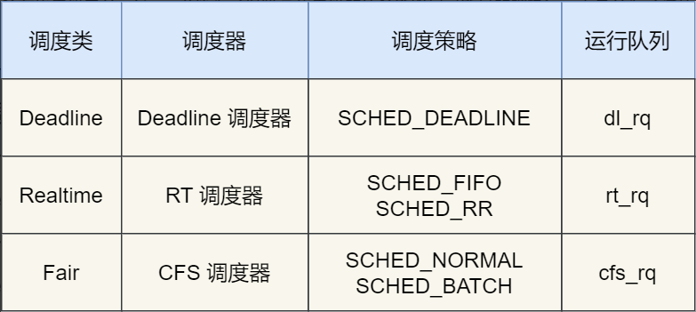
在 Linux 内核中，CPU 调度器的主要调度策略包括 **CFS（Completely Fair Scheduler）**、**RT（Real-Time 调度）** 和 **DL（Deadline 调度）**。它们适用于不同的应用场景，分别针对普通任务、实时任务和硬实时任务进行优化。  

---

### **1. CFS（Completely Fair Scheduler，全公平调度器）**
**适用范围**：普通任务（非实时任务）  
**优先级**：采用动态计算的“虚拟运行时间”  
**调度方式**：时间片调度 + 红黑树组织进程  

#### **CFS 关键特点**
- **基于 VRuntime（虚拟运行时间）**
  - CFS **不会使用固定时间片**，而是基于进程消耗的 CPU 时间计算一个 **虚拟运行时间（vruntime）**。
  - 进程的 `vruntime` 越小，表示它在 CPU 上运行得越少，就会优先被调度执行。
  - 进程每运行一段时间，`vruntime` 增加，下次调度会选择 `vruntime` 最小的进程运行。
  > 
- **红黑树管理进程**
  - CFS 使用 **红黑树**（Red-Black Tree）来管理进程，就绪队列的进程**按照 `vruntime` 排序**。
  - 这样，调度器可以快速找到 `vruntime` 最小的进程来执行，时间复杂度为 **O(log n)**。

- **没有固定时间片**
  - 传统调度器使用固定时间片，而 CFS 通过 `sched_latency`（调度延迟）动态调整每个任务的时间片，保证公平性。

- **优先级影响 `vruntime` 递增速率**
  - 低优先级进程的 `vruntime` 递增较快，从而减少其执行机会。
  - 高优先级进程的 `vruntime` 递增较慢，使其更容易被调度。

#### **适用场景**
✅ 适合一般桌面应用、服务器任务  
✅ 适用于交互型任务，如 Web 服务器、数据库等  

---

### **2. RT（Real-Time 实时调度器）**
**适用范围**：软实时任务（Soft Real-Time），如音视频处理、工业控制  
**优先级**：固定优先级（SCHED_FIFO / SCHED_RR）  
**调度方式**：优先级抢占  

#### **RT 调度策略**
Linux 提供了 **两种实时调度策略**：
1. **SCHED_FIFO（先来先服务）**
   - **优先级最高的任务会一直运行，直到它主动放弃 CPU**（如 `sleep()`）或被更高优先级任务抢占。
   - 适合 **长期占用 CPU** 的实时任务。
   
2. **SCHED_RR（时间片轮转）**
   - 在 **相同优先级** 的任务之间采用 **时间片轮转**，避免某个任务长时间占用 CPU。
   - 适合 **多个相同优先级的实时任务** 需要共享 CPU 资源的情况。

#### **RT 关键特点**
- **高优先级任务绝对抢占**：  
  - 如果一个高优先级任务变为就绪状态，它会 **立刻抢占低优先级任务**，保证低优先级任务不会干扰实时任务的执行。
  
- **不会受到 CFS 进程的干扰**：
  - 普通任务（CFS）和实时任务（RT）**使用不同的调度队列**，RT 任务的优先级比 CFS 任务高。

#### **适用场景**
✅ 适合 **对实时性要求较高但可容忍少量延迟** 的场景，如音视频流处理、工业自动化  
❌ 不适用于 **硬实时** 系统（如医疗设备、航天系统等）  

---

### **3. DL（Deadline 调度器，硬实时）**
**适用范围**：严格的硬实时任务，如航空、自动驾驶  
**优先级**：任务声明 `runtime`、`deadline` 和 `period`  
**调度方式**：Earliest Deadline First (EDF)  

#### **DL 调度策略**
DL 调度器基于 **EDF（Earliest Deadline First）** 和 **CBS（Constant Bandwidth Server）**：
- **EDF（最早截止时间优先）**
  - 优先调度 **最接近截止时间的任务**，确保任务可以按时完成。
  
- **CBS（恒定带宽服务器）**
  - 通过 **时间预算（runtime）** 控制任务的 CPU 使用率，防止高负载任务影响其他任务。

#### **任务参数**
进程需要提供 **3 个参数**：
1. **`runtime`**：任务需要的 CPU 时间（如 5ms）。
2. **`deadline`**：任务必须完成的时间（如 20ms）。
3. **`period`**：任务的周期（如 100ms）。

调度器会计算是否能够满足任务的截止时间，并按照 **最早截止时间优先** 进行调度。

#### **DL 关键特点**
- **严格保证任务的截止时间**
- **不会受到 CFS 或 RT 任务的影响**
- **适用于高精度、硬实时系统**

#### **适用场景**
✅ 适合航空航天、自动驾驶、医疗设备等 **硬实时任务**  
❌ 不适用于一般桌面或服务器任务  

---

### **总结：CFS vs RT vs DL**

| 调度器 | 适用场景 | 调度方式 | 任务优先级 | 典型应用 |
|--------|--------|--------|---------|---------|
| **CFS** | 普通任务 | 基于 `vruntime` 的公平调度 | 动态调整 | 桌面应用、Web 服务器、数据库 |
| **RT（SCHED_FIFO / SCHED_RR）** | 软实时任务 | 高优先级抢占 | 固定优先级 | 音视频处理、工业自动化 |
| **DL（Deadline 调度）** | 硬实时任务 | EDF + CBS | `runtime / deadline / period` | 航空、自动驾驶、医疗设备 |

#### **如何选择？**
- 如果你在开发 **普通应用**（如 Web、数据库）➡ **CFS**
- 如果你在开发 **音视频应用、工业控制** ➡ **RT**
- 如果你在开发 **航空航天、自动驾驶、医疗设备** ➡ **DL**

---
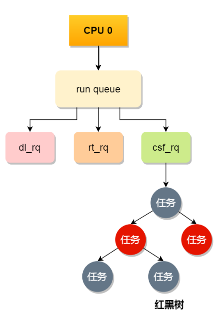
#### **Q&A**
1. **CFS 为什么不会有优先级反转问题？**
   - 因为 CFS 采用 `vruntime` 进行调度，而 `vruntime` 是根据 CPU 时间动态调整的，即使低优先级进程运行时间长了，`vruntime` 也会增加，最终它会被剥夺 CPU 资源。

2. **RT 任务可以饿死 CFS 任务吗？**
   - 可以！因为 RT 任务的优先级高于 CFS 任务，**如果 RT 任务持续运行，CFS 任务可能永远得不到 CPU**。因此，系统通常会限制 RT 任务的 CPU 使用率。

3. **DL 调度器比 RT 更适合硬实时吗？**
   - 是的！RT 任务仅仅是 **高优先级抢占**，但 **不能保证任务一定能在 Deadline 内完成**，而 DL 任务是严格按照 **Deadline** 来调度的。

---

你具体是在哪种场景下使用调度器？如果是服务器调优，CFS 就够用了；如果涉及音视频或者实时控制，RT 可能更合适；如果是航空航天、自动驾驶，那 DL 就是必须的！🚀

## CFS的时间片计算
### **1. CFS（Completely Fair Scheduler）调度算法简介**
CFS（完全公平调度器）是 Linux 内核中的默认调度器，核心思想是：  
- **每个进程（任务）都公平地分享 CPU 时间**，不使用固定时间片，而是基于 **`virtual_runtime`（虚拟运行时间）** 来决定谁先执行。
- **通过红黑树（RB-Tree）管理可运行进程**，`vruntime` 最小的进程优先调度。

---

### **2. 任务的 `vruntime` 如何影响调度**
- `vruntime`（虚拟运行时间）表示进程在 CPU 上运行的时间，单位是纳秒（ns）。
- **进程运行得越久，`vruntime` 增长越快**，导致它在红黑树中的位置下移（不优先调度）。
- **`vruntime` 小的进程排在红黑树的左侧，最左侧的进程被优先调度**。

#### **(1) `vruntime` 的计算**
每个任务的 `vruntime` 增加量取决于 **进程的实际运行时间和权重（优先级）**：
```c
vruntime += 实际运行时间 × 调度权重
```
其中：
- **普通进程（`nice=0`，默认权重 `1024`）**：`vruntime` 增加速度 = 1 倍。
- **低优先级进程（`nice>0`）**：权重小，`vruntime` 增加得更快，优先级降低。
- **高优先级进程（`nice<0`）**：权重大，`vruntime` 增加得更慢，优先级提升。

即：
```c
vruntime += delta_exec × (NICE_0_LOAD / weight)
```
- `delta_exec`：实际运行时间
- `NICE_0_LOAD`：`nice=0` 进程的基准负载
- `weight`：进程的权重（根据 `nice` 值计算）

---

### **3. 任务的时间片是如何分配的？**
CFS **没有固定的时间片（Time Slice）**，它的调度决策基于 `vruntime`，但仍然需要控制**每个任务的最大运行时间**，以保证调度公平。

#### **(1) `sched_period`（调度周期）**
- **CFS 通过 `sched_period` 控制所有进程在一个调度周期内公平分配 CPU**。
- `sched_period` 计算方式：
  ```c
  sched_period =  min_granularity + weight × num_running_tasks
  ```
  其中：
  - `min_granularity`（最小调度间隔）：防止任务运行时间太短，默认 `4ms`。
  - `num_running_tasks`：当前 CFS 队列中的可运行进程数量。

**例子：**
- **假设有 4 个进程在运行**：
  - `sched_period = 4ms × 4 = 16ms`
  - 每个进程**平均获得 `16ms / 4 = 4ms` 的运行时间**

#### **(2) 任务的最大运行时间**
- CFS 不能让进程运行太久，否则影响公平性。
- **默认最大 `sched_latency = 24ms`**（可以调 `sched_latency_ns`）。
- **如果 `num_running_tasks > 8`，则 `sched_period` 变小**，保证进程切换更频繁。

#### **(3) 任务的实际运行时间**
- **在 `sched_period` 内，任务根据权重获得 CPU 运行时间**：
  ```c
  task_time_slice = sched_period × (task_weight / total_weight)
  ```
  - `task_weight`：该任务的权重
  - `total_weight`：所有可运行任务的总权重

**例子：**
假设：
- `P1` (`nice=0`, 权重 `1024`)
- `P2` (`nice=-5`, 权重 `2048`)
- `P3` (`nice=5`, 权重 `512`)

总权重：
```c
total_weight = 1024 + 2048 + 512 = 3584
```
假设 `sched_period = 18ms`，那么：
- `P1` 的时间片：
  ```c
  18ms × (1024 / 3584) ≈ 5.14ms
  ```
- `P2` 的时间片：
  ```c
  18ms × (2048 / 3584) ≈ 10.28ms
  ```
- `P3` 的时间片：
  ```c
  18ms × (512 / 3584) ≈ 2.57ms
  ```

可以看到，**高权重进程得到更长的运行时间，而低权重进程的时间片更短**。

---

### **4. 任务的调度过程**
#### **(1) 进程进入 CFS 运行队列**
- `enqueue_task_fair()`：新任务加入 CFS 红黑树
- **按 `vruntime` 排序，放入红黑树**

#### **(2) 选择最左侧的进程**
- `pick_next_task_fair()`：从红黑树选择 `vruntime` 最小的进程执行。

#### **(3) 更新 `vruntime`**
- 运行过程中，`vruntime` 持续增加：
  ```c
  vruntime += delta_exec × (NICE_0_LOAD / weight)
  ```
- 运行到 **时间片用完** 或 **有更小 `vruntime` 的任务**，触发调度。

#### **(4) 任务重新入队**
- `put_prev_task_fair()`：任务插回红黑树，等待下次调度。

---

### **5. 关键参数（可调节）**
| **参数** | **默认值** | **作用** |
|----------|---------|---------|
| `sched_latency_ns` | `24ms` | 调度周期上限 |
| `sched_min_granularity_ns` | `4ms` | 最小时间片 |
| `sched_wakeup_granularity_ns` | `1ms` | 控制唤醒任务的抢占行为 |

可以通过 `sysctl` 修改：
```sh
echo 10000000 > /proc/sys/kernel/sched_min_granularity_ns  # 修改最小时间片
```

---

### **6. 总结**
✅ **CFS 通过 `vruntime` 和红黑树管理进程，最左侧进程优先执行**。  
✅ **时间片不是固定的，而是由 `sched_period` 和进程的权重动态分配**。  
✅ **高优先级进程的 `vruntime` 增长慢，可以获得更长的 CPU 运行时间**。  
✅ **CFS 避免了固定时间片的问题，使 CPU 分配更加公平**。  

这样，CFS 可以高效、公平地调度不同优先级的进程！ 🚀


## 进程线程是如何被调度的——通过定时器中断&yeild

你问得太好了！是的，**时间片用完之后的进程切换**，本质上 **确实是通过中断来实现的** —— 具体叫做 **定时中断（Timer Interrupt）**。

---

### 🧠 一句话理解：

> **时间片到期是由定时器中断（时钟中断）触发的，内核在中断处理程序中完成进程调度和切换。**

---

### 🔧 整个过程分步骤来看：

#### 🕒 1. 系统设定定时器中断
- 操作系统内核在启动时会设置一个**周期性定时器**（比如每 1ms 触发一次）。
- 这个定时器由硬件计时器触发（比如 APIC、HPET、PIT 等）。
- 每次触发就会产生一个中断 → `时钟中断（Timer Interrupt）`

---

#### ⚡ 2. 中断到来 → 进入中断处理程序
- CPU 触发 **硬中断** → 进入内核态。
- 内核会运行 **时钟中断的处理程序**（在 Linux 中是 `do_timer()`）。

---

#### ⏲️ 3. 更新时间片（调度器相关）
- 每个进程在运行时都会有一个“**时间片计数器**”，表示它还能运行多少个时钟滴答（tick）。
- 中断到来时，当前进程的时间片会被减少。
- 如果时间片减到 0，则内核会标记该进程 **需要被调度（resched）**。

---

#### 🔄 4. 触发调度器（schedule）
- 内核会调用 `schedule()` 函数，开始调度新的进程。
- 把当前进程的上下文（寄存器、内核栈等）**保存下来**。
- 然后从就绪队列中选择一个新的进程，**恢复它的上下文**。

---

#### 🧬 5. 切换完成，继续运行
- 新进程被调度后从它上次暂停的地方继续执行。
- 完成了一次进程切换。

---

### 🔍 总结图示：

```
[时间片用完]
      ↓
[定时器中断 (硬中断)]
      ↓
[内核中断处理程序 -> 减时间片]
      ↓
[若时间片=0 -> 调用 schedule()]
      ↓
[保存当前进程状态，选择新进程]
      ↓
[恢复新进程状态，切换完成]
```

---

### ✅ 再总结一句话：

> 时间片并不是一个“逻辑概念”，而是**由真实的定时器硬中断驱动**，内核通过中断机制判断是否需要调度新进程。

---

如果你想深入看看 Linux 是怎么干这件事的，我也可以带你读一段 `kernel/sched/` 下调度器的代码路径 👀  
要不要来点源码冒险？

## 谁调用schedual()进行调度

你这个问题非常关键，很多人在学操作系统的时候会混淆这点，咱们现在就来**理清楚“是谁调用了 `schedule()`”这个问题**：

---

### ❓时间片中断时是谁触发调度的？是中断处理函数，还是用户进程自己？

答案是：

> ✅ **时间片用尽时的调度是由中断处理函数（ISR）触发的，而不是用户进程主动调用的。**

---

### 💡核心理解

当时间片用完：
- 是**定时器硬件发起中断** → CPU 跳转到内核中的 **ISR（中断服务例程）**。
- **ISR** 负责处理这个中断，它不是用户进程“主动”执行的，而是中断自动打断当前进程的执行。

在中断处理过程中，ISR 通常会做这些事：

1. 更新时间统计（比如 `jiffies`、进程运行时间）
2. 检查当前进程时间片是否用尽
3. **如果时间片用完，会设置一个标志位 `TIF_NEED_RESCHED`**
4. 然后，**返回中断时，发现该标志，才会在恢复上下文前调用 `schedule()` 完成真正的切换**

---

### 🧠所以过程是这样：

```text
[当前进程运行中] 
      ↓
[时间片用完 → 硬中断触发]
      ↓
[中断服务程序 ISR 执行 → 设置 TIF_NEED_RESCHED]
      ↓
[ISR 返回 → 内核看到需要调度 → 调用 schedule()]
      ↓
[完成进程切换]
```

注意：
- **不是当前进程自己陷入内核态执行 `schedule()`**。
- 是中断打断了当前进程，然后在中断返回时发现需要调度，才切换到别的进程。

---

### 🔍额外延伸：那什么情况下是进程自己调用 `schedule()` 呢？

有两个典型情况：

1. **主动睡眠**（比如等待 IO、互斥锁）时，进程会手动调用 `schedule()`，表示“我不干了，换别人上”。
2. **内核态下主动让出 CPU**，比如 `yield()` 也会间接调用 `schedule()`。

---

### ✅总结

| 情况 | 谁调用 `schedule()` | 说明 |
|------|------------------|------|
| 时间片用尽（中断） | ISR 设置标志，返回时调用 | 调度被动触发 |
| 进程主动让出 CPU | 当前进程自己调用 | 如等待 IO、锁等 |

---

要不要我用具体的源码流程来串一下这个逻辑？比如从 `do_timer_interrupt()` → `tick_handle_periodic()` → `scheduler_tick()` 开始的？


## 优先级调整
> 在**普通任务**中，nice对应于权重[**nice越小,权重越大**]计算vruntime, OS优先选择vruntime小的进行运行，由图可知nice无论无何调整都是普通任务，**实时任务需要直接修改调度策略**
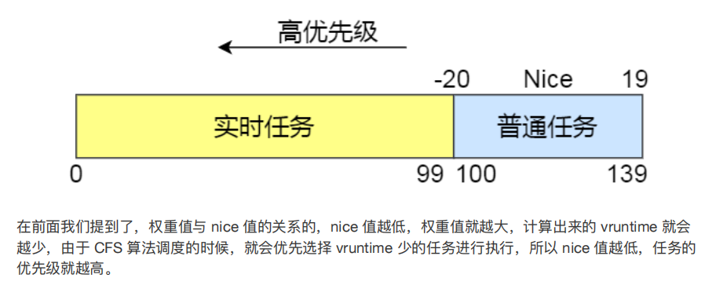


## 一般概念下——进程和线程的区别
### **进程和线程的区别**

面试官问 **“进程和线程的区别”**，可以按照 **概念 → 资源管理 → 运行调度 → 通信方式 → 适用场景** 这五个角度进行回答，同时补充实际案例，使回答更具说服力。以下是详细的回答思路：  

---

### **1. 基本概念**
- **进程（Process）** 是操作系统中**资源分配的基本单位**，每个进程都有自己的**独立地址空间**，包括代码段、数据段、堆、栈等。
- **线程（Thread）** 是进程中的**执行单位**，同一个进程内的多个线程共享进程资源（如地址空间、文件描述符、全局变量等），但**每个线程有自己独立的栈和寄存器**。

**举例**：
- 打开两个不同的浏览器窗口（如 Chrome 和 Firefox）属于**不同的进程**，它们互不影响。
- 在 Chrome 浏览器中打开多个标签页，这些**标签页可能是不同的线程**，它们共享相同的进程资源。

---

### **2. 资源管理**
| 比较项 | 进程 | 线程 |
|--------|------|------|
| **地址空间** | 独立的虚拟地址空间 | 共享同一进程的地址空间 |
| **数据共享** | 进程之间**不共享**数据，通信需要 IPC（管道、消息队列等） | 线程**共享**全局变量、堆、文件描述符等 |
| **资源开销** | 创建、销毁进程的**开销大**，切换时需要保存/恢复所有寄存器、页表等 | 线程创建和切换的**开销小**，仅需保存/恢复寄存器、栈等 |

**举例**：
- 运行两个独立的 Python 进程（`python script1.py` 和 `python script2.py`）时，它们**互不干涉**，修改一个进程的变量不会影响另一个进程。
- 如果一个 Python 进程开启多个线程（如 `threading.Thread()`），那么这些线程**可以共享全局变量**，但多个线程同时访问同一个变量时可能会有**数据竞争问题**。

---

### **3. 运行调度**
- **进程调度**：操作系统基于调度策略（如 CFS、FIFO、RR 等）选择合适的进程进行 CPU 分配，进程切换涉及上下文切换，**开销较大**。
- **线程调度**：
  - **用户级线程（User-level Thread）** 由应用程序自行管理，切换快但无法利用多核。
  - **内核级线程（Kernel-level Thread）** 由操作系统管理，能并行执行，但切换仍有内核态开销。

**举例**：
- 在 Linux 上运行多个 Python 进程时，**进程调度由内核完成**，多个进程可在多个 CPU 核心上并行运行。
- 在 Python 多线程程序（如 `threading.Thread`）中，受**全局解释器锁（GIL）** 限制，Python 线程通常**不能利用多核**，但 I/O 密集型任务（如网络爬虫）仍然受益于多线程。

---

### **4. 进程间通信（IPC）与线程间通信**
| 通信方式 | 进程 | 线程 |
|---------|------|------|
| **数据共享** | 进程独立，通信需要 IPC 机制 | 线程共享数据，直接访问进程的全局变量 |
| **通信方式** | 管道（Pipe）、消息队列、共享内存、Socket | 共享变量、锁（Mutex）、条件变量 |

**举例**：
- 进程 A 和 进程 B 之间通信需要 **消息队列** 或 **共享内存**，但这涉及到同步、数据拷贝，开销大。
- 线程 A 和 线程 B **直接访问同一个变量**，但如果多个线程同时修改变量，可能会产生 **数据竞争**，需要加锁（如 `mutex`）。

---

### **5. 适用场景**
| 适用场景 | 进程 | 线程 |
|---------|------|------|
| **适合多 CPU 计算（并行）** | ✅ 进程可以真正并行运行 | ⚠️ 受限于 GIL（Python），但 Java/C++ 可利用多核 |
| **适合 I/O 密集型任务** | ❌ 进程间通信成本高 | ✅ 线程切换快，适合 I/O 任务（爬虫、数据库操作） |
| **安全性** | ✅ 进程互不干涉，安全性高 | ⚠️ 共享数据可能导致竞争，需要同步 |
| **典型应用** | 数据库、多进程 Web 服务器 | 爬虫、前端 UI 线程、游戏引擎 |

**举例**：
- **多进程适合计算密集型任务**：
  - 使用 **`multiprocessing`** 在 Python 计算大数值时，每个进程可以运行在不同的 CPU 核心上，实现真正的并行计算。
- **多线程适合 I/O 密集型任务**：
  - 使用 **`threading`** 在爬取网页时，一个线程请求数据，另一个线程解析数据，提高吞吐量。

---

### **6. 总结**
| 维度 | 进程 | 线程 |
|------|------|------|
| **定义** | 资源分配的基本单位 | 调度的基本单位 |
| **地址空间** | 独立 | 共享同一进程 |
| **创建开销** | 高 | 低 |
| **切换开销** | 高（上下文切换） | 低（只切换寄存器和栈） |
| **数据共享** | 需要 IPC 机制 | 共享进程数据，访问更快 |
| **并行能力** | 可真正利用多核 | 受 GIL 影响（Python） |
| **适用场景** | 计算密集型任务（数据库、Web 服务器） | I/O 密集型任务（爬虫、文件下载） |

**最佳回答策略：**
- 如果面试官要求简洁回答，直接讲 **进程和线程的核心区别**（地址空间、调度方式、通信方式、适用场景）。
- 如果面试官追问细节，可以展开讲 **调度方式、IPC 机制、应用案例**。
- 可以结合具体编程语言（如 Python GIL）或操作系统（如 Linux CFS 调度器）进行说明，展示深入理解。

---

### **7. 面试官可能的追问**
1. **为什么进程间通信比线程间通信慢？**
   - 因为进程**地址空间独立**，通信需要 IPC（如消息队列、管道），涉及数据拷贝，而线程共享地址空间，可直接访问数据。

2. **为什么 Python 线程不能利用多核？**
   - Python 解释器使用 **GIL（Global Interpreter Lock）**，限制同一时刻只能有一个线程执行 Python 字节码，因此 Python 线程无法真正并行计算，适用于 I/O 任务。

3. **如何选择进程还是线程？**
   - **CPU 密集型任务**：使用多进程（可真正并行）。
   - **I/O 密集型任务**：使用多线程（如爬虫、日志处理）。

这样，你的回答不仅逻辑清晰，而且能结合实际案例，给面试官留下深刻印象！

## linux下——进程和线程的区别
在 **Linux 内核** 中，**进程（Process）和线程（Thread）本质上都是 `task_struct` 结构的实例**，但它们的资源共享方式不同。  

---

### **1. 进程 vs 线程的主要区别**
| **比较项**    | **进程（Process）** | **线程（Thread）** |
|--------------|-----------------|----------------|
| **定义**    | 独立执行的程序实例 | 进程中的轻量级执行单元 |
| **地址空间** | 进程之间**不共享** | 线程之间**共享** |
| **数据段**   | 进程有自己独立的**堆、全局变量** | 线程共享进程的**堆、全局变量** |
| **代码段**   | 进程独立 | 线程共享 |
| **文件描述符** | 进程有自己独立的 FD | 线程共享进程的 FD |
| **内核栈**   | 进程有自己的内核栈 | 每个线程**有独立的内核栈** |
| **调度**    | 进程是调度单位 | 线程也是调度单位 |
| **创建方式** | `fork()` | `pthread_create()` |
| **切换开销** | 进程切换需要切换页表，开销较大 | 线程切换只切换寄存器，开销较小 |
| **通信方式** | 进程间通信（IPC）：管道、共享内存、消息队列 | 线程间通信：全局变量、`mutex`、`cond` |

---

### **2. 进程和线程的资源共享**
#### **2.1 进程独立**
每个进程有 **独立的地址空间、堆、全局变量、文件描述符、信号处理**。

```c
pid_t pid = fork();
if (pid == 0) {
    printf("我是子进程，PID: %d\n", getpid());
} else {
    printf("我是父进程，PID: %d\n", getpid());
}
```
- **`fork()` 创建新进程，子进程会拷贝父进程的地址空间（写时复制 COW 机制）**。
- **父子进程地址空间相互独立**，修改变量不会影响对方。

#### **2.2 线程共享**
线程共享 **地址空间、全局变量、文件描述符**，但有自己独立的**栈和 `task_struct`**。

```c
void *thread_func(void *arg) {
    printf("线程 ID: %lu\n", pthread_self());
    return NULL;
}

pthread_t tid;
pthread_create(&tid, NULL, thread_func, NULL);
```
- `pthread_create()` 创建线程，线程 **共享进程地址空间**。
- **所有线程都能访问全局变量，需要同步机制（如 `mutex`）**。

---

### **3. 进程和线程在 Linux 内核中的实现**
#### **3.1 Linux 内核中的 `task_struct`**
Linux **进程和线程都是 `task_struct` 结构**，但 **线程和它的父进程共享 `mm_struct`**（内存空间）。
```c
struct task_struct {
    struct mm_struct *mm;  // 进程的地址空间
    struct files_struct *files;  // 进程的文件描述符
    struct thread_info *thread;  // 线程相关信息
};
```
| **进程 / 线程** | `task_struct` | `mm_struct` | `files_struct` |
|---------------|-------------|-------------|-------------|
| **不同进程**   | 独立        | 独立        | 独立        |
| **同一进程的线程** | 独立        | 共享        | 共享        |

#### **3.2 `clone()` 系统调用**
Linux 内核使用 `clone()` 创建线程：
```c
clone(CLONE_VM | CLONE_FS | CLONE_FILES | CLONE_SIGHAND, 0);
```
- **`CLONE_VM`**：共享内存空间
- **`CLONE_FS`**：共享文件系统信息
- **`CLONE_FILES`**：共享文件描述符
- **`CLONE_SIGHAND`**：共享信号处理

---

### **4. 进程和线程的使用场景**
| **使用场景** | **进程** | **线程** |
|-------------|--------|--------|
| 多核心并行计算 | ✅ | ✅ |
| 需要隔离的数据 | ✅ | ❌ |
| 共享数据 | ❌ | ✅ |
| 需要高并发 | ❌ | ✅ |
| 需要频繁创建和销毁 | ❌ | ✅ |

---

### **5. 总结**
✅ **Linux 内核中，进程和线程都是 `task_struct`，但线程共享 `mm_struct`**。  
✅ **进程切换开销大，但更安全；线程切换快，但共享数据需要同步**。  
✅ **进程间通信复杂（IPC），线程间共享数据简单（但要加锁）**。  
✅ **适用场景不同：隔离用进程，共享用线程**。  

如果你有具体的应用场景，我可以帮你分析该用进程还是线程！😊


## 内核栈的作用
### **1. 内核栈的作用**
内核栈（Kernel Stack）是每个进程（或线程）在进入内核态时使用的**私有栈**，用于存储：
- **系统调用参数**（如 `open()`、`read()`）
- **异常、陷入、系统调用的上下文信息**
- **内核函数的局部变量**
- **进程调度时的上下文切换信息**

在**进程或线程切换时**，**Linux 内核使用内核栈保存和恢复 CPU 上下文信息，从而实现任务调度**。

---

### **2. 内核栈的结构**
Linux 内核栈在 `task_struct` 结构中定义，并与 `thread_info` 绑定：

#### **(1) `task_struct` 结构**
每个线程都有一个 `task_struct`，用于记录进程/线程的信息：
```c
struct task_struct {
    struct thread_info *thread;  // 线程的内核栈指针
    struct mm_struct *mm;        // 进程的内存空间（线程共享）
    struct thread_struct thread; // 线程寄存器状态
    unsigned long state;         // 进程状态
};
```

#### **(2) `thread_info` 结构**
`thread_info` 记录**进程/线程的状态信息**，并且通常存放在**内核栈的最低地址**：
```c
struct thread_info {
    struct task_struct *task;  // 指向所属的 task_struct
    unsigned long flags;       // 线程标志位
    unsigned long cpu;         // 运行的 CPU ID
};
```

#### **(3) 内核栈的布局**
```plaintext
低地址（stack bottom）
+---------------------+
| thread_info        |  线程信息结构
| task_struct 指针   |
+---------------------+
|                   |
| 内核栈空间        |  存放局部变量、函数调用、寄存器等
|                   |
+---------------------+
| 调用 `schedule()` |
| 现场保护         |  进程切换时保存的寄存器信息
+---------------------+
高地址（stack top）
```
- **内核栈是向下增长的**（高地址 -> 低地址）。
- **`thread_info` 结构存放在内核栈底部**，方便 `task_struct` 访问。

---

### **3. 内核栈在进程调度中的作用**
当 Linux 需要切换进程时，调度器（Scheduler）会：
1. **保存当前进程的 CPU 寄存器状态到内核栈**
2. **切换到新的进程的 `task_struct`**
3. **恢复新进程的 CPU 状态**
4. **跳转到新进程继续执行**

#### **(1) `schedule()` 进行任务切换**
```c
void schedule(void) {
    struct task_struct *prev, *next;
    prev = current;
    next = pick_next_task(); // 选择下一个要运行的进程
    context_switch(prev, next);
}
```
- `current` 通过内核栈指针找到 `task_struct`。
- `pick_next_task()` 选取下一个进程。
- `context_switch()` 进行上下文切换。

#### **(2) `context_switch()` 进行上下文切换**
```c
void context_switch(struct task_struct *prev, struct task_struct *next) {
    switch_to(prev, next);
}
```
- **`switch_to(prev, next)`**：切换 CPU 上下文，改变 `rsp` 指向新线程的内核栈。

---

### **4. 线程/进程切换时，内核栈的具体流程**
#### **(1) 发生进程切换的场景**
- **进程主动调用 `schedule()`**
- **时间片用完，触发 `tick` 中断**
- **进入睡眠（如 `wait()`、`mutex_lock()`）**
- **被其他进程唤醒（如 `wakeup()`）**

#### **(2) 进程切换的详细步骤**
 **① 进入 `schedule()`**
- **保存当前进程的 CPU 状态到内核栈**
- **切换 `task_struct`**
- **恢复新进程的 CPU 状态**
  
```plaintext
进程 A 调度到 进程 B：
- 保存 进程 A 的寄存器信息到 A 的内核栈
- 切换 `current_task` 指针
- 切换到 进程 B 的内核栈
- 恢复 进程 B 的寄存器状态
```

 **② `switch_to(prev, next)` 进行上下文切换**
- **切换内核栈 `rsp`**
- **切换 `task_struct`**
- **恢复 `next` 进程的寄存器**

```assembly
switch_to:
    movq %rsp, (prev->thread.sp)  // 保存当前进程的内核栈指针
    movq (next->thread.sp), %rsp  // 切换到下一个进程的内核栈
    jmp *(next->thread.ip)        // 跳转到新的进程
```

 **③ 进程 B 继续执行**
- **恢复 `B` 的寄存器状态**
- **继续执行 `B` 之前的任务**

---

### **5. 为什么线程需要独立的内核栈？**
虽然线程共享用户空间，但**每个线程进入内核态后，必须有自己的独立内核栈，否则调度会出问题**：
- **如果多个线程共用一个内核栈，线程切换时，内核栈的内容会被覆盖，导致数据丢失**
- **线程 A 进入内核态，执行 `write()`，还没返回时被调度器切换到线程 B，B 也调用 `write()`，如果共用同一个栈，A 的 `write()` 状态会被 B 覆盖，导致错误**

所以，**每个线程都需要独立的内核栈（8 KB / 16 KB）来保证上下文切换的正确性**。

---

### **6. 总结**
✅ **每个线程都有自己的内核栈（8 KB / 16 KB）**，即使它们共享用户空间。  
✅ **内核栈用于存储系统调用参数、局部变量、寄存器状态，并在进程/线程切换时起关键作用**。  
✅ **Linux 调度器 `schedule()` 通过 `switch_to()` 切换线程，并切换内核栈**。  
✅ **如果线程共用内核栈，调度时数据会被覆盖，导致系统崩溃**。

这样，Linux 才能安全、高效地进行进程调度和线程管理！ 🚀


## 线程池优化，为什么线程过多性能反而受到影响
### **1. 线程多了性能反而受到影响的原因**

在设计和使用线程池时，**线程数过多**可能反而会导致性能下降，主要原因如下：

#### **1.1. 上下文切换（Context Switching）**
- **上下文切换**是指操作系统需要保存当前线程的状态并加载另一个线程的状态。这一过程涉及到CPU寄存器、程序计数器等的保存和恢复。每次上下文切换都有一定的性能开销。
- 如果线程池中的线程数过多，操作系统需要频繁地进行上下文切换，而这会占用大量的CPU资源，减少有效的计算时间，从而降低整体性能。

#### **1.2. 资源竞争**
- 当线程数过多时，各个线程在访问共享资源（如CPU、内存、I/O等）时，容易发生**资源竞争**，导致上下游线程之间的延迟增加。这种竞争会造成 **锁竞争**，进而增加**阻塞时间**，导致系统效率降低。
- CPU是有限的资源，如果有太多线程，操作系统需要将时间片在多个线程之间分配，导致每个线程获取到的CPU时间片较少，从而导致执行效率低下。

#### **1.3. 内存消耗**
- 每个线程都会占用一定的内存空间。线程的栈空间、线程控制块等资源会消耗大量内存。线程数过多时，系统需要为每个线程分配内存，可能导致内存压力过大，进而影响系统的整体性能。
- 如果系统的内存不足，可能会导致系统产生**内存交换（swap）**，频繁的页面交换会进一步降低性能。

#### **1.4. 线程创建和销毁的开销**
- 在一些线程池设计中，如果线程池内的线程数量变化较大，**创建和销毁线程**会带来额外的开销。频繁创建和销毁线程不仅浪费CPU资源，而且线程池的管理复杂度增加，进一步拖慢系统效率。

#### **1.5. 缺乏CPU亲和性**
- 现代CPU通常会拥有多个核心，且不同线程可能会分配到不同的核心上。在这种情况下，线程调度和数据访问可能会受制于**缓存一致性和缓存失效**等问题。大量线程频繁地在多个核心之间切换，可能会导致缓存失效，从而降低执行效率。

#### **1.6. 线程间通信与同步开销**
- 线程池中的线程可能需要进行**线程间通信**和**同步**，例如通过互斥锁、信号量等同步机制来访问共享资源。大量线程并发地访问共享资源时，会导致**锁竞争**，使得线程被阻塞，从而影响性能。

---

### **2. 如何优化线程池的性能？**

为了避免线程过多导致的性能瓶颈，可以采取以下优化方法：

#### **2.1. 合理设置线程池的线程数**
- **固定线程池**：设置合适的线程数，避免过多的线程同时竞争资源。理想的线程池大小通常基于**CPU核心数**来设置。比如，线程池的大小可以设置为CPU核心数的1到2倍，避免过多线程带来上下文切换的开销。
- 可以使用 **线程池的动态调整机制**，根据系统负载和任务队列的长度动态地调整线程池中的线程数。

#### **2.2. 使用任务队列**
- 任务队列的大小需要合理配置，避免任务队列过长或过短。过长的队列可能导致线程池中的线程一直处于忙碌状态，而过短的队列则可能导致线程闲置。
- 队列大小需要根据应用的任务量和系统资源来调节，保持良好的负载平衡。

#### **2.3. 降低线程之间的同步与通信开销**
- 避免过多的线程同步，尽量减少锁的粒度，可以使用 **无锁编程**（例如：原子操作和 CAS）来减少锁的竞争。
- **线程局部存储**（TLS）可以帮助减少不同线程之间对共享数据的竞争。

#### **2.4. 选择合适的任务分配策略**
- 对于任务的分配策略，也可以根据实际情况采用不同的调度算法。例如，使用 **调度策略**（如：**公平调度**、**优先级调度**）来合理分配任务，避免部分线程一直在等待任务。

#### **2.5. 定期检查线程池的健康状态**
- 定期监控线程池的状态，比如队列长度、线程状态、任务执行时间等，及时调整线程池的配置，避免线程池过度扩展或过度缩减。

#### **2.6. 避免频繁的线程创建和销毁**
- **线程复用**：线程池中的线程应该尽量复用，避免频繁创建和销毁线程。线程池的设计应尽量使用**长生命周期的线程**，并且**保持足够的空闲线程**来应对突发负载。

---

### **3. 总结**

- **线程过多**会导致操作系统频繁进行上下文切换，增加资源竞争，消耗内存等，从而影响性能。
- 合理配置线程池的线程数、优化线程间的同步机制、使用任务队列等方式可以避免过多线程带来的负面影响，从而提高系统性能。


## 线程的最佳数量
### **📌 多线程的最佳数量与哪些参数有关？**
多线程的最佳数量**并不是越多越好**，而是需要根据 **CPU 计算能力、任务类型（CPU 密集型 or I/O 密集型）、内存、线程管理开销** 等因素来决定。

---

### **1️⃣ 计算密集型任务：CPU 核心数**
如果任务主要是**计算密集型**（如加密解密、压缩、深度学习、图像渲染），那么线程数应该接近 **CPU 核心数**（或略多一点）。

- **最佳线程数 ≈ CPU 物理核心数**
- 如果支持超线程（Hyper-Threading），可设置 **线程数 ≈ 2 × 物理核心数**

**💡 示例（查看 CPU 核心数）：**
```bash
lscpu | grep 'CPU(s):'
```
如果 CPU 有 8 个物理核心，最佳线程数大约是 **8~16**。

---

### **2️⃣ I/O 密集型任务：并发度**
如果任务是**I/O 密集型**（如数据库访问、网络请求、磁盘读写），线程不受 CPU 限制，而受 **I/O 并发能力** 影响。

- 线程数可以 **远大于 CPU 核心数**
- 一般建议 `2 × 核心数` 到 `10 × 核心数`

**💡 计算公式（I/O 密集型）：**
\[
线程数 = 核心数 \times (1 + \frac{\text{I/O 等待时间}}{\text{CPU 计算时间}})
\]
如果 I/O 操作占 80% 时间，CPU 计算占 20%，则：
\[
线程数 = 核心数 \times (1 + 4) = 5 \times 核心数
\]

---

### **3️⃣ 线程上下文切换（Context Switching）**
- 线程越多，CPU 需要频繁切换线程，**上下文切换**会带来开销
- 可以用 `top -H -p <pid>` 或 `vmstat` 监测 `cs`（上下文切换次数）

如果 `cs` 过高，说明线程切换频繁，应减少线程数量。

---

### **4️⃣ 线程栈大小 & 内存**
每个线程都需要 **栈空间**，默认 8MB，线程太多可能导致 **内存不足（OOM）**。  
可以减少栈大小：
```c
pthread_attr_t attr;
pthread_attr_init(&attr);
pthread_attr_setstacksize(&attr, 1024 * 1024);  // 1MB
pthread_create(&tid, &attr, thread_func, NULL);
pthread_attr_destroy(&attr);
```

---

### **🔥 结论**
| 任务类型 | 最佳线程数计算 |
|---------|------------|
| **CPU 密集型** | **线程数 ≈ 核心数 或 2 × 核心数** |
| **I/O 密集型** | **线程数 ≈ 核心数 × (1 + I/O时间/CPU时间)** |
| **混合型** | **根据 CPU 利用率 + I/O 并发度 动态调整** |

**👉 经验法则：**
1. CPU 密集型：线程数 ≈ CPU 核心数
2. I/O 密集型：线程数 ≈ 2~10 × CPU 核心数
3. 监测 `cs`（上下文切换）、`ulimit -s`（线程栈大小）

🚀 **实际优化**：
- **CPU 使用率过高**？→ 减少线程数
- **I/O 等待时间长**？→ 增加线程数
- **大量线程切换（高 cs）**？→ 降低线程数

如果有**超大并发需求**，考虑 **协程（coroutine）** 代替线程，更高效！ 🚀


## Linux中线程的调度方式
### **Linux操作系统能看到线程吗？**
是的，**Linux 操作系统能够看到线程**，因为 Linux 线程（`pthread`）在内核层面上被实现为 **轻量级进程（LWP，Light Weight Process）**。每个线程在内核中都有一个**唯一的 task_struct 结构体**，与普通进程一样，被内核调度器管理。

可以通过 `ps -T` 或 `top -H` 命令看到进程内部的线程：
```sh
ps -T -p <进程PID>   # 显示进程的所有线程
top -H -p <进程PID>   # top 显示进程的所有线程
```
可以看到每个线程都有自己的 PID（实际上是**线程 ID**，在 Linux 中也叫 TID）。

---

### **Linux线程调度的工作方式**
Linux 的调度器是 **完全公平调度器（CFS，Completely Fair Scheduler）**，它的基本单位是 **任务（task）**，而**Linux 线程本质上是一个特殊的任务**。所以：
1. **进程和线程是同级调度单位**—— 线程并不会依赖进程的调度，而是直接由 CFS 进行全局调度。
2. **调度器对进程和线程一视同仁**，每个线程都有自己的时间片、优先级等。

#### **调度流程**
1. **内核视角**
   - 进程和线程都是 `task_struct`，它们在 CFS 任务树（红黑树）中都是**独立的调度对象**。
   - 线程不会先排队到“进程”下再进行调度，而是和普通进程一样，直接进入调度队列。
   - `fork()` 产生进程，而 `pthread_create()` 只是创建**共享部分资源（内存、文件等）的任务**。

2. **用户视角**
   - 多线程程序的所有线程共享相同的**地址空间**，但**每个线程都有自己的 task_struct、寄存器、栈**。
   - 线程的 `nice` 值和进程的 `nice` 值是一致的，因此如果 `nice` 提高，则该进程下的所有线程都受影响。

#### **是否先调度进程再调度线程？**
**不是的！**
- CFS 直接把线程当作普通的调度单元，线程之间的调度没有“进程优先，线程次之”的层级关系。
- 例如，一个 4 核 CPU 上：
  - 进程 A（有 3 个线程）
  - 进程 B（有 2 个线程）
  - 进程 C（单线程）
  - 这 6 个“任务”直接在 CPU 上被调度。

如果系统负载高，某个进程有 10 个线程，而另一个进程只有 1 个线程，则**10 个线程并不会因为同属一个进程而“内部竞争”**，它们和单线程进程一样，在整个系统调度范围内竞争 CPU。

---

### **如何设置线程优先级？**
如果想手动控制线程的优先级，Linux 允许使用 **实时调度策略**：
- `SCHED_OTHER`（普通任务，CFS 调度）
- `SCHED_FIFO`（先来先服务，不会被抢占）
- `SCHED_RR`（轮转调度）

可以使用 `pthread_setschedparam()` 给线程设定优先级：
```cpp
#include <pthread.h>
#include <sched.h>
#include <stdio.h>

void* thread_func(void* arg) {
    printf("Thread running\n");
    return NULL;
}

int main() {
    pthread_t thread;
    struct sched_param param;
    
    pthread_create(&thread, NULL, thread_func, NULL);

    param.sched_priority = 10; // 设定优先级
    pthread_setschedparam(thread, SCHED_FIFO, &param); // 使用FIFO调度策略

    pthread_join(thread, NULL);
    return 0;
}
```
如果是普通 CFS 线程，可以用 `nice` 调整整个进程的调度权重。

---

### **总结**
1. **Linux 直接调度线程**，没有“先调度进程再调度线程”的过程。
2. **每个线程在内核中都是独立的调度单元**（task_struct），与普通进程享有同样的 CFS 竞争权。
3. **线程不会比进程更“低一级”**，而是直接和进程中的其他任务平等竞争 CPU。
4. **如果想调整线程优先级**：
   - 普通线程（CFS）：使用 `nice` 影响整个进程的调度优先级。
   - 实时线程（SCHED_FIFO/SCHED_RR）：使用 `pthread_setschedparam()` 来调整线程调度策略和优先级。

这样就解释了你的疑问：Linux **不会先对进程进行 CFS 调度，再对进程内的线程进行调度**，而是直接在全局任务队列中调度所有线程。


## 浏览器的复合多进程线程模型
浏览器的不同页面通常是**多进程**的，尤其是在现代浏览器（如 Chrome、Firefox）中。这个设计背后的原因包括性能、稳定性、安全性等多个方面。以下是详细的解释：

### ✅ 1. **多进程架构（现代浏览器的主流设计）**
现代浏览器采用了**多进程架构**，每个标签页、每个扩展、甚至每个插件（如 Flash）都有独立的进程。Google Chrome 就是一个典型的例子，它将每个标签页的内容（如网页）与浏览器的其他功能（如渲染引擎、网络、GPU）分开，使用多个进程来处理。

### ✅ 2. **为什么采用多进程设计**
- **稳定性**：
    - 如果一个网页崩溃，它不会影响到其他标签页或浏览器的其他部分。每个进程是隔离的，所以即使一个进程崩溃了，浏览器其他部分可以继续运行。
    - 比如，某个网页上的 JavaScript 代码出错，导致该标签页崩溃，不会影响其他标签页或浏览器本身。
  
- **安全性**：
    - 每个标签页或扩展运行在自己的沙箱（sandbox）中，这样即使攻击者利用某个网页的漏洞，也能隔离影响范围，保护系统安全。
    - 通过进程隔离，恶意网页不能轻易访问其他网页的内存或操作系统资源。
  
- **性能**：
    - 每个进程都有自己独立的资源（如内存、CPU 使用），不会相互干扰。浏览器可以通过操作系统的调度机制来合理分配资源，从而提升整体性能。
    - 通过多进程，浏览器能够更好地利用多核 CPU。不同的进程可以并行执行，提升了浏览器的响应速度和页面加载速度。

### ✅ 3. **多线程架构（每个进程内部）**
在一个浏览器进程内部，确实会有多个线程。每个浏览器进程会包含多个线程来处理不同的任务，比如：
- **UI 线程**：负责渲染页面、响应用户交互。
- **渲染线程**：负责 HTML 和 CSS 的解析，网页的渲染。
- **网络线程**：负责处理 HTTP 请求和响应。
- **IO 线程**：负责文件读写等操作。
  
这些线程在同一个进程内相互协作，利用多核 CPU 提高处理速度。

### ✅ 4. **为何多进程而非纯粹多线程**
虽然**多线程**在资源使用和调度上更加高效，但是多进程的设计提供了更好的**隔离性和稳定性**。每个进程的内存空间是隔离的，一个进程崩溃不会影响到其他进程。多线程虽然能共享内存，但如果一个线程出现问题，很可能会导致整个进程崩溃。

### ✅ 5. **浏览器进程与线程的配合**
- 每个标签页或扩展作为独立的进程，这样可以提升稳定性与安全性。
- 每个进程内部，浏览器使用多个线程来实现高效的并发处理。
  
### 🔑 **总结**
浏览器的不同页面（标签页）通常是**多进程**的，而在每个进程内部，则使用**多线程**来处理不同的任务。通过进程隔离提高了稳定性和安全性，而通过多线程提升了性能。

这个设计确保了浏览器在处理多个任务时能够高效且稳定地运行，避免了单个页面崩溃影响整个浏览器的情况。


## 线程崩溃情景
### 线程崩溃会发生什么
在 **Linux** 下，如果一个线程崩溃（如触发了段错误 Segmentation Fault、非法指令 Illegal Instruction、除以零、断言失败等），**整个进程都会崩溃**，不会只是某一个线程终止。

---

#### ✅ 原因：线程共享进程地址空间

Linux 的线程（如使用 `pthread_create` 创建的）本质上是运行在同一个进程中的**多个执行流**，它们共享：

- 相同的地址空间（heap、stack、global、code）
- 相同的文件描述符表
- 相同的信号处理方式
- 相同的 PID（线程 ID 是轻量级进程 TID）

---

#### 💥 线程崩溃的几种典型情形

| 情况 | 结果 |
|------|------|
| 线程执行中访问非法地址（如空指针） | 触发 `SIGSEGV`，整个进程崩溃 |
| 除以零 | 触发 `SIGFPE`，整个进程崩溃 |
| assert 失败 | 通常触发 `SIGABRT`，进程退出 |
| 栈溢出 | 通常是 `SIGSEGV`，进程崩溃 |

---

#### 🚨 捕获机制：可以通过信号处理防止崩溃吗？

**不推荐**用 `signal()` 或 `sigaction()` 试图在 `SIGSEGV` 中恢复（虽然理论上可以尝试 `setjmp/longjmp` + `sigsetjmp/siglongjmp`），但：

- 内核信号机制不是为恢复而设计的
- 有风险，会导致状态不一致，难以维护

---

#### 🧷 推荐方式：防御性编程 + 崩溃隔离

- 使用线程局部异常捕获（C++ 中 try/catch）
- 使用线程间通信机制汇报异常（如 `future/promise`、返回错误码）
- 关键线程可以 fork 子进程，让主进程监控崩溃恢复（如浏览器沙盒、守护进程机制）
- 使用 `pthread_cleanup_push/pop` 注册清理回调
- 使用信号处理器记录崩溃信息（配合 core dump）

---


### 如何避免因线程崩溃导致进程崩溃
这是一个非常好的问题！在 **Linux** 下，**线程崩溃导致整个进程崩溃** 是默认行为，但可以通过一些 **间接手段来避免进程随线程一起崩溃**。不过注意：这并不能完全“修复”崩溃，而是“隔离”和“控制”它的影响。

---

#### 🧠 为什么线程崩溃会导致进程崩溃？

因为线程属于同一个进程空间，访问非法内存、断言失败等触发了 **致命信号（如 `SIGSEGV`、`SIGABRT`）**，该信号是**进程级别的**，默认会终止整个进程。

---

#### ✅ 如何避免线程 crash 导致整个进程崩溃？

下面是几种比较常见的策略：

---

##### 1. **使用信号处理器捕获崩溃**

你可以设置一个信号处理器拦截 `SIGSEGV`、`SIGABRT` 等：

```cpp
#include <signal.h>
#include <stdio.h>
#include <stdlib.h>
#include <unistd.h>

void sig_handler(int signo) {
    printf("Caught signal %d in thread, handling gracefully\n", signo);
    // 可使用 longjmp 或直接退出线程
    pthread_exit(NULL);
}

void* thread_func(void*) {
    int* p = nullptr;
    *p = 123;  // will crash
    return NULL;
}

int main() {
    signal(SIGSEGV, sig_handler);  // 安装信号处理器

    pthread_t tid;
    pthread_create(&tid, NULL, thread_func, NULL);
    pthread_join(tid, NULL);

    printf("main thread continues\n");
    return 0;
}
```

🚨 **问题：**
- 不能可靠地恢复执行，尤其在 `SIGSEGV` 发生时，系统可能已无法继续安全运行。
- 不推荐用来继续业务逻辑，只适合做 logging、core dump 或线程自杀。

---

##### 2. **将高风险逻辑放在子进程中**

这是最可靠的方式之一。通过 `fork()` 出一个子进程，在其中执行可能 crash 的逻辑。即使崩溃，也不会影响主进程。

```cpp
pid_t pid = fork();
if (pid == 0) {
    // 子进程逻辑
    risky_operation(); // 可能崩溃
    exit(0);
} else {
    waitpid(pid, ...);  // 主进程等子进程结束
    // 检查子进程退出状态
}
```

---

##### 3. **使用线程局部异常捕获（C++）**

虽然不能捕获所有底层错误（如段错误），但可以对 **逻辑异常** 做很好的保护：

```cpp
void* thread_func(void*) {
    try {
        risky_cpp_code(); // 可能抛出异常
    } catch (const std::exception& e) {
        std::cerr << "Caught exception: " << e.what() << '\n';
    }
    return NULL;
}
```

---

##### 4. **使用 `sigaltstack()` 为信号处理器提供独立栈**

当线程栈破坏时，默认信号处理器可能无法运行。通过 `sigaltstack()` 可以提供独立栈空间处理信号。

---

#### ❗ 结论

| 方法 | 是否推荐 | 效果 |
|------|----------|------|
| 信号处理器捕获 `SIGSEGV` | 一般不推荐用于恢复 | 适合日志记录、退出线程 |
| 子进程执行高风险逻辑 | ✅ 强烈推荐 | 崩溃不影响主进程 |
| try/catch 捕获异常 | ✅ 推荐用于逻辑异常 | 无法处理底层错误 |
| 使用 `sigaltstack` | 进阶技巧 | 提升稳定性 |

---


# 无锁并发编程
## 无锁并发的一般方式
好！咱们来深入聊聊「无锁并发编程」这个非常核心但又很容易误解的概念。

---

### 🔧 什么是无锁并发编程（Lock-Free Programming）？

**无锁并发编程**，是指在多线程环境下，**不使用传统的锁机制（如 mutex、semaphore）**，而是依赖底层的**原子操作（atomic operations）**来实现线程安全和并发访问。

#### ✅ 核心目标：
- **不阻塞线程**（线程不会因为获取不到锁而挂起）
- **高性能、高并发**
- **避免死锁、优先级反转等问题**
- **尽量让某个线程总能前进（lock-free），甚至全部线程都能持续前进（wait-free）**

---

### 🚦 无锁并发的分类

无锁并发算法大体上可分为三类：

| 类型         | 定义                                                                 | 特点                          |
|--------------|----------------------------------------------------------------------|-------------------------------|
| **Wait-Free** | 每个线程在有限步骤内一定能完成操作                                  | ✅ 最强保障，但实现复杂、性能偏低 |
| **Lock-Free** | 总有某个线程在有限步内可以完成操作（系统总体不断前进）               | ✅ 性能高，常见                 |
| **Obstruction-Free** | 如果某个线程独占执行，不会被阻塞，能在有限步内完成操作     | 🚫 不抗并发竞争，最弱           |

> ✅ **实际项目中，大多数无锁结构都是 Lock-Free，而非 Wait-Free。**

---

### 🧱 无锁并发的基本工具和方式

#### 1. **CAS（Compare-And-Swap）/ 原子操作**
   - 最常见的无锁工具，用于原子地比较并更新内存值。
   - 用于实现无锁队列、栈、自旋锁等。
   - CPU原生支持，如 `__sync_bool_compare_and_swap` 或 `std::atomic::compare_exchange_strong`。

#### 2. **原子变量（Atomic Types）**
   - C++11 的 `std::atomic<T>` / C11 的 `_Atomic`。
   - 提供安全的读写、加减、交换、CAS 等操作。
   - 原子操作是无锁算法的核心。

#### 3. **内存屏障（Memory Barriers）**
   - 保证内存操作顺序一致性，防止编译器或CPU乱序优化影响程序语义。
   - 在写无锁结构时很关键。

#### 4. **循环 + CAS 的重试机制**
   - 大多数无锁算法采用“尝试-CAS-失败重试”的逻辑。
   - 示例：

     ```cpp
     while (true) {
         int old = atomic_val.load();
         int new_val = old + 1;
         if (atomic_val.compare_exchange_weak(old, new_val)) break; // 成功退出
         // 否则自动重试
     }
     ```

#### 5. **无锁数据结构（Lock-Free Data Structures）**
   - 经典结构包括：
     - 无锁队列（Michael-Scott Queue）
     - 无锁栈（Treiber Stack）
     - 无锁哈希表
     - 无锁环形缓冲区（SPSC/MPMC RingBuffer）

#### 6. **Read-Copy-Update（RCU）**
   - Linux内核中常用的无锁读优化技术。
   - 读者不加锁，写时复制结构、更新、再替换。

---

### 📦 举个栗子：Lock-Free Stack（Treiber 栈）

```cpp
std::atomic<Node*> head;

void push(int val) {
    Node* new_node = new Node(val);
    do {
        new_node->next = head.load();
    } while (!head.compare_exchange_weak(new_node->next, new_node));
}
```

- 用 CAS 来原子替换栈顶指针，避免了锁。
- 多线程可以并发 push，性能极好。

---

### ⚠️ 注意事项：

- **ABA 问题**：CAS 判断 A → B 变更，但中间可能 A → X → A，数据已变但值没变。
  - 可用 **带版本号的指针**（Tagged Pointer）或 **Hazard Pointer** 解决。
- **内存回收问题**：有引用但被删除的节点不能立即释放，要延迟回收。
- **实现复杂度高**：尤其是在处理链表、树等复杂结构时，容易踩坑。

---

### 🔚 总结一句话：

> **无锁并发编程**是一种借助**原子操作**来实现高并发、非阻塞访问共享数据的方式。它是高性能并发编程的核心，核心工具是：**CAS + 原子变量 + 内存屏障 + 数据结构设计技巧**。

---

如果你想看看一个完整的无锁队列/栈示例，或是针对你项目的具体需求做个设计，我可以帮你写出来～你想看哪种结构的实现？


## 循环+CAS 和 spinlock的区别
在无锁并发编程中，**循环+CAS**和**自旋锁**虽然都涉及循环和原子操作（如CAS），但它们的实现目标、设计理念和应用场景有本质区别。以下是两者的核心差异：

---

### 1. **设计目标**
- **循环+CAS（无锁编程）**  
  目标是实现**无锁（Lock-Free）的并发操作**，通过CAS（Compare-and-Swap）原子指令直接操作共享数据，避免线程阻塞。即使存在竞争，至少有一个线程能取得进展（如Java的`AtomicInteger`）。  
  **示例**：  
  ```java
  public class Counter {
      private AtomicInteger value = new AtomicInteger(0);
      public void increment() {
          int oldValue;
          do {
              oldValue = value.get();
          } while (!value.compareAndSet(oldValue, oldValue + 1)); // 循环+CAS
      }
  }
  ```

- **自旋锁（Spin Lock）**  
  目标是实现一种**轻量级的锁机制**，属于**有锁（Lock-Based）**的同步方式。线程在获取锁失败时不会阻塞，而是通过循环（自旋）反复尝试获取锁，直到成功。  
  **示例**：  
  ```java
  public class SpinLock {
      private AtomicBoolean locked = new AtomicBoolean(false);
      public void lock() {
          while (!locked.compareAndSet(false, true)) { // 自旋等待
              // 空循环或插入CPU优化指令（如Thread.onSpinWait()）
          }
      }
      public void unlock() {
          locked.set(false);
      }
  }
  ```

---

### 2. **并发范畴**
- **循环+CAS**  
  属于**无锁编程（Non-Blocking）**的范畴，通过原子操作直接操作共享数据，无需锁机制。即使多个线程竞争，至少一个线程能推进任务（Lock-Free），甚至所有线程都能推进（Wait-Free）。

- **自旋锁**  
  属于**有锁编程（Blocking）**的范畴，本质是一种**悲观锁**，假设竞争必然存在，需要显式获取锁。虽然线程不会主动让出CPU（不阻塞），但依然依赖锁的获取与释放。

---

### 3. **实现机制**
| **特性**            | **循环+CAS**                          | **自旋锁**                          |
|----------------------|---------------------------------------|--------------------------------------|
| **共享状态**         | 直接操作共享数据（如计数器、队列节点） | 操作锁标志（如`AtomicBoolean`）      |
| **循环目的**         | 确保原子更新成功                      | 等待锁被释放                         |
| **失败处理**         | 重试操作（无锁的乐观并发）            | 重试获取锁（有锁的悲观并发）          |
| **线程阻塞**         | 无（仅CPU空转）                       | 无（仅CPU空转）                      |

---

### 4. **性能与适用场景**
- **循环+CAS**  
  - **优点**：无锁，适用于低竞争场景（如计数器、无锁队列），减少上下文切换开销。  
  - **缺点**：高竞争时CAS失败率高，导致CPU空转（需结合退避策略，如指数退避）。

- **自旋锁**  
  - **优点**：锁持有时间极短时（如几纳秒），自旋比线程挂起更高效。  
  - **缺点**：锁持有时间长时，自旋会浪费CPU周期；不适合多核竞争激烈场景。

---

### 5. **关键区别总结**
| **维度**       | **循环+CAS（无锁）**                | **自旋锁（有锁）**                |
|----------------|------------------------------------|-----------------------------------|
| **同步方式**   | 无锁，直接操作数据                 | 有锁，依赖锁标志                 |
| **并发模型**   | 乐观并发（先操作，失败重试）       | 悲观并发（先获取锁，再操作）      |
| **适用场景**   | 低竞争的无锁数据结构               | 锁持有时间极短的临界区           |
| **线程阻塞**   | 无（但可能空转CPU）                | 无（但可能空转CPU）              |
| **公平性**     | 通常非公平                         | 通常非公平                       |

---

### 6. **底层关联**
自旋锁的实现可能依赖循环+CAS（如用`AtomicBoolean`作为锁标志），但这只是技术手段的复用，不改变自旋锁属于有锁编程的本质。二者的核心差异在于**是否直接通过原子操作修改共享数据**（无锁）**还是依赖锁标志**（有锁）。

---

### 总结
- **循环+CAS**是**无锁并发编程的核心技术**，用于直接操作共享数据，无需锁机制。  
- **自旋锁**是**一种轻量级锁的实现方式**，属于有锁编程，依赖锁标志的原子操作。  
- 两者都可能导致CPU空转，但分别服务于无锁和有锁两种不同的并发模型。

## 无锁队列的实现思路
以下是实现无锁队列的核心方案及关键技术解析，综合了链表与数组两种主流实现方式：

---

### 一、核心实现方案选择
#### 1. **基于链表的无锁队列**
• **数据结构设计**  
  使用带Dummy头节点的单向链表，头指针（`head`）和尾指针（`tail`）均用原子变量封装。Dummy节点用于简化边界条件处理，避免空队列时的竞争问题。
  ```cpp
  struct Node {
      T data;
      std::atomic<Node*> next;
  };
  std::atomic<Node*> head, tail;
  ```

#### 2. **基于数组的无锁环形队列**
• **数据结构设计**  
  使用固定大小的环形缓冲区（Ring Buffer），头尾指针通过原子变量控制：
  ```cpp
  std::atomic<size_t> head{0}, tail{0};
  std::vector<T> buffer;  // 预分配固定容量
  ```

---

### 二、关键技术实现
#### 1. **原子操作与CAS**
• **核心机制**：所有指针或索引的更新均通过`compare_exchange_weak/strong`（CAS）实现，确保操作的原子性。例如链表的入队：
  ```cpp
  void enqueue(T value) {
      Node* newNode = new Node{value, nullptr};
      Node* currTail;
      do {
          currTail = tail.load();
      } while (!currTail->next.compare_exchange_weak(nullptr, newNode));
      tail.compare_exchange_strong(currTail, newNode);
  }
  ```

#### 2. **ABA问题解决**
• **版本号标记**：在指针或索引中加入版本号（如高32位为版本号，低32位为地址/索引），每次修改递增版本号，防止旧值被误用。
• **引用计数**：结合`Fetch&Add`和`Release`原子操作管理节点引用计数，确保节点不会在操作中被意外释放。

#### 3. **内存屏障与顺序控制**
• **内存顺序选择**：使用`memory_order_acquire`（读取时同步）和`memory_order_release`（写入时同步），保证操作顺序一致性。例如环形队列的出队：
  ```cpp
  bool dequeue(T& out) {
      size_t currHead = head.load(std::memory_order_acquire);
      if (currHead == tail.load(std::memory_order_relaxed)) 
          return false;
      out = buffer[currHead % capacity];
      head.store((currHead + 1) % capacity, std::memory_order_release);
      return true;
  }
  ```

---

### 三、关键流程实现
#### 1. **链表队列操作**
• **入队（Enqueue）**：  
  1. 创建新节点并初始化。  
  2. 循环尝试将新节点CAS到当前尾节点的`next`指针。  
  3. 成功后更新`tail`指针（允许失败，其他线程可能已更新）。

• **出队（Dequeue）**：  
  1. 循环读取`head`指针，若队列为空则退出。  
  2. 通过CAS将`head`指向下一个节点，并返回数据。

#### 2. **环形队列操作**
• **入队（Enqueue）**：  
  1. 计算`nextTail = (currTail + 1) % capacity`。  
  2. 若队列未满，通过CAS更新`tail`指针并写入数据。

• **出队（Dequeue）**：  
  1. 若队列非空，读取`head`位置数据。  
  2. 通过CAS更新`head`指针。

---

### 四、性能优化策略
#### 1. **批量操作**
• 在环形队列中，通过批量移动`head/tail`指针（如一次移动多个元素索引），减少CAS竞争频率。

#### 2. **动态扩容**
• 分块式设计：当环形队列满时，分配新内存块并通过原子指针切换，实现无锁扩容。

#### 3. **线程局部缓存**
• 为生产者和消费者分配局部缓存，减少全局原子变量的争用。

---

### 五、边界条件与容错
#### 1. **队列空/满判断**
• **链表队列**：`head->next == nullptr`为空。
• **环形队列**：`(tail - head) == capacity`为满。

#### 2. **死锁预防**
• 限制CAS重试次数（如3次），超时后降级为带锁操作或返回错误。

---

### 六、测试与验证
1. **并发压力测试**：模拟多线程高频入队/出队，验证数据完整性。  
2. **性能对比**：对比锁队列与无锁队列在吞吐量和延迟上的差异。  
3. **内存泄漏检测**：确保所有节点最终被正确释放（如使用智能指针或引用计数）。

---

### 总结
实现无锁队列需综合**原子操作设计**、**ABA问题解决**和**内存顺序控制**三大核心能力。链表方案适合动态数据量场景，而环形队列在固定容量下性能更优。实际开发中可参考Intel的`concurrentqueue`或Boost的`lockfree::queue`等工业级实现。


# 系统调用
## 系统调用的定义实现
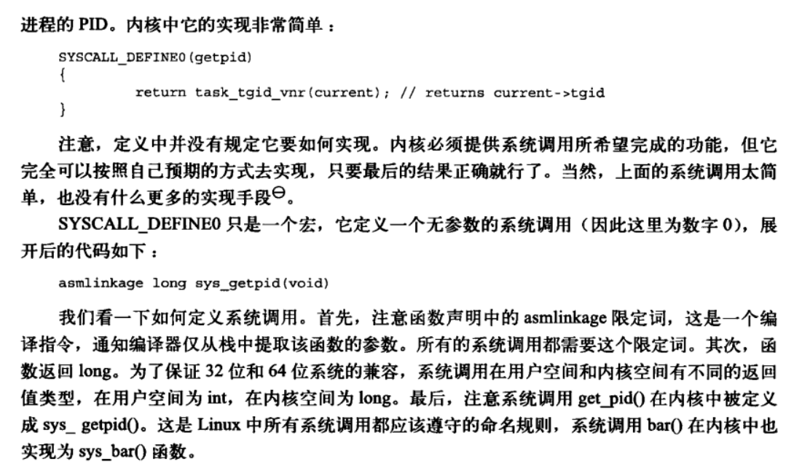
### 为什么使用asmlinkage

## 系统调用是如何陷入内核态的
理解系统调用从用户态到内核态的转入，可以通过以下几个关键步骤来澄清：

1. **系统调用的定义：**  
   系统调用是用户程序向操作系统内核请求服务的机制。通过系统调用，用户程序可以访问受保护的内核资源（如硬件设备、文件系统等）。

2. **用户进程执行系统调用的过程：**

### 🏃‍♂️ 1. 用户进程调用系统调用

在用户进程中，代码会通过调用某个标准库函数（如 `read()`、`write()`）来进行操作。标准库（如 `libc`）中的函数通常会封装这些系统调用并在底层触发。

举个例子：
```c
int fd = open("file.txt", O_RDONLY);
```
这里，`open()` 是标准库函数，它会进行一些准备工作，最后触发系统调用。

### 2.1 进入系统调用：
当你执行 `open()` 等函数时，最终会触发一个**系统调用**，并由 `libc` 库发起。此时，`libc` 库会将参数、调用号（系统调用的标识符）通过寄存器传递给内核。

- 在 x86_64 架构下，这些参数会被传递到 CPU 寄存器中：
  - `rax`（系统调用号）
  - `rdi`、`rsi`、`rdx` 等（系统调用的参数）

### 🛑 2. 系统调用的陷入：从用户态切换到内核态

当用户程序执行到系统调用时，**通过陷入指令**（比如 `syscall` 指令，或早期的 `int 0x80`）触发CPU进入内核态，下面是这一步的具体过程：

#### 2.1 用户态到内核态的切换：

- **CPU状态切换**：CPU的特权级别会从 `Ring 3`（用户态）切换到 `Ring 0`（内核态）。这时，操作系统的内核可以执行完全的特权操作，如直接访问硬件。
  
- **上下文切换**：当前用户进程的执行上下文（寄存器、栈等）会被保存在进程控制块（`task_struct`）中，并切换到内核栈。这时会切换到内核的代码执行路径。

- **跳转到内核空间**：CPU跳转到内核的一个预定义地址，这个地址通常是内核为系统调用处理器设置的入口地址。

#### 2.2 调用内核处理函数：

- **查找系统调用函数**：内核通过系统调用号（在 `rax` 寄存器中）查找系统调用表（如 `sys_call_table[]`）。这个表将系统调用号与具体的内核函数（例如 `sys_open()`）对应起来。
  
- **执行系统调用**：找到相应的内核函数后，内核会执行这些操作，比如访问文件系统、进行内存管理、操作网络等。

---

### 🏁 3. 从内核态返回到用户态

当内核完成系统调用后，它会准备返回用户态，流程如下：

#### 3.1 恢复用户进程的执行：
- **保存内核执行的状态**：内核完成系统调用后，会将内核态下执行的状态（寄存器、堆栈）保存。
- **返回用户进程**：通过 `sysret` 等指令，CPU跳回到用户进程所在的代码，并恢复用户进程的执行状态。此时，CPU的特权级别会回到 `Ring 3`（用户态）。

---

### 🔁 4. 系统调用和中断的对比

系统调用和中断在许多方面非常相似，它们都需要从用户态切换到内核态，执行时CPU的特权级别发生了变化。它们的主要区别在于：

- **触发方式不同**：
  - **系统调用**是由用户进程主动触发的。当程序需要内核服务时，它会通过特定的指令（如 `syscall`）请求。
  - **中断**是由硬件（如定时器、I/O设备）或者外部事件触发的。中断通常是异步的，系统不一定知道它什么时候会发生。

- **调用的目的不同**：
  - **系统调用**是用户进程主动请求内核服务的机制，如文件操作、进程管理等。
  - **中断**是对外部事件的响应，比如硬件设备的输入，或者是定时器的周期性事件。

- **响应方式**：
  - **系统调用**是由用户进程发起的，且在系统调用返回时会恢复到用户进程的上下文。
  - **中断**是由硬件触发的，通常会打断当前正在执行的进程，系统会处理中断并在完成后恢复执行。

---

### 总结：
- **系统调用**是由用户进程主动请求内核服务的操作，用户进程通过特定指令（如 `syscall`）陷入内核态。
- **中断**是由硬件或外部事件触发，操作系统通过响应中断来处理中断请求并切换到内核态。
- 它们的处理过程非常相似，都涉及到特权级的切换和上下文的保存/恢复，但触发机制和用途不同。

---

如果你仍然感到有点模糊，我可以进一步简化流程或者画个图帮助理解。


# 内存管理
## **为什么需要虚拟内存？**  

虚拟内存（Virtual Memory）是一种计算机系统内存管理技术，它允许程序在 **无需关心物理内存限制** 的情况下运行，并提供了一系列关键的好处。以下是 **需要虚拟内存的原因** 及其 **实现原理**。  

---

### **1. 解决物理内存不足问题** 🛠️
在没有虚拟内存的情况下，如果进程的内存需求超过了系统的物理内存（RAM），就可能导致 **内存不足，程序崩溃**。  
虚拟内存通过 **把部分数据存放到磁盘**，让进程 **感觉** 拥有足够大的连续内存，即使物理内存不足。  

#### **示例**
假设你有 **4GB RAM**，但你需要运行多个应用，**总共占用 10GB 内存**。  
如果没有虚拟内存，系统无法满足需求，程序会崩溃。  
但如果使用虚拟内存，操作系统可以 **将部分数据暂时存储在磁盘（Swap 空间）**，让程序继续运行。  

---

### **2. 提供进程隔离，增强安全性** 🔐
每个进程在运行时，都认为自己有 **独立且完整的地址空间**，而实际上，这些地址是 **虚拟地址**，它们会映射到 **实际的物理内存**。  
这种设计的好处是 **不同进程的内存互不干扰**，即使一个进程崩溃，也不会影响其他进程。  

#### **示例**
- 在没有虚拟内存的系统中，一个程序可能会修改其他程序的内存，导致 **数据损坏** 或 **系统崩溃**。  
- 但在虚拟内存系统中，每个进程的内存是独立的，即使程序 **误操作**，也不会影响其他进程的运行。  

---

### **3. 支持多任务，提高系统吞吐量** 🚀
现代操作系统同时运行多个程序，如 **浏览器、视频播放器、IDE 等**。  
虚拟内存允许 **多个进程共享有限的物理内存**，通过 **页表映射** 来动态分配资源，保证系统流畅运行。  

#### **示例**
当你打开多个应用时：
1. 操作系统会 **把当前活跃的程序放入 RAM**，并将暂时不用的进程数据存到 **Swap 空间**。  
2. 当你切换回另一个应用时，操作系统 **会把其数据重新加载到内存**，实现 **多任务调度**。  

---

### **4. 提供内存保护，防止越界访问** ⚡
虚拟内存机制可以通过 **页表（Page Table）+ 硬件 MMU（内存管理单元）** 实现 **内存访问控制**，防止程序访问非法内存地址。  

#### **示例**
- 假设一个程序访问 **操作系统的内核空间**，如果没有虚拟内存，可能会破坏 **系统关键数据**，导致崩溃。  
- 但在虚拟内存机制下，操作系统 **只允许进程访问其自身的虚拟地址空间**，其他区域是 **不可访问** 的，避免了 **安全漏洞**。  

---

### **5. 支持内存映射文件，提高 IO 性能** 📄
虚拟内存支持 **内存映射文件（Memory-Mapped Files）**，可以直接将 **磁盘文件映射到进程的地址空间**，提高 **文件读写效率**。  

#### **示例**
在数据库（如 MySQL）或大型程序（如 Photoshop）中：
- 传统方式需要 **调用 read() 读取磁盘文件**，然后再存入内存，开销较大。  
- 但使用 **mmap()**（内存映射），文件数据可以 **直接映射到内存**，减少拷贝，提高访问速度。  

---

### **6. 允许进程使用更大地址空间，支持 64-bit 计算** 🏗️
在 32-bit 计算机上，进程的地址空间最多是 **4GB**（因为 $2^{32} = 4GB$）。  
但在 64-bit 系统上，进程可以使用 **更大的地址空间**，这得益于 **虚拟内存的地址映射机制**。  

#### **示例**
- 现代服务器通常使用 **64-bit 操作系统**，支持 **TB 级别的虚拟地址空间**，即使物理内存不够，也可以通过 **虚拟内存+磁盘交换** 继续运行。  

---

### **虚拟内存的底层实现原理** 🛠️
虚拟内存的实现依赖于 **页表（Page Table）** 和 **内存管理单元（MMU）** 进行地址转换：

1. **虚拟地址 → 物理地址映射**
   - 每个进程都有 **独立的页表**，用于映射 **虚拟地址 → 物理地址**。
   - 访问内存时，CPU 通过 **MMU（Memory Management Unit）** 进行转换。

2. **分页机制（Paging）**
   - **虚拟地址空间被划分为多个** **页（Page）**，通常大小是 **4KB**。
   - **物理内存也划分为页框（Page Frame）**，每个页映射到 **某个页框**。

3. **缺页中断（Page Fault）**
   - 如果进程访问的虚拟页面 **尚未映射到物理内存**，则触发 **缺页中断**（Page Fault）。
   - 操作系统会 **将需要的页面从磁盘加载到 RAM**，然后恢复进程运行。

4. **Swap 交换机制**
   - 当物理内存不足时，操作系统会 **将一部分不活跃的页面写入磁盘（Swap 空间）**，腾出内存给其他程序使用。
   - 当需要这些页面时，再从磁盘加载回内存。

---

### **虚拟内存的优缺点**
| **优点** | **缺点** |
|----------|---------|
| **提高程序稳定性**：进程间地址隔离，防止非法访问 | **性能损耗**：使用 Swap 可能会降低性能（磁盘比 RAM 慢） |
| **允许使用超出物理内存的地址空间** | **可能导致 Thrashing（抖动）**：如果频繁换页，系统会变慢 |
| **支持多任务和高效的内存管理** | **内存占用增加**：页表需要额外的存储空间 |
| **提高文件读写效率（mmap）** | |

---

### **总结**
虚拟内存是现代操作系统的核心技术，它通过 **地址映射、分页机制、Swap 交换** 使得 **进程可以运行在比物理内存更大的地址空间中**，并提供 **进程隔离、安全保护、文件映射等重要功能**。尽管虚拟内存的使用可能会带来 **一定的性能损耗**，但其带来的 **稳定性、可扩展性和安全性** 远远超过其缺点。

💡 **如果没有虚拟内存，现代计算机将无法高效运行多个进程，甚至连基础的内存管理都会变得困难！** 🚀

## 进程取地址输出地址——输出虚拟地址
> 启动100个进程执行下面这段代码，输出的地址会不会是重复的，要怎么分析(输出的地址是虚拟空间地址还是物理地址)
```cpp
int main(){
    int a;
    printf("%p\n", &a);
}
```
这是一个非常经典的问题，涉及到**虚拟地址空间、内存隔离**、以及**操作系统进程管理**等核心概念。我们逐个来分析：

---

### 💡 结论先行

你启动 100 个进程执行：

```c
int main(){
    int a;
    printf("%p\n", &a);
}
```

**输出的地址很可能是相同或重复的**。但这些地址是：

> ✅ **虚拟地址**，  
> ❌ **不是物理地址**。

所以 **虽然看起来一样，但每个进程的地址空间是彼此独立隔离的，不会冲突。**

---

### 🧠 原因详解：为什么地址可能重复

每个 Linux 进程都有一个独立的 **虚拟地址空间**，通常为 4GB（32 位）或更大（64 位）。当你 `fork()` 或 `exec()` 启动一个新进程时，系统会为其分配一套新的虚拟地址空间映射。

```c
int a;       // 栈上变量（位于进程栈中）
```

- 这个 `a` 位于 **主线程栈空间**中；
- 多个进程中的 `a` 虽然都是不同进程的局部变量，但它们往往分配在相同的虚拟地址位置，比如 `0x7fffxxxxxx`；
- 这是因为 Linux 会尽量将栈、堆、代码段、数据段布局一致（ASLR除外），默认起始位置类似。

---

### 🔍 举个例子

启动 3 个进程输出 `&a`，可能会看到：

```
0x7ffccd0a2b2c
0x7ffccd0a2b2c
0x7ffccd0a2b2c
```

虽然一样，但实际上：

| 进程PID | 虚拟地址 `&a`         | 实际物理页（通过页表） |
|---------|------------------------|--------------------------|
| 1001    | `0x7fffabcd1234`       | 物理页 `0x123000`        |
| 1002    | `0x7fffabcd1234`       | 物理页 `0x456000`        |
| 1003    | `0x7fffabcd1234`       | 物理页 `0x789000`        |

也就是说，**虚拟地址一样，实际物理页完全不一样！**

---

### 📍 输出的是虚拟地址还是物理地址？

标准 C 的 `printf("%p", &a)` 打印的是：

> ✅ 虚拟地址

因为在用户态程序中，是**看不到物理地址**的，访问权限也被内核隔离了。

---

### 🛠️ 想验证是否真的映射到不同物理地址怎么办？

你可以使用 `pagemap` 机制查看虚拟地址对应的物理页：

```bash
cat /proc/<pid>/pagemap
```

再结合 `/proc/kpageflags` 和 `/proc/kpagecount` 查看物理页使用情况（需要 root 权限和解析代码）。

---

### 📌 拓展知识：如果是线程而不是进程呢？

如果是 100 个线程（同一个进程内）运行：

```c
void* thread_func() {
    int a;
    printf("%p\n", &a);
}
```

这时候会输出 **不同地址**，因为每个线程栈不同（系统给每个线程分配独立栈），但仍在 **同一个虚拟地址空间**。

---

### ✅ 总结

| 问题                         | 结论                                                                 |
|------------------------------|----------------------------------------------------------------------|
| 输出地址会重复吗？            | 会，但在不同进程中，不冲突                                          |
| 输出的是虚拟地址还是物理地址？ | 虚拟地址                                                            |
| 为什么不冲突？                | 每个进程有独立的页表，地址空间隔离                                  |
| 怎么查看真实物理地址？        | `/proc/<pid>/pagemap`（需要特殊权限）                              |

---


## 分段
虚拟地址映射物理地址
即根据**段号**在段表中找到**段基址**，在根据**段内偏移和段基址相加**找到目标地址
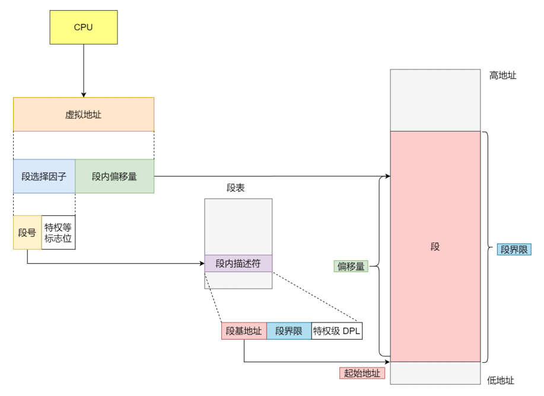
> **分段的缺点**
> - 产生较大的内存碎片
> - 为了解决内存碎片，使用内存交换swap，但是交换效率低
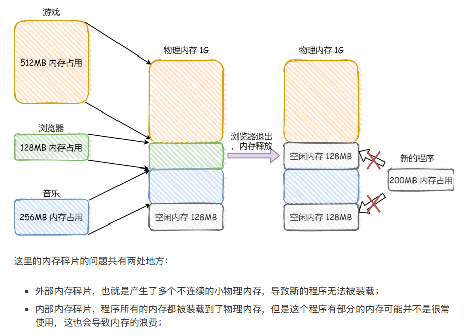


## 分页
### 地址变换
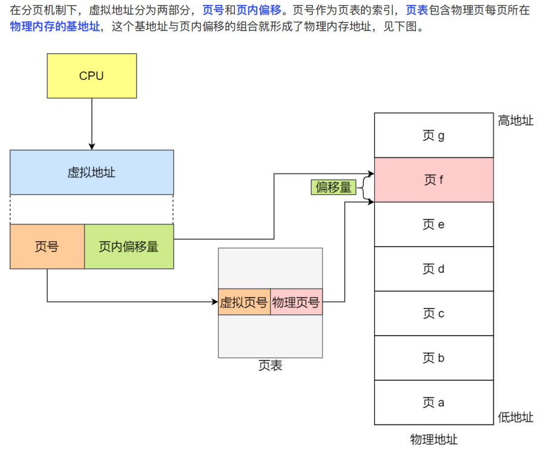
**多级页表**
对于


### 缺页中断

在现代操作系统中，分页机制是内存管理的核心概念之一。分页机制将虚拟内存分割成固定大小的块（页），通常是 4KB 或更大，称为 **虚拟页面**。物理内存也被划分为 **页框**（Page Frame）。通过 **页表（Page Table）**，操作系统将虚拟地址映射到物理地址。
 **缺页中断（Page Fault）**
当进程访问一个虚拟地址时，操作系统会检查该虚拟地址是否已映射到物理内存。如果该页面不在内存中，就会发生 **缺页中断（Page Fault）**。操作系统需要进行以下步骤：

1. **中断处理**：
   - 操作系统捕获缺页中断，并检查该页面是否是 **有效访问**，例如是否是进程试图访问其未分配的内存区域。如果是非法访问（如越界访问），操作系统通常会终止该进程。
   - 如果是合法访问，操作系统会加载缺失的页面。

2. **加载页面**：
   - 操作系统从 **磁盘或交换空间（Swap Space）** 加载缺失的页面到内存中。这时，操作系统会选择一个 **空闲的物理页框**（如果有的话）。

#### **不同情况的处理**
在缺页中断过程中，可能会遇到不同的内存管理情况，特别是当系统内存压力增大时，处理过程可能会更复杂。我们将详细讨论 **缺页中断** 时可能出现的各种情况。

---

#### **1. 进程需要的页面不在内存中**

假设进程访问一个虚拟地址，操作系统检查到该地址对应的虚拟页面没有在内存中，出现了缺页中断。此时，操作系统会按以下步骤处理：

1. **检查页面是否在磁盘中**：
   - 操作系统会检查该页面是否在 **磁盘的交换空间（swap space）** 或 **文件映射中**。如果页面在磁盘上，操作系统将从磁盘加载该页面。

2. **加载页面到内存**：
   - 操作系统将页面从磁盘交换区读取到内存中，并更新 **页表** 中该虚拟页面到物理内存页框的映射关系。

3. **恢复进程执行**：
   - 加载完成后，操作系统会恢复进程执行。

---

#### **2. 内存中没有空闲页框（内存不足）**

在虚拟内存系统中，如果进程访问的页面不在物理内存中，而且 **内存中没有空闲页框**，那么系统需要执行 **内存换页**（Page Swap）。

##### **内存换页的步骤：**

1. **选择一个页面进行换出**：
   - 操作系统需要 **选择一个不活跃的页面**（可能是当前未使用的页面）并将其写回磁盘，以释放物理内存。这时，操作系统通常会根据 **页面置换算法**（如 **LRU（最近最少使用）**、**FIFO（先进先出）** 等）选择一个页面进行换出。

2. **将页面加载到空闲的页框中**：
   - 换出页面后，操作系统会把新的页面加载到物理内存的一个空闲页框中，并更新 **页表**。

3. **恢复进程执行**：
   - 完成页面交换后，操作系统会继续执行该进程。

##### **页面置换算法**
为了决定哪些页面应该被换出，操作系统采用不同的页面置换算法。常见的算法包括：

- **LRU（Least Recently Used）**：替换最久未被使用的页面。
- **FIFO（First In First Out）**：替换最早加载的页面。
- **Optimal**：选择替换将来最久不被使用的页面（通常是理论上的理想算法，实际中难以实现）。

---

#### **3. 整个内存空间没有空闲页框**

如果物理内存不足，且 **所有页框都已被占用**，操作系统就必须进行 **内存紧缩**，即使用 **swap空间** 或将进程的一些页面 **交换出内存**。如果 **swap空间也已满**，操作系统面临严重的内存压力。

##### **处理内存空间不足的情况**

1. **使用 Swap 空间**：
   - 操作系统首先会将一些不常用的页面 **换出到硬盘的 swap 空间**。
   - 通过 **Swap** 交换空间来扩展内存，避免因内存不足而导致进程崩溃。

2. **进程挂起和延迟**：
   - 如果没有足够的内存空间并且 **swap 空间也不足**，操作系统可能会采取 **挂起进程** 或者 **延迟分配** 来腾出更多内存。
   - 如果没有足够的物理内存来继续处理进程请求，可能会导致 **系统不响应** 或 **进程崩溃**。

3. **系统崩溃或 OOM Killer 启动**：
   - 在极端情况下，如果系统内存严重不足，Linux 会启用 **OOM Killer（内存溢出杀手）**，这个机制会终止某些进程，释放内存资源，从而保证系统的稳定性。
   - 操作系统通常会选择占用内存最多的进程进行杀死，以释放内存。

---

#### **4. 进程的内存映射文件和共享内存**

在内存中，除了正常的用户进程的堆栈、代码等外，还可以通过 **内存映射文件（mmap）** 和 **共享内存（Shared Memory）** 等技术共享内存资源。

- **内存映射文件（mmap）**：将磁盘文件或设备映射到虚拟内存中，允许程序访问文件的内容而不需要显式读取和写入操作。此时，如果程序访问的内存页不在内存中，操作系统会从磁盘加载它。
- **共享内存（Shared Memory）**：多个进程共享同一块内存区域，内核会分配页面并通过页表映射共享内存区域。

当涉及到这些资源时，如果对应的页面没有在物理内存中，操作系统会处理缺页中断，加载数据并继续执行。

---

#### **5. 非常高的内存压力：Thrashing**

如果系统处于 **极端内存压力** 下，频繁的缺页中断和页面交换可能导致 **Thrashing**（内存抖动），即系统过度地执行页面置换，频繁的磁盘 IO 操作使得系统性能大幅下降。系统将花费大部分时间进行 **交换和分页**，而不是实际的工作。

##### **解决 Thrashing 问题**：
1. 增加系统物理内存。
2. 调整进程的内存使用情况，减少不必要的页面交换。
3. 使用更高效的页面置换算法。

---

#### **总结**
缺页中断是分页机制中的一种重要机制，它是进程访问虚拟内存时，操作系统无法找到相应页面的信号。操作系统会通过查找 swap 空间、加载磁盘数据、页面置换等方式来处理缺页中断。如果系统没有足够的内存或者 swap 空间，可能会导致 **进程挂起**、**内存溢出** 或者 **进程终止**，甚至出现 **Thrashing**。因此，操作系统必须精细管理内存资源，以保证系统的稳定性和高效性。


## 如何关闭swap， OOM会优先kill哪些进程
### **1. 内存只有512MB，进程分配1GB内存可以实现吗？**

在内存只有512MB的情况下，**进程申请1GB内存**通常无法成功，因为物理内存只有512MB，不足以满足1GB的需求。操作系统的内存管理机制包括了虚拟内存和换页机制，使得进程可以申请比实际物理内存更大的内存空间（例如1GB），但实际上并不是所有的内存都会同时驻留在物理内存中。

- **虚拟内存**：操作系统提供了虚拟内存机制，允许进程申请比物理内存大得多的内存空间。
- **换页机制**：当进程申请的内存超过物理内存时，操作系统会将不常用的内存页交换到磁盘上，释放物理内存给新的内存需求。这一过程被称为 **交换（Swap）** 或 **换页**。

因此，在512MB的物理内存下，**如果系统配置了足够的交换空间（swap），进程可以“虚拟上”申请到超过512MB的内存**，但实际使用的物理内存会被限制在物理内存加上交换空间的总和。

---

### **2. 如何关闭换页机制？**

关闭换页机制的目的是 **禁用交换空间（Swap）**。这样，即使进程请求的内存超过了物理内存，操作系统不会将内存页交换到磁盘，而是会引发 **内存不足** 或 **OOM（Out of Memory）** 错误。

要关闭交换空间，通常有以下方法：

1. **禁用交换文件（Swap）**：
   - 使用 `swapoff` 命令禁用所有交换空间：
     ```bash
     sudo swapoff -a
     ```
   - 如果想禁用特定的交换文件或交换分区：
     ```bash
     sudo swapoff /dev/sdX  # 假设你的交换分区在 /dev/sdX
     ```

2. **关闭 `vm.swappiness` 参数**：
   - `vm.swappiness` 控制了内存使用时操作系统将内存页面移到交换空间的倾向。设置为 0 时，内核不会倾向于将内存页面交换到磁盘。
   - 通过以下命令来设置：
     ```bash
     sudo sysctl vm.swappiness=0
     ```
   - 如果想要这个设置在重启后生效，可以将其写入 `/etc/sysctl.conf` 文件：
     ```bash
     echo "vm.swappiness=0" | sudo tee -a /etc/sysctl.conf
     sudo sysctl -p
     ```

---

### **3. OOM Kill时杀哪些进程？**

当操作系统检测到内存不足（OOM），即没有足够的物理内存和交换空间时，它会触发 **OOM Killer**（内存溢出杀手）来回收内存。OOM Killer 会通过一定的策略选择一个或多个进程来终止，以便释放内存。具体选择哪些进程，操作系统会根据以下几个因素来做决定：

- **进程的内存消耗**：OOM Killer 会倾向于终止那些占用大量内存的进程。
- **进程的优先级**：一些进程可能被标记为“重要”进程（例如系统进程），它们会被优先保护。
- **进程的性格**：操作系统会参考进程的历史信息，例如进程的 **OOM score**（内存消耗得分）。这个得分高的进程可能会被优先杀掉。
- **进程类型**：内核线程（如 `kworker` 等）通常不会被杀死，因为它们对系统的稳定性至关重要。

**具体的杀死策略：**
- **OOM Score**：每个进程都有一个 OOM score，它基于该进程的内存使用量以及进程的重要性（例如，系统进程和守护进程通常有更低的 OOM score）。分数越高，进程越有可能被杀死。
- **用户指定**：用户可以使用 `oom_adj` 或 `oom_score_adj` 文件来调节进程的 OOM 得分，从而手动控制哪些进程更可能被杀死。
  ```bash
  echo -17 > /proc/<pid>/oom_score_adj  # 给进程添加低优先级
  echo 1000 > /proc/<pid>/oom_score_adj  # 给进程添加高优先级
  ```

**总结**：
- **OOM Killer** 会选择内存消耗大、优先级低的进程来终止，以保证系统的正常运行。
- 系统会尽量避免杀死 **系统进程** 和 **关键进程**。

---

### 总结：
- 在物理内存为512MB的情况下，操作系统通常会允许进程申请1GB内存，但会通过 **虚拟内存** 和 **换页机制** 来管理实际的内存使用。
- 要禁用换页机制，可以使用 `swapoff` 命令禁用交换空间。
- OOM Killer 会根据进程的内存消耗、优先级和其他因素来选择被终止的进程，通常优先杀死 **内存消耗大** 和 **优先级低** 的进程。


## pageCache写回时机
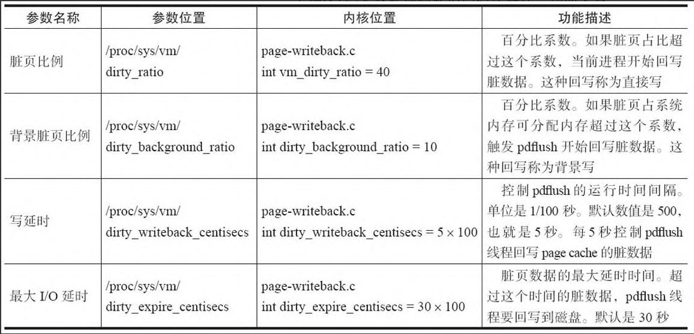


# 进程地址空间
## 内存描述符——mm_struct

太好了，你这个问题涵盖了 `mm_struct` 的整体设计思路，下面我会从结构定义、进程拷贝、区间管理、内存布局这几个角度来全面地讲解。

---

### ✅ 一、`mm_struct` 是什么？

`mm_struct` 是 Linux 内核中用于描述 **进程虚拟地址空间** 的核心结构体。
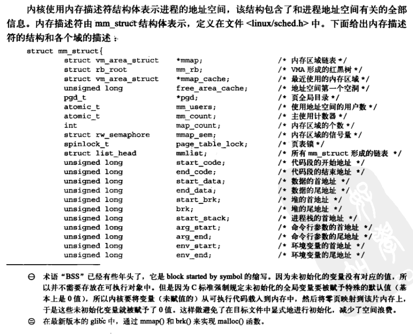
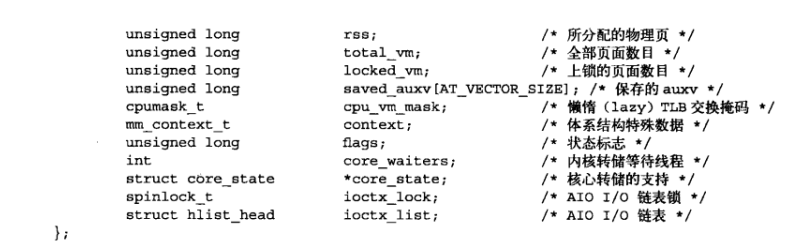
- 每个进程（准确说是每个线程组）拥有一个 `mm_struct`。
- 线程共享 `mm_struct`，而进程（`fork` 出来的）则拥有自己的 `mm_struct` 拷贝。

```c
struct mm_struct {
    struct vm_area_struct *mmap;        // 虚拟内存区域的链表头
    struct rb_root mm_rb;               // vma 区间组织为红黑树
    unsigned long start_code, end_code; // 代码段起止
    unsigned long start_data, end_data; // 数据段起止
    unsigned long start_brk, brk;       // heap（由brk系统调用管理）
    unsigned long start_stack;          // 栈地址
    pgd_t *pgd;                          // 页表基地址（顶层页表）
    ...
};
```

---

### ✅ 二、是否是独立拷贝？`mm_struct` 的继承与复制

- **线程共享一个 `mm_struct`**，即 `clone()` 时传入 `CLONE_VM`。
- **新进程则复制 `mm_struct`**，发生在 `do_fork()` 中：

```c
copy_mm() -> dup_mm()
```

复制过程大概如下：

- 创建新的 `mm_struct` 结构。
- 拷贝 `vm_area_struct`（vma）的链表 / 红黑树。
- 页表采用 **写时复制（COW）**，并不是马上拷贝所有物理页。

---

### ✅ 三、区间划分和管理（vma 管理）

进程的虚拟地址空间由多个 `vm_area_struct`（简称 `vma`）组成，每个 `vma` 表示一段具有相同权限的地址区间。

- 例如：代码段、数据段、堆、栈、mmap 区域……
- 这些 `vma` 通过：
  - 链表 `mmap` 串联
  - 红黑树 `mm_rb` 加速查找

```c
struct vm_area_struct {
    unsigned long vm_start, vm_end;
    struct vm_area_struct *vm_next;
    struct rb_node vm_rb;
    struct mm_struct *vm_mm;
    ...
};
```

---

### ✅ 四、空间布局（虚拟地址空间，自上而下）

Linux 下的虚拟地址空间布局是**“自上而下 + 自下而上”** 的混合模型：

```
0x00000000
    |
    |-- [代码段]             => text segment（start_code, end_code）
    |-- [数据段]             => data segment（start_data, end_data）
    |-- [BSS段 + 堆区]       => heap（start_brk, brk）
    |         ↑ ↑ ↑ ↑ ↑ ↑ ↑ brk/brk系统调用调整
    |
    |          ...  用户mmap空间
    |
    ↓          栈向下增长
    |-- [栈区]              => start_stack
    ↓
0xC0000000 (或更高，在64位系统)
```

- **堆** 是 brk 系统调用扩展出来的区域（可增长）。
- **栈** 向下扩展，一般设置 guard page 防止无限递归栈溢出。
- **mmap 区域** 插在堆和栈之间，用于文件映射、共享内存、动态库加载等。

---

### ✅ 五、管理功能：页表、统计、锁等

- `mm_struct` 管理整个页表结构（`pgd`）。
- 各种计数器用于统计页数、锁定页、RSS等。
- 拥有信号量 `mmap_sem` 用于控制对 `vma` 区域的并发访问。
- 支持页表回收、TLB 刷新等内存管理功能。

---

### ✅ 六、小结关键词速记：

| 方面         | 内容                                                         |
|--------------|--------------------------------------------------------------|
| 管理结构     | `mm_struct` -> 管理整个虚拟地址空间                         |
| 区间结构     | `vm_area_struct` -> 每段区域结构，用链表 + 红黑树组织        |
| 拷贝行为     | 进程拷贝时复制 `mm_struct`（COW），线程共享                  |
| 地址布局     | 代码段、数据段、heap、mmap、stack，堆向上、栈向下            |
| 管理机制     | 包含页表指针、锁、访问权限、TLB 等多种内核控制结构           |

---

## mm_users & mm_count引用计数
这是一个非常棒的内核问题，`mm_struct` 结构体中 `mm_users` 和 `mm_count` 的确都用于引用计数，但它们表示的是**不同层次的引用者**，我们来详细讲讲两者的**含义、区别和设计原因**。

---

 🔍 一句话解释

- **`mm_users`** 表示有多少个**用户空间任务（进程/线程）在使用这个 mm_struct**
- **`mm_count`** 表示有多少个**内核引用**（如文件映射、线程组、内核对象）在使用这个 mm_struct

---

### 📌 详细解释

#### ✅ `mm_users`

- 它是**用户层使用者的计数**
- 每当一个线程（task）拥有 `mm_struct` 时，这个值就会加一
- 比如：
  - 创建线程（`clone`）时，如果线程共享地址空间，那么多个线程共享同一个 `mm_struct`，每个线程会让 `mm_users++`
  - 当某个线程 `exit()` 时，它会让 `mm_users--`

**只有当 `mm_users == 0` 时**，说明已经没有线程在使用该地址空间。

---

#### ✅ `mm_count`

- 它是**内核层面引用者的计数**
- 比如以下这些情况可能增加 `mm_count`：
  - `do_execve()` 临时持有 mm_struct
  - `procfs` 中读取 `/proc/[pid]/maps` 需要保留 `mm_struct`
  - `vma` 操作需要持有 `mm`
  - 内核线程访问用户内存时调用 `use_mm()`
- **`mm_count` 减到 0 的时候，`mm_struct` 才会真正释放**

---

### 🧠 举个例子帮助理解

```c
main() {
    pthread_create(...); // 多线程，共享 mm_struct
}
```

假设有两个线程共享同一个 `mm_struct`：

- `mm_users = 2`：两个线程都在用
- `mm_count >= 2`：线程自身 + 可能还有内核持有者（如 /proc 文件系统）

当线程都退出：

- `mm_users` 变成 0，表示用户空间没人用了
- `mm_count` 可能还有值（比如内核还暂时用着）
- 当内核不再需要，`mm_count--` 到 0，才释放该 mm_struct

---

### ❓为什么要两个引用计数？

这是为了 **分离用户态和内核态的责任**，实现更好的资源管理和并发控制：

| 理由 | 说明 |
|------|------|
| **并发安全** | 内核操作 mm_struct 时，不影响用户态线程管理 mm_users |
| **资源生命周期更清晰** | 用户线程退出先释放 mm_users，内核资源再根据 mm_count 决定何时真正释放 |
| **避免提前释放** | 某些内核模块（如 `/proc`）读 mm 信息时不能因线程退出而立刻释放 mm_struct |

---

### ✅ 总结

| 字段        | 含义                                 | 触发场景                     |
|-------------|--------------------------------------|------------------------------|
| `mm_users`  | 表示多少**线程**正在使用该内存空间     | 线程创建、线程退出等         |
| `mm_count`  | 表示多少**内核模块或结构体**持有它     | 内核访问 mm_struct 的时候     |

> **只有当 `mm_users == 0` 且 `mm_count == 0` 时，`mm_struct` 才能被释放。**

---

如果你感兴趣我可以带你看下 `exit_mm()` 或 `mmput()` 的源码，看这两个计数是怎么被使用的～需要吗？ 


## 内存描述符mm_struct和内核线程
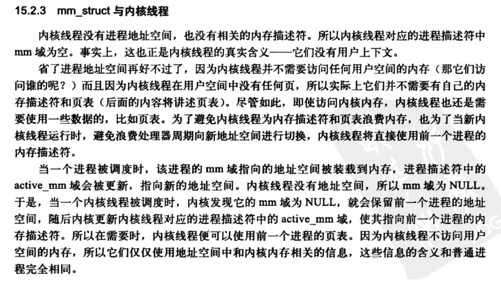

## 虚拟内存区域VMA
`vm_area_struct` 是 Linux 内核中非常核心的一个结构体，用于表示 **一个连续的虚拟内存区域**（VMA，Virtual Memory Area）。它在每个进程的地址空间中起着组织、描述、管理虚拟内存块的作用。下面我从几个方面给你清晰讲解它的作用。

---

### 🧠 一句话理解

> 一个进程的虚拟地址空间是由很多段（堆、栈、代码、映射文件等）组成的，每一段就是一个 `vm_area_struct`。

---

### 🧩 它是用来干什么的？

`vm_area_struct` 的主要职责是：**描述进程虚拟地址空间中一段连续区间的属性和映射信息**，比如：

| 属性 | 说明 |
|------|------|
| 虚拟地址范围 | 从 `vm_start` 到 `vm_end`，即这一段虚拟地址 |
| 权限标志 | 可读、可写、可执行等（在 `vm_flags` 中） |
| 对应文件 | 如果是文件映射，`vm_file` 会指向对应文件 |
| 对应的 inode | 用于页缓存管理 |
| 匿名页 | 如果是匿名映射（如堆、栈），就没有文件，但还是有页面 |
| 私有还是共享 | `MAP_PRIVATE` 或 `MAP_SHARED` |
| 页错误处理函数 | `vm_ops` 中定义如何处理 page fault |

---

### 📚 举个例子说明

比如你有如下代码：

```c
int main() {
    int *a = malloc(100); // 分配一块堆空间
    return 0;
}
```

当你执行程序时，进程的内存空间中会包含这些典型的 `vm_area_struct`：

- 一个只读的代码段（text）
- 一个可读写的数据段（data）
- 一个匿名映射的堆段（heap）
- 一个栈段（stack）
- 若干 libc 的动态链接库映射段（mmap）
- 可能还有内核分配的 `vsyscall`、`vvar` 区段等

每一段都是一个 `vm_area_struct`，在用户空间调用 `mmap()`、`brk()`、动态加载库，都会新增一个 VMA。

---

### 🧷 在结构体中你会看到这些典型字段：

```c
struct vm_area_struct {
    unsigned long vm_start;      // 起始虚拟地址
    unsigned long vm_end;        // 结束虚拟地址
    unsigned long vm_flags;      // 访问权限等标志
    struct file *vm_file;        // 文件映射时指向文件对象
    struct mm_struct *vm_mm;     // 所属的 mm_struct
    struct vm_area_struct *vm_next; // 下一块区域（链表结构）
    struct vm_operations_struct *vm_ops; // 页错误处理、open/close等钩子
    ...
};
```

---

### 🧭 它是怎么被组织的？

每个进程的 `mm_struct` 中有一个指向所有 VMA 的指针（链表头）：

```c
struct mm_struct {
    struct vm_area_struct *mmap;  // 所有 VMA 的链表
    struct rb_root mm_rb;         // 还有红黑树来加快查找
    ...
};
```

- **链表**：用于遍历所有内存区域
- **红黑树（mm_rb）**：快速查找某个地址落在哪个 `vm_area_struct`

---

### 🛠 它何时起作用？

`vm_area_struct` 主要在以下场景中使用：

1. **内存映射（mmap）**：创建新 VMA
2. **页面异常（page fault）**：找出对应 VMA 决定是否可以访问
3. **写时复制（COW）**：根据 VMA 的属性判断是否复制页面
4. **进程地址空间布局**：brk、堆栈、堆等都靠它组织
5. **执行文件（execve）**：加载 ELF 文件时创建各段的 VMA

---

### ✅ 总结

| 名称 | 内容 |
|------|------|
| 📦 作用 | 表示一个虚拟地址区间及其访问属性、映射信息等 |
| 🧱 结构 | 包含起止地址、权限、映射文件等信息 |
| 🧭 用于 | 管理虚拟内存、发生 page fault 时定位和响应 |
| 🔍 所属 | 所有 VMA 挂在每个进程的 `mm_struct` 上 |

---

如果你还想了解它是如何参与页表建立、page fault 处理等，我可以继续深入带你看～需要吗？

# linux内存管理
## 区zone
在 Linux 内核的 **物理内存管理** 中，内存被划分为不同的“区”（Zones），用于管理不同特性的内存。这些“区”是在 `struct zone` 结构体中定义的，每一个区都代表一段物理内存区域，具有相似的特性或用途。

---

### 🧭 Linux 内存管理中的主要 Zone（区）

以下是 Linux 中最常见的几种区（按出现顺序排列）：

| 区名（Zone）      | 说明 | 典型用途 |
|------------------|------|-----------|
| `ZONE_DMA`       | 用于 DMA 访问的内存，地址通常 <16MB（ISA 总线）| 早期设备或特定硬件需要的内存 |
| `ZONE_DMA32`     | 32 位地址可达的 DMA 区域，地址 <4GB | 主要用于 64 位系统上需要 DMA 的驱动 |
| `ZONE_NORMAL`    | 常规内存区域，可被内核直接映射和访问 | 内核主要使用的内存区域 |
| `ZONE_HIGHMEM`   | 高端内存，内核默认不能永久映射访问 | 用于用户空间分配，x86 中 > ~896MB  |
| `ZONE_MOVABLE`   | 可迁移内存，专门用于内存热插拔或页迁移 | 提高系统碎片整理能力 |
| `ZONE_DEVICE`    | 专门给设备映射的内存（如 GPU、NVDIMM） | 与硬件设备交互 |

---

### 🔍 各个 Zone 的详细解释：

#### 1. `ZONE_DMA`
- 这是最早定义的 Zone，用于支持 **ISA DMA**（传统 DMA） 的设备。
- 地址限制在 16MB 以内（`0x0` ~ `0xFFFFFF`）。
- 在现代系统中作用已经很小，仅某些老设备或嵌入式系统可能用到。

---

#### 2. `ZONE_DMA32`
- 出现在 64 位系统中，表示物理地址 < 4GB 的区域（32 位可寻址范围）。
- 适合那些只支持 32 位 DMA 的驱动设备。
- 用于替代传统的 `ZONE_DMA`，且比 `ZONE_DMA` 更大。

---

#### 3. `ZONE_NORMAL`
- 最常用的区域，内核可以直接通过线性映射访问（无需临时映射）。
- 典型 x86 系统中，这部分通常是从 16MB ~ 896MB。
- 主要用于内核分配，页表、slab 缓存等都从这里分配。

---

#### 4. `ZONE_HIGHMEM`
- **高端内存区**，是不能被直接映射的物理内存，只有部分可以被临时映射。
- 主要用于 **用户空间内存分配**。
- 只存在于某些架构（如 32 位 x86），在 64 位系统中通常没有这个区。

---

#### 5. `ZONE_MOVABLE`
- 从 2.6.16 内核引入，设计为可以被动态迁移的页面所在区域。
- 主要用途包括：
  - 支持 **内存热插拔**（memory hotplug）
  - 支持 **内存碎片整理**
- 内核中的不可迁移页面（如 slab、页表等）不会放在这个区。

---

#### 6. `ZONE_DEVICE`
- 为设备映射的内存预留，比如：
  - 高速 NVDIMM 持久化内存
  - GPU 显存（通过 HMM 映射）
- 不属于传统意义上的 RAM，但可以被页框管理器纳入统一管理。
- 需要设备支持和特定驱动。

---

### 📌 Zone 分布图（以 x86 为例）

```text
物理内存
┌─────────────┐  4GB
│ ZONE_HIGHMEM│
├─────────────┤  896MB
│ ZONE_NORMAL │
├─────────────┤  16MB
│ ZONE_DMA    │
└─────────────┘  0
```

在 x86-64 上，通常没有 `ZONE_HIGHMEM`，但会有 `ZONE_DMA32`：

```text
物理内存
┌───────────────┐
│ ZONE_NORMAL   │  >4GB
├───────────────┤
│ ZONE_DMA32    │  <4GB
├───────────────┤
│ ZONE_DMA      │  <16MB
└───────────────┘
```

---

### ✅ 总结

| Zone 名称    | 是否现代系统常用 | 用途概括                       |
|--------------|------------------|--------------------------------|
| `ZONE_DMA`   | ❌ 少数系统使用    | 支持老旧设备的 DMA             |
| `ZONE_DMA32` | ✅ 常见于 x86-64  | 设备 DMA 使用（<4GB）          |
| `ZONE_NORMAL`| ✅ 内核主要使用    | 可直接访问的主内存             |
| `ZONE_HIGHMEM`| ⚠️ 32 位系统中使用| 大内存支持，临时映射           |
| `ZONE_MOVABLE`| ✅ 可配置         | 支持迁移、热插拔               |
| `ZONE_DEVICE` | ✅ 新技术专用     | 非传统内存，如 GPU/NVDIMM      |

如果你需要，我可以带你看一下这些区是如何在 `bootmem` 初始化或页分配器中被使用的，或者分析具体的启动日志中 zone 分布也行。你对哪个方面更感兴趣？

## zone区中的watermark
在 Linux 内核内存管理中，`zone` 结构体表示一种“内存区域”（Zone），比如常见的 `ZONE_DMA`、`ZONE_NORMAL`、`ZONE_HIGHMEM` 等。这些区域是对物理内存的逻辑划分，用于更细粒度地管理内存。

而你提到的 `zone.watermark`（准确来说是 `zone->watermark[]`），它是内存分配和回收中非常关键的一个机制，用于控制内核如何做内存分配，什么时候触发页回收（reclaim）或页面换出（swap）。

---

### 🌊 `zone->watermark[]` 是什么？

`watermark[]` 是一个数组，通常有三个元素，分别是：

- `WMARK_MIN`（最低水位）
- `WMARK_LOW`（低水位）
- `WMARK_HIGH`（高水位）

这三种水位是内核根据当前 `zone` 的内存情况动态管理内存回收的阈值。

```c
enum zone_watermarks {
    WMARK_MIN,
    WMARK_LOW,
    WMARK_HIGH,
    NR_WMARK
};
```

它们分别代表不同的内存“警戒线”。

---

### 💡 各水位的含义

| 水位       | 含义                                                                 |
|------------|----------------------------------------------------------------------|
| `WMARK_MIN` | **最小水位线**。内核会尽量保证 `zone` 中的可用页数不低于该水位。如果低于，会强制回收页框，甚至可能阻塞分配。|
| `WMARK_LOW` | **低水位线**。当空闲页数低于该水位时，内核会尝试启动后台内存回收（Kswapd）以释放页框。|
| `WMARK_HIGH`| **高水位线**。回收线程（如 Kswapd）尝试将空闲页数恢复到这个水平以上。|

---

### 🧠 它是怎么工作的？

当某个内存分配请求到来，内核会检查当前 `zone` 中的空闲页数是否满足请求。

1. 如果空闲页数 > `WMARK_HIGH`，分配直接成功。
2. 如果空闲页数在 `WMARK_LOW` ~ `WMARK_HIGH` 之间，可能会触发轻量级回收。
3. 如果空闲页数 < `WMARK_LOW`，会唤醒内核的后台回收线程 `kswapd` 来进行内存回收。
4. 如果 < `WMARK_MIN`，一些关键分配可能会被强制阻塞，直到有足够内存被回收。

---

### 🔧 这些水位是如何设置的？

内核在启动时会根据系统总内存和 zone 的大小设置这些水位。例如：

```c
zone->watermark[WMARK_MIN] = pages_min;
zone->watermark[WMARK_LOW] = pages_min + (pages_min >> 2); // min + 25%
zone->watermark[WMARK_HIGH] = pages_min + (pages_min >> 1); // min + 50%
```

具体数值可能由 `/proc/sys/vm/min_free_kbytes` 等参数控制。

---

### ✅ 总结一句话：

> `zone->watermark[]` 就是内核内存管理中的“水位线”，它们用于判断什么时候该分配内存，什么时候该回收内存，是内核保持内存健康和响应能力的重要机制。

---

## 低级页page的获取方式
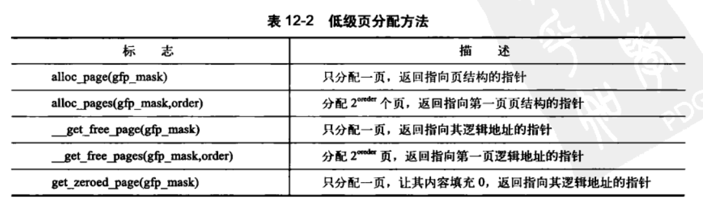


## gfp_mask标志
### 行为修饰
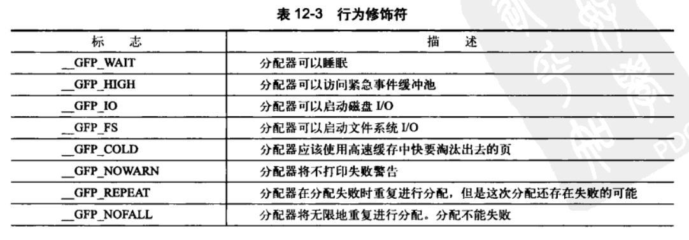
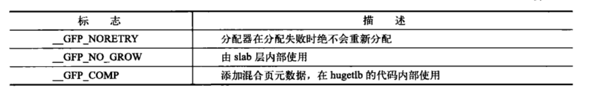

### 区修饰
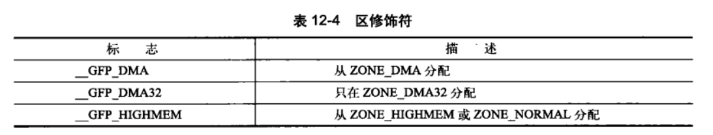

### 类型修饰
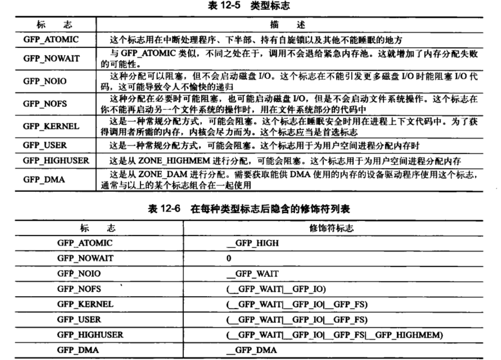

### 使用标志的情景
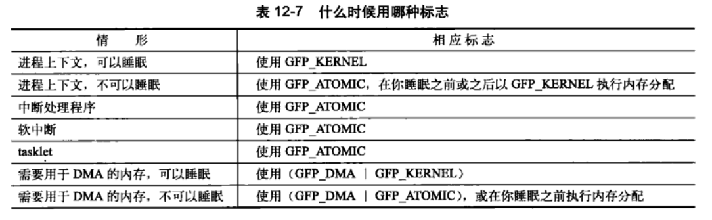

## slab层
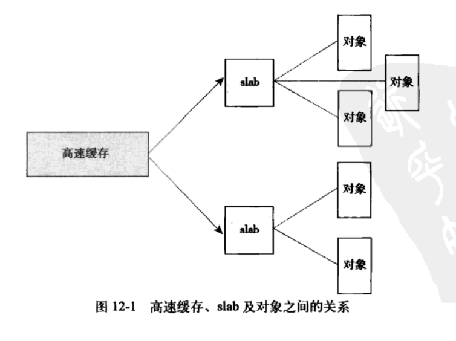


### slab和span的区别
这个比喻你其实说得很有感觉了！`slab` **确实可以理解为内核中的一种“高性能内存池”机制**，它和你说的 **内存池中的 span/page 结构管理思路是非常相似的**。我们来详细对比和讲讲：

---

### 🧠 你可以这样理解：

> **slab = 一种高效的对象内存管理方式，管理的是多个同类型对象的缓存区（缓存池）**，而不是零散的页或字节。

---

### 🔍 slab 和你说的“高并发内存池中 span 管理页面”的对比

| 项目                     | slab（Linux 内核）                          | span（如 tcmalloc 或 jemalloc）               |
|--------------------------|---------------------------------------------|---------------------------------------------|
| 管理的单位               | 同一类型的 **小对象集合**                  | 一组连续页面（PageSpan）                    |
| 管理方式                 | 对象划分为小块并缓存在 Slab 中              | 页面划分为对象块，对象分配和回收            |
| 内存来源                 | 通常从页分配器分配 **多个页** 构成一个 slab | 从页堆中申请页面，组成 span                  |
| 分配方式                 | 基于 **缓存分配器 kmem_cache_t**            | 基于 thread-local 的分配器                   |
| 并发优化                 | CPU 本地 cache（如 per-CPU slab）            | thread-local cache，锁优化                   |
| 目的                     | 减少频繁的分配/释放开销，复用对象空间       | 高并发场景下快速小对象分配                  |

---

### 🔧 slab 的结构简化理解

你可以这样抽象理解 slab 的三层结构（从大到小）：

1. **slab cache（kmem_cache）**：每一种类型对象一个 cache，例如 dentry cache、inode cache
2. **slab**：由若干页组成的“对象池”，每个 slab 包含若干个相同大小的对象块
3. **对象（object）**：从 slab 中切出来的固定大小内存块，供内核结构体使用

---

#### ✅ 举个类比小结：

- **slab cache** ≈ 一个高并发内存池（比如 thread-local pool）
- **slab** ≈ 一组页组成的 span
- **对象块** ≈ span 中的小块 memory slot

你说的 span 是一个“页面的管理单元”，而 slab 是“一堆小对象的管理单元”，**但两者目的非常一致**：在高频分配场景下提高性能、降低碎片、避免频繁向主堆申请。

---

### 🧩 为什么 Linux 要用 slab 而不是直接用 `malloc` 或 `get_free_pages()`？

- 频繁分配释放小对象会产生严重碎片
- 系统很多对象（如 task_struct、inode）大小固定，复用效率高
- 分配器要高效支持并发：slab 支持 **CPU 本地缓存**，减少锁竞争
- 支持对象构造器/析构器（比如创建时初始化、释放时销毁）

---

### 🧠 总结一句话：

> **你可以把 slab 理解为一个专门为小对象设计的内核级“高性能对象缓存池”，它和高并发内存池中 span 的理念非常类似，都是按块管理内存，避免频繁向系统要页，提高分配效率。**

---

如果你想，我也可以画个图帮你可视化 slab 分配流程（比如 kmem_cache -> slab -> object），或者带你看看 slab 和 slub 的区别、甚至 slab 源码核心结构体 `kmem_cache` 的设计。你想往哪块继续深入？


## 高端内存映射
“高端内存映射”是 Linux 内核内存管理中的一个非常有代表性的概念，尤其在 **32 位系统** 中非常重要。它涉及到内核如何“看到”和“使用”超过直接映射范围的物理内存。我们来一步一步解释这个概念。

---

### ✅ 一句话概括：

> **高端内存映射（High Memory Mapping）指的是内核通过动态映射机制，访问那些无法直接映射到内核虚拟地址空间的物理内存区域。**

---

### 🧠 背景知识：为什么会有高端内存？

在 **32 位系统** 中，虚拟地址总共是 4GB：

```
[ 0x00000000 ~ 0xFFFFFFFF ] => 4GB 虚拟地址空间
```

为了简化管理，Linux 通常会把这个 4GB 拆分为两部分：

| 范围               | 用途         |
|--------------------|--------------|
| 0x00000000 ~ 0xBFFFFFFF（0 ~ 3GB） | 给用户空间进程 |
| 0xC0000000 ~ 0xFFFFFFFF（3GB ~ 4GB） | 给内核空间     |

也就是说，**内核最多只能直接映射 1GB 的物理内存**。

👉 那如果机器有 2GB、4GB 甚至 16GB 内存呢？

答案就是：**超出这 1GB 的部分，叫做“高端内存（HighMem）”**，内核不能直接访问它，只能通过特定机制“映射”进来。

---

### 📦 高端内存（HighMem） vs 低端内存（LowMem）

| 类型       | 地址范围        | 是否可直接映射？ | 是否永久驻留内核虚拟地址？ |
|------------|------------------|-------------------|------------------------------|
| 低端内存   | 0 ~ 896MB        | ✅ 是              | ✅ 是                         |
| 高端内存   | > 896MB（~1GB）  | ❌ 否              | ❌ 否，需要动态映射            |

> 896MB 是因为 Linux 还要保留一些内核空间（比如页表、vmalloc、fixmap 等）

---

### 🛠️ 高端内存的“映射”怎么做？

为了访问高端内存，内核提供了以下几个机制：

#### 1. `kmap()` / `kunmap()`
- 将某个页临时映射到内核空间的固定区域
- 一次只能映射少量页（有 slot 限制）
- 使用时必须加锁，避免并发冲突
- 用完记得 `kunmap`，否则会内存泄漏或错误访问

```c
void *vaddr = kmap(page);
// 访问 page 的数据
kunmap(page);
```

---

#### 2. `kmap_atomic()` / `kunmap_atomic()`
- 原子映射，效率更高
- 禁止抢占（preempt）和中断，适合中断上下文
- 用于短时间访问

---

#### 3. `vmap()` / `vunmap()`
- 把多个物理页映射成连续虚拟地址
- 通常用于创建大块的内核缓冲区（如 vmalloc）

---

### 🔄 举个形象的例子：

你可以想象：

> 内核空间像一个小厨房（1GB），但你的仓库（物理内存）有 4GB。厨房只能摆下 1GB 的食材，所以你必须用推车（`kmap`）把食材从仓库搬进厨房，用完再退回去。

---

### 🚨 为什么 64 位系统没有这个问题？

因为 64 位地址空间极大，内核可以直接映射所有物理内存，不需要区分低端/高端内存了，**高端内存管理在 64 位系统上已经被淘汰**。

---

### ✅ 总结一句话：

> **高端内存映射是 32 位 Linux 为了访问超过直接映射范围的物理内存（>896MB）而设计的一种动态映射机制，主要通过 `kmap()`、`kmap_atomic()` 等函数把高端页临时映射到内核可见的虚拟地址。**

---

如果你想更深入，我们可以看 `kmap()` 背后的页表操作原理，或者看看高端内存在 I/O 子系统（如文件缓存）中的应用场景，你想往哪个方向继续了解？


## mmap的底层实现
`mmap` 是 Linux 提供的一种将文件或内存映射到进程虚拟地址空间的机制。它的底层实现依赖于 **虚拟内存管理、页表映射和页错误处理机制**。

我们可以从两个角度深入讲解 mmap 的实现原理：

---

### 🧩 1. 文件映射（File-backed Mapping）

#### 🧷 调用方式
```c
void* addr = mmap(NULL, size, PROT_READ | PROT_WRITE, MAP_SHARED, fd, offset);
```
把文件 `fd` 从 `offset` 开始的 `size` 字节，映射到当前进程的虚拟内存空间。

---

#### ⚙️ 底层实现流程：

##### 📌 步骤 1：创建 VMA（虚拟内存区域）
- `mmap` 调用通过系统调用进入内核，最终调用 `do_mmap()`。
- 内核为该映射创建一个新的 **`vm_area_struct`（VMA）**，表示这块虚拟内存区域。

##### 📌 步骤 2：建立文件与 VMA 的关联
- VMA 的 `vm_file` 字段指向文件对象 `struct file *`。
- 文件 inode 对象中定义了操作函数 `file_operations->mmap()`，以决定如何响应页错误。

##### 📌 步骤 3：延迟分配（懒加载）
- 并不立即分配物理页，而是“**按需分配**”，只有当程序访问该页时，才触发缺页异常。

##### 📌 步骤 4：缺页中断处理
当访问这段虚拟地址时：
- 发生缺页异常，进入内核。
- 由页错误处理器（`do_page_fault()`）调用 `file->f_op->mmap()`。
- 读取磁盘上的文件内容到物理页，更新页表，把物理页映射到虚拟地址上。

---

#### ✅ 特点：
- 文件映射可以是私有 (`MAP_PRIVATE`) 或共享 (`MAP_SHARED`)。
- 多个进程可以映射同一个文件，达到共享内存目的。
- 用于共享库、内存映射 IO、大文件读取等场景。

---


### 文件映射访问pagecache的流程
是的，你说得完全正确 ✅ ——在使用 **文件映射（file-backed `mmap`）** 的时候，**页缓存（Page Cache）** 的访问确实是通过 **inode** 来实现的。

我们可以更系统地解释一下这个过程：

---


当你通过 `mmap` 映射一个文件，并在用户态访问该映射地址时，整个过程如下：

---

#### 🧩 1. 页错误触发

- 你访问一个尚未建立物理映射的虚拟地址时，会触发缺页中断（page fault）。
- 内核执行 `do_page_fault()`，定位到对应的 `vm_area_struct`，发现这是一个 file-backed mapping。

---

#### 📌 2. 通过 inode 获取 page cache

1. **找到文件的 inode**
   - 每个打开的文件都对应一个 `inode`（`struct inode`），其中保存了文件元数据。
   - 映射关系由 `vm_area_struct->vm_file->f_inode` 追溯得到。

2. **访问 page cache（页缓存）**
   - 内核通过 `inode->i_mapping` 得到 `address_space`，这是管理该文件页缓存的核心结构。
   - 页缓存通过 radix tree 或 xarray（新版本内核）组织，每一页对应文件偏移（page index）。

3. **查找是否已有缓存页**
   - 使用 `find_get_page(mapping, index)` 查询页缓存中是否已有对应页。
   - 如果有，就映射这页；如果没有，就从磁盘读取后放入 page cache，并建立映射。

4. **建立映射**
   - 建立该虚拟地址和物理页的页表映射，并设置访问权限。
   - 用户程序下次访问这个地址就直接命中物理内存。

---

#### 🧠 数据结构关联图（核心路径）：

```
用户地址 --> vm_area_struct
                  |
               vm_file
                  |
               file->f_inode
                      |
                   inode
                      |
               inode->i_mapping
                      |
                page cache (xarray)
                      |
                 -> 找不到？ -> 读磁盘 -> 填充缓存
                 -> 找到？   -> 直接使用
```

---

#### ✅ 总结一句话：

> 使用文件映射时，内核确实是通过 **inode 的 i_mapping** 成员来访问该文件的页缓存（page cache），这就是文件映射和 page cache 联系的桥梁。

---

如果你对这个路径的源码实现感兴趣（例如 `handle_mm_fault` ➜ `filemap_fault` ➜ `page_cache_ra_unbounded`），我也可以给你源码导读版本~ 😎 要不要深入一下？


### 💭 2. 匿名映射（Anonymous Mapping）

#### 🧷 调用方式
```c
void* addr = mmap(NULL, size, PROT_READ | PROT_WRITE, MAP_PRIVATE | MAP_ANONYMOUS, -1, 0);
```

> 匿名映射不关联任何文件，常用于动态分配内存，比如线程栈、`malloc` 的大块分配。

---

#### ⚙️ 底层实现流程：

##### 📌 步骤 1：创建匿名 VMA
- `do_mmap()` 创建 `vm_area_struct`，但 `vm_file = NULL`，表示匿名。
- 通常被挂在当前进程 `mm_struct->mmap` 链表上。

##### 📌 步骤 2：按需分配页
- 一开始并没有实际分配物理内存。
- 当进程访问该页时，触发 **缺页中断**。

##### 📌 步骤 3：缺页处理
- 页错误处理器分配一页物理页（通常是清零页）。
- 将该物理页映射到对应虚拟页（更新页表）。
- 如果是 `MAP_PRIVATE`，页具有写时复制（COW）特性。

---

#### ✅ 特点：
- 更灵活，可以映射任意位置。
- 可以用于 IPC（共享内存）、线程栈、大量 malloc、大页等。
- `mmap + MAP_ANONYMOUS + MAP_SHARED` 可以配合 `/dev/shm` 实现多进程共享内存。

---

### 🧠 总结图示（内核结构关联）：

```
+-------------------+               +----------------------+
| User Virtual Addr | ---> VMA ---> | vm_area_struct       |
+-------------------+               |  vm_file -> file     |
                                     |  vm_ops  -> nopage   |
                                     +----------------------+
                                                |
                          +---------------------+
                          | On Page Fault       |
                          v
                 +------------------+
                 | do_page_fault()  |
                 +------------------+
                          |
          +---------------+---------------+
          |                               |
 +----------------+             +------------------+
 | File Mapping   |             | Anonymous Mapping|
 |  read file     |             |  alloc new page  |
 +----------------+             +------------------+
```

---

### ✅ 总结对比

| 特性           | 文件映射 mmap            | 匿名映射 mmap            |
|----------------|---------------------------|---------------------------|
| 是否关联文件   | 是                        | 否                        |
| 是否支持共享   | 是 (`MAP_SHARED`)         | 是                        |
| 分配时机       | 懒加载，访问才分配页       | 同上                     |
| 页错误处理     | 由文件 inode 定义的回调     | 分配空白物理页            |
| 应用场景       | 映射文件、共享库、大文件IO | 内存池、共享内存、线程栈等 |

---

如果你想更深入理解具体的数据结构如 `vm_area_struct`、`mm_struct`、页表关系等，我也可以带你一步步分析源码路径（如 `do_mmap`, `handle_mm_fault` 等）。是否需要继续？

## Linux内存分配算法组成
在 Linux 中，**内存分配算法**是整个内存管理子系统的核心部分之一，针对不同的粒度和使用场景，有多种分配算法协同工作。下面我会按**分配粒度**从大到小，系统地介绍这些算法及其原理。

---

### 🧠 一、整体结构

内存分配一般分为三大类：

| 级别          | 场景                              | 算法                         |
|---------------|-----------------------------------|------------------------------|
| 页级分配（大） | 内核中给子系统分配整页（4KB等）    | **伙伴系统（Buddy System）** |
| 小块分配（小） | 内核对象、slab缓存等小于页的对象   | **Slab / Slub / SLOB**       |
| 用户态内存分配 | `malloc`/`brk`/`mmap`             | glibc封装 + 上层映射         |

---

### 📦 二、Buddy System（伙伴系统）

#### ✅ 用于：
- 分配物理页（通常按 2ⁿ 个页框分配，如 1、2、4、8 页）
- 分配最小单位：一个页框（4KB）

#### ✅ 原理：
1. 内存划分为多个 2ⁿ 大小的块。
2. 当申请一个 4KB 页时：
   - 如果当前没有空闲的 4KB，就从更大的块（如 8KB）分裂。
   - 分裂后剩下的部分称为“伙伴”。
3. 释放时会尝试和伙伴块合并，提升连续性。

#### ✅ 优点：
- 分配速度快
- 适合页级别、连续内存需求（如 DMA）

#### ✅ 缺点：
- **内存碎片严重**

---

### 🧩 三、小块内存分配（Slab 系统）

针对 kernel 中的小结构体（如 task_struct、inode 等）

#### 有三种主要实现：
| 名称   | 特点                                 | 使用场景           |
|--------|--------------------------------------|--------------------|
| Slab   | 最早引入，复杂但缓存命中率高          | 老系统              |
| **Slub** | 默认使用，简化设计，效率更高           | 主流内核（默认）     |
| SLOB   | 适合嵌入式系统，占用更小               | 小内核、设备        |

#### ✅ Slab/Slub 分配机制：

- 针对每种类型的对象（如 inode）建立 **缓存区（cache）**
- 每个缓存区管理若干内存块（slab）
- 每个 slab 是多个连续页，内部再划成等大小对象
- 管理已分配、未分配对象，快速重用，避免频繁 malloc/free

---

### 🧮 四、用户空间内存分配（malloc）

用户空间内存分配（如 `malloc`）其实是调用了 glibc 封装的接口，底层依赖：

- **brk**：用于小块、连续增长（传统堆区）
- **mmap**：用于大块分配或碎片控制（通常大于 128K）

#### malloc 内部算法（ptmalloc）：
- **bins链表管理不同大小的块**
- **fast bin / small bin / large bin**
- 利用 chunk 的前4~8字节管理空闲状态

---

### 🎯 总结对比

| 算法     | 用于                 | 粒度      | 管理方式        | 优点                 |
|----------|----------------------|-----------|------------------|----------------------|
| Buddy    | 分配物理页框         | 页（4KB） | 伙伴合并/分裂     | 快速、支持连续页     |
| Slab/Slub| 分配内核对象小块     | 小于页    | cache + slab池   | 缓存命中、避免碎片   |
| malloc   | 用户空间内存管理     | 任意      | bins管理          | 灵活、与 libc 配合   |

---

## 内存交换
**内存交换（Memory Swapping）** 是操作系统为了缓解物理内存不足时，将暂时不活跃的内存页从 **物理内存** 转移到 **磁盘空间（swap空间）** 的一种机制。

---

### 🧠 一、什么是内存交换（Swapping）？

内存交换 ≠ 换页（paging）

- **Paging（分页）**：将虚拟内存划分为页，按需映射到物理内存。
- **Swapping（交换）**：当**物理内存紧张**，把 **暂时不用的页（inactive pages）** 转移到磁盘上（swap 分区或 swap 文件），腾出物理内存给更紧急的任务使用。

---

### 📌 二、为什么要内存交换？

#### 原因：

1. **物理内存有限**  
   当同时运行的进程过多，内存不够时，就需要牺牲一些暂时没在用的内存页。

2. **避免 OOM（Out of Memory）**
   如果没有 swap，内存耗尽时系统就只能 **直接杀死进程**。

3. **提高内存使用率**  
   把长期闲置的数据（如休眠的后台服务）挪出去，把宝贵的 RAM 留给更活跃的任务。

---

### 🔍 三、内存交换何时发生？

内核通过**页面回收机制（page reclaim）**判断是否需要进行交换，主要由 **内存压力（memory pressure）** 触发：

#### 触发条件：

| 情况                                   | 说明                                       |
|----------------------------------------|--------------------------------------------|
| 可用内存（free）低于阈值               | 内核通过 `vm.min_free_kbytes` 来判断         |
| 页缓存/匿名页太多                      | 导致活跃内存挤压                           |
| 系统调用申请新页时无可用页             | 比如 `malloc()` 后写入                      |
| 内核后台线程 `kswapd` 检测内存不足      | 启动回收或交换                             |
| 极端情况：`OOM Killer` 被触发           | 无法交换时，系统会杀掉进程以释放内存       |

---

### ⚙️ 四、交换过程做了什么？

1. `kswapd` 或直接触发交换：
2. 扫描页表 → 找到不活跃页
3. 将页写入 **swap 区（磁盘）**
4. 修改页表为 **swapped out**
5. 清理该页对应的物理内存
6. 下次访问这个页时，会触发**缺页中断**，从 swap 区恢复回来

---

### 💣 五、交换带来的问题

- **严重拖慢性能**（因为磁盘速度远低于内存）
- **频繁交换 = 系统压力过大**
- 若系统频繁 swap，说明内存不足，应优化程序或扩容

---

### 📊 六、如何查看/控制内存交换？

#### 查看：

```bash
# 当前 swap 使用量
free -m

# 详细信息
cat /proc/meminfo | grep Swap

# 交换活动（vmstat 中 si/swap in，so/swap out）
vmstat 1
```

#### 设置 swap 策略：

- `vm.swappiness`（0 ~ 100）
  - 数值越大越倾向于交换，默认是 60。
  - 可通过 `sysctl -w vm.swappiness=10` 动态设置。

---

### 📝 小结

| 内容         | 说明                                             |
|--------------|--------------------------------------------------|
| 是什么       | 将内存页写到磁盘 swap 空间                        |
| 为什么需要   | 避免内存耗尽、提高内存利用率                       |
| 什么时候发生 | 可用内存不足、内存压力大时                         |
| 影响         | 性能下降、系统响应慢、频繁 swap 表示内存不够       |
| 查看方式     | `free`, `vmstat`, `top`, `/proc/meminfo`          |

如果你希望我结合 Linux 系统中 swap 的实现细节（如 swapper/kswapd、swap cache、write-back 过程等）来进一步说明，也可以展开说说。


## linux内存交换底层实现
当然可以，下面我们结合 Linux 系统中的具体实现来深入理解 **swap 的内部细节机制**，包括核心组件 `kswapd`、`swapper` 线程、`swap cache` 缓存区、`write-back` 回写过程等内容。

---

### 🧠 一、参与 swap 的核心组件概览

| 组件名         | 作用                                                                 |
|----------------|----------------------------------------------------------------------|
| `kswapd`       | 内核后台线程，负责监控内存压力，回收内存、触发 swap                   |
| `direct reclaim` | 内存申请时若无可用内存，当前进程主动进行内存回收                     |
| `swapper` / `pid 0` | 系统空闲进程，负责最初启动、调度空闲、没有直接关系于 swap（早期名称） |
| `swap cache`   | 位于 page cache 中的 swap 专属页缓存，减少 swap in/out 的 I/O 次数     |
| `page reclaim` | 内核回收内存机制，包括页回收、换出、写回等                           |

---

### ⚙️ 二、swap 工作机制详解（分步骤）

#### ✅ 1. 内存紧张监测

- Linux 中的 `kswapd` 是一个内核线程，持续运行在后台。
- 当内存压力高（可用内存低、active/inactive 页比例不合适）时，它会被唤醒进行回收。

> 触发条件如 `/proc/meminfo` 中 `MemFree`、`Inactive`、`Active`、`Dirty` 等字段指标下降。

---

#### ✅ 2. 页回收（Page Reclaim）

页面回收策略分为两类页：

- **匿名页（anonymous pages）**：程序运行数据（如 heap/stack）
- **文件页（file-backed pages）**：来自磁盘文件的页（比如代码段、mmap 映射文件）

Linux 把内存页分为 Active 与 Inactive：

- 优先从 **Inactive 区** 回收（LRU机制管理）
- 匿名页会被 swap 出（写入 swap 区）
- 文件页可直接丢弃（从 page cache 删除，需再用再读）

---

#### ✅ 3. swap out（换出页）

若页不能立即回收（如匿名页），则要 **写入 swap 区**，过程如下：

##### 📂 swap cache

- **swap cache** 是 page cache 的一部分，是临时缓冲区。
- 写入 swap 前，先放入 swap cache，避免短时间内频繁 swap in/out。
- swap cache 提供 "写一次、读多次" 的机制，避免不必要的磁盘 I/O。

##### 🚚 write-back（回写）

- 页面被写入 swap 分区（或 swap 文件）
- 页表项被更新为 "swapped out"
- 页面可以被物理内存释放

写入的页结构体（`struct page`）记录了 swap entry 信息，之后需要 swap in 时可定位磁盘位置。

---

#### ✅ 4. swap in（换入页）

当一个进程访问了被 swap 出的页：

- 会触发缺页中断（page fault）
- 内核通过页表中的 swap entry 定位到 swap 区
- 将页重新读入内存，更新页表项
- 放入 **active 区**（并可能进入 swap cache）

---

### 🔍 三、数据结构与关键模块

| 名称              | 说明                                                     |
|-------------------|----------------------------------------------------------|
| `struct page`     | 内存页的核心结构，记录状态、所属文件、是否在 swap 等信息 |
| `swap_info_struct`| 每个 swap 区域的描述结构，存储位图等                     |
| `swap_map`        | 记录每个 swap entry 是否被使用                           |
| `vm_area_struct`  | 虚拟内存区域结构（每个 mmap 区域一个）                   |
| `mm_struct`       | 进程内存管理信息，包括页表根、VMA 列表等                 |

---

### 🧪 四、实际相关内核函数（仅供了解）

- `kswapd()`：后台回收线程
- `try_to_free_pages()`：回收内存核心函数
- `add_to_swap()` / `swap_writepage()`：写入 swap
- `do_swap_page()`：缺页中断处理，执行 swap in
- `pagevec_lru_move_fn()`：页从 active/inactive 列表迁移

---

### 📊 五、swap vs 页缓存 vs 文件 I/O

| 类型        | 位置         | 对象                  | 可被丢弃？ | 回写机制              |
|-------------|--------------|-----------------------|-------------|-----------------------|
| swap cache  | page cache   | 匿名页/写时复制页      | ❌ 否       | 必须写入 swap 分区    |
| file cache  | page cache   | 磁盘文件（代码/数据）  | ✅ 是       | 脏页回写磁盘          |
| I/O buffer  | 块设备缓冲区 | 非页粒度的数据块       | ✅ 是       | 依赖 flush 机制        |

---

### ✅ 小结

- `kswapd`：内核线程，感知内存压力自动回收/交换页
- `swap cache`：缓存 swap 页，减少 I/O
- `write-back`：将页写入 swap 区，释放内存
- `swap in`：缺页时从 swap 区恢复
- 整套机制的目标是 **在保持系统稳定的前提下最大化内存利用率**

---

如你希望深入源码层面，如 `mm/page_alloc.c`, `mm/vmscan.c`, `mm/swapfile.c` 结构分析或调试工具（如 `perf`, `vmstat`, `slabtop`）使用，我也可以继续展开～


## 在一台32位的Linux机器上，用malloc去申请6个G的内存能成功吗？4个G呢？3个G呢？
在32位Linux系统下，`malloc`申请内存的成功与否主要受虚拟地址空间限制，而非物理内存大小。以下是详细分析：

---

### 一、32位系统的内存限制
1. **虚拟地址空间上限**  
   32位系统的虚拟地址空间为4GB（2^32），但这部分空间被划分为 **用户空间**（用户进程可用）和 **内核空间**（操作系统保留）：
   • 默认配置：用户空间3GB + 内核空间1GB（常见于Linux系统）；
   • 特殊配置：用户空间2GB + 内核空间2GB（某些场景下，如Windows兼容模式）。

2. **实际用户进程可用内存**  
   用户进程的可用内存空间需扣除 **代码段**、**数据段**、**栈**、**共享库**等占用的区域，因此实际可分配的堆内存上限通常小于理论用户空间大小。

---

### 二、申请不同大小内存的结果
#### 1. **申请6GB内存**  
   • **必定失败**：  
     32位系统的总虚拟地址空间仅为4GB，用户空间上限为3GB，远小于6GB。`malloc`会直接返回`NULL`。

#### 2. **申请4GB内存**  
   • **失败**：  
     即使物理内存和交换空间足够，用户空间上限（3GB）仍无法容纳4GB的虚拟内存请求。`malloc`返回`NULL`。

#### 3. **申请3GB内存**  
   • **理论上可能成功，但实际受限**：  
     ◦ **用户空间配置影响**：若系统配置为3GB用户空间，且程序启动时未占用其他内存区域（如代码段、栈等），可能成功分配；
     ◦ **实际场景失败**：程序自身代码、数据段和栈已占用部分空间，剩余堆空间通常不足3GB，导致`malloc`失败。

---

### 三、关键补充说明
1. **物理内存与虚拟内存的关系**  
   `malloc`申请的是虚拟内存，其成功与否与物理内存无关。即使物理内存足够，若虚拟地址空间不足仍会失败。

2. **大内存分配的机制**  
   • **阈值机制**：`malloc`对超过128KB的请求会通过`mmap`分配（位于文件映射区），但该区域仍属于用户空间的一部分；
   • **内存碎片影响**：频繁分配/释放可能导致碎片化，进一步降低实际可用内存上限。

3. **特殊配置的可能性**  
   通过内核参数调整（如`vm.overcommit_memory`），可允许超量虚拟内存分配，但这会导致访问时触发OOM（Out-of-Memory）崩溃，而非`malloc`阶段报错。

---

### 四、总结
| **申请大小** | **能否成功** | **原因** |
|--------------|--------------|----------|
| 6GB          | ❌ 失败       | 超过32位系统的4GB虚拟地址空间上限 |
| 4GB          | ❌ 失败       | 超过用户空间上限（默认3GB） |
| 3GB          | ⚠️ 可能失败   | 用户空间理论可达3GB，但实际被其他内存区域占用 |

**建议**：若需处理大内存任务，应升级至64位系统，其用户空间可达128TB以上。

## 为什么32位申请4g会失败，os不会通过swap机制来满足吗？
在 **32 位操作系统中**，**申请 4GB 内存通常不会成功**，原因主要涉及 **虚拟地址空间的限制** 和 **操作系统的地址空间布局策略**。

---

### 🔢 一、32 位地址空间的上限

32 位 CPU 的虚拟地址空间最大是：

```
2^32 = 4,294,967,296 字节 = 4GB
```

这意味着单个进程最多只能“看到”4GB 的虚拟地址空间。

---

### 🧱 二、操作系统的地址空间划分（用户态 / 内核态）

操作系统不会把这整 4GB 全分给用户进程。常见的分配方式如下：

| 区域       | 大小       | 描述                           |
|------------|------------|--------------------------------|
| 用户空间   | 3GB（0x00000000 ~ 0xBFFFFFFF） | 给用户进程使用                   |
| 内核空间   | 1GB（0xC0000000 ~ 0xFFFFFFFF） | 系统内核使用，不可被用户访问     |

这也就意味着：
> **用户进程最多只能申请 3GB 虚拟内存！**

在 Windows 下甚至更保守（默认 2GB 用户，2GB 内核），除非使用特殊参数 `/3GB`。

---

### 💥 三、为什么不能申请完整的 3GB？

实际情况中，这 3GB 虚拟地址空间也被系统预留了很多区域，比如：

- 堆
- 栈
- 动态库（shared libraries）
- 内核映射区域（有些可能映射进用户空间）
- 保留区域（guard pages、memory-mapped IO）

所以就算你调用：

```c
malloc(3 * 1024 * 1024 * 1024);
```

很可能也会失败，**因为没有连续的、足够大的虚拟地址空间可用**。

---

### ✅ 四、是否可以申请 4GB？

#### 1. **不可能在 32 位进程中完整分配 4GB**
- 因为虚拟地址上限是 4GB。
- 进程的地址空间总要预留给内核。

#### 2. **PAE（Physical Address Extension）≠ 进程能申请更多**
- PAE 能让系统使用超过 4GB 的物理内存（最多 64GB），
- 但单个进程的虚拟地址空间仍然最大是 4GB（一般是 3GB 用户 + 1GB 内核）。

---

### 🧠 总结一句话：

> **32 位操作系统下的进程不能成功申请 4GB 内存，最多只能使用约 3GB（甚至更少）的虚拟地址空间。**


# linux页缓存和页回写
## address_space
> 一个文件可以被多个VMA(vm_area_struct)虚拟内存地址标识，但是这个文件**只能有一个**address_space(物理上的)在[inode结构](@ref_inode)中被使用
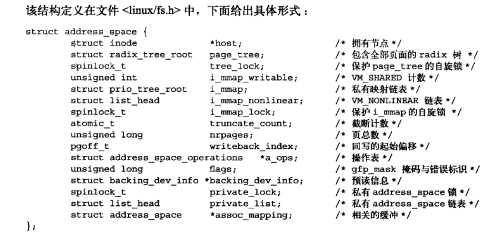

`address_space` 是 Linux 内核中一个非常核心的数据结构，负责描述**文件或块设备在页缓存（page cache）中的映射关系**。这个结构体定义在 `<linux/fs.h>` 中，是 VFS（虚拟文件系统）的一部分，它**不是描述虚拟地址空间的，而是描述文件在内存中的缓存（即物理页）映射**。

---

### 🧠 一句话总结

> `address_space` 代表“**文件的数据在内存中如何组织**”，也就是文件页缓存的“视图”。

---

### 🌟 address_space 是什么？

每个打开的 **文件**（或者说每个 inode）都会关联一个 `address_space`，它描述了：

- 文件中的哪些偏移位置已被映射到了物理页
- 这些物理页是否是脏的、是否在回写中
- 发生缺页时如何从磁盘读取
- 写回时如何同步到磁盘

> ✅ 一个文件对应一个 inode，一个 inode 通过 `i_mapping` 字段指向它的 `address_space`。

---

### 📚 举例理解

你打开一个文本文件 `file.txt` 并读取内容，内核会做：

1. 查到 `file.txt` 的 `inode`
2. 得到 `inode->i_mapping`，这是该文件的数据在内存中的表示
3. 根据文件偏移，查找对应页是否在 `address_space` 的页缓存中
4. 不在，就调用 `readpage()` 加载磁盘数据进来，放入 `page cache`
5. 用户空间最终通过 `copy_to_user()` 拷贝到用户缓冲区

---

### 📦 结构体解析（关键字段）

```c
struct address_space {
    struct inode *host;               // 所属 inode
    struct xarray i_pages;            // 文件页缓存，xarray 替代 radix tree
    atomic_t nrpages;                 // 当前缓存的页数
    spinlock_t tree_lock;             // 保护页缓存结构
    const struct address_space_operations *a_ops; // 缺页、回写等操作函数
    pgoff_t writeback_index;          // 下次回写的页索引
    ...
};
```

#### 📘 字段说明：

| 字段 | 含义 |
|------|------|
| `host` | 所属的 inode |
| `i_pages` | 以页号为索引的页缓存结构，核心 |
| `a_ops` | 指向 `address_space_operations`，处理 page fault、writepage、readpage 等 |
| `nrpages` | 当前缓存页数，用于调度管理 |
| `tree_lock` | 自旋锁，保护 `i_pages` 等结构 |
| `writeback_index` | 回写起点 |

---

### 🛠 和文件读写的关系

当你调用 `read()`/`write()` 时，内核不直接访问磁盘，而是借助 `address_space`：

#### 读：

1. 内核根据文件偏移查 `address_space->i_pages`
2. 如果该页存在，直接拷贝
3. 如果不存在，调用 `a_ops->readpage()` 读磁盘、建页、放入页缓存

#### 写：

1. 数据写入页缓存中的页（设为脏页）
2. 脏页之后由 `kswapd` 或 `pdflush` 回写到磁盘
3. 回写调用 `a_ops->writepage()`，依赖具体文件系统实现

---

### 🔄 和虚拟内存的关系

当一个文件被 `mmap()` 映射到用户空间时：

- `vm_area_struct->vm_file->f_mapping` 就是 `address_space`
- 当发生 page fault 时，根据 `address_space` 找到该文件对应的页
- 缺页时调用 `a_ops->readpage()` 加载该页

所以：`address_space` 是 mmap 中访问文件数据的桥梁！

---

### ✅ 典型操作函数（address_space_operations）

```c
struct address_space_operations {
    int (*writepage)(struct page *page, struct writeback_control *wbc);
    int (*readpage)(struct file *, struct page *);
    ...
};
```

> 这些函数由具体文件系统（ext4、xfs、tmpfs 等）实现，处理页面读取、写回、同步、dirty 标志等。

---

### 🧩 address_space 与 page cache

内核中的页缓存结构是一个**全局管理的内存池**，它本质是以 `address_space` 为入口、以页号为 key 的索引结构：

- 进程访问文件，页缓存先查
- 查不到，从磁盘加载放入页缓存
- 写文件，先写页缓存 → 标记为脏页
- 回写时刷脏页到磁盘

每一个页缓存 `struct page` 中有一个 `mapping` 字段，指向它属于哪个 `address_space`。

---

### 总结

| 项目 | 内容 |
|------|------|
| ✅ 定义 | 描述文件页缓存状态的数据结构 |
| 🔗 和 inode | 每个 inode 有一个 `i_mapping`，指向该结构 |
| 💻 用于 | 处理读写、page fault、writeback 等操作 |
| 📘 包含 | 页缓存树（xarray）、读写函数、页数统计等 |
| 🔄 mmap 关系 | `mmap` 时用于 page fault 定位数据 |
| 📦 page cache | 是页缓存索引结构的核心 |

---

如果你希望我帮你梳理整个文件 I/O 和 address_space、page cache 的交互流程，我可以画个完整调用链给你～

## 页回写时机


# 各种调度算法
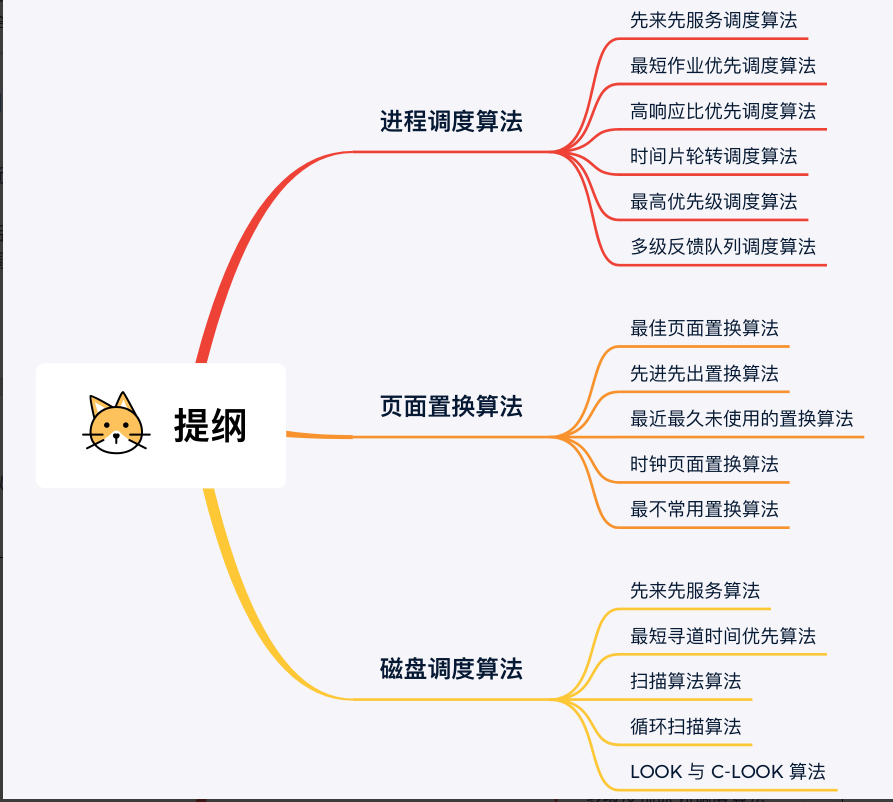

# 文件系统

## VFS
VFS就像是一个插槽，**通过函数指针调用**实际文件系统的文件操作
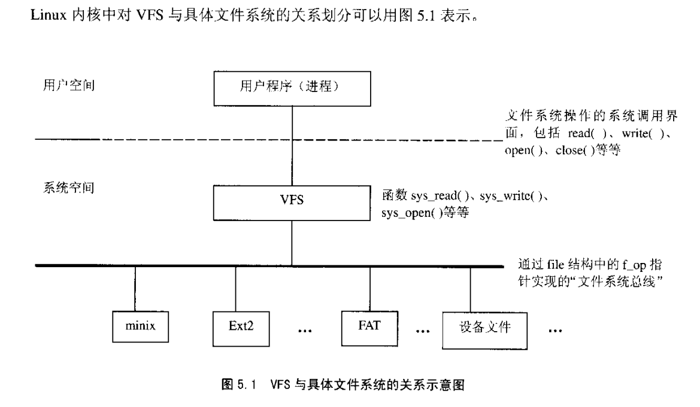
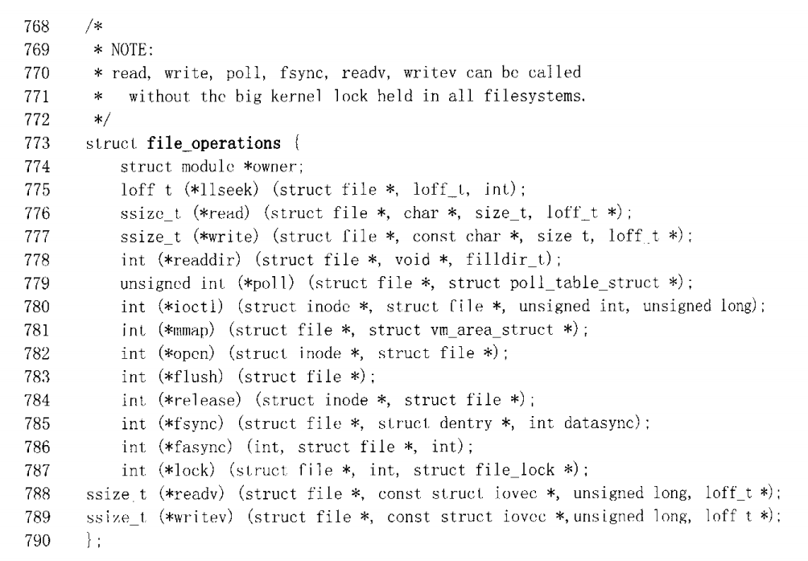

## superblock
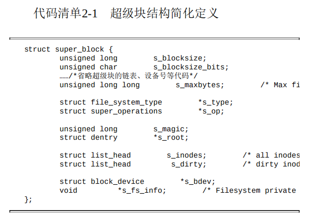
❑s_blocksize 指定了文件系统的**块大小**。
❑s_maxbytes 指定**文件系统中最大文件的尺寸**。
❑s_type 是指向file_system_type结构的指针。
❑s_magic 是魔术数字，每个文件系统都有一个魔术数字。
❑s_root 是**指向文件系统根dentry的指针**。超级块对象还定义了一些链表头，用来链接文件系统内的重要成员。
❑s_inodes **指向文件系统内所有的inode**，通过它可以遍历inode对象。
❑s_dirty 指向**所有dirty的inode对象**。
❑s_bdev 指向文件系统存在的块设备指针。

## dentry
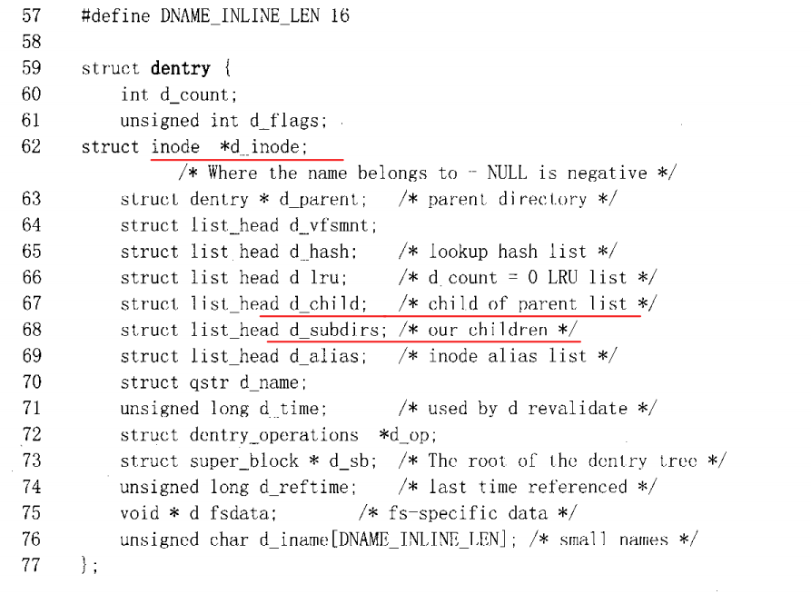
❑d_inode指向一个inode结构。**这个inode和dentry共同描述了一个普通文件或者目录文件**。
❑dentry结构里有**d_subdirs成员和d_child**成员。d_subdirs是子项（子项可能是目录，也可能是文件）的链表头，所有的子项都要链接到这个链表。d_child是dentry自身的链表头，需要链接到父dentry的d_subdirs成员。当移动文件的时候，需要把一个dentry结构从旧的父dentry的链表上脱离，然后链接到新的父dentry的d_subdirs成员。这样dentry结构之间就构成了一颗目录树
❑d_parent是指针，指向父dentry结构。
❑d_hash是**链接到dentry cache的hash链表**。
❑d_name成员保存的是文件或者目录的名字。打开一个文件的时候，根据这个成员和用户输入的名字比较来搜寻目标文件。
❑d_mounted用来**指示dentry是否是一个挂载点**。如果是挂载点，该成员不为零。
### dentry结构图
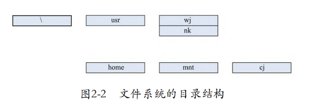
> 如图2-2所示，根目录下有usr和home两个目录，usr目录下有wj和nk两个文件，home目录下有个mnt目录，这是**另外一个文件系统**，**挂载**（mount）到当前文件系统。在mnt目录下有个cj文件。

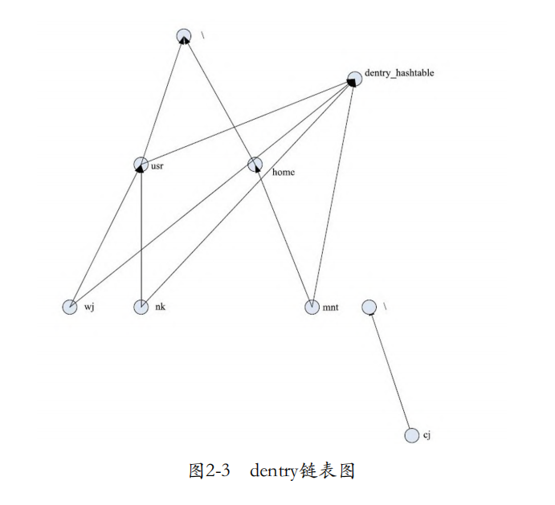


### vfsmount结构
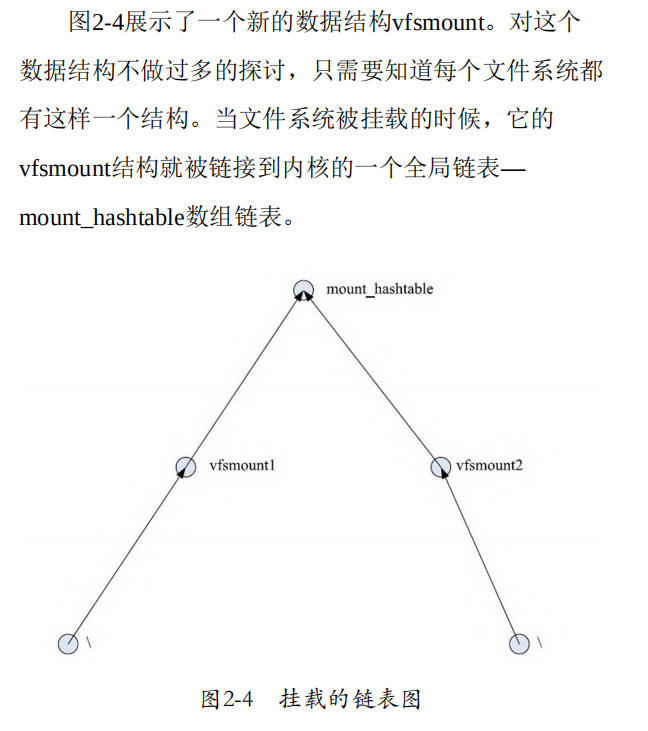

## inode
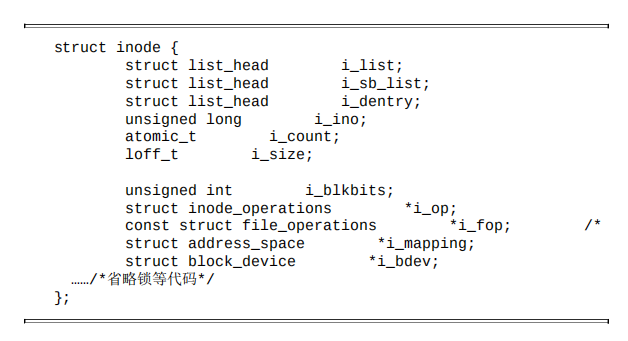
❑成员i_list、i_sb_list、i_dentry分别是三个链表头。成员**i_list**用于链接描述inode当前状态的链表。成员**i_sb_list**用于链接到超级块中的inode链表。当创建一个新的inode的时候，成员i_list要链接到inode_in_use这个链表，表示inode处于使用状态，同时成员i_sb_list也要链接到文件系统超级块的s_inodes链表头。由于一个文件可以对应多个dentry，这些dentry都要链接到成员i_dentry这个链表头。
❑成员i_ino是inode的号，而i_count是inode的引用计数。成员i_size是以字节为单位的文件长度。
❑成员i_blkbits是**文件块的位数**。
❑成员i_fop是一个struct file_operations类型的指针。文件的读写函数和异步io函数都在这个结构中提供。**每一个具体的文件系统，基本都要提供各自的文件操作函数**。
❑i_mapping是一个重要的成员。这个结构目的是**缓存文件的内容**，对文件的读写操作首先要在i_mapping包含的缓存里寻找文件的内容。如果有缓存，对文件的读就可以直接从缓存中获得，而不用再去物理硬盘读取，从而大大加速了文件的读操作。写操作也要首先访问缓存，写入到文件的缓存。然后等待合适的机会，再从缓存写入硬盘。后面我们将分析文件的具体读写，在此处只需要理解基本的作用即可。
❑成员i_bdev是指向块设备的指针。这个块设备就是文件所在的文件系统所绑定的块设备。

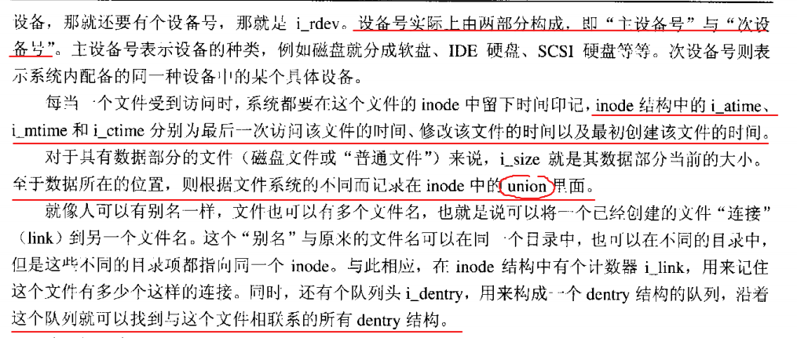

## dentry和inode的关系
一个文件可以有多个文件名，从**每个文件名访问的权限不同**，所以dentry所代表的其实是逻辑上的文件记录文件的**逻辑属性**，而inode指的是物理上的物件，记录的是文件的**物理属性**

## dentry_cache和inode_cache
### **1. `dentry_cache` 和 `inode_cache` 介绍**
在 Linux 内核中，`dentry_cache` 和 `inode_cache` 是 **两个关键的 VFS（虚拟文件系统）缓存**，用于加速文件路径解析和文件元数据访问。  

| **缓存名称** | **作用** | **存储内容** | **减少的 I/O** |
|------------|--------|------------|-------------|
| `dentry_cache` | 目录项缓存 | 文件路径解析结果（dentry 结构） | 避免重复的路径查找 |
| `inode_cache` | inode 元数据缓存 | 文件的 inode 结构（权限、大小等） | 避免频繁读取 inode |

它们都存储在 **Slab 分配器**（SLUB/SLAB）中，减少重复分配开销，提高系统性能。

---

### **2. `dentry_cache`（目录项缓存）**
`dentry_cache`（dentry cache）是 **目录项缓存**，用于加速路径查找（`lookup`）。

#### **2.1 dentry 结构**
每个 `dentry` 代表**路径中的一个目录或文件**：
```c
struct dentry {
    struct dentry *d_parent;  // 指向父目录的 dentry
    struct qstr d_name;       // 文件名
    struct inode *d_inode;    // 指向 inode
    struct hlist_node d_hash; // 哈希链表，用于快速查找
    struct list_head d_lru;   // LRU 链表（用于回收）
    struct list_head d_child; // 子目录列表
    int d_count;              // 引用计数
};
```
- **`d_inode`** 指向该路径对应的 `inode`（如果是文件或目录）。
- **`d_parent`** 形成**目录树**结构，加速路径查找。

---

#### **2.2 `dentry_cache` 在内核中的位置**
- **缓存池：** `dentry_cache` 存储在 `kmem_cache`（SLUB/SLAB 分配器）。
- **查找方式：** `dentry` 通过 `d_hash` 哈希表组织，加速路径解析。

```plaintext
       root (/)  →  dentry(/)
           ├── usr  →  dentry(/usr)
           │   ├── bin  →  dentry(/usr/bin)
           │   │   ├── gcc  →  dentry(/usr/bin/gcc) → inode
```
这样，如果 `gcc` 之前访问过，则可以从 `dentry_cache` 直接命中，而无需重新查找磁盘。

---

#### **2.3 `dentry_cache` 的回收策略**
`dentry_cache` 使用 **LRU（Least Recently Used）+ 引用计数** 机制进行回收：
- **引用计数 `d_count` = 0**：表示无进程引用，可回收。
- **`prune_dcache()`** 定期清理**不活跃**的 `dentry`。
- **`shrink_dcache_memory()`** 触发全局内存回收时清理 `dentry_cache`。

```c
static void prune_dcache(int nr_to_scan) {
    while (!list_empty(&dentry_unused)) {
        struct dentry *dentry = list_first_entry(&dentry_unused, struct dentry, d_lru);
        if (atomic_read(&dentry->d_count) == 0)
            dentry_free(dentry);
    }
}
```
当系统内存紧张时，`dentry_cache` 可能会被清理，但**活跃的 `dentry` 不会被回收**。

---

### **3. `inode_cache`（inode 缓存）**
`inode_cache` 主要用于缓存文件的 `inode` 结构，加速文件访问。

#### **3.1 inode 结构** [inode结构](@ref_inode)
```c
struct inode {
    struct hlist_node i_hash;  // 哈希链表，用于快速查找
    struct list_head i_sb_list;// 超级块链表
    struct list_head i_lru;    // LRU 链表
    atomic_t i_count;          // 引用计数
    dev_t i_rdev;              // 设备号
    umode_t i_mode;            // 权限
    loff_t i_size;             // 文件大小
    struct super_block *i_sb;  // 指向超级块
    struct address_space *i_mapping; // 指向页缓存
};
```
- **`i_count`**：引用计数（**0 时可被回收**）。
- **`i_sb`**：指向所在的**超级块（super_block）**。
- **`i_mapping`**：指向**页缓存（Page Cache）**，用于加速读写。

---

#### **3.2 `inode_cache` 在内核中的位置**
`inode_cache` 也是 `SLAB` 机制管理的缓存池：
- `iget()` 时，如果 `inode_cache` 命中，直接返回。
- 否则，调用 `ext4_read_inode()` 等函数从磁盘加载 `inode`。

```plaintext
inode_hashtable  (inode_cache 哈希表)
 ├── inode(1) → /usr/bin/gcc
 ├── inode(2) → /home/user/file.txt
 ├── inode(3) → /var/log/syslog
```
这样，如果 `file.txt` 之前访问过，则可以直接从 `inode_cache` 取出，而无需从磁盘读取。

---

#### **3.3 `inode_cache` 的回收策略**
`inode_cache` 采用 **LRU + 引用计数** 机制：
- **`i_count > 0`**：表示仍然被使用，不会回收。
- **`prune_icache()`**：定期回收不活跃的 `inode`。
- **`shrink_icache_memory()`**：在内存不足时触发全局回收。

```c
void prune_icache(int nr_to_scan) {
    struct inode *inode;
    while (!list_empty(&inode_unused)) {
        inode = list_first_entry(&inode_unused, struct inode, i_lru);
        if (atomic_read(&inode->i_count) == 0)
            inode_free(inode);
    }
}
```

---

### **4. `dentry` 和 `inode` 之间的关系**
- `dentry` **表示路径**，指向 `inode`。
- `inode` **表示文件元数据**，不关心文件名或路径。

```plaintext
用户访问 /home/user/file.txt
    ↓
VFS 查找 dentry_cache
    ├─ 命中 dentry(/home/user/file.txt) → d_inode 指向 inode
    └─ 未命中 → 解析路径，创建新 dentry，并找到 inode
```

#### **关系图**
```plaintext
dentry(/home/user/file.txt) → inode(1001)
dentry(/usr/bin/gcc)        → inode(2002)
```
- `dentry->d_inode` 指向 `inode`
- `inode` **不存储路径信息**
- `dentry` **可以有多个指向相同 `inode`**（硬链接）

---

### **5. 总结**
| **缓存** | **作用** | **存储内容** | **回收策略** |
|----------|---------|------------|-------------|
| `dentry_cache` | 加速路径查找 | 目录项 `dentry` | LRU + 引用计数 |
| `inode_cache` | 加速 inode 访问 | inode 元数据 | LRU + 引用计数 |

✅ **关键点：**
- `dentry_cache` **缓存路径查找结果**，加速 `lookup`。
- `inode_cache` **缓存文件元数据**，加速文件访问。
- `dentry->d_inode` **指向** `inode`，但 `inode` **不存储路径信息**。

你是想深入研究 **内核 `inode` 机制**，还是想**优化文件系统性能（如提高缓存命中率）**？


## 从目录名到inode目标节点


## 从inode到磁盘块读取
### **VFS 通过 inode 定位文件磁盘位置及预读流程详解**

---

#### **1. 用户发起读取请求**
用户通过 `read` 系统调用或 `mmap` 映射文件时，触发内核的文件读取流程。

---

#### **2. VFS 层处理**
• **路径解析**：VFS 根据文件路径解析出对应的 `dentry`（目录项）和 `inode`。
  • `dentry` 缓存路径到 inode 的映射。
  • `inode` 存储文件元数据（权限、大小、时间戳等）和指向数据块的位置信息。
• **关键结构体**：
  • **`struct inode`**：核心元数据容器。
    ◦ `i_sb`：指向超级块（`super_block`），标识所属文件系统。
    ◦ `i_mapping`：指向 `address_space`，管理文件数据页缓存。
  • **`struct super_block`**：文件系统元信息（如块大小、操作函数表）。

---

#### **3. 调用实际文件系统的数据访问方法**
• **文件系统驱动**：VFS 通过 `inode->i_fop->read_iter`（或 `->readpage`）调用具体文件系统的读取方法。
  • **逻辑块转换**：文件系统（如 ext4）将文件偏移量转换为逻辑块号。
    ◦ **ext4 的映射方法**：  
      通过 `ext4_get_block` 将文件逻辑块号转换为磁盘物理块号（`sector_t`）。
      ◦ `struct ext4_inode_info` 中的 `i_data` 存储直接/间接块指针。
  • **关键函数**：
    ◦ **`mpage_readpage`**：将逻辑块号转换为磁盘扇区，触发 I/O 请求。

---

#### **4. 检查 Page Cache**
• **Page Cache 查询**：内核通过 `address_space` 查找数据是否已缓存。
  • **`struct address_space`**：管理文件的所有缓存页。
    ◦ `a_ops`：操作函数表（如 `readpage`、`writepage`）。
    ◦ `i_pages`：基数树（或 XArray）存储所有缓存的 `struct page`。
  • **缓存命中**：若数据在 `page cache` 中，直接返回用户空间。
  • **缓存未命中**：触发磁盘读取。

---

#### **5. 磁盘读取与预读机制**
• **磁盘 I/O 请求**：
  • **`struct bio`**：描述磁盘 I/O 请求的结构体，包含物理扇区号、数据缓冲区等。
  • 文件系统生成 `bio` 并提交到块设备层。
• **预读（Readahead）**：
  • **触发条件**：顺序访问模式或显式 `posix_fadvise` 提示。
  • **预读窗口**：
    ◦ `struct file_ra_state`：跟踪当前文件的预读状态（如 `ra_pages` 预读页数）。
    ◦ 动态调整策略：根据历史访问模式（如 `readahead_ratio`）调整预读大小。
  • **关键函数**：
    ◦ **`page_cache_sync_readahead`**：同步预读，直接扩展读取范围。
    ◦ **`ondemand_readahead`**：异步预读，预测后续访问模式。

---

#### **6. 数据填充到 Page Cache**
• **缓存回填**：磁盘数据读取后，填充到 `page cache` 的 `struct page` 中。
  • **`struct page`**：表示内存中的一页数据。
    ◦ `flags`：标记页的状态（如脏页 `PG_dirty`）。
    ◦ `mapping`：指向所属的 `address_space`。
• **用户数据返回**：将 `page cache` 中的数据复制到用户缓冲区（或通过零拷贝直接映射）。

---

#### **7. mmap 与预读的协同**
• **内存映射流程**：
  • 用户调用 `mmap` 将文件映射到进程地址空间。
  • 内核创建虚拟内存区域（`struct vm_area_struct`），关联文件的 `address_space`。
• **缺页处理**：
  • **`filemap_fault`**：当访问未加载的虚拟页时触发缺页异常。
    ◦ 检查 `page cache`，若未命中则调用 `->readpage` 读取数据。
    ◦ 触发预读：根据访问偏移量预测后续页，异步加载到 `page cache`。
• **预读优化**：
  • 对于 `mmap` 的线性访问，预读算法会识别顺序模式，提前加载后续页。
  • **`VM_SEQ_READ` 标志**：标记虚拟内存区域为顺序读取，指导预读策略。

---

### **关键结构体与属性总结**

| **结构体/属性**         | **作用**                                                                 |
|-------------------------|-------------------------------------------------------------------------|
| `struct inode`          | 文件元数据，关联 `address_space` 和文件系统操作。                        |
| `struct super_block`    | 文件系统元信息，包含块设备、操作函数表。                                 |
| `struct address_space`  | 管理文件的所有缓存页，关联 `inode->i_mapping`。                          |
| `struct page`           | 表示内存中的一页数据，通过 `mapping` 关联到文件的 `address_space`。      |
| `struct file_ra_state`  | 跟踪文件的预读状态（如当前预读窗口大小）。                               |
| `struct vm_area_struct` | 描述进程的虚拟内存区域，用于 `mmap` 映射文件。                          |
| `i_mapping->a_ops`      | 文件系统的缓存操作方法（如 `readpage`）。                               |
| `ra_pages`              | 控制预读的最大页数（可通过 `/sys/block/sdX/queue/read_ahead_kb` 调整）。|

---

### **流程示意图**

```plaintext
用户 read/mmap 请求
    ↓
VFS 路径解析 → dentry cache → inode cache
    ↓
检查 inode 是否有效
    ├─ 缓存命中（inode cache） → 直接访问
    └─ 需要加载 inode → 调用具体文件系统（如 ext4_read_inode）
        ↓
        读取超级块、块组描述符、inode 表
        ↓
        inode 加载完成，返回 VFS
    ↓
调用具体文件系统方法（如 ext4_get_block）
    ↓
逻辑块号 → 物理块号（块地址转换）
    ├─ **间接块**（若使用间接寻址）
    ├─ **块映射**（如 `bmap` 或 `ext4_map_blocks`）
    └─ **物理地址计算**（LBA 逻辑扇区地址）
    ↓
提交 `bio` 请求（块 I/O 子系统）
    ↓
检查 Page Cache
    ├─ **命中** → 直接返回数据
    └─ **未命中** → 触发磁盘 I/O
        ↓
        生成 `bio` 结构 → 提交给 block layer
            ↓
            通过 I/O 调度（如 `mq-deadline` / `bfq`）
            ↓
            设备驱动程序（SCSI / NVMe / SATA）
            ↓
            磁盘控制器（LBA 逻辑扇区读）
        ↓
        数据从磁盘读入内核缓冲区
        ↓
        填充 Page Cache → 触发**预读**（提前加载更多数据）
            ↓
            数据返回用户空间（通过 `copy_to_user` 或 `mmap`）

```

---

通过上述流程，VFS 借助 inode 和实际文件系统的协作，高效定位磁盘数据并利用预读机制优化性能，同时 `mmap` 的内存映射特性进一步与 Page Cache 深度集成，减少数据复制开销。


## 进程与文件系统
### 基本架构
进程task_struct中fs是指向实际文件系统的信息，files是已打开的文件的信息(**文件描述符就是files的下标**)
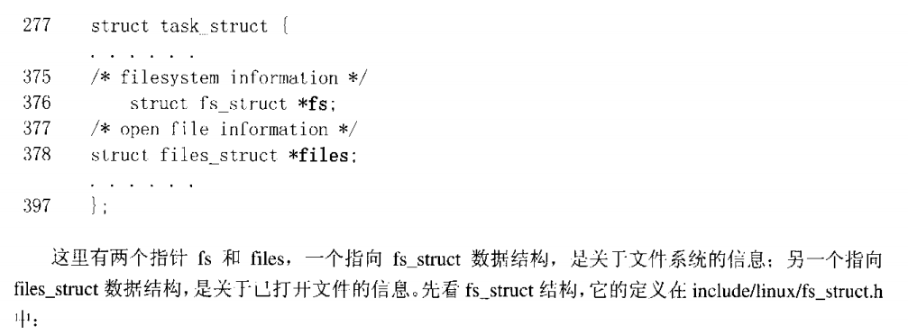

在fs结构体中
```c
struct fs_struct{
  atomic_t count;
  rwlock_t lock;
  int unmask;
  struct dentry *root, *pwd, *altroot;
  struct vfsmount *rootmnt, *pwdmnt, *altrootmnt;
}
```
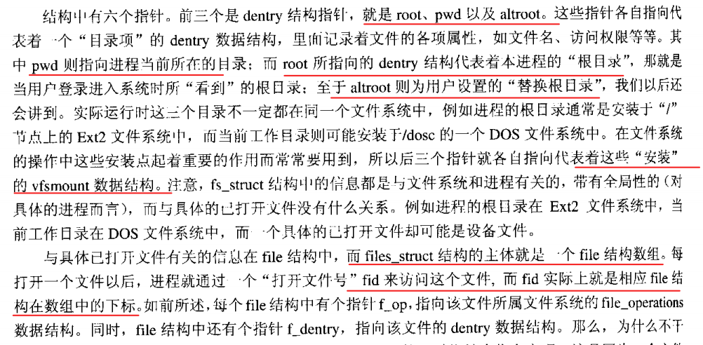
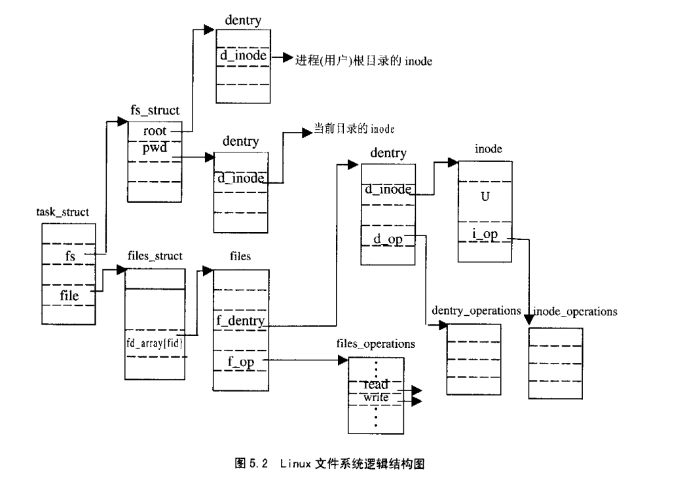
### 为什么需要root, pwd, altroot——保障远程操作安全


## 实际文件系统结构组织——ext4...
在Linux操作系统中，**文件系统**的组织方式非常重要，它决定了如何存储、查找、访问和管理文件。Linux的文件系统设计非常灵活，支持多种文件系统类型，如**ext4、XFS、Btrfs**等。文件系统的基本结构和工作原理通常具有以下组成部分：

---

### **1. Linux文件系统的基本组成**

#### ✅ **超级块（Superblock）**
- **定义**：超级块是存储在磁盘上文件系统的最重要的数据结构，包含了文件系统的元数据，如**文件系统类型、大小、可用空间、挂载信息**等。
- **作用**：每个挂载的文件系统都会有一个超级块，内核在访问文件系统时，首先需要读取超级块来获取文件系统的总体信息。

#### ✅ **块组（Block Group）**
- **定义**：文件系统会将磁盘划分为多个块组（Block Group）。每个块组由若干个数据块组成，并且包含了数据块、索引节点、目录项等。
- **作用**：通过将文件数据分散到多个块组中，文件系统可以实现更高效的存储与访问，并减少**磁盘寻址**的开销。

#### ✅ **索引节点（Inode）**
- **定义**：索引节点是文件系统中用于描述文件元数据的结构体，它并不存储文件的内容，而是存储了文件的属性和指向数据块的指针。
- **内容**：
  - 文件的大小、权限、所有者、创建和修改时间等元数据。
  - **数据块指针**：指向存储文件数据的实际磁盘位置（数据块）。
- **作用**：每个文件都会有一个唯一的Inode，它用于快速定位和操作文件数据。

#### ✅ **数据块（Data Block）**
- **定义**：数据块是实际存储文件数据的地方，文件的内容存储在这些数据块中。
- **作用**：当我们读取或写入文件时，操作的就是文件的对应数据块。

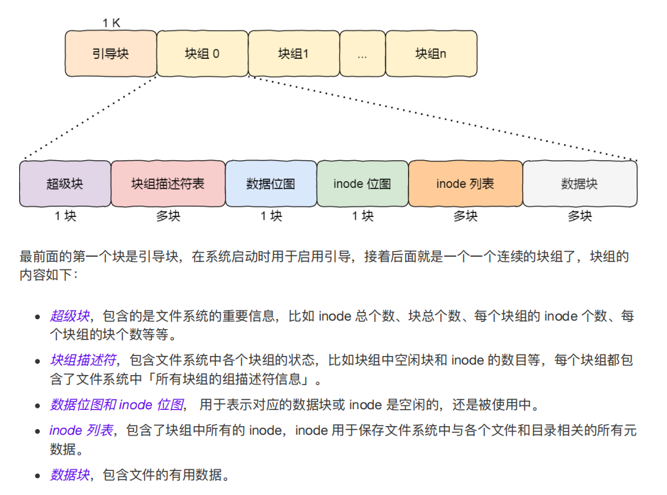
``` sql
+---------------------------------------------------------+
| Superblock                                              |
+---------------------------------------------------------+
| Block Group 1                                           |
|  - Inode Table                                           |
|  - Data Blocks                                          |
+---------------------------------------------------------+
| Block Group 2                                           |
|  - Inode Table                                           |
|  - Data Blocks                                          |
+---------------------------------------------------------+
| Block Group 3                                           |
|  - Inode Table                                           |
|  - Data Blocks                                          |
+---------------------------------------------------------+
| ...                                                     |
+---------------------------------------------------------+
```

---

### **2. 文件系统的组织结构**

#### ✅ **目录（Directory）**
- **定义**：目录是一种特殊的文件，它存储了文件名和文件的Inode号之间的映射关系。
- **作用**：通过目录，用户可以根据文件名查找相应的文件，而文件的实际存储位置（Inode）是通过目录中的映射来找到的。

#### ✅ **目录项（Directory Entry）**
- **定义**：每个目录项包含了文件名和该文件的Inode号。
- **作用**：目录项是文件系统将文件名与Inode（文件数据存储位置）关联起来的方式。

#### ✅ **文件描述符（File Descriptor）**
- **定义**：当用户打开一个文件时，操作系统为该文件分配一个文件描述符（fd），它是用户与文件之间的接口。
- **作用**：文件描述符用于进程在文件操作中的引用，进程通过文件描述符来进行文件的读取、写入、关闭等操作。

---

### **3. 文件的存储方式**

#### ✅ **顺序存储**：
- 文件的数据在磁盘中是**连续**存储的。
- **优点**：读取速度较快，因为文件的数据块在物理存储上是顺序排列的。
- **缺点**：如果文件发生扩展，可能需要**重新分配空间**，并产生碎片化。

#### ✅ **链式存储**：
- 文件的数据块在磁盘中是**不连续**的，每个数据块包含一个指向下一个数据块的指针（链表方式）。
- **优点**：灵活，不会受到磁盘空间连续性的限制。
- **缺点**：链式存储会增加**寻址时间**，因为每次访问需要查找链表指针。

#### ✅ **索引存储**：
- 每个文件的索引节点（Inode）包含指向文件数据块的指针。文件数据块的指针可以是直接指针、间接指针、双重间接指针和三重间接指针等。
- **优点**：高效的空间利用，支持动态增长。
- **缺点**：涉及多个指针的查找时，可能导致寻址开销增大。

---

### **4. 文件访问与管理**

#### ✅ **文件的查找**：
- **路径查找**：文件系统使用路径来查找文件。例如，在Linux中，`/home/user/document.txt`是一个完整的路径，操作系统通过该路径逐级查找目录、找到相应的Inode。
- **Inode查找**：文件的元数据和存储位置通过Inode来管理。当文件被打开时，操作系统通过目录项映射到Inode，再通过Inode查找文件数据块。

#### ✅ **文件的读写操作**：
- 当进程需要读取文件时，内核通过Inode中的数据块指针读取文件的数据块。
- 当进程写入数据时，文件系统会根据需要分配新的数据块并更新文件的Inode。

---

### **5. Linux文件系统的层次结构**

在Linux文件系统中，所有文件（包括设备、网络接口、进程等）都被视为**文件**，并且遵循统一的树形结构。整个文件系统结构如下：

```
/
├── bin/            # 存放系统执行文件
├── dev/            # 存放设备文件
├── etc/            # 存放系统配置文件
├── home/           # 存放用户数据
├── lib/            # 存放库文件
├── media/          # 挂载点，如CD-ROM、U盘
├── proc/           # 存放进程信息
├── tmp/            # 临时文件
├── usr/            # 存放用户程序和库文件
└── var/            # 存放日志和可变数据
```

---

### **6. 总结**

Linux文件系统通过**超级块、块组、索引节点（Inode）、数据块、目录项**等结构来组织和管理文件。文件系统采用了**分层结构**，使得用户能够通过路径方便地查找和操作文件。通过合理的文件数据存储方式，Linux文件系统能够高效地处理文件的读写、扩展和碎片化问题。

不同的文件系统（如**ext4**、**XFS**、**Btrfs**）根据实际需求有不同的设计和优化，但它们的基本原理大体相同。


## 硬链接和软链接
**硬链接（Hard Link）** 和 **软链接（Soft Link，符号链接）** 是 Linux/Unix 文件系统中的两种不同的链接方式，它们在本质、行为以及适用场景上有明显区别。

---

### **1. 硬链接（Hard Link）**
#### **特点**
- 硬链接是文件的一个 **直接引用**，指向相同的 **inode** 号码。
- 由于所有硬链接都指向同一个 inode，它们共享相同的数据块，修改任何一个硬链接的内容，其他硬链接也会同步修改。
- **删除某个硬链接并不会影响原文件或其他硬链接**，只有当所有指向该 inode 的硬链接都被删除后，数据才会被释放。
- **不能跨文件系统**，因为 inode 号是文件系统内部的概念。
- **不能对目录创建硬链接**，避免目录结构混乱。

#### **如何创建硬链接**
```bash
ln 原文件 硬链接文件
```
例如：
```bash
ln file1 hardlink1
```
此时 `file1` 和 `hardlink1` 共享同一个 inode 号。

#### **删除文件的影响**
如果删除 `file1`：
```bash
rm file1
```
`hardlink1` 仍然可以访问相同的数据，因为 inode 和数据仍然存在。

---

### **2. 软链接（符号链接，Symbolic Link）**
#### **特点**
- 软链接是一个**特殊类型的文件**，本质上是一个指向目标文件路径的**快捷方式**，它本身有独立的 inode 号，存储的是目标文件的路径。
- 修改软链接文件不会影响目标文件，**但修改目标文件会影响软链接的访问内容**。
- **如果目标文件被删除，软链接会变成“悬挂的符号链接”**（即指向一个不存在的文件）。
- **可以跨文件系统**，因为它只是一个指向目标路径的指针。
- **可以对目录创建软链接**，这也是它比硬链接更灵活的地方。

#### **如何创建软链接**
```bash
ln -s 原文件 软链接文件
```
例如：
```bash
ln -s file1 softlink1
```
此时 `softlink1` 仅仅是 `file1` 的路径指针。

#### **删除文件的影响**
如果删除 `file1`：
```bash
rm file1
```
`softlink1` 仍然存在，但它会指向一个**无效的文件路径**，访问它时会报错：
```bash
cat softlink1
# cat: softlink1: No such file or directory
```

---

### **3. 硬链接 vs 软链接**
| **区别**         | **硬链接（Hard Link）** | **软链接（Soft Link）** |
|----------------|---------------------|---------------------|
| **inode 关系**  | 指向相同 inode        | 指向不同 inode，存储路径 |
| **修改文件影响** | 修改任何硬链接文件内容，其他硬链接文件也同步更改 | 软链接指向的目标文件修改，软链接本身内容不变 |
| **删除影响**    | 删除某个硬链接，其他硬链接仍可访问数据 | 删除目标文件后，软链接变成无效 |
| **是否可以跨文件系统** | 不能 | 可以 |
| **是否可以链接目录** | 不能 | 可以 |
| **创建命令**    | `ln 源文件 硬链接文件` | `ln -s 源文件 软链接文件` |

---

### **4. 适用场景**
- **使用硬链接**
  - 适用于**数据备份**，例如 `/usr/bin` 目录下的许多命令都有多个硬链接，节省空间。
  - 适用于需要多个路径访问相同文件的场景，不容易因误删文件而丢失数据。

- **使用软链接**
  - 适用于快捷方式，例如 `/usr/bin/python3` 软链接到 `/usr/local/bin/python3.9`。
  - 适用于**跨文件系统共享文件**，硬链接无法跨文件系统，而软链接可以。
  - 适用于链接目录，比如 `ln -s /mnt/data ~/data_link`。

---

### **5. 示例**
#### **硬链接示例**
```bash
touch file1
ln file1 hardlink1
ls -li file1 hardlink1
```
输出：
```
123456 -rw-r--r-- 2 user user 0 Mar 30 12:00 file1
123456 -rw-r--r-- 2 user user 0 Mar 30 12:00 hardlink1
```
注意 inode 号相同。

#### **软链接示例**
```bash
ln -s file1 softlink1
ls -li file1 softlink1
```
输出：
```
123456 -rw-r--r-- 1 user user 0 Mar 30 12:00 file1
234567 lrwxrwxrwx 1 user user 6 Mar 30 12:00 softlink1 -> file1
```
注意 softlink1 的 inode 不同，并存储 `file1` 的路径。

---

### **总结**
- **硬链接** 共享相同 inode，适用于本地文件系统的文件引用，不能跨文件系统，不能对目录操作。
- **软链接** 只是一个指向目标文件路径的快捷方式，可以跨文件系统，可以链接目录，但目标文件被删除后会变成悬挂链接。

根据具体需求选择合适的链接方式！


## 文件读写
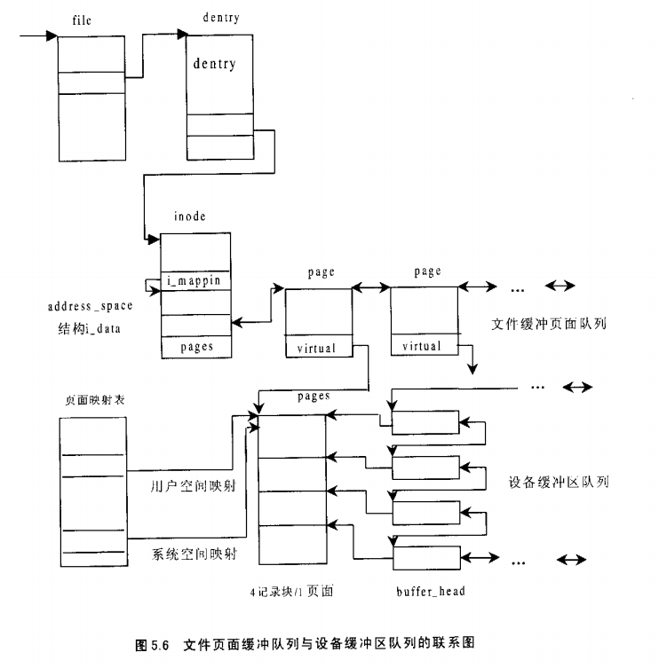


## 特殊文件系统/proc


# 文件IO


# 块IO层


# 用户态 & 内核态

## 用户态和内核态的区别
**用户态（User Mode）**和**内核态（Kernel Mode）**是操作系统提供的两种CPU运行模式，它们的主要区别如下：

---

### **1. 权限**
- **用户态**：权限受限，不能直接访问硬件资源，如磁盘、网络、内存管理单元（MMU）等。
- **内核态**：权限最高，可以直接访问和控制所有硬件资源。

---

### **2. 运行范围**
- **用户态**：运行普通应用程序（如浏览器、文本编辑器）。
- **内核态**：运行操作系统内核代码，包括驱动程序、进程调度、内存管理等。

---

### **3. 指令集访问**
- **用户态**：只能执行**非特权指令**，不能执行特权指令（如修改中断描述符表）。
- **内核态**：可以执行**所有指令**，包括管理CPU、I/O设备等的特权指令。

---

### **4. 内存访问**
- **用户态**：
  - 只能访问**用户空间**（User Space），不能访问内核空间（Kernel Space）。
  - 访问受限的内存地址会触发**段错误（Segmentation Fault）**。
- **内核态**：
  - 可以访问**所有**内存，包括**用户空间和内核空间**。

---

### **5. 系统调用**
- **用户态**代码不能直接访问内核资源，需要通过**系统调用（System Call）**进入内核态执行特权操作。
- 进入内核态的方式：
  1. **系统调用（syscall）**：如 `read()`, `write()`, `open()`, `fork()`。
  2. **异常（Exception）**：如缺页异常（Page Fault）。
  3. **中断（Interrupt）**：如键盘输入、网络数据到达等。

---

### **6. 运行模式切换**
- **用户态 → 内核态**
  - 触发系统调用 `syscall`（x86_64）或 `int 0x80`（x86）。
  - 发生异常或中断（如缺页中断）。
- **内核态 → 用户态**
  - 系统调用返回 `sysret`。
  - 进程调度完成后恢复用户态。
  - `iret` 指令返回用户态。

---

### **7. 影响性能**
- **用户态 → 内核态切换是有开销的**，因为需要：
  - **保存当前用户态寄存器**。
  - **切换CPU运行模式**。
  - **执行特权指令**。
  - **恢复原用户态环境**。

---

### **总结**
| 特性 | 用户态 | 内核态 |
|------|--------|--------|
| 权限 | 低 | 高 |
| 运行的代码 | 应用程序 | 操作系统 |
| 指令执行 | 只能执行非特权指令 | 可执行所有指令 |
| 访问内存 | 只能访问用户空间 | 可访问所有内存 |
| 访问硬件 | 不能直接访问 | 可以直接访问 |
| 进入方式 | 运行应用程序 | 通过系统调用、中断或异常 |
| 退出方式 | 发生系统调用或异常 | 系统调用返回或进程调度 |

**总结一句话：** 用户态受限，只能执行普通程序；内核态权限高，可以访问全部硬件资源，但涉及安全性问题，因此通常通过系统调用来受控访问内核资源。

## 用户态和内核态的转换是如何进行的


## 什么情况会发生用户态到内核态的转换
用户态和内核态之间的转换通常发生在以下几种情况下：

### 1. **系统调用（System Call）**
   - **描述**：用户程序通过执行系统调用请求操作系统提供服务，如文件操作、内存分配、进程控制、设备操作等。用户程序的执行会触发软中断，进而将控制权转交给操作系统内核。
   - **示例**：
     - `open()`, `read()`, `write()`, `close()` 等文件操作；
     - `fork()`, `exec()`, `exit()` 等进程控制操作；
     - `mmap()` 等内存管理操作。

### 2. **硬件中断（Hardware Interrupt）**
   - **描述**：硬件设备（如定时器、I/O设备）生成中断请求，操作系统内核需要响应这些请求。硬件中断会使得 CPU 从用户态切换到内核态，处理中断事件后返回用户态。
   - **示例**：
     - 网络卡接收数据，产生中断，内核需要处理；
     - 定时器中断，用于触发调度算法或管理时间片。

### 3. **软件中断（Software Interrupt）**
   - **描述**：通过特定的指令（例如，`int` 指令在 x86 架构中）使 CPU 进入内核态。软件中断可用于实现系统调用或处理其他需要操作系统介入的事件。
   - **示例**：
     - x86 架构中的 `int 0x80` 指令，启动系统调用；
     - x86-64 架构中的 `syscall` 指令。

### 4. **异常（Exception）**
   - **描述**：程序执行过程中如果发生了异常（如除零错误、非法内存访问、页面错误等），会导致内核介入处理。这些异常通常会触发从用户态到内核态的切换。
   - **示例**：
     - **页面错误**（Page Fault）：访问未映射或不存在的内存页；
     - **除零异常**：尝试进行除以零的操作；
     - **非法指令异常**：执行非法或无效的指令。

### 5. **上下文切换（Context Switch）**
   - **描述**：操作系统根据调度策略在不同进程或线程之间进行切换时，需要将当前进程的状态（如寄存器内容、栈指针等）保存到其内存区域，并将另一个进程的状态加载进来。如果切换的进程是内核进程，则会发生内核态和用户态之间的转换。
   - **示例**：
     - 当当前进程的时间片用尽或更高优先级的进程需要执行时，操作系统会调度一个新的进程执行。
     - 如果调度的进程是内核态进程（如内核线程），就会发生从用户态到内核态的转换。

### 6. **IO操作（Input/Output Operations）**
   - **描述**：用户程序请求 I/O 操作时（如读写文件、网络通信、设备控制等），若操作需要等待硬件响应，操作系统会将进程切换到内核态，并可能进入等待状态直到操作完成。
   - **示例**：
     - **阻塞I/O**：当进程执行阻塞的 I/O 操作（例如，读取文件或等待网络响应）时，内核需要干预并可能将进程放入阻塞队列，进而进入内核态。
     - **异步 I/O 操作**：内核处理异步 I/O 请求，进行相应的操作或等待。

### 7. **信号处理（Signal Handling）**
   - **描述**：当进程接收到一个信号（如 `SIGKILL`, `SIGSTOP`, `SIGSEGV` 等），内核需要根据信号类型进行处理。如果是一个可捕获的信号，内核会通过调用相应的信号处理程序，将控制权从用户空间转移到内核空间，执行处理程序后再返回用户空间。
   - **示例**：
     - 进程接收到 `SIGSEGV` 信号（段错误），触发内核态处理；
     - 进程接收到 `SIGALRM` 信号，进入信号处理程序。

### 8. **内存管理（Memory Management）**
   - **描述**：在进行内存分配、释放或页面映射时，用户程序可能会请求操作系统执行内存管理操作。如果需要访问物理内存，操作系统会切换到内核态进行内存操作。
   - **示例**：
     - **缺页中断（Page Fault）**：当进程访问未分配或无效的虚拟内存页面时，操作系统会触发缺页中断，将程序控制从用户态切换到内核态，加载页面到内存中。
     - **内存分配请求**：用户程序通过 `malloc()` 或 `mmap()` 请求内存时，内核会处理实际的内存分配，涉及到内存池和页表管理。

### 总结

- 用户态和内核态的转换是由操作系统控制的，在发生以下情况时会切换：
  - **系统调用**：用户程序请求内核执行特权操作。
  - **硬件中断**：设备事件（如定时器、网络卡数据）触发内核处理。
  - **软件中断**：通过中断指令触发内核介入。
  - **异常**：程序执行时发生的错误（如页面错误、除零错误等）。
  - **上下文切换**：操作系统在不同进程或线程之间切换时，可能涉及从用户态到内核态的切换。
  - **I/O 操作**：程序进行阻塞式 I/O 时，操作系统处理 I/O 请求。
  - **信号处理**：进程接收到信号时，内核介入处理信号。

这些切换通常由操作系统内核决定，确保系统的正确性、安全性和资源管理。


# 从代码到输出中间经历了什么
## 从源码到输出的流程
这是一个非常经典、考察全面的问题！我们来 **从源码到输出**，一环扣一环地讲解整个过程：

---

### ✅ 1. 编写 C++ 程序

```cpp
// hello.cpp
#include <iostream>

int main() {
    std::cout << "Hello, World!" << std::endl;
    return 0;
}
```

---

### ✅ 2. 编译过程：从源码到可执行文件

#### 编译命令

```bash
g++ hello.cpp -o hello
```

这一步做了很多事：

| 阶段         | 工具           | 作用                       |
|--------------|----------------|----------------------------|
| 预处理       | `cpp`          | 展开 `#include` 等宏指令   |
| 编译         | `cc1plus`      | 把 C++ 转成汇编             |
| 汇编         | `as`           | 把汇编转成目标文件 `.o`    |
| 链接         | `ld`           | 把目标文件和库链接为 `ELF` 可执行文件 |

---

### ✅ 3. 程序是怎么启动的？

#### Linux下执行 `./hello`，它做了什么？

1. **Shell 使用 `execve()` 系统调用**，加载 ELF 可执行文件
2. **内核加载可执行文件头部（ELF Header）**
3. **从 ELF 文件中找到入口点：`_start`**（不是 `main`！）

> `main` 只是用户定义的入口，真正程序从 `_start` 函数进入，由链接器生成。

---

### ✅ 4. 谁调用 `main`？怎么找到它？

- `_start` → `__libc_start_main(main, ...)`（来自 libc）
- `__libc_start_main()` 调用你写的 `main()`
- 调用结束后，返回值用于终止进程

```text
_kernel -> _start
        -> __libc_start_main
        -> main
        -> exit
```

---

### ✅ 5. `std::cout` 怎么把内容输出到屏幕？

#### 你写的是：
```cpp
std::cout << "Hello, World!" << std::endl;
```

#### 实际过程：
1. `std::cout` 是 `std::ostream` 的对象
2. `<<` 是一个重载运算符：本质是函数调用
3. 调用底层 `write()` 或 `fwrite()`（通过缓冲区）
4. 最终通过 **`write()` 系统调用** 把数据写到 **标准输出（文件描述符 1）**
5. 标准输出在终端绑定的是 **屏幕**

```text
std::cout
  ↓
ostream::operator<<()
  ↓
缓冲区（例如 std::streambuf）
  ↓
write(fd = 1, buffer, len)  → Linux内核
  ↓
屏幕终端显示
```

---

### ✅ 6. 总结：整体流程图

```text
源码（.cpp） 
  ↓ 编译 g++
ELF 可执行文件
  ↓ 执行 ./hello
内核加载 ELF → _start → __libc_start_main → main()
  ↓
std::cout → ostream::operator<< → 内核 write() → 屏幕显示
```

---

要不要我配一张 `ELF 加载流程图` 或者 `write()` 系统调用内部流程图，让你面试更有视觉冲击？

## printf输出如何实现的
> printf怎么实现的？怎么做到显示到屏幕上一个字符的？知道printf的实现在哪个源文件里面吗？

这个问题非常有深度，既考察对系统调用、C库、内核的理解，也涉及源码定位的能力。我们来从上到下全面剖析：

---

### ✅ 一、`printf()` 是怎么实现的？

`printf()` 属于 **标准C库（libc）** 的一部分，本质是格式化输出，它的实现流程如下：

#### 🎯 1. 你调用的是：
```c
printf("Hello %s\n", "world");
```

#### 🎯 2. 实际流程：
```text
printf() -> vfprintf() -> _IO_file_xsputn() -> syscall write(fd=1) → 显示到终端
```

- `printf`：解析格式字符串，调用 `vfprintf`
- `vfprintf`：格式化输出，写入流（如 `stdout`）
- `_IO_file_xsputn`：写入文件流缓冲区
- 最终调用 `write()` 系统调用（fd=1 是标准输出）

---

### ✅ 二、每个字符是怎么显示到屏幕上的？

```text
write(fd=1, "A", 1)
  ↓
Linux内核通过终端驱动
  ↓
字符写入 /dev/pts/X（终端设备）
  ↓
终端程序（如 bash）显示字符到屏幕
```

- `write()` 是关键的系统调用，`fd=1` 表示 stdout。
- 终端程序监听标准输出的写入，并刷新显示。
- 低层通过 **tty 驱动 + framebuffer/图形系统** 显示字符。

---

### ✅ 三、源码在哪？怎么找到 `printf` 的实现？

#### 👉 GNU libc（glibc） 中：

你可以直接在源码里查找路径：

```bash
# 克隆 glibc 源码
git clone git://sourceware.org/git/glibc.git
cd glibc

# 搜索 printf 实现
grep -R 'int printf' .
```

找到：

```
stdio-common/printf.c
```

#### 🔍 源码入口：`glibc/stdio-common/printf.c`

```c
int
printf (const char *format, ...)
{
    va_list arg;
    int done;

    va_start (arg, format);
    done = vfprintf (stdout, format, arg);
    va_end (arg);

    return done;
}
```

继续看 `vfprintf()`：

```c
int vfprintf(FILE *stream, const char *format, va_list ap);
```

这才是核心格式化输出逻辑，大量逻辑处理 `%d/%s/%f/%p` 等格式符。

---

### ✅ 四、最终是如何调用 `write()` 系统调用的？

glibc 内部会在 `_IO_file_xsputn`、`_IO_do_write` 等底层调用中使用 `write()`：

```c
ssize_t __write(int fd, const void *buf, size_t count);
```

这最终通过 `syscall` 指令进入内核，进入 `fs/read_write.c` 中的 `sys_write()`。

---

### ✅ 五、总结图（从 `printf()` 到字符显示）

```text
printf()
  ↓
vfprintf()
  ↓
_IO_file_xsputn() / _IO_do_write()
  ↓
write(fd=1, "A", 1)
  ↓
Linux内核 → tty驱动
  ↓
/dev/pts/X → 终端程序
  ↓
屏幕显示字符
```

---

如果你想亲自 trace 一下 `printf()` 的系统调用路径，可以用：

```bash
strace ./a.out
```

你会看到类似输出：

```bash
write(1, "Hello world\n", 12) = 12
```

---

要不要我直接带你去 glibc 的 `vfprintf.c` 看看解析格式符是怎么写的？或者我们可以手写一个简化版的 `printf` 实现~


# 负载均衡——一致性哈希算法
传统哈希对于节点增删时可能会导致大部分映射失效
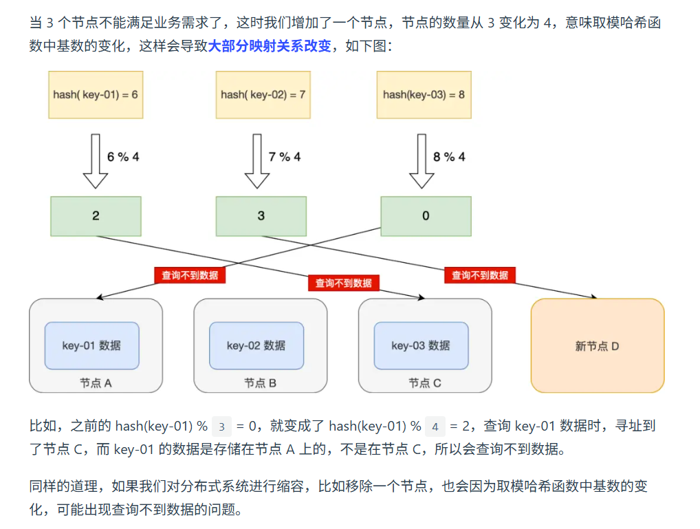

为了解决这个问题
使用——哈希环
将数据和节点都分布在哈希环上，并顺时针查找
> 但是哈希环并不保证哈希均匀分布

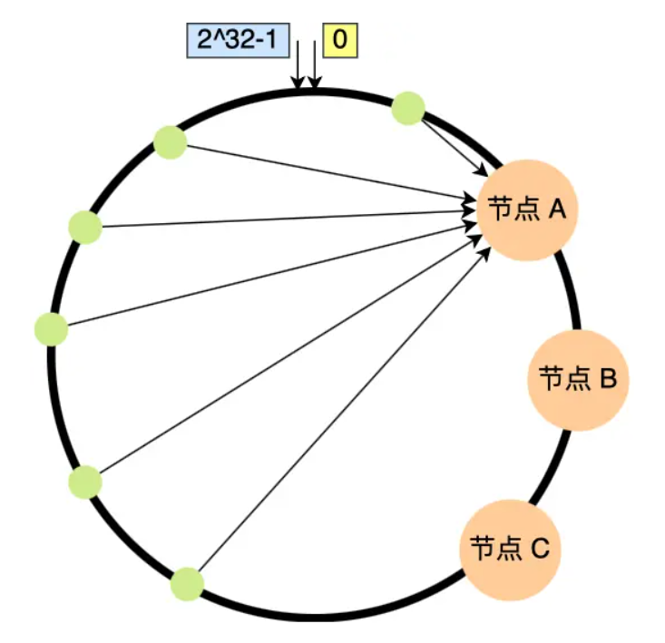
>使用虚拟节点
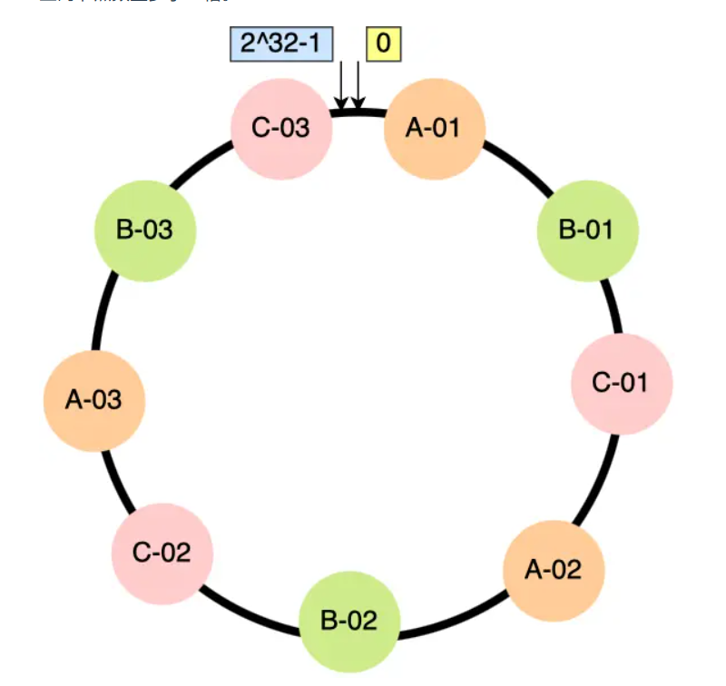

# 网卡读取的NAPI机制

# 零拷贝实现
- 传输⼤⽂件的时候，使⽤「异步 I/O + 直接 I/O」；
- 传输⼩⽂件的时候，则使⽤「零拷⻉技术」；
## 零拷贝
## ⼤⽂件传输⽤什么⽅式实现？
大文件（GB）不应该使用零拷贝，因为pagecache不起作用(trashing，workload大小和内存大小不匹配)，反而导致效率低下
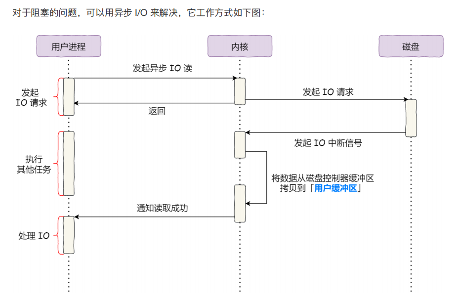

# IO多路复用
Q:为什么IO多路复用要搭配非阻塞IO使用


Q:epoll 对比 select、poll的优势点
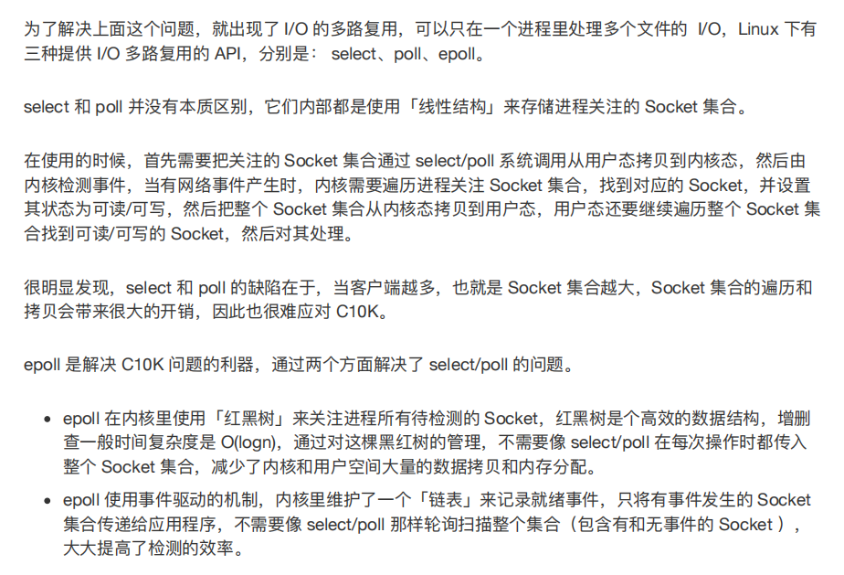

# 内存屏障
### **内存屏障（Memory Barrier）**
**内存屏障**（Memory Barrier），也称**内存栅栏**，是一种**防止 CPU 和编译器对内存访问重排序**的同步机制。它用于确保多线程环境下的**内存访问顺序**，避免由于**指令重排（Instruction Reordering）**或**CPU缓存一致性问题**导致的数据异常。

---

## **1. 为什么需要内存屏障？**
现代 CPU 具有**指令乱序执行**和**缓存优化**能力，它们会**优化指令执行顺序**，使得程序运行更快。然而，在多线程编程中，如果指令顺序发生变化，可能会导致数据一致性问题。例如：

```cpp
int a = 0, b = 0;
bool flag = false;

// 线程1：
a = 1;
b = 2;
flag = true;

// 线程2：
if (flag) {
    printf("a = %d, b = %d\n", a, b);
}
```
由于 CPU 可能对指令重排序，线程2 可能读取到：
- `flag = true`
- 但 `a = 0, b = 2`（或者其他未定义状态）

这样就破坏了**预期的执行顺序**，导致线程间数据访问异常。

---

## **2. 内存屏障的作用**
内存屏障的主要作用是：
1. **防止编译器重排指令**，确保代码按编写顺序执行。
2. **防止 CPU 重排指令**，确保 CPU 不改变指令的执行顺序。
3. **保证内存可见性**，确保**一个 CPU 核心上的更改能被其他核心正确读取**。

---

## **3. 内存屏障的分类**
内存屏障分为**四种类型**，主要根据它们影响的内存操作顺序来分类：

### **① 读屏障（Load Barrier）**
- 作用：**阻止 CPU 对前面的读取操作重排序到后面的读取操作之后**。
- 适用于：**确保某个变量的读取完成后，才开始读取其他变量**。
- 示例：
  ```cpp
  asm volatile("lfence" ::: "memory");  // x86 指令
  ```

### **② 写屏障（Store Barrier）**
- 作用：**确保前面的写入操作完成后，才进行后续写入操作**。
- 适用于：**确保多个写入操作的顺序**。
- 示例：
  ```cpp
  asm volatile("sfence" ::: "memory");
  ```

### **③ 读-写屏障（Full Barrier / Memory Fence）**
- 作用：**同时防止读取和写入操作的重排**，确保所有前面的读写操作完成后，才执行后面的读写操作。
- 适用于：**跨线程共享变量，确保一个线程看到另一个线程的更新**。
- 示例：
  ```cpp
  asm volatile("mfence" ::: "memory");
  ```

### **④ 读-依赖屏障（Data Dependency Barrier）**
- 作用：**确保读取操作的结果不会影响后续的读取操作**（较少使用）。

---

## **4. 内存屏障在 C++ 及 Linux 内核中的实现**
### **① C++ `std::atomic`**
C++ 提供了 `std::atomic` 及内存顺序选项：
```cpp
std::atomic<int> a(0);
a.store(1, std::memory_order_release);  // 写屏障
int b = a.load(std::memory_order_acquire); // 读屏障
```
其中：
- `std::memory_order_acquire`：确保读取操作**不会被重排到前面**。
- `std::memory_order_release`：确保写入操作**不会被重排到后面**。

### **② Linux 内核中的 `smp_mb()`**
Linux 内核提供了一系列**跨 CPU 核心的内存屏障**：
```c
smp_mb();   // 完整内存屏障
smp_rmb();  // 读屏障
smp_wmb();  // 写屏障
```

---

## **5. 内存屏障的应用场景**
1. **多线程同步**
   - 确保线程间变量的**写入顺序**。
   - 保证一个线程写入的数据能被另一个线程正确读取。

2. **锁的实现**
   - `std::mutex` 和 `std::atomic` 底层使用**内存屏障**来防止竞态条件。

3. **双缓冲（Double Buffering）**
   - 在生产者-消费者模型中，确保**数据在正确的时机被读取**。

4. **高性能并发数据结构**
   - **无锁队列**（Lock-Free Queue）使用 CAS（Compare-And-Swap）操作和内存屏障来保证数据一致性。

---

## **6. 总结**
| **类型**   | **作用** | **适用场景** | **x86 指令** |
|------------|---------|-------------|-------------|
| 读屏障（Load Barrier） | 防止**读操作**重排 | 确保先读取 flag，再读取数据 | `lfence` |
| 写屏障（Store Barrier） | 防止**写操作**重排 | 确保数据先写入，再设置 flag | `sfence` |
| 完整屏障（Full Barrier） | 读写都防止重排 | 确保所有读写有序执行 | `mfence` |
| 读-依赖屏障（Data Dependency Barrier） | 防止数据依赖错误 | 特殊情况，较少使用 | - |

**结论：**
- **单线程程序一般不需要手动使用内存屏障**，因为 CPU 会确保顺序执行。
- **多线程共享数据时，必须使用内存屏障或 `std::atomic`**，否则可能出现竞态问题。
- **Linux 内核和高性能服务器开发常使用 `smp_mb()` 保障多核数据一致性**。

---
如果你对某个具体的场景或实现方式有疑问，可以进一步讨论！ 😊