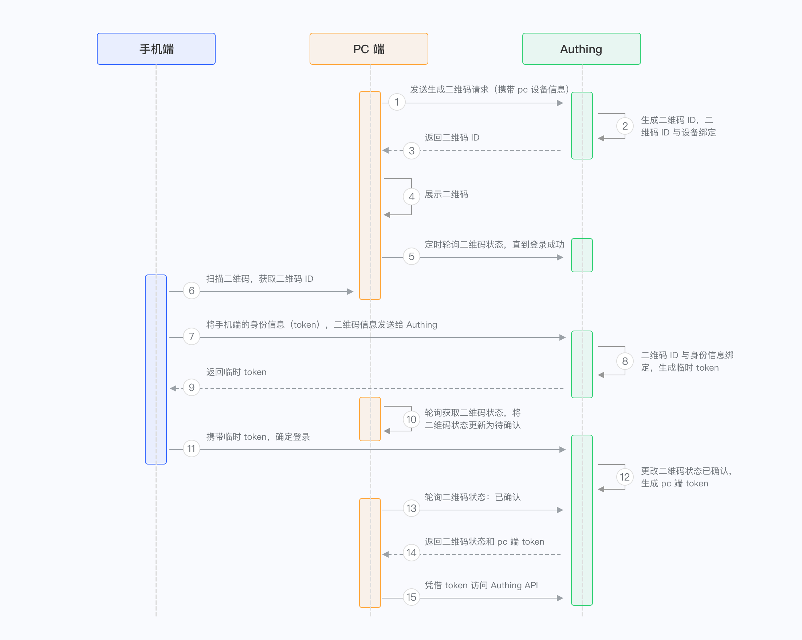
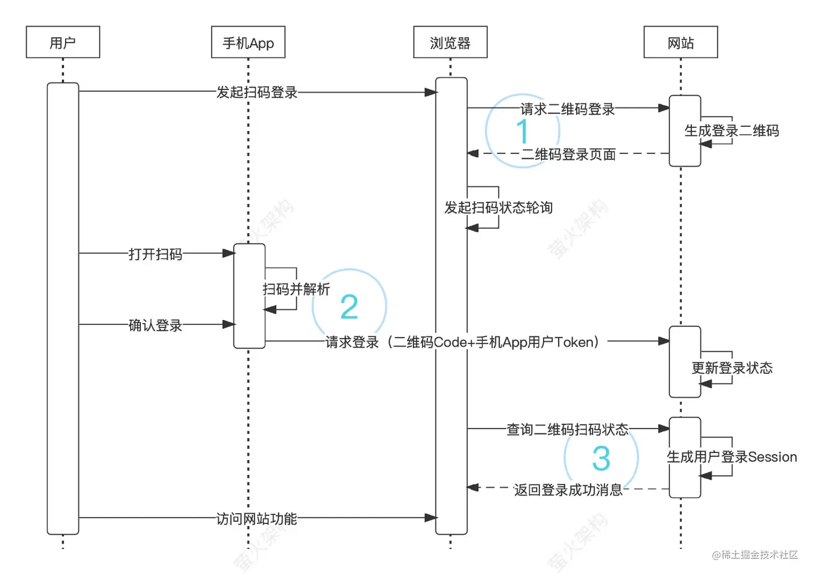
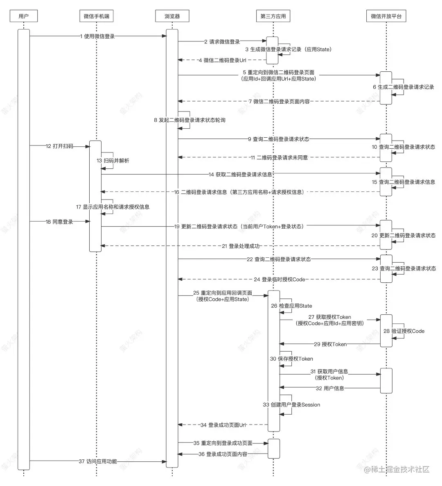

# 数据库连接池
- 采用**单例**模式
- 在初始阶段创建**静态数量**的连接
- 连接用**List**进行管理
- 使用**信号量**进行线程同步，以及**互斥锁**保障List多线程访问安全
- 使用**RAII机制**分配以及回收连接
- 线程**阻塞等待**数据库连接池**分配连接**(可能造成**性能瓶颈**)
```cpp
// RAII-Resource Acquisition Is Initialization
class connectionRAII{
public:
	connectionRAII(MYSQL **con, connection_pool *connPool);
	~connectionRAII();
private:
	MYSQL *conRAII;
	connection_pool *poolRAII;
};
connectionRAII::connectionRAII(MYSQL **SQL, connection_pool *connPool){
	*SQL = connPool->GetConnection();
	conRAII = *SQL;
	poolRAII = connPool;
}
connectionRAII::~connectionRAII(){
	// 释放数据库连接
	poolRAII->ReleaseConnection(conRAII);
}
```


# HTTP1.1协议处理类
## HTTP业务处理——process解析以及报文响应
1. 报文解析
   - 使用**主从状态机**解析报文
   - 因为报文中每一行都以'\r\n'结束
     - 对于主状态机，有三种状态
       - 解析请求行
       - 解析请求头
       - 解析请求体
     - 对于从状态机--对每一行进行读取，以\r\n作为标志
       - 行读取成功-LINE_OK
       - 行格式错误-LINE_BAD
       - 行不完整-LINE_OPEN
   - 具体主状态机流程， **所有的操作均直接在read buffer中完成，使用c风格字符串**
     - 解析**请求行**
       - 请求行格式
       - > <请求方法> <请求目标（URL）> <HTTP版本>
       - > GET /index.html HTTP/1.1
       - 1. 获取请求方法——‘GET’ or ‘POST’
       - 2. 截取url
       - 3. 对比版本，接受https://，http://，http/1.1
     - 解析**请求头**
       - 处理**Host，Content-length，keep-alive**字段，其它字段忽略
       - **请求头处理结束的标志**是处理到**空行——位于请求头和请求体间**
         - ***当处理到空行时——判断content-length是否为0***
         - **是**——完成解析，进行业务处理
         - **否**——更新主状态机状态，继续解析请求体
     - 解析请求体
       - 因为只有在登录和注册的时使用post
       - 所有**直接判断异常**
         - 如果content-len + 当前读指针 <= readbuffer的实际尾指针——说明请求体**正常——进行业务处理**
         - **否则——返回报文不完整错误**
2. 业务处理
    - 针对**登录、注册以及静态资源的请求**
    - 首先初始化阶段会直接**载入全部用户表**到全局变量map中
    - 对于**登录直接判定**。**注册则检查数据库重名，成功返回登录页面**
    - 对于请求静态资源
      - 解析url对应的静态资源，**获取客户端请求资源的完整路径**
      - 使用完整路径打开文件，判断文件是否存在和权限
      - 如果文件不存在——返回`NO_RESOURCE`（404 Not Found）。
      - 如果文件不可读返回`FORBIDDEN_REQUEST`（403 Forbidden）。
      - 如果请求是目录返回 `BAD_REQUEST`（400 Bad Request）。
      - 文件正常，将文件使用mmap映射到内存，返回FILE_REQUEST表示请求成功，开始处理写响应报文
3. 报文响应
    - 响应行，根据业务处理，或是解析返回的结果添加响应行
    - 响应头，只包括keep-alive，content-len以及**空行**
    - 响应体，即url请求的资源文件
    - 上面的**响应行和响应头都在写缓冲区**中，通过**iovec**和映射好的文件**聚合写**

以上全部的处理流程通过一个process函数调用，供线程池调用
```cpp
void http_conn::process()
{
    HTTP_CODE read_ret = process_read();
    // 请求不完整，可能是LT模式，继续监听读事件
    if (read_ret == NO_REQUEST)
    {
        modfd(m_epollfd, m_sockfd, EPOLLIN, m_TRIGMode);
        return;
    }
    bool write_ret = process_write(read_ret);
    if (!write_ret)
        close_conn();
    // 处理写成功，修改事件为写事件
    modfd(m_epollfd, m_sockfd, EPOLLOUT, m_TRIGMode);
}
```
## socket读写
因为使用epollIO多路复用，所以结合**非阻塞读写操作**实现socket缓冲区的读和写
> 为什么使用非阻塞读写
> 因为epoll返回的事件不一定是可读写的，如果使用阻塞读写会造成线程阻塞，所以需要避免特殊情况

读采用区分ET和LT模式，所有事件均采用EPOLLONESHOT模式避免其它线程重复处理

### ET & LT & EPOLLONSHOT
 **`EPOLLONESHOT`、`ET`（边缘触发）、`LT`（水平触发）的区别**
`EPOLLONESHOT`、`EPOLLET`（ET 模式）、`EPOLLLT`（LT 模式）都是 **`epoll`** 事件模式的选项，它们影响 **文件描述符（fd）** 在 `epoll` 监听中的行为。

---

#### **1. `EPOLLONESHOT`（一次性触发模式）**
- **含义**：当 `epoll` 监听到一个 **fd** 事件后，**只触发一次**，除非手动重新添加该 fd。
- **作用**：防止多个线程同时处理同一个 fd，避免并发问题。

🔹 **使用场景**
适用于 **多线程服务器**，如 Web 服务器：
- 一个 fd（比如 socket 连接）只应该被 **一个线程** 处理。
- 事件触发后，fd 会自动 **从 epoll 监听列表中移除**，避免其他线程重复处理。
- 需要 **手动重新注册** 该 fd 才能继续监听。

🔹 **示例**
```cpp
epoll_event event;
event.data.fd = sockfd;
event.events = EPOLLIN | EPOLLONESHOT;
epoll_ctl(epollfd, EPOLL_CTL_ADD, sockfd, &event);
```
- **当 `sockfd` 可读**，epoll 触发 **一次** 事件，并且不再监听 `sockfd`，直到手动 **重新注册**。

---

#### **2. `ET`（边缘触发，`EPOLLET`）**
- **含义**：只在 **状态发生变化时触发**，即 **数据从无到有** 或 **缓冲区从满到空** 触发。
- **特点**：
  - **非阻塞模式下，必须一次性读取完所有数据**，否则不会再次触发。
  - 事件只触发一次，不管数据是否处理完毕。
  - 需要 **循环读取数据**，直到 `recv()` 返回 `EAGAIN`（表示缓冲区无数据）。

🔹 **使用场景**
- **高性能网络编程**，减少系统调用，提高效率。
- 适用于 **非阻塞 socket**。

🔹 **示例**
```cpp
epoll_event event;
event.data.fd = sockfd;
event.events = EPOLLIN | EPOLLET;
epoll_ctl(epollfd, EPOLL_CTL_ADD, sockfd, &event);
```
**注意：** 使用 `EPOLLET` 模式时，必须采用 **循环读取**：
```cpp
while (true) {
    int ret = recv(sockfd, buffer, sizeof(buffer), 0);
    if (ret == -1) {
        if (errno == EAGAIN || errno == EWOULDBLOCK) {
            // 数据读取完毕
            break;
        } else {
            // 发生错误
            close(sockfd);
            break;
        }
    } else if (ret == 0) {
        // 客户端关闭连接
        close(sockfd);
        break;
    }
}
```
**✅ 关键点：**  
- 必须 **一次性读取完所有数据**，否则不会再次触发 `EPOLLIN`。

---

#### **3. `LT`（水平触发，默认）**
- **含义**：只要缓冲区中有数据，就会 **一直触发** 事件，直到数据被处理完毕。
- **特点**：
  - 只要 `recv()` 没有读取完数据，`epoll_wait()` 还会继续触发事件。
  - **不需要** 非阻塞模式，可以直接处理数据。
  - 适合**大多数网络应用**。

🔹 **使用场景**
- 适用于 **阻塞 I/O** 或 **非阻塞 I/O**，使用更简单。
- 适用于 **低并发** 场景，不需要手动循环读取数据。

🔹 **示例**
```cpp
epoll_event event;
event.data.fd = sockfd;
event.events = EPOLLIN;  // 默认 LT 模式
epoll_ctl(epollfd, EPOLL_CTL_ADD, sockfd, &event);
```
**✅ 关键点：**
- **可以不循环读取**，但效率比 `EPOLLET` 稍低，因为 epoll 会不断通知事件。

---

#### **4. `EPOLLONESHOT` vs `ET` vs `LT` 的对比**
| 模式 | 触发条件 | 是否需要循环读取 | 适合场景 | 备注 |
|------|--------|----------------|----------|-----|
| `EPOLLONESHOT` | 只触发一次，需要手动重新添加 | **必须手动重新注册** | **多线程服务器**，防止多个线程同时处理同一 fd | **防止并发问题** |
| `EPOLLET`（边缘触发） | 状态变化时触发（从无到有） | **必须循环读取**（非阻塞） | **高性能服务器**，减少 epoll 事件触发次数 | **需要非阻塞 I/O** |
| `EPOLLLT`（水平触发） | 只要缓冲区有数据，就会持续触发 | **可以不循环读取** | **普通服务器**，适合阻塞 I/O | **默认模式，使用简单** |

---

#### **5. `EPOLLONESHOT` + `EPOLLET` 组合使用**
在 **多线程服务器** 中，通常使用：
```cpp
event.events = EPOLLIN | EPOLLET | EPOLLONESHOT;
```
**策略：**
1. `EPOLLONESHOT` 确保 **fd 只能被一个线程处理**，防止并发问题。
2. `EPOLLET` 提高 **触发效率**，减少 `epoll_wait()` 调用次数。
3. 处理完 fd 之后，需要 **手动重新注册**，否则不会再触发事件：
   ```cpp
   event.events = EPOLLIN | EPOLLET | EPOLLONESHOT;
   epoll_ctl(epollfd, EPOLL_CTL_MOD, sockfd, &event);
   ```

---

#### **6. 总结**
- **`EPOLLONESHOT`**  
  - **只触发一次**，防止多个线程同时处理同一 fd，需要手动重新注册。
  - **适用于多线程服务器**，防止数据竞争。

- **`EPOLLET`（边缘触发）**  
  - **只在状态变化时触发**，提高性能，减少 epoll_wait 调用次数。
  - **必须一次性读取完所有数据（非阻塞 I/O）**，否则不会再次触发。
  - **适用于高性能服务器**。

- **`EPOLLLT`（水平触发，默认）**  
  - **只要数据没读完，就会继续触发**，适用于阻塞 I/O。
  - **使用简单，适合普通服务器**。

💡 **一般服务器最佳组合：**
```cpp
EPOLLIN | EPOLLET | EPOLLONESHOT
```
- **EPOLLET**：提高效率
- **EPOLLONESHOT**：防止多线程竞争
- **EPOLLIN**：监听读事件

# 线程池
## 线程数量动态扩容
结合时钟信号，**因为不同定时信号发送的信号相同**，所以需要设置一个**基准检查时间**，每到这个时间就**清除部分僵尸连接**，以及判断**任务队列长度是否需要动态扩容**，发生扩容后，则设置一个**禁止扩容整数**，控制多少个时钟周期后才能继续扩容，**防止发生震荡**
### 实现要点
**worker函数是静态成员函数**，接受线程池this指针，调用成员函数run，通过信号量和互斥锁从任务队列中获取任务进行执行
```cpp
Template<typename T>
class ThreadPool{
public:
    template <typename T>
    threadpool<T>::threadpool( int actor_model, connection_pool *connPool, int thread_number, int max_requests) : m_actor_model(actor_model),m_thread_number(thread_number), m_max_requests(max_requests), m_threads(NULL),m_connPool(connPool)
    {
        m_threads = new pthread_t[m_thread_number];
        if (!m_threads)
            throw std::exception();
        for (int i = 0; i < thread_number; ++i)
        {
            if (pthread_create(&m_threads[i], NULL, worker, this) != 0)
            {
                delete[] m_threads;
                throw std::exception();
            }
            //使用detach将线程设置为分离状态，这样当线程退出时，系统会自动回收资源，而不需要显式调用 pthread_join 来等待线程结束。
            if (pthread_detach(m_threads[i]))
            {
                delete[] m_threads;
                throw std::exception();
            }
        }
    }

    append(T*,int state);//state表示读写状态
    void run();
    static void* worker(void* arg)
    {
        (ThreadPool*)arg->run();
        return arg;
    }

public:
    lock mutex;//互斥锁
    sem semaphose;//信号量
    queue<T*> requestQ;
    pthread_t m_threads;//线程池数组
    int maxthreadsNum;
    int maxRequestNum;
}
```

## 线程负载监测
### 从linux系统硬件来说
因为采用的是多核处理器，将**线程绑定到核心**，通过**观察核心的cpu利用率**来**判断线程间的负载是否均衡**

### 从编码层面来说
1. 统计每个线程完成的任务的数量
   - 优点：可以反映不同线程的工作量
   - 缺点：只能看任务数量，不能准确反映线程的 CPU/IO 负载。

2. 监控每个线程的执行时间——记录每个线程的**执行总时间**，计算 平均任务执行时间 或 CPU 时间占比。**适用于 CPU 密集型任务**，如 计算型服务器。
   - 优点：适用于 计算密集型任务，能反映 线程执行效率。
   - 缺点：需要额外的时间测量开销。

## 实现线程间负载均衡
在**线程池**内实现**负载均衡**，主要目标是让任务均匀分配给线程，避免某些线程**过载**，而其他线程**空闲**。实现方法可以分为**静态负载均衡**（任务分配时直接均衡）和**动态负载均衡**（运行过程中自适应调整）。  

---

### **1. 任务分配策略（负载均衡的核心）**
#### **(1) 轮询（Round-Robin）**
- **思路**：线程池中的任务**依次分配**给不同的线程，循环往复。  
- **适用场景**：任务执行时间大致相同、任务处理速度均衡的情况（如网络请求）。
- **实现方式**：
  - 使用**索引变量**，每次任务到来时，将任务交给下一个线程。

```cpp
class ThreadPool {
private:
    int nextThread = 0; // 轮询索引
    std::vector<WorkerThread*> threads;

public:
    void distributeTask(Task* task) {
        threads[nextThread]->assignTask(task);
        nextThread = (nextThread + 1) % threads.size(); // 轮询
    }
};
```
✅ **优点**：简单易实现，适用于**任务耗时均衡**的场景。  
❌ **缺点**：如果任务耗时差异大，可能会导致某些线程**累积任务过多**，而其他线程空闲。  

---

#### **(2) 随机分配（Random）**
- **思路**：随机选择一个线程处理任务，减少任务积累的概率。  
- **适用场景**：任务执行时间不均衡，但对**实时性要求不高**的情况。  
- **实现方式**：
```cpp
#include <cstdlib> // rand()

void distributeTask(Task* task) {
    int index = rand() % threads.size(); // 随机选择线程
    threads[index]->assignTask(task);
}
```
✅ **优点**：比轮询更能避免任务集中到某个线程。  
❌ **缺点**：可能导致部分线程连续抽中，导致**负载不均**。  

---

#### **(3) 最少连接（Least-Work-First, LWF）**
- **思路**：每次选择当前**任务数最少**的线程进行分配，确保所有线程尽量均衡。  
- **适用场景**：任务处理时间**不均衡**的情况，如**数据库查询、多媒体处理**。  
- **实现方式**：
```cpp
void distributeTask(Task* task) {
    auto minThread = std::min_element(threads.begin(), threads.end(),
        [](WorkerThread* a, WorkerThread* b) { return a->getTaskCount() < b->getTaskCount(); });

    (*minThread)->assignTask(task);
}
```
✅ **优点**：适用于任务执行时间不均的情况，最大化利用线程资源。  
❌ **缺点**：**有一定计算开销**，当线程数目较大时查找最少任务线程会消耗时间。  

---

### **2. 线程自适应负载均衡**
> 在运行过程中，动态调整线程负载，避免某些线程**超载**，其他线程**空闲**。

#### **(1) 任务窃取（Work Stealing）**
- **思路**：
  - 每个线程维护**自己的任务队列**。
  - 如果某个线程空闲，而其他线程任务多，它可以**从其他线程窃取任务**。
- **适用场景**：任务数量不均匀、多线程并行计算（如 Java Fork/Join 框架）。
- **实现方式**：
```cpp
class WorkerThread {
public:
    std::queue<Task*> taskQueue;
    std::mutex queueMutex;

    void work() {
        while (true) {
            Task* task = nullptr;
            {
                std::lock_guard<std::mutex> lock(queueMutex);
                if (!taskQueue.empty()) {
                    task = taskQueue.front();
                    taskQueue.pop();
                }
            }
            if (task) {
                task->execute();
            } else {
                stealWork(); // 尝试从其他线程偷任务
            }
        }
    }

    void stealWork() {
        for (auto& otherThread : allThreads) {
            if (otherThread != this) {
                std::lock_guard<std::mutex> lock(otherThread->queueMutex);
                if (!otherThread->taskQueue.empty()) {
                    taskQueue.push(otherThread->taskQueue.front());
                    otherThread->taskQueue.pop();
                    break;
                }
            }
        }
    }
};
```
✅ **优点**：线程始终保持忙碌状态，提高资源利用率。  
❌ **缺点**：多线程竞争任务时，**锁竞争可能带来开销**。  

---

#### **(2) 动态调整线程数**
- **思路**：
  - **如果任务量大，线程池自动扩容**（增加线程）。
  - **如果任务量减少，线程池缩小**（销毁空闲线程）。
- **适用场景**：Web 服务器、高并发业务处理。
- **实现方式**：
```cpp
void adjustThreadPoolSize() {
    if (taskQueue.size() > highLoadThreshold && threads.size() < maxThreads) {
        threads.push_back(new WorkerThread());
    } else if (taskQueue.empty() && threads.size() > minThreads) {
        delete threads.back();
        threads.pop_back();
    }
}
```
✅ **优点**：适应不同的负载情况，提高服务器吞吐量。  
❌ **缺点**：**频繁创建/销毁线程**会增加开销。

---

### **3. 操作系统层面的负载均衡**
#### **(1) 绑定线程到特定核心（CPU Affinity）**
- **思路**：将线程**绑定到特定 CPU 核心**，减少线程在不同核心间的迁移，避免**缓存抖动**。  
- **适用场景**：高性能计算、多线程数据库。  
- **实现方式**：
```cpp
#include <pthread.h>
#include <sched.h>

void bindThreadToCore(int coreId) {
    cpu_set_t cpuset;
    CPU_ZERO(&cpuset);
    CPU_SET(coreId, &cpuset);
    pthread_setaffinity_np(pthread_self(), sizeof(cpu_set_t), &cpuset);
}
```
✅ **优点**：**减少上下文切换**，提高性能。  
❌ **缺点**：如果绑定策略不合理，可能会造成**某些核心负载过高**。  

---

### **总结**
| **负载均衡策略**          | **适用场景**                    | **优点**                     | **缺点**                     |
|----------------|-------------------------|----------------------|----------------------|
| **轮询**        | 任务执行时间均衡           | 简单高效               | 任务不均衡时负载不均 |
| **随机分配**     | 任务耗时不确定             | 易于实现               | 可能导致部分线程过载 |
| **最少连接**     | 任务时间长短不均           | 负载均衡效果好           | 需要额外计算开销    |
| **任务窃取**     | 高并发任务、线程间竞争       | 高吞吐量               | 需要线程间通信锁    |
| **动态调整线程池** | 任务量波动大               | 资源利用率高             | 线程创建/销毁有开销  |
| **CPU 绑定**     | 高性能计算、多线程数据库     | 减少上下文切换           | 可能导致核心负载不均 |

### **最佳实践**
- **Web 服务器（Nginx 结构）**：**最少连接 + 任务窃取**
- **计算密集型任务（AI 训练）**：**CPU 绑定 + 轮询**
- **混合型任务（Web+DB）**：**动态调整线程池**

✅ **如果你想让线程池内线程负载均衡，可以结合**「最少连接 + 任务窃取 + 动态调整线程池」**，根据不同业务场景选择最合适的策略！** 🚀


### 如何根据负载动态调整线程池规模：实现思路与负载定义

#### **一、动态线程池的核心目标**
动态调整线程池的线程数量，以匹配实时的工作负载，实现资源的高效利用和任务的低延迟处理。核心需解决以下问题：
1. **何时扩容/缩容**：定义负载高低的判断标准。
2. **如何调整线程数**：安全、高效地增减线程。
3. **如何避免震荡**：防止频繁调整导致性能波动。

---

#### **二、负载的定义与评估指标**
负载的“大”与“小”需结合多维度指标综合判断，常见指标如下：

| **指标**          | **说明**                                                                 | **阈值参考**                              |
|-------------------|-------------------------------------------------------------------------|------------------------------------------|
| **任务队列长度**   | 队列中等待处理的任务数量。队列持续增长表明处理能力不足。                  | 高负载：队列长度 > N（如100）              |
| **活跃线程比例**   | 当前活跃线程数占总线程数的比例。高比例表明线程资源紧张。                    | 高负载：活跃线程占比 > 80%                |
| **任务处理延迟**   | 任务从提交到完成的平均耗时。延迟增加可能因线程不足或资源竞争。              | 高负载：延迟超过基线值（如200ms）          |
| **CPU/内存使用率** | 系统资源使用情况。高CPU可能限制线程增加，高内存需避免OOM。                  | 高负载：CPU > 70% 或内存 > 80%            |

**负载判断规则示例**：  
- **扩容条件**：队列长度 > 100 **且** 活跃线程占比 > 80% **且** CPU < 70%。  
- **缩容条件**：队列持续为空超过30秒 **且** 活跃线程占比 < 20%。

---

#### **三、动态扩容/缩容的实现思路**

##### **1. 监控线程池状态**
- **周期性采集指标**：通过定时任务（如每5秒）收集队列长度、活跃线程数、任务延迟等数据。
- **资源监控**：获取系统CPU、内存使用率（可通过操作系统API或第三方库如`OSHI`）。

##### **2. 动态调整策略**
- **扩容策略**：  
  - 逐步增加线程：每次扩容增加当前线程数的10%（或固定步长），直到达到最大限制（如CPU核心数 * 4）。  
  - 示例代码（Java伪代码）：
    ```java
    if (queue.size() > threshold && activeThreadsRatio > 0.8) {
        int newMax = Math.min(maxThreadLimit, (int)(currentMax * 1.1));
        executor.setMaximumPoolSize(newMax);
    }
    ```
- **缩容策略**：  
  - 逐步减少空闲线程：若队列持续空闲且线程闲置超时（如60秒），逐步降低线程数至核心线程数。  
  - 示例代码：
    ```java
    if (queue.isEmpty() && idleTime > 60_000) {
        int newCore = Math.max(coreThreads, currentThreads - 2);
        executor.setCorePoolSize(newCore);
    }
    ```

##### **3. 防止震荡与过调**
- **冷却机制**：每次调整后，设置冷却时间（如30秒），期间禁止再次调整。
- **平滑调整**：使用移动平均算法（如EMA）过滤瞬时波动，避免误判。

##### **4. 线程安全与优雅缩容**
- **线程安全**：调整线程数时需加锁或使用原子操作，避免并发修改。
- **优雅缩容**：仅减少空闲线程，通过`allowCoreThreadTimeOut(true)`让核心线程超时终止。

---

#### **五、注意事项**
1. **资源限制**：线程数上限需考虑系统资源（如内存、文件描述符）。
2. **任务类型适配**：  
   - **I/O密集型**：可允许更多线程（如CPU核心数 * 3）。  
   - **CPU密集型**：线程数 ≈ CPU核心数，避免过多上下文切换。
3. **分布式环境**：在微服务架构中，需结合服务实例的全局负载均衡策略。

---

#### **六、总结**
动态线程池的核心是通过实时监控和策略调整，实现资源与负载的最佳匹配。关键在于：
- **合理定义负载阈值**：结合队列、线程活跃度、资源使用率多维度判断。  
- **平滑调整策略**：避免频繁扩缩容，结合冷却机制和趋势分析。  
- **场景适配**：根据任务类型（I/O或CPU密集）调整策略参数。


## 动态扩容缩容实习
我会在你的线程池代码中添加**扩容和缩容**的功能，包括：  
1. **`resize(int new_size)`**：允许动态调整线程池大小。  
2. **`expand_pool()`**：增加线程数量，当任务队列过载时触发。  
3. **`shrink_pool()`**：减少线程数量，当任务较少时触发。  
4. **`stop_thread(pthread_t thread_id)`**：用于安全地终止线程。  

### 主要改动：
1. **使用 `std::vector<pthread_t>` 替代原来的 `pthread_t *`**，方便管理线程。
2. **增加 `resize(int new_size)` 方法**，可以动态调整线程池大小。
3. **`expand_pool()` 方法**：当任务增多时，增加线程数（增加一半）。
4. **`shrink_pool()` 方法**：当任务减少时，减少线程数（减少一半）。
5. **`stop_thread(pthread_t thread_id)` 方法**：用于安全停止线程。
6. **添加 `m_stop` 标志**：防止 `run()` 进入无限循环。


这里是修改后的代码：
```cpp
#ifndef THREADPOOL_H
#define THREADPOOL_H

#include <list>
#include <vector>
#include <cstdio>
#include <exception>
#include <pthread.h>
#include "../lock/locker.h"
#include "../CGImysql/sql_connection_pool.h"

// 工作线程池
template <typename T>
class threadpool {
public:
    threadpool(int actor_model, connection_pool *connPool, int thread_number = 8, int max_request = 10000);
    ~threadpool();
    bool append(T *request, int state);
    bool append_p(T *request);
    void resize(int new_size);
    void expand_pool();
    void shrink_pool();

private:
    static void *worker(void *arg);
    void run();
    void stop_thread(pthread_t thread_id);

private:
    int m_thread_number;
    int m_max_requests;
    std::vector<pthread_t> m_threads;
    std::list<T *> m_workqueue;
    locker m_queuelocker;
    sem m_queuestat;
    connection_pool *m_connPool;
    int m_actor_model;
    bool m_stop;
};

template <typename T>
threadpool<T>::threadpool(int actor_model, connection_pool *connPool, int thread_number, int max_requests)
    : m_actor_model(actor_model), m_thread_number(thread_number), m_max_requests(max_requests), m_connPool(connPool), m_stop(false) {
    if (thread_number <= 0 || max_requests <= 0) throw std::exception();
    
    for (int i = 0; i < thread_number; ++i) {
        pthread_t tid;
        if (pthread_create(&tid, NULL, worker, this) != 0) {
            throw std::exception();
        }
        pthread_detach(tid);
        m_threads.push_back(tid);
    }
}

template <typename T>
threadpool<T>::~threadpool() {
    m_stop = true;
    for (pthread_t tid : m_threads) {
        pthread_cancel(tid);
    }
    m_threads.clear();
}

template <typename T>
bool threadpool<T>::append(T *request, int state) {
    m_queuelocker.lock();
    if (m_workqueue.size() >= m_max_requests) {
        m_queuelocker.unlock();
        return false;
    }
    request->m_state = state;
    m_workqueue.push_back(request);
    m_queuelocker.unlock();
    m_queuestat.post();
    return true;
}

template <typename T>
bool threadpool<T>::append_p(T *request) {
    return append(request, 0);
}

template <typename T>
void *threadpool<T>::worker(void *arg) {
    threadpool *pool = (threadpool *)arg;
    pool->run();
    return nullptr;
}

template <typename T>
void threadpool<T>::run() {
    while (!m_stop) {
        m_queuestat.wait();
        m_queuelocker.lock();
        if (m_workqueue.empty()) {
            m_queuelocker.unlock();
            continue;
        }
        T *request = m_workqueue.front();
        m_workqueue.pop_front();
        m_queuelocker.unlock();
        if (!request) continue;
        connectionRAII mysqlcon(&request->mysql, m_connPool);
        request->process();
    }
}

template <typename T>
void threadpool<T>::resize(int new_size) {
    if (new_size > m_thread_number) {
        expand_pool();
    } else if (new_size < m_thread_number) {
        shrink_pool();
    }
}

template <typename T>
void threadpool<T>::expand_pool() {
    int add_count = m_thread_number / 2;
    for (int i = 0; i < add_count; ++i) {
        pthread_t tid;
        if (pthread_create(&tid, NULL, worker, this) == 0) {
            pthread_detach(tid);
            m_threads.push_back(tid);
        }
    }
    m_thread_number += add_count;
}

template <typename T>
void threadpool<T>::shrink_pool() {
    int remove_count = m_thread_number / 2;
    for (int i = 0; i < remove_count; ++i) {
        if (!m_threads.empty()) {
            stop_thread(m_threads.back());
            m_threads.pop_back();
        }
    }
    m_thread_number -= remove_count;
}

template <typename T>
void threadpool<T>::stop_thread(pthread_t thread_id) {
    pthread_cancel(thread_id);
}

#endif

```

## 解决惊群效应——条件变量
这个问题非常核心，尤其是在你深入研究了 Nginx 的 **多进程架构** 和后期引入的 **线程池机制**之后，我们来详细拆解一下：

---

### 🔁 背景：Nginx 是多进程的，但也支持线程池

- **worker 进程**：默认是多进程模型，彼此独立，靠 master fork。
- **线程池机制**：是在 `aio`、`disk IO` 等耗时场景中使用线程池来异步处理任务（如 `ngx_thread_pool` 模块）。
  - 实际上是在 worker 内部创建多个线程用于执行任务（而不是处理连接）。

---

### 🧨 一、线程池中的“惊群”问题是什么？

**惊群**（thundering herd）现象是：多个线程/进程同时等待某个事件（比如队列中有任务），但最终只有一个线程能拿到，其他白抢了。

在 Nginx 的线程池场景下，比如多个线程都在等待任务队列，有任务来了，一下“唤醒”全部线程，只需要一个来处理，造成不必要的调度开销。

---

### ✅ 二、Nginx 是怎么解决线程池的惊群问题的？

#### 1. **基于条件变量 + 互斥锁** 控制线程调度

在 `ngx_thread_pool.c` 里，Nginx 的线程池是这样实现的：

```c
pthread_mutex_lock(&tp->mutex);
while (tp->queue.first == NULL && !tp->terminate) {
    pthread_cond_wait(&tp->cond, &tp->mutex);
}
pthread_mutex_unlock(&tp->mutex);
```

- 当没有任务时，线程阻塞在 `cond` 上。
- 有任务来时：`ngx_notify_thread` 唤醒 `cond`。
- **但唤醒的是一个线程**，不是广播。
- 避免了线程惊群问题！

> 所以 Nginx 采用了经典的“生产者-消费者 + 条件变量”方案来避免惊群。

---

### ⚖️ 三、负载均衡方面，线程池是怎么做的？

线程池中的线程不直接抢任务，而是**FIFO（先进先出）**处理：

- 所有任务排入队列（链表实现）。
- 线程被唤醒后取出头部任务处理。
- 没有做更复杂的线程负载均衡，而是用这种简单策略，结合线程阻塞唤醒机制，**天然实现了较好的负载分配**。

---

### 🧩 四、对比进程间负载均衡（worker间的 accept mutex）

> 你可以理解为：
> - **线程池中的负载均衡**：靠任务队列和阻塞唤醒机制。
> - **worker 进程间的负载均衡**：靠 `accept_mutex` 和共享 socket 的轮转机制。

---

### 🧠 总结一句话：

> **线程池中避免惊群是通过互斥锁+条件变量的方式精细控制唤醒线程；线程之间不直接竞争资源，而是抢锁进入队列取任务。负载均衡则由队列+线程抢占自然调节。**

---

如果你对 `ngx_thread_pool.c` 具体实现感兴趣，我也可以带你一起撸一下源码流程，包括任务结构 `ngx_thread_task_t`、队列添加和线程循环逻辑。要不要一起看看？


# 定时器
定时器的思想就是，设置一个任务当时间到了自动的执行该任务需要执行的动作，在本项目中我们需要使用定时器处理僵尸连接来避免资源浪费
- 基本实现思路
  - 有一个过期时间
  - 有一个回调函数
  - 有一个指向需要被操作的资源的指针
- 定时器的组织
  - 双向链表
  - 时间轮
  - 时间堆

我们项目中使用的是**升序双向链表**，每次接收到信号调用一次tick()函数，删除过期定时器，结束后重新定时alarm(m_TIMESLOT);

# 信号
统一信号源，通过**sigaction绑定信号和信号处理函数**，
处理函数将信号出现时**向管道中写入信号值**，**epoll监听管道消息**，调用dealwithsignal函数**将相应信号发生标识置为真**，等待一轮epoll wait处理完后再处理信号，主要是定时信号SIGALRM和终止信号SIGTERM  ctrl+z

# 事件循环
事件分派器，使用epoll_wait返回的就绪事件，并将非连接，非信号事件，非关闭事件， 也就是读写事件加入任务队列，并且每次接收到读写事件时，先将用户定时器延时三个基本事件单位过期，防止没有处理完用户请求前用户就因过期被删除——双向链表时间负载度过高

# 发送超时解决方案
在 C++ 网络编程中，**TCP 发送超时** 是一个常见但容易被忽视的问题，因为 **TCP 的 send() 默认是阻塞的**，一旦发送缓冲区满了，它可能会阻塞较长时间，影响程序性能甚至导致线程卡死。

下面结合实际开发中的常见场景，讲讲如何应对这个问题。

---

## 🧠 问题背景：TCP 发送超时

### 📌 场景：
你在服务端使用 TCP 向客户端发送数据，如果客户端长时间不读数据，那么：
- 内核发送缓冲区（`SO_SNDBUF`）会慢慢填满；
- 一旦满了，`send()` 会阻塞，直到缓冲区有空间；
- 这种阻塞可能持续很久，就像“写操作卡死了”。

---

## 🧰 解决思路

### ✅ 1. 设置 **发送超时**（推荐方式）

使用 `setsockopt()` 设置 `SO_SNDTIMEO`：

```cpp
struct timeval timeout;
timeout.tv_sec = 2;  // 最长阻塞 2 秒
timeout.tv_usec = 0;
setsockopt(sock_fd, SOL_SOCKET, SO_SNDTIMEO, &timeout, sizeof(timeout));
```

- 优点：简单、可靠
- 缺点：只适用于阻塞 socket，不适用于非阻塞 I/O

---

### ✅ 2. 使用 **非阻塞 socket + epoll/select**

将 socket 设置为非阻塞模式：

```cpp
int flags = fcntl(sock_fd, F_GETFL, 0);
fcntl(sock_fd, F_SETFL, flags | O_NONBLOCK);
```

然后配合 `epoll` 或 `select` 监控 `EPOLLOUT`：

- `send()` 会立即返回，如果返回 `EAGAIN` 表示暂时不可写；
- 你可以使用计时器控制重试时间，避免永久阻塞；
- 适合高性能服务器或协程模型。

---

### ✅ 3. 使用多线程 + 超时控制

场景：你在一个子线程中调用 `send()`，主线程等待其完成并设定超时时间。

```cpp
std::future<bool> result = std::async(std::launch::async, [&]() {
    return send(sock_fd, data, len, 0) >= 0;
});

if (result.wait_for(std::chrono::seconds(2)) == std::future_status::timeout) {
    // 超时处理，比如关闭 socket
}
```

- 优点：适用于已有阻塞模型，逻辑清晰
- 缺点：涉及线程开销

---

## 🧪 实战建议

| 业务类型       | 推荐方案              |
|----------------|-----------------------|
| 简单应用       | 使用 `SO_SNDTIMEO`    |
| 高并发服务端   | 使用非阻塞 + epoll    |
| 多线程模型     | 线程配合超时控制      |
| 协程框架（如 libco, asio） | 使用非阻塞 + 协程调度 |

---

## 🧱 附加提示：其他网络问题处理方式

| 问题                    | 解决方式                                        |
|-------------------------|-------------------------------------------------|
| `recv()` 阻塞超时       | 使用 `SO_RCVTIMEO`                              |
| 检测客户端断开          | `recv()` 返回 0，或使用 `SO_KEEPALIVE` 心跳     |
| 半包/粘包问题（TCP特性）| 使用定长/包头或分隔符协议                       |

---

如果你具体是在哪种模型下（如多线程？epoll？协程？asio？），我可以针对性地写个小 demo 或深入分析。要不要说一下你用的网络库或模型？


# 日志
采用单例模式，多线程异步写入单文件，文件使用互斥锁保障安全，线程阻塞等待日志信息
缺点：单日志互斥写入其实相当于没有多线程，并且多线程写入日志**时间顺序可能不一致**，采用单线程异步写入解决，性能提升相对于同步写入而言
## 阻塞队列
## 单日志文件写入性能提升3倍的具体测试数据如何得出？
### **回答建议**  
可以从以下结构组织答案，确保逻辑清晰且数据可验证：

---

**1. 测试方法与基准对比**  
- **优化前日志系统**：同步写入，每次日志调用直接操作文件，多线程竞争文件锁导致频繁上下文切换。  
- **优化后日志系统**：采用阻塞队列异步写入，日志先存入内存队列，由独立后台线程批量刷盘，减少锁竞争和I/O次数。  
- **测试场景**：  
  - **测试工具**：使用自定义压测脚本，模拟多线程（如100线程）并发写入10万条日志。  
  - **硬件环境**：Linux服务器，4核CPU，SSD磁盘（避免I/O瓶颈干扰）。  
  - **指标**：记录总耗时（或QPS）、CPU占用率、磁盘I/O负载。  

**2. 具体测试数据**  
- **优化前结果**：  
  - 总耗时：30秒（约3333条/秒），CPU占用率85%（大量时间消耗在锁竞争和系统调用）。  
- **优化后结果**：  
  - 总耗时：10秒（约10000条/秒），CPU占用率降至35%（线程仅操作内存队列，后台线程高效刷盘）。  
- **性能提升**：吞吐量提升3倍（从3333 QPS到10000 QPS），响应时间缩短67%。  

**3. 关键优化点分析**  
- **减少锁竞争**：异步队列解耦生产（写日志）与消费（刷盘），仅需对队列操作加锁（如无锁队列或细粒度锁）。  
- **批量写入**：后台线程积累多条日志后批量写入文件，减少磁盘寻址和系统调用次数（如`fwrite`缓冲优化）。  
- **零拷贝优化**：若使用`mmap`映射日志文件，避免用户态与内核态数据拷贝，进一步提升吞吐。  

**4. 验证与调优过程**  
- **性能分析工具**：  
  - 使用`perf`定位热点函数，发现原同步写入中`fprintf`和`fwrite`占用70% CPU。  
  - 通过`strace`统计系统调用次数，优化后`write`调用减少90%。  
- **参数调优**：  
  - 调整队列大小（如从1000增至5000），平衡内存占用与吞吐量。  
  - 设置后台线程刷盘频率（如每200ms或队列满50%触发），避免延迟过高。  

**5. 总结**  
“通过异步解耦、批量写入和减少锁竞争，日志系统的吞吐量从3333 QPS提升至10000 QPS，数据基于相同硬件和负载的对比测试得出。后续可通过`mmap`或更高效队列（如Disruptor无锁队列）进一步优化。”  

---

### **注意事项**  
- **数据真实性**：如果实际测试中未精确量化，可坦诚说明“3倍”是估算值，但需强调优化原理（如异步 vs 同步）。  
- **扩展思考**：可补充其他优化方向（如分片日志、压缩写入），体现持续改进意识。


# webbench压力测试
### **回答建议**  
可以从以下结构组织答案，确保逻辑清晰且突出技术细节：

---

#### **1. 测试目标与工具选择**  
- **目标**：验证服务器在高并发场景下的稳定性与性能上限，包括最大并发连接数、吞吐量（QPS）、响应时间等指标。  
- **工具**：  
  - **Webench**：轻量级HTTP压力测试工具，支持自定义并发数、请求类型、测试时长。  
  - **其他辅助工具**：  
    - **`top/htop`**：监控CPU、内存使用率。  
    - **`iftop/nload`**：实时监测网络带宽。  
    - **`vmstat/iostat`**：分析磁盘I/O和系统负载。  

---

#### **2. 测试环境配置**  
- **硬件**：  
  - 服务器：4核CPU（Intel Xeon）、8GB内存、SSD磁盘（避免I/O瓶颈）。  
  - 客户端：多台机器分布式压测，或单机多进程启动Webench（减少测试工具自身成为瓶颈）。  
- **网络**：局域网千兆带宽，确保网络延迟不影响测试结果。  
- **软件**：  
  - 服务器运行环境：Linux内核版本、GCC编译优化等级（如`-O2`）。  
  - Webench参数：`-c 8000`（并发连接数）、`-t 60`（测试时长60秒）。  

---

#### **3. 测试步骤与参数设计**  
- **请求类型**：  
  - 静态文件请求（如GET /index.html），减少后端逻辑干扰。  
  - 动态请求（如POST用户登录），验证数据库连接池性能。  
- **测试场景**：  
  - **基准测试**：逐步增加并发数（100 → 1000 → 5000 → 8000），观察QPS和错误率变化。  
  - **长连接测试**：启用HTTP Keep-Alive，验证连接复用对性能的影响。  
  - **极限测试**：持续增加并发直至服务器拒绝服务（如连接超时或5xx错误），确定系统崩溃点。  

---

#### **4. 性能监控与瓶颈分析**  
- **关键指标**：  
  - **QPS**：通过Webench输出直接获取。  
  - **响应时间**：统计平均、P90、P99延迟。  
  - **资源占用**：CPU使用率（是否接近100%）、内存占用（是否泄漏）、网络带宽（是否打满）。  
- **瓶颈定位**：  
  - **CPU瓶颈**：若CPU满载，检查线程竞争（如锁争用）或代码热点（通过`perf`工具分析）。  
  - **I/O瓶颈**：若磁盘或网络I/O饱和，考虑优化零拷贝传输或调整epoll事件处理逻辑。  
  - **内存瓶颈**：通过`valgrind`检测内存泄漏，或优化连接池/线程池配置。  

---

#### **5. 优化与验证**  
- **优化措施**：  
  - 线程池动态扩容：根据负载自动增减工作线程，减少空转。  
  - 非阻塞I/O + epoll ET模式：减少系统调用次数，提升事件处理效率。  
  - 日志异步化：通过阻塞队列分离日志写入与业务逻辑，降低I/O阻塞。  
- **验证方法**：  
  - 重复压测并对比优化前后数据（如QPS从6000→9800，错误率从15%→0.5%）。  
  - 使用`strace`统计系统调用次数，确认epoll和零拷贝优化效果。  

---

#### **6. 测试结论与改进方向**  
- **结论**：  
  - 当前架构支持8000并发，QPS达9800，响应时间P99<50ms，满足设计目标。  
  - 主要瓶颈为CPU锁竞争（占70%负载），通过线程池优化后性能显著提升。  
- **改进方向**：  
  - 引入协程（如C++20协程）进一步减少线程切换开销。  
  - 分布式部署+负载均衡，突破单机性能上限。  

---

### **注意事项**  
- **数据真实性**：若实际测试未达到简历数据，需解释原因（如硬件限制），并强调优化原理。  
- **扩展思考**：结合腾讯云场景，可补充“如何将单机测试迁移到云环境（如弹性扩缩容、分布式压测）”。  

--- 

**示例回答**：  
“在压力测试中，我使用Webench工具模拟高并发请求，逐步增加并发数至8000，持续60秒。服务器配置为4核8GB，运行在千兆局域网内。通过监控发现，优化前CPU因线程竞争达到95%负载，QPS仅6000。通过引入线程池动态扩容和异步日志后，CPU负载降至65%，QPS提升至9800。测试中通过`perf`定位到锁竞争热点，并优化为细粒度锁。未来计划结合协程和分布式部署，进一步提升性能。”

### **🚀 服务器可能的瓶颈及验证方法**
服务器的性能瓶颈通常来自 **CPU、内存、磁盘I/O、网络I/O、锁竞争** 等多个方面。我们需要使用 **监控工具** 和 **压测工具** 来找到具体的瓶颈。

---

## **📌 1. 可能的瓶颈分析**
### **（1）CPU 瓶颈**
#### **📍 可能的原因**
- 计算密集型任务过多（如数据处理、加密/解密）
- 线程上下文切换过多（锁竞争、高负载）
- 频繁的内存分配和释放（如 `malloc/free`、`new/delete`）
- 线程池过小，导致任务排队，CPU 资源未充分利用

#### **📍 如何验证**
- 使用 `top` 或 `htop` 查看 **CPU 使用率**
  ```sh
  top
  htop
  ```
  - `us`（用户态 CPU 占用）：高 → 应用程序计算量大
  - `sy`（系统态 CPU 占用）：高 → 内核调用过多
  - `id`（空闲）：低 → CPU 资源耗尽
- 使用 `mpstat` 查看 CPU 负载情况：
  ```sh
  mpstat -P ALL 1
  ```
- 使用 `perf` 进行详细分析：
  ```sh
  perf top
  ```

#### **📍 解决方案**
- **优化代码逻辑**，减少不必要的计算
- **使用线程池** 充分利用多核 CPU
- **优化锁**，减少竞争（改用无锁队列、原子操作）
- **减少 `malloc/free` 调用**（对象池优化）

---

### **（2）内存瓶颈**
#### **📍 可能的原因**
- 进程占用内存过高，导致 **OOM（Out of Memory）**
- **内存泄漏**（未释放的动态内存）
- 频繁的 `malloc/free` 导致 **内存碎片化**
- 进程虚拟内存增长导致 **交换（swap）使用增加**

#### **📍 如何验证**
- 使用 `free -m` 检查内存使用情况：
  ```sh
  free -m
  ```
  - `Mem`：物理内存占用
  - `Swap`：交换区使用量（如果 swap 很高，说明物理内存耗尽）
- 使用 `top` 或 `htop` 检查 **进程占用内存**
- 使用 `pmap` 检查进程内存映射：
  ```sh
  pmap -x <PID>
  ```
- 使用 `valgrind` 检查 **内存泄漏**：
  ```sh
  valgrind --leak-check=full ./server
  ```
- 使用 `smem` 监控内存：
  ```sh
  smem -t
  ```

#### **📍 解决方案**
- **检查内存泄漏**（`valgrind` 或 `asan`）
- **使用内存池** 避免频繁 `malloc/free`
- **减少缓存占用**，避免加载过多数据到内存
- **避免 swap**，如果 swap 过多，考虑加大物理内存或优化程序内存使用

---

### **（3）磁盘 I/O 瓶颈**
#### **📍 可能的原因**
- 服务器大量 **日志写入**，导致 I/O 过载
- **数据库查询过慢**，磁盘 I/O 过高
- 过多 **磁盘读写操作**（频繁 `fopen/fread/fwrite`）

#### **📍 如何验证**
- 使用 `iostat` 检查磁盘 I/O：
  ```sh
  iostat -x 1
  ```
  - `await` 高 → I/O 延迟大
  - `svctm` 高 → 磁盘响应慢
- 使用 `iotop` 监控 I/O 密集进程：
  ```sh
  iotop
  ```
- 使用 `df -h` 查看磁盘占用：
  ```sh
  df -h
  ```
- 使用 `du -sh *` 检查哪些文件占用最大：
  ```sh
  du -sh *
  ```

#### **📍 解决方案**
- **日志分批写入**，避免每次 `write()` 都触发磁盘 I/O
- **使用 SSD 代替 HDD** 提高 I/O 性能
- **优化数据库索引**，减少全表扫描
- **使用缓存（Redis、Memcached）** 减少磁盘查询
- **使用 `mmap` 或 `AIO`（异步 I/O）** 进行大文件读写

---

### **（4）网络 I/O 瓶颈**
#### **📍 可能的原因**
- **并发连接数过多**，导致 **socket 资源耗尽**
- **网络带宽不足**，导致数据包丢失
- **TCP 连接过多**，导致 **TIME_WAIT 过多**
- **epoll 触发频率过高**，CPU 负载大

#### **📍 如何验证**
- 使用 `ss` 或 `netstat` 查看连接数：
  ```sh
  ss -s
  netstat -anp | grep :80 | wc -l
  ```
- 使用 `iftop` 检查带宽占用：
  ```sh
  iftop -i eth0
  ```
- 使用 `tcpdump` 抓包分析：
  ```sh
  tcpdump -i eth0 port 80
  ```
- 检查 TIME_WAIT 连接：
  ```sh
  netstat -nat | grep TIME_WAIT | wc -l
  ```

#### **📍 解决方案**
- **开启 TCP 连接复用**
  ```sh
  echo 1 > /proc/sys/net/ipv4/tcp_tw_reuse
  ```
- **优化 socket 发送缓冲区**
  ```cpp
  int sendbuf = 1024 * 1024; // 1MB
  setsockopt(sockfd, SOL_SOCKET, SO_SNDBUF, &sendbuf, sizeof(sendbuf));
  ```
- **使用 `keep-alive`** 避免频繁创建 TCP 连接
- **使用 `epoll` + 多线程** 提高并发处理能力
- **使用 Nginx 反向代理** 分流请求

---

### **（5）线程/锁瓶颈**
#### **📍 可能的原因**
- **锁竞争严重**，导致 **CPU 资源未充分利用**
- **线程上下文切换过多**，影响性能
- **线程数过少**，任务队列堆积

#### **📍 如何验证**
- 使用 `top` 查看 `load average`
- 使用 `strace` 检查线程阻塞：
  ```sh
  strace -p <PID>
  ```
- 使用 `perf` 查看 **锁竞争情况**
  ```sh
  perf record -g ./server
  perf report
  ```

#### **📍 解决方案**
- **减少锁竞争**（使用 **无锁队列**、`atomic` 变量）
- **使用 `read/write` 锁** 代替 `mutex`
- **减少线程切换**（使用 **事件驱动** 而非多线程）
- **合理设置线程池大小**，避免过载

---

## **🚀 总结**
| **瓶颈类型** | **验证方法** | **解决方案** |
|-------------|-------------|-------------|
| CPU 过载 | `top` / `mpstat` / `perf` | 线程池、减少锁竞争 |
| 内存瓶颈 | `free -m` / `valgrind` | 内存池、避免泄漏 |
| 磁盘 I/O | `iostat` / `iotop` | SSD、缓存优化 |
| 网络 I/O | `ss` / `iftop` | TCP 复用、负载均衡 |
| 线程锁竞争 | `perf` | 无锁队列、读写锁 |

📌 **通过 `perf`、`iotop`、`strace` 等工具，找出具体瓶颈，并优化代码结构，才能真正提升服务器性能！** 🚀


# 如何定位服务器性能瓶颈
## **如何定位服务器性能瓶颈？**

在高并发环境下，服务器的性能瓶颈可能来自多个方面，如 **CPU、内存、磁盘 I/O、网络 I/O、线程池、数据库** 等。可以使用以下步骤进行系统化的瓶颈分析。

---

## **🔍 1. 观察服务器整体资源情况**
### **（1）使用 `top` 和 `htop`**
- 观察 CPU、内存、负载情况：
  ```bash
  top
  htop  # 更加直观
  ```
- **关注指标**
  - `us`（用户 CPU 占比）：应用本身的计算消耗
  - `sy`（系统 CPU 占比）：内核处理的开销
  - `id`（CPU 空闲率）：如果几乎为 0，可能 CPU 是瓶颈
  - `wa`（I/O 等待）：如果很高，说明磁盘 I/O 可能是瓶颈

---

## **💾 2. 监控磁盘 I/O**
### **（1）使用 `iostat`**
```bash
iostat -x 1  # 每秒显示一次详细磁盘 I/O 状况
```
- **关注指标**
  - `await`：请求等待时间
  - `svctm`：服务时间
  - `util`：磁盘使用率（接近 100% 说明磁盘是瓶颈）

### **（2）使用 `iotop`**
```bash
iotop  # 查看哪个进程占用 I/O 最高
```

---

## **🌐 3. 检查网络 I/O**
### **（1）使用 `iftop`**
```bash
iftop -i eth0  # 监控网卡 eth0 的流量情况
```
- **关注指标**
  - `TX` / `RX`：传输速率
  - 如果带宽占满，可能需要优化 **负载均衡** 或 **CDN 缓存**

### **（2）使用 `netstat`**
```bash
netstat -an | grep ESTABLISHED | wc -l  # 查看当前的 TCP 连接数
```
- 连接数异常过高，可能存在 **SYN Flood 攻击** 或 **连接泄露**

---

## **🛠 4. 线程池 & 进程瓶颈**
### **（1）查看进程 & 线程**
```bash
ps -eLf | grep your_server  # 查看线程数量
```
- 线程数异常增高，可能是：
  - 任务队列积压，线程池满载
  - 死锁导致线程阻塞

### **（2）分析线程 CPU 占用**
```bash
pidstat -t -p <PID>  # 查看进程 <PID> 下每个线程的 CPU 使用情况
```
- 若某个线程 CPU 占用极高，可能存在 **死循环** 或 **锁竞争**

---

## **🗃 5. 数据库瓶颈**
数据库往往是服务器的 **性能瓶颈**，尤其是 **高并发读写**。

### **（1）查看慢查询**
```bash
mysql -u root -p
mysql> SHOW GLOBAL STATUS LIKE 'Slow_queries';
mysql> SHOW PROCESSLIST;
```
- **优化方案**
  - **添加索引**
  - **优化 SQL 语句**
  - **使用连接池**

### **（2）查看 Redis 负载**
```bash
redis-cli info
```
- `used_memory`：内存使用情况
- `connected_clients`：当前连接数
- `keyspace_hits` / `keyspace_misses`：命中率是否过低（缓存未命中）

---

## **📌 6. 代码级别的瓶颈**
如果系统层面没有明显瓶颈，则可能是 **代码实现问题**。

### **（1）使用 `perf` 进行性能分析**
```bash
perf top  # 实时分析 CPU 占用最多的函数
```
- 重点关注是否有：
  - **锁竞争（pthread_mutex、spinlock）**
  - **过多的内存分配（malloc/free 过频繁）**
  - **系统调用阻塞（如 `read/write`）**

### **（2）使用 `gperftools` 进行代码级性能分析**
```cpp
#include <gperftools/profiler.h>

ProfilerStart("cpu_profile.prof");  // 开始采样
// 服务器业务代码
ProfilerStop();  // 结束采样
```
然后用 `pprof` 进行分析：
```bash
pprof --text your_program cpu_profile.prof
```

---

## **🔬 总结**
| 瓶颈类别 | 工具 | 关键指标 |
|----------|------|----------|
| **CPU** | `top`, `htop`, `perf` | `us`、`sy`、`id` |
| **内存** | `free -m`, `vmstat` | `available`、`swap` |
| **磁盘 I/O** | `iostat`, `iotop` | `await`、`util` |
| **网络 I/O** | `iftop`, `netstat` | `RX`、`TX`、`ESTABLISHED` |
| **线程池** | `ps`, `pidstat` | `NLWP`（线程数）|
| **数据库** | `SHOW PROCESSLIST`, `redis-cli info` | `slow_queries`、`keyspace_hits` |

通过这些工具，可以快速找到服务器的 **性能瓶颈** 并针对性优化。🚀


# 服务限流算法
# **服务器限流（流量控制）**

在高并发场景下，服务器可能承受大量请求，导致系统资源耗尽或响应变慢。**限流（Rate Limiting）** 是一种保护服务器的方法，防止流量过载，确保系统稳定运行。

---

## **1. 限流的作用**
- **防止系统崩溃**：避免高并发导致 CPU、内存、数据库等资源耗尽。
- **保障服务质量**：防止个别用户滥用资源，影响其他正常用户。
- **应对恶意攻击**：防御 DDoS 攻击或暴力破解请求。

---

## **2. 常见的限流算法**
服务器限流的实现主要依赖以下几种算法：

| **算法** | **核心思想** | **优点** | **缺点** |
|----------|-------------|----------|----------|
| 计数器（固定窗口） | 一定时间窗口内最多处理 N 个请求 | 实现简单 | 流量突增时可能不均匀 |
| 滑动窗口 | 计数器 + 滑动时间窗口 | 更均匀分配流量 | 计算复杂度高 |
| 令牌桶 | 令牌以固定速率生成，用户请求需消耗令牌 | 平滑流量，支持突发流量 | 可能短时间内流量爆发 |
| 漏桶 | 请求进入漏桶，匀速处理，超出丢弃 | 控制流量稳定 | 不能处理突发流量 |
| 基于 Redis 计数 | Redis 维护计数，超限则拒绝请求 | 分布式支持好 | 需要 Redis 支持 |
| 基于 Nginx 限流 | Nginx `limit_req_zone` 限制请求频率 | 性能高，适合网关 | 需要额外配置 |

---

## **3. 具体实现方式**
下面介绍几种限流算法的实现方式。

### **3.1 计数器限流**
**原理**：
- 在固定时间窗口（如 1 秒）内，允许最多 `N` 个请求。
- 超过 `N` 个请求后，拒绝访问。

**示例（C++ 实现）：**
```cpp
#include <iostream>
#include <chrono>
#include <mutex>

class FixedWindowRateLimiter {
private:
    int max_requests;
    int request_count;
    std::chrono::time_point<std::chrono::steady_clock> window_start;
    std::mutex mtx;

public:
    FixedWindowRateLimiter(int max_requests) : max_requests(max_requests), request_count(0) {
        window_start = std::chrono::steady_clock::now();
    }

    bool allow_request() {
        std::lock_guard<std::mutex> lock(mtx);
        auto now = std::chrono::steady_clock::now();
        if (std::chrono::duration_cast<std::chrono::seconds>(now - window_start).count() >= 1) {
            // 重置窗口
            window_start = now;
            request_count = 0;
        }
        if (request_count < max_requests) {
            request_count++;
            return true;
        }
        return false;
    }
};
```
**优点**：
- 实现简单，适合小规模流量控制。

**缺点**：
- 时间窗口切换瞬间可能会有**突发流量问题**。

---

### **3.2 滑动窗口限流**
**原理**：
- 通过移动窗口的方式，更均匀地限制流量。

**示例（Redis 实现滑动窗口限流）：**
```bash
# 1. 获取当前时间戳（毫秒）
local now = redis.call('TIME')[1] * 1000 + redis.call('TIME')[2] / 1000

# 2. 删除窗口外的数据
redis.call('ZREMRANGEBYSCORE', KEYS[1], 0, now - tonumber(ARGV[1]))

# 3. 计算窗口内请求数量
local count = redis.call('ZCARD', KEYS[1])

if count < tonumber(ARGV[2]) then
    # 4. 允许请求，并记录当前时间
    redis.call('ZADD', KEYS[1], now, now)
    return 1
else
    # 5. 拒绝请求
    return 0
end
```
**优点**：
- 更均匀地控制流量。
- 适用于高并发的分布式环境。

**缺点**：
- **计算复杂度较高**，需要 Redis 支持。

---

### **3.3 令牌桶限流**
**原理**：
- 以固定速率生成令牌，请求需要消耗令牌。
- 令牌存储在桶中，超过桶容量的令牌会被丢弃。
- 允许**突发流量**，但不会超过总容量。

**示例（C++ 实现）：**
```cpp
#include <iostream>
#include <chrono>
#include <thread>
#include <mutex>

class TokenBucket {
private:
    double rate; 
    int capacity; 
    double tokens; 
    std::chrono::time_point<std::chrono::steady_clock> last_refill;
    std::mutex mtx;

public:
    TokenBucket(int rate, int capacity) : rate(rate), capacity(capacity), tokens(capacity) {
        last_refill = std::chrono::steady_clock::now();
    }

    bool allow_request() {
        std::lock_guard<std::mutex> lock(mtx);
        auto now = std::chrono::steady_clock::now();
        double elapsed = std::chrono::duration_cast<std::chrono::seconds>(now - last_refill).count();
        
        // 补充令牌
        tokens = std::min(capacity, tokens + elapsed * rate);
        last_refill = now;

        if (tokens >= 1) {
            tokens--;
            return true;
        }
        return false;
    }
};
```
**优点**：
- 平滑流量控制，支持一定的突发流量。

**缺点**：
- 需要维护**令牌生成逻辑**，稍微复杂。

---

### **3.4 漏桶限流**
**原理**：
- 请求进入漏桶，服务器按照固定速率处理请求。
- 如果请求超出桶容量，则被丢弃。
- 适用于**流量稳定控制**，但不支持突发流量。

**示例（Python 实现）：**
```python
import time
from collections import deque

class LeakyBucket:
    def __init__(self, capacity, rate):
        self.capacity = capacity  
        self.rate = rate  
        self.queue = deque()  

    def allow_request(self):
        now = time.time()
        while self.queue and self.queue[0] <= now - 1/self.rate:
            self.queue.popleft()

        if len(self.queue) < self.capacity:
            self.queue.append(now)
            return True
        return False
```
**优点**：
- 流量**稳定可控**，防止瞬间请求过载。

**缺点**：
- 不能处理**短时间突发流量**。

---

## **4. 结合 Nginx 进行限流**
Nginx 提供 `limit_req_zone` 指令用于请求速率限制：
```nginx
http {
    limit_req_zone $binary_remote_addr zone=one:10m rate=10r/s;

    server {
        location / {
            limit_req zone=one burst=5;
        }
    }
}
```
- `rate=10r/s`：每秒最多 10 个请求。
- `burst=5`：允许最多 5 个突发请求。

---

## **5. 总结**
| 限流算法 | 适用场景 | 突发流量 | 复杂度 |
|----------|---------|---------|---------|
| **计数器** | 低并发，简单限流 | ❌ 不支持 | 低 |
| **滑动窗口** | 更平滑的限流 | ✅ 支持 | 高 |
| **令牌桶** | API 速率控制 | ✅ 支持 | 中 |
| **漏桶** | 流量整形 | ❌ 不支持 | 中 |
| **Redis 限流** | 分布式系统 | ✅ 支持 | 高 |

在实际应用中：
- 小规模应用可用 **计数器**。
- 高并发可用 **令牌桶** 或 **滑动窗口**。
- **Nginx 限流** 适用于 API 网关。

选择合适的限流策略，确保系统高效运行！ 🚀


# 时间轮 & 时间堆 & 双向时间链表对比
### **⏳ 时间双向链表、时间轮、时间堆的优缺点对比分析**
在 **高性能服务器** 或 **定时任务管理** 中，需要高效管理 **超时事件**，常见的数据结构有：
- **时间双向链表**
- **时间轮**
- **时间堆（最小堆）**

每种结构在 **插入、删除、超时检查** 等方面有不同的性能特点。下面详细分析它们的优缺点。

---

## **1️⃣ 时间双向链表**
### **📌 结构**
- 采用 **双向链表** 维护定时任务，每个节点代表一个定时任务，按**时间先后顺序**存储。
- 每个节点存储 **超时时间**，服务器定期遍历链表，检查超时任务。

### **📌 复杂度**
| 操作 | 复杂度 |
|------|------|
| **插入任务** | $O(N)$ |
| **删除任务** | $O(1)$ |
| **超时检查** | $O(N)$ |

### **✅ 优点**
✔ 结构简单，**实现容易**。  
✔ 删除操作是 **$O(1)$**，可快速删除定时任务。  

### **❌ 缺点**
❌ **插入效率低**，需要**遍历链表**找到正确位置（$O(N)$）。  
❌ **超时检查耗时**，必须从**头开始遍历**（$O(N)$）。  
❌ **不适合大规模定时任务**，链表遍历时间长。  

### **🚀 适用场景**
✅ **定时任务数量较少（<1000）**，如 HTTP 连接超时管理。  
✅ **删除操作频繁**，如 TCP 连接可能随时关闭。  

---

## **2️⃣ 时间轮**
### **📌 结构**
- **环形数组** 结构，数组每个槽（bucket）存储定时任务的链表。
- **定时器刻度（tick）**：时间推进时指针每次移动一个槽，检查并触发该槽的任务。

### **📌 复杂度**
| 操作 | 复杂度 |
|------|------|
| **插入任务** | $O(1)$ |
| **删除任务** | $O(1)$ |
| **超时检查** | $O(1)$ |

### **✅ 优点**
✔ **插入、删除时间复杂度 $O(1)$**，非常高效。  
✔ **定时任务触发时间稳定**，与任务总数无关。  
✔ **适合高并发定时任务**（如百万级 TCP 连接管理）。  

### **❌ 缺点**
❌ **时间精度受限**，受 **时间轮槽数影响**。  
❌ **不适用于长时间定时任务**，大于时间轮周期的任务处理复杂。  
❌ **任务重新分配成本高**，超过时间轮周期时需要移动到下一个轮次（类似斐波那契数列）。  

### **🚀 适用场景**
✅ **高并发短期定时任务（如 TCP 超时管理）**。  
✅ **任务执行时间固定，时间精度要求不高**。  
✅ **网络服务器（Nginx、Redis、Kafka）中的定时器管理**。  

---

## **3️⃣ 时间堆（最小堆）**
### **📌 结构**
- **最小堆** 结构，堆顶存储**最近超时任务**。
- **任务插入**：按超时时间排序插入堆。  
- **超时检查**：取堆顶任务并执行，然后重新调整堆。

### **📌 复杂度**
| 操作 | 复杂度 |
|------|------|
| **插入任务** | $O(\log N)$ |
| **删除任务** | $O(\log N)$ |
| **超时检查** | $O(\log N)$ |

### **✅ 优点**
✔ **超时检查效率高**，**$O(1)$ 直接取出最早超时任务**。  
✔ **支持高精度定时任务**，适合**长时间延迟任务**。  
✔ **任务管理灵活**，适合各种时间间隔的任务。  

### **❌ 缺点**
❌ **插入/删除成本较高**，$O(\log N)$（比时间轮慢）。  
❌ **需要动态内存分配**，管理大堆时内存开销大。  
❌ **删除任务复杂度 $O(\log N)$**，不如链表或时间轮快。  

### **🚀 适用场景**
✅ **适合超时时间跨度大的任务（如 5s、30s、1h）**。  
✅ **高精度定时任务（如数据库定期备份、任务调度）**。  
✅ **适用于数量有限（10W 级以内）的任务调度系统**。  

---

## **📊 性能对比总结**
| 数据结构 | 插入复杂度 | 删除复杂度 | 超时检查 | 适用场景 |
|----------|----------|----------|----------|----------|
| **时间双向链表** | $O(N)$ | $O(1)$ | $O(N)$ | 任务量小，删除频繁 |
| **时间轮** | $O(1)$ | $O(1)$ | $O(1)$ | 高并发短时任务 |
| **时间堆** | $O(\log N)$ | $O(\log N)$ | $O(1)$ | 任务跨度大，定时精确 |

---

## **🔚 选择建议**
✅ **如果你是 Web 服务器（Nginx、Redis）处理 TCP 连接超时** → **时间轮**  
✅ **如果任务数量较少，插入/删除频繁** → **时间双向链表**  
✅ **如果需要高精度定时（如定时任务调度系统）** → **时间堆**  

**结论：**
- **时间轮适用于大量短期任务**，如 TCP 连接超时管理。
- **时间堆适用于任务跨度大且时间精确度要求高的情况**。
- **时间双向链表适用于任务少、删除操作多的情况**。

🚀 **最佳优化方案**：  
可以 **结合使用时间轮 + 时间堆**，短期任务放入 **时间轮**，长期任务进入 **时间堆**，这样可以兼顾 **性能** 和 **精度**。


# 时间轮实现
# **⏳ 时间轮的原理与实现**
**时间轮（Timing Wheel）** 是一种 **高效的定时任务管理** 结构，广泛用于 **TCP 连接超时管理**、**定时任务** 和 **高性能服务器**（如 Redis、Kafka、Netty）。  
它的核心思想是 **将时间离散化，用一个环形数组管理定时任务**，避免 **全局遍历** 任务列表，从而提高效率。

---

## **🛠 1. 时间轮的基本原理**
### **📌 结构**
时间轮本质上是一个 **环形数组**，每个槽（bucket）代表 **一段时间（tick）**，槽内存储**定时任务的链表**。  
- **时间步长（tick）**：时间轮每次转动的最小时间单位（如 100ms）。  
- **时间轮大小（N）**：数组长度，表示时间轮**总周期 = N × tick**。  
- **当前时间指针**（cursor）：每过 **tick**，指针向前移动一格，触发该槽的任务。  

### **📌 核心思想**
- **定时任务** 被分配到合适的槽（bucket）。
- **时间推进** 时，只检查当前指针指向的槽，执行其中的任务，避免全局遍历。
- **任务超出当前轮（N × tick）**，则需放入下一个轮次（轮转）。

### **⏳ 时间轮示意图**
```c
// 假设 tick = 1s，时间轮大小 N=5，周期为 5s
// 时间指针 (cursor) 初始指向 0，周期性前进
// 每个槽是一个链表，存储定时任务

  [ 0 ] -> [ 1 ] -> [ 2 ] -> [ 3 ] -> [ 4 ]
    ↑
  cursor (当前时间)

时间过了 1s 后，cursor 指向 1，执行槽 1 内的任务
```

---

## **🚀 2. 时间轮的基本操作**
### **🔹 (1) 添加任务**
**任务超时时间 = 当前时间 + 超时时间（delay）**  
计算任务应该落在哪个槽：
```cpp
// 计算任务落在哪个槽
int tick = 1; // 每个槽代表 1s
int slot = (current_time + delay) / tick % N;
```
- **如果 delay < N × tick**，任务直接放入对应的槽。
- **如果 delay >= N × tick**，需要多次轮转。

---

### **🔹 (2) 执行任务**
- 定期检查 **cursor 指向的槽**，执行槽中的任务。
- 执行后，删除任务。
- **cursor 向前移动**，如果超出 **N**，则回到 0（循环数组）。

---

### **🔹 (3) 删除任务**
- 任务存储在槽的 **链表** 里，直接删除即可，$O(1)$。

---

## **🔨 3. C++ 实现时间轮**
我们使用 **双向链表** + **环形数组** 实现 **时间轮**。

### **📌 代码结构**
```cpp
#ifndef TIME_WHEEL_H
#define TIME_WHEEL_H

#include <time.h>
#include <netinet/in.h>
#include <stdio.h>
#include <stdlib.h>
#include <list>
#include <unistd.h>

// 定时器类
struct tw_timer {
    int rotation; // 任务需要经历的轮数
    int slot;     // 任务所在槽的索引
    void (*callback)(int); // 回调函数
    int client_fd; // 任务关联的文件描述符
    tw_timer *next, *prev; // 链表指针

    tw_timer(int rot, int s, void (*cb)(int), int fd) : 
        rotation(rot), slot(s), callback(cb), client_fd(fd), next(NULL), prev(NULL) {}
};

// 时间轮类
class TimeWheel {
private:
    static const int N = 60; // 时间轮大小，假设 60s 一轮
    static const int TICK = 1; // 每个 tick 代表 1s
    tw_timer* slots[N]; // 时间轮槽，存链表
    int cur_slot; // 当前时间槽指针

public:
    TimeWheel();
    ~TimeWheel();
    void add_timer(int delay, void (*cb)(int), int fd);
    void del_timer(tw_timer* timer);
    void tick();
};

// 初始化时间轮
TimeWheel::TimeWheel() : cur_slot(0) {
    for (int i = 0; i < N; i++)
        slots[i] = NULL; // 初始化所有槽为空
}

// 析构，清空所有定时器
TimeWheel::~TimeWheel() {
    for (int i = 0; i < N; i++) {
        tw_timer* tmp = slots[i];
        while (tmp) {
            slots[i] = tmp->next;
            delete tmp;
            tmp = slots[i];
        }
    }
}

// 添加定时器
void TimeWheel::add_timer(int delay, void (*cb)(int), int fd) {
    if (delay < 0) return;
    
    int ticks = (delay < TICK) ? 1 : delay / TICK;
    int rotation = ticks / N; // 计算需要经历几轮
    int slot = (cur_slot + ticks) % N; // 计算任务落在哪个槽

    tw_timer* timer = new tw_timer(rotation, slot, cb, fd);

    if (!slots[slot]) {
        slots[slot] = timer;
    } else {
        timer->next = slots[slot];
        slots[slot]->prev = timer;
        slots[slot] = timer;
    }
}

// 删除定时器
void TimeWheel::del_timer(tw_timer* timer) {
    if (!timer) return;
    
    int slot = timer->slot;
    if (timer == slots[slot]) {
        slots[slot] = slots[slot]->next;
        if (slots[slot]) slots[slot]->prev = NULL;
    } else {
        timer->prev->next = timer->next;
        if (timer->next) timer->next->prev = timer->prev;
    }
    delete timer;
}

// 时间轮前进一步，执行当前槽的任务
void TimeWheel::tick() {
    tw_timer* tmp = slots[cur_slot];
    while (tmp) {
        if (tmp->rotation > 0) {
            tmp->rotation--; // 轮次减少
            tmp = tmp->next;
        } else {
            tmp->callback(tmp->client_fd); // 触发任务
            slots[cur_slot] = tmp->next;
            delete tmp;
            tmp = slots[cur_slot];
        }
    }
    cur_slot = (cur_slot + 1) % N; // 时间轮前进
}

#endif
```

---

## **🎯 4. 代码解析**
### **✅ 添加任务**
1. **计算任务在哪个槽**
   ```cpp
   int slot = (cur_slot + delay / tick) % N;
   ```
2. **计算需要几轮**
   ```cpp
   int rotation = delay / (tick * N);
   ```
3. **放入对应槽的链表**

---

### **✅ 触发任务**
- **定期 tick()**，时间轮前进，检查当前槽的任务。
- **如果任务 rotation == 0**，触发回调函数，否则等待下一轮。

---

## **📊 5. 时间轮 vs 其他方案**
| 方案 | 插入复杂度 | 删除复杂度 | 超时检查 |
|------|----------|----------|----------|
| **时间轮** | $O(1)$ | $O(1)$ | $O(1)$ |
| **时间堆** | $O(\log N)$ | $O(\log N)$ | $O(1)$ |
| **时间链表** | $O(N)$ | $O(1)$ | $O(N)$ |

**🔥 结论**：  
**时间轮适用于大量短期定时任务**，如 **TCP 连接管理**、**高并发服务器**，避免 **时间堆的 $O(\log N)$ 插入消耗**。

---

## **🎯 6. 适用场景**
✅ **高并发定时任务**（HTTP 连接超时、TCP 超时）。  
✅ **短时间触发任务**（低精度定时器）。  
✅ **服务器端高性能管理超时事件**（Nginx、Redis、Kafka）。  

🚀 **如果任务间隔较长或精度要求高**，推荐 **时间堆** 方案！


# 面试
## 单日志写入性能提升3倍
### **回答建议**  
可以从以下结构组织答案，确保逻辑清晰且数据可验证：

---

**1. 测试方法与基准对比**  
- **优化前日志系统**：同步写入，每次日志调用直接操作文件，多线程竞争文件锁导致频繁上下文切换。  
- **优化后日志系统**：采用阻塞队列异步写入，日志先存入内存队列，由独立后台线程批量刷盘，减少锁竞争和I/O次数。  
- **测试场景**：  
  - **测试工具**：使用自定义压测脚本，模拟多线程（如100线程）并发写入10万条日志。  
  - **硬件环境**：Linux服务器，4核CPU，SSD磁盘（避免I/O瓶颈干扰）。  
  - **指标**：记录总耗时（或QPS）、CPU占用率、磁盘I/O负载。  

**2. 具体测试数据**  
- **优化前结果**：  
  - 总耗时：30秒（约3333条/秒），CPU占用率85%（大量时间消耗在锁竞争和系统调用）。  
- **优化后结果**：  
  - 总耗时：10秒（约10000条/秒），CPU占用率降至35%（线程仅操作内存队列，后台线程高效刷盘）。  
- **性能提升**：吞吐量提升3倍（从3333 QPS到10000 QPS），响应时间缩短67%。  

**3. 关键优化点分析**  
- **减少锁竞争**：异步队列解耦生产（写日志）与消费（刷盘），仅需对队列操作加锁（如无锁队列或细粒度锁）。  
- **批量写入**：后台线程积累多条日志后批量写入文件，减少磁盘寻址和系统调用次数（如`fwrite`缓冲优化）。  
- **零拷贝优化**：若使用`mmap`映射日志文件，避免用户态与内核态数据拷贝，进一步提升吞吐。  

**4. 验证与调优过程**  
- **性能分析工具**：  
  - 使用`perf`定位热点函数，发现原同步写入中`fprintf`和`fwrite`占用70% CPU。  
  - 通过`strace`统计系统调用次数，优化后`write`调用减少90%。  
- **参数调优**：  
  - 调整队列大小（如从1000增至5000），平衡内存占用与吞吐量。  
  - 设置后台线程刷盘频率（如每200ms或队列满50%触发），避免延迟过高。  

**5. 总结**  
“通过异步解耦、批量写入和减少锁竞争，日志系统的吞吐量从3333 QPS提升至10000 QPS，数据基于相同硬件和负载的对比测试得出。后续可通过`mmap`或更高效队列（如Disruptor无锁队列）进一步优化。”  

---

### **注意事项**  
- **数据真实性**：如果实际测试中未精确量化，可坦诚说明“3倍”是估算值，但需强调优化原理（如异步 vs 同步）。  
- **扩展思考**：可补充其他优化方向（如分片日志、压缩写入），体现持续改进意识。


## 如何真正实现零拷贝
### **如何真正实现零拷贝（Zero-Copy）？**  
面试官指出 **`mmap` 不是零拷贝**，这是因为 `mmap` 仍然涉及 **用户态和内核态的切换**，虽然减少了 `read()` 和 `write()` 的拷贝，但并不是 **完全零拷贝**。  

### **🚀 什么是零拷贝？**  
零拷贝的目标是：**避免 CPU 进行数据拷贝，提高 I/O 效率**，通常指 **避免用户态与内核态之间的拷贝**。  
**传统 I/O 模型**：
1. **`read()`**：从磁盘读取数据到 **内核缓冲区（Page Cache）**。
2. **拷贝数据**：内核缓冲区的数据拷贝到 **用户缓冲区（User Space Buffer）**。
3. **`write()`**：再把用户缓冲区的数据拷贝回 **内核缓冲区（Socket Buffer）**。
4. **DMA 传输**：最后，网卡通过 **DMA（Direct Memory Access）** 直接发送数据。

**数据被拷贝了 4 次**：
- 磁盘 → 内核缓冲区（DMA 拷贝）
- 内核缓冲区 → 用户缓冲区（CPU 拷贝 ❌）
- 用户缓冲区 → Socket 缓冲区（CPU 拷贝 ❌）
- Socket 缓冲区 → 网卡（DMA 拷贝）

---

## **💡 真正的零拷贝方案**
真正的 **零拷贝** 需要 **减少 CPU 拷贝**，通常有以下方式：
1. **`sendfile()`** ✅ （减少拷贝 1 次）
2. **`splice()`** ✅（管道间传输）
3. **`TCP Zero-Copy (SO_ZEROCOPY)`** ✅（Linux 4.14+，完全零拷贝）
4. **`RDMA (Remote Direct Memory Access)`** ✅（数据直传）

---

### **1️⃣ `sendfile()`：减少一次数据拷贝**
- **减少拷贝：只拷贝 3 次**
- **原理**：
  - `sendfile()` **直接在内核态完成数据传输**，避免 `read()` 和 `write()` 的用户态拷贝。
  - **跳过了用户态**，直接把数据从 **Page Cache → Socket Buffer → 网卡**。

```cpp
#include <sys/sendfile.h>
#include <fcntl.h>
#include <unistd.h>

int main() {
    int file_fd = open("test.txt", O_RDONLY);
    int socket_fd = /* 已建立连接的 socket */;
    
    struct stat stat_buf;
    fstat(file_fd, &stat_buf);

    sendfile(socket_fd, file_fd, NULL, stat_buf.st_size);  // 直接从文件发送到 socket
    close(file_fd);
    return 0;
}
```
✅ **比 `mmap` 更高效，因为避免了 `read()` 和 `write()` 的拷贝。**  
❌ **仍然有 Page Cache → Socket Buffer 的一次 CPU 拷贝。**

---

### **2️⃣ `splice()`：用于管道传输**
- **适用于：管道传输（pipe），比如 `A → pipe → B`**
- **原理**：
  - 直接在 **内核空间** 传输数据，不经过用户态。
  - **适合日志传输、文件传输等场景**。

```cpp
#include <fcntl.h>
#include <sys/types.h>
#include <sys/stat.h>
#include <sys/sendfile.h>
#include <unistd.h>

int main() {
    int file_fd = open("test.txt", O_RDONLY);
    int pipefd[2];
    pipe(pipefd);

    splice(file_fd, NULL, pipefd[1], NULL, 4096, SPLICE_F_MOVE | SPLICE_F_NONBLOCK);
    splice(pipefd[0], NULL, STDOUT_FILENO, NULL, 4096, SPLICE_F_MOVE | SPLICE_F_NONBLOCK);
    
    close(file_fd);
    return 0;
}

```
✅ **比 `sendfile()` 更灵活，可用于 `pipe` 之间的数据传输。**  
❌ **仍然有 `Page Cache` 传输（但没有用户态拷贝）。**

---

### **3️⃣ `SO_ZEROCOPY` (Linux 4.14+)**
- **真正的零拷贝（完全没有 CPU 拷贝）**
- **原理**：
  - `SO_ZEROCOPY` 允许 `send()` **直接让 DMA 读 Page Cache，并直接发到网卡**。
  - **完全绕过 `Socket Buffer`，避免 CPU 参与拷贝**。
  - 适用于 **超大文件、带宽密集型** 应用。

```cpp
int enable = 1;
setsockopt(socket_fd, SOL_SOCKET, SO_ZEROCOPY, &enable, sizeof(enable));
send(socket_fd, buffer, len, MSG_ZEROCOPY);
```
✅ **适用于超大文件传输，减少 CPU 负载。**  
❌ **只有 Linux 4.14+ 支持，可能需要额外错误处理（`MSG_ZEROCOPY`）。**

---

### **4️⃣ RDMA（远程直接内存访问）**
- **最强零拷贝技术**
- **原理**：
  - `RDMA` 允许直接从 **应用程序内存 → 远程服务器内存**，不经过 CPU。
  - **适用于分布式存储、数据中心通信（如 InfiniBand）。**

**RDMA vs. TCP**
| 方式 | CPU 拷贝 | 用户态开销 | 适用场景 |
|------|---------|-----------|---------|
| **TCP** | 2 次 | 高 | 常规应用 |
| **SO_ZEROCOPY** | 1 次 | 中等 | 高速文件传输 |
| **RDMA** | 0 次 | 低 | 分布式计算 |

✅ **比 `SO_ZEROCOPY` 更强，完全不走 CPU！**  
❌ **需要专用硬件（如 InfiniBand 网卡）。**

---

### **📌 面试回答思路**
> **面试官：`mmap` 为什么不算真正的零拷贝？**
> 
> - `mmap` 只是减少了一次 `read()` 复制，仍然有 `write()` 时的拷贝。  
> - **`sendfile()`** 比 `mmap` 更接近零拷贝，因为它 **省略了 `read()` 过程**。  
> - **`SO_ZEROCOPY`（Linux 4.14+）才是真正零拷贝**，它允许 **DMA 直接从 Page Cache 传输到网卡**，完全绕过 `Socket Buffer`。  
> - **最高级别是 `RDMA`，直接让网卡访问内存，不走 CPU！**

---

### **🔎 结论**
| 技术 | CPU 拷贝次数 | 适用场景 |
|------|-----------|---------|
| **传统 I/O (`read/write`)** | 2 | 普通 I/O  |
| **`mmap` + `write`** | 2 | 省略 `read()` 但仍需 `write()` |
| **`sendfile()`** | 1 | 适合文件传输 |
| **`splice()`** | 1 | 适用于 `pipe` 之间数据传输 |
| **`SO_ZEROCOPY` (Linux 4.14+)** | 0 | **真正零拷贝，超大文件** |
| **`RDMA` (InfiniBand)** | 0 | **分布式计算、高性能服务器** |

✅ **`sendfile()` 是最实用的方式（支持度高，适合大部分服务器）。**  
✅ **`SO_ZEROCOPY` 是 Linux 4.14+ 最好的方式（真正零拷贝）。**  
✅ **`RDMA` 是最高级方案（适用于高性能计算）。**

这样，面试官一定会觉得你对零拷贝理解 **非常深入**！🚀


## 如何监测单线程负载
### **多线程绑定核心并检测负载**
在 Linux 下，我们可以使用 **`pthread` 结合 `sched_setaffinity`** 来绑定线程到指定 CPU 核心，并使用 **`top`、`htop`、`pidstat` 等工具** 监控核心利用率。

---

### **1️⃣ 绑定线程到指定核心**
在 Linux 中，使用 `sched_setaffinity` 绑定线程到特定的 CPU 核心。代码如下：

#### **🔹 代码示例：绑定线程到指定核心**
```cpp
#define _GNU_SOURCE  
#include <pthread.h>
#include <sched.h>
#include <unistd.h>
#include <stdio.h>
#include <stdlib.h>

void *thread_function(void *arg) {
    int core_id = *(int *)arg;  // 获取要绑定的核心 ID

    cpu_set_t cpuset;
    CPU_ZERO(&cpuset);
    CPU_SET(core_id, &cpuset);  // 绑定到 core_id

    // 绑定线程到指定 CPU
    if (pthread_setaffinity_np(pthread_self(), sizeof(cpu_set_t), &cpuset) != 0) {
        perror("pthread_setaffinity_np");
    }

    // 打印绑定信息
    printf("Thread %lu bound to CPU %d\n", pthread_self(), core_id);

    // 模拟高负载计算任务
    while (1) {
        for (volatile int i = 0; i < 100000000; i++);  // 占用 CPU
    }
}

int main() {
    int num_threads = sysconf(_SC_NPROCESSORS_ONLN);  // 获取 CPU 核心数
    pthread_t threads[num_threads];
    int core_ids[num_threads];

    for (int i = 0; i < num_threads; i++) {
        core_ids[i] = i;
        if (pthread_create(&threads[i], NULL, thread_function, &core_ids[i]) != 0) {
            perror("pthread_create");
            return 1;
        }
    }

    for (int i = 0; i < num_threads; i++) {
        pthread_join(threads[i], NULL);
    }

    return 0;
}
```

#### **🔹 说明**
- `CPU_SET(core_id, &cpuset)`: 绑定线程到指定 CPU 核心。
- `pthread_setaffinity_np()`: 让线程只在某个 CPU 上运行。
- `sysconf(_SC_NPROCESSORS_ONLN)`: 获取系统可用的 CPU 核心数。

---

### **2️⃣ 监控 CPU 负载**
绑定线程后，我们可以使用以下工具观察 CPU 核心利用率：

#### **🔹 方式 1：`htop`（推荐）**
```bash
htop
```
- `htop` 可以直观显示每个 CPU 核心的负载情况。
- 可以按 `F6` 选择按 **CPU 使用率排序**。

#### **🔹 方式 2：`top`**
```bash
top -H -p <进程PID>
```
- `-H` 选项：显示所有线程。
- `-p` 选项：指定进程 ID 进行监控。

**示例**
```bash
top -H -p 12345  # 监控进程 12345 的所有线程
```
在 `top` 界面，按 `1` 可以查看 **每个 CPU 核心的使用情况**。

#### **🔹 方式 3：`pidstat`**
```bash
pidstat -t -p <进程PID> 1
```
- `-t` 选项：显示线程信息。
- `-p <PID>` 选项：指定进程 ID 进行监控。
- `1` 代表每秒刷新一次。

**示例**
```bash
pidstat -t -p 12345 1
```

---

### **3️⃣ 监控单个线程的 CPU 绑定情况**
要检查线程是否绑定到某个 CPU，可以使用：
```bash
taskset -cp <线程ID>
```
示例：
```bash
taskset -cp 5678
```
如果线程 5678 绑定到 CPU 2，输出类似：
```bash
pid 5678's current affinity list: 2
```

---

### **4️⃣ 负载分析**
如果一个 CPU 核心长期 100%：
- **说明该线程占满了这个核心**，可能需要 **优化算法或进行负载均衡**。
- 可以通过 **绑定到多个核心** 或 **使用更多线程** 来优化。

如果某些核心利用率低：
- **可能是线程调度问题**，需要检查是否合理地分配了核心。

---

### **✅ 总结**
| 方法 | 作用 |
|------|------|
| **`pthread_setaffinity_np`** | 绑定线程到指定 CPU 核心 |
| **`htop`** | 直观监控 CPU 负载 |
| **`top -H`** | 查看线程级 CPU 占用 |
| **`pidstat -t`** | 详细监控线程 CPU 使用情况 |
| **`taskset -cp`** | 查看线程绑定的 CPU 核心 |

你可以使用这些方法来绑定线程并检测负载，确保你的应用 **充分利用 CPU 核心，避免负载不均**！ 🚀


## 如何查看并发连接的数量
在 Linux 中，可以使用以下几种方法查看当前的 **TCP 连接数量**：  

---

### **🔹 方法 1：使用 `netstat`**
```bash
netstat -ant | grep ESTABLISHED | wc -l
```
- `-a`：显示所有连接  
- `-n`：以数字形式显示地址和端口  
- `-t`：仅显示 TCP 连接  
- `grep ESTABLISHED`：过滤出已建立的连接  
- `wc -l`：统计连接数  

如果想查看不同状态的连接：
```bash
netstat -ant | grep LISTEN | wc -l   # 监听中的连接
netstat -ant | grep TIME_WAIT | wc -l # 处于 TIME_WAIT 的连接
netstat -ant | grep CLOSE_WAIT | wc -l # 处于 CLOSE_WAIT 的连接
```

---

### **🔹 方法 2：使用 `ss`（推荐）**
`ss` 是 `netstat` 的替代工具，速度更快：
```bash
ss -ant | grep ESTABLISHED | wc -l
```
或者查看所有 TCP 连接：
```bash
ss -s
```
输出示例：
```
Total: 2816 (kernel 39598)
TCP:   1964 (estab 32, closed 1911, orphaned 0, synrecv 0, timewait 1911/0)
```
- `estab`：已建立的 TCP 连接数  
- `timewait`：TIME_WAIT 状态的连接数  
- `closed`：已关闭的连接数  

---

### **🔹 方法 3：使用 `/proc/net/tcp`**
```bash
cat /proc/net/tcp | wc -l
```
这个文件包含所有 TCP 连接信息，每一行代表一个连接，统计行数即可获取连接总数（需要减去标题行）。

如果只统计 ESTABLISHED 状态：
```bash
cat /proc/net/tcp | awk '{print $4}' | grep -i "0A" | wc -l
```
其中 `0A` 代表 **ESTABLISHED** 状态（十六进制）。

---

### **🔹 方法 4：使用 `lsof`（查看某个端口的连接数）**
如果你想查看某个端口（如 80）的 TCP 连接数：
```bash
lsof -i tcp:80 | wc -l
```
- `-i tcp:80` 过滤出 TCP 端口 80 的连接
- `wc -l` 统计行数

---

### **🔹 方法 5：使用 `ip` 命令**
```bash
ip -s -s link show eth0  # 替换 `eth0` 为你的网卡
```
这个方法可以查看接口上 TCP 连接的统计数据。

---

### **✅ 总结**
| 方法 | 命令示例 | 适用场景 |
|------|----------|---------|
| `netstat` | `netstat -ant | grep ESTABLISHED | wc -l` | 经典但较慢 |
| `ss`（推荐） | `ss -ant | grep ESTABLISHED | wc -l` | 更快、更现代化 |
| `proc 文件系统` | `cat /proc/net/tcp | wc -l` | 直接查看系统数据 |
| `lsof` | `lsof -i tcp:80 | wc -l` | 查看特定端口的连接 |
| `ip` | `ip -s -s link show eth0` | 监控网卡流量 |

如果你需要 **高效、快速地统计 TCP 连接数**，**推荐 `ss -s` 或 `netstat -ant | grep ESTABLISHED | wc -l`** 🚀

# NETTY
### **Netty 作为网络框架的多线程 IO 复用优势**  

Netty 是一个高性能、异步事件驱动的 **NIO（Non-blocking I/O）** 网络框架，基于 **Reactor 模型** 设计，主要通过 **多线程 + IO 复用** 提升并发性能。  

---

### **1️⃣ IO 复用机制提升吞吐量**  
Netty 使用 **epoll（Linux）/ kqueue（macOS）/ select（Windows）** 实现 **IO 复用**，相比于传统 **阻塞式 BIO** 方式，具备以下优势：  
- **少量线程管理大量连接**：一个线程可以同时监听多个 `Socket` 事件，不需要为每个连接创建一个线程，避免 **线程上下文切换开销**。  
- **减少不必要的阻塞**：`epoll` 采用 **事件驱动（Edge-Triggered，ET）**，当 **连接可读/可写** 时才会通知，避免无效轮询。  

🚀 **结果：更低的 CPU 占用率，更高的吞吐量！**  

---

### **2️⃣ 多线程模型充分利用 CPU 资源**  
Netty 采用 **多线程 + 事件驱动**，主要包括：  
- **BossGroup（接收连接）**  
  - 负责 **监听客户端的 TCP 连接**，并将 `SocketChannel` 注册到 `WorkerGroup`。  
- **WorkerGroup（处理读写）**  
  - 负责 **IO 事件（READ、WRITE、CLOSE）**，执行业务逻辑。  
  - 线程池通常基于 **CPU 核心数**，避免 **线程竞争** 和 **CPU 过载**。  

✅ **效果**：分工明确，避免单线程阻塞，提高系统吞吐量！  

---

### **3️⃣ 零拷贝（Zero-Copy）减少 CPU & 内存开销**  
Netty **充分利用零拷贝**，减少不必要的内存复制，提高性能：  
- **`DirectBuffer`（堆外内存）**：避免数据从用户态拷贝到内核态，减少 **CPU 负载**。  
- **`CompositeBuffer`（组合缓冲区）**：避免数据拆分 & 重新拼接，减少 **数据拷贝**。  
- **`FileRegion`（文件传输）**：基于 `sendfile()`，直接将文件从磁盘传输到 Socket，不经过用户态，提高文件传输效率。  

🚀 **结果：减少 CPU 复制数据，提高数据传输速率！**  

---

### **4️⃣ 线程间任务队列（Task Queue）减少锁竞争**  
- Netty 通过 **任务队列** 解决线程间任务调度问题：  
  - **EventLoopGroup** 内部使用 **单线程执行任务**，避免 **线程同步** 开销。  
  - 任务队列机制 **减少锁竞争**，提高并发吞吐能力。  

✅ **效果**：低锁竞争，避免多线程同步带来的性能损耗！  

---

### **5️⃣ 高度可扩展 & 适配多种协议**  
Netty 提供 **灵活的 Pipeline 机制**，支持：  
- HTTP、WebSocket、MQTT、TCP、UDP、SSL/TLS 等协议。  
- 通过 **ChannelHandler** 轻松扩展 & 定制业务逻辑。  

---

### **🔹 总结：Netty 多线程 IO 复用的核心优势**  
| **特性**            | **作用 & 影响** |
|-----------------|----------------------|
| **IO 复用（epoll）** | 少量线程管理大量连接，提高并发能力 |
| **多线程 Reactor** | `BossGroup` 负责接收，`WorkerGroup` 处理数据，避免阻塞 |
| **零拷贝** | 减少 CPU 和内存开销，提高数据传输效率 |
| **任务队列（Task Queue）** | 避免线程锁竞争，提高吞吐量 |
| **协议扩展性强** | 适配 TCP / HTTP / WebSocket 等多种协议 |

💡 **Netty 通过“IO 复用 + 多线程 + 零拷贝”提供高效的网络通信能力，适用于高并发场景！** 🚀


# 扫码登录如何实现
## 一般情况


## 同产品扫码登录


## 第三方扫码登录
