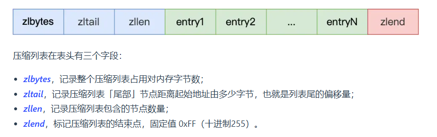
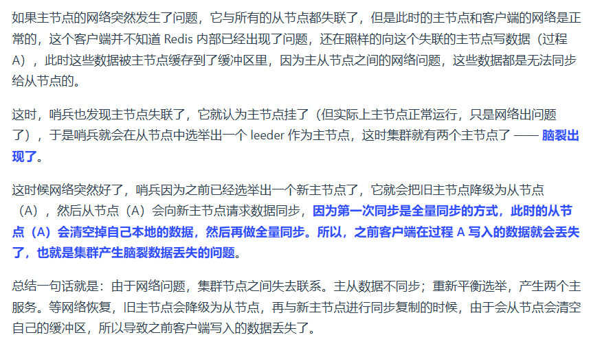
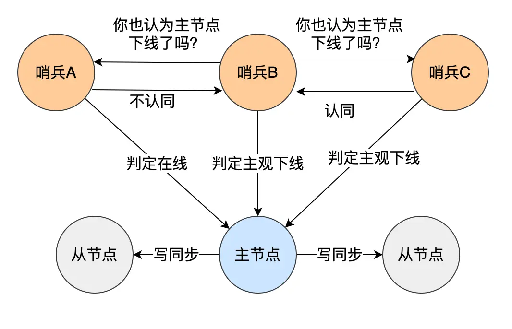

# 数据结构

## SDS
sds相比于c风格字符串的改进:
1. 可以在O(1)时间获取字符串长度
2. 不会发生缓冲区溢出，通过alloc-size查看剩余空间
3. 不以‘\0’作为结束符，可存放音频、图片
4. 极致的省空间，不同大小范围的字符串使用不同位数的alloc和size
5. 二进制安全，所有的数据都以二进制新式存放和操作，避免了'\0'问题，使得SDS可以保存任意格式的二进制数据

## List
正常的双向链表

## ZIPLIST
**由连续内存块组成的顺序型数据结构**，有点类似于数组。



## hashtable
**开链哈希，渐进式rehash**

## intset
整形集合
1. 极致的省空间，将int分为16，32，64，分别表示不同的encoding，用int_8作为buf，直接底层操作二进制
2. 具有升级操作，当插入的数值**一定是最大的，或是最小的**(超过了当前encoding所能表示的范围，则进行升级)[升级方式参考**内存拷贝算法题**]

## ZSET-zskiplist
为什么使用跳表，而不是avl或红黑树

1. 更省空间
2. zrange操作更方便
3. 更容易实现和维护


# Redis线程模型


## 主线程工作流


# 持久化
## AOF
aof保存快，加载慢，因为需要解析命令并重执
**AOF写回磁盘时机**


**AOF重写机制**
随着工作时间增长，aof文件变得臃肿，这时候由系统自动触发，或手动触发，执行调用bgrewriteaof，fork子进程进行重写

## RDB
保存慢，加载快，直接载入数据

## 混合持久化


# 过期删除
1. 定时删除
   - 在设置过期键的同时创建一个定时事件，时间到达时进行删除
   - 对内存友好，可以尽快释放空间，但占用cpu影响吞吐量
   - 
2. 懒惰删除
   - 不主动删除，每次访问时检查是否过期，如果是才删除
   - CPU友好，但是占用内存
3. 定期删除
   - 每隔一段时间抽查部分key，将过期的key删除
   - 中和了定时和惰性删除的优缺点

redis采用的是[**惰性+定期**]的删除策略
**定期删除流程**


# 内存淘汰
当redis内存占用达到上限，这时候又有新数据写入，就需要进行内粗淘汰选择
内存淘汰的几种方式
1. 不进行内存淘汰
   - 也就是说，当内存占用达到上限，数据库拒绝写入
2. 进行淘汰
   1. 淘汰过期数据
      - random, 随机淘汰过期数据
      - ttl， 淘汰最早过期的
      - lru，淘汰最远没有被使用的
      - lfu，淘汰最少使用的
   2. 在所有数据范围中进行淘汰
      - random
      - lru
      - lfu


# 主从复制
## 主从复制流程

***第一阶段--全量复制***
1. 主服务器调用bgsave生成RDB文件
2. 主服务器发送RDB给从服务器
3. 但是在这个过程中**可能有新的写命令**，于是使用replication buffer存储新的写命令，然后将新写命令发送给从服务器

***第二阶段--命令传播***
1. 在全量复制结束后，主从双方**维持TCP长连接**，主服务器向从服务器发送新的写命令

***断联恢复--增量复制***
1. 由于网络异常，主从可能会断开连接
2. 这时主服务器会将命令发在**replication backlog buffer环形缓冲区**（注意区别replication buffer）中，同时维护一个**offset变量**
3. 从新连接后，**主的写offset - 从读offset > backlog大小**，全量复制， 否则增量复制。


## replication buffer & replication backlog buffer的区别
在 Redis **主从复制（Replication）** 过程中，涉及多个缓冲区来高效地同步数据，其中 **Replication Buffer** 和 **Replication Backlog Buffer** 是两个重要的概念。它们的作用和区别如下：

---

### **1. Replication Buffer（主从同步缓冲区）**
**作用**：  
- 用于 **主节点（Master）向从节点（Replica）发送数据** 的临时缓冲区。  
- 每个从节点都有**自己独立的** Replication Buffer。  
- 主要用于**全量同步（Full Sync）** 期间，Master 向 Slave 发送 RDB 文件时的临时存储。

**工作流程**：
1. 当从节点连接到主节点时，主节点会生成一个 **RDB 快照** 并将其存入 **Replication Buffer**。
2. 主节点通过 **Socket 发送 Replication Buffer** 的数据给从节点。
3. 发送完 RDB 之后，主节点开始**实时复制增量命令**，仍然会利用 Replication Buffer 发送给各个从节点。

**特点**：
- **每个从节点都有自己独立的 Replication Buffer**（即：如果有 3 个从节点，Master 就会维护 3 份 Replication Buffer）。
- **数据实时推送**，不会保存很长时间，主要是用于流量传输。

---

### **2. Replication Backlog Buffer（复制积压缓冲区）**
**作用**：  
- **用于增量复制（Partial Resynchronization）**，防止 Slave 短暂断连后必须重新进行全量同步。
- **所有从节点共享一个** Replication Backlog Buffer，而不是每个 Slave 单独拥有一个。
- 当从节点短暂断开后重新连接，Master 可利用 Backlog Buffer **增量同步丢失的数据**，避免重新发送 RDB 文件。

**工作流程**：
1. 主节点在内存中维护一个 **Replication Backlog Buffer**（默认 1MB，可配置）。
2. **主节点将所有变更命令写入 Replication Backlog Buffer**，同时发送给从节点。
3. **如果某个从节点短暂断开**，从节点会带着自己的 `replication offset` 重新连接。
4. **主节点检查 Replication Backlog Buffer**：
   - **如果丢失的数据还在缓冲区中**：直接增量同步，避免全量同步。
   - **如果丢失的数据已被覆盖**（超出 backlog 的大小）：从节点必须执行 **全量同步**。

**特点**：
- **所有从节点共享同一个 Replication Backlog Buffer**，不像 Replication Buffer 那样每个 Slave 单独维护。
- **用于增量同步**，可以减少因网络闪断导致的全量同步开销。
- **大小可配置**（`repl-backlog-size`），默认 `1MB`，如果有多个 Slave，建议适当增大。

---

### **3. 主要区别**
| **对比项**            | **Replication Buffer** | **Replication Backlog Buffer** |
|----------------------|----------------------|------------------------------|
| **作用**            | Master 向某个 Slave 发送数据的临时缓冲区 | 记录最近的变更命令，支持增量同步 |
| **是否共享**        | **每个从节点独立**    | **所有从节点共享**            |
| **主要用于**        | **全量同步（RDB 传输）+ 实时命令推送** | **增量同步（Partial Resync）** |
| **存储内容**        | RDB 文件 + 实时命令   | 变更命令（如 `SET`, `DEL`） |
| **大小可配置**      | 不可配置              | `repl-backlog-size`（默认 1MB） |
| **过期策略**        | 只用于临时存储，数据发出后即释放 | 先进先出（FIFO），超出大小后覆盖旧数据 |

---

### **4. 总结**
1. **Replication Buffer**
   - **每个 Slave 有独立的 Buffer**，用于 Master 发送 RDB 文件和实时命令数据。
   - **主要用于全量同步（Full Sync）**，数据不会长时间保存。

2. **Replication Backlog Buffer**
   - **所有 Slave 共享同一个 Buffer**，用于存储最近的变更命令。
   - **主要用于增量同步（Partial Resync）**，避免因短暂断连导致全量同步。

**简单理解**：
- **Replication Buffer** = **临时缓存，每个从节点独立拥有，主要用于全量同步**。
- **Replication Backlog Buffer** = **共享的环形缓冲区，主要用于增量同步，避免全量同步的消耗**。

---

## 主从数据不一致
延迟过高的时候，禁止从服务器读操作


## 如何减少主从切换数据丢失
1. 减少**异步复制数据丢失**--使用min-slaves-max-lag,当正常的从节点超过最大延迟的数量下降到可接受值之下，拒绝写操作


2. 减少**集群产生脑裂数据丢失**--主节点降级为从节点复制清空导致数据丢失
**脑裂的原因**：

**解决方案**：


## 注意区分主从数据不一致和主从切换数据丢失问题

# 哨兵

一般需要三个哨兵，

## 客观下线和主观下线



## 选举哨兵leader，leader进行故障转移
## 故障转移流程
### 1.选新主节点
1. 看优先级
2. 看复制进度
3. 看ID

### 2.将从节点指向新主节点
### 3.将通知客户端主节点更换
### 4.旧主节点变成从节点


## Raft分布式一致性算法
Raft是一种**分布式一致性算法**，主要用于在分布式系统中确保多个节点之间的数据一致性。它通过简化设计（相比Paxos）实现了强一致性、高可用性和容错性，广泛应用于分布式数据库、元数据管理（如ETCD）等场景。

---

### 核心概念与机制

1. **角色划分**  
   Raft将节点分为三种角色：
   • **Leader（领导者）**：唯一处理客户端请求，负责日志复制和心跳维持。
   • **Follower（跟随者）**：被动响应Leader的指令，参与选举和日志同步。
   • **Candidate（候选者）**：在Leader失效时发起选举的临时角色。

2. **任期（Term）**  
   每个任期是一个连续递增的编号，用于标识选举周期。同一任期内只能有一个Leader，若选举失败则开启新任期。

3. **领导者选举**  
   • **触发条件**：Follower在心跳超时未收到Leader消息时转变为Candidate并发起选举。
   • **投票规则**：节点投票给日志最新（最后日志的索引和任期号更大）的Candidate，获得半数以上选票的Candidate成为新Leader。
   • **随机超时**：节点等待选举的时间随机（如150-300ms），避免多个Candidate同时竞争导致脑裂。

4. **日志复制**  
   • **流程**：Leader将客户端请求转化为日志条目，通过**AppendEntries RPC**发送给Follower。当超过半数节点确认后，日志标记为已提交（Committed），并应用到状态机。
   • **一致性检查**：通过比对前一条日志的索引和任期号，确保Follower日志与Leader一致。若冲突，Leader强制Follower复制自己的日志。

5. **安全性规则**  
   • **选举限制**：只有日志最新的Candidate才能当选Leader，避免数据丢失。
   • **提交规则**：仅当前任期的日志条目可被提交，确保已提交的日志不会被覆盖。

---

### 与其他算法的对比
• **Paxos**：Raft通过角色划分和明确的流程简化了Paxos的复杂性，更易理解和实现。
• **ZAB（Zookeeper使用）**：两者均通过Leader机制实现一致性，但Raft的选举规则更强调日志完整性。

---

### 应用场景
1. **元数据管理**：如ETCD使用Raft保证配置信息的一致性。
2. **分布式数据库**：如CockroachDB通过Raft实现多副本数据同步。
3. **分布式锁与事务**：确保跨节点的操作原子性和一致性。

---

### 优缺点
• **优点**：设计简洁、易于工程化；支持线性一致性；容错性强（半数节点存活即可运行）。
• **缺点**：依赖心跳机制，网络分区可能导致短时不可用；日志强制覆盖可能增加同步开销。

---

如果需要更深入的实现细节（如日志压缩、快照机制）或具体案例分析，可以参考相关技术文档或源码实现。

## Raft no-op
 **Raft No-Op（空操作）**
在 **Raft 共识算法** 中，**No-Op（空操作）** 是指 **Leader 当选后，向日志中追加一个不执行任何操作的命令**，确保自己的合法性，并让集群状态保持一致。

---

### **📌 No-Op 的作用**
当一个新的 **Leader** 当选时：
1. **确认自己已被大多数节点接受**
2. **提交一个空日志条目**，推进 `commitIndex`，确保集群的一致性
3. **保证所有 Follower 知道新的 Leader**
4. **解决潜在的 “脑裂” 问题**（如果旧 Leader 存在）

---

### **📌 No-Op 的执行过程**
 **🛠 具体步骤**
1. **Leader 选举成功**
   - 当一个节点获得 **多数选票** 后，成为新的 Leader。
   
2. **Leader 追加 No-Op 日志**
   - 选举成功后，Leader 立即向日志追加一个 **No-Op（空操作）**，即一个 **不包含业务逻辑的日志条目**。
   - 例如：
     ```
     Term: 5, Index: 10, Command: No-Op
     ```
   
3. **Leader 发送 AppendEntries**
   - Leader 发送 **AppendEntries RPC** 给 Follower，要求复制 No-Op 日志。
   
4. **Follower 复制 & 提交**
   - 如果多数 Follower 复制该日志，Leader 递增 `commitIndex`，认为 No-Op 已提交。
   - 这时，Leader 才算正式 **“稳定”**。

---

### **📌 为什么 Raft 需要 No-Op？**
 **1️⃣ 确保新的 Leader 一致性**
- 选举后，新的 Leader **可能还没提交过日志**，但它必须**尽快提交一个日志**，确保集群不会回滚到旧 Leader 状态。
- No-Op 让 Follower **知道并确认新 Leader 的任期（Term）**。

 **2️⃣ 防止旧 Leader 作怪**
- 旧 Leader **可能还在运行**，但它的 `Term` 过期了。
- **新的 No-Op 让 Follower 确认新的 Leader，拒绝旧 Leader 的请求**，避免脑裂。

 **3️⃣ 提高 `commitIndex`，保证可用性**
- **如果新的 Leader 之前是 Follower，可能有未提交的日志**。
- No-Op **推进 `commitIndex`**，确保未提交的日志尽快提交，防止数据不一致。

---

### **📌 No-Op 示例**
 **假设：**
- **Follower A（Term 4） & Follower B（Term 4）**
- 选举后，**C 成为 Leader（Term 5）**

 **流程：**
| 步骤 | 操作 |
|----|----|
| **1** | C 当选为 Leader（Term 5） |
| **2** | C 追加 `No-Op`（Index: 10, Term: 5） |
| **3** | C 发送 `AppendEntries(No-Op)` 给 A & B |
| **4** | A & B 复制 `No-Op` 并返回 `ACK` |
| **5** | **C 提交 `No-Op`（commitIndex 递增）** |
| **6** | **C 确认自己是稳定的 Leader，继续处理业务请求** |

---

### **📌 No-Op 代码示例**
假设 Raft 实现中 `becomeLeader()` 处理领导选举，No-Op 逻辑如下：
```go
func becomeLeader() {
    // 追加 No-Op 日志条目
    logEntry := LogEntry{
        Term:    currentTerm,
        Index:   lastLogIndex + 1,
        Command: nil,  // No-Op
    }
    
    log.append(logEntry)  // 追加到日志
    
    // 发送 AppendEntries RPC 让 Follower 复制
    for _, peer := range peers {
        sendAppendEntries(peer)
    }
    
    // 提交 No-Op
    commitIndex = logEntry.Index
}
```

---

### **📌 结论**
**Raft No-Op 是新 Leader 选举成功后执行的第一步**，用于：
✅ **确保自己被多数节点接受**  
✅ **防止旧 Leader 干扰**（避免脑裂）  
✅ **推进 `commitIndex`，确保日志一致性**  

🚀 **这样，集群就可以安全地处理新的写请求！** 😊

## Raft的日志是做什么用的
在 **Raft** 共识算法中，**日志**（Log）是确保 **数据一致性** 的核心组成部分。Raft 的日志不仅用来记录集群中的操作，还通过日志的复制、提交和一致性保证了分布式系统中所有节点的数据同步与一致性。

### **1️⃣ Raft 日志的主要作用**
Raft 的日志主要用于以下几个方面：

#### 1. **记录所有操作**
Raft 中的日志记录了系统所有需要持久化的操作，这些操作通常是对系统状态的修改，比如数据库的写操作、状态机的更新等。每条日志都有两个主要部分：
   - **Term（任期）**：日志是在哪个选举任期下被创建的。
   - **Command（命令）**：执行的操作或命令，例如数据库的写入命令 `SET key value`。

#### 2. **确保数据一致性**
Raft 使用日志来确保在多个节点之间 **数据一致性**：
   - 所有节点（包括 Leader 和 Follower）的日志必须保持一致，确保在任意时刻，所有节点都具有相同的数据视图。
   - 每个日志条目都包含一个 **任期（Term）**，标识该日志属于哪个领导者的任期，以此来防止日志的不同版本之间的冲突。

#### 3. **实现日志复制和故障恢复**
Raft 日志的复制机制是集群高可用性的关键：
   - **Leader 负责接收客户端的请求并生成新的日志条目**，然后将这些日志条目复制到 Follower 节点。
   - 一旦日志条目被 Leader 和大多数 Follower 节点复制，日志就被 **提交（committed）**，并且可以应用到每个节点的 **状态机** 中。
   - 如果 Leader 或 Follower 节点故障，Raft 使用日志来恢复节点的状态，从故障中恢复时可以依据一致的日志条目来保证节点的同步。

---

### **2️⃣ 日志条目的生命周期**
每个日志条目从生成到提交经历以下几个阶段：

1. **生成日志条目**
   - 当客户端发送请求（如 `SET key value`）时，Leader 会生成一个新的日志条目，并将其附加到自己的日志中。这个日志条目记录了操作类型和相关的状态（如命令 `SET`）。

2. **日志条目复制到 Follower**
   - Leader 会将这个新的日志条目通过 **AppendEntries RPC** 发送给所有的 Follower。
   - Follower 节点收到日志后会将其追加到自己的日志中，并返回一个确认响应。

3. **日志条目提交**
   - 当 Leader 收到多数 Follower 节点的确认后，它就认为这个日志条目已经被**提交**，并将其提交给本地的状态机进行处理。
   - Leader 更新 `commitIndex`，并通过 **AppendEntries RPC** 通知 Follower，这些节点也会将该日志条目提交到状态机。

4. **应用到状态机**
   - 一旦日志条目被提交，Leader 和所有 Follower 节点会应用日志条目到自己的 **状态机**（如数据库或缓存）中，执行对应的操作。
   - 例如，`SET key value` 命令会被应用到键值存储的状态机中，更新 `key` 的值为 `value`。

---

### **3️⃣ 日志的一致性保证**
Raft 保证日志的一致性，确保日志在所有节点上的顺序一致。主要通过以下几个机制实现：

#### 1. **日志匹配（Log Matching）**
   - Raft 的核心一致性规则之一是 **日志匹配**，即如果两个日志条目的 **索引和任期相同**，那么这两个日志条目之前的所有日志必须也相同。
   - 这个保证确保了日志的一致性，防止了不同节点间的日志条目发生冲突。

#### 2. **日志回滚（Log Rollback）**
   - 当 Follower 的日志与 Leader 不一致时，Leader 会通过比较日志条目的 **索引和任期**，将不匹配的日志删除，并使用 Leader 的日志覆盖 Follower 上的冲突日志。
   - 这样，Leader 保证了自己的日志是正确的，并且能够通过复制机制让 Follower 与 Leader 保持一致。

#### 3. **日志提交顺序**
   - Raft 通过 `commitIndex` 机制来确保日志提交的顺序一致，`commitIndex` 保证了所有节点在同一个时间点都提交了相同的日志条目。
   - Leader 提交一个日志条目后，所有 Follower 都必须在提交后同步该日志条目。

---

### **4️⃣ 日志的应用场景**
Raft 日志的主要应用场景包括：

1. **分布式数据库**
   - Raft 算法通常用于分布式数据库中，确保数据一致性。例如，如果一个写操作被提交到 Leader，它会被复制到 Follower，保证所有副本数据一致。
   - 通过 Raft 日志的复制机制，系统能在 Leader 崩溃后通过重新选举 Leader 继续提供服务。

2. **分布式存储系统**
   - 类似于分布式数据库，分布式文件系统、分布式键值存储等系统也使用 Raft 日志来保证数据一致性。
   - 系统每次写入操作都会通过日志记录，并在集群中保持一致。

3. **微服务间的状态同步**
   - 在微服务架构中，Raft 可以帮助不同服务之间同步状态。例如，当一个服务更新了状态，Raft 日志会将这一操作复制到其他服务，确保它们的状态一致。

---

### **总结：Raft 日志的作用**
- **数据一致性**：Raft 的日志是确保分布式系统中所有节点数据一致的关键。
- **操作记录**：Raft 的日志记录了所有对系统状态的操作，包括读写操作等。
- **故障恢复**：Raft 通过日志复制与提交机制，在 Leader 崩溃时可以恢复系统状态。
- **保证顺序一致性**：Raft 日志保证了日志的顺序一致性，确保所有节点按照相同顺序应用操作。

Raft 算法通过日志的管理和复制，确保分布式系统中节点间的一致性和高可用性。

# 缓存雪崩、击穿、穿透

## 雪崩
> redis**大量数据同时过期**或者redis**宕机**，导致直接访问数据库
> 

解决方案：
***针对大量数据同时过期***：
1. 给过期+**上随机数**，不让数据同时过期
2. 数据库访问**上互斥锁**，同一时间只有一个请求构建缓存
3. **不设置过期时间**，而是让**后台自动定时更新缓存数据**--通过**消息队列**通知缓存更新

***针对redis宕机***
1. 服务熔断--拒绝访问直到redis恢复
2. 请求限流
3. 构建高可靠高可用集群

## 击穿
> **热点数据过期**

解决方案与雪崩类似，**上互斥锁或是不设置过期时间**

## 穿透
> **访问的数据既不在redis也不在数据库中**
> 发生原因：业务误删除，黑客攻击
> 

解决方案：
1. 请求限流
2. 缓存空值或默认值
3. 设置布隆过滤器--哈希不存在一定不存在


## 总结


# 如何保证缓存一致性

## 更新缓存和数据库
### 1.先更新数据库，后更新缓存


### 2.先更新缓存，后更新数据库


## 更新数据库删缓存
### 1.先删除缓存，后更新数据库
仍然会发生不一致问题


### 2.先更新数据库，后删除缓存
由于更新缓存速度远高于更新数据库速度，所以**不太可能出现**下面问题——**缓存写回速度慢于数据库更新速度**，同时**加上过期时间**


> 但是，问题出在**删除缓存操作失效了**，仍然会导致用户查询到更新的时间延缓，导致用户体验下降
> 于是加入重试机制，当删除失败时，再次执行删除，如果重试超过一定次数，则向业务层报错。


# lua & 事务
## lua & 事务 的区别
很好理解的问题，我们来通俗地讲讲：

---

### 🌟 什么是 Lua 脚本？

Redis 支持通过内置的 **Lua 脚本** 来执行一段原子操作。简单说，就是你可以把一堆 Redis 命令写成一个 Lua 脚本，一次性发给 Redis 服务器执行。

- 执行是 **原子的**：Redis 会一次性执行整段脚本，期间不会被其他命令打断。
- 使用 `EVAL` 或 `EVALSHA` 命令运行脚本。

**举个例子：**
```lua
-- 检查键是否存在，如果存在就返回值，否则设置默认值
local val = redis.call('GET', KEYS[1])
if not val then
    redis.call('SET', KEYS[1], ARGV[1])
    return ARGV[1]
end
return val
```
这段脚本的意思是：**只有在 key 不存在的时候，才去设置它的值。**  
这个逻辑用多个命令实现容易有并发问题，但 Lua 脚本中是**一次性执行**的。

---

### 🔄 那和 Redis 事务（MULTI/EXEC）有什么区别？

| 对比项         | Lua 脚本                                | Redis 事务（MULTI/EXEC）                  |
|----------------|-----------------------------------------|-------------------------------------------|
| 原子性         | **完全原子执行**                        | 命令队列提交后才执行，**执行是原子的** |
| 事务失败处理   | 一出错整个脚本失败                      | 某条命令失败不会自动回滚                 |
| 并发控制       | 无需 WATCH，可天然防止并发冲突          | 需搭配 `WATCH` 实现乐观锁                |
| 灵活性         | 支持条件判断（如 `if`, `for`）等逻辑    | 只能串行发命令，**不支持条件控制流**     |
| 性能           | 只需一次网络交互                        | 多次命令 + 一次提交（更多网络交互）       |
| 使用场景       | 复杂逻辑、带判断/循环、强一致性         | 简单命令批量提交                          |

---

### ✅ 总结一句话：

> **Lua 脚本 = 带逻辑判断的、一次性、原子性的多命令操作，是更强大的事务替代品。**

---

### 🔧 实际应用场景

- 原子扣减库存、限流计数
- 分布式锁的安全释放
- 防止缓存击穿（双查机制封装成 Lua 脚本）
- 多 Key 的批量设置/判断操作

---

如果你用事务处理一些需要强一致和并发控制的逻辑，很容易会写得麻烦而且不稳，这时候用 Lua 脚本就能写得又简洁又安全。

你有没有某个具体的业务场景，我们可以试着写个 Lua 来演示？


## 为什么分布式锁使用lua而不是事务
这个问题非常关键，很多人以为 Redis 有了事务（`MULTI/EXEC`）就可以实现原子性操作，但其实 **在分布式锁场景中，Lua 脚本才是真正的王者**。我们来通俗又透彻地解释一下——

---

### 🎯 结论先行：

> **因为 Lua 脚本在 Redis 中是原子执行的，而事务（`MULTI/EXEC`）不是原子操作，也不能中间判断条件。**

---

### 🔍 为什么事务不适合分布式锁？

Redis 的事务是这样的：

```bash
WATCH key
MULTI
SET key value EX 30 NX
EXEC
```

看起来好像是“先监视，再加锁”，但它的问题有几个致命点：

#### ❌ 1. 多步命令，不是原子操作

- `WATCH`、`MULTI`、`SET`、`EXEC` 是**多个命令**
- 这些命令是**分开发送的**，中间可能被其他客户端插队
- 比如你 WATCH 之后，还没来得及 SET，另一个客户端已经改了 key，你的事务就会失败

而 Lua 脚本：
- 所有命令是一次性发送、一次性执行的
- **原子性强，过程不可中断**

---

#### ❌ 2. 事务中不能做条件判断（例如判断锁是否为自己持有）

举个例子：你释放锁的时候要判断是不是你加的这把锁：

```lua
-- Lua 脚本可以这么写：
if redis.call("get", KEYS[1]) == ARGV[1] then
    return redis.call("del", KEYS[1])
else
    return 0
end
```

你要在事务里这样写就不行，因为 Redis 的事务只是“命令队列”，不能在队列里做判断。

---

### ✅ Lua 脚本的优势

| 特性               | Lua 脚本 | MULTI/EXEC |
|--------------------|----------|------------|
| 原子性              | ✅ 原子   | ❌ 非原子   |
| 条件判断            | ✅ 支持   | ❌ 不支持   |
| 一次性执行          | ✅ 是     | ❌ 分步执行 |
| 防止并发竞争        | ✅ 好     | ❌ 可能失败 |

---

### 🧠 举个分布式锁常见操作的例子

#### ✅ 加锁（带过期时间 + 原子性）：

```lua
-- 如果 key 不存在，设置值并设置过期时间
if redis.call("SETNX", KEYS[1], ARGV[1]) == 1 then
    redis.call("PEXPIRE", KEYS[1], ARGV[2])
    return 1
else
    return 0
end
```

你用事务根本没法做到这一点：**判断是否成功 + 设置过期时间必须是原子的**，否则有竞态条件。

---

#### ✅ 释放锁（确保只删除自己加的锁）：

```lua
if redis.call("GET", KEYS[1]) == ARGV[1] then
    return redis.call("DEL", KEYS[1])
else
    return 0
end
```

---

### 🚫 如果你不用 Lua，风险是什么？

1. 可能在 SET 后，来不及 EXPIRE，就宕机 → 锁永不释放（死锁）
2. 删除锁时没判断归属，可能把别人的锁删掉
3. 并发操作中断事务，EXEC 失败，但你不知道是否部分执行了（不可靠）

---

### ✅ 所以总结一句话：

> 分布式锁用 Lua 脚本，是因为它**真正支持原子性操作和条件判断**，比 Redis 的事务机制更加可靠，是 Redis 官方推荐的标准方式。

---

如果你想，我可以直接帮你写一个标准的 Lua 脚本实现的加锁 + 解锁逻辑，还能支持续期、失败重试，要不要来一个实战版本？


# watch乐观锁
很好，这个问题是理解 Redis 事务机制的关键。下面我们来通俗又透彻地解释一下 `WATCH` 的作用、原理以及它在事务中的意义。

---

### 🔍 什么是 `WATCH`？

`WATCH` 是 Redis 提供的一个 **乐观锁机制**，用于**监视一个或多个键**的值是否在事务执行前被其他客户端修改。

> 一句话解释：`WATCH` 可以让你在 Redis 中实现类似“先读后写”的乐观锁场景，防止并发修改时出现数据不一致。

---

### 🧠 它是怎么工作的？

1. **客户端 A** 执行 `WATCH key1`
2. Redis 会监视 `key1`，记录当前版本
3. 接着客户端 A 执行 `MULTI` 开启事务
4. 再执行事务中一系列命令（这些命令先入队，不执行）
5. 最后执行 `EXEC` 提交事务：

   - 如果 **事务提交前 `key1` 没有被别的客户端改动过**，那么事务正常执行。
   - 如果 **事务提交前 `key1` 被别的客户端修改了**，`EXEC` 会返回 `nil`，表示事务失败，**不会执行事务里的任何命令**。

---

### 📦 举个通俗例子

比如你想实现一个余额扣款操作：

```shell
WATCH user:balance
balance = GET user:balance
if balance >= 100:
    MULTI
    DECRBY user:balance 100
    EXEC
else:
    UNWATCH
```

这个过程相当于你这样思考逻辑：

> “我先看看你还有多少钱，我如果决定要扣钱，这期间你不能偷偷把钱改掉，不然我就不扣了！”

如果这个过程中有其他客户端修改了 `user:balance`，事务就会自动失败，避免错误扣款。

---

### ✅ 为什么要在事务中使用 `WATCH`？

因为 Redis 的事务（`MULTI/EXEC`）并**不是传统意义上的事务**，它并不提供：

- 自动回滚机制
- 并发冲突检测

所以为了保障事务执行的安全性、正确性，Redis 提供了 `WATCH` 机制来让你手动控制并发冲突的处理。

---

### 🔁 `WATCH` 是“乐观锁”，那和“悲观锁”区别是？

| 类型     | 含义                            | Redis 中表现       |
|----------|---------------------------------|--------------------|
| 乐观锁   | 假设冲突少，先执行操作再校验    | `WATCH + EXEC`     |
| 悲观锁   | 假设冲突多，执行前就上锁阻塞操作 | Redis 不支持原生悲观锁，只能模拟 |

---

### 🔓 如果你不使用 `WATCH` 会发生什么？

你就不能保证在读取 key 并基于这个值做事务操作的期间，这个值没有被别人改动——可能会导致**并发安全问题**，比如：

- 多个客户端同时扣款，结果扣了两次；
- 两个客户端同时更新相同数据，最后覆盖了彼此的修改。

---

### 🧠 小总结一句话：

> `WATCH` 是 Redis 提供的乐观锁机制，**用于在事务前监控关键数据是否被其他客户端修改过**，保证事务的可靠性和一致性。

---

如果你有特定的业务场景，我也可以帮你模拟一下加 `WATCH` 和不加 `WATCH` 的区别，有时候一看就懂了~要不要来一个？


# 分布式锁
redis分布式锁setnx
### **什么是分布式锁？**
**分布式锁** 是一种确保在分布式系统中，同一时刻只有一个客户端能够访问某个资源或执行某个操作的机制。它的目的是在分布式环境下控制并发访问共享资源，防止竞争条件和数据不一致。

在单机环境中，通常使用操作系统提供的锁（如互斥锁 `mutex`）来保证线程之间的互斥。但在分布式环境中，由于各个服务或节点可能运行在不同的机器上，传统的锁无法直接使用，因此需要一种跨多台机器的锁机制来保证数据的一致性和资源的独占访问。

### **分布式锁的应用场景**
分布式锁广泛应用于需要控制并发和保证数据一致性的分布式系统中。以下是一些常见的应用场景：

#### 1. **防止数据重复处理**
   - **例如：** 用户支付、订单创建等场景。在一个订单系统中，多个客户端可能会同时请求创建相同的订单，使用分布式锁可以确保在多个请求中，只有一个请求能够成功创建订单，防止重复支付或订单创建。

#### 2. **限流控制**
   - **例如：** 在高并发的情况下，可能需要对接口进行限流（比如电商秒杀活动），确保系统不会被瞬间大量请求压垮。分布式锁可以帮助控制限流的逻辑，防止多个实例同时进行相同的限流操作。

#### 3. **资源独占**
   - **例如：** 某些资源（比如打印机、API接口等）需要多个客户端互斥访问，可以通过分布式锁确保资源的独占使用。

#### 4. **任务调度**
   - **例如：** 在分布式任务调度系统中，分布式锁可以确保某个任务不会被多个节点同时执行。比如，批处理任务、定时任务等，只能由一个节点执行，避免重复执行。

#### 5. **控制共享状态**
   - **例如：** 在分布式缓存中，多个节点可能会访问或更新同一份共享数据，分布式锁可以避免在并发情况下发生数据竞态。

### **分布式锁的实现方法**

分布式锁的实现需要保证以下几个关键特点：
- **互斥性**：在同一时刻，只允许一个客户端持有锁，其他客户端无法获取。
- **可靠性**：在出现故障的情况下，锁能够正确释放，避免死锁。
- **高可用性**：分布式锁必须保证在网络或节点故障的情况下仍然能够保持系统的稳定运行。

#### 1. **基于 Redis 实现分布式锁**
Redis 是一个高性能的内存数据库，通常用于实现分布式锁。常用的 Redis 分布式锁实现方法是通过 `SETNX` 命令（SET if Not eXists）和 `EXPIRE` 命令来确保锁的原子性和自动过期。

##### **实现步骤：**
1. **尝试获取锁**：使用 `SETNX` 命令尝试创建一个特定的锁键（`lock_key`）。
   ```bash
   SETNX lock_key "locked_value"
   ```
   - 如果 `lock_key` 不存在，返回 1（成功获取锁），并设置该键的值。
   - 如果 `lock_key` 已存在，返回 0（锁被其他客户端持有）。

2. **设置过期时间**：为了防止死锁，设置锁的过期时间。
   ```bash
   EXPIRE lock_key 10
   ```
   - 锁在 10 秒后自动释放，即使客户端没有显式释放锁。

3. **释放锁**：释放锁时，要确保只有持有锁的客户端才能释放它。
   ```lua
   if redis.call("GET", KEYS[1]) == ARGV[1] then
       return redis.call("DEL", KEYS[1])
   else
       return 0
   end
   ```
   - 如果 `lock_key` 的值是当前客户端的 ID（`ARGV[1]`），则删除该键，释放锁。

#### 2. **基于 Zookeeper 实现分布式锁**
Zookeeper 是一个分布式协调工具，可以通过它实现分布式锁。Zookeeper 通过 **临时节点** 和 **有序节点** 实现锁的机制。

##### **实现步骤：**
1. **创建临时有序节点**：客户端在 Zookeeper 中创建一个有序的临时节点（如 `/lock/lock-0001`）。
   - 每个客户端在 Zookeeper 上创建一个唯一的节点，节点名带有递增的序号。

2. **监听前一个节点**：客户端通过监听该节点前一个有序节点的变化来判断是否可以获取锁。
   - 客户端检查它自己创建的节点是否是最小的节点，若是，则表示成功获取锁。

3. **获取锁**：客户端成功获得最小节点（表示可以访问资源），并通过临时节点确保客户端断开连接后锁会自动释放。

4. **释放锁**：客户端完成任务后，删除它自己的临时节点，从而释放锁。

#### 3. **基于数据库实现分布式锁**
可以通过在数据库中使用某个唯一的标识（如数据库表中的一行）来实现分布式锁。常见做法是通过更新数据库中的一行来表示锁的持有。

##### **实现步骤：**
1. **尝试获取锁**：在数据库中插入一条记录（例如：`INSERT INTO locks (lock_key, locked) VALUES ('lock_key', 'locked')`），如果插入成功，则表示获取了锁。
2. **设置过期时间**：可以通过数据库的过期机制或定期刷新来确保锁在一定时间后释放。
3. **释放锁**：通过删除记录或更新记录来释放锁。

#### 4. **基于 Redisson 实现分布式锁**
**Redisson** 是一个基于 Redis 的分布式锁框架，它封装了 Redis 的锁机制，提供了更高级的功能，例如 **锁的自动续期**、**公平锁**、**可重入锁** 等。

##### **实现步骤：**
1. **创建 Redisson 客户端**：通过 Redisson 提供的 API 创建锁。
2. **获取锁**：通过 Redisson 的 `RLock` 接口来获取锁，并且可以设置锁的过期时间。
   ```java
   RLock lock = redisson.getLock("lock_key");
   lock.lock(10, TimeUnit.SECONDS);  // 锁定 10 秒
   ```
3. **释放锁**：在任务完成后调用 `unlock()` 方法释放锁。

---

### **总结**
- **分布式锁** 是用于分布式系统中控制资源并发访问的一种机制，确保同一时刻只有一个客户端能访问某个资源或执行某个操作。
- **应用场景**：防止重复处理、限流控制、资源独占、任务调度和控制共享状态等。
- **实现方法**：
  - **Redis**：通过 `SETNX` + `EXPIRE` 实现分布式锁。
  - **Zookeeper**：通过临时有序节点实现分布式锁。
  - **数据库**：通过在数据库中插入记录实现锁。
  - **Redisson**：基于 Redis 的分布式锁框架，提供更多高级功能。 

分布式锁的实现需要保证 **原子性、可靠性和高可用性**，并根据具体的需求选择不同的实现方案。


# 分布式锁的实现
## lua——setnx & expire
好的，我来给你通俗地解释一下**分布式锁**是如何工作的。分布式锁的目标是保证在**分布式系统中**，多个服务节点之间**对共享资源**的访问是互斥的，也就是说，只有一个服务可以在某一时刻访问资源，其他服务必须等待。

### 1. **为什么需要分布式锁？**

在分布式系统中，通常有多个服务器在同时运行，它们共享一些资源（比如数据库、缓存、文件等）。当多个节点同时请求一个共享资源时，如果没有控制访问，可能会导致数据不一致、脏数据或资源冲突的情况。

分布式锁的作用就是控制这些节点对共享资源的访问，使得每次只有一个节点能够访问该资源。

---

### 2. **分布式锁的实现方法**

分布式锁有多种实现方式，最常见的方式是通过 Redis 来实现。Redis 是一个高效的内存数据库，支持高并发的操作，非常适合用来实现分布式锁。这里以 Redis 为例，讲解它是如何实现分布式锁的。

#### 2.1 **基于 Redis 的分布式锁（SETNX 命令）**

Redis 提供了一个非常简单的命令 `SETNX`（SET if Not Exists），它用于设置一个键（key）的值，只有当这个键不存在时才能成功。基于这个命令，我们可以实现一个分布式锁。

**基本原理：**
1. **尝试获取锁**：
   - 每个请求都会尝试通过 Redis 设置一个唯一的锁键（例如 `lock:user123`）。
   - 这个锁键的值可以是一个**唯一标识符**，比如当前节点的 `UUID` 或者当前时间戳等。

2. **成功获取锁**：
   - 如果 `SETNX` 返回成功，说明没有其他节点获取锁，这时当前节点成功获取了锁，可以访问共享资源。
   
3. **锁的释放**：
   - 访问完共享资源后，当前节点会删除 Redis 中的锁键，从而释放锁。
   - 如果锁没有释放，其他节点就无法获得锁。

4. **锁的过期时间**：
   - 为了防止某个节点意外挂掉导致锁无法释放，通常会设置一个过期时间（比如 30 秒）。如果当前节点没有在 30 秒内释放锁，锁会自动过期，其他节点可以重新尝试获取锁。
   
**操作步骤：**

- **获取锁**：通过 `SETNX` 尝试设置一个唯一的锁键：
  
  ```bash
  SETNX lock:user123 12345
  ```

  如果返回值是 1，说明获取锁成功。如果返回值是 0，说明锁已经存在，其他节点正在持有该锁。

- **设置锁的过期时间**：为了防止死锁，可以使用 `EXPIRE` 命令给锁设置一个超时时间：
  
  ```bash
  EXPIRE lock:user123 30
  ```

  这样，如果 30 秒内锁没有被释放，Redis 会自动删除这个锁。

- **释放锁**：锁的释放非常重要，只有持有锁的节点才能释放锁。释放锁的操作通常是通过 `DEL` 命令来删除锁键：
  
  ```bash
  DEL lock:user123
  ```

  在删除锁之前，最好做一下验证，确保锁是当前节点持有的，避免误删除其他节点持有的锁。

#### 2.2 **优化：使用 Lua 脚本保证原子性**

使用 `SETNX` + `EXPIRE` 组合时，存在一个潜在问题：如果在 `SETNX` 成功之后，当前节点发生崩溃，导致锁没有被释放，但其他节点却无法重新获取锁。

为了解决这个问题，Redis 提供了**原子操作**。通过 **Lua 脚本**，可以将 `SETNX` 和 `EXPIRE` 合并成一个原子操作，这样就能保证这两个命令是不可分割的，避免了其他节点争抢锁的情况。

**Lua 脚本示例：**

```lua
-- Lua 脚本：SETNX + EXPIRE 操作
if redis.call("setnx", KEYS[1], ARGV[1]) == 1 then
    redis.call("expire", KEYS[1], ARGV[2])
    return 1
else
    return 0
end
```

- `KEYS[1]` 是锁键（比如 `lock:user123`），`ARGV[1]` 是锁值（比如当前节点的 `UUID`），`ARGV[2]` 是锁的过期时间。
- 这个脚本确保了**在一个操作中**，`SETNX` 和 `EXPIRE` 是原子性的，避免了操作的中断。

#### 2.3 **锁的自动续期（延时锁）**

如果锁的任务需要执行比较长时间，可能会超过锁的过期时间，这时候就需要**自动续期**，确保任务执行过程中不会被释放锁。常见的做法是，**在执行过程中定期延长锁的过期时间**。

自动续期可以通过定时任务来实现，每隔一定时间，就使用 `EXPIRE` 更新锁的过期时间，防止锁在任务完成之前被释放。

### 3. **总结：分布式锁的实现原理**

1. **获取锁**：通过 Redis 的 `SETNX` 命令设置一个唯一的锁键。如果获取成功，表示当前节点获得了锁。
2. **锁的释放**：锁的持有者在操作完成后，需要主动释放锁。通常通过 `DEL` 命令来删除锁键。
3. **锁的过期时间**：为了防止死锁，锁通常会设置一个过期时间，避免因节点故障导致锁无法释放。
4. **原子操作**：使用 Redis Lua 脚本可以将 `SETNX` 和 `EXPIRE` 操作合并成一个原子操作，确保锁的设置与过期时间设置不会被中断。
5. **锁的自动续期**：对于耗时的操作，需要定期更新锁的过期时间，以防止锁在操作完成之前被释放。

通过以上方式，分布式锁能够确保在多个节点之间对共享资源的互斥访问，避免数据不一致或冲突的情况。

希望这个解释能帮你更好地理解分布式锁！如果有其他问题，随时问我。

## 锁的自动续期如何实现
这是个非常实战的问题，咱们来通俗讲讲 **Redis 分布式锁的自动续期机制是怎么回事、为什么要做、该怎么做**。

---

### 🚪 为什么需要“自动续期”？

Redis 分布式锁通常是通过 `SETNX + EXPIRE`（或 `SET key value NX PX ttl`）来实现的，比如：

```bash
SET lock_key unique_id NX PX 30000
```

意思是：只有在这个锁不存在时才设置成功，并且锁自动在 30 秒后过期。

> 🔥 问题来了：
> 如果业务执行时间超过了这个锁的有效期怎么办？  
> **锁会提前释放**，导致：
> - 另一个客户端误以为锁已经释放，获取了锁
> - 出现并发冲突，导致 **锁失效**

这就像你租了个会议室 30 分钟，结果会议还没开完，房门突然被其他人打开了。

---

### 🔧 自动续期机制怎么解决这个问题？

**自动续期** 就是：在持有锁的一方还在“干活”的过程中，定期检测任务是否在正常运行，如果是，就 **延长锁的过期时间**，确保锁不会过期被误释放。

---

### ✅ 如何实现自动续期？（核心点 + 示例）

#### ✅ 核心机制：

1. 获取锁时，设置一个唯一标识（如 UUID）
2. 启动一个后台线程或定时器，**定期检查任务是否还在进行中**
3. 如果还在执行，就通过 `Lua 脚本` 检查锁是否是自己持有的，再延长过期时间

---

#### 📜 Lua 脚本续期（必须用 Lua 保证原子性）：

```lua
-- 如果 key 的值是我们自己的 UUID，就延长它的过期时间
if redis.call("GET", KEYS[1]) == ARGV[1] then
    return redis.call("PEXPIRE", KEYS[1], ARGV[2])
else
    return 0
end
```

假设 key 是 `lock:task`, value 是 `UUID-1234`，超时时间设为 30s，那么可以定期执行上面的 Lua 脚本，每 10 秒检查并续 30 秒。

---

#### 🧠 实现建议：

- 定时线程续期：建议每隔 `TTL/3` 时间续一次
- 使用 Lua 脚本续期，避免在检查 + 续期之间被其他客户端抢锁
- 一旦主线程任务结束，**务必释放锁**，不要让锁无故存在

---

#### ✅ 示例流程图（逻辑）：

```
1. 请求获得锁
2. 启动工作线程开始执行任务
3. 启动守护线程每隔10秒执行一次续期脚本：
     - 判断锁是否是自己持有的（检查 UUID）
     - 如果是，续期
     - 否则停止续期线程
4. 主任务执行完成后：
     - 停止续期线程
     - 主动释放锁（检查 UUID 后删除）
```

---

### 🔐 推荐使用 Redisson（封装好的分布式锁库）

如果你用 Java，推荐使用 [Redisson](https://github.com/redisson/redisson)，它内部已经帮你做好了：
- 分布式锁
- 自动续期
- 可重入锁、公平锁、读写锁等

示例：
```java
RLock lock = redisson.getLock("my-lock");
lock.lock(); // 会自动续期
try {
    // 你的业务逻辑
} finally {
    lock.unlock();
}
```

---

### 📌 总结

| 问题 | 自动续期方案 |
|------|----------------|
| 锁在业务还没结束就过期了怎么办？ | 开一个后台线程，定期用 Lua 脚本检查锁并延长过期时间 |
| 如何续期才安全？ | 必须检查锁是自己持有的（通过唯一标识如 UUID） |
| 推荐工具？ | 用 Redisson 这种高质量开源库，省心省力 |

---

如果你用的不是 Java 或想自己实现，我可以帮你写出 Python 或 Node.js 的续期逻辑，也可以封装一个类来复用。要不要来一个实战演示？


## 后台守护线程如何判断任务是否在执行从而自动续期锁呢
>我的问题是，既然要实现分布式锁的自动续期，那么后台守护线程如何知道这个事务仍然在进行，这个后台守护线程应该在哪里创建，实在redis上还是获取锁的客户端上呢

你这个问题问得特别好，而且非常关键！自动续期的核心不仅是“**怎么续期**”，更重要的是“**谁来续期**”和“**怎么判断业务还在进行中**”。

咱们一步步来把这个逻辑讲清楚：

---

### 🧠 1. **守护线程在哪创建？**

> ✅ 答案：**在客户端创建，不是 Redis 自己创建的。**

- Redis 是一个“无状态”的服务端，不知道哪个客户端持有锁，更不会自动帮你续期。
- 所以，一旦你拿到锁，就需要在你自己的程序里**手动创建一个“守护线程”或“定时任务”**，来定期给锁续期。

---

### 🔧 2. **守护线程如何知道“业务还在执行”？**

这个就看你怎么设计：

#### 常见设计方式：

##### ✅ 方式一：**和业务线程一起起、一起停**

- 你拿到锁后就启动一个后台线程（守护线程），每隔一段时间续期一次。
- 当你的主业务线程执行完成，释放锁的同时**也终止守护线程**。
- 所以续期线程不判断业务状态，它只是**在业务没结束前存在着，一直续期**。

```plaintext
线程 A：执行主业务逻辑
线程 B：每隔 10s 用 Lua 脚本续期

→ A 执行完了 → 释放锁 → 通知 B 停止
```

这就像一个助理定时去帮你续房租，等你会议结束离开了，助理也就不用续了。

---

##### ✅ 方式二：**使用线程间共享状态（如 `volatile` 标记位）**

- 设置一个 `isRunning = true`
- 守护线程检查这个标志位，如果是 true 就续期，否则就退出
- 当主线程完成时，把这个状态置为 false

```java
volatile boolean isRunning = true;

Thread mainThread = new Thread(() -> {
    try {
        // 执行业务逻辑
    } finally {
        isRunning = false;
        unlock();
    }
});

Thread renewThread = new Thread(() -> {
    while (isRunning) {
        Thread.sleep(10000);
        renewLock();
    }
});
```

---

### 💡 为什么不在 Redis 里实现续期？

因为 Redis 不知道你的业务逻辑在哪、是否还在跑。它只知道：

- 这个 key 设置了一个值，有一个过期时间
- 它不会判断客户端是否还“需要这个锁”

所以自动续期的逻辑必须在**客户端自己控制**，否则 Redis 无从判断。

---

### 🔐 推荐封装（分布式锁结构）

通常你会写一个类似这样的结构：

```plaintext
class RedisLock {
    acquire(): 获取锁 + 启动守护线程
    release(): 释放锁 + 停止守护线程
    renew(): 定期执行 Lua 脚本续期
}
```

---

### 📌 总结一句话：

> Redis 不知道你的业务是否在进行，**自动续期的守护线程应该由“获取锁的客户端”来创建和控制**，它的任务就是在你业务还没完成时，定时延长锁的过期时间。

---

如果你希望我帮你写一个跨语言版本（比如 Java、Python）的自动续期锁类封装，随时可以说~ 要不要来个完整例子练练？


# redis实现服务限流
使用 Redis 做服务限流是一种非常常见且高效的做法，尤其在高并发场景下，Redis 的高性能非常适合用于控制访问频率。常见的限流策略包括 **令牌桶（Token Bucket）** 和 **漏斗（Leaky Bucket）**，以及 **计数器**。下面我将详细介绍几种常见的限流实现方式。

### 1. **计数器（Fixed Window 或 Sliding Window）**

这种限流方式是最简单的一种，通过计数器来记录请求次数，限制一定时间内的最大请求数。

#### 1.1 **固定窗口限流（Fixed Window）**
在固定时间窗口内，比如每分钟、每小时、每天允许请求的最大次数。

**实现步骤：**
- 在 Redis 中为每个用户、每个接口等设置一个计数器。
- 每次请求时，检查该计数器的值，如果未超过最大值，则允许请求并将计数器加 1。
- 如果超过了最大值，则拒绝请求。
- 在时间窗口过后，重置计数器。

**Redis 命令：**
- `INCRBY key value`：用于递增计数器。
- `EXPIRE key seconds`：设置计数器的过期时间。

**示例代码：**

```python
import redis
import time

r = redis.Redis()

# 设置请求限流的参数
user_id = "user123"
key = f"rate_limit:{user_id}"
limit = 10  # 每分钟最多 10 次请求
window_time = 60  # 时间窗口为 60 秒

# 检查当前请求是否超出限制
current_count = r.get(key)
if current_count is not None and int(current_count) >= limit:
    print("请求超限，请稍后再试")
else:
    # 请求未超限，增加计数器
    r.incr(key)
    # 设置计数器的过期时间，保证窗口时间到期后自动重置
    if current_count is None:
        r.expire(key, window_time)
    print("请求成功")
```

**问题**：
- **固定窗口限流**的问题是，如果请求接近时间窗口的边界，可能会出现 **突发流量**，即多个请求在同一窗口内涌入，导致限流失败。

#### 1.2 **滑动窗口限流（Sliding Window）**
滑动窗口限流解决了固定窗口限流的突发流量问题，它会动态地按照请求时间戳来计算当前窗口内的请求次数。

**实现步骤：**
- 每次请求时，记录当前请求的时间戳。
- 使用 Redis 的 `sorted set`（有序集合）来存储时间戳，按时间顺序排列。
- 每次请求时，将当前时间戳加入有序集合。
- 如果集合中的请求数量超过限制，则拒绝请求。
- 定期删除过期的请求（即时间戳小于当前时间窗口的请求）。

**Redis 命令：**
- `ZADD key score member`：添加有序集合成员（请求时间戳）。
- `ZREMRANGEBYSCORE key start end`：删除过期请求。
- `ZCARD key`：返回集合的成员数。

**示例代码：**

```python
import redis
import time

r = redis.Redis()

# 设置请求限流的参数
user_id = "user123"
key = f"rate_limit:{user_id}"
limit = 10  # 每分钟最多 10 次请求
window_time = 60  # 时间窗口为 60 秒

# 获取当前时间戳
current_time = int(time.time())

# 删除过期的时间戳（大于当前时间窗口的时间）
r.zremrangebyscore(key, 0, current_time - window_time)

# 检查当前窗口内请求的次数
if r.zcard(key) >= limit:
    print("请求超限，请稍后再试")
else:
    # 将当前时间戳添加到有序集合中
    r.zadd(key, {current_time: current_time})
    print("请求成功")
```

**优点**：
- 滑动窗口解决了固定窗口的突发流量问题，通过动态控制窗口内的请求数，使得请求更加均匀。

---

### 2. **令牌桶限流（Token Bucket）**

令牌桶是另一种常用的限流算法，它不仅限制了请求的最大数量，而且还能平滑地控制请求流量。

#### 2.1 **令牌桶的工作原理**：
- 令牌桶算法会以固定速率向桶中注入令牌。
- 每个请求需要从桶中获取一个令牌，如果桶中有令牌，则允许请求并消耗一个令牌；如果桶中没有令牌，则拒绝请求。
- 令牌桶的容量有限，当桶满时，新生成的令牌会丢弃。

#### 2.2 **如何用 Redis 实现令牌桶限流**：
- 用 Redis 中的 **字符串**来表示令牌桶的剩余容量。
- 用 **`SET` 命令**来设置令牌桶的容量。
- 每次请求时，通过 **`INCR` 命令**消耗令牌，并设置过期时间来模拟令牌生成速率。

**Redis 命令：**
- `INCRBY key value`：令牌消耗。
- `EXPIRE key seconds`：设置令牌桶的过期时间。

**示例代码：**

```python
import redis
import time

r = redis.Redis()

# 设置请求限流的参数
bucket_key = "token_bucket:user123"
max_tokens = 10  # 最大令牌数量
tokens_per_second = 1  # 每秒钟添加的令牌数
window_time = 60  # 令牌桶重置时间

# 获取当前时间
current_time = int(time.time())

# 如果令牌桶过期，重置令牌
r.set(bucket_key, max_tokens, ex=window_time)  # 保证令牌桶有过期时间

# 获取当前令牌桶的令牌数
tokens = int(r.get(bucket_key) or 0)

if tokens > 0:
    # 有令牌可以消耗，允许请求
    r.decr(bucket_key)
    print("请求成功")
else:
    # 无令牌可消耗，拒绝请求
    print("请求超限，请稍后再试")
```

**优点**：
- 令牌桶算法允许一定的突发流量，通过令牌的积累和消耗，使得流量更为平滑。
  
---

### 3. **漏桶算法（Leaky Bucket）**

漏桶算法与令牌桶相似，也是一种流量控制算法。它通过一个固定大小的桶来控制请求的速率。当请求流入桶时，桶会以固定的速率“漏出”请求。

#### 3.1 **漏桶的工作原理**：
- 请求按顺序流入桶中。
- 桶以固定速率漏出请求（类似于“消费请求”）。
- 如果桶满了，新的请求将会被丢弃。

#### 3.2 **如何用 Redis 实现漏桶限流**：
- 使用 Redis 的 **`list` 数据结构**模拟漏桶。
- 请求流入时，将请求加入到 Redis 列表中（`LPUSH`），并设置一个定时任务定期移除列表中的过期元素（模拟漏桶漏水过程）。
- 如果桶满了，则拒绝请求。

---

### 总结

通过 Redis，可以非常灵活且高效地实现多种限流策略。最常见的限流实现方式是 **计数器**、**令牌桶** 和 **漏桶算法**，每种方式都有其适用场景和优缺点：

- **计数器**：适用于简单的固定窗口限流，容易实现，但在流量突发时会有不均匀的限制。
  - 对每个用户设置一个键和过期时间，递增表示使用次数
- **时间窗口**：
  - 使用zset滑动事件窗口，每次请求插入一个时间戳，超过zset上限拒绝服务
  - 滑动事件窗口，将窗口开始点之后的时间戳删除，使新的请求可以被接受
- **令牌桶**：适用于控制请求速率，能够平滑请求流量，适合流量较为突发的场景。
  - 每隔固定事件产生一块令牌，令牌消耗完拒绝服务，令牌堆积可应对突发流量
- **漏桶算法**：适合于流量控制比较严格的场景，能够平滑流量，防止请求过快。
  - 使用list存储请求，设置定时任务从list中获取请求，桶满了拒绝请求

根据具体的业务需求，可以选择合适的限流算法，并且灵活使用 Redis 来存储和管理限流状态，确保高效和可扩展性。


# redis的主流使用场景
Redis 是一种高性能的内存数据库，广泛应用于各种场景。由于其极高的读写性能，它在分布式系统、缓存、消息队列等领域都有广泛应用。下面我将为你介绍几个 Redis 的主流使用场景及其实现实例。

## 主流使用场景的实现
### 1. **缓存系统**

Redis 常被作为缓存系统，帮助减少数据库的负载并加速数据读取。尤其在访问频繁、数据变化不频繁的场景中，使用 Redis 作为缓存可以显著提高应用性能。

#### 1.1 **场景：网站内容缓存**

假设我们有一个新闻网站，每次用户请求页面时，后端会查询数据库获取内容，如果没有缓存机制，每次请求都会对数据库进行访问，导致数据库压力过大。使用 Redis 可以将数据库查询结果缓存起来，下次用户请求相同内容时，直接从 Redis 中获取，避免了频繁的数据库查询。

**实现步骤：**
- 首先查询 Redis 中是否存在缓存。
- 如果存在，直接返回缓存内容。
- 如果不存在，从数据库获取数据并缓存到 Redis。

```python
import redis
import time

r = redis.Redis()

def get_news_article(article_id):
    # 构造缓存键
    cache_key = f"news_article:{article_id}"

    # 先查询缓存
    cached_article = r.get(cache_key)
    if cached_article:
        print("Cache hit!")
        return cached_article.decode("utf-8")
    
    # 如果缓存没有，查询数据库
    print("Cache miss, fetching from DB...")
    article_data = fetch_article_from_db(article_id)

    # 将数据缓存到 Redis，并设置过期时间（比如 10 分钟）
    r.setex(cache_key, 600, article_data)
    return article_data

def fetch_article_from_db(article_id):
    # 模拟从数据库获取数据
    time.sleep(1)  # 模拟数据库延迟
    return f"Article {article_id} content"
```

**优点**：
- 极大地减少了数据库访问的频率，提升了响应速度。
- 提供高效的数据读取服务。

---

### 2. **会话管理（Session Management）**

Redis 还常用于管理会话数据，尤其在需要高并发的 web 应用中，Redis 提供了快速的读写能力，适合存储用户的会话信息。

#### 2.1 **场景：Web 应用的会话存储**

在很多 Web 应用中，需要保存用户的登录状态（例如：token、用户信息等）。通常我们会使用 Redis 来存储这些会话数据，因为它的读写速度非常快，且支持数据过期功能。

**实现步骤：**
- 当用户登录时，将用户信息存储到 Redis 中，并为其分配一个唯一的 session ID。
- 在后续的请求中，通过 session ID 来验证用户身份。

```python
import redis

r = redis.Redis()

def create_session(user_id):
    # 创建一个唯一的 session ID
    session_id = f"session:{user_id}"

    # 将用户信息存储到 Redis 中
    r.set(session_id, f"user:{user_id} info", ex=3600)  # 过期时间为 1 小时
    return session_id

def get_session(session_id):
    # 获取 session 信息
    session_info = r.get(session_id)
    if session_info:
        return session_info.decode("utf-8")
    else:
        return None
```

**优点**：
- Redis 提供了快速的存取速度，保证会话管理的高效性。
- 通过设置过期时间，可以自动清理过期会话，避免存储浪费。

---

### 3. **发布/订阅（Pub/Sub）**

Redis 的发布/订阅功能可以实现多对多的消息传递系统，适用于实时消息推送、通知系统等场景。

#### 3.1 **场景：实时通知系统**

在一些实时消息推送系统中，Redis 提供的发布/订阅模式非常有用。例如，一个社交网络应用可以通过 Redis 来实时推送用户消息、通知等。

**实现步骤：**
- 发布方通过 `PUBLISH` 命令向指定频道发送消息。
- 订阅方通过 `SUBSCRIBE` 命令订阅某个频道，实时接收消息。

```python
import redis

r = redis.Redis()

# 订阅方
def subscribe_channel(channel_name):
    pubsub = r.pubsub()
    pubsub.subscribe(channel_name)
    
    # 等待接收消息
    for message in pubsub.listen():
        print(message['data'])

# 发布方
def publish_message(channel_name, message):
    r.publish(channel_name, message)

# 示例：订阅一个消息频道
# subscribe_channel("news_channel")

# 示例：发布一条消息
# publish_message("news_channel", "New article published!")
```

**优点**：
- 支持实时消息推送，适合即时通讯、实时通知等应用。
- 可以支持多种消息的广播和分发。

---

### 4. **分布式锁（Distributed Lock）**

分布式锁是一种确保分布式系统中，多个客户端请求共享资源时，能够保证只有一个客户端能访问资源的机制。

#### 4.1 **场景：防止多线程/多进程同时访问某个资源**

假设我们有一个抢购系统，多个用户在同一时间请求购买同一个商品，这时候如果不加锁，可能会导致库存数据不一致。我们可以使用 Redis 来实现分布式锁，确保每次只有一个用户能操作库存。

**实现步骤：**
- 使用 Redis 的 `SETNX` 命令（`SET if Not Exists`）来尝试获取锁。
- 锁定后执行操作，完成后释放锁。

```python
import redis
import time

r = redis.Redis()

def acquire_lock(lock_key, timeout=10):
    # 尝试设置锁
    return r.setnx(lock_key, "locked")  # 返回 1 表示获取成功

def release_lock(lock_key):
    # 删除锁
    r.delete(lock_key)

def purchase_item():
    lock_key = "product_lock"
    
    if acquire_lock(lock_key):
        print("Lock acquired, proceeding with purchase...")
        
        # 执行抢购逻辑
        time.sleep(2)  # 模拟处理时间
        print("Purchase completed.")
        
        release_lock(lock_key)  # 释放锁
    else:
        print("Unable to acquire lock, please try again later.")
```

**优点**：
- 保证同一时间只有一个客户端能操作某个资源，避免并发冲突。
- 高效且简单，通过 Redis 的原子操作保证锁的正确性。

---

### 5. **排行榜（Leaderboards）**

Redis 的有序集合（`ZSET`）非常适合实现排行榜功能。它支持根据分数对元素进行排序，适合做实时的排名、评分系统等。

#### 5.1 **场景：游戏排行榜**

在游戏中，我们可能需要实时展示玩家的得分排行。通过 Redis 的有序集合，能够高效地获取前 N 名玩家。

**实现步骤：**
- 将玩家的得分作为分数，玩家的 ID 作为元素，存储到 Redis 的有序集合中。
- 可以使用 `ZREVRANGE` 命令获取排名前 N 的玩家。

```python
import redis

r = redis.Redis()

def add_score(player_id, score):
    r.zadd("game_leaderboard", {player_id: score})

def get_top_players():
    return r.zrevrange("game_leaderboard", 0, 10, withscores=True)

# 示例：给玩家添加分数
add_score("player1", 100)
add_score("player2", 200)

# 获取前 10 名玩家
top_players = get_top_players()
for player, score in top_players:
    print(f"Player: {player.decode('utf-8')}, Score: {score}")
```

**优点**：
- Redis 有序集合的内存存储和排序能力，使得排行榜操作非常高效。
- 支持排名查询、前 N 名获取等操作，满足实时更新的需求。

---

### 总结

Redis 是一种非常强大的工具，适用于多种场景。它的高性能和丰富的数据结构，使得它在缓存、会话管理、实时推送、分布式锁、排行榜等场景中得到了广泛应用。通过 Redis，可以显著提高系统的响应速度，降低数据库的压力，确保系统的高可用性。

这些只是 Redis 应用的一些示例，实际使用中，你可以根据业务需求灵活组合和扩展 Redis 的功能。

## 排行榜用户数量极大的场景


