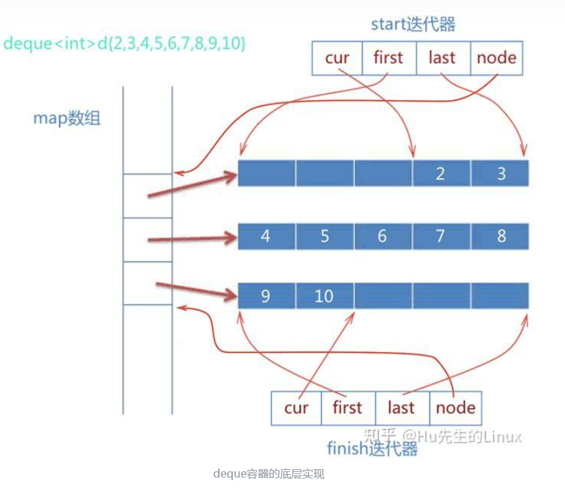
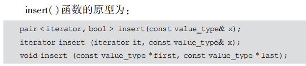

# MyTinySTL注释解析
1. ?-疑问
2. c-注释
3. 

# allocator & construct
---
## Q: 为什么要将内存分配和构造分离?
MyA:一般采用的使内存池设计，也就是说有一组指针指向了已经分配好的内存，这时候我们申请空间其实获得的是一个指向足够大的空间的指针，我们只需要在这个指针指向的空间上直接进行构造即可。

---

## 内存分配、构造、析构、释放的概念一定要清晰！！！
### 析构代码细节详解
 **🚀 allocator 中的析构 (`destroy`) 详解**
---
 **🌟 1. 作用**
`allocator` 的 `destroy` 方法用于 **手动调用对象的析构函数**，以释放对象占用的资源，但不会释放内存（`deallocate` 负责内存释放）。

---
#### **🔹 2. 代码结构**
 **(1) `allocator::destroy`**
```cpp
template <class T>
void allocator<T>::destroy(T* ptr) {
    mystl::destroy(ptr);
}

template <class T>
void allocator<T>::destroy(T* first, T* last) {
    mystl::destroy(first, last);
}
```
- `allocator::destroy(ptr)`  **调用 `mystl::destroy(ptr)` 进行析构**。
- `allocator::destroy(first, last)` **调用 `mystl::destroy(first, last)` 依次析构一段范围内的对象**。

---
 **(2) `mystl::destroy`**
`mystl::destroy` 会判断对象是否是**平凡可析构的**（trivially destructible）。如果是，则**什么都不做**；否则，**手动调用析构函数**。

#### **单个对象析构**
```cpp
template <class Ty>
void destroy(Ty* pointer) {
    destroy_one(pointer, std::is_trivially_destructible<Ty>{});
}
```
- `std::is_trivially_destructible<Ty>{}` **用于判断对象是否需要手动调用析构函数**：
  - **如果是 trivially destructible（例如 `int`、`double`）** → **不会手动调用析构**（`destroy_one` 的 `true_type` 版本）。
  - **如果不是 trivially destructible（例如 `std::string`、`std::vector<int>`）** → **手动调用析构函数**（`destroy_one` 的 `false_type` 版本）。

---

 **(3) `destroy_one`**
```cpp
// 对于 trivially destructible 类型（如 int、double），什么都不做
template <class Ty>
void destroy_one(Ty*, std::true_type) {}

// 对于非 trivially destructible 类型，手动调用析构函数
template <class Ty>
void destroy_one(Ty* pointer, std::false_type) {
    if (pointer != nullptr) {
        pointer->~Ty();  // 显式调用析构函数
    }
}
```
**🔹 解释**
- **`std::true_type` 版本** → **如果 `Ty` 是 trivially destructible 类型，则不做任何操作**（优化）。
- **`std::false_type` 版本** → **如果 `Ty` 需要显式析构，手动调用 `pointer->~Ty()`**。

---

#### **(4) allocator中处理对象范围**
```cpp
template <class ForwardIter>
void destroy(ForwardIter first, ForwardIter last) {
    destroy_cat(first, last, std::is_trivially_destructible<
        typename iterator_traits<ForwardIter>::value_type>{});
}
```
- 传递 `first` 和 `last` 指针，判断 `value_type` 是否是 trivially destructible：
  - **如果是**（`true_type`） → **不做任何操作**。
  - **如果不是**（`false_type`） → **遍历范围，每个对象都调用 `destroy`**。

---

 **(5) construct::`destroy_cat` 具体实现**
```cpp
// 如果对象是 trivially destructible（如 int、char），不做任何操作
template <class ForwardIter>
void destroy_cat(ForwardIter, ForwardIter, std::true_type) {}

// 依次调用 destroy 进行手动析构
template <class ForwardIter>
void destroy_cat(ForwardIter first, ForwardIter last, std::false_type) {
    for (; first != last; ++first) {
        destroy(&*first);
    }
}
```
**🔹 解释**
- **`std::true_type` 版本** → 如果对象是 trivially destructible，不做任何操作。
- **`std::false_type` 版本** → 遍历 `first` 到 `last` 之间的所有对象，依次调用 `destroy(&*first)` 进行手动析构。

---

#### **🔹 3. 为什么要特判 `trivially destructible`？**
**优化性能，避免不必要的析构！**
- **平凡可析构的类型（如 `int`、`double`）**：
  - 不需要手动析构 → **优化掉 `destroy` 调用**，提高效率。
- **复杂类型（如 `std::string`、`std::vector<int>`）**：
  - 需要手动析构，`destroy` **会调用 `~Ty()`**。

示例：
```cpp
std::string* p = new std::string("Hello");
allocator<std::string>::destroy(p);  // 调用 ~std::string()
```
---
#### **🔹 4. 代码执行流程**
💡 **当 `allocator::destroy(ptr)` 被调用时**：
1. `destroy(ptr)` 会调用 `destroy_one(ptr, std::is_trivially_destructible<Ty>{})`。
2. `std::is_trivially_destructible<Ty>` 判断 `Ty` 是否是 trivially destructible。
3. **如果 `Ty` 是 trivially destructible**（如 `int`）：
   - `destroy_one` **不做任何操作**。
4. **如果 `Ty` 不是 trivially destructible**（如 `std::string`）：
   - `destroy_one` **调用 `ptr->~Ty();` 手动析构**。

---

#### **🎯 5. 总结**
| **函数** | **作用** |
|---------|--------|
| `allocator::destroy(T* ptr)` | 调用 `mystl::destroy(ptr)`，析构单个对象 |
| `allocator::destroy(T* first, T* last)` | 调用 `mystl::destroy(first, last)`，析构多个对象 |
| `destroy(T* ptr)` | 判断对象是否 trivially destructible，决定是否调用 `destroy_one` |
| `destroy_one(Ty*, std::true_type)` | **如果对象是 trivially destructible，则不做任何操作** |
| `destroy_one(Ty*, std::false_type)` | **如果对象不是 trivially destructible，则手动调用 `~Ty()`** |
| `destroy(ForwardIter first, ForwardIter last)` | 遍历范围，判断是否需要手动析构 |
| `destroy_cat(ForwardIter, ForwardIter, std::true_type)` | **如果对象是 trivially destructible，则不做任何操作** |
| `destroy_cat(ForwardIter, ForwardIter, std::false_type)` | 遍历范围，每个对象都手动调用 `destroy` |

---
 **🌟 为什么这样设计？**
1. **避免不必要的析构，提高性能**（trivially destructible 的对象不做额外操作）。
2. **支持所有类型的析构**（包括普通对象和数组）。
3. **简洁、模块化设计**（`destroy_one` 处理单个对象，`destroy_cat` 处理范围）。

---
📌 **总结**
✔ **`allocator::destroy` 负责析构对象，但不释放内存**  
✔ **`std::is_trivially_destructible` 避免不必要的析构，提高效率**  
✔ **手动调用析构函数 `~Ty()`，保证非 trivially destructible 类型的正确析构**


---
## Q:多参数完美转发的construct+forward
 **4. 为什么 `construct` 需要 `forward`？**
 **❌ 如果没有 `forward`**
```cpp
template <class Ty, class... Args>
void construct(Ty* ptr, Args... args) // ❌ 缺少 &&，导致参数总是拷贝
{
    ::new ((void*)ptr) Ty(args...);  // args 可能被拷贝或移动
}
```
这样 **所有参数都会被拷贝或移动**，即使它们原本是右值，这会 **导致性能下降**。

 **✅ 采用 `forward` 版本**
```cpp
template <class Ty, class... Args>
void construct(Ty* ptr, Args&&... args)
{
    ::new ((void*)ptr) Ty(mystl::forward<Args>(args)...);
}
```
这样：
- **左值仍然是左值**，**右值仍然是右值**。
- **避免拷贝，提高性能**。

---

💡 **总结一句话：**
🚀 `forward` + `construct` **实现 STL 容器的高效对象管理**，确保 **参数的完美转发**，避免不必要的拷贝和移动，从而 **提高性能**！


# util
## forward完美转发
### forward实现代码解析
 **1. `forward` 的作用**
`mystl::forward` **是 `std::forward` 的自定义实现**，它的作用是 **实现完美转发（Perfect Forwarding）**。  

---

 **📌 为什么需要 `forward`？**
在 C++ **模板函数** 中，参数的**左值/右值特性可能丢失**。如果不使用 `forward`，左值可能会被误传为右值，导致**额外的拷贝**或**移动构造**错误。  
`forward` 通过 **保持原始参数的左值/右值属性**，确保函数参数正确传递到最终的目标构造函数或函数调用。

---

 **📌 `forward` 的实现**
```cpp
// 版本1：处理左值
template <class T>
T&& forward(typename std::remove_reference<T>::type& arg) noexcept
{
    return static_cast<T&&>(arg);
}

// 版本2：处理右值
template <class T>
T&& forward(typename std::remove_reference<T>::type&& arg) noexcept
{
    static_assert(!std::is_lvalue_reference<T>::value, "bad forward");
    return static_cast<T&&>(arg);
}
```

---

 **📌 `forward` 代码解析**
 **🚀 版本1：处理左值**
```cpp
template <class T>
T&& forward(typename std::remove_reference<T>::type& arg) noexcept
{
    return static_cast<T&&>(arg);
}
```
- `std::remove_reference<T>::type&`  
  - 如果 `T = int&`，则 `std::remove_reference<int&>::type` 变为 `int`，最终 `arg` 变成 `int& arg`，即左值引用。
  - **保证左值参数仍然是左值**。

- `static_cast<T&&>(arg);`
  - `T&&` 可能是 `int&&`，也可能是 `int& &&`（折叠成 `int&`）。
  - **最终保证 `arg` 仍然是原本的左值**。

 **🚀 版本2：处理右值**
```cpp
template <class T>
T&& forward(typename std::remove_reference<T>::type&& arg) noexcept
{
    static_assert(!std::is_lvalue_reference<T>::value, "bad forward");
    return static_cast<T&&>(arg);
}
```
- `typename std::remove_reference<T>::type&& arg`
  - 如果 `T = int`，`std::remove_reference<T>::type` 仍是 `int`，所以 `arg` 是 `int&&`，即右值引用。
  - 但如果 `T` **本身是左值引用 `int&`**，那么 `T = int&`，`std::remove_reference<int&>::type = int`，导致 `int&& arg`。
  - 但 `int&& arg` **不能接收左值**，会报错。因此，需要 `static_assert(!std::is_lvalue_reference<T>::value, "bad forward");`，防止错误用法。

- `static_cast<T&&>(arg);`
  - 确保 `arg` 仍然是**原本的右值**。

---

 **2. `construct`（多参数完美转发）**
```cpp
template <class Ty, class... Args>
void construct(Ty* ptr, Args&&... args)
{
    ::new ((void*)ptr) Ty(mystl::forward<Args>(args)...);
}
```

 **📌 代码解析**
1. `Args&&... args`：**变长模板参数**，可以接受 **任意数量的参数**，且支持 **左右值引用传递**。
2. `mystl::forward<Args>(args)...`
   - **保持 `args` 的原始左值/右值状态**，防止参数被不必要地拷贝或移动。
3. `::new ((void*)ptr) Ty(...)`
   - **在 `ptr` 指向的内存位置上调用 `Ty` 的构造函数**，使用 `args` 作为参数。

---

 **📌 示例**
```cpp
#include <iostream>
#include <string>

struct A {
    int x;
    std::string s;

    A(int v, std::string str) : x(v), s(str) {
        std::cout << "A(int, std::string) constructor, x = " << x << ", s = " << s << "\n";
    }
};

int main() {
    void* mem = ::operator new(sizeof(A));
    A* a = static_cast<A*>(mem);

    std::string hello = "hello";
    construct(a, 42, hello);  // 传入多个参数（左值、右值混合）

    std::cout << "a->x = " << a->x << ", a->s = " << a->s << "\n";

    a->~A();
    ::operator delete(mem);
}
```

---

 **📌 `construct` 使用 `forward` 进行完美转发**
- 直接传入 `construct(a, 42, hello);`
  - `42` 是**右值**，应该保持右值属性传递。
  - `hello` 是**左值**，应该保持左值属性传递。
- `Args&&... args` 通过 **模板参数推导** 解析为：
  - `Args = int, std::string&`
  - `args... = (42, hello)`

1. `forward<int>(42)` → `static_cast<int&&>(42)` **仍然是右值**
2. `forward<std::string&>(hello)` → `static_cast<std::string&>(hello)` **仍然是左值**
3. `::new ((void*)ptr) A(42, hello);` → **构造 `A(42, "hello")`**

---

 **3. 总结**
 **🔹 `forward` 的作用**
1. **保证原始参数的左值/右值特性**
   - **左值仍然是左值**，**右值仍然是右值**，不会错误地变成拷贝或移动。
2. **避免不必要的拷贝，提高性能**
   - 避免无意义的构造/析构，提高效率。
3. **实现完美转发**
   - 结合 `&&` 使 `T&&` 在 `T` 为左值时，转为 `T&`，在 `T` 为右值时，保持 `T&&`。

 **🔹 `construct`（多参数完美转发）的作用**
1. **可以传递多个参数，支持任意构造函数**
2. **完美转发 `args`，保持参数的左值/右值特性**
3. **在已分配的内存 `ptr` 上构造对象**
4. **提高 STL 容器的效率**
   - `vector` **扩容时，不需要额外拷贝构造**，而是直接在新内存上**完美转发**参数，减少开销。

---

 **🔹 关键点总结**
| 代码 | 作用 |
|------|------|
| `forward<T>(x)` | 保持 `x` 的原始左值/右值特性 |
| `construct(ptr, args...)` | 在 `ptr` 上调用 `Ty` 的构造函数，使用 `args...` 传参 |
| `Args&&... args` | 支持传递多个参数，同时保留左右值信息 |
| `mystl::forward<Args>(args)...` | 确保 `args...` 以正确的左右值形式传递 |

---


## Q: 左值，左值引用，右值，右值引用的区别
A: 

## Q:既然万能引用(T&&)能接受左值和右值，为什么还需要forward
A:**为什么 `std::forward` 仍然需要？**
虽然**万能引用 (`T&&`) 可以接受左值和右值**，但是**在函数内部，它的值类别可能会被错误地改变**。`std::forward` 的作用是**保持原始值类别**，确保正确地转发参数，避免不必要的拷贝或移动。

---

 **1. 问题：没有 `std::forward` 时，右值可能变成左值**
看看下面的代码：
```cpp
template <typename T>
void wrapper(T&& arg) {
    func(arg);  // 直接传递
}

void func(int& x) { std::cout << "Lvalue reference: " << x << std::endl; }
void func(int&& x) { std::cout << "Rvalue reference: " << x << std::endl; }

int main() {
    int a = 10;
    wrapper(a);   // 传递左值
    wrapper(20);  // 传递右值
}
```
 **🚀 预期结果**
我们希望：
- `wrapper(a)` 调用 `func(int&)`
- `wrapper(20)` 调用 `func(int&&)`

 **⚠ 实际结果**
```
Lvalue reference: 10
Lvalue reference: 20  ❌（不符合预期）
```
右值 `20` 竟然也被当作**左值**传递了！**为什么？**

**分析**
- `T = int&` 时，`arg` 变成 `int&`，`func(arg)` 变成 `func(int&)` ✅
- **但当 `T = int`（右值）时**，`arg` **在 `wrapper` 里是左值**，`func(arg)` 变成 `func(int&)` ❌

---

 **2. 解决方案：使用 `std::forward`**
```cpp
template <typename T>
void wrapper(T&& arg) {
    func(std::forward<T>(arg));  // 保持原始值类别
}
```
 **🚀 现在 `std::forward` 会保持 `arg` 的值类别**
- `wrapper(a)` 调用 `func(int&)` ✅
- `wrapper(20)` 调用 `func(int&&)` ✅（原来的右值仍然是右值）

 **🔹 `std::forward<T>(arg)` 的作用**
- **如果 `T` 是 `int&`**（左值），则 `std::forward<int&>(arg)` 返回 `int&`
- **如果 `T` 是 `int`**（右值），则 `std::forward<int>(arg)` 返回 `int&&`（仍然是右值）

---

 **3. `std::forward` 的实现**
```cpp
template <class T>
T&& forward(typename std::remove_reference<T>::type& arg) noexcept {
    return static_cast<T&&>(arg);
}

template <class T>
T&& forward(typename std::remove_reference<T>::type&& arg) noexcept {
    static_assert(!std::is_lvalue_reference<T>::value, "bad forward");
    return static_cast<T&&>(arg);
}
```
 **🚀 `std::forward` 的工作方式**
- **当 `T` 是 `int&`（左值引用）时**，`std::forward<int&>(arg)` 变成 `static_cast<int&>(arg)`，返回左值。
- **当 `T` 是 `int`（右值）时**，`std::forward<int>(arg)` 变成 `static_cast<int&&>(arg)`，返回右值。

---

 **4. `std::forward` 在完美转发中的应用**
```cpp
template <typename T, typename... Args>
void construct(T* ptr, Args&&... args) {
    ::new ((void*)ptr) T(std::forward<Args>(args)...);
}
```
- `construct` 需要**正确地传递所有参数**，避免误把右值变成左值，影响对象构造的效率。
- **`std::forward<Args>(args)...` 保证了所有参数的值类别不变**。

---

 **5. 结论**
| **情况** | **不使用 `std::forward`** | **使用 `std::forward`** |
|----------|----------------------|----------------------|
| 传递左值 `a` | 正常传递 `a`（左值） | 仍然是左值 |
| 传递右值 `10` | **错误变成左值** | **仍然是右值** |
| 调用 `func(10)` | `func(int&)`（错误） | `func(int&&)`（正确） |
| 多参数 `construct` | 可能触发错误的拷贝 | 正确转发所有参数 |

📌 **总结：**
✔ **万能引用 (`T&&`) 虽然可以接受左值和右值，但在函数内部，所有参数都会变成左值**。  
✔ **`std::forward<T>(arg)` 使参数保持原本的左值/右值特性**，确保正确的拷贝/移动语义。
# 序列式容器
## vector
Q:高效的原因在哪（尽可能的减少拷贝次数，）

Q: vector的元素类型可以是引用吗
A:

### Q: push_back和emplace_back,emlpace的区别
> 你的理解中存在一个关键误区：**形参 `value`（`const value_type&`）本身并不会调用拷贝构造函数**。让我们一步步澄清整个过程：

---

 **1. 形参 `value` 的传递机制**
当调用 `push_back(obj)` 时：
- **`obj` 是左值**：`value` 直接绑定到 `obj` 的引用，**不触发任何拷贝或移动构造**。
- **`obj` 是右值**（如临时对象）：若 `push_back` 只有 `const T&` 版本，`value` 仍会绑定到临时对象，但此时临时对象的生命周期会延长到函数结束，**同样不触发拷贝**。

 示例验证：
```cpp
void func(const MyClass& arg) {}  // 不会构造 arg，它只是一个引用

MyClass obj;
func(obj);       // arg 是 obj 的引用，无拷贝
func(MyClass()); // arg 绑定到临时对象，无拷贝
```

---

 **2. `push_back` 中的拷贝构造发生在哪里？**
关键代码：
```cpp
data_allocator::construct(mystl::address_of(*end_), value);
```
- **`construct` 的作用**：在容器尾部（`*end_` 的位置）构造一个 `T` 类型的新对象。
- **构造方式**：由于 `value` 是 `const T&`，这里会调用 `T` 的 **拷贝构造函数**，即：
  ```cpp
  new (ptr) T(value);  // 在 ptr 指向的内存中拷贝构造 T 对象
  ```
- **拷贝构造的源头**：`value` 是外部对象（如 `obj`）的引用，因此新对象是通过**拷贝 `obj`** 构造的。

 流程分解：
```
调用 push_back(obj)
↓
形参 value 是 obj 的引用（无拷贝）
↓
在容器内存中调用 T 的拷贝构造函数：T(*end_) = T(value)
↓
完成新元素的构造
```

---

 **3. 对比 `emplace_back` 的行为**
若调用 `emplace_back(obj)`：
```cpp
vec.emplace_back(obj);  // 传递左值 obj
```
- **参数传递**：`emplace_back` 的万能引用 `Args&&...` 会推导为 `const T&`，完美转发后调用：
  ```cpp
  construct(..., obj);  // 仍会触发拷贝构造！
  ```
- **结果**：此时 `emplace_back` 和 `push_back` 的行为完全一致，均调用拷贝构造函数。

 关键区别：
- **`emplace_back` 的优势**体现在可以直接传递构造参数，**避免创建临时对象**：
  ```cpp
  vec.emplace_back(1, 2.0, "hello");  // 直接调用 T(int, double, const char*)
  ```
  而 `push_back` 必须显式构造一个临时对象：
  ```cpp
  vec.push_back(T(1, 2.0, "hello"));  // 构造临时对象 + 移动/拷贝
  ```

---

 **4. 总结：何时发生拷贝构造？**
| **操作**                   | **拷贝构造发生位置**                     | **是否可避免**                |
|---------------------------|----------------------------------------|-----------------------------|
| `push_back(obj)`           | 在 `construct` 中拷贝 `obj`            | 否（除非 `obj` 可移动且存在 `push_back(T&&)`） |
| `emplace_back(obj)`        | 同 `push_back`（参数为左值时）         | 否                          |
| `emplace_back(构造参数...)`| 无拷贝（直接构造）                     | 是                          |

---

 **5. 修正你的理解**
- **误区**：认为形参 `value` 会先调用拷贝构造函数创建一个副本，再将副本传递给 `construct`。
- **正解**：
  1. 形参 `value` 只是一个引用，**不触发任何构造**。
  2. 拷贝构造发生在 `construct` 内部，**直接使用原始对象（`obj`）的引用**进行拷贝。

---

 **6. 代码验证**
```cpp
#include <iostream>

class MyClass {
public:
    MyClass() { std::cout << "Default Constructor\n"; }
    MyClass(const MyClass&) { std::cout << "Copy Constructor\n"; }
    MyClass(MyClass&&) { std::cout << "Move Constructor\n"; }
};

template<typename T>
class Vector {
public:
    void push_back(const T& value) {
        // 模拟 construct 调用拷贝构造
        new (&storage) T(value);
    }

    template<typename... Args>
    void emplace_back(Args&&... args) {
        // 模拟 construct 直接构造
        new (&storage) T(std::forward<Args>(args)...);
    }

private:
    alignas(T) char storage[sizeof(T)];
};

int main() {
    Vector<MyClass> vec;
    MyClass obj;

    std::cout << "push_back(obj): ";
    vec.push_back(obj);  // 输出 Copy Constructor

    std::cout << "emplace_back(obj): ";
    vec.emplace_back(obj);  // 输出 Copy Constructor

    std::cout << "emplace_back(): ";
    vec.emplace_back();  // 输出 Default Constructor
}
```
**输出**：
```
push_back(obj): Copy Constructor
emplace_back(obj): Copy Constructor
emplace_back(): Default Constructor
```

---

 **7. 最终结论**
- `push_back(const T& value)` 的形参 `value` **不会调用拷贝构造函数**，它只是实参的引用。
- **真正的拷贝构造**发生在 `construct` 函数内部，直接使用 `value` 引用的对象进行拷贝。
- `emplace_back` 的优势在于**跳过中间对象构造**（当传递构造参数时），而非总是避免拷贝。

### resize和reserve的区别
情况一：n小于当前vector.size()
resize删除n+1~end的元素，**调整size**，不改变capacity
reserver**不做调整**，本质上是预留空间，因为空间已经足够

情况2：n大于当前vector.size()
这种情况下resize和reserve都重新分配内存，并**将原数据移动到新内存地址**
不同点在于，**resize会对多出的部分进行构造，而reserve只分配空间不构造**，速度差异大

### vector扩容是元素是拷贝到新空间还是移动
在 `std::vector` 进行扩容（`reallocate`）时，**是否拷贝（`copy`）还是移动（`move`）元素**，取决于存储元素的类型 `T`：  

1. **如果 `T` 支持移动构造（`std::is_move_constructible<T>::value == true`），则优先使用 `std::move()`** 进行移动操作，减少不必要的拷贝开销。  
2. **如果 `T` 不支持移动构造**（如 `std::unique_ptr<T>` 之前的旧版本），则只能使用 **拷贝构造** 复制元素到新内存中。  

---

#### **📌 扩容时的行为**
 **✅ 触发扩容的情况**
- `vector` 在 `size() == capacity()` 时调用 `push_back()` 或 `emplace_back()`。
- 需要分配更大的存储空间，并将旧数据转移到新空间。

 **✅ 具体扩容步骤**
1. **分配更大的新内存**（通常 `capacity` **翻倍增长**）。
2. **移动（`move`）或拷贝（`copy`）原有元素** 到新内存。
3. **释放旧内存**。

---

#### **📌 `std::move()` 在扩容中的应用**
 **C++11 之后，`std::vector` 会优先使用 `std::move()` 迁移元素**
```cpp
template <class T>
void reallocate(size_t new_cap) {
    T* new_data = allocate(new_cap);  // 分配新内存

    // 如果 T 支持移动构造，则使用 move，否则用拷贝构造
    if constexpr (std::is_move_constructible<T>::value) {
        std::move(begin_, end_, new_data);  
    } else {
        std::copy(begin_, end_, new_data);  
    }

    deallocate(begin_);  // 释放旧内存
    begin_ = new_data;
    end_ = begin_ + size_;
    cap_ = begin_ + new_cap;
}
```

---

#### **📌 示例：不同类型的 `T` 影响扩容行为**
 **✅ 例 1：普通 `int` 类型，使用 `std::move()`**
```cpp
#include <vector>
#include <iostream>

int main() {
    std::vector<int> vec = {1, 2, 3};
    vec.reserve(10);  // 扩容，元素移动
    std::cout << "扩容后: ";
    for (int x : vec) std::cout << x << " ";
}
```
✅ `std::move()` **不会影响 `int`，因为拷贝和移动行为一致**。

---

 **✅ 例 2：使用 `std::string`，触发 `move`**
```cpp
#include <vector>
#include <iostream>
#include <string>

int main() {
    std::vector<std::string> vec;
    vec.reserve(2);
    vec.push_back("hello");
    vec.push_back("world");

    vec.reserve(10);  // 触发扩容
    std::cout << "扩容后: " << vec[0] << " " << vec[1] << std::endl;
}
```
✅ **`std::string` 支持移动构造**，扩容时会 **转移所有权**，避免字符串数据的深拷贝。

---

 **✅ 例 3：非可移动类型（`std::vector<int>` 的旧版本）**
```cpp
#include <vector>
#include <iostream>

struct NonMovable {
    int data;
    NonMovable(int d) : data(d) {}
    NonMovable(const NonMovable&) = default;  // 只能拷贝
    NonMovable(NonMovable&&) = delete;  // 禁止移动
};

int main() {
    std::vector<NonMovable> vec;
    vec.reserve(2);
    vec.emplace_back(1);
    vec.emplace_back(2);

    vec.reserve(10);  // 只能拷贝
    std::cout << "扩容完成" << std::endl;
}
```
✅ **由于 `NonMovable` 没有 `move constructor`，只能使用 `copy`，性能较低**。

---

#### **📌 总结**
| **存储类型 `T`** | **扩容时的行为** |
|--------------|------------------|
| **基本类型（如 `int`、`double`）** | **拷贝**（但开销小，区别不大） |
| **支持 `move` 的类型（如 `std::string`）** | **优先 `std::move()`**，减少拷贝 |
| **不支持 `move` 的类型** | **只能 `copy`，可能导致性能下降** |

 **💡 结论**
1. **C++11 之后，`std::vector` 会优先使用 `std::move()` 进行扩容**，但前提是 `T` **支持移动构造**。
2. **如果 `T` 只有拷贝构造**（无 `move constructor`），则仍然会 **拷贝原数据** 到新空间，影响性能。
3. **对于性能敏感的情况，建议使用支持移动语义的类型**（如 `std::unique_ptr<T>`）。

✅ **所以，现代 `vector` 扩容时**，**通常是移动（`std::move()`），而不是拷贝**！

### 使用{}初始化vector发生的操作
详细看MyC++中的列表初始化内容

## list 双向链表
list 是由**双向链表**来实现的
> 1） list **不支持随机存取**。
2） 在 list 的任何位置执行元素的插入和移除都非常快， 可以迅速实现。 插入和删除动作不会影响指向其他元素的指针、 引用、 迭代器， 不会造成失效。
3） list **不提供下标操作符 ［］ 和 at（）函数**。
4） list 每个元素都有自己的内存。
5） list 也提供了特殊成员函数， 专门用于移动元素。 和同名的算法相比， 使用这些函数速度更快。

## deque 双端队列
### 基本结构
deque的底层实现是使用map数据存放**一段段不连续的连续空间**(可以理解为二维数组，但是一维访问)
**误区消除**:deque中的map，以及map指向的每一个buffer**并不是使用其它stl**如vector作为实现的，而是**直接分配**的内存
```
// 迭代器所含成员数据
value_pointer cur;    // 指向所在缓冲区的当前元素
value_pointer first;  // 指向所在缓冲区的头部
value_pointer last;   // 指向所在缓冲区的尾部
map_pointer   node;   // 缓冲区所在节点
---------------------------------------------------------------
// 用以下四个数据来表现一个 deque
iterator       begin_;     // 指向第一个节点
iterator       end_;       // 指向最后一个结点
map_pointer    map_;       // 指向一块 map，map 中的每个元素都是一个指针，指向一个缓冲区
size_type      map_size_;  // map 内指针的数目
```


### 如何扩容
`deque`（双端队列）之所以能高效地在两端插入或删除元素，主要原因就是它的**存储结构**与 `vector` 不同。为了实现**动态增长**，尤其是在**两端都支持常数时间插入**的目标，`deque` 采用了一种 **分段连续内存 + 中控map结构** 的设计方式。

---

#### 🌟 **deque 动态扩容的核心设计：**

##### 📌 1. 分段存储结构（buffer + map）

- `deque` 的元素不是保存在一整块连续内存里（像 `vector` 那样），而是**分成多个缓冲区（buffer）**。
- 这些缓冲区的指针被保存在一个称为 **map** 的结构中：
  ```cpp
  map_ => [ buffer1, buffer2, buffer3, ..., bufferN ]
  ```
- 每个缓冲区的大小是固定的（通常是 512 字节或 `buffer_size`），map 中每一个元素是指向一个 buffer 的指针。

---

##### 📌 2. map 的初始化与空间管理

```cpp
// 关键数据结构
map_pointer    map_;       // 指向 buffer 指针数组（map）
size_type      map_size_;  // map_ 中可以容纳的 buffer 指针个数
iterator       begin_;     // 指向第一个元素
iterator       end_;       // 指向最后一个元素的下一个位置
```

- `map_` 通常会预留比当前 `deque` 实际 buffer 数更多的空间（比如中间只用一部分），这样可以在前端或尾端扩展新的 buffer。

---

#### 🔁 **deque 如何动态增长？**

##### ✅ 向前扩展（push_front）

- 当 `begin_.cur == begin_.first`，说明当前 buffer 的前面已经用完了；
- 如果 `begin_.node == map_`，说明 map 的开头也用尽了，需要**扩容 map**；
- 否则，可以向 `map_` 的前面分配一个新的 buffer，并让 `begin_` 指向这个新的 buffer。

##### ✅ 向后扩展（push_back）

- 当 `end_.cur == end_.last`，说明当前 buffer 已满；
- 如果 `end_.node == map_ + map_size_ - 1`，说明 map 的尾部空间也用尽了，需要**扩容 map**；
- 否则，分配一个新的 buffer，并让 `end_` 移到这个新的 buffer 上。

---

#### 🔧 **map 扩容时怎么做？**

当 map 不够用时，会执行类似如下操作：

```cpp
// 扩容 map 的思路
1. 分配一个更大的 map（比如原来大小的2倍）；
2. 把原来的 buffer 指针拷贝到新 map 中间；
3. 释放旧 map；
4. 更新 map_ 和 map_size_；
```

这样可以**最小化重新分配的次数**，同时保持前后都有可扩展空间。

---

#### 🆚 与 vector 扩容的区别？

| 特性        | `vector`                       | `deque`                                 |
|-------------|--------------------------------|------------------------------------------|
| 存储结构     | 连续内存                       | 分段连续内存 + map                       |
| 扩容时       | 整体重新分配 + 拷贝或移动全部元素 | 添加新的 buffer + 只部分复制指针          |
| 支持两端插入 | 否（front 性能差）              | 是（push_front 性能良好）                |
| 迭代器稳定性 | 扩容会导致所有迭代器失效         | 添加 buffer 不会导致已有元素地址改变     |

---

#### ✅ 总结：

`deque` 通过 **多段缓冲区 + map_ 中控结构** 实现了两端插入高效、局部扩容性能良好。其动态扩容过程**不是重新分配整个数据空间**，而是通过在 map 中添加新的 buffer 指针来完成扩展。只有当 map 不够用时，才需要重新分配并迁移 map。

如果你想了解 `map_init`、`create_map`、`create_buffer` 等实现细节，我也可以进一步展开~


## string
string 其实就是由char,wchar,char16_t,char32_t类型组成的字符序列 \n
包括一个指向开头的指针buffer，实际的大小size，以及真正的容量capacity

# 关联式容器
map, set......
> 1.关联式容器依据特定的排序准则，自动为其元素排序。关联式容器中的元素**都经过排序， 是有序的**。
> 2.通常关联式容器由**二叉树数据结构实现**(红黑树)的。

## set & multiset
> 注意:
> 1.low_bound （const Key＆ 　Key） 函数的返回值是迭代器， 该迭代器指向集合中键值**大于并等于**参数 Key 的第一个元素。
2.upper_bound （onst Key＆ 　Key） 函数的返回值是迭代器， 该迭代器指向集合中键值**大于**参数 Key 的第一个元素。
3.equal_range （const Key＆ 　Key） 函数的返回值是迭代器对 （ pair）， 该**迭代器对**(pair)的两个迭代器分别指向集合中键值大于并等于参数 Key 的第一个元素和集合中键值大于参数Key 的第一个元素。

set和 multiset 中的元素是**无法调用任何修改性算法的**。 set 和 multiset 是不能使用 remove（ ）算法函数的， 如果要移除 set 和 multiset 中的元素， 必须使用它们本身提供的成员函数,如下图：



## map & multimap
（6） map 作为关联式数组
通常关联式容器不提供元素的直接存取， 必须依靠迭代器。 **但 map 型容器提供下标操作符， 支持元素的直接存取。 下标操作符的索引值并非元素整数位置， 而是元素的键值key**。 使用键值索引有时会带来诸多问题。 例如， 容器中不存在指定键值的元素， **会导致自动插入该元素**， 并且新元素的**默认 value 由构造函数提供**。 通常， 所有基本数据类型都提供了默认的构造函数， 并都以 0 为初值。

## rb_tree 
红黑树是set mset, map, mmap 的核心
> 红黑树插入 insert_and_rebalance
// 插入节点后使 rb tree 重新平衡，参数一为新增节点，参数二为根节点
// **搜索树、根叶黑、不红红、黑路同(从根到叶经历的黑节点数量相同)**
// case 1: 新增节点位于根节点，令新增节点为黑
// case 2: 新增节点的父节点为黑，没有破坏平衡，直接返回
// case 3: 父节点和叔叔节点都为红，令父节点和叔叔节点为黑，祖父节为红，然后**令祖父节点为当前节点，继续处理**
// case 4: 父节点为红，叔叔节点为 NIL 或黑色，父节点为左（右）孩子,当前节点为右（左）孩子，
//         让父节点成为当前节点，再以当前节点为支点左（右）旋
// case 5: 父节点为红，叔叔节点为 NIL 或黑色，父节点为左（右）孩子当前节点为左（右）孩子，让父节点变为黑色，祖父节点变为红色，以祖父节点为支点右（左）旋
// https://www.bilibili.com/video/BV1Xm421x7Lg/?spm_id_from=333.337.search-card.all.click
// 参考博客: http://blog.csdn.net/v_JULY_v/article/details/6105630
//          http://blog.csdn.net/v_JULY_v/article/details/6109153

> 红黑树删除
> 
> https://www.bilibili.com/video/BV16m421u7Tb?spm_id_from=333.788.videopod.sections&vd_source=194c970df7bbe3b544de54867a333f41

## unordered_set & unordered_map
使用hashtable作为底层实现，使用**开链法处理冲突**
`unordered_map` **会自动扩容**，但它的扩容机制并不是基于桶（bucket）是否“满了”，而是基于**负载因子（load factor）**。

---

### **📌 unordered_map 何时扩容？**
- `unordered_map` 维护一个 **最大负载因子**（默认值通常是 **1.0**）。
- **负载因子** (`load factor`) 计算方式：
  \[
  \text{load factor} = \frac{\text{当前元素个数 size()}}{\text{桶的个数 bucket_count()}}
  \]
- 当 `load factor` 超过 **`max_load_factor()`** 时，`unordered_map` **自动扩容（rehash）**，即：
  1. **分配更多桶（buckets）**（通常会增至 **至少 2 倍**）。
  2. **重新哈希（rehash）所有元素**，并重新分配到新的桶。

---

### **📌 unordered_map 的自动扩容示例**
```cpp
#include <iostream>
#include <unordered_map>

int main() {
    std::unordered_map<int, int> umap;
    
    std::cout << "初始 bucket 数量: " << umap.bucket_count() << std::endl;
    
    for (int i = 0; i < 20; ++i) {
        umap[i] = i * 10;  // 插入元素
        std::cout << "插入: " << i << ", 当前 load factor: " << umap.load_factor() 
                  << ", bucket 数量: " << umap.bucket_count() << std::endl;
    }
    
    return 0;
}
```

**可能输出（不同编译器可能有不同扩容策略）：**
```
初始 bucket 数量: 0
插入: 0, 当前 load factor: 0.1, bucket 数量: 10
插入: 1, 当前 load factor: 0.2, bucket 数量: 10
插入: 2, 当前 load factor: 0.3, bucket 数量: 10
...
插入: 9, 当前 load factor: 1.0, bucket 数量: 10
插入: 10, 当前 load factor: 0.5, bucket 数量: 20  <-- 触发扩容
插入: 11, 当前 load factor: 0.55, bucket 数量: 20
...
插入: 19, 当前 load factor: 0.95, bucket 数量: 20
插入: 20, 当前 load factor: 0.5, bucket 数量: 40  <-- 触发扩容
```
**可以看到，当 `load_factor > max_load_factor()` 时，`unordered_map` 触发 `rehash()` 进行扩容**。

---

### **📌 什么时候不会自动扩容？**
如果你 **手动设置 `max_load_factor()` 为一个较大的值**，比如：
```cpp
umap.max_load_factor(5.0);  // 允许平均每个桶存 5 个元素
```
那么 `unordered_map` 在 `size() / bucket_count() <= 5.0` 之前 **不会自动扩容**。

此外，如果你 **提前 reserve** 了足够的空间：
```cpp
umap.reserve(100);
```
那么在插入 100 个元素之前都不会触发 `rehash()`。

---

### **📌 如何手动触发扩容？**
如果你想 **手动控制扩容**，可以调用：
```cpp
umap.rehash(50);  // 重新分配至少 50 个 buckets
```
或者
```cpp
umap.reserve(100);  // 预留空间，避免频繁 rehash
```
这些方法可以 **减少 rehash 次数，提高性能**。

---

### **📌 总结**
✅ **unordered_map 在 load factor 超过 max_load_factor() 时会自动扩容**，重新分配桶并 rehash 数据。  
✅ **桶满了并不会直接导致扩容**，而是看 `size() / bucket_count()` 是否超过阈值。  
✅ **可以通过 `reserve()` 或 `rehash()` 手动控制扩容**，避免频繁 rehash 带来的性能开销。 🚀


## 哈希冲突的解决方式
在哈希表（`unordered_map` / `unordered_set` 等）中，**哈希冲突** 是指两个或多个不同的键映射到同一个哈希桶（bucket）。为了解决哈希冲突，主要有以下几种方法：  

---

### **📌 1️⃣ 开链法（Chaining）**
 **🔹 原理**：
- 每个桶存储一个**链表（或其他数据结构，如 `std::list`）**，当多个键映射到同一桶时，它们被添加到链表中。
- 查询时，先定位到桶，再遍历链表查找具体的键。

 **🔹 优点**：
✔ 结构简单，易于实现。  
✔ 不需要重新哈希，插入新元素时不会影响其他桶的数据。  

 **🔹 缺点**：
❌ 如果哈希函数不好，链表可能变得很长，查找效率从 **O(1) 退化到 O(n)**。  

 **🔹 C++ STL 实现**：
C++ `unordered_map` 和 `unordered_set` **默认使用** **开链法** 处理哈希冲突。

```cpp
#include <iostream>
#include <unordered_map>

int main() {
    std::unordered_map<int, std::string> umap;
    umap[1] = "Apple";
    umap[11] = "Banana"; // 可能与 1 发生哈希冲突
    umap[21] = "Cherry"; // 可能与 1, 11 发生哈希冲突

    for (const auto& pair : umap) {
        std::cout << pair.first << " -> " << pair.second << "\n";
    }
}
```
✔ **如果哈希函数不好，`1, 11, 21` 可能被存入同一桶，形成链表！**

---

### **📌 2️⃣ 开放地址法（Open Addressing）**
 **🔹 原理**：
- **所有数据直接存储在哈希表数组中**，而不是链表。
- 发生冲突时，使用**探测（probing）** 机制寻找新的存储位置。

 **🔹 主要探测方法**：
| 探测方式 | 方法 |
|---------|------|
| 线性探测（Linear Probing） | 发生冲突时，向后顺序查找空位（`index = (hash + i) % table_size`） |
| 二次探测（Quadratic Probing） | 发生冲突时，按二次方增量查找空位（`index = (hash + i²) % table_size`） |
| 双重哈希（Double Hashing） | 发生冲突时，使用第二个哈希函数查找新位置 |

---

#### **📌 2.1 线性探测（Linear Probing）**
**🔹 原理**：
- 如果哈希位置 `index` 已被占用，则顺序查找下一个空位置 `(index + 1) % table_size`。
- 可能会产生**堆积（Clustering）**，影响性能。

```cpp
int hashFunction(int key, int tableSize, int i) {
    return (key % tableSize + i) % tableSize; // 线性探测
}
```

**🔹 适用场景**：
✔ 适用于元素个数较少、负载因子较低的情况（负载因子 α = **元素数 / 哈希桶数**）。  
❌ 可能会导致**主集群（Primary Clustering）**，影响查询效率。  

---

#### **📌 2.2 二次探测（Quadratic Probing）**
**🔹 原理**：
- 遇到冲突后，不是简单的 `index + 1`，而是 `index + i²`（二次方增加）。

```cpp
int hashFunction(int key, int tableSize, int i) {
    return (key % tableSize + i * i) % tableSize; // 二次探测
}
```

**🔹 适用场景**：
✔ 避免了线性探测的“堆积”问题。  
❌ 但可能会导致**二次集群（Secondary Clustering）**。  

---

#### **📌 2.3 双重哈希（Double Hashing）**
**🔹 原理**：
- 发生冲突时，使用第二个哈希函数 `h2(x)` 进行偏移，计算公式：
  ```cpp
  index = (h1(key) + i * h2(key)) % table_size;
  ```
- 需要**确保 `h2(key)` 不能为 0**。

```cpp
int hash1(int key, int tableSize) {
    return key % tableSize;
}

int hash2(int key, int tableSize) {
    return 7 - (key % 7); // 选一个小于 tableSize 的质数
}

int doubleHash(int key, int tableSize, int i) {
    return (hash1(key, tableSize) + i * hash2(key, tableSize)) % tableSize;
}
```

**🔹 适用场景**：
✔ 适用于哈希表容量较大、负载因子较高的情况。  
✔ **冲突解决效果最好**，但实现稍复杂。  

---

### **📌 3️⃣ 再哈希（Rehashing）**
 **🔹 原理**：
- **当负载因子 α 过高（如 α > 0.75），触发再哈希（rehashing）**：
  1. 创建一个新的、更大的哈希表（通常是原大小的 2 倍）。
  2. 重新计算所有键的哈希值并插入新表。

**🔹 适用场景**：
✔ 保证哈希表的查找效率接近 **O(1)**。  
❌ 再哈希是**耗时操作**（所有元素都要重新插入新表）。  

**🔹 C++ STL `unordered_map` / `unordered_set` 自动支持再哈希！**
```cpp
std::unordered_map<int, std::string> umap;
umap.rehash(200); // 手动触发 rehash，使哈希桶数至少为 200
```

---

### **📌 4️⃣ 其他方法**
#### **📌 4.1 Cuckoo Hashing（布谷鸟哈希）**
**🔹 原理**：
- 使用 **两个哈希函数 `h1` 和 `h2`**，每个键可以存储在两个不同的位置：
  1. 先尝试 `h1(key)` 位置。
  2. 如果冲突，则尝试 `h2(key)` 位置。
  3. 如果 `h2(key)` 也冲突，则**逐步踢出已有元素**，并尝试重新插入它们。

✔ **查询时间恒为 O(1)**，适用于高性能应用（如路由表）。  
❌ **插入时可能会导致循环冲突，需要 Rehashing。**  

---

### **📌 总结**
| 方案 | 原理 | 优点 | 缺点 |
|------|------|------|------|
| **开链法（Chaining）** | 每个桶存储链表 | 结构简单，插入不会影响其他桶 | 哈希冲突多时查询退化为 O(n) |
| **线性探测（Linear Probing）** | 顺序查找空位 `(hash + i) % table_size` | 实现简单，空间利用率高 | 容易形成 **主集群（Clustering）** |
| **二次探测（Quadratic Probing）** | 按 `i²` 递增探测 | 避免主集群问题 | 仍可能有**二次集群** |
| **双重哈希（Double Hashing）** | 用 `h2(x)` 计算偏移量 | 避免集群问题，性能优越 | 实现复杂，选取合适 `h2(x)` 需谨慎 |
| **再哈希（Rehashing）** | 扩大哈希表重新计算哈希值 | 提高查找效率 | 触发时开销大 |
| **Cuckoo Hashing** | 两个哈希函数 + 逐步替换 | O(1) 查询速度 | 可能会循环冲突 |

**📌 C++ STL（`unordered_map` / `unordered_set`）默认采用** **开链法（Chaining）+ 再哈希（Rehashing）**！🚀🚀🚀


## 开链法和开放地址法谁更快——开放地址
面试官说“**哈希开放地址法比开链法更快**”，这在某些特定情况下是正确的，主要原因如下：

---

### **1️⃣ 开放地址法和开链法的区别**
#### **🔹 开放地址法（Open Addressing）**
- **所有元素都存储在哈希表的数组中**，不使用额外的链表或结构。
- 发生哈希冲突时，**通过探测（如线性探测、二次探测或双重哈希）寻找新的空位置**。
- **查询和插入时的访问模式更加连续，缓存友好**。

#### **🔹 开链法（Chaining）**
- **哈希表的每个槽存储的是一个指针，指向一个链表（或其他结构，如平衡树）**。
- 发生哈希冲突时，新元素被**插入到链表中**（或其他数据结构）。
- 由于使用了指针和动态分配，**可能导致缓存不友好**，查询速度受到影响。

---

### **2️⃣ 为什么开放地址法更快？**
✅ **更好的缓存局部性（Cache Locality）**
- **开放地址法**中的元素**存储在连续的数组中**，查找时访问的内存地址是连续的，CPU **缓存命中率更高**，这带来了更快的查询速度。
- **开链法**使用指针来连接不同的元素，链表的节点可能分布在内存中的不同位置，**指针跳转会导致更多的缓存未命中（Cache Miss）**，降低访问速度。

✅ **减少额外的指针操作**
- **开放地址法**不使用额外的指针存储结构，而**开链法**需要维护指针（链表中的 `next` 指针），这增加了内存访问开销。
- 在开链法中，每次查询都需要**先访问哈希桶，再遍历链表**，这可能导致额外的指针解引用，而开放地址法可以直接在数组中查找。

✅ **内存占用更小**
- **开放地址法**不需要额外的指针存储，而**开链法**的链表结点需要额外的指针字段，增加了内存占用。
- 在小规模数据或哈希表负载因子低时，**开放地址法的整体内存管理效率更高**。

✅ **避免小规模数据时的动态分配**
- **开链法**在哈希冲突时会创建新的链表结点，这涉及**动态内存分配（malloc/free）**，可能导致性能下降。
- **开放地址法**在低负载情况下不会涉及动态分配，操作更快。

---

### **3️⃣ 什么时候开链法更优？**
虽然开放地址法在 **低负载** 时表现更好，但当**哈希表的负载因子较高（接近 1 或更大）**时，**开链法的优势就会显现**：

🔸 **高负载因子（Load Factor）情况下**
- 开放地址法的探测会导致**大量探测冲突**，查找时间会恶化（最坏情况可能退化为 O(n)）。
- 开链法仍然可以保持**O(1) 级别的查询**（前提是哈希函数分布均匀）。

🔸 **删除操作**
- **开放地址法删除元素会造成“墓碑”问题**（被删除的元素位置可能会影响后续查找）。
- **开链法删除元素更直接**，可以直接删除链表中的节点，不影响其他元素的查找。

🔸 **负载因子超过 0.7~0.8 时**
- **开放地址法查找失败的概率会上升**，探测次数增加，查找性能下降。
- **开链法不会受太大影响**，冲突的元素只会增长链表长度，不会影响其他槽的查找。

---

### **4️⃣ 总结**
|  **方法**  | **优势** | **劣势** | **适用场景** |
|-----------|---------|---------|---------|
| **开放地址法** | 更快的查找（低负载）、更好的缓存局部性、节省指针开销 | 高负载时探测次数多，删除操作复杂 | 低负载（负载因子 < 0.7）、查询为主的场景 |
| **开链法** | 负载因子高时仍保持 O(1) 查询，删除操作更灵活 | 缓存不友好，指针操作多，占用更多内存 | 高负载（负载因子 > 0.7）、频繁插入删除 |

如果哈希表的负载因子较低，**开放地址法通常会更快**。但如果负载因子较高（如 0.75 以上），**开链法会更加稳定**，因为它避免了过多的探测操作。

**所以，选择哪种方法要看实际的使用场景！**


## 开链法和开放地址迭代器稳定角度
从 **迭代器稳定性** 的角度来看，**开放地址法（Open Addressing）** 和 **开链法（Chaining）** 在哈希表中的表现有很大的不同。  

---

### **1️⃣ 迭代器稳定性是什么？**
**迭代器稳定性** 指的是：
- **插入、删除元素时，已有的迭代器是否仍然有效**。
- **是否会导致迭代器失效（Iterator Invalidation）**。

**迭代器失效的常见原因**：
- **扩容（Rehashing）**：哈希表扩容时，所有元素的位置可能都会改变，导致迭代器失效。
- **插入、删除操作**：如果数据结构改变了元素的存储方式，可能导致迭代器失效。

---

### **2️⃣ 迭代器稳定性对比**

|  **方法**  | **插入新元素** | **删除元素** | **扩容（rehash）** |
|-----------|-------------|-------------|-------------|
| **开放地址法（Open Addressing）** | 可能导致其他元素位置变动，迭代器会失效 | 可能引入“墓碑”导致迭代器访问无效数据 | 需要重新分配所有元素，所有迭代器失效 |
| **开链法（Chaining）** | 只影响对应桶的链表，已有迭代器不失效 | 只影响被删除元素的迭代器，其他不受影响 | 只重新分配桶数组，不影响链表结构，已有迭代器仍然有效 |

---

### **3️⃣ 详细分析**
#### **🔹 开放地址法**
1. **插入新元素**
   - 由于采用**线性探测、二次探测或双重哈希**，新的元素可能插入到原本空的槽位，而不是哈希计算出的索引位置。
   - **可能导致元素重新排列，使得已有的迭代器变得无效**。

2. **删除元素**
   - 采用开放地址法的哈希表通常会使用**“墓碑标记”**（Tombstone）来标记已删除的位置，而不会直接删除数据。
   - 迭代器访问已删除的元素可能会访问“墓碑”，导致**访问无效数据**。

3. **扩容（Rehashing）**
   - **开放地址法的哈希表在扩容时需要重新计算所有元素的位置**，并重新放入新的哈希表中，**所有迭代器都会失效**。

---

#### **🔹 开链法**
1. **插入新元素**
   - 在开链法中，每个桶的存储是**一个链表**（或平衡树）。
   - 插入新元素只会影响**某个桶**的链表，不影响其他桶，因此**已有的迭代器仍然有效**。

2. **删除元素**
   - 直接从桶的链表中删除该元素，不影响其他元素，因此**其他迭代器不受影响**。
   - **只有指向被删除元素的迭代器失效**，其他元素的迭代器仍然有效。

3. **扩容（Rehashing）**
   - 由于哈希桶的数组大小变化，元素可能会被重新分配到新的桶中。
   - 但**链表本身不会改变，已有的迭代器仍然可以访问链表的节点**，因此**迭代器仍然有效**（但 `begin()` 可能会改变）。

---

### **4️⃣ 结论**
| **方法**  | **迭代器稳定性** |
|-----------|--------------|
| **开放地址法（Open Addressing）** | **迭代器不稳定**，插入、删除、扩容都可能导致迭代器失效 |
| **开链法（Chaining）** | **迭代器较稳定**，插入、删除不会影响已有的迭代器，只有扩容时 `begin()` 可能改变 |

🔹 **如果你的应用需要稳定的迭代器（如 long-running 迭代器访问哈希表），使用开链法更合适**。  
🔹 **如果只做快速查找、插入且不需要长期持有迭代器，开放地址法可能更快**。


# iterator


# 适配器
## **📌 STL 中 `stack` 和 `queue` 的底层实现**
在 C++ STL（标准模板库）中，`stack` 和 `queue` **都是容器适配器**（Container Adapters），它们是对已有容器的封装，提供 **特定的访问方式**。

### **🚀 `stack`（栈）的底层实现**
- **后进先出（LIFO）结构**，只允许在**顶端**操作。
- **默认使用 `deque<T>` 作为底层容器**，但也可以使用 `vector<T>` 或 `list<T>` 作为底层存储。

📌 **`stack` 适配的容器类型**
```cpp
template <class T, class Container = deque<T>>
class stack;
```

📌 **`stack` 的底层数据结构：**
| 操作 | 说明 |
|------|------|
| `push()` | **入栈**（往栈顶插入元素） |
| `pop()` | **出栈**（删除栈顶元素） |
| `top()` | 获取 **栈顶元素** |
| `empty()` | 检查是否为空 |
| `size()` | 获取元素个数 |

📌 **`stack` 示例代码**
```cpp
#include <iostream>
#include <stack>

int main() {
    std::stack<int> s;
    s.push(10);
    s.push(20);
    s.push(30);

    std::cout << "栈顶元素: " << s.top() << std::endl;
    s.pop();
    std::cout << "弹出后栈顶元素: " << s.top() << std::endl;

    return 0;
}
```

---

### **🚀 `queue`（队列）的底层实现**
- **先进先出（FIFO）结构**，支持**从队尾入队**，**从队头出队**。
- **默认使用 `deque<T>` 作为底层容器**，但也可以使用 `list<T>`。

📌 **`queue` 适配的容器类型**
```cpp
template <class T, class Container = deque<T>>
class queue;
```

📌 **`queue` 的底层数据结构**
| 操作 | 说明 |
|------|------|
| `push()` | **入队**（从尾部插入元素） |
| `pop()` | **出队**（删除头部元素） |
| `front()` | 获取 **队头元素** |
| `back()` | 获取 **队尾元素** |
| `empty()` | 检查是否为空 |
| `size()` | 获取元素个数 |

📌 **`queue` 示例代码**
```cpp
#include <iostream>
#include <queue>

int main() {
    std::queue<int> q;
    q.push(10);
    q.push(20);
    q.push(30);

    std::cout << "队头元素: " << q.front() << std::endl;
    q.pop();
    std::cout << "弹出后队头元素: " << q.front() << std::endl;

    return 0;
}
```

---

## **🚀 `priority_queue`（优先队列）的底层实现**
- **默认使用 `vector<T>` 作为底层容器，并用 `std::make_heap()` 维护大根堆**。
- **最大堆（默认）或最小堆**（可指定 `greater<T>`）。
  
📌 **`priority_queue` 适配的容器类型**
```cpp
template <class T, class Container = vector<T>, class Compare = less<typename Container::value_type>>
class priority_queue;
```

📌 **`priority_queue` 示例代码**
```cpp
#include <iostream>
#include <queue>
#include <vector>

int main() {
    std::priority_queue<int> pq;
    pq.push(30);
    pq.push(10);
    pq.push(50);

    std::cout << "最大元素: " << pq.top() << std::endl;
    pq.pop();
    std::cout << "弹出后最大元素: " << pq.top() << std::endl;

    return 0;
}
```

---

### **📌 `stack` vs `queue` vs `priority_queue`**
| 容器 | 适配的底层容器 | 特点 |
|------|--------------|------|
| `stack` | `deque`（默认）、`vector`、`list` | **后进先出（LIFO）** |
| `queue` | `deque`（默认）、`list` | **先进先出（FIFO）** |
| `priority_queue` | `vector`（默认）、`deque` | **最大/最小堆** |

---

### **📌 总结**
1. **`stack`、`queue` 和 `priority_queue` 都是容器适配器**，依赖已有容器实现。
2. **默认使用 `deque` 作为底层容器**，但可以改为 `vector` 或 `list`。
3. **`priority_queue` 使用 `vector` + `heap` 维护最大/最小堆**。

🚀 **适用场景：**
- **`stack`**：函数调用栈、括号匹配、DFS。
- **`queue`**：任务调度、BFS、消息队列。
- **`priority_queue`**：任务调度、Dijkstra 最短路径、Huffman 编码。

## 为什么stack和queue默认使用deque
在 **STL 的 `stack` 和 `queue` 容器适配器**中，**默认使用 `deque` 作为底层容器**，而不是 `vector` 或 `list`，主要基于以下几点设计考虑：  

---

### **🚀 为什么 `stack` 默认使用 `deque`？**
`stack` 需要 **后进先出（LIFO）** 操作，涉及：
- **`push()`**（入栈）
- **`pop()`**（出栈）
- **`top()`**（访问栈顶元素）

`deque` 适合作为 `stack` 的默认底层容器，主要基于：
1. **高效的尾部操作**  
   - `deque` **支持常数时间**的 `push_back()` 和 `pop_back()`，符合 `stack` 的典型操作需求。
   - `vector` 也支持 `push_back()` 和 `pop_back()`，但 `deque` **在内存管理上更适合频繁的动态增长**（见后面分析）。

2. **比 `vector` 更适合动态扩容**  
   - `vector` 扩容时会 **重新分配整个数组并拷贝所有元素**，这是 `O(n)` 操作。
   - `deque` 由多个固定大小的缓冲区（buffer）组成，**扩容时仅需分配新的缓冲区并更新指针**，不需要移动已有元素，避免了 `vector` 扩容时的 `O(n)` 拷贝。

3. **比 `list` 访问更高效**  
   - `list` 是 **链表结构**，其 **随机访问（`top()`）的时间复杂度是 `O(n)`**，而 `deque` 依然支持 **O(1) 复杂度的随机访问**。
   - `deque` 的 `push_back()` 和 `pop_back()` 也是 `O(1)`，**但 `list` 需要额外的指针操作，常数时间更大**。

📌 **示例代码**
```cpp
std::stack<int, std::deque<int>> s;  // 使用 deque 作为 stack 的底层容器（默认）
std::stack<int, std::vector<int>> v; // 也可以使用 vector
std::stack<int, std::list<int>> l;   // 也可以使用 list（但一般不推荐）
```

---

### **🚀 为什么 `queue` 默认使用 `deque`？**
`queue` 需要 **先进先出（FIFO）** 操作，涉及：
- **`push()`**（入队，往尾部插入）
- **`pop()`**（出队，从头部删除）
- **`front()`**（访问队头元素）
- **`back()`**（访问队尾元素）

`deque` 适合作为 `queue` 的默认底层容器，主要基于：
1. **支持 `push_back()` 和 `pop_front()`，比 `vector` 更适合**  
   - `vector` **不支持 `pop_front()`，需要 `O(n)` 移动元素**，性能较差。
   - `deque` **支持 `push_back()` 和 `pop_front()`，两者均为 `O(1)`，不需要数据移动**，符合 `queue` 的需求。

2. **比 `list` 访问更高效**  
   - `list` 也支持 `push_back()` 和 `pop_front()`，但 **`list` 由于指针存储的原因，常数时间更大**。
   - `deque` **支持 O(1) 访问 `front()` 和 `back()`**，而 `list` 需要额外的指针操作。

📌 **示例代码**
```cpp
std::queue<int, std::deque<int>> q;  // 使用 deque 作为 queue 的底层容器（默认）
std::queue<int, std::list<int>> lq;  // 也可以使用 list（但一般不推荐）
```

---

## **🚀 为什么 `priority_queue` 默认使用 `vector`？**
`priority_queue` 需要维护一个 **堆结构**，涉及：
- **`push()`**（插入元素）
- **`pop()`**（删除堆顶元素）
- **`top()`**（访问最大或最小元素）

`priority_queue` **默认使用 `vector`，而不是 `deque` 或 `list`**，原因：
1. **`priority_queue` 依赖 `heap` 操作（`push_heap()`、`pop_heap()`），这些算法在 `vector` 上运行最优**。
2. **`vector` 提供连续存储，`heap` 操作效率更高**（O(log n)）。
3. **`deque` 不是连续存储，`heap` 操作会变得复杂，不适合作为 `priority_queue` 的底层容器**。

📌 **示例代码**
```cpp
std::priority_queue<int, std::vector<int>, std::greater<int>> pq; // 小顶堆
```

---

### **📌 总结**
| 适配器 | **默认容器** | **原因** |
|--------|------------|----------|
| `stack` | `deque` | **支持 `push_back()` 和 `pop_back()`，扩容比 `vector` 更友好** |
| `queue` | `deque` | **支持 `push_back()` 和 `pop_front()`，比 `vector` 更适合 FIFO** |
| `priority_queue` | `vector` | **基于 `heap` 操作，`vector` 的连续存储能提供最高效的 `O(log n)` 操作** |

✅ **`deque` 适合 `stack` 和 `queue`，因为其支持 `push_back()`、`pop_back()`、`push_front()`、`pop_front()`，扩容机制比 `vector` 更友好**。  
✅ **`vector` 适合 `priority_queue`，因为 `heap` 操作在连续存储上的效率最高**。


# 算法
## remove
remove算法并不真正删除元素，只是返回删除后的new_end，一般需要搭配erase来使用，
``` cpp
vec.erase(std::remove(vec.begin(), vec.end(), value), vec.end());

vec.erase(std::remove(vec.begin(), vec.end(), [](int x){return x%2 == 0;}), vec.end());//删除2的倍数
```


# assign函数--每个容器的联系和区别
在 C++ STL（标准模板库）中，拥有 `assign` 函数的容器主要包括：  

| **容器** | **支持的 `assign` 形式** | **特点** |
|----------|--------------------|--------|
| `std::vector` | `assign(count, value)`  <br> `assign(first, last)`  <br> `assign(init_list)` | **重新分配内存，覆盖原有数据**，可能触发**扩容** |
| `std::deque` | `assign(count, value)`  <br> `assign(first, last)`  <br> `assign(init_list)` | **不一定重新分配内存**，可以从头或尾修改 |
| `std::list` | `assign(count, value)`  <br> `assign(first, last)`  <br> `assign(init_list)` | **不会造成内存连续性问题**，直接插入/删除 |
| `std::forward_list` | `assign(count, value)`  <br> `assign(first, last)`  <br> `assign(init_list)` | **只能单向遍历，清空并重新构造** |
| `std::set` / `std::multiset` | `assign(first, last)` | **不提供 `count, value` 形式，自动排序 & 去重** |
| `std::map` / `std::multimap` | `assign(first, last)` | **赋值时按键值排序**，不允许重复键（`multimap` 允许） |
| `std::unordered_set` / `std::unordered_multiset` | `assign(first, last)` | **哈希存储，顺序不可预测** |
| `std::unordered_map` / `std::unordered_multimap` | `assign(first, last)` | **哈希表方式存储，查找 O(1) 复杂度** |

---

### **📌 各个容器 `assign` 的区别**
#### **✅ `vector::assign()`**
- `assign()` **会清空原数据，并重新分配空间**（可能触发扩容）。
- 适用于完全替换 `vector` 内容的场景。

```cpp
std::vector<int> v = {1, 2, 3};
v.assign(5, 100);  // {100, 100, 100, 100, 100}
```

---

#### **✅ `deque::assign()`**
- `assign()` **不会清空整个 `deque`，而是直接插入新元素**。
- 由于 `deque` 采用分段存储，它的 `assign()` **不会像 `vector` 那样必须重新分配内存**。

```cpp
std::deque<int> d = {1, 2, 3};
d.assign(5, 200);  // {200, 200, 200, 200, 200}
```

---

#### **✅ `list::assign()`**
- `assign()` **不会像 `vector` 那样重新分配内存**，只是调整链表的内容。
- **不会影响已存在的迭代器**（`vector` 的 `assign()` 可能会）。

```cpp
std::list<int> l = {1, 2, 3};
l.assign(4, 300);  // {300, 300, 300, 300}
```

---

#### **✅ `forward_list::assign()`**
- **由于 `forward_list` 只有单向迭代器，它的 `assign()` 直接清空链表并重新插入**。

```cpp
std::forward_list<int> fl = {1, 2, 3};
fl.assign(3, 400);  // {400, 400, 400}
```

---

#### **✅ `set` 和 `map` 相关容器**
- **`set` 和 `map` 没有 `assign(count, value)`**，只能用**范围赋值** `assign(first, last)`。
- `set` / `map` **会自动排序，并去重**。

```cpp
std::set<int> s;
std::vector<int> v = {4, 2, 1, 3, 2, 1};
s.insert(v.begin(), v.end());  // {1, 2, 3, 4}
```

---

#### **📌 总结**
| **容器** | **`assign` 是否重新分配内存？** | **是否影响迭代器？** | **特殊行为** |
|----------|---------------------|----------------|------------|
| `vector` | **是**，可能导致扩容 | **是**，原迭代器失效 | **强制重新分配内存** |
| `deque` | **不一定**，可能优化插入 | **是**，原迭代器失效 | **双端分段存储**，分配策略不同 |
| `list` | **否**，只修改链表内容 | **否**，不影响迭代器 | **双向链表，O(1) 插入/删除** |
| `forward_list` | **否**，清空再插入 | **否** | **单向链表** |
| `set` / `map` | **否**，按键值排序存储 | **是**，插入删除可能调整树结构 | **自动排序，去重** |
| `unordered_set` / `unordered_map` | **否**，哈希存储 | **是**，影响哈希桶 | **哈希表存储** |

✅ **适用场景：**
- **如果想高效替换内容且避免扩容**，用 `list::assign()`。
- **如果希望自动排序+去重**，用 `set::insert()`。
- **如果只是追加数据，而不是替换所有数据**，用 `insert()` 而非 `assign()`。

---
💡 **结论：**
- **`vector` 和 `deque` 的 `assign()` 可能影响内存分配**
- **链表类容器 (`list` / `forward_list`) 的 `assign()` 只是修改指针**
- **`set` / `map` 不提供 `assign(count, value)`，只能用范围插入**

🔹 **选 `assign` 还是 `insert`？**
- **如果需要** **完全替换数据** **→ 用 `assign()`**
- **如果只是追加数据** **→ 用 `insert()`**

# 可自定义比较函数&哈希函数的容器
在 C++ 标准库（STL）中，**以下容器或适配器可以指定比较函数**：  

---

## **📌 1️⃣ 关联容器（Associative Containers）**
### **这些容器使用 **二叉搜索树（通常是红黑树）** 作为底层结构，可以指定比较函数。**

| **容器**            | **默认比较函数** | **可自定义比较函数** |
|---------------------|-----------------|---------------------|
| `std::set<T>`       | `std::less<T>`   | ✅ `std::greater<T>` 或自定义 |
| `std::map<K, V>`    | `std::less<K>`   | ✅ `std::greater<K>` 或自定义 |
| `std::multiset<T>`  | `std::less<T>`   | ✅ `std::greater<T>` 或自定义 |
| `std::multimap<K, V>` | `std::less<K>` | ✅ `std::greater<K>` 或自定义 |

### **🚀 示例：自定义比较函数**
```cpp
#include <iostream>
#include <set>

// 自定义比较函数（降序）
struct MyCompare {
    bool operator()(int a, int b) const {
        return a > b; // 降序
    }
};

int main() {
    std::set<int, MyCompare> mySet = {5, 3, 8, 1, 9};

    for (int num : mySet) {
        std::cout << num << " ";
    }
    return 0;
}
```
✅ **输出**：
```
9 8 5 3 1
```

---

## **📌 2️⃣ 优先队列（`std::priority_queue`）**
### **`std::priority_queue<T>` 是基于 **堆（heap）** 实现的，可以指定比较函数。**
| **容器**                | **默认比较函数** | **可自定义比较函数** |
|------------------------|-----------------|---------------------|
| `std::priority_queue<T>` | `std::less<T>` （最大堆） | ✅ `std::greater<T>` 或自定义 |

### **🚀 示例：自定义比较函数**
```cpp
#include <iostream>
#include <queue>
#include <vector>

// 自定义比较函数（最小堆）
struct MyCompare {
    bool operator()(int a, int b) {
        return a > b; // 让堆顶是最小值
    }
};

int main() {
    std::priority_queue<int, std::vector<int>, MyCompare> pq;
    pq.push(5);
    pq.push(3);
    pq.push(8);
    pq.push(1);

    while (!pq.empty()) {
        std::cout << pq.top() << " ";
        pq.pop();
    }
    return 0;
}
```
✅ **输出**：
```
1 3 5 8
```
✅ **自定义比较函数，让 `priority_queue` 变成最小堆**！

---

## **📌 3️⃣ `unordered_map` / `unordered_set`**
**`unordered_map` 和 `unordered_set` 默认使用 `std::hash<T>` 进行哈希计算，但可以自定义哈希函数。**

| **容器**                  | **默认哈希函数** | **可自定义哈希函数** |
|--------------------------|-----------------|---------------------|
| `std::unordered_map<K, V>` | `std::hash<K>`  | ✅ 自定义哈希和相等性检查 |
| `std::unordered_set<T>`   | `std::hash<T>`  | ✅ 自定义哈希和相等性检查 |
| `std::unordered_multimap<K, V>` | `std::hash<K>` | ✅ 自定义哈希和相等性检查 |
| `std::unordered_multiset<T>` | `std::hash<T>` | ✅ 自定义哈希和相等性检查 |

### **🚀 示例：自定义哈希函数**
```cpp
#include <iostream>
#include <unordered_map>

// 自定义哈希函数
struct MyHash {
    size_t operator()(const int& key) const {
        return key % 10; // 简单哈希: 取余
    }
};

// 自定义相等性比较函数
struct MyEqual {
    bool operator()(const int& a, const int& b) const {
        return a == b;
    }
};

int main() {
    std::unordered_map<int, std::string, MyHash, MyEqual> myMap;
    myMap[12] = "Hello";
    myMap[22] = "World";
    
    for (const auto& p : myMap) {
        std::cout << p.first << ": " << p.second << "\n";
    }
}
```
✅ **输出**：
```
12: Hello
22: World
```
✅ **自定义哈希函数可以优化哈希分布，提高 `unordered_map` 性能！**

---

## **📌 总结**
| **容器 / 适配器**        | **默认比较 / 哈希** | **可自定义** |
|----------------------|-----------------|-----------|
| `std::set`          | `std::less<T>` (升序) | ✅ `std::greater<T>` / 自定义 |
| `std::map`          | `std::less<K>` (升序) | ✅ `std::greater<K>` / 自定义 |
| `std::multiset`     | `std::less<T>` (升序) | ✅ `std::greater<T>` / 自定义 |
| `std::multimap`     | `std::less<K>` (升序) | ✅ `std::greater<K>` / 自定义 |
| `std::priority_queue` | `std::less<T>` (最大堆) | ✅ `std::greater<T>` / 自定义 |
| `std::unordered_map` | `std::hash<K>` (哈希) | ✅ 自定义哈希 |
| `std::unordered_set` | `std::hash<T>` (哈希) | ✅ 自定义哈希 |

**📌 关键点：**
- **`std::set` / `std::map`**：基于红黑树，默认 `std::less<T>`（升序），可自定义排序规则。
- **`std::priority_queue`**：默认 `std::less<T>`（最大堆），可自定义最小堆或其他规则。
- **`std::unordered_map` / `std::unordered_set`**：基于哈希表，可自定义哈希函数和相等性检查。

---

这样你就可以更好地理解哪些 STL 容器可以自定义比较或哈希函数了！🚀🚀🚀